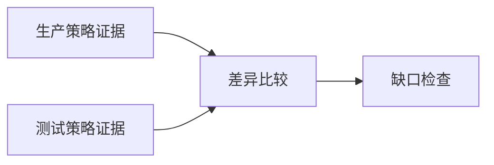

# Planner 怎样生成受限的 SearchPlan

Router 已把“比较生产与测试环境的重试策略，并解释差异”判定为 `deep`。这只说明任务可以使用多分支研究和更高 Evidence 预算，还没有回答该查哪些资料、两边怎样隔离、比较步骤依赖什么，以及资料缺失时何时停止。

**Planner（规划器）** 把复杂目标拆成候选分支。Runtime 随后把候选编译成 **SearchPlan（搜索计划）**，补入可信 Scope，验证通道、依赖与预算，确认无环后才允许执行。

模型负责提出可能有用的步骤，程序负责决定这些步骤是否可执行。这个边界能阻止计划通过自然语言扩大权限、调用不存在的工具或制造无上限循环。

## 计划解决的是可检查性

直接让 Agent 边搜边想，常出现三类失控。

第一类是范围混合。一次查询同时召回生产和测试文档，模型从生产证据拿到重试次数，又从测试证据拿到退避参数，拼成一套从未存在的策略。

第二类是依赖颠倒。比较分支在两边检索完成前就开始生成，后到的证据没有触发旧结论失效。

第三类是停止不明确。模型每遇到一个新名词就继续检索，没有研究轮次、分支数和 Coverage，系统只能等待它自己说“完成”。

SearchPlan 把目标、分支、依赖、范围、预算和停止条件放进结构化合同。执行器可以逐项记录状态，测试也能断言哪些分支在什么条件下可运行。
## 一条分支需要表达什么

适合知识检索的分支可以包含：

```text
SearchBranch {
  branch_id
  objective_dimension
  channel
  query
  scope_ids
  top_k
  deadline_ms
  depends_on
  expected_output
  status
}
```

`branch_id` 是执行、重试和合并时的稳定身份。`objective_dimension` 说明它覆盖问题的哪个维度，例如 `production_policy`。`channel` 可以是精确编号、全文、向量、表格或图谱。`expected_output` 描述完成证据，不等于要求模型预先写出答案。

分支不应把“检索生产策略并得出生产更严格”写在一起。检索产生 Evidence，比较节点读取两边 Evidence 后生成 Claim。把取证与结论混成一步，会让执行器无法判断结论是否在证据到达前生成。

一个初始候选可以表示为：

```json
{
  "branch_id": "production-policy",
  "channel": "fulltext",
  "query": "生产环境 重试 次数 退避 失败终点",
  "depends_on": []
}
```

模型不提供 `scope_ids`。这个字段由 Runtime 从当前 Turn 的授权快照注入，避免计划里的“搜索全部知识库”改变访问范围。
## 计划编译器建立可信边界

Planner 的模型输出只是 `BranchCandidate[]`。编译器按确定顺序处理：

1. 校验目标和候选 Schema。
2. 限制分支总数与查询长度。
3. 拒绝重复或空 `branch_id`。
4. 将通道限制在当前策略白名单。
5. 用 Turn 快照写入可信 Scope。
6. 限制每支 Top K、超时和总 Evidence。
7. 校验依赖 ID 并检测环。
8. 生成不可变计划版本。

若用户当前没有任何可见 Scope，编译器直接拒绝，不能自动退回公共库。若模型建议 `web` 通道，而当前 Agent 只允许内部知识检索，该分支应被拒绝或进入澄清，不能静默换成另一个工具。

预算要在编译时分配。各分支都写 `top_k=20`，并不代表总共只会产生 20 条 Evidence。执行器需要控制总候选、重排输入、最终 Evidence 和 Token 四层预算。分支局部上限与全局上限同时生效。
## 依赖图怎样决定并行与串行

生产和测试两支互不依赖，可以并行执行。比较节点依赖两者：



计划编译器用拓扑排序检测环。若 A 依赖 B、B 又依赖 A，没有合法执行顺序，应在任何检索调用前拒绝计划。

运行时只调度 `pending` 且所有依赖已 `completed` 的分支。依赖失败时，下游不会拿空值继续。它可以进入 `blocked_by_dependency`，由策略决定是否用部分结果交付，或生成替代分支。

并行完成顺序不能决定结果归属。每个回执携带 `branch_id`、计划修订、Scope 摘要和调用 ID。迟到的旧计划结果不能写进新修订的 EvidencePacket。
## SearchPlan 与普通 Todo 有什么差别

Todo 往往只有自然语言步骤和完成勾选。SearchPlan 还需要执行合同：

| 维度 | 普通 Todo | SearchPlan |
| --- | --- | --- |
| 身份 | 列表位置或文字 | 稳定 `branch_id` |
| 范围 | 隐含在描述里 | 可信 `scope_ids` |
| 依赖 | 人脑理解 | 可拓扑校验的 ID |
| 资源 | 通常不写 | Deadline、Top K、总预算 |
| 完成 | 手动勾选 | 结构化状态和 Evidence |
| 变更 | 直接改文字 | 新 revision 与原因 |

规划的深度不由步骤数量衡量。原子事实不需要三段计划，复杂研究也不能用二十条宽泛 Todo 冒充可执行图。一个分支应产生能被下游消费、可以独立判定成功或失败的结果。
## 覆盖度应对应问题维度

单一 `coverage=0.8` 容易掩盖关键缺口。比较任务可以先定义 Coverage Matrix：

| 维度 | 生产 | 测试 | 比较所需 |
| --- | --- | --- | --- |
| 重试次数 | 待取证 | 待取证 | 必需 |
| 退避方式 | 待取证 | 待取证 | 必需 |
| 失败终点 | 待取证 | 待取证 | 必需 |
| 例外条件 | 待取证 | 待取证 | 可选 |

每条 Evidence 经过验证后填充对应单元格。必需单元格全部覆盖，且没有未处理的版本冲突，才允许声明比较完成。总体分数可以用于排序和观测，不能让高比例的可选内容抵消一个关键空格。

Coverage 由程序根据已验证 Evidence 计算。模型可以提议“还缺测试环境退避方式”，不能自行宣布 95% 完成。Evidence 必须属于当前 Scope 和 Release，过期或冲突项不计入已覆盖。
## 停止条件同时看完成与资源

研究循环至少有这些停止原因：

```text
coverage_satisfied
critical_gap_unresolvable
research_round_limit
evidence_budget_exhausted
deadline_exceeded
cancel_requested
security_blocked
```

完成条件与资源条件语义不同。Coverage 满足表示任务已经拿到必需材料；预算耗尽表示系统必须停止，但结果可能不完整。对外回答要保留缺口，不能把“停止搜索”描述成“研究完成”。

Deadline 检查发生在创建新分支前，也发生在外部调用返回后。每支局部超时不能超过 Turn 剩余时间。取消信号到达后，不再调度新分支，运行中的只读操作按适配器能力取消或丢弃迟到结果。
## 补缺是计划修订，不是无限追加

首轮完成后，如果 `测试 × 退避方式` 为空，Planner 可以提出一个针对该单元格的补充候选。Runtime 重新执行通道、Scope、预算和无环校验，随后产生 `revision=1` 的 SearchPlan。

补充查询要携带 `target_gap`，并与现有分支签名去重。仅仅把原查询换几个近义词，Evidence 和 Coverage 都没有变化，应视为无进展。研究轮次达到上限后拒绝新增分支。

旧修订已完成的 Evidence 可以复用，前提是 Scope、Release 和内容版本仍一致。旧分支的迟到结果带着 revision 0 到达时，不得覆盖 revision 1 的状态。

计划发生实质变化时保存原因，例如 `missing_required_dimension:test_backoff`。这样回放时能解释为何增加了一次搜索，也能统计哪些维度长期难以检索。
## 可运行编译器展示了哪些规则

仓库示例实现候选编译、通道白名单、可信 Scope 注入、拓扑检查、可运行分支选择和有限补缺：

<<< ../../examples/ai-agent/search_plan.py

示例使用内存不可变对象，能证明控制逻辑和状态转换。它没有连接真实检索器，也没有实现数据库乐观锁、分布式调度、Evidence 去重或 ACL 查询。Fake 候选通过测试，只能说明本地编译器按预期拒绝了非法输入。

生产实现可以把 SearchPlan 保存为 JSONB 或规范化表，关键是计划版本、分支状态和 Evidence 引用要能原子更新。多个 Worker 领取分支时还要使用 Lease 或条件更新，避免同一副作用分支执行两次。
## 哪些 Planning 方式会坏

**过度分解**会让协调成本超过检索本身。每条分支都需要状态、调度、失败处理和合并。能在一次受限查询中稳定返回的同类字段，不必拆成多个 Agent。

**范围重叠**会产生重复 Evidence 和互相矛盾的摘要。每支应声明目标维度，编译器可检测相同通道、规范化查询和 Scope 的重复签名。

**让模型决定依赖完成**会产生竞态。分支状态来自执行记录，模型只能读取状态并提出候选。

**把输出长度当覆盖度**会奖励冗长回答。Coverage 绑定任务维度与 Evidence，不使用字数或段落数替代。

**遇到失败就重新规划全部任务**会丢失已经确认的证据。修订应指向具体缺口，只重做失败边界。
## 计划评测要断言控制流

Planning Eval 除了看最终答案，还要检查计划本身：

| 用例 | 关键断言 |
| --- | --- |
| 简单事实 | Router 不进入复杂 Planning |
| 跨范围比较 | 产生相互隔离的取证分支 |
| 未授权 Scope 出现在候选中 | 编译器仍只使用可信 Scope |
| 未知通道或工具 | 在执行前拒绝 |
| 循环依赖 | 无任何分支启动 |
| 并行分支乱序完成 | Evidence 按 ID 归并 |
| 必需维度缺失 | 只新增针对性补充分支 |
| 研究轮次耗尽 | 停止并报告缺口 |
| 旧计划结果迟到 | 不覆盖新 revision |
| 取消或 Deadline 到达 | 不创建新工作 |

观测记录计划修订、分支数、拓扑层级、每支状态、Evidence 新增量、Coverage 变化和停止原因。完整查询与文档正文留在受控存储，指标标签只使用稳定枚举。

Planner 的价值集中在一件事上：把“再深入查查”变成一个可以验证、调度、停止和回放的有限计划。计划经 Runtime 编译后才有执行资格，下一阶段的 Reflection 也只能在当前计划已经取得的 Evidence 范围内检查和修复答案。
