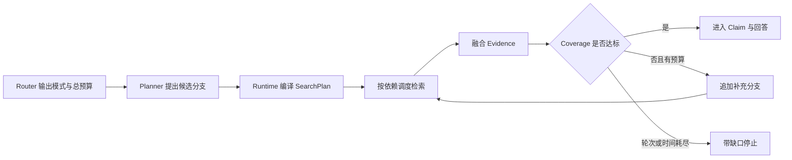

# Planner 怎样生成受限的 SearchPlan

“比较测试环境和生产环境的重试策略，说明差异及其原因。”这个问题不能靠搜一次“重试策略”稳定回答。系统要分别找到两个环境的配置或规范，核对版本和适用范围，再比较重试次数、退避方式、失败终点和例外条件。任意一边缺资料，都不能把单边结论写成完整比较。

Planner 负责把这类目标拆成可检查的检索分支。它可以提出“查测试环境策略”“查生产环境策略”“比较差异”等候选步骤，但不能自己扩大文档 Scope，也不能直接执行工具。Runtime 会把候选编译成受限的 **SearchPlan**，验证通道、依赖、预算和停止条件后才调度。

::: info SearchPlan 是执行合同

SearchPlan 描述查什么、通过哪个通道查、分支之间怎样依赖、最多查几轮、允许多少 Evidence，以及覆盖达到什么条件后停止。模型产生的是候选，Runtime 编译后的版本才可执行。

:::

规划的价值不在于步骤写得多。它让复杂目标、搜索动作和停止证据之间建立可追踪关系；简单事实本来一次检索就能完成时，不需要 Planning。

## 没有计划时，复杂查询会怎样失控

单次模糊查询往往把两个环境的内容混在同一候选列表里。模型看到生产策略的重试次数，又看到测试文档的失败处理，却不一定知道它们属于不同版本，最后会拼成一套不存在的方案。

另一种做法是让 Agent 边看边搜。模型每读到一个名词就生成新查询，分支越来越多，重复问题反复出现。没有 `max_research_rounds`、Evidence 预算和 Coverage，系统只能等模型自己说“够了”，停止条件无法测试。

依赖顺序也会丢失。比较步骤必须等两个环境的证据就绪；如果它与检索并行运行，只能根据空结果或旧状态下结论。模型稍后补到新证据，已生成的比较又没有明确失效机制。

SearchPlan 把这些隐含关系写进数据结构。执行器可以判断哪些分支已就绪，覆盖检查可以指出缺哪一侧，恢复时也知道哪些步骤已经完成。

## Planner、SearchPlan 与执行器的分工

Planner 接收 Router 选择的模式、用户目标、会话上下文、别名候选和当前 Evidence Gap。它擅长提出子问题和查询措辞，尤其适合处理同一个概念在不同文档里的表达差异。

SearchPlan 是编译后的不可变计划版本。它不保存模型的自由文本推理，只保留 Runtime 需要的字段：目标、分支、依赖、Scope、Top K、Deadline、研究轮次、Evidence 预算和最低覆盖率。

执行器读取计划，按依赖关系调度检索器。每个分支完成后保存候选、耗时、错误和状态；它不能修改目标，也不能把失败分支悄悄标成完成。Coverage 节点根据已取得的 Evidence 判断是否停止或申请补充查询。



Planner 不拥有工具权限。它提出 `channel=table`，Runtime 仍要确认该通道在当前部署中可用；它提出某个对象 ID，Runtime 要从授权 Scope 中核对。模型输出通过 JSON Schema 只是完成语法检查。

## SearchPlan 需要哪些字段

一份可执行计划可以用下面的对象表达：

```json
{
  "objective": "比较两个环境的重试策略与差异原因",
  "mode": "deep",
  "branches": [
    {
      "id": "test-policy",
      "channel": "fulltext",
      "query": "测试环境 重试策略 退避 失败处理",
      "scope_ids": ["environment-test"],
      "top_k": 20,
      "deadline_ms": 5000,
      "depends_on": []
    },
    {
      "id": "production-policy",
      "channel": "fulltext",
      "query": "生产环境 重试策略 退避 失败处理",
      "scope_ids": ["environment-production"],
      "top_k": 20,
      "deadline_ms": 5000,
      "depends_on": []
    },
    {
      "id": "compare",
      "channel": "table",
      "query": "重试次数 退避 终止条件 差异原因",
      "scope_ids": ["environment-test", "environment-production"],
      "top_k": 16,
      "deadline_ms": 5000,
      "depends_on": ["test-policy", "production-policy"]
    }
  ],
  "max_research_rounds": 2,
  "evidence_budget": 30,
  "minimum_coverage": 0.8
}
```

这个示例展示字段关系，不代表模型可以直接提交 `scope_ids`。生产实现应从认证和 Router 的范围快照注入 Scope，忽略候选计划里的同名字段。分支 Deadline 也受 Turn 剩余时间限制，不能因为每个分支都写了 5 秒，就让三个串行步骤得到 15 秒之外的新额度。

`objective` 要能判断完成状态。“调研重试”太宽，Coverage 无法知道什么算完成；“比较两个环境的重试次数、退避方式、失败终点和差异原因”明确了覆盖维度。目标仍不能承诺来源里不存在的结论，证据不足时允许输出缺口。

分支 ID 在一个计划版本内唯一，后续事件、Evidence 和错误都通过它关联。查询文本可以修订，ID 的含义不能在执行中改变。把 `test-policy` 从测试环境改成生产环境，会使历史结果和新步骤混在一起。

## 任务分解要围绕证据缺口

复杂任务的分解不是把问题平均切成几个句子。每个子问题应产生一类可以独立检查的 Evidence，并对最终目标承担明确职责。

比较任务通常按对象或维度拆分。对象之间没有依赖时，可以并行检索；比较或综合依赖这些结果，在 DAG 中后置。流程问题可以按输入、步骤、失败和验证拆分，但同一文档已经完整覆盖时，不要为每个标题发起一次重复检索。

好的子问题有稳定边界：知道查询对象、预期证据和完成条件。下面几种分解容易失控：

- “了解背景”“深入分析”没有可判断输出。
- 多个分支只换同义词，返回几乎相同候选。
- 子问题比原目标更宽，开始查询无关系统。
- 每取得一个新名词就继续拆，分支数量没有上限。
- 比较节点不声明依赖，在一侧为空时提前总结。

范围重叠不一定错误。全文和向量通道可以用同一查询寻找不同候选，融合时按稳定 Chunk 身份去重；两个分支若目标、Scope 和通道都相同，通常应合并。Planner 可以提出多种表达，编译器做规范化和去重。

分支上限只是防止失控的最后一道约束，编译器还应估算计划成本。每条分支至少声明检索通道、Top K、Deadline 和是否需要模型处理，Runtime 据此计算最坏调用数和关键路径时长。五条可以并行的全文查询与五条串行分析调用，虽然分支数相同，延迟和成本完全不同。

裁剪计划时先保留直接承担目标覆盖的分支，再处理增强项。比较两个环境，两个对象的基础策略查询不能删；额外的历史背景、相似案例和宽泛图谱扩展可以在预算不足时移除。依赖链上的上游分支也不能单独删除，否则下游永远不会就绪。

重复查询通过规范化文本、通道、Scope 和过滤条件共同判断。相同问题分别走全文与向量有融合价值，仍应保留不同身份；同一通道、同一范围、只换语序的两条查询可以合并，并把两个覆盖目标都挂到合并后的分支上。只按字符串去重会漏掉同义重复，只按 Embedding 相似度又可能误合并不同字段。

Deadline 分配要看依赖关键路径。两个独立检索分支各有五秒，并行时关键路径约为较慢的一条；后置比较再需要两秒，总计划不能只记录“每条五秒”而忽略串行部分。Runtime 从 Turn 剩余时间反推各分支截止点，无法满足最低路径时在执行前返回预算不足。

过度分解的观测信号包括：分支数上升但 Coverage 不变，大量分支返回同一批 Chunk，补充轮次重复原查询，以及综合阶段花时间处理与目标无关的 Evidence。修复应回到子问题职责和去重规则，单纯降低最大分支数只会截断症状。

::: tip 分解粒度由最终判断决定

某个分支的结果既不能单独验证，也不会改变最终回答，它多半不需要独立存在。把它合并到相邻查询，比维护一个没有职责的步骤更清楚。

:::

## 候选计划要经过编译

模型可以返回分支 ID、查询、通道候选和依赖，Runtime 负责把它编译成可执行对象。编译过程类似接收不可信配置：解析、规范化、注入可信字段、检查不变量，任一步失败都不调度检索。

基础检查包括：目标非空、分支数不超过模式上限、ID 唯一、通道属于允许集合、查询非空、依赖引用已存在。接着做拓扑排序，无法排序说明存在循环依赖。A 等 B、B 又等 A 时，增加超时只能让两个分支一起等待。

可信 Scope 由应用注入到每个分支。Planner 想查询 `environment-secret`，而当前授权只有测试和生产两个对象，编译器不会扩大集合。严格任务可以拒绝计划，普通知识查询也可以删除非法候选并记录 `scope_candidate_rejected`，是否允许部分计划由策略决定。

Top K、单分支 Deadline 和研究轮次按模式配置封顶。模型请求 `top_k=10000` 或 `max_research_rounds=99` 时，最好返回明确的约束错误，而不是静默执行。若选择截断，Trace 要保存候选值和实际值，让成本变化有解释依据。

编译成功后生成 `plan_id`、修订号和策略版本。执行中的组件只读取这个版本；Planner 的原始响应保留为受控审计材料，不再直接驱动分支。

## 拓扑执行保存每个分支的状态

计划创建后，所有分支从 `pending` 开始。依赖集合为空的分支可以进入 `running`；完成时保存 Evidence 引用或明确空结果，并转为 `completed`。依赖失败时，下游分支根据策略取消、降级或继续，不能把“未运行”写成“没有差异”。

对于示例计划，测试和生产两个策略分支先并行执行。两者都完成后，`compare` 才进入就绪集合。若生产分支超时，比较分支可以标为 `cancelled_due_to_dependency`，最终输出“生产环境资料未取得”，而不是只根据测试环境猜差异。

分支重试复用同一个 ID 和幂等键，记录尝试次数。纯检索通常可安全重试，涉及外部工具副作用时，执行前先查询回执或由工具合同提供幂等。SearchPlan 本身不赋予任何动作重复执行的资格。

完成状态不可被 Planner 重写。新的 Evidence Gap 只能追加尚未执行的补充分支，或创建计划修订；已经完成的查询、Scope 和结果继续保留。否则恢复后无法判断一个 Evidence 来自哪个查询版本。

调度器可以并行运行就绪分支，但要遵守全局和单用户容量。计划声明了五个独立分支，不代表运行时必须同时启动五个；资源不足时排队，Deadline 逼近时取消低优先级分支并记录缺口。

## Coverage 决定是否补充研究

Coverage 不是“搜到了多少段”。它衡量最终目标中的哪些问题已经有足够 Evidence。比较重试策略时，可以把覆盖项定义为两个环境各自的重试次数、退避方式、失败终点，以及差异原因是否有来源支持。

确定性 Coverage 可以先检查对象与字段是否出现，再用语义判断处理表达差异。只有模型评分、没有结构护栏时，Planner 容易被一段长而模糊的文档说服；只按字段计数，又可能把无关表格当成完整证据。两者结合时，结构规则负责下限，模型只评价内容相关性。

计划规定 `minimum_coverage=0.8` 和 `max_research_rounds=2`。覆盖达标就停止；未达标且还有轮次、时间和预算时，Coverage 节点输出具体缺口，例如“生产环境失败终点缺证据”，Planner 只为缺口生成补充查询。它不应重新规划已经确认的测试环境分支。

达到轮次上限时必须停止，即使 Coverage 仍然不足。最终状态带上覆盖比例、缺失主题和已用预算，回答明确哪些结论无法确认。无限迭代常见于 Planner 每轮都把同一个问题换一种说法，停止条件只能由 Runtime 强制执行。

覆盖达标也不代表事实没有冲突。相同对象的两个活动文档给出不同重试次数时，Coverage 可能是 1，但 Evidence 状态应标成 `conflict`，进入冲突处理或拒答。不能用更多相同立场的 Chunk 把冲突平均掉。

## 补充查询从 Evidence Gap 生成

第一轮研究结束后，Planner 不应再次接收原始目标并“重新想一遍”。Coverage 节点输出结构化缺口，至少包含缺失主题、对应对象、已经尝试的查询、空结果原因和剩余预算。Planner 只为这些缺口提出新分支。

```json
{
  "missing_topic": "生产环境的失败终止条件",
  "target_ids": ["environment-production"],
  "attempted_queries": [
    "生产环境 重试策略 退避 失败处理"
  ],
  "evidence_status": "partial",
  "remaining_rounds": 1
}
```

新查询需要提供新的检索角度。可以加入活动版本名、配置字段、错误码或 Alias，也可以从全文切换到结构化表格；只把“失败处理”改成“错误处理”，候选集合大概率不变。Runtime 为规范化查询计算指纹，与本轮和历史分支比对，重复时不再执行。

空结果原因会影响补充策略。查询确实没有候选，可以换通道或放宽非权限过滤；全部候选被 ACL 删除，必须停止该对象的搜索，不能扩大 Scope；检索器超时可以在总 Deadline 内重试；知识 Release 中根本没有目标对象，则把缺口保留到回答。四种情况都返回空列表，却不能采用同一动作。

补充分支还要继承原计划的目标和可信 Scope。模型只能缩小到 `environment-production`，不能增加一个未授权环境。它也不能提高总 Evidence 预算或研究轮次，新增分支使用剩余额度。分支加入后生成计划修订 1，修订 0 仍可审计。

缺口已由其他并发分支覆盖时，条件更新会拒绝迟到的补充计划。Planner 重新读取 Coverage，发现目标达标后停止；继续执行那条迟到查询只会浪费预算，并可能带入不同版本的证据。

## 计划状态要能持久化和重放

长任务不能只把 SearchPlan 放在进程内变量或 Prompt 中。计划、分支状态、Evidence 引用、Coverage、研究轮次和修订号需要进入持久层或工作流检查点。进程重启后，Runtime 从这些结构恢复，不要求模型回忆做到哪里。

一组最小事件可以是：

| 事件 | 记录内容 | 恢复用途 |
| --- | --- | --- |
| `plan.created` | 模式、目标、修订、分支摘要 | 还原初始执行合同 |
| `branch.started` | 分支 ID、尝试号、调用 ID | 判断是否有未知外部结果 |
| `branch.completed` | Evidence ID、空结果原因 | 跳过已完成检索 |
| `coverage.evaluated` | 比例、缺口、冲突、轮次 | 决定停止或补充 |
| `plan.revised` | 新分支和前一修订 | 解释计划怎样变化 |
| `plan.stopped` | 终止原因与剩余缺口 | 区分完成、超时和拒绝 |

事件顺序与数据库状态要保持一致。先发布 `branch.completed`、后写 Evidence，消费者可能读取一个不存在的结果；先提交状态、再发布事件，交付失败可以从持久状态重放。事件载荷保存稳定引用，不复制整段文档正文。

分支状态迁移是单调的：`pending` 可以进入 `running`，随后进入 `completed`、`failed` 或 `cancelled`。终态不能回到运行中，重试通过新的尝试号表示，不修改旧尝试。这样 Watchdog 才能区分真正卡住的分支和已经失败、等待策略裁决的分支。

检查点要绑定知识 Release、Policy 和 Scope 快照。恢复时当前活动版本可能已经更新，旧 Turn 仍按创建时快照完成，或者由策略明确取消；中途换版本会让前后 Evidence 无法比较。权限被撤回是例外，恢复前重新授权，失去访问权的 Evidence 不再交付。

计划修订后的结果复用也受这些快照约束。查询文本相同，但知识 Release 已更换，旧 Evidence 只能留作审计，不能填入新修订的覆盖项；Scope 或策略版本变化时同样如此。Runtime 至少比较查询指纹、检索通道、过滤条件、知识版本与授权范围，全部一致才可命中已有结果。这样既能避免重复检索，也不会把旧版本或已失去访问权的内容带进当前回答。

计划修订也使用乐观并发。保存修订 1 时要求当前仍为修订 0，两个补充提案只有一个成功。失败方读取最新状态，不能用整个旧计划覆盖数据库。已完成分支的状态和 Evidence 引用在任何修订中都不可变。

清理任务按 Turn 终态处理临时结果。可重建的查询缓存可以按版本过期，已经绑定到回答的 Evidence 记录保留稳定关系；取消中的分支先停止外部调用，再释放容量。清理动作本身要幂等，恢复进程可以重复执行而不删除其他 Turn 正在使用的对象。

## 完整推演一份比较计划

输入是比较两个环境的重试策略，Router 已选择 `deep`。身份层给出两个可见对象、活动知识 Release、策略版本和绝对 Deadline。Planner 只能看到脱敏目标、允许通道和别名，不接触提升权限的接口。

Planner 返回三个候选分支：两条全文查询和一个依赖它们的表格查询。Runtime 检查分支数小于上限，ID 唯一，通道允许，依赖图无环；随后把可信 Scope 写入分支，将 Evidence 预算限制为 30，创建计划修订 0。

调度器先运行两条无依赖分支。测试环境返回重试次数和固定退避证据，生产环境只返回退避方式，没有失败终点。两个分支都正常完成，比较分支随后运行，得到可对照的结构化字段。融合后 Coverage 为 0.67，缺口是生产环境失败终点。

当前研究轮次为 0，Deadline 仍足够。Planner 收到的不是全部历史，而是结构化缺口和已完成分支摘要，它追加 `production-failure-terminal`，计划修订变为 1。旧三个分支保持原状态，新分支只在生产 Scope 中查询失败终点。

补充分支找到当前版本的终止条件，Coverage 达到 0.83，Runtime 停止研究。Claim 阶段分别绑定两个环境的 Evidence，回答说明共同点、差异和来源；未覆盖的差异原因若没有证据，仍标为无法确认。

故障推演把补充分支改成不存在的通道 `shell`。编译器返回 `channel_not_allowed:shell`，检索调用次数保持为零，旧计划仍可读取。修复只重新生成这条候选，不重跑已完成分支。

## 可运行的计划编译器

下面的 Python 示例覆盖 SearchPlan 最容易出错的控制点。它不调用模型和真实检索器，只验证候选计划怎样变成受限计划。

<<< ../../examples/ai-agent/search_plan.py

`compile_plan` 从调用方接收可信 Scope，不允许候选分支自己决定范围。函数检查分支上限、ID、通道、查询和依赖，再做拓扑排序。`runnable_branches` 只返回依赖已完成的待执行分支；`mark_completed` 不允许重复完成同一分支。

Coverage 达标或研究轮次达到上限时，`should_stop` 返回真。还有预算时，`add_supplemental_branch` 只追加新分支并增加修订号，已经完成的分支保持不变。

测试推演包括：

1. `policy` 完成前，依赖它的 `compare` 不可运行；完成后才进入就绪集合。
2. 三个候选超过分支上限时拒绝，循环依赖无法通过拓扑检查。
3. Coverage 达到 0.8 或研究轮次达到 1 时停止；两项都未达到才允许继续。
4. 已完成分支在计划修订中仍为 `completed`，补充分支从 `pending` 开始。

运行命令：

```bash
PYTHONPATH=examples/ai-agent \
python3 -m unittest discover -s examples/ai-agent/tests -p 'test_*.py'
```

本次执行得到 `Ran 41 tests` 和 `OK`。这些结果只证明本地计划编译、依赖和停止逻辑，真实系统还需验证数据库检查点、检索通道、权限变化、并发调度和进程恢复。

## 计划失败怎样停止和恢复

计划生成失败发生在执行前。模型响应为空、JSON 无法解析、分支超过上限或依赖有环时，不启动任何检索。系统可以用确定性最小计划降级，例如只保留当前问题的一条全文查询；降级原因和原错误写入 Trace。

实体范围漂移属于安全失败。Planner 提出的对象不在当前 Scope，不能通过重试变合法。系统删除未授权候选或拒绝整份计划，取决于剩余分支能否仍然完成目标；无论哪种，都不能回退全库搜索。

分支依赖失败时保存原错误。超时可以在总 Deadline 内有限重试，明确权限拒绝直接停止该分支，空结果进入 Coverage 缺口。把三种情况都转成空列表，会让 Planner 误以为“资料不存在”，继续生成更宽查询。

进程在分支完成后退出，恢复时从持久状态读取 `completed` 和 Evidence 引用，不再调用该检索器。分支请求已发出但回执未知时，先用调用 ID 查询或按幂等合同重试。仅把计划保存在模型上下文中，无法做到这种恢复。

计划修订冲突时使用条件更新。两个 Coverage 节点都基于修订 0 追加补充分支，只有一个能提交修订 1；另一个重新读取缺口，发现问题已经覆盖后停止。最后写入者无条件覆盖会丢掉已完成分支。

## 测试计划质量，而不是计划长度

单元测试覆盖 Schema、分支上限、未知依赖、循环依赖、通道白名单、Scope 注入和停止边界。性质测试可以随机生成小型 DAG，断言拓扑结果始终先于依赖，任何计划都不会扩大可信 Scope。

离线样本要标注目标覆盖项和不可接受分支。一个比较问题可以有多种合理分解，不必要求模型逐字生成固定计划；评测关注是否覆盖两个对象、依赖是否正确、查询是否重叠过多、预算是否超限。

端到端测试准备一侧证据缺失、两侧结论冲突和检索器超时。断言 Planner 只补缺口，冲突不被当成达标，轮次耗尽后停止，回答保留未确认项。安全用例让候选计划请求越权 Scope 或未授权通道，确保执行次数为零。

观测指标包括计划生成失败、平均分支数、重复查询率、分支失败类型、Coverage、补充轮次和停止原因。分支数增加而 Coverage 不变，通常说明过度分解；补充轮次频繁命中同一查询，说明缺口生成没有利用已有证据。

策略升级时保存 Planner 模板版本、SearchPlan Schema 版本和通道配置版本。旧 Turn 恢复仍使用创建时的版本，不能用新 Schema 解释一半旧状态。无法兼容时隔离旧计划，完成或明确终止后再切换。

## 什么时候不需要 Planning

单一编号、负责人、日期和状态查询已经由快速检索稳定解决时，Planner 只会增加延迟。固定审批流程也适合确定性工作流，步骤、补偿和责任边界在代码里写清楚，比每次让模型重新规划更可靠。

Planning 适合目标可以拆分、分支依赖随问题变化、证据覆盖需要运行中判断的只读研究任务。它不适合把不可逆动作交给模型自由排列；涉及发送、删除、付款或发布时，模型最多提出候选，工作流与人工审批控制真正执行。

多 Agent 也不是复杂计划的默认答案。一个 Runtime 可以并行执行多条检索分支，只有子任务需要独立上下文、不同能力或隔离权限时，才考虑交给多个 Agent。SearchPlan 先把依赖和证据合同讲清楚，后续是否分配给多个执行者才有判断依据。

受限计划把模型擅长的任务分解与程序擅长的约束执行分开。Planner 提出怎样找，Runtime 决定能不能找、何时停止、失败后如何恢复。隐藏正文只看目标、分支、Coverage 和停止条件，也能还原这条学习链路。
