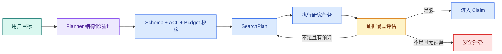

# Planner、SearchPlan 与停止条件：Agent 怎样决定查到哪里

“请帮我调查访问申请被拒的原因”不是一次查询。系统可能要先找申请条件，再找错误原因，最后确认当前版本。Planner 的职责是把目标拆成有限的研究任务；它不是把所有事情交给模型自由发挥。**SearchPlan** 是程序可以校验、执行、记录和停止的中间协议。

这篇文章要解决三个常见问题：**Planner** 和 Router 有什么区别，模型生成的计划为什么不能直接执行，以及 Agent 怎样知道“已经查够了”。最终产物是一份有限 SearchPlan、一个确定性校验器和一组可观察停止原因。

## Planner 不等于 Router，也不等于 ReAct 循环

Router 在有限选项中选择下一条路径，例如 `greeting / knowledge / blocked`。Planner 把一个目标拆成多个带证据目标和**预算**的任务，任务数量和参数可以随问题变化。ReAct 则常让模型在每一步根据 Observation 再决定下一 Action；如果没有轮次、工具和预算上限，它容易形成开放循环。

企业知识 Agent 可以组合三者：Router 先决定是否需要研究；Planner 一次生成有限计划；LangGraph 执行计划并评估缺口；最多允许一次有针对性的补搜。模型提出计划，确定性程序掌握权限、资源和停止权。

## Planner 输出什么

每个任务至少包括查询、证据目标、检索通道、优先级、最大结果数和是否允许补搜。计划还要绑定当前用户范围、知识 Release、最大轮次和绝对 Deadline。模型提出的是候选计划，程序负责删掉无效通道、裁剪过大预算和拒绝越权范围。



回边不是“再问模型一次”这么简单：每次补搜要记录新增证据目标，不能重复同一个查询，轮次和 Token 都从同一预算扣减。

逐节点读图：用户目标先进入模型 Planner，模型只产出候选 JSON。校验节点从 Runtime 注入 ACL、Release、可用通道和剩余预算，得到 accepted SearchPlan。研究节点执行后，覆盖评估器按证据目标计算缺口；覆盖足够进入 Claim，仍有缺口且预算允许才创建下一轮计划，其他情况进入有原因码的拒答。回边最多执行预先声明的轮数。

## Planner 的输入也需要契约

如果把所有历史、全部工具说明和整个知识库目录直接塞给 Planner，它会消耗大量 Token，还可能被检索内容中的指令污染。Planner 输入应由上下文编译器构造，通常只包含：

- 当前问题和经过验证的实体/指代；
- 用户选择的文档范围摘要，而不是完整 ACL 内部结构；
- 当前知识 Release 标识与允许通道；
- 已完成查询哈希、已有证据目标和缺口；
- 最大分支数、每路 Top-K、研究轮次和剩余 Deadline；
- 固定的结构化输出 Schema。

身份、权限 subject、数据库连接和密钥不需要进入模型。Planner 只需知道“允许在范围 R 内使用 sparse/dense/table”，实际 Scope 由执行器在服务端绑定。

## 三类问题的计划差异

原子事实问题通常一条 Exact 或全文任务就够；对比问题需要两个实体使用相同字段查询；流程问题需要顺序证据和版本条件。计划类型不同，**停止条件**也不同，不能只用“召回到 K 条”判断完成。

错误码“E102 是什么”属于原子事实：目标是得到一条当前版本的明确定义，精确命中就可以停。比较“A 和 B 的权限差异”至少有两个对称目标，只有 A 的证据不能算完成。流程问题“申请被拒后怎么处理”需要条件、原因和处理步骤，召回十条都只讲原因仍然覆盖不足。

因此，K 是候选数量上限，不是完成条件。完成条件应围绕 required goals 或 Claims，而不是“搜到了几条”。

| 问题 | 子任务 | 足够条件 |
| --- | --- | --- |
| 错误码含义 | Exact 错误码 | 找到现行版本直接定义 |
| A 与 B 差异 | A/B 同字段检索 | 两边字段均有证据 |
| 被拒如何处理 | 条件、原因、处理 | 每个步骤都有可见证据 |

## 计划 Schema

下面用 Pydantic 约束计划。模型输出 JSON 后先解析，再执行预算和重复查询规则；这段代码可以独立运行。

下面把“计划 Schema”落成最小实现。代码关注“SearchPlan 约束证据目标、步骤、依赖和预算，Scope 与 Release 不允许由 Planner 生成”；输入从函数参数或上文定义的状态对象进入，关键分支负责校验或修改状态，返回值再交给后续调用。

```python
# SearchPlan 约束证据目标、步骤、依赖和预算，Scope 与 Release 不允许由 Planner 生成。
from __future__ import annotations

from pydantic import BaseModel, Field, field_validator


class SearchTask(BaseModel):
    query: str = Field(min_length=1, max_length=160)
    channel: str
    evidence_goal: str = Field(min_length=1, max_length=120)
    max_results: int = Field(ge=1, le=20)

    @field_validator("channel")
    @classmethod
    def supported_channel(cls, value: str) -> str:
        # 先按可信范围裁剪候选，越权数据不会进入后续排序、缓存或返回值。
        allowed = {"exact", "sparse", "dense", "table"}
        if value not in allowed:
            raise ValueError("unsupported retrieval channel")
        return value


class SearchPlan(BaseModel):
    tasks: list[SearchTask] = Field(min_length=1, max_length=4)
    round: int = Field(ge=1, le=2)


# 校验函数在数据进入下一阶段前执行，失败时返回稳定错误或直接阻断。
def validate_plan(plan: SearchPlan, *, remaining_tokens: int) -> SearchPlan:
    unique_queries = {task.query for task in plan.tasks}
    # 数量约束用于发现截断、重复或越界返回，失败时不能把不完整结果交给下一步。
    if len(unique_queries) != len(plan.tasks):
        raise ValueError("plan contains duplicate queries")
    estimated = sum(task.max_results * 80 for task in plan.tasks)
    # 外部调用前检查整轮剩余时间；超时后停止继续消耗模型、工具和数据库资源。
    if estimated > remaining_tokens:
        raise ValueError("plan exceeds evidence budget")
    return plan


# plan 是校验后的执行契约，可信 Scope、版本和预算由程序合并。
plan = SearchPlan.model_validate(
    {
        "round": 1,
        "tasks": [
            {"query": "访问申请 条件", "channel": "sparse", "evidence_goal": "资格", "max_results": 5},
            {"query": "访问被拒 处理", "channel": "dense", "evidence_goal": "处理步骤", "max_results": 5},
        ],
    }
)
print(validate_plan(plan, remaining_tokens=1000).model_dump())
```

`SearchTask` 限制通道和结果量，避免模型生成任意数据库查询。`validate_plan` 用简单的候选数估算消耗，并拒绝重复查询；真实系统还应加入 Token 估算、Deadline、用户 scope 和已执行查询哈希。计划可以因为证据不足新增一轮，但不能把 `round` 重置为 1。

### 模型字段和 Runtime 字段要分开

上面的 Schema 只展示最小计划。放进 Runtime 时，字段要按所有者拆开：

| 字段 | 谁产生 | 模型能否修改 | 原因 |
| --- | --- | --- | --- |
| `objective`、`evidence_goal`、`query` | Planner | 可以，经 Schema 校验 | 属于语义拆解 |
| `channel`、`top_k` | Planner 建议 | 只能在白名单和预算内 | 影响资源与能力 |
| `scope_ids` | 服务端 | 不可以 | 权限边界 |
| `release_id` | Runtime 快照 | 不可以 | 可复现性 |
| `deadline_at` | Runtime | 不可以 | 全局停止条件 |
| `max_rounds`、`evidence_budget` | 策略版本 | 不可以 | 成本与可靠性 |
| `previous_query_hashes` | 执行器 | 不可以 | 防止重复搜索 |

不要让模型在 JSON 里自行填写 `user_id`、ACL 或 Deadline，再由程序“相信它”。模型输出只承载语义意图，服务端在接受计划时附加权限和资源事实。

## 把停止条件写成纯函数

停止条件不要散落在 Prompt 里。它读取覆盖结果、轮次、预算、Deadline、取消状态和新候选数量，返回有限决策及原因码。这样可以单元测试，也能在事件中解释“为什么没有继续查”。

```python
# 停止函数只读取覆盖、无进展、动作数和 Deadline，返回可审计终态而不再次调用模型。
from dataclasses import dataclass
from enum import StrEnum


class NextAction(StrEnum):
    GENERATE = "generate"
    RESEARCH_AGAIN = "research_again"
    REFUSE = "refuse"
    CANCEL = "cancel"
    EXPIRE = "expire"


@dataclass(frozen=True)
class ResearchProgress:
    required_goals: frozenset[str]
    covered_goals: frozenset[str]
    round: int
    max_rounds: int
    remaining_tokens: int
    remaining_seconds: float
    new_candidate_count: int
    cancel_requested: bool = False


@dataclass(frozen=True)
class StopDecision:
    action: NextAction
    reason: str


def decide_next(progress: ResearchProgress) -> StopDecision:
    # 收到取消信号就提交取消状态并返回，后面的工具调用和结果写入都不能再发生。
    if progress.cancel_requested:
        return StopDecision(NextAction.CANCEL, "user_cancelled")
    # 外部调用前检查整轮剩余时间；超时后停止继续消耗模型、工具和数据库资源。
    if progress.remaining_seconds <= 0:
        return StopDecision(NextAction.EXPIRE, "deadline_exceeded")

    missing = progress.required_goals - progress.covered_goals
    if not missing:
        return StopDecision(NextAction.GENERATE, "coverage_complete")
    if progress.new_candidate_count == 0:
        return StopDecision(NextAction.REFUSE, "no_new_evidence")
    if progress.round >= progress.max_rounds:
        return StopDecision(NextAction.REFUSE, "round_limit")
    # 外部调用前检查整轮剩余时间；超时后停止继续消耗模型、工具和数据库资源。
    if progress.remaining_tokens < 300:
        return StopDecision(NextAction.REFUSE, "evidence_budget_exhausted")
    return StopDecision(NextAction.RESEARCH_AGAIN, "targeted_gap_search")
```

`required_goals - covered_goals` 得到仍缺证据的目标。取消和 Deadline 优先级最高，即使证据刚好够也不能继续生成。覆盖完整时进入生成；没有新候选说明重复搜索很可能无效；轮次和 Token 不够则安全停止；只有仍有新信息、轮次和预算都允许时，才进入一次定向补搜。

300 只是可执行示例的策略阈值，不是通用数字。生产值来自策略版本，并应包含生成、引用和验证的预留 Token。不能把全部预算都花在检索候选上。

## 停止条件如何可观察

停止条件至少包含：证据覆盖目标达到、没有新候选、剩余预算不足、Deadline 到期、用户取消、发现权限问题。每次停止都写代码和描述，后续 Eval 才能区分“正确停止”和“过早停止”。

权限问题不进入 `decide_next` 的普通缺口逻辑。若执行器发现计划扩大 Scope 或证据 ACL 复核失败，应直接产生安全拒绝/失败原因，不能把越权当作“再搜一次也许有结果”。

## 练习

给计划增加 `required_claims`，让每个 Claim 对应一个证据目标。测试重复查询、未知通道、超过任务数、超过预算和覆盖完成五条路径。再说明你的问题为什么需要一轮还是两轮。

先用下面的参数化测试固定停止优先级：

```python
# 示例计划把多目标问题拆成有限步骤，并显式写出依赖、证据槽和无法继续时的动作。
import pytest


# 参数表覆盖证据已齐、仍有缺口、轮次耗尽和 Deadline 到期四种停止条件。
@pytest.mark.parametrize(
    ("progress", "expected_action", "expected_reason"),
    [
        (
            ResearchProgress(frozenset({"条件"}), frozenset({"条件"}), 1, 2, 800, 5.0, 2),
            NextAction.GENERATE,
            "coverage_complete",
        ),
        (
            ResearchProgress(frozenset({"条件", "步骤"}), frozenset({"条件"}), 1, 2, 800, 5.0, 3),
            NextAction.RESEARCH_AGAIN,
            "targeted_gap_search",
        ),
        (
            ResearchProgress(frozenset({"步骤"}), frozenset(), 2, 2, 800, 5.0, 1),
            NextAction.REFUSE,
            "round_limit",
        ),
        (
            ResearchProgress(frozenset({"步骤"}), frozenset(), 1, 2, 800, 0.0, 1),
            NextAction.EXPIRE,
            "deadline_exceeded",
        ),
    ],
)
def test_stop_decision(
    progress: ResearchProgress,
    expected_action: NextAction,
    expected_reason: str,
) -> None:
    # 模型或路由器给出候选动作后，Runtime 仍要校验类型、参数和剩余预算。
    decision = decide_next(progress)
    assert decision.action is expected_action
    assert decision.reason == expected_reason
```

第一组证明覆盖完整就生成；第二组只有一个目标缺口且资源充足，允许补搜；第三组即使出现新候选，轮次已满也拒绝继续；第四组证明 Deadline 优先于补搜。再增加 `cancel_requested=True` 用例，确认它优先于 coverage complete。

把测试保存到 `test_planner.py` 后执行 `pytest -q`，预期输出 `4 passed`。如果把 Deadline 判断放到 coverage 判断之后，第四个用例会错误返回 `generate` 并失败；这说明测试验证的是停止顺序，而不是只验证每个分支单独存在。生产实现还应把 `reason` 写入结构化事件，方便 Eval 区分早停、预算耗尽和正常覆盖。

## Planner 的输出不是执行命令

Planner 负责把用户目标转换成候选研究任务，执行器负责校验并运行。计划中的 query、channel 和 evidence_goal 都来自模型，必须经过白名单、长度、重复和预算检查；Scope、Release、身份、Deadline 和最大轮次来自 Runtime，不能由 Planner填写。校验失败时可以修复一次格式，但权限和预算冲突直接停止。

## SearchPlan 怎样进入状态图

第 1 轮计划只基于原问题和已知约束，分支完成后把结果按 goal 聚合。若某个 required Claim 没有证据，Planner 第 2 轮只能针对缺口生成新任务，并携带 `previous_query_hashes` 避免重复。达到 round=2、没有新候选或 Deadline 不足时进入拒答。这样计划循环有可见的回边和停止原因，不是让模型无限“再想一步”。

第二轮输入不应再次包含所有原始候选，只需要缺失目标、已执行查询哈希、已有证据摘要和剩余预算。例如第一轮已经覆盖“申请条件”，只缺“处理步骤”，第二轮若又生成“申请条件”查询，校验器应按规范化哈希拒绝。规范化可以处理大小写、空格和已知别名，但不要用过度模糊的相似度把两个真正不同的问题误判为重复。

| 状态 | 输入 | 允许动作 | 输出 |
| --- | --- | --- | --- |
| planned | 原问题、约束 | 校验任务 | accepted/rejected plan |
| researching | accepted plan | 执行只读通道 | branch results |
| gap_found | Claim 缺口 | 生成一次补搜 | round 2 plan |
| covered | 全部目标有证据 | 进入生成 | evidence package |

## 计划评测看覆盖而不是文案

固定问题集标注 required Claims 和允许通道，比较 Planner 是否覆盖所有目标、是否生成重复任务、平均候选数、额外 Token 和停止原因。计划文字写得漂亮没有意义；只要漏掉一个必需目标、扩大范围或超过预算就应失败。

初学者最后要能拿着一个问题手写这张卡：目标是什么、需要哪些证据、每条任务查什么通道、最大结果数、完成条件、最多补搜几轮、何时拒答。写不出停止条件的计划，不允许进入执行器。

## 常见问题

### SearchPlan 与模型的隐藏思维过程有什么区别？

SearchPlan 是应用可见、可校验的执行数据，包含任务 ID、查询、通道、依赖、结果上限和停止条件；隐藏思维不应作为日志或协议。Planner 可以利用模型生成候选计划，Runtime 只执行通过 Schema、Scope、工具白名单和预算校验的字段。Trace 记录计划与实际动作，不需要也不应保存模型私有推理。

### 一个计划步骤至少需要哪些字段？

至少要有稳定 ID、目标或待证明内容、动作类型、查询参数、依赖、最大结果数和完成条件。可信 Scope、Release、Deadline 与资源限制由 Runtime 注入，不由模型填写。字段越自由，Executor 越难判断是否完成；自然语言 Todo 可以帮助人阅读，但不能代替可执行契约。

### 怎样验证计划没有依赖环？

把 step ID 与 dependencies 建成有向图，先拒绝未知 ID、自依赖和重复 ID，再用拓扑排序检查是否能取出所有节点。Executor 每轮只运行依赖已完成的 ready 集合；若仍有未完成步骤却没有 ready，说明存在环或不可满足依赖，进入稳定失败。不要让模型在运行中凭描述猜哪个步骤先做。

### Planner 的停止条件应该写在哪里？

计划对象声明最大步骤、研究轮次和每个目标的覆盖条件，Runtime 维护实际计数、绝对 Deadline、重复动作和证据预算。Prompt 可以说明目标，却不拥有计数。每轮后 Coverage 节点判断 Claim 是否有可见证据、是否出现新候选和继续搜索的收益；条件不满足或预算耗尽就结束或拒答。

### 什么时候允许重新规划？

工具返回新实体、计划通道不可用或 Coverage 明确缺口时，可以在剩余预算内基于结构化 Observation 重新规划。重规划次数有限，不得改变可信 Scope、Release 和总 Deadline，也不能重复已经确认的副作用。若上一轮没有新增候选或只是同一错误重现，应停止而不是用不同措辞再生成一份计划。
