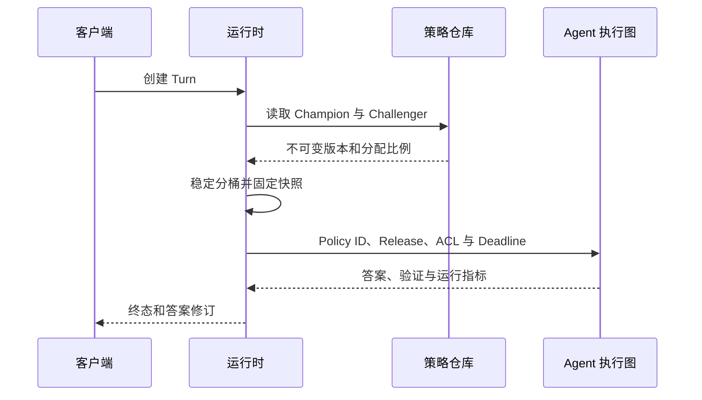
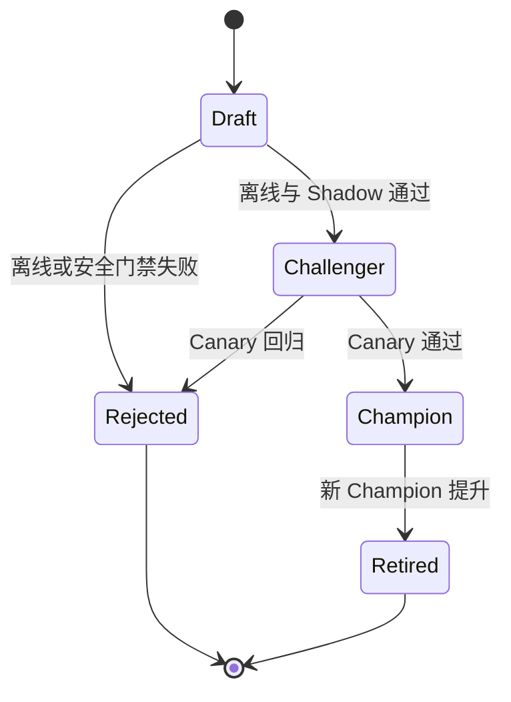

# Agent 策略怎样版本化、灰度与回滚

一个 Agent 昨天还能稳定回答，今天开始频繁漏引用。模型服务没有变，检索索引也正常，最后发现有人直接修改了线上 Prompt。数据库只记录“使用某模型”，没有保存 Prompt、工具目录、检索预算和验证阈值，当时的请求已经无法重放。即使把 Prompt 改回去，旧缓存和正在运行的 Turn 仍可能继续使用混合配置。

Agent 的行为由一组配置共同决定：模型、Prompt、工具能力、模式路由、检索参数、Token 与时间预算、验证器、修复上限和质量门禁。只给模型名加版本远远不够。它们需要组成不可变的 **PolicyVersion**，每个 Turn 在开始时固定版本，发布系统再控制新版本进入多少流量、何时提升，以及出现回归时怎样停止。

策略治理包含两条链。请求链在毫秒级回答“这次动作是否允许、使用什么预算”；发布链在小时或天的尺度上回答“哪份策略可以进入流量”。前者可以由应用规则或 Open Policy Agent（OPA）执行，后者依赖离线评测、Shadow、Canary、审计和回滚。两条链都必须留下版本与决策证据。

::: info 策略不替代权限与业务状态

Policy 可以规定“只有某角色才能调用写工具”，当前用户是否拥有角色仍由认证和授权系统确认。模型输出、用户输入和策略文本都不能自行创造身份、租户 Scope 或业务事实。

:::

## 配置、Feature Flag 与 PolicyVersion 分别负责什么

普通配置保存服务如何运行，例如地址、连接池和日志级别。Feature Flag 控制某项功能是否对一组主体开放。PolicyVersion 描述一次 Agent 决策所需的完整行为快照，并带有状态、父版本、分配比例和质量门禁。

Feature Flag 可以决定用户进入旧版或新版 Agent，但若新版内部 Prompt 和预算仍能热改，Flag 只切换了一个不稳定目标。PolicyVersion 先把目标固定，Flag 或稳定分桶再选择版本。配置管理负责分发，策略仓库负责不可变身份和生命周期，二者不能合并成“读取最新 JSON”。

一份策略通常包含下面几组内容：

| 组别 | 示例 | 为什么要固定 |
| --- | --- | --- |
| 模型与适配器 | 模型标识、参数、输出契约 | 同一 Prompt 在不同模型上的行为可能不同 |
| Prompt 资产 | 系统提示版本、模板哈希 | 文字热改会让历史请求无法重放 |
| 工具能力 | 目录版本、允许工具、审批级别 | 能力变化会改变最坏副作用 |
| 路由与检索 | 模式、Top K、研究轮次、重排器 | 影响证据范围、成本和延迟 |
| 上下文与预算 | Token、Deadline、动作和修复上限 | 决定停止位置与资源消耗 |
| 验证与安全 | Claim、Citation、ACL、注入和隐私门禁 | 决定哪些候选可以交付 |
| 质量门禁 | 指标、阈值、最小样本和红线 | 决定候选能否发布 |

大型文本资产不必全部复制进策略行，可以保存不可变资源 ID 与哈希。运行时按 ID 读取内容并核对摘要，不能只存一个会被覆盖的文件路径。工具 Schema、模型适配器和验证器也要有可追踪版本。

PolicyVersion 的生命周期至少区分 `draft`、`challenger`、`champion`、`retired` 和 `rejected`。一个知识范围通常只有一个活动 Champion，Challenger 只接收受控比例。Retired 保留读取与审计，不能重新接流量；Rejected 保存失败原因，不能被静默改成另一个候选。

## 组件职责和状态所有者要分开

策略仓库是 PolicyVersion 的唯一事实来源，负责不可变配置、父版本、状态、分配比例和质量门禁。普通运行时只能按 ID 读取，不能在请求处理中修改策略。创建候选、提升和回滚通过版本化命令进入发布事务，并记录操作者与原因。

策略编译器读取 Prompt、工具 Schema、规则和阈值引用，验证依赖存在、字段类型正确、规则可以编译，再生成配置摘要或 Bundle。编译器不决定候选是否上线；它只回答这份制品能否被确定地加载。缺失资源、哈希不符和规则冲突都让 Draft 停留在不可发布状态。

请求决策引擎拥有某一次 Policy 输入到 Decision 的计算，不拥有用户身份、资源 ACL 或业务数据。调用方提供可信字段，引擎返回允许、拒绝、原因码和限制。版本路由器拥有主体到 Policy ID 的稳定映射，不得修改 Policy 内容。Agent 执行图只读取选中的快照，并把 Policy ID 写入模型、检索、工具和验证 Trace。

评测器拥有样本运行和指标明细，不能直接提升版本。发布控制器读取完成的离线、Shadow 与 Canary 指标，按质量门禁改变状态和分配。监控系统提供窗口是否闭合、样本是否完整和红线是否命中；发布控制器不能把尚未到齐的数据当成通过。

缓存、Worker 和长任务都属于 PolicyVersion 的消费者。它们分别保存缓存键、进程内快照和 Checkpoint 引用，不能各自判断“最新配置”。发布事件通知消费者准备新版本，实际切换由活动指针和请求路由决定。边界清楚后，事故才能定位到配置内容、路由、评测、发布事务或消费者缓存，而不是统一归因于“策略系统”。

## 每个 Turn 在开始时固定策略快照

请求到达后，运行时先读取可信身份、知识范围和发布状态，再通过稳定规则选择 Champion 或 Challenger。选择结果写入 Turn，包括 Policy ID、知识 Release、ACL 快照引用、模型版本和请求 Deadline。后续所有节点只读取这份快照。

稳定灰度不能每次调用都随机。一个多轮会话在 Champion 与 Challenger 之间跳来跳去，回答差异会污染记忆，也无法比较两个版本。可以对知识范围、用户或会话和策略 ID 做哈希，得到 `0` 到 `99` 的桶；Challenger 分配 10% 时，桶值小于 10 的主体稳定进入新版本。

分桶主体按实验目标选择。评估一次 Turn 的独立检索调整，可以按请求分配；涉及对话、记忆和工具状态时，应按用户或会话保持粘性。企业环境还要避免同一组织内协作用户看到互相冲突的规则，必要时按租户分桶。分配键属于发布配置，必须记录。



运行期间 Champion 即使发生切换，已经开始的 Turn 仍使用原版本，除非安全团队执行紧急停止。长任务恢复时从 Checkpoint 读取 Policy ID，策略仓库必须能继续解析旧版本。若旧版本已经因严重漏洞被禁止恢复，任务以稳定安全状态结束，而不是自动换新策略继续执行一半。

缓存键包含 Policy ID 或配置摘要。Prompt Cache、检索缓存、模式决策和验证结果都可能受策略影响；回滚只切活动指针而不处理缓存，会让新策略的派生结果继续进入旧版本。缓存失效规则在策略发布前就要定义。

## 请求策略引擎把规则从业务代码中分离

工具授权、预算与环境差异常被写成层层 `if`。规则散落在 API、Worker 和工具适配器后，同一动作可能在一个入口允许、另一个入口拒绝。策略引擎用统一输入评估规则，返回结构化 Decision，业务代码负责执行结果。

OPA 是一种可选实现。它读取 JSON 输入与策略数据，使用 Rego 规则计算允许、拒绝、约束和原因。Agent 运行时把可信身份、任务、环境、工具、参数摘要、预算和 Policy ID 传入；用户输入和模型候选只能进入规定字段，不能覆盖可信身份。

```json
{
  "subject": {"tenant_id": "tenant-a", "roles": ["editor"]},
  "action": {"tool": "write_report", "risk": "medium"},
  "resource": {"scope_id": "workspace-7"},
  "runtime": {"environment": "production", "remaining_steps": 4},
  "policy_version": "policy-v12"
}
```

策略输出不要只给 `true` 或 `false`。运行时还需要稳定原因码、要求的审批、收窄后的预算和可审计规则 ID：

```json
{
  "allow": true,
  "reason_codes": ["role_allowed", "scope_match"],
  "required_approval": "none",
  "limits": {"max_steps": 4, "max_output_bytes": 65536},
  "policy_digest": "sha256:..."
}
```

拒绝规则应拥有更高优先级。工具未登记、租户范围不匹配、生产删除动作无审批、预算已经耗尽时，任何宽泛 Allow 都不能把它覆盖。预算取多个来源中的更小值：全局上限、策略上限、任务剩余额度和工具自身限制，不接受模型要求的更大值。

### 用 Rego 表达拒绝与预算约束

下面的 Rego 片段只演示结构。它拒绝跨 Scope 动作，并把可用步骤限制在策略上限与任务剩余额度之间：

```rego
package agent.execution

default allow := false

scope_match if {
  input.subject.tenant_id == input.resource.tenant_id
  input.resource.scope_id in data.allowed_scopes[input.subject.tenant_id]
}

denied contains "scope_mismatch" if {
  not scope_match
}

allow if {
  scope_match
  count(denied) == 0
  input.action.tool in data.allowed_tools
}

max_steps := min([
  input.runtime.remaining_steps,
  data.limits.max_steps,
])
```

规则只引用结构化输入与版本化数据。不要在 Rego 里重新解析自然语言问题来猜用户意图，也不要用关键词特判某一个测试标题。意图解析先产生候选，可信身份和资源范围由应用补入，策略只处理可验证字段。

## 安装 OPA、加载策略并运行测试

OPA 的[官方下载与运行说明](https://www.openpolicyagent.org/docs/latest/#running-opa)列出了各平台二进制与容器方式。macOS 使用 Homebrew 时可以执行：

<figure class="doc-shot">
  
  <figcaption>OPA 官方文档的安装与运行入口。生产环境应锁定二进制或镜像版本，并核对发布校验值。</figcaption>
</figure>

```bash
brew install opa
opa version
```

其他平台从官方 Release 下载对应二进制，赋予执行权限后先运行 `opa version`，确认架构与版本。不要从文章附件或未知镜像站下载策略引擎。生产镜像固定版本和校验摘要，升级时重新编译并测试全部策略包。

把上一节规则保存为 `policy/agent.rego` 后，可以用 `opa eval` 传入 JSON 文件观察决策，用 `opa test` 运行策略单元测试：

```bash
opa eval \
  --data policy \
  --input fixtures/allowed-write.json \
  'data.agent.execution'

opa test policy -v
```

输入 Fixture 分别覆盖允许、未知工具、跨租户、预算耗尽和生产高风险动作。测试同时检查 `allow`、原因码与收窄后的限制。策略编译失败、数据缺失或引擎不可用时，高风险动作失败关闭，不能默认允许。

部署可以采用 Sidecar 服务，也可以把 OPA 作为库嵌入。Sidecar 便于独立更新和观测，但增加网络调用与可用性依赖；嵌入方式延迟低，应用与策略引擎升级耦合更紧。无论哪种形式，运行时都要记录策略摘要与决策，不能只记 HTTP 200。

策略通过 Bundle 或等价制品发布。构建阶段完成格式、编译、单元测试和签名，运行实例拉取后先验证，再原子切换活动 Bundle。热更新不能在同一请求中混用两个版本。加载失败时继续使用上一份已验证策略，并产生告警。

## 决策缓存必须包含主体、资源和版本

策略判断通常很快，复杂规则或远程 Sidecar 仍可能需要缓存。缓存键要覆盖 Policy 摘要、主体权限修订、动作、资源 Scope、环境和会影响结果的预算等级。只按工具名缓存 `allow=true`，很容易把一个管理员的决定复用给普通用户。

允许与拒绝的 TTL 可以不同。权限撤销需要快速生效，缓存最好绑定权限修订而不是只等时间过期。紧急策略发布时，新的 Policy 摘要自然形成新键；回滚后旧 Champion 缓存能否复用，要看知识、ACL 和工具目录是否仍匹配，不能一概恢复。

带剩余预算的 Decision 不适合长期缓存。第一次还有四步，第二次只剩一步，复用旧上限就会越界。可以缓存与预算无关的基础授权，再在进程内用当前状态计算实际较小值。审批结果也绑定动作指纹和有效期，不能混入通用策略缓存。

缓存命中后仍记录 Decision ID、Policy 摘要和命中来源。遇到越权事故时，需要知道引擎当时直接评估还是读了旧缓存。缓存服务不可用可以回到策略引擎，策略引擎也不可用时按动作风险执行失败关闭或低风险降级。

## 新策略先离线比较，再进入 Shadow

候选策略来自人工修改、反馈归纳或优化任务。无论来源如何，先创建 Draft，保存父版本、配置摘要、变更说明、创建人和适用范围。自动优化器只能修改明确白名单字段，例如检索 Top K、研究轮次、模式和 Prompt 版本；工具、ACL 和安全门禁不能由反馈数据自动放宽。

离线评测使用固定数据集与当前 Champion 对照。指标要覆盖检索命中、证据召回、Claim 支持、引用准确、任务完成、延迟和资源。权限泄露与提示注入成功属于红线，不能用平均质量提升抵消。样本不足、某项指标缺失或评测器错误时，候选不进入流量。

阈值来自业务风险和历史分布，不照搬示例数字。每个指标记录分母、数据集版本和评测器版本。只保存一个百分比，无法判断它来自五条样本还是五千条，也无法解释下一次结果变化。

离线通过后进入 Shadow。线上请求仍由 Champion 交付，Challenger 使用相同的脱敏输入和固定快照在旁路运行，结果不发给用户，也不能执行有副作用的工具。系统比较答案质量、动作候选、验证问题、延迟和成本。Shadow 如果共用生产写工具，就不再是旁路评测。

旁路运行要设独立配额，不能拖慢主请求。对实时性强或涉及秘密的输入，可以只重放脱敏的离线 Trace，不复制完整用户内容。Shadow 结果保存策略与数据版本，避免后来拿不同 Evidence 比较两个答案。

## Canary 用稳定人群验证线上行为

Shadow 无法覆盖用户对话、真实依赖抖动和前端体验。Challenger 通过 Shadow 后进入小比例 Canary，稳定分桶把一组主体持续路由到新版本。每个 Turn 写入策略 ID，指标按 Champion 与 Challenger 分开聚合。

Canary 至少同时观察质量、安全、可靠性和成本。质量包含 Claim 支持、引用与用户明确反馈；安全包含权限泄露、注入成功和被阻断的高风险动作；可靠性看失败、超时、取消、恢复与空结果；成本看模型调用、Token、检索和工具资源。不能只看 HTTP 错误率。

观察窗口要同时满足时间和样本条件。刚发布十分钟没有报错，不代表低频路径已经覆盖；一直等不到最小样本，也不能让 Challenger 永久占着灰度状态。到最大观察期限仍不足时，回滚或暂停并说明样本不足，不自动提升。

指标具有延迟，尤其是人工反馈和异步评测。发布控制器只使用完整窗口，水位未闭合时不扩大比例。严重安全红线可以实时触发回滚，普通质量指标等窗口稳定后判断。告警规则区分绝对红线和统计波动。

灰度比例的变更也是发布事件。扩大前保存上一比例、决策人、指标快照和原因。比例变化后重新计算观察窗口，不能把 10% 阶段的旧样本全部当成 50% 阶段证据。对高风险版本可以逐级扩大，不要求每个系统采用相同阶梯。

## 提升与回滚要原子修改活动状态

Challenger 满足全部门禁后，提升事务同时把旧 Champion 标为 Retired、新版本标为 Champion 并把分配设为 100%。数据库约束应防止同一范围出现两个 Champion。发布记录保存离线、Shadow 与 Canary 指标，以及最终决策。

Canary 出现红线或显著回归时，先把 Challenger 分配降为零并标记 Rejected，Champion 继续承接流量。正在使用 Challenger 的短 Turn 可以按原快照安全完成；包含高风险工具或已确认漏洞的任务立即取消。两种处理要在策略里提前定义。

回滚不等于删除新版本。保留配置、指标、触发原因和受影响 Turn，才能修复和回归。也不要在线编辑 Rejected 版本，修改后创建新的子版本。不可变历史避免“同一个 Policy ID 昨天和今天内容不同”。



模型路由、Prompt Cache、检索缓存和工具目录都要按回滚版本恢复。活动指针切回后，新请求只读取旧 Champion；后台 Worker 定期扫描是否还有新版本任务、旧缓存和待审批动作。回滚完成的证据包括流量分配、缓存命中、任务数量和关键指标恢复，不只是控制台显示“成功”。

## 一个可运行示例怎样固定发布状态

共享 Python 示例实现不可变 PolicyVersion、稳定分桶、配置白名单、离线门禁、提升与回滚。它不连接数据库或 OPA，只验证发布控制的核心状态规则。

<<< ../../examples/ai-agent/policy_governance.py

直接运行示例：

```bash
python3 examples/ai-agent/policy_governance.py
```

输出当前主体选中的策略 ID 与配置摘要。分桶结果取决于示例身份，但同一输入重复运行保持一致。

单元测试覆盖稳定分桶、自动优化不能修改工具和 ACL、最小样本与安全红线失败关闭、Champion/Challenger 的提升和回滚：

```bash
PYTHONPATH=examples/ai-agent \
  python3 -m unittest examples/ai-agent/tests/test_policy_governance.py
```

这些测试只证明内存状态机与纯函数。生产集成测试还要覆盖并发发布锁、唯一 Champion 约束、事务失败、策略 Bundle 校验、Worker 缓存失效和长任务恢复。故障注入在提升事务中断开数据库，确认不会出现两个 Champion 或零 Champion；在回滚时让缓存服务不可用，确认高风险请求不会继续命中新版本。

## 审计要能还原一次决策和一次发布

请求审计记录 Turn、Policy ID、策略摘要、规则 ID、Decision、原因码、动作指纹、输入字段摘要和执行结果。敏感正文不进入普通日志，身份与资源用稳定 ID 表示。决策缓存命中也要记录原 Decision ID。

发布审计记录候选父版本、变更字段、创建者、测试制品、各阶段指标、分配变化、批准人、提升或回滚原因。两个审计通过 Policy ID 连接，可以从一次异常回答追到当时策略，再看到它为什么进入流量。

关键指标包括策略评估延迟、允许与拒绝数量、原因码分布、缓存命中、加载失败和 Bundle 新鲜度。发布侧观察每个版本的 Turn、失败、拒答、验证问题、权限泄露、注入成功、用户反馈和资源。标签只使用有界的 Policy ID、状态与错误类，不把问题正文或用户 ID 放进指标标签。

策略引擎不可用、策略加载失败和业务规则拒绝是三种状态。前两种属于平台故障，第三种是正常安全结果。告警按责任组件区分，避免每次合法拒绝都触发故障报警，也避免引擎错误被包装成“策略不允许”。

## 失败怎样沿治理链传播

Draft 编译失败时，错误留在候选，Champion 不受影响。发布任务保存资源 ID、配置摘要、编译错误和工具版本，修复后创建新候选或新修订。直接改原 Bundle 再用同一个 Policy ID 重试，会让失败记录和后来成功的制品无法区分。

请求时策略引擎超时，运行时先看动作风险。只读、公开、无副作用的请求可以按已验证本地快照降级，并记录 `policy_engine_degraded`；写操作、跨租户访问和高风险工具失败关闭。引擎恢复后不能补发已经拒绝的动作，用户重新创建请求并重新授权。

Canary 指标延迟会让发布控制器停在观察状态。超过最大窗口仍缺样本或分母不完整，候选回滚或等待人工决定，不能把缺数据解释为零错误。若安全红线已经出现，立即把 Challenger 分配降为零，不必等待普通质量窗口结束。

并发发布需要按知识范围加锁，并在事务中检查预期 Champion。两个候选同时提升时，后提交者发现活动版本已经变化，应以冲突结束并重新基于新 Champion 评测，不能覆盖先提交的版本。数据库的唯一约束是最后保护，发布服务仍要返回可理解的冲突状态。

活动指针已经回滚，某个 Worker 仍缓存 Challenger 时，Worker 应在开始 Turn 前核对策略状态或消费版本失效事件。已经启动的安全任务按快照完成，高风险漏洞版本则由撤销清单阻断恢复。监控比较活动分配与实际 Turn 的 Policy ID，发现回滚后仍有新 Challenger Turn 就告警。

回滚事务失败要区分“分配尚未切回”和“分配已切回但审计未写完”。前者继续阻断新发布并重试幂等事务，后者以活动状态保护流量，再补齐审计。发布 API 返回超时不能驱使调用方盲目重放，先按发布命令 ID 查询终态。

策略规则本身互相冲突时，拒绝优先并不意味着问题已经解决。编译或测试阶段应发现同一输入同时命中不兼容效果，例如一条规则要求人工审批，另一条规则允许自动执行。Decision 保留命中的规则 ID，冲突策略失败关闭，避免依赖规则文件加载顺序决定结果。

## 自动优化的边界要比人工发布更窄

反馈可以指出检索不足、表达过长或引用错误，但单条反馈不能直接改线上 Prompt。先筛除越权、注入和不完整证据，把合格反馈聚合成候选方向，再在固定评测集上验证。反馈内容本身属于不可信数据。

自动优化器只修改低风险白名单参数，并设置上下界。它不能新增写工具、放宽 ACL、关闭验证器、提高安全修复次数或改变租户范围。候选仍走离线、Shadow 和 Canary，不因“自动生成”获得更快通道。

人工作者修改高风险字段时，需要代码评审或双人批准，策略测试必须覆盖拒绝路径。紧急安全补丁可以缩短普通质量观察，却不能跳过安全测试、版本记录和回滚点。紧急通道本身也要审计。

模型和外部 Judge 不负责决定自己是否发布。它们可以产生评分候选，确定性门禁读取指标和阈值作裁决。Judge 版本与 Prompt 同样固定，避免候选用一套标准、Champion 用另一套标准。

## 策略治理的代价与适用边界

不可变版本、评测流水线、Shadow 和 Canary 增加存储、计算、发布延迟与运维复杂度。小型只读助手可以先固定 Prompt、模型、工具与验证配置，保留 Policy ID 和手动回滚；有写操作、多租户、自动优化或长任务的系统需要完整发布链。

OPA 适合跨服务共享、规则频繁变化且需要独立审计的场景。规则很少、只在单进程使用时，类型化的应用策略函数可能更易维护。无论采用哪种实现，都要保证可信输入、版本化规则、拒绝优先、测试与审计，不能为了引入 OPA 把简单判断拆成难以理解的远程依赖。

稳定灰度降低一次性风险，却延长两个版本并存的时间。策略、缓存、记忆和长任务都要支持版本共存，团队还要有足够样本和监控分辨差异。低流量系统可能更适合离线回放加人工验收，再在可控时间窗口整体切换。

设计评审可以从一条历史 Turn 反推：能否取回完整策略资产，能否说明主体为什么进入该版本，能否重放当时的 Decision，能否看到每个门禁的分母和版本，回滚后是否还有新请求使用 Challenger。任何一项只能靠聊天记录或操作者记忆回答，治理链就还有缺口。

评审记录还要写明未覆盖的样本和仍需人工判断的风险，避免把一次通过解释成永久安全。

策略治理完成后，任何一次回答都能定位到完整行为快照；任何一个候选都要经过同一组公开门禁；出现回归时，活动版本、缓存和运行任务都有明确处理。否则“可以回滚”只是一句发布口号。
