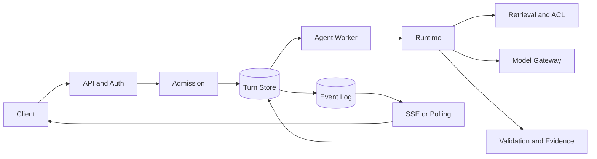

# 生产 Agent 的组件职责与失败传播

生产 Agent 不是把一个模型 URL 放到 API 后面。一次请求会经过身份与准入、Turn 持久化、异步 Worker、上下文装配、检索、模型、工具、证据验证和事件交付。每层都可能超时、拒绝、部分成功或失去连接，组件之间还共享数据库、缓存、队列和供应商配额。

架构要先回答两件事：**谁拥有哪种状态**，以及**一层失败后谁决定下一步**。模型只能提出候选，Runtime 决定控制流，数据库保存权威状态，Worker 执行异步步骤，SSE 或轮询交付已经提交的事件。没有明确的所有者，故障就会变成多个组件互相重试。

::: info 用四类状态分开看系统

- **领域状态**：Turn、权限快照、Release、Policy、Checkpoint 和终态，由数据库负责。
- **执行状态**：队列消息、Owner Lease、Attempt、Deadline 和取消信号，由 Runtime 与协调存储负责。
- **能力状态**：模型、向量库、对象存储、浏览器和外部 API 的可用性与配额，由各适配器负责。
- **交付状态**：事件序号、客户端游标和连接，由事件表与 API 负责。

:::

## 先看一条生产请求的完整链路

API 收到问题后，先认证并检查知识库访问权限，再以幂等键创建 Turn。准入控制在昂贵工作开始前分配全局、租户和用户容量。数据库提交 Turn、Release、Policy 和 ACL 快照后，消息只携带 `turn_id` 进入 Agent 队列。

Worker 取得执行 Lease，读取固定快照，调用 Runtime。Runtime 先做查询理解和安全检查，再按模式决定是否检索、是否调用工具以及是否需要模型。检索结果带来源和权限，模型只接收可见证据，答案生成后经过 Claim、Evidence、引用、ACL 和隐私校验。

验证通过后，Runtime 在事务中写入答案、终态和事件序号，通知服务端有新事件，Worker 释放 Lease 并确认队列消息。浏览器通过 SSE 按游标重放；连接断开不会触发第二个 Turn。



图中的能力服务不直接更新 Turn。检索、模型和工具返回结构化候选，Runtime 根据状态版本与策略快照决定是否写入。数据库、事件表和通知之间也不构成一个全局事务，必须有对账和幂等路径。
## API、Runtime 与 Worker 各自拥有不同决策

API 负责协议、认证、授权、幂等和低成本输入校验。它不应该等待模型完成，也不应从自然语言错误里推断是否可以重试。创建 Turn 失败时释放准入名额；同一幂等键再次到达时返回已有 Turn，而不是重新排队。

Runtime 负责领域状态机和控制流。它保存当前阶段、模式、Release、Policy、ACL、预算、Deadline、尝试次数和停止原因。Runtime 决定“要不要检索”“是否进入规划”“验证失败后是否有限修复”，但不直接实现每个供应商的 HTTP 细节。

Worker 负责把 Runtime 推进到下一个安全边界。它处理队列、执行 Lease、续租、超时、取消和重试，进程失联后由恢复扫描或工作流引擎接管。Worker 不拥有永久业务状态，重启后必须从 Turn 与 Checkpoint 恢复。

模型网关只负责模型选择、认证、超时、流式适配、Token 统计和供应商错误归一化。它不能替 Runtime 判定权限或把未经验证的 JSON 写成业务字段。检索服务负责查询理解、候选召回、过滤、排序和证据来源，不负责生成答案。

验证器读取 Claim、Evidence、ACL 与 Policy，输出支持、缺证据、越权、注入或格式错误等稳定结果。它可以拒绝或要求有限修复，不能用新的模型调用覆盖确定性失败。事件交付只读取已经提交的事件，不改变答案。

### 控制面和数据面要分开

控制面保存租户策略、模型路由、工具目录、容量上限、Release、Policy 和版本发布状态。它的更新需要权限、审计和生效时间，不能由正在运行的 Agent 直接修改。数据面处理具体 Turn，读取控制面已经发布的快照；一个 Turn 从创建到终态不跟随控制面实时漂移。

这层分离解决两个容易混淆的问题。管理员发布了新的检索范围，不代表正在生成的答案可以换上下文；模型供应商临时降级，也不代表用户权限发生变化。控制面变更形成新版本，数据面在下一个 Turn 选择它，恢复旧 Turn 仍使用创建时的版本。

控制面故障时，已有 Turn 可以使用最近一次合法快照继续，新的高风险 Turn 进入拒绝或排队。数据面故障时，控制面仍可发布修复，但不能把“策略发布成功”展示成“答案执行成功”。发布与执行分别有健康检查和回滚点。

组件图还要画出同步调用和异步边界。API 同步等待的只有认证、幂等和 Turn 创建，模型、检索、工具和事件交付走 Worker。若产品要求首字节快速返回，可以让 API 先返回 Turn ID，再由 SSE 提供增量；不要把所有下游调用串在一次 HTTP 超时里。
## 数据归属决定一致性边界

Turn 数据库保存问题、状态、快照和终态，必须能按 Revision 与 Owner 校验并发写入。事件表保存对外可见的有序事件，终态事件只允许一个。Redis 可以保存准入集合、执行 Lease、取消快速信号和通知高水位，但 Redis 丢失时数据库仍是业务事实。

对象存储保存原始文件、解析产物和大体积模型结果，数据库只保存对象 ID、内容哈希、版本和状态。向量库、全文索引和图谱是 Release 的投影，不是上传事务的一部分；索引失败会让 Release 停在未激活，不能把半套投影当当前版本。

跨存储提交要采用明确顺序。先写 Turn 再投递消息可能产生“已创建、未执行”，需要 Outbox 或恢复扫描；先占容量再写 Turn 可能产生短暂泄漏，TTL 与幂等释放兜底。先写事件再提交业务会让客户端看到不存在的答案，事件应和领域事务一起提交，通知放在提交之后。

一致性不是所有地方都强一致。权限、Release、终态和答案引用需要强校验；实时通知可以丢失后回查；指标和 Trace 可以最终一致。把“通知晚到”当成“业务状态丢失”，会触发错误补偿。
## 同步链拆分后才有明确的失败所有者

一个同步调用链若依次等待 ACL、查询理解、三路检索、Rerank、模型和验证，任一依赖变慢都会占住 API 或 Worker。每一段都要有自己的 Deadline 和剩余时间，不能每层重新开始计时。Runtime 将剩余时间传给下游，超时后停止新动作，保留已经获得的证据。

检索三路并发时，某一路超时不必让另外两路重跑。结果集合记录通道、开始结束时间和错误类，融合器按最小证据要求决定继续、降级或拒答。模型超时后，已写入的检索结果可以留在 Checkpoint，下一次只重试模型或进入安全停止。

数据库事务不跨越模型和网络调用。先在数据库事务中读取快照并提交“准备执行”，关闭事务后调用模型，回来后以 Revision、Owner 和版本条件更新。把一个数据库连接保持到模型返回，会占用连接池，并让事务锁与外部延迟相互放大。

外部写动作使用 Outbox 或动作账本。数据库事务先写待发送 Action，独立执行器取得 Action ID 后调用下游并记录回执。这样 Worker 失联时可以重试或核对，不需要在一个事务里同时锁住用户状态和第三方请求。

重试沿链路向下传递会产生乘法。API 重试三次、Runtime 重试两次、模型 SDK 再重试三次，单个用户动作可能触发十八次模型请求。总预算由 Runtime 统一分配，每层只消耗自己的额度并把剩余值传下去。
## 失败传播沿责任链停止

入口认证、ACL、准入和幂等属于确定性门禁。失败在这里结束，不调用模型、不创建检索任务，也不消耗昂贵配额。数据库不可用时不能安全创建 Turn，返回服务错误并让客户端稍后重试；不能只在内存里接收请求。

检索无结果与检索服务不可用不是同一错误。无结果可以形成“当前范围没有证据”的安全拒答；服务不可用可以在 Deadline 内有限重试，或转入排队。模型限流只重试模型调用，不能让已经成功的检索和外部工具全部重跑。

答案验证失败要保留原答案、失败规则和证据集合。缺少 Claim 支持时可以补检索或有限修复，ACL 越权、Prompt Injection 和隐私违规直接拒答。外部工具副作用未知时进入 Unknown，先查询 Action ID 或人工确认，不猜测执行失败。

事件交付失败不回滚已完成 Turn。SSE 断线、Redis 通知失败和代理缓冲都由游标重放或状态轮询处理。只有事件表提交失败才回到 Runtime 的事务补偿，不能因为浏览器没有收到帧就重复调用模型。

| 故障 | 允许的动作 | 禁止的动作 | 终态或证据 |
| --- | --- | --- | --- |
| ACL 拒绝 | 结束请求 | 继续检索 | `permission_denied` |
| 准入满载 | 排队或返回 429 | 创建未受控任务 | `queued` 或拒绝 |
| 检索无证据 | 安全拒答 | 让模型补造来源 | 缺证据 |
| 模型限流 | 只重试模型 | 重跑全部链路 | Retry 记录 |
| 外部动作未知 | 查询回执或人工处理 | 盲目重做 | `unknown` |
| SSE 断线 | 游标重放 | 新建 Turn | 连接层事件 |
## 用一次过载请求推演降级

假设知识助手同时收到三类请求：普通问答、深度研究和批量文档查询。全局模型容量已接近上限，向量服务的延迟上升，某个用户已有一个 Running Turn。

第一条普通问答通过用户准入，但检索超时。Runtime 读取剩余 Deadline，若已经没有安全重试空间，就写入“无法在当前时间内取得证据”的拒答事件。模型没有收到空上下文，不会根据记忆补一个答案。

第二条深度研究被全局容量拒绝，API 返回稳定的 `global_limit`。它没有创建 Turn，也没有占用浏览器和检索资源。客户端可以稍后提交新意图，不能自动发十次请求绕过限制。

第三条用户重复点击，幂等查询返回已有 Turn。即使第一条消息已经进入队列，第二次也不会再占用户名额。Worker 领取时发现原 Owner 仍活跃，重复消息退出或延迟。

向量服务恢复后，新的请求才进入检索。旧的拒答是否允许重试，由业务选择“保留当时结果”还是创建一个新的 Turn 决定；后台不能偷偷改变用户已经看到的答案。

| 阶段 | 状态 | 决策者 | 失败传播 |
| --- | --- | --- | --- |
| 入口 | Pending | API 与准入 | 拒绝或排队 |
| 执行 | Running | Runtime 与 Worker | Retry、取消或接管 |
| 检索 | Retrieving | 检索适配器 | 缺证据或依赖失败 |
| 生成 | Synthesizing | 模型网关与 Runtime | 限流或超时 |
| 验证 | Validating | 确定性验证器 | 修复、拒答或完成 |
| 交付 | Completed | 事件 API | 重放或轮询 |
## 隔离、重试和降级要有预算

每个依赖都有自己的超时、重试次数和并发池。模型、Embedding、Rerank、OCR、浏览器和数据库连接不共享一个无限 Semaphore。资源 Lease 获得失败时在准入层拒绝或排队，运行中 Lease 丢失则停止新动作。

重试预算包括次数、总耗时、Token、费用和下游请求数。检索的三种通道同时失败时，不应让每个通道各自指数重试；统一的 Runtime 重试预算决定是否缩小查询、使用缓存或安全拒答。缓存命中后仍要按当前用户 ACL 再过滤，不能把缓存当权限旁路。

隔离可以按队列、租户、资源类别和风险等级实现。高风险工具调用使用独立 Worker 与沙箱，普通问答不应被它拖垮。舱壁隔离会牺牲一部分共享利用率，换来故障范围可控；容量设计要记录这种取舍，而不是只看平均吞吐。

熔断器只根据可观测的依赖错误和恢复窗口打开。打开后新请求立即走降级，不在每个请求里再发一次探针。半开探针使用最小请求和临时资源，成功后逐步恢复流量。模型质量下降但 HTTP 正常时，熔断器不会自动发现，仍需 Eval、Evidence 覆盖和人工反馈。
## 安全边界贯穿组件调用

API 解析用户身份，Runtime 保存 ACL 快照，检索在候选阶段执行过滤，模型只看当前可见证据，验证器再次检查引用。工具调用带租户、用户、Scope、Policy 和 Deadline，Worker 不能因为重试就使用新权限或扩大范围。

Prompt Injection 来自文档、网页和工具结果，属于不可信内容。检索层标记来源，Context 装配把指令与资料分隔，Runtime 禁止模型通过文本修改 Policy、Release、用户身份和工具权限。高风险动作要求额外审批或沙箱，不依赖模型自我承诺。

日志、Trace、事件和缓存都有隐私等级。指标只放稳定 ID、版本和错误类，Prompt、文档正文、Token、凭证和用户问题进入受控存储。删除请求要同时处理对象、索引、事件 Payload、缓存和导出文件，不能只删数据库主记录。
## 多租户隔离不能只靠一个 user_id

租户边界至少出现在身份、数据范围、容量、缓存、队列和观测六个位置。检索查询带 `tenant_id` 与 ACL 过滤，缓存键包含租户和 Release，Action ID 不跨租户复用，事件接口先检查 Turn 所属租户。只在 API 入口检查一次，后续 Worker 重试或恢复时仍可能越过范围。

租户容量分为全局、租户、用户和资源池。一个租户可以有更高的研究配额，却不能突破全局模型和数据库上限。公平调度避免高配额租户长期占住所有 Worker，低优先级任务通过等待时间逐步提升，仍受 Deadline 限制。

缓存命中和共享索引尤其容易泄露。回答缓存必须绑定问题规范化结果、Release、Policy、ACL 范围和模型路由；命中后再做当前用户过滤。向量相似度候选先标记来源，再由确定性 ACL 过滤，不因为“向量分数高”直接交给模型。

租户级观测允许管理员看本租户的延迟、拒绝和成本，但不能在指标中暴露另一个租户的 ID 或问题内容。平台运维可以看到跨租户聚合，详细 Trace 通过受控审计访问。租户删除需要撤销活动 Lease、取消 Turn、删除或隔离对象与索引，并等待异步清理完成。
## SLO 和错误预算决定何时降级

Agent 的 SLO 至少拆成 API 接受率、Turn 终态率、首个事件延迟、终态延迟、证据支持率和安全违规率。SSE 连接保持时间不能代替终态延迟，模型 HTTP 200 也不能代替证据支持。每个指标的分母和排除项要固定，否则降级后成功率看起来反而上升。

错误预算被消耗时，先减少高成本模式、并发和重试，再考虑关闭普通能力。安全拒答、权限拒绝和用户取消不应算成基础设施失败，但要分别统计。质量预算和可用性预算冲突时，越权或无证据答案优先停止交付，不能用可用率抵消。

降级策略要在发布前写成状态和事件。检索不可用时是排队、返回历史快照还是安全拒答，取决于问题是否允许旧数据；模型限流时是换低成本模型还是等待，取决于 Policy 和证据要求。客户端看到稳定原因后才能展示“稍后重试”“当前范围没有依据”或“需要人工确认”。

错误预算还指导容量扩容。队列年龄持续上升但模型配额空闲，优先检查 Worker、数据库和路由；模型限流占比上升，扩 Worker 没有帮助；证据支持率下降，即使延迟很好也不能继续扩大流量。每项扩容动作都应绑定可回滚的指标变化。
## 发布、回滚与版本快照

一个 Turn 从创建到完成要固定 Runtime Version、Policy Version、Knowledge Release、模型路由策略和工具目录版本。新版本不应让正在运行的 Turn 半途切换到另一套规则。兼容升级先读旧快照，再让新 Turn 使用新版本；不能兼容时排空或隔离队列。

回滚不只是切换容器。要检查旧 Worker 是否能读取新状态、新事件和缓存键，索引 Release 是否仍可用，模型路由是否会把旧策略送到新模型。回滚演练在外部动作前后分别 Kill，核对 Action ID、终态和事件是否可恢复。

Canary 按租户、用户或稳定幂等键分流，比较错误类别、拒答原因、证据覆盖、Token、延迟和资源租约，不只看平均成功率。安全违规、越权证据、双副作用和事件序号冲突属于立即停止发布的红线。

发布排空分三步。先停止入口创建需要旧版本的高风险 Turn，再让旧 Worker 处理已经领取的任务或保存 Checkpoint，最后确认队列、Lease、Outbox 和 SSE 连接达到可接受水位。新 Worker 先以旁路队列启动，读取旧快照、回放旧事件并运行无副作用探针，确认后才接收真实流量。

数据库迁移采用向后兼容顺序：先添加可选字段和索引，再发布能同时读写旧新格式的代码，完成回填和对账后才删除旧字段。事件 Payload、缓存键、对象 Manifest 和向量 Release 也遵循同样顺序。只升级 API 而不升级 Worker，会让已入队消息落到未知 Schema。

知识 Release 的 RAG、Wiki、图谱和 ACL 投影要逐项报告状态。文档入库成功不代表向量可检索，向量成功不代表图谱和 Wiki 已发布，图谱成功也不代表当前用户能看见节点。激活动作只在所需投影都达到 Ready、权限版本一致且失败任务已处理后执行。

恢复对账按稳定 ID 连接 Turn、队列消息、Action、事件、对象和索引。发现“数据库 Completed、队列仍有消息”时，消息走终态快速路径；发现“对象已上传、Release 未激活”时，清理或重试索引；发现“事件有终态、答案缺证据”时，进入人工核验。每种对账结果都有幂等修复，不用一条全局重跑命令覆盖所有状态。

运行手册还要记录人工操作的权限、原因、开始结束时间和影响范围。回收 Lease、重投消息、切换模型、暂停租户和删除对象都必须可审计，操作前先确认活动 Owner、Deadline 和外部副作用状态。紧急修复结束后重新运行状态、权限、事件与资源检查，不能只看服务健康探针。
## 用最小故障路由示例验证边界

下面的示例把 API、准入、检索和模型状态压缩成内存依赖，用来验证确定性降级。它不启动网络服务，也不代表真实供应商的延迟或可用率。

<<< ../../examples/ai-agent/production_flow.py

运行测试：

```bash
PYTHONDONTWRITEBYTECODE=1 PYTHONPATH=examples/ai-agent \
  python3 -m unittest examples/ai-agent/tests/test_production_flow.py
```

测试故意让数据库不可用、模型限流、检索无证据和重复请求分别发生。每条路径只执行允许的依赖调用，输出稳定原因，便于把同样的判断搬到真实 Runtime。
## 生产验证覆盖状态、依赖和交付

契约测试检查 API、Runtime、检索、模型网关、事件和状态接口的输入输出、版本和错误码。状态机测试断言终态单调、Owner 与 Revision 生效、取消和 Deadline 不再创建新动作。

依赖故障注入分别关闭数据库、Redis、模型、向量库、对象存储、事件通知和外部工具。每个故障都要有负责人、超时、重试、降级和恢复动作。模拟“请求在提交前崩溃”“动作成功后崩溃”“事件提交后通知失败”三个窗口，检查是否产生幽灵容量、重复副作用或无主 Turn。

容量测试按资源类别和租户分布发起长任务，观察队列最老年龄、Lease、数据库池、模型并发和事件吞吐。高并发下不能只测平均延迟，要确认拒绝原因稳定、SSE 不会把数据库轮询压满、低优先级任务不会永久饥饿。

安全测试覆盖越权文档、间接提示注入、伪造 Tool Call、跨租户缓存、旧 Release、撤销用户权限和日志泄露。模型返回结构化结果后仍要通过 ACL、Evidence、Privacy 和 Policy 门禁。

运行手册从 `turn_id` 查领域状态、Release、Policy、Owner、Checkpoint、依赖调用、Action ID 和事件游标。先确定故障层，再执行重试、补偿、取消、恢复或回滚；不要先清空 Redis、删 Lease 或重跑全部任务。

故障演练结束后不要只记录“请求返回错误”。验收表至少核对四件事：Turn 是否进入允许的终态或保留明确 Owner；容量、Lease、数据库连接和临时文件是否释放；用户和租户范围是否仍然正确；SSE、状态接口和审计 Trace 是否能解释发生了什么。四项中有一项无法回答，就把演练留在未通过状态，先补观测或恢复路径。

例如新模型路由发布后发现引用支持率下降，回滚只影响新 Turn。已经在生成中的 Turn 继续使用创建时的 Policy、Release 和模型路由快照，完成后按同一验证器验收；如果 Worker 在模型调用前退出，恢复任务读取旧快照并回到兼容队列。数据库、事件和 Action 记录把这次回滚标为部署原因，不把旧 Turn 混成新版本的质量样本。

降级响应也要标记来源和有效期。检索暂时不可用时返回的历史快照、部分证据或排队状态，不能写进“正常答案缓存”；恢复后同一个问题是否重新计算，由新的 Turn 或明确的刷新命令决定。缓存命中必须保留 Release、Policy、ACL 和降级原因，过期后自动失效，避免用户长期看到过时或不完整的结果。

发布后的对账要有明确窗口。切换新版本后，先观察创建成功率、队列年龄、Lease 超时、终态事件重复和 Evidence 支持率，再扩大分流范围。对账任务按 `turn_id`、`action_id` 和事件序号读取两套版本的记录，发现旧 Worker 写入新 Schema、事件缺帧或索引 Release 未激活时，只修复对应对象并保留原始错误证据。

观察期内不要批量删除旧镜像、旧事件或回滚快照，确认没有活动 Owner 和未完成外部动作后再清理。这样回滚仍然有事实可查，问题也不会被一次全量重跑掩盖。## 什么时候不需要这套生产架构

单机脚本、一次性离线分析和没有外部副作用的短调用，可以用函数和少量日志完成。引入队列、事件、Lease、模型网关和多套投影，会增加部署、测试和数据治理成本。

当任务已经需要多用户并发、长时间执行、知识版本、权限隔离、可恢复交付和质量评测时，组件化架构才有足够收益。复杂度不是目标，明确的状态所有者、失败传播和证据链才是目标。

生产 Agent 的可靠性来自每层知道自己负责什么，也知道失败后不能做什么。API 不代替 Runtime，模型不代替权限，通知不代替事件，队列不代替业务状态，监控不代替验证。下一篇专门拆 Trace，把一次请求的模型、检索、工具、验证和降级证据串起来。
## 架构图还要标出事实所有者

组件图只有箭头还不够。每条箭头都应标出传递的稳定 ID、错误语义和重试责任，例如队列只负责投递，Turn Store 负责业务状态，Evidence Store 负责来源关系。出现重复时，沿所有者反查才能知道哪一层需要补偿。

评审可用一条检索失败、一条工具超时和一条客户端断线的轨迹验收。每条轨迹都应能找到终态、事件、Trace、资源释放和降级结果。
