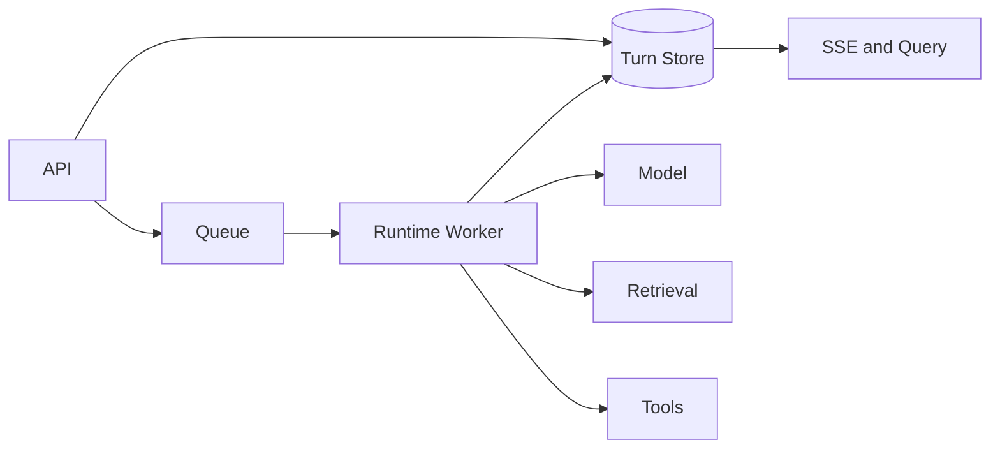

# 生产 Agent 的组件职责与失败传播

生产 Agent 不是一个包含所有逻辑的聊天接口。认证、运行时、队列、检索、模型、存储和观测各自拥有状态，组件边界决定故障能否被隔离和恢复。

## 入口层建立身份和 Turn

API Gateway 与应用 API 负责认证、限流、请求校验、幂等和 Turn 创建。它们不长期占用连接执行研究任务，也不把用户提供的 Scope 当真。

同步错误在入口返回，异步状态由 Turn 与事件读取。

## Runtime 层拥有控制状态

Runtime 装配上下文、选择节点、校验工具候选、维护预算与终态。Worker 提供执行容量，队列提供投递，二者都不能独立改变业务规则。

Knowledge Release、Policy Version 和 Checkpoint 让一次执行可复现。

## 能力层通过窄适配器接入

模型网关、检索器、MCP Client、对象存储和业务工具暴露稳定接口。适配器负责超时、错误映射和 Trace，业务授权留在服务层。

任何外部结果都带来源和信任级别进入 Runtime。

## 故障沿所有权传播

模型限流可以切换兼容路由，检索无证据进入拒答，策略服务不可用失败关闭，事件推送失败不改变已持久化终态。数据库不可用时停止状态推进，避免无记录副作用。

## 上线按可回滚单元管理

Schema、Policy、模型适配和知识 Release 各自版本化。候选先跑 Eval 与健康检查，再逐步切流；旧版本保留到观察完成。

架构图的价值是能回答状态在哪里、哪个组件可以重试、失败后谁写终态，而不是服务数量越多越专业。
