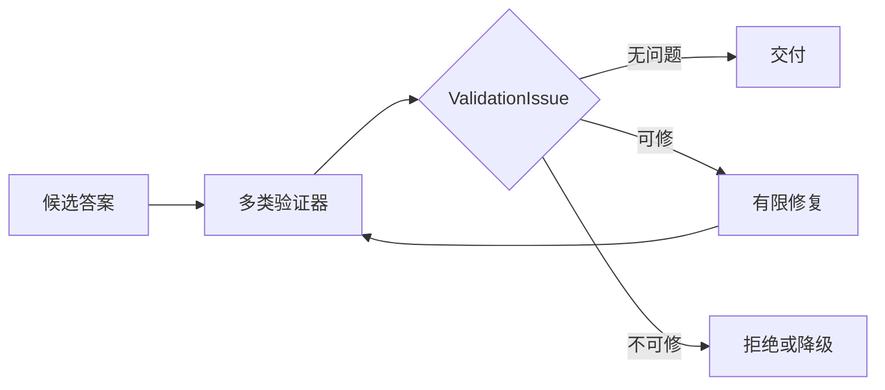

# Reflection 如何验证答案并限制修复

用户问：“生产环境的重试次数和退避方式是什么？”检索已经取得两条有效 Evidence，回答只写了“最多重试三次”，漏掉指数退避。文字没有明显语病，也没有编造事实，任务仍未完成。

把整个流程重跑一遍会再次支付检索和生成成本，也可能丢掉已经正确的内容。让模型自由评价“回答好不好”，通常只能得到“可以补充细节”这类无法定位的问题。

**Reflection（反思）** 放在候选答案生成之后。它读取任务要求、当前答案和结构化验证结果，决定直接通过、进行一次受限修复，或带着明确原因停止。模型可以生成反馈和修订文本，Runtime 掌握修复范围、次数、证据与终态。

## Reflection 要从可观察问题开始

一次稳定反思不问抽象的“质量高不高”，而是检查可以验证的条件：

```text
任务要求事实: retry_count, backoff
当前 Evidence: retry_count, backoff
当前答案声明: retry_count
验证问题: missing_required_fact(backoff)
```

这个问题具有明确位置和修复材料。修复器只需把 `backoff` 对应 Evidence 纳入答案，再重新验证。

若答案声称“失败后会自动切换备用集群”，当前 Evidence 中没有这条事实，问题变成 `unsupported_claim`。补写更多文字无法使无来源主张合法。系统需要删除或拒绝该 Claim，某些高风险场景还应直接阻断交付。

Reflection 的输入因此应该是 ValidationIssue，而不是一个总分：

```text
ValidationIssue {
  validator
  code
  severity
  claim_id
  evidence_ids
  repairable
  message
}
```

`code` 驱动程序行为，`message` 给修复模型提供具体反馈。是否可修由策略和验证器决定，模型不能把 `repairable=false` 改成 true。
## 验证与 Reflection 各负责什么

两者常被混成一次“请检查并改进”的模型调用。

**Validation（验证）** 比较候选与合同，产生结构化问题。事实验证检查 Claim 与 Evidence，引用验证检查位置，ACL 检查可见范围，隐私与注入验证检查交付风险，格式验证检查 Schema。

Reflection 根据这些问题选择处置：无需修改、允许有限修复、拒绝或请求补充信息。它不会创造新的权限，也不能把旧版本 Evidence 改成活动版本。

关系可以表示为：



修复后必须回到全部相关验证器。只检查最初的遗漏，会漏掉修订新引入的无来源事实或隐私内容。
## 哪些问题适合修，哪些需要停止

可修性取决于当前可信材料是否足够，以及修改是否能局限在答案层。

| 问题 | 通常处置 | 原因 |
| --- | --- | --- |
| 已有 Evidence 对应的必需事实遗漏 | 补写并重验 | 材料已在当前边界内 |
| 引用编号错位但来源唯一 | 重绑引用并重验 | 不改变事实集合 |
| 输出 Schema 的可恢复格式错误 | 重新序列化 | 可由确定规则验证 |
| 无 Evidence 支撑的事实 | 删除 Claim 或阻断 | 不能用改写补出来源 |
| Evidence 越过当前 ACL | 阻断 | 修复不能扩大权限 |
| 关键来源冲突 | 显示冲突或补检索 | 不能由措辞消除事实分歧 |
| 当前资料缺少必需事实 | 回到 Planner 或安全拒答 | 答案层没有修复材料 |
| 检测到凭证或提示注入传播 | 阻断并清理 | 继续送入模型可能扩大泄露 |

“删除无来源 Claim”是否允许自动执行，要看任务语义。若删除后仍能完整回答，可以作为修复；若它正是用户所问的核心，删除后应返回资料不足。

补检索不属于同一层的文本修复。Reflection 可以生成 `missing_evidence` 信号，Runtime 决定是否仍有研究轮次，再把明确缺口交给 Planner。这样能区分“答案漏写了”和“系统根本没查到”。
## 模型自评分为什么不能单独做门禁

常见实现让模型输出 `score=0.82`，高于 0.8 就通过。这个数字缺少稳定标尺。同一答案更换评估模型、Prompt 或温度后，分数可能变化；写得长、术语多的答案也可能得到更高印象分。

“步骤数量”“逻辑连接词数量”和“回答长度”可以作为诊断特征，不能证明事实正确。一个包含三个流畅段落的错误前提，仍然是错误答案。

模型评估更适合处理难以完全规则化的表达问题，例如是否回答了问题、段落是否歧义、两段是否重复。它的输出仍应落到离散问题码和具体位置，并用人工标注集校准。

若必须保留总分，分数只用于排序、观测或触发人工复核。ACL、引用存在性、Schema 和必需事实覆盖等硬条件继续使用确定性门禁。
## 修复合同要限制模型能改什么

修复请求至少包含：

```text
原问题
当前候选答案
允许使用的 EvidenceFact
ValidationIssue 列表
必须保留的已有 Claim ID
禁止新增的事实类型
输出 Schema
剩余修复次数
```

Evidence 用稳定 ID 和必要片段提供，不能把当前用户无权访问的候选一起交给修复器。反馈写成“缺少 fact:backoff，请使用 evidence:e2 补充”，比“答案不够完整”更容易执行和测试。

修复器输出新的 AnswerCandidate，包含文本和 Claim 到 Evidence 的绑定。Runtime 检查原答案中已经验证通过的 Claim 是否仍存在，防止修一个遗漏时静默删掉另一条正确事实。

修复器也不能执行工具。它若判断需要新资料，只能返回 `needs_more_evidence` 候选，Runtime 再按照计划预算裁决。让修复 Prompt 直接调用搜索会绕开 Router 与 Planner 的范围约束。
## 为什么修复次数通常很少

每一轮至少增加一次模型调用和一次完整验证。评估器与生成器共享知识盲点时，多轮循环还会在同一个问题上振荡。

有限策略可以设为：

```text
0 次修复: 低价值或延迟敏感请求
1 次修复: 当前 Evidence 足够，问题位置明确
人工审核: 高风险动作或多次修复仍失败
```

具体次数由 Eval 决定，不是固定行业参数。重要的是存在硬上限、绝对 Deadline 和无进展检测。若两次候选的 Claim 集合与问题码完全相同，继续改写没有新信息，应立即停止。

修复模型超时或不可用时，Runtime 保留原候选和原问题。原候选是否能降级交付取决于问题严重度。只有风格问题可以返回原文；事实、权限和隐私阻断不能因为反思服务失败而绕过。
## 终态要比“成功或失败”更具体

一次 Reflection 可以结束为：

```text
passed
blocked
repair_unavailable
repair_rejected
repair_limit_reached
needs_more_evidence
```

`passed` 表示当前验证合同通过，不代表答案在世界范围内绝对正确。`blocked` 表示存在不可修问题。`repair_rejected` 说明新候选破坏了已通过内容或引入新问题。`repair_limit_reached` 保留最后一次验证结果，并按严重度决定拒答或人工复核。

不要在到达次数上限时无条件返回“目前最好的答案”。如果最好候选仍有权限泄露或关键无来源 Claim，它没有交付资格。质量优化可以降级，安全门禁不能降级。
## 可运行示例怎样体现有限修复

仓库示例把答案声明的事实 ID 与 EvidenceFact 对照，只允许补充已存在的必需事实：

<<< ../../examples/ai-agent/reflection_repair.py

示例验证了几条重要不变量：未知事实不可修，修复不能删除原有 Claim，修复后重新验证，次数达到上限后保留明确停止原因。

其中 `append_missing_facts` 是确定性的教学修复器，只适合展示状态变化。它没有证明真实模型能生成自然、准确的正文，也没有覆盖 ACL、隐私、引用位置和注入验证。生产实现需要把多个验证器组合起来，并通过模型适配器契约测试验证结构化输出。
## Reflection 在什么场景有收益

当任务价值高、已有验证标准、问题通常局部可修时，Reflection 更有价值，例如带引用的知识回答、结构化报告和文档生成。

简单事实已经通过硬验证时，再调用评估模型收益很低。代码生成有编译器和测试时，应先运行这些确定性工具；Reflection 可以解释失败并提出修复候选，不能替代测试。实时聊天对延迟敏感，可以只对阻断性问题触发。

选择是否启用应基于线上前的对照评测：比较无 Reflection 与有限 Reflection 的任务通过率、严重错误率、延迟和 Token。只观察平均评分，会把成本增长和安全失败藏在一个数字里。
## 回归测试要覆盖修复带来的新错误

一组有效测试至少包括：

| 场景 | 关键断言 |
| --- | --- |
| 候选已满足要求 | 不调用修复器 |
| 已有证据的事实遗漏 | 一次修复后通过 |
| 候选含未知事实 | 不进入自动补写 |
| 修复删除原有 Claim | 拒绝新候选 |
| 修复引入越界 Evidence | ACL 验证阻断 |
| 修复器超时 | 保留原问题和稳定终态 |
| 修复无进展 | 提前停止 |
| 关键资料本身缺失 | 返回 Planner 缺口，不编造 |
| 达到修复上限 | 不继续调用模型 |
| 同一输入重放 | 问题码和控制流稳定 |

Trace 记录验证器、问题码、Claim ID、Evidence ID、修复次数、候选版本和停止原因。完整答案与证据正文留在受控存储，指标按问题类型统计。

Reflection 的工程价值来自“有限”二字。它把一个可观察的问题交给模型修一次，再让确定性验证器重新裁决。缺证据就回到检索边界，越权就阻断，达到上限就停止。这样得到的是可管理的质量提升，而不是一段模型与自己无休止讨论的文字。
