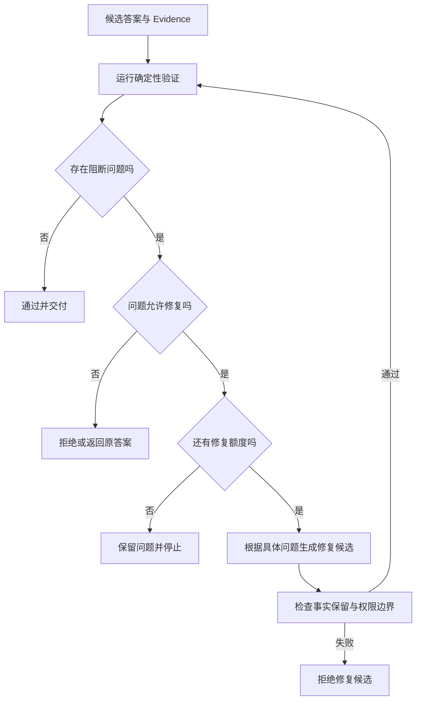
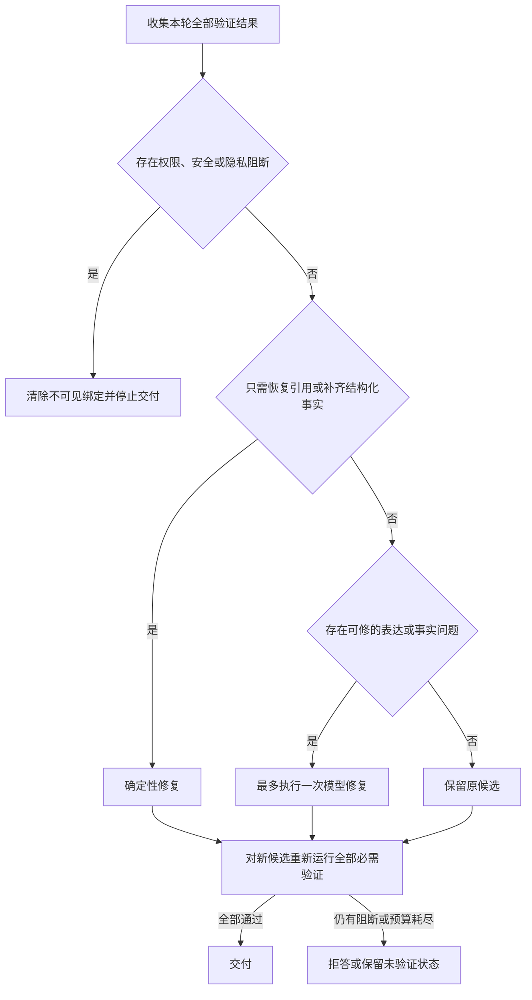

# Reflection 如何验证答案并限制修复

一个知识 Agent 查到两条已经确认的策略：生产环境最多重试三次，重试间隔采用指数退避。模型生成答案时只写了第一条。这个回答没有凭空编造内容，读起来也很通顺，但它漏掉了问题要求说明的退避方式。

直接把整个请求重新跑一遍，代价很大，而且第二次生成仍可能遗漏。只把答案交给模型，让它评价“写得好不好”，又会得到“内容基本准确，可以补充细节”一类无法执行的反馈。系统真正需要的是一个可以定位的问题：缺少哪条事实，它由哪份 Evidence 支持，这个问题能否在不破坏原答案的前提下修复。

这正是 **Reflection** 负责的部分。它位于生成之后、最终交付之前，读取当前答案和验证结果，决定直接通过、做一次有限修复，还是带着明确原因停止。模型可以参与评价和改写，控制权仍在运行时。

::: info Reflection 处理的是候选结果

Reflection 不负责补充权限、查询当前业务状态或创造新知识。它检查一个已经产生的候选结果，反馈必须指向可观察问题，修复只能使用当前请求已经允许的材料。

:::

## 从一次答案遗漏看 Reflection 的作用

先把这次请求的输入摊开。用户问的是“生产环境怎样重试”，检索阶段得到两条 Evidence，并将它们整理为两个可验证的事实单元。

| 事实 ID | 已有证据支持的内容 | 回答是否包含 |
| --- | --- | --- |
| `retry` | 生产环境最多重试三次 | 是 |
| `backoff` | 重试间隔采用指数退避 | 否 |

初始回答是“生产环境最多重试三次”。如果只做语法检查，它可以通过；如果只检查引用是否存在，它也可能通过，因为回答确实绑定了 `retry`。但任务要求覆盖重试次数和退避方式，完整性验证应产生一个结构化问题：`missing_required_fact(backoff)`。

这个问题带有四项可执行信息：问题类型是遗漏，目标是 `backoff`，证据已经存在，修复允许追加事实。修复器不需要重新搜索，也不需要猜测用户意图，只需把该事实放回答案，再运行一次相同验证。新答案包含两个事实 ID 后，本轮结束。

另一种情况完全不同。假设初始答案写成“生产环境会无限重试”，并声明一个不存在的事实 ID。验证器应返回 `unsupported_claim`，而不是提示模型“表达得更严谨”。当前 Evidence 无法支持这句话，改写措辞也不能让它变真。系统要删除无证据结论、重新生成受证据支持的答案，或者停止并说明无法确认。

因此 Reflection 的价值不只是多调用一次模型。它把“质量不好”拆成可修复遗漏、无证据事实、权限冲突、格式错误、敏感信息和验证器故障，并给每类问题指定不同终点。没有这层分类，所谓反思通常只是重复生成。

## Reflection 循环怎样运行

一条最小 Reflection 链路包含生成、验证、修复和重新验证。生成器负责给出候选答案；验证器把问题变成结构化记录；修复器只处理允许修复的记录；运行时保存轮次、预算与停止原因。



这里有两个容易混淆的循环。外层 Agent 循环决定是否继续调用工具、检索或结束任务；Reflection 循环只围绕某个候选结果做质量检查。Reflection 不应该借修复之名重新规划整个任务，更不能自行调用新的高风险工具。确实缺少材料时，它把 Evidence Gap 交回 Planner，由 Planner 在原 Scope 和剩余预算内处理。

运行状态至少要保存这些字段：

| 字段 | 作用 |
| --- | --- |
| `candidate_answer` | 当前正在检查的答案版本 |
| `evidence_ids` | 该答案允许使用的证据集合 |
| `validation_issues` | 验证器给出的结构化问题 |
| `repair_attempts` | 已经执行的修复次数 |
| `max_repairs` | 运行时设置的修复上限 |
| `stop_reason` | 通过、阻断、额度耗尽、候选被拒或修复器不可用 |

这些字段属于运行时状态，不应藏在一段 Prompt 里。进程恢复时，程序要知道上一轮验证已经完成，还是修复请求发出后结果未知。只有聊天记录，无法可靠区分这两种状态。

## 验证器把质量问题变成可执行记录

“回答得不够好”无法驱动稳定程序。验证器需要输出问题代码、严重级别、关联事实或证据、能否修复，以及供修复器使用的具体说明。最小结构可以写成：

```json
{
  "code": "missing_required_fact",
  "severity": "error",
  "message": "回答遗漏了已有证据支持的退避方式",
  "fact_ids": ["backoff"],
  "evidence_ids": ["policy-production-v3"],
  "repairable": true
}
```

`message` 供人查看，控制流读取稳定的 `code` 和 `repairable`。如果程序要靠解析“回答可以更完整一些”来判断动作，稍微换一个模型或提示词就会走错分支。

### 确定性检查先处理明确规则

能由程序判断的问题，不必先问模型。常见检查包括 JSON 能否解析、必填字段是否存在、Claim 绑定的 Evidence 是否在当前集合中、回答是否遗漏已经标记为必需的事实、引用是否指向可见版本、结果是否包含敏感模式，以及修复候选有没有丢失原答案已经覆盖的事实。

这些检查的优势是结果可复现。相同答案和相同 Evidence 会产生相同问题，单元测试也能直接断言问题代码。它们的局限同样明确：程序可以确认 `backoff` 没有进入答案，却很难仅靠字符串判断一段解释是否准确表达了复杂因果。

确定性验证还承担安全下限。模型评估器即使给出很高分，只要答案引用了越权 Evidence，结果仍然不能交付；结构化输出通过 Schema，也不能覆盖权限、Release 或业务约束。

### 语义评估器处理需要理解的部分

完整性、解释是否自洽、答案是否真正回应问题，往往需要语义判断。模型可以在确定性检查之后参与这些维度，但它的输出仍是候选问题，不是最终裁决。

评估输入应包含原问题、候选答案、允许使用的事实、明确的评价标准和输出 Schema。评价标准要与任务相关。知识问答关心事实支持和引用覆盖；代码任务更适合直接运行测试、静态检查和类型检查；创意文本没有唯一事实集合，硬套事实覆盖率反而会误伤。

只有一个总分会隐藏问题位置。0.78 到底表示缺少一条引用，还是出现了严重事实错误，运行时无法知道。更实用的输出是问题列表，评分只作为观察指标或触发策略的辅助值。安全与权限问题不能被其他维度的高分平均掉。

### 反馈必须说明改什么以及依据什么

“内容不够完整，请改进”要求修复器重新猜一次评价标准。有效反馈会写明缺失对象、原答案位置、支持证据和允许动作。例如：

> 在保留“最多重试三次”的前提下，补充事实 `backoff`。该事实已由当前 Evidence 支持，不要增加新的重试原因或环境配置。

这条反馈限制了修复范围，也声明了不能做什么。若问题是“引用不存在”，反馈应要求恢复已有绑定或删除无证据 Claim；若问题是权限泄漏，反馈不能建议换个说法保留内容，正确动作是移除越权 Evidence 并终止当前答案。

## 修复只能改变被指出的问题

Reflection 最危险的阶段是重新生成。模型看到原问题、原答案和反馈后，可能在补充一个遗漏时改写整篇答案，顺手删掉原有事实，或者加入听起来合理的新解释。修复候选因此还要通过三道限制。

**材料限制**，修复只能读取当前请求已经授权的 Evidence。缺少事实时返回缺口，不能让模型用参数记忆补齐。**变化限制**，原答案中已经验证通过的 Claim 必须保留，除非问题明确指出它错误。**次数限制**，运行时设置最大修复次数，达到上限就停止，评分不能自行延长循环。

问题类型决定修复方式：

| 问题 | 适合的处理 | 不应采用的处理 |
| --- | --- | --- |
| 遗漏已有事实 | 确定性追加缺失事实，再验证 | 重写整篇答案 |
| 引用绑定丢失 | 恢复已有 Evidence ID | 重新搜索全库 |
| 格式不符合 Schema | 在字段范围内重排结构 | 修改业务值以通过校验 |
| 无证据 Claim | 删除该 Claim 或拒答 | 用模型常识补证据 |
| ACL 已撤回 | 终止并清除不可见引用 | 改写措辞后继续展示 |
| 敏感信息暴露 | 脱敏后重新验证，或阻断 | 把风险交给用户判断 |
| 验证器不可用 | 保留原结果并标记未验证，或按策略阻断 | 假装验证已经通过 |

修复前后的事实覆盖集合是一项很实用的保护。原答案声明 `retry`，修复候选只剩 `backoff`，说明改写时丢掉了已确认内容。运行时应拒绝候选，保留原答案和问题记录。不能因为新版本语言更流畅就接受信息缩水。

修复也不等于重试。重试解决临时网络失败、限流或可恢复依赖错误，输入通常不变；修复收到的是验证器给出的新信息，目标是改变候选内容。把两者都记成 `attempt=2`，排障时就看不出是依赖失败，还是答案质量未通过。

## 多个验证结果怎样路由到修复策略

真实答案通常同时经过事实、引用、权限、隐私和注入检查。运行时不能按验证器完成顺序逐个改答案，否则前一个修复器刚补上的内容，可能正是后一个验证器要阻断的内容。更稳妥的做法是先收集本轮全部问题，再根据严重级别和问题组合选择一次动作。



流程按问题后果排序，不按验证器返回速度排序。晚到的 ACL 阻断仍然可以否决已经完成的内容修复。

权限阻断拥有最高优先级。答案同时出现“遗漏一条事实”和“引用已经失去访问权”时，追加遗漏没有意义，当前 Evidence 集合本身已经不能交付。运行时应清空不可见绑定，结束本轮，并要求在新授权快照下重新发起请求。隐私或提示注入问题也不能被完整性修复覆盖，它们要先移除不可信内容，再判断剩余材料是否足够回答。

只有引用绑定丢失，而答案文字已经完整反映受支持事实时，不需要调用模型。程序可以恢复当前答案与 Evidence 的关系，随后重新检查引用可见性。若答案遗漏的是已有结构化事实，确定性追加通常更合适，因为变化范围可预期，也容易证明没有改坏原文。

事实表达错误需要另一条路径。验证器指出某个 Claim 与绑定 Evidence 不一致时，程序先从候选中隔离该 Claim，再把原问题、仍然有效的事实和具体问题交给修复器。修复器没有资格保留错误 Claim，也不能从 Evidence 集合之外找替代说法。新答案若没有覆盖任何受支持事实，运行时可以退回由受支持 Claim 组成的保守答案；连可用 Claim 都不存在时，终点是证据不足。

多个可修问题也不一定合并处理。格式错误与事实遗漏可以在一次候选中修复，因为两者都围绕同一答案；敏感信息脱敏最好先确定性处理，再让内容验证器检查脱敏是否破坏语义。每次变化都保存问题集合和前后版本，不能只留最后一版文字，否则无法判断是哪条修复引入了回归。

一份简单的路由规则可以按下面顺序判断：先处理不可修的权限与安全阻断；再处理无需生成的绑定恢复和确定性补全；其余可修问题最多进入一次模型修复；修复器或验证器不可用时，按任务风险保留原候选或拒答。这里的顺序来自问题后果，不来自验证器名称。

问题汇总还要去重。事实验证器和引用验证器可能同时指向同一个无证据 Claim，若把两条反馈原样交给模型，它会把同一问题修两遍。可以用候选版本、Claim ID、Evidence ID 和问题代码生成稳定身份，再把相同对象上的说明合并。不同严重级别发生冲突时保留更严格的处理，不用多数票裁决。

并发验证带来一个时间问题。某个验证器超时，其他四个都通过，结果仍不能自动标记为完整通过。状态应写明哪一项未完成，并由策略决定是否交付。高风险任务缺少任何必需验证就阻断；低风险任务可以返回原答案，同时明确该项未验证。把超时当成“没有发现问题”，会让依赖故障悄悄降低质量门槛。

修复完成后，所有必需验证器都要针对新候选运行。只重跑最初失败的一项不够，因为修改可能影响引用位置、敏感内容和结构。能够复用的检查结果必须绑定候选内容哈希；正文发生变化后，与文字相关的结果失效，纯粹针对知识版本和授权快照的结果才可能继续使用。

## 一次有限修复的完整状态变化

仍以重试策略为例。请求进入 Reflection 时，运行时已经冻结知识版本和可见 Evidence，初始状态如下：

```text
required_fact_ids = [retry, backoff]
candidate.claimed_fact_ids = [retry]
repair_attempts = 0
max_repairs = 1
```

确定性验证先计算集合差，得到 `backoff` 缺失。该问题允许修复，且剩余次数为一。修复器根据事实 ID 读取已授权内容，在原答案末尾追加“重试间隔采用指数退避”，候选声明的事实集合变成 `[retry, backoff]`。

第二次验证检查四件事：两个必需事实都已覆盖；候选没有声明 Evidence 集合之外的事实；原有 `retry` 没有被删除；正文不为空。问题列表清空，`stop_reason` 写为 `passed`，修复次数为一。交付层只读取这个终态，不需要推断“补充”一词是否意味着成功。

状态轨迹可以表示为：

| 阶段 | 答案事实集合 | 问题 | 动作 | 终止原因 |
| --- | --- | --- | --- | --- |
| 初始生成 | `retry` | 未检查 | 进入验证 | 无 |
| 第一次验证 | `retry` | 缺少 `backoff` | 允许一次修复 | 无 |
| 修复候选 | `retry, backoff` | 待复核 | 检查事实保留 | 无 |
| 第二次验证 | `retry, backoff` | 空 | 保存终态 | `passed` |

故障推演更能说明边界。若修复器返回的候选只有 `backoff`，事实保留检查会发现 `retry` 被删除，系统返回 `repair_rejected`，原答案仍保留。若修复器超时，结果是 `repair_unavailable`，而不是把空字符串覆盖原答案。若初始答案声明不存在的 `unknown`，问题不可修，修复器调用次数保持为零。

这个过程没有重新检索，也没有让评估模型决定权限。Reflection 只处理当前答案已有的材料和明确问题，Planner、Retriever 与授权层继续持有各自职责。

## 用 Python 实现可测试的 Reflection 控制器

下面的最小实现没有接入真实模型。它用 `AnswerCandidate` 显式保存正文和事实 ID，用 `ValidationIssue` 表示反馈，再由 `run_reflection` 控制修复次数与停止原因。这样可以先验证控制逻辑，不把模型随机性混进单元测试。

<<< ../../examples/ai-agent/reflection_repair.py

`validate_answer` 先比较 Evidence、必需事实和候选声明。未知事实产生不可修的 `unsupported_claim`，遗漏产生可修的 `missing_required_fact`。这只是最小规则，不代表字符串和事实 ID 足以验证生产答案；真实系统还要核对 Claim 内容、Evidence 版本、权限和引用位置。

`run_reflection` 在调用修复器前检查问题是否可修。修复器返回后，程序确认原有事实集合仍是新集合的子集，然后再跑同一验证。这里没有“修复后默认更好”的捷径，新候选必须重新证明自己。

示例提供的 `append_missing_facts` 只适合“遗漏事实且事实已经结构化”的场景。它不会重写原文，也不会调用模型。复杂表达需要模型参与时，仍应让模型返回候选，再经过同样的保留检查和验证。

运行全部共享示例：

```bash
PYTHONPATH=examples/ai-agent \
python3 -m unittest discover -s examples/ai-agent/tests -p 'test_*.py'
```

当前执行得到 `Ran 46 tests` 和 `OK`。其中五项覆盖 Reflection：答案已通过时不调用修复器；遗漏事实只追加已有内容；丢失原事实的候选被拒；无证据 Claim 阻断；修复器超时时保留原答案。它们证明的是本地控制逻辑，不证明模型评价准确，也不证明真实存储和事件恢复已经完成。

## 评估器本身也会判断错误

用模型评价模型会引入新的不确定性。评估器可能偏爱更长的答案，把语气自信误认为事实可靠，或因为生成器与评估器采用相近偏好而漏掉同类错误。相同答案换一个评价提示也可能得到不同问题列表。

确定性护栏应先于模型评分。引用是否存在、事实 ID 是否在 Evidence 集合、JSON 是否有效、敏感模式是否命中，这些结论不需要模型投票。语义评估只处理程序难以直接判断的部分，输出还要受 Schema、问题数量和允许代码集合约束。

评估器上线前需要用固定样本校准。样本应同时包含正确答案、遗漏答案、无证据答案、越权引用、格式正确但事实错误的答案，以及明确拒答。检查的不只是平均分，还包括每类问题有没有被分到正确终点。把拒答一律判成低质量，会逼修复器在证据不足时编答案。

评估模型或提示词变更也属于版本变化。同一批回归样本要重新运行，比较问题类型、触发率和最终动作。只看“平均质量分提高”不够，因为新评估器可能通过放宽标准减少修复次数。

评估器不可用时如何处理取决于任务风险。普通低风险说明可以返回原答案，并标记语义验证未完成；需要事实保证、合规确认或外部执行的结果应阻断。所谓优雅降级不是所有场景都照常交付，而是预先写清每种风险等级的替代终态。

## 成本与延迟要在触发前受控

一次 Reflection 至少增加一次验证，发生修复时还会增加一次生成和再次验证。输入通常还要携带原答案、反馈和部分 Evidence，长答案的重复输入会继续占用 Token。修复轮数越多，最坏成本和尾延迟越难预测。

运行时可以从任务价值和可验证性决定是否启用。简单事实已经通过确定性检查，不需要再调用语义评估；高价值报告、包含多个 Evidence 的综合答案、必须满足固定结构的交付，更值得进行一次检查。实时对话对延迟敏感，通常只保留轻量规则。

最大修复次数、验证 Deadline 和 Token 额度要在请求开始时冻结。子步骤只能使用剩余预算，不能每进入一轮就重新获得完整额度。评分在阈值附近波动时，次数上限仍然生效，最终保存最后一个通过安全检查的版本和未解决问题。

阈值不能凭感觉长期固定。可以用回归样本观察误报、漏报、触发修复的比例、修复后问题是否减少，以及候选被拒的原因。若大量正确答案因“表达不够丰富”被重写，评价标准已经偏离任务；若无证据事实经常高分通过，应该加强事实护栏，而不是继续调总分。

并发执行多个验证器时，每个结果保留验证器身份和版本。事实、引用、ACL、隐私可以并行检查，汇总阶段按严重级别裁决。完成顺序不决定优先级，迟到的 ACL 阻断也不能被先到的“内容完整”覆盖。

## Reflection 与其他质量手段的区别

Reflection 只是一种生成后控制，不能取代更直接的验证方式。

| 方法 | 主要输入 | 判断依据 | 适合处理的问题 | 主要限制 |
| --- | --- | --- | --- | --- |
| 依赖重试 | 同一请求与错误类型 | 超时、限流、临时故障 | 可恢复调用失败 | 不会修正答案内容 |
| 确定性验证 | 候选结果与规则 | Schema、测试、事实绑定、权限 | 可枚举的不变量 | 难判断开放语义 |
| Reflection | 候选、问题反馈与原材料 | 规则加语义评价 | 可定位且允许修复的质量问题 | 增加成本，评估也会出错 |
| 多样本一致性 | 多个独立候选 | 可比较答案的一致程度 | 有明确答案空间的推理 | 一致不等于事实正确 |
| 人工审核 | 完整材料与责任人 | 业务、合规和专业判断 | 高风险或不可逆决策 | 等待时间和人力成本高 |

代码能运行测试时，测试结果通常比模型自评更可靠。结构化数据可以用 Schema 和领域约束检查，也不必让 Reflection 猜。人工批准不是更昂贵的 Reflection，它还承担责任确认和不可逆动作授权，模型评价不能替代。

多样本一致性与 Reflection 也不相同。前者生成多个候选，再按规则选择；后者从一个候选的具体问题出发修改。五个候选都复述同一条错误事实时，多数票只会放大错误，仍需 Evidence 或外部验证。

## 生产运行需要保存哪些证据

一个可以恢复的 Reflection 流程至少记录候选版本、验证器版本、问题代码、修复尝试号、输入 Evidence 引用和停止原因。完整 Prompt 与文档正文不适合直接放进日志标签，可保存在受控存储中，Trace 只写稳定 ID 和内容哈希。

事件可以按下列顺序产生：

1. `answer.candidate_created` 保存候选版本和事实绑定。
2. `validation.completed` 保存验证器版本与问题列表。
3. `repair.started` 保存尝试号、目标问题和幂等键。
4. `repair.candidate_created` 保存新候选与前一版本关系。
5. `reflection.stopped` 保存最终版本和停止原因。

核心状态应先提交，再发布可重放事件。进程在修复结果产生后退出，恢复逻辑通过幂等键查询已有候选，不重复生成第二份。交付事件失败只需重新发布，不应重新运行 Reflection。

知识 Release 或 Scope 变化时，旧验证结果不能直接复用。旧候选仍可审计，但重新交付前要确认 Evidence 仍可见。权限撤回优先于原检查点，相关答案即使先前通过，也不能继续展示。

监控需要区分验证失败、修复触发、候选被拒、修复器不可用和额度耗尽。把它们合并成“Reflection 失败率”，既看不出模型质量问题，也看不出运行时故障。修复前后可以比较支持事实覆盖，但不能把字符变多当成质量提升。

## Reflection 的适用边界

Reflection 适合有明确评价标准、输出价值足以承担额外调用，并且问题可以在当前材料内修复的任务。研究综合、技术说明、带引用的知识问答和固定结构的文档都符合这组条件。前提是 Evidence 和权限边界已经由其他组件建立。

简单查询、低延迟对话、已经有确定性测试的代码步骤，不必为了“更像 Agent”增加反思循环。任务没有可靠材料时，Reflection 也无法补出事实；它最多发现证据不足，并把结果导向拒答或重新检索。

权限冲突、策略拒绝和不可逆动作审批不属于可润色问题。它们必须由授权或人工流程处理。把这类阻断交给模型修复，会让系统尝试用更委婉的文字绕过原规则。

### Reflection 是否必须使用另一个模型

不必须。确定性规则可以独立完成一部分检查，同一模型也能提供语义反馈。生成和评价采用不同模型可以减少部分共同偏好，但不会自动得到真实判断。选型要通过固定样本校准，不能把“不同模型”当成正确性的证明。

### 评分达到阈值就能交付吗

不能。总分只适合辅助策略，权限、证据绑定、敏感信息和领域不变量仍由确定性规则裁决。任何阻断问题都不能被其他维度的高分抵消。

### 修复后结果变差怎么办

保存原候选，比较两版已经验证通过的事实集合，并重新运行验证。新候选丢失原事实、加入未知事实或触发更严重问题时，拒绝它并保留原答案。系统还要记录 `repair_rejected`，便于回归评估修复提示或模型版本。

### 达到修复上限仍有问题怎么办

停止继续生成，返回最后一个通过安全检查的版本和未解决问题；任务要求完整且缺口会误导时，则明确拒答。次数上限是运行时约束，评估器不能通过提高分数目标或追加反馈自行延长。
