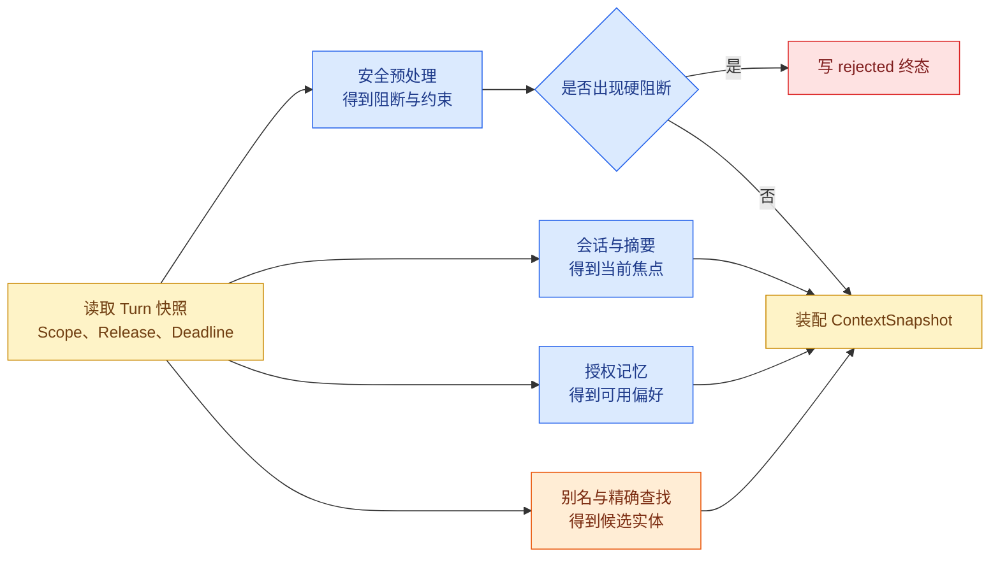
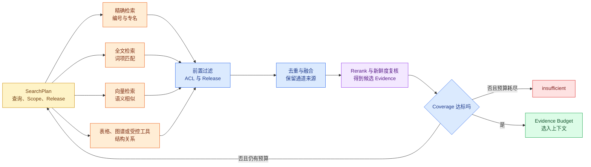
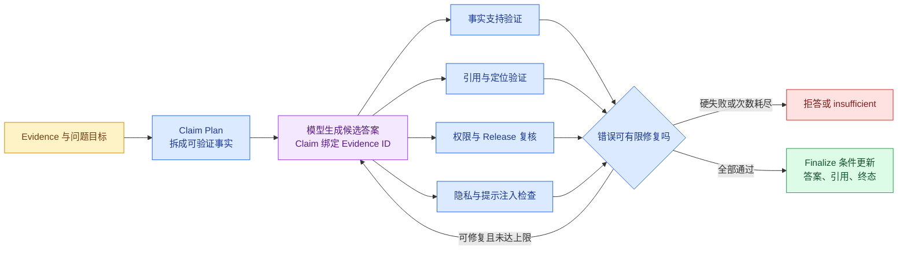

# 一次 Agent 请求的完整 Runtime 生命周期

## Runtime 生命周期是什么

Runtime 生命周期是一次 Agent Turn 从准入、排队、执行到终态交付所经过的业务状态链。它位于 API、队列、Worker、图编排、工具/检索和事件流的交界处，负责保存谁拥有执行权、使用哪个版本、已经产生哪些事实以及何时停止；模型调用只是其中一个步骤。

读者应先把它当作一张“请求事实地图”，再看每个阶段的实现。最终目标不是背一套组件名，而是拿到一个 `turn_id` 后能定位它停在准入、投递、领取、图节点、验证还是事件交付。

“用户发问题，模型回答案”只描述了最外层。企业 Agent 还要回答：重复点击如何去重，当前用户能看哪些知识，模型调用超时谁负责停止，Worker 重启后从哪继续，流式连接断开后怎样取回最终结果。本文把一次只读知识问答按时间顺序展开，读者可以用它定位任何一条请求究竟卡在哪一层。

这里的 Runtime 指承接一次 Agent **Turn** 的业务执行系统：API、数据库、队列、Worker、LangGraph、检索/工具和事件流共同组成它。模型只是其中一个依赖。读完后，你应该能拿到一个 `turn_id`，判断它停在准入、投递、领取、图节点、验证还是事件交付，而不是只会查看模型日志。

## Agent 请求的生命周期时序

```mermaid
flowchart LR
  subgraph Request[请求与准入阶段]
    A[客户端提交 question 与 idempotency key]:::input --> B[认证并计算服务端 Scope]:::program
    B --> C[取得并发准入槽]:::program
    C --> D[事务内创建 Turn 消息与版本快照]:::data
    D --> E[提交 turn.created 事件]:::data
    E --> F[事务提交后投递 turn_id]:::tool
  end
  subgraph Execute[Worker 与图执行阶段]
    G[Worker 取得执行 Lease]:::program --> H[检查终态 取消与 Deadline]:::fail
    H --> I[读取快照或恢复 Checkpoint]:::data
    I --> J[预处理 规划 检索 生成 验证]:::model
    J --> K[事务内写制品 Message 和唯一终态]:::data
    K --> L[SSE 按 sequence 推送或重放]:::ok
  end
  F --> G
  classDef input fill:#d9f7ef,stroke:#0f766e,color:#134e4a
  classDef program fill:#dbeafe,stroke:#2563eb,color:#1e3a8a
  classDef model fill:#ede9fe,stroke:#7c3aed,color:#4c1d95
  classDef tool fill:#ffedd5,stroke:#ea580c,color:#7c2d12
  classDef data fill:#fef3c7,stroke:#d97706,color:#78350f
  classDef ok fill:#dcfce7,stroke:#16a34a,color:#14532d
  classDef fail fill:#fee2e2,stroke:#dc2626,color:#7f1d1d
```



API 负责快速**准入**和创建事实，Worker 负责长时间执行，Graph 负责步骤编排，RAG/Tool 负责受控外部访问，数据库负责最终状态和事件。任何层都不能把自己的成功等同于整轮成功。

图要从左到右按事务边界阅读。客户端只提交意图和幂等键；权限范围由服务端计算。API 先取得容量槽，再在一个数据库事务里创建 Turn、消息、知识/策略/ACL 快照和首条事件。只有事务提交后才投递 `turn_id`。Worker 消费消息后还要取得执行 Lease，并重新检查终态、取消和绝对 Deadline，随后从最新 **Checkpoint** 开始图执行。最后，正式答案、制品、Turn 终态和终态事件在受控事务里提交；SSE 只是按序交付这些事实。

## 阶段一：准入和幂等

入口先验证认证身份，再计算服务端 `scope`。用户文字里的“我是管理员”只是文本，不能改变 Scope。幂等键由客户端为一次提交生成，数据库对 `(user_id, idempotency_key)` 建唯一约束；并发请求中只有一个创建 Turn，另一个返回已有 ID。

准入还要检查全局、用户和模型资源槽。过载时可以快速拒绝或排队，但不能先创建无上限后台任务再慢慢限流。拒绝结果要带稳定错误码和重试建议，避免客户端指数重试放大压力。

### 准入的执行顺序不能随便交换

一条可落地的顺序是：

1. 校验认证信息和请求 Schema，空问题或超长输入直接返回 4xx；
2. 根据数据库中的成员关系计算 Scope，不读取用户提示词里的身份声明；
3. 按 `(user_id, resource_id, idempotency_key)` 查询已有 Turn，有则直接返回；
4. 取得全局与用户准入槽，避免继续创建不可执行任务；
5. 在数据库事务内再次锁定幂等作用域，处理两个并发请求都“没查到”的竞争；
6. 创建 Conversation/Message/Turn 和首条事件，提交事务；
7. 投递成功后返回 `202 + turn_id`，投递失败则把 Turn 置为稳定失败并释放准入槽。

第 3 步是快速路径，第 5 步才是并发正确性。只做“先查再插”，两个请求可以同时通过查询；最终还需要数据库唯一约束或事务锁。准入槽也必须有 TTL 或租约，API 在事务失败、投递失败时显式释放，防止容量永久泄漏。

## 阶段二：创建 Turn 和固定快照

创建 Turn 时写入用户 Message、空的 AI Message、知识 Release、策略版本、ACL 快照、Deadline 和 Runtime 版本。快照保证 30 秒执行期间检索不会一半使用旧版本、一半使用新版本；ACL 仍需在证据输出前再次复核，防止权限中途撤销。

| 快照 | 解决的问题 | 不应放什么 |
| --- | --- | --- |
| Release | 文档版本一致 | 未验证候选索引 |
| Policy | 模型、预算、工具白名单 | 临时调试开关 |
| ACL | 本轮初始可见集合 | 用户自称权限 |
| Deadline | 全轮时间上限 | 每次重试独立超时 |

快照不是把所有当前配置复制成大 JSON。它只固定影响可复现性和权限的版本：知识 Release ID、策略版本 ID、初始 ACL subjects、模型路由版本、Runtime/State Schema 版本，以及绝对 Deadline。大配置仍存版本表，Turn 保存 ID。

知识版本通常可以固定，权限却可能收紧。执行开始时用快照限定最大可见范围，输出前再读取当前权限取交集；这样不会因为执行中撤权而泄露旧快照里的证据。权限扩大也不应让旧 Turn 自动看到新内容，否则恢复结果会变化，用户可以新建 Turn。

### 创建事务与队列投递之间有一道缝

数据库事务无法和普通消息 Broker 自动形成一个原子提交。事务已经成功、投递却失败时，系统会留下 `pending` Turn；先投递后提交，则 Worker 可能拿到尚不存在的 Turn。这就是 dispatch gap。

常见解决方式有两种：

- 简单系统在事务提交后同步投递，失败时另开事务把 Turn 写成 `dispatch_failed`，并由扫描器补偿长时间 pending；
- 更高可靠性场景使用 Transactional Outbox：同一数据库事务同时写 Turn 和 outbox 记录，独立 Relay 把 outbox 投递到 Broker，成功后标记已发送。

无论哪种方式，都不要宣称队列是 exactly-once。Broker 可能重复投递，Relay 也可能在“发送成功但标记前崩溃”。正确目标是 at-least-once 投递 + Turn 幂等 + Worker 所有权。

## 阶段三：Worker 领取和 LangGraph 执行

队列消息只携带 `turn_id`，Worker 再从数据库读取状态和快照。领取时写执行者 ID、租约到期时间和 `running` 状态；失去租约的 Worker 必须停止写入。图节点把状态写入 Checkpoint 和事件表，事件用于 UI，Checkpoint 用于恢复。

实际执行可拆为：安全检查、上下文装配、记忆读取、Planner、并行检索、融合、Claim 规划、生成、五类验证和有限修复。快速问题可以走短路径，但所有路径都必须进入同一**终态**状态机。

### Worker 拿到消息后不能直接调用图

队列消息可能迟到、重复或由旧 Worker 重投。Worker 的入口检查顺序应该固定：

1. 按 `turn_id` 读取 Turn；不存在则记录不可重试错误并 ACK；
2. 已是终态则直接 ACK，不能重新生成；
3. 获取带 owner token 的执行 **Lease**；获取失败说明另一个 Worker 正在负责；
4. 计算 `deadline_at - now`，小于等于零就尝试写 `expired`；
5. 检查 `cancel_requested`，必要时写 `cancelled`；
6. 读取版本快照与最新 Checkpoint，校验 State Schema；
7. 开始或恢复 LangGraph，并定期续租；
8. 每个长调用前再次检查剩余 Deadline 和取消标志。

Lease 不是普通的 `locked=true`。它至少包含 owner token 和过期时间；续租和释放都必须携带相同 token。否则旧 Worker 在网络恢复后可能释放新 Worker 的 Lease，或把新结果覆盖掉。

### 图内阶段的输入、输出和停止条件

| 阶段 | 读取 | 产生 | 主要停止条件 |
| --- | --- | --- | --- |
| 预处理 | 问题、快照、历史引用 | 安全结果、上下文、记忆、快速命中 | 注入阻断、取消 |
| Planner | 问题、预处理结果、预算 | 有限 SearchPlan | 计划非法、无剩余预算 |
| Research | SearchPlan、ACL、Release | 分支结果和候选 | Deadline、权限错误 |
| Fusion | 多路候选 | 去重排序后的 Evidence | 无可用证据 |
| Claim Plan | 问题、Evidence | 待回答 Claim | 无法覆盖目标 |
| Generate | Claim 与 Evidence | 候选答案和引用 | 模型错误、取消 |
| Validate | 答案、Claim、Evidence、ACL | issue 列表 | blocking issue |
| Repair | 可修复 issue、剩余预算 | 一次修复答案 | 尝试耗尽或仍阻断 |

每一行都应该对应可观察的事件、Trace span 或结构化状态。不要只记录“Agent running”；当页面卡住时，这个状态无法告诉你是检索慢、模型限流还是验证反复失败。

## 阶段四：终态和客户端观察

只有验证通过才能写 `completed`；无证据、越权、不可修复的引用错误进入 `failed` 或安全拒答业务终态。用户取消先写 `cancel_requested`，Worker 确认停止后写 `cancelled`；Deadline 到期写 `expired`。SSE 只传事件，不拥有最终事实；断线后通过 `Last-Event-ID` 重放，终态之后仍能 GET Turn 结果。

安全拒答是否用 `completed` 还是独立 `refused`，可以按产品协议决定，但必须稳定，并在 `reason_code` 中区分“证据不足、越权、策略阻断”。技术失败才进入 `failed`。把正常拒答都记成系统失败会污染可用性指标；把数据库异常写成“没有证据”又会掩盖故障。

终态提交要使用条件更新，例如“只有当前状态仍是 `running` 且 owner token 匹配，才写 completed”。更新行数为零时，Worker 重新读取状态：若用户已经取消或监控已写 expired，就停止并丢弃迟到候选答案。不能为了让自己的任务成功而把终态改回 running。

SSE 连接断开不等于用户取消。浏览器切换网络时，Worker 仍可完成任务；客户端重连后用最后序号补齐事件。只有显式取消 API 或服务端 Deadline 才改变 Turn 的执行意图。

## Worker 内部的四段受控执行

前面的时序图把 LangGraph 画成一个节点，是为了先看清 API、队列和所有权。现在把 Worker 内部展开。它不是“检索后生成”四个字，而是预处理、理解与计划、检索与证据、生成与验证四段执行；每一段都有明确输入、状态和停止条件。

### 并行预处理先建立安全上下文

Worker 取得 Lease 并加载 Turn 快照后，可以并行准备彼此不依赖的输入：安全规则、会话摘要、用户明确授权的记忆、别名词典和低成本精确检索。并行只减少等待，不改变合并时的可信优先级。



安全分支输出确定性的 `blocked/reasons`，模型不能覆盖。会话分支只读取当前 Conversation 的可见 Message 与已验证摘要；长期记忆还要检查来源、授权、TTL 和 Scope。四个分支写各自 State channel，Reducer 按固定规则生成 `ContextSnapshot`。权限策略加载失败应关闭执行，别名服务不可用则可以记录降级并继续普通检索，这两种失败不能归成同一个空结果。

### 模型理解问题，程序编译 SearchPlan

模型接收当前问题与受控上下文，输出结构化理解：意图、实体、时间条件、是否需要检索、候选查询和需要覆盖的证据目标。它不接收可写的 Scope、Release 或工具权限字段。

程序随后把候选编译成 `SearchPlan`。编译器注入可信 Scope、Release、允许通道、每通道上限、证据目标、最大补搜轮次和绝对 Deadline；未知通道、越界过滤和超预算计划在执行前被拒绝。

| SearchPlan 字段 | 来源 | 为什么这样分配所有权 |
| --- | --- | --- |
| `queries`、`entities` | 模型候选经 Schema 校验 | 语言理解有不确定性，但可限制长度和数量 |
| `scope_ids` | 服务端认证上下文 | 用户文字和模型都不是权限事实源 |
| `release_id` | Turn 快照 | 一轮执行不能混用新旧知识 |
| `channels` | Policy 与能力注册表 | 模型不能调用未授权工具或通道 |
| `evidence_targets` | 问题结构与规则共同产生 | 用于计算 Coverage，而不是只看 Top K |
| `stop` | Deadline、步数、调用数、覆盖率 | 防止 ReAct 或补搜无限循环 |

Planner 每次迭代先读取剩余预算。已有证据覆盖全部必要目标时停止；查询改写或补搜达到上限时也停止；Deadline 不足以完成验证与 Finalize 时进入 `deadline_exceeded` 或受限回答。**停止条件属于 Runtime，不属于 Prompt 中一句“请不要循环太久”的建议。**

### 检索候选经过复核才成为 Evidence



每个通道都接收可信过滤，不能先搜索全库再在应用层删结果。融合阶段保留稳定 Evidence ID、来源位置、内容哈希、通道和原始排序；Rerank 只能调整相关性，不能恢复已被 ACL 排除的候选。

Coverage 回答“问题要求的证据目标覆盖了多少”，Top K 只回答“返回了几个候选”。用户问负责人和时间窗口时，十条都讲负责人仍不够。证据不足可以有限改写或更换允许通道，但不能扩大 Scope，也不能让模型用预训练常识补空白。

冲突与新鲜度复核发生在选入上下文前。同一字段出现两个不同值时，保留版本、发布日期和来源，不用平均分或多数票掩盖冲突。Evidence Budget 决定哪些片段进入生成上下文，同时保证每条片段仍能回到原文件位置。

### 生成候选后还要验证和 Finalize



Claim Plan 先把“谁负责、何时执行、适用什么范围”拆成可独立核查的事实。生成器输出候选正文和 Claim-Evidence 绑定；验证器分别检查证据是否直接支持 Claim、引用位置是否存在、证据是否仍属于快照 Scope/Release，以及外部内容中的指令是否污染答案。

格式或缺少一条引用属于可修复问题，可以把稳定错误反馈给模型一次；越权证据、隐私泄露或证据不支持结论属于硬失败，不能通过重写措辞变成成功。修复次数和 Token 继续消费同一个 Turn 预算。

Finalize 使用短事务和条件更新：状态仍非终态、owner/fencing token 仍属于当前 Worker、取消和 Deadline 没有抢先提交，才写答案、Reference、终态和最后事件。模型已经生成文本不代表 Worker 仍有提交权。

## SSE、数据库事实与恢复怎样配合

Worker 把阶段事件先写持久化存储，再通过 Redis 等低延迟通道通知 SSE。每条事件在 Turn 内有单调序号；客户端重连携带最后序号，服务端从数据库补发缺口。Redis 丢通知只会增加轮询或补发延迟，不会让最终事实消失。

取消也不是关闭浏览器连接。显式取消写入持久化标记，节点边界和长循环读取它，并把信号传给模型、HTTP、数据库与工具；迟到结果因 owner、attempt 或终态条件更新失败而被丢弃。客户端断线默认只影响传输，除非产品明确规定“断线即取消”。

Worker 崩溃后，扫描器寻找 Lease 过期且未终态的 Turn。新 Worker 取得更高 fencing token，先检查终态、取消、Deadline 和 Checkpoint，再决定从幂等节点继续还是安全重做。Checkpoint 保存可恢复状态，不等于任意一行代码都能从中间恢复；未知提交状态的外部副作用仍需要业务幂等键和结果查询。

## 失败传播表

| 失败点 | 是否重试 | 谁决定终态 | 观察证据 |
| --- | --- | --- | --- |
| 参数解析 | 否 | API | 4xx + validation error |
| 队列投递 | 有限 | API/调度器 | task event |
| 单路检索超时 | 视预算 | Graph | branch error |
| ACL 复核失败 | 否 | Validator | acl issue |
| 模型限流 | 有限 | Runtime | retry count |
| 验证无证据 | 不盲重试 | Validator | refusal reason |

## 时序状态模型

下面不连接真实服务，只把入口和 Worker 的关键状态写成可执行状态对象。这样可以先验证状态顺序，再把数据库、队列和 Graph 适配进去。

下面把“时序状态模型”落成最小实现。代码关注“时序模型从幂等提交到 Worker Finalize 保存每个阶段的 owner、快照、事件与允许转移”；输入从函数参数或上文定义的状态对象进入，关键分支负责校验或修改状态，返回值再交给后续调用。

```python
# 时序模型从幂等提交到 Worker Finalize 保存每个阶段的 owner、快照、事件与允许转移。
from __future__ import annotations

from dataclasses import dataclass, field
from enum import StrEnum

class Status(StrEnum):
    PENDING = "pending"
    RUNNING = "running"
    COMPLETED = "completed"
    CANCEL_REQUESTED = "cancel_requested"
    CANCELLED = "cancelled"
    EXPIRED = "expired"
    FAILED = "failed"

@dataclass
class RuntimeTurn:
    turn_id: str
    scope: str
    release: str
    deadline_at: float
    status: Status = Status.PENDING
    owner_token: str = ""
    next_sequence: int = 1
    events: list[str] = field(default_factory=list)

    def append_event(self, event_type: str) -> None:
        self.events.append(f"{self.next_sequence}:{event_type}")
        self.next_sequence += 1

    def claim(self, owner_token: str, *, now: float) -> None:
        # 先检查当前状态是否允许继续推进，避免终态被重复任务或迟到结果覆盖。
        if self.status is not Status.PENDING:
            raise ValueError("turn is not claimable")
        # 外部调用前检查整轮剩余时间；超时后停止继续消耗模型、工具和数据库资源。
        if now >= self.deadline_at:
            self.status = Status.EXPIRED
            self.append_event("turn.expired")
            return
        self.status = Status.RUNNING
        self.owner_token = owner_token
        self.append_event("turn.started")

    def finish(self, status: Status, *, owner_token: str, now: float) -> None:
        # 先检查当前状态是否允许继续推进，避免终态被重复任务或迟到结果覆盖。
        if self.status is not Status.RUNNING:
            raise ValueError("only running turn can finish")
        if owner_token != self.owner_token:
            # 这一错误会由上层映射为超时或拒绝终态，不会继续执行后续副作用。
            raise PermissionError("worker no longer owns the turn")
        if now >= self.deadline_at:
            self.status = Status.EXPIRED
            self.append_event("turn.expired")
            return
        # 收到取消信号就提交取消状态并返回，后面的工具调用和结果写入都不能再发生。
        if status not in {Status.COMPLETED, Status.CANCELLED, Status.EXPIRED, Status.FAILED}:
            raise ValueError("invalid terminal state")
        self.status = status
        self.append_event(f"turn.{status}")

turn = RuntimeTurn("turn-1", "scope-1", "release-7", deadline_at=10.0)
turn.claim("owner-a", now=1.0)
turn.finish(Status.COMPLETED, owner_token="owner-a", now=8.0)
print(turn.status, turn.events)
```

代码从创建 `RuntimeTurn` 开始执行，绝对 `deadline_at=10.0` 表示示例时钟到 10 就过期。`claim` 只允许 pending 被一个 owner token 领取，并在领取前检查 Deadline；真实实现要用数据库条件更新与带 TTL 的 Lease，内存对象只能演示语义。

`finish` 同时检查当前状态、owner token 和当前时间。旧 Worker 带错误 token 会得到 `PermissionError`；超时结果不会写 completed，而是进入 expired；只有合法 owner 才能提交终态。`append_event` 给每条事件分配连续序号，所以输出类似 `Status.COMPLETED ['1:turn.started', '2:turn.completed']`。

异常由适配层映射：所有权丢失通常安全退出而不是重试写入；非法状态要记录 Runtime bug；Deadline 过期进入明确终态。示例仍没有并发锁与数据库事务，不能直接作为多 Worker 存储实现。

## 用测试覆盖三个最危险的窗口

为了验证“用测试覆盖三个最危险的窗口”，下面的测试把“测试在任务派发、外部调用与终态提交窗口注入崩溃，确认重放不产生双 Turn 或双副作用”变成可执行断言。每个用例自己构造输入，并用断言固定返回值或失败状态；某条测试失败时，可以从用例名直接定位到被破坏的契约。

```python
# 测试在任务派发、外部调用与终态提交窗口注入崩溃，确认重放不产生双 Turn 或双副作用。
import pytest

# 这个用例检查资源所有权和释放路径，失败或取消后不能遗留永久占用。
def test_old_worker_cannot_finish_new_owner_turn() -> None:
    turn = RuntimeTurn("turn-lease", "scope-1", "release-7", deadline_at=30.0)
    turn.claim("owner-new", now=1.0)

    with pytest.raises(PermissionError):
        turn.finish(Status.COMPLETED, owner_token="owner-old", now=2.0)

    assert turn.status is Status.RUNNING

# 这个用例把时间推进到截止边界，确认超时保持独立错误语义并释放资源。
def test_deadline_wins_over_late_answer() -> None:
    turn = RuntimeTurn("turn-expired", "scope-1", "release-7", deadline_at=5.0)
    turn.claim("owner-a", now=1.0)
    turn.finish(Status.COMPLETED, owner_token="owner-a", now=6.0)

    assert turn.status is Status.EXPIRED
    assert turn.events[-1] == "2:turn.expired"

# 这个用例重复提交或恢复同一运行，确认 Checkpoint、幂等键或事件序号阻止重复副作用。
def test_duplicate_claim_is_rejected() -> None:
    turn = RuntimeTurn("turn-duplicate", "scope-1", "release-7", deadline_at=30.0)
    turn.claim("owner-a", now=1.0)

    with pytest.raises(ValueError):
        turn.claim("owner-b", now=2.0)
```

第一个测试模拟旧 Worker 迟到写入；第二个测试模拟模型在 Deadline 之后才返回；第三个测试模拟重复投递。执行 `pytest -q` 预期 `3 passed`。数据库集成测试还要让两个独立连接并发 claim，断言条件更新只影响一行。

## 同一 Runtime 模型怎样承接导入与评测任务

遇到“页面一直转圈”，先按 `turn_id` 查当前状态，再查最后事件序号、Worker 租约和 Graph Checkpoint，最后才看模型日志。练习是画出取消和过期的两条时序，并标出哪个组件首次知道事件、哪个组件最终确认终态。

可以直接把下面顺序放进排障 Runbook：

1. Turn 不存在：检查请求校验、认证和创建事务。
2. Turn 为 `pending` 且只有 `turn.created`：检查队列投递、Outbox/补偿扫描和准入槽释放。
3. Turn 为 `running`，Lease 已过期：检查 Worker 心跳、进程退出和停滞接管。
4. 有 Checkpoint、没有新事件：检查下一节点、外部依赖超时和取消传播。
5. Turn 已 `completed`，页面没有答案：检查 Assistant Message、终态事件与 SSE replay，而不是重跑模型。
6. 事件连续但页面仍转圈：检查客户端是否把 `completed / failed / cancelled / expired` 都识别为终态。


**提交请求时为什么强调短事务？**

API 事务只创建或复用 Turn、写用户 Message、版本快照和 accepted 事件，随后尽快提交；模型与检索不能占着数据库事务运行。短事务减少锁持有和连接占用，也让投递失败后有持久化事实可补偿。任务队列投递与数据库提交之间仍有窗口，需要 Outbox 或可扫描的 dispatch 状态，而不是扩大事务去包住 Broker。

**accepted、queued、running 和 completed 分别代表什么？**

accepted 表示合法执行单元已经持久化；queued 表示任务已被派发或等待 Worker；running 表示某个持有 Lease 的执行者开始处理；completed 只在答案、引用与终态事件提交后成立。前端不能把 queued 当作模型正在运行，也不能把最后一个流式片段当作 completed。每个状态都应有时间、事件与允许的下一步。

**数据库已创建 Turn，但 Celery 投递失败怎么办？**

保留 Turn 与 dispatch_pending 状态，记录稳定错误和下次尝试时间，由恢复扫描器按幂等 task ID 补投。不要回滚用户消息后假装请求不存在，也不要在 API 进程无限重试阻塞连接。若产品需要立即反馈，可以返回 accepted + delayed 或明确暂不可用；补投前再次检查 Turn 未取消、未过期且尚无活跃 Task。

**Worker 怎样证明自己拥有当前 Turn？**

取任务后通过数据库条件更新取得 Lease，写入不可猜 owner token、lease_until 和 attempt，并周期续租。每次改变状态和提交事件都带 token 条件；续租失败或影响行数为零时，Worker 停止下游调用。Broker 的“消息在我手上”不等于业务所有权，因为重复投递和网络分区下可能同时存在旧新执行者。

**同步请求和异步 Runtime 可以共用一套业务语义吗？**

可以共用 Turn、状态转换、错误、证据和验证契约，只是协议等待方式不同。短任务可以在同一进程执行后返回最终结果，长任务通过队列与 SSE 观察；两者都应经过同一 Runtime 入口和最终提交函数。为同步接口另写一套“简化逻辑”，很容易绕过权限、Eval 和验证，导致相同问题得到不同安全语义。
