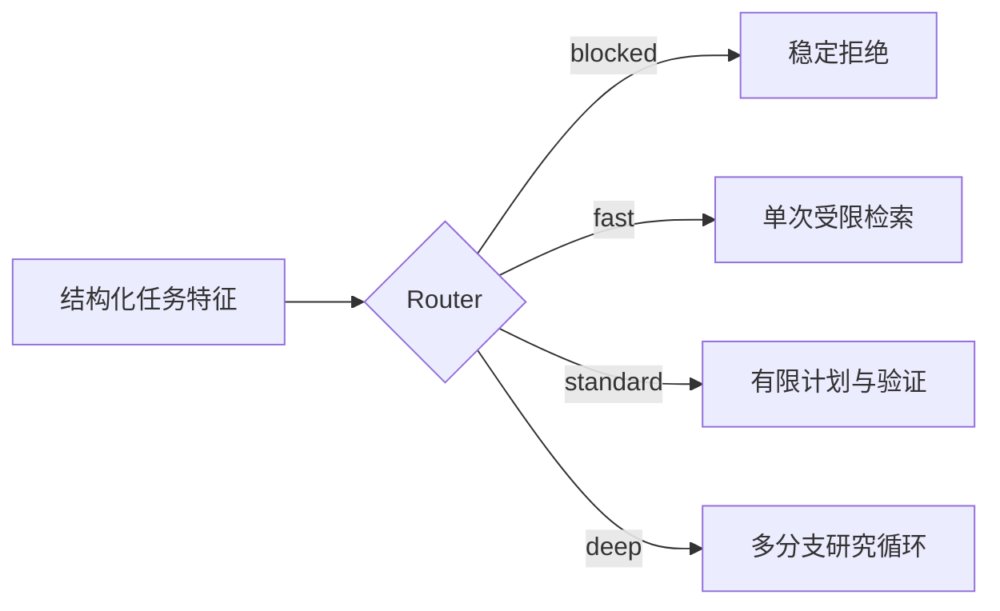

# Router 怎样选择执行模式

“生产环境最多重试几次”通常只需定位一条当前有效配置。“解释生产重试机制”要同时找到次数、退避、失败终点和例外条件。“比较生产与测试环境的重试策略，并说明差异原因”还要拆开两个范围，分别取证，再检查比较维度是否齐全。

三个问题可以共用一个 Agent 入口，所需控制流却不同。原子事实进入多轮研究会增加延迟和成本，跨范围比较只查一次又容易拼接出不存在的结论。

**Router（模式路由器）** 读取任务特征和可信运行时约束，选择本次请求的执行模式，并同时给出预算、检查点要求与稳定原因码。它决定走哪条执行路径，不直接回答问题，也不生成详细搜索步骤。

## 先把三种“路由”分开

工程中经常有三个名字相近的组件：

| 组件 | 决策对象 | 典型输出 |
| --- | --- | --- |
| 任务 Router | 本次任务使用哪种控制流 | `fast`、`standard`、`deep`、`blocked` |
| Planner | 已选模式怎样拆成可执行步骤 | SearchPlan、依赖、分支预算 |
| 模型 Router | 某一步调用哪个模型或供应商 | 模型 ID、超时、降级顺序 |

任务 Router 可能选择 `deep`，Planner 随后产生多个检索分支，模型 Router 再给规划、检索改写和答案生成选择不同模型。把三者合成一次模型分类后，控制流、任务计划和供应商选择会互相污染，也难以独立测试。

模式不是回答质量等级。`fast` 仍需遵守权限和引用，`deep` 也不能突破 Scope。它描述允许多少研究轮次、证据预算和状态管理成本。

## 模式需要对应真实控制流

一个知识 Agent 可以先定义四种模式：

| 模式 | 适合的任务 | 允许的控制流 |
| --- | --- | --- |
| `blocked` | 策略禁止、输入不完整且无法安全缺省 | 不调用模型、检索或工具 |
| `fast` | 单一范围内的原子事实 | 一次受限检索与一次生成 |
| `standard` | 需要完整解释或少量补检索 | 一轮计划、有限检索、验证 |
| `deep` | 跨来源比较、广范围研究、冲突处理 | 多分支计划、有限补缺、检查点 |

如果四种模式最终都调用同一个 Prompt 和同一条链，它们只是界面标签。真正的差异要落到 `max_research_rounds`、Evidence 上限、是否创建检查点、允许的工具集合和 Deadline 分配上。

模式也要有确定的最坏成本。`deep` 可以比 `fast` 多做工作，仍需限制分支数、研究轮次、并发数和总 Token。没有上限的“深入研究”无法进入生产准入控制。

## Router 需要哪些任务特征

模式选择的输入不是整段 Prompt。先经过一次结构化理解，把与控制流相关的特征固定下来：

```text
TaskFeatures {
  question
  scope_count
  atomic_fact
  comprehensive_answer
  cross_source_comparison
  expected_evidence_types
  side_effect_risk
  security_blocked
  remaining_ms
}
```

`scope_count` 来自服务端解析并授权后的范围，不能由模型声称“需要全库搜索”来扩大。`side_effect_risk` 来自工具策略，用户问题中的“只是测试”不能降低风险等级。`remaining_ms` 由绝对 Deadline 计算，不能在每次内部调用时重置。

`atomic_fact` 与 `comprehensive_answer` 可以由结构化理解产生候选。应用还要用稳定规则校正。例如用户明确要求对比两个环境，即使分类器认为问题很短，也应设置 `cross_source_comparison=true`。

不要为每个业务标题写关键词特判。识别“生产和测试”这类实体与显式范围，属于通用实体和范围解析；看到某个文档名就固定切换 `deep`，会让同类问题换一种表述后失效。

## 裁决顺序决定安全边界

多个特征同时出现时，需要明确优先级：

1. 输入形状和认证无效，在入口拒绝。
2. 安全策略阻断，选择 `blocked`。
3. 用户显式模式在允许范围内生效。
4. 广范围或跨来源比较选择 `deep`。
5. 完整解释选择 `standard`。
6. 单一原子事实选择 `fast`。
7. 无法可靠分类时使用有界的安全默认模式。

显式选择不覆盖安全策略。用户选 `fast` 可以限制系统少做工作，无法跳过 ACL、引用或工具审批。用户选 `deep` 也受系统最大预算限制。对外 API 最好把“请求模式”和“实际模式”分别保存，以便解释为什么发生降级或阻断。

一个可执行的 RouteDecision 可以写成：

```json
{
  "mode": "deep",
  "reason_codes": ["cross_source_comparison"],
  "max_research_rounds": 2,
  "evidence_budget": 30,
  "checkpoint_required": true,
  "revision": 0
}
```

原因码用于测试、日志和界面映射，不能把模型生成的一段解释当作唯一依据。展示文案可以修改，`cross_source_comparison` 的行为含义应保持稳定。

## 为什么要让程序完成最终裁决

模型很适合从模糊问题中提取“是否比较”“是否要求完整说明”这类候选特征。风险阻断、最大预算、显式模式上限和 Deadline 都是确定性规则。

可以把模型输出限制为一个小 Schema：

```json
{
  "atomic_fact": false,
  "comprehensive_answer": true,
  "cross_source_comparison": true,
  "rationale": "问题要求比较两个环境"
}
```

程序丢弃模型提供的 Scope、用户 ID 和工具权限，用认证上下文补入可信值，再按优先级生成 RouteDecision。结构合法只证明字段可解析，不证明分类正确，因此要用 Eval 数据验证不同表述下的稳定性。

完全使用硬编码规则也有边界。自然语言的完整性要求和隐含比较很难用少量关键词覆盖。可行组合是模型提取语义特征，程序应用不可变约束，路由结果保存特征快照与规则版本。

## 路由结果怎样驱动后续组件

RouteDecision 是控制流合同。执行器按模式加载不同节点：



`fast` 仍创建 Turn，固定 Release 和权限快照，只是省略复杂 Planning。`standard` 可以产生少量 SearchBranch，并允许一次补缺。`deep` 需要检查点和更完整的进度事件，客户端断线后不应从头重跑。

Router 不指定最终查询字符串。它可以声明 Evidence 预算和最大研究轮次，具体检索通道由 Planner 在下一步选择。这样同一模式可以在不同知识库中使用，也能独立替换检索实现。

## 证据不足时允许怎样升级

初始分类可能低估任务。`fast` 检索后发现两个冲突版本，或者 `standard` 的必需维度缺失，可以升级一次。升级仍要满足剩余 Deadline 和预算。

稳定升级规则可以是：

```text
if coverage >= minimum_coverage:
    keep current mode
elif remaining_ms < minimum_upgrade_window:
    stop with incomplete result
elif mode == fast:
    upgrade to standard
elif mode == standard:
    upgrade to deep
else:
    stop at deep limit
```

升级不是把同一请求全部重跑。已有 Evidence 保留稳定 ID，新模式只规划缺失部分。RouteDecision 增加 `revision`，执行事件记录旧模式、新模式和原因。

降级也要显式。模型限流或 Deadline 临近时，`deep` 可以停止新增分支，根据已有证据交付范围受限的结果。不能把未覆盖内容写成已经完成，也不能为了按时返回而换到越界数据源。

## 可运行示例展示了什么

仓库示例实现了模式优先级、预算映射和只允许一次的升级：

<<< ../../examples/ai-agent/mode_router.py

示例中的 TaskFeatures 由测试直接构造，目的是验证控制规则。它没有调用真实模型，也没有证明自然语言特征提取准确。接入系统时，应把结构化理解适配器放在 Router 之前，并用真实认证上下文覆盖 Scope 与安全字段。

模式参数也是示例值，不是通用最佳配置。生产上限要根据模型延迟、检索容量、SLO 和 Eval 结果设定，并随 Policy 版本发布。

## 路由评测要防止两类错误

**Under-routing（低估路由）** 会把复杂任务送进短链路，典型结果是漏掉比较维度、忽略冲突或缺少引用。**Over-routing（高估路由）** 会让简单问题承担规划和多轮研究的成本。

评测集应覆盖：

| 用例变化 | 预期性质 |
| --- | --- |
| 同一原子事实的不同问法 | 稳定选择 `fast` |
| 明确要求完整机制 | 至少选择 `standard` |
| 多范围比较和冲突核对 | 选择 `deep` |
| 用户显式选择模式 | 在策略允许范围内生效 |
| 安全阻断同时要求 `deep` | 仍为 `blocked` |
| Scope 很广但问题很短 | 不因字数短选择 `fast` |
| Deadline 已不足 | 不启动无法完成的升级 |
| 初始检索覆盖不足 | 最多升级一次并保留原因 |

除了模式准确率，还要分模式观察完成率、证据覆盖、P95 延迟、Token、升级率和安全拒绝。总体平均值会掩盖 `fast` 大量误入 `deep` 或复杂任务长期欠覆盖的问题。

线上路由日志只记录任务特征摘要、RouteDecision、规则版本和后续结果，不记录完整私密问题。发现某类请求经常升级，说明初始特征或阈值需要调整；频繁升级不能靠无限追加轮次掩盖。

Router 的产物很小，影响却贯穿整个请求。它把模糊的“深入一点”变成有限轮次、证据预算和检查点要求，也把安全阻断放在昂贵调用之前。下一步 Planner 才能在这些边界内回答：具体查什么，先查哪一支，以及何时已经查够。
