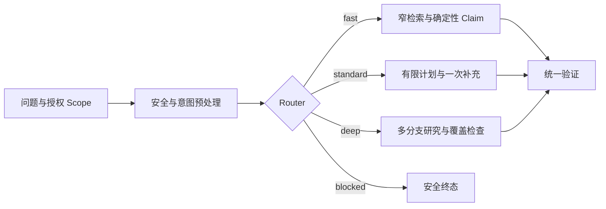

# Router 怎样选择执行模式

“缓存有效期多久？”通常只需要定位一条确定事实；“怎样导入一份文档？”需要把步骤、失败条件和验证方法串起来；“比较多个环境的重试策略，并解释差异原因”可能要拆分问题、并行检索多个来源，再检查覆盖是否完整。

三个问题都能交给同一个 Agent，但没有必要走同一条执行链。把原子事实查询送进研究循环，会多出规划、模型调用和等待时间；把跨来源比较压成一次快速检索，回答又容易漏掉范围和冲突。**Router 的工作是根据当前任务特征选择执行模式，并把选择结果变成后续组件可以执行的预算与约束。**

::: info Router 决定走哪条路径

Router 不直接回答问题，也不替 Planner 编写详细搜索计划。它输出 `fast`、`standard`、`deep` 或 `blocked` 等模式，以及选择原因、研究轮次、证据预算和是否需要检查点。

:::

模式选择不是把用户问题丢给模型，让模型返回一个字符串。风险、显式用户选项、范围数量和截止时间都有确定性约束；模型分类只能处理剩余的模糊部分，最终裁决仍由程序完成。

模式原因既要让人看懂，也要能由测试稳定断言。

## 先区分 Router、Planner 和模型路由

几个名称都带“路由”，负责的问题却不同。

| 组件 | 回答的问题 | 输入 | 输出 |
| --- | --- | --- | --- |
| 意图识别 | 用户想查询、比较、修改还是闲聊 | 当前消息和必要历史 | 结构化意图与实体候选 |
| Router | 这次任务需要多深的执行模式 | 任务特征、风险、Scope、时限 | 模式和资源上限 |
| Planner | 选定模式后要查哪些分支 | 目标、模式、别名、证据缺口 | 受限 SearchPlan |
| 模型路由 | 某一步用哪个模型 | 能力要求、成本、延迟和可用性 | 模型或降级顺序 |
| 工作流分支 | 当前状态下一步进入哪个节点 | 已保存状态和节点结果 | 确定的后继节点 |

Router 可以把问题送进 `deep`，Planner 再为它建立多个检索分支；模型路由可能让规划使用分析模型、摘要使用轻量模型。三者可以组合，但不能用“选择了更强模型”代替深度模式，也不能用“生成了五条查询”反推 Router 一定选对。

意图识别产生的结果仍是候选。用户说“完整说明缓存策略”，`完整` 可能表示希望回答详细，也可能只是文档标题的一部分。Router 应把意图、范围、显式选项和结构化实体一起判断，不能只看到一个关键词就升级到最贵路径。

## 模式要对应明确的执行差异

如果 `fast`、`standard` 和 `deep` 最终调用相同节点、相同模型和相同检索预算，模式名没有意义。每个模式至少要规定搜索宽度、研究轮次、证据预算、检查点和综合方式。

### Fast 处理原子事实

快速模式适合编号、负责人、状态、日期、有效期等单一事实。它优先使用精确、全文或结构化检索，通常不做多轮研究。证据已经形成可确定验证的 Claim 时，可以用程序直接渲染回答，避免为了改写一句事实再调用聊天模型。

快速模式不是“跳过验证”。引用、Scope、知识版本和事实支持仍要检查，只是把路径收窄。没有找到证据时返回明确空结果，不能自动扩大到全库，也不能让模型凭参数知识补答案。

### Standard 负责完整解释

标准模式适合流程说明、概念解释和需要若干相关事实的普通问题。它可以生成有限查询，组合全文、向量和结构化检索，允许一次覆盖检查和补充研究。回答综合仍要绑定 Evidence，检查点用于进程恢复和取消。

标准模式应是自动路由的稳妥默认值。问题既不明显是单一事实，也没有跨来源比较要求时，选标准模式比凭一个模糊关键词猜 `fast` 更可控。

### Deep 解决范围大或存在冲突的问题

深度模式适合跨文档、跨环境、完整盘点、原因分析和多来源比较。它允许更宽的检索分支、关系扩展和有限研究轮次，还要显式保存缺口与冲突。更多预算用于补充证据和综合，不代表可以无限循环。

深度模式的输出质量不能靠“读了更多文档”衡量。它要证明问题拆分合理、各分支覆盖了目标、冲突没有被平均掉、停止时剩余缺口可见。若只有一个来源，模式名称写成 `deep` 也不会让答案自动变深。

### Blocked 在执行前停止

安全预处理已经确认请求要泄露系统提示、绕过权限或执行禁止动作时，Router 输出 `blocked`。此模式的检索分支、研究轮次和证据预算都为零。并行预处理可能已经得到快速检索候选，阻断分支必须丢弃它们，避免可疑请求借由竞态继续进入回答。

## Router 消费结构化任务特征

路由输入可以表示成一个不可变快照：

```text
requested_mode
question
scope_count
atomic_fact
comprehensive_answer
cross_source_comparison
security_blocked
deadline_at
policy_version
```

`requested_mode` 来自接口允许的枚举值，用户显式选择快速、标准或深度时，通常应保留选择。安全阻断拥有更高优先级；用户不能通过选择 `deep` 绕过策略。平台还可以对套餐、成本或最大时限设置上限，但限制必须由策略返回，不能静默换模式。

`scope_count` 表示当前授权范围内明确选择的对象数量，不是全库文档总数。范围较大时，单次检索更难覆盖全部对象，可以升级到深度模式。Scope 必须由服务端授权结果提供，模型不能声称“我只看三个文档”后改变这个值。

`atomic_fact` 和 `comprehensive_answer` 不应由同一组关键词互斥判断。一个问题可能同时包含编号和流程，例如“REQ-17 的发布流程是什么”。意图层可以输出事实类型、目标实体、预期回答形状和覆盖要求，Router 再按优先级裁决。无法可靠分类时走标准模式，并记录 `default_safe_mode`。

`deadline_at` 是绝对时间。模式选择发生时要计算剩余时长，后续 Planner、检索和综合共享这份预算。每个节点重新获得完整超时，会让一次请求的实际时间远超用户设置。

## 确定性规则先处理约束

一条稳定的裁决顺序可以这样设计：

1. 当前问题为空或请求结构无效，入口直接拒绝。
2. 安全策略已经阻断，输出 `blocked`。
3. 用户显式选择有效模式，在策略允许范围内采用。
4. Scope 超过阈值或确认需要跨来源比较，选择 `deep`。
5. 回答必须完整解释流程，选择 `standard`。
6. 已确认是单一事实，选择 `fast`。
7. 其他情况使用 `standard`。

顺序本身是产品与风险决策，不是通用常数。高风险系统可能把所有带副作用的任务固定送入带审批的工作流；只读知识问答可以把原子查询送入快速模式。真正需要固定的是：规则有版本、输入可追踪、同一输入在同一版本下得到相同结果。

::: warning Router 不应直接按词表决定复杂度

“分析”可能出现在文档标题里，“全部”可能只是一个字段值，“多久”也可能要求跨十个系统比较。关键词适合做特征之一，不能独自决定模式。回归集要包含这些反例。

:::

需要模型辅助分类时，让模型返回结构化特征和置信度，不让它直接拥有执行权。程序校验枚举、范围和证据，低置信度时回退标准模式。模型不可用也应得到确定结果，而不是让整个 Router 失败。

## 一次模式选择怎样进入执行链

以“缓存有效期多久”为例，认证层先确定当前用户、知识库和文档 Scope，预处理识别出目标是一个原子时间事实。请求没有安全风险，也未显式选择模式，Router 返回：

```json
{
  "mode": "fast",
  "reason_codes": ["single_fact_lookup"],
  "max_research_rounds": 0,
  "evidence_budget": 12,
  "checkpoint_required": false,
  "revision": 0
}
```

Planner 根据 `fast` 只建立精确或全文分支，保留预处理阶段已经取得的候选，并为指代或 Alias 增加有限补充查询。检索返回带来源的 Evidence 后，Claim 选择器只保留与有效期直接相关的事实。验证通过，回答可以从支持 Claim 确定性生成；没有证据则以空结果停止。

第二个输入“怎样导入一份文档”被识别为完整流程说明，Router 选择 `standard`。Planner 可以同时查流程正文和结构化配置，最多进行一次覆盖补充。综合阶段解释输入格式、正常步骤、解析失败和验证方法。即使某个 Chunk 恰好包含一句简短答案，也不能把流程问题降成原子事实。

第三个输入要求比较多个环境，Scope 中有七个对象。Router 选择 `deep`，允许更大 Evidence 预算和两轮以内研究。Planner 为环境差异、重试规则和失败证据建立分支，Coverage 节点记录哪些环境仍缺资料。Deadline 到达时保留缺口并停止，不能为了凑齐结果把旧环境资料写成当前事实。



四条路径最终进入同一组权限、引用和终态规则。Router 调整执行深度，不创建另一套安全模型。

## 任务特征怎样从原始问题中产生

Router 不适合直接解析一大段自由文本，前面要有一层轻量任务理解。它把当前消息与必要历史整理为结构化特征，至少包括目标对象、问题类型、预期回答形状、范围和风险。这里的输出依然是候选，稳定 ID 和授权 Scope 由应用补充。

原子事实可以通过问题形状和实体共同确认。问题在问负责人、编号、状态、日期或有效期，并且已经解析出唯一对象，才适合标为 `atomic_fact=true`。只有“多久”两个字、没有目标对象时，分类器不应强行走快速路径；它可能需要澄清，也可能是在比较多个时限。

完整回答要求来自任务本身。“怎样导入文档”需要步骤、输入和失败处理，即使句子很短也不是原子事实；“文档导入支持 PDF 吗”只需一个受证据支持的布尔事实。字符长度只能作为弱信号，不能代替回答形状。

跨来源比较要说明比较维度和对象集合。用户说“比较重试策略”，却没有指定环境，任务理解层先从会话焦点和当前 Scope 寻找候选；仍不唯一就澄清。直接把全库都算进 `scope_count` 会把普通问题误判成深度研究，也可能越过用户显式选定的范围。

模型可用于提取这些特征，输出应限制为 Schema：

```json
{
  "intent": "compare",
  "target_ids": ["environment-a", "environment-b"],
  "answer_shape": "comparison",
  "atomic_fact": false,
  "comprehensive_answer": true,
  "cross_source_comparison": true,
  "confidence": 0.86
}
```

程序随后检查 `target_ids` 是否都在授权集合中，删除模型补出的未知对象，再计算真实 `scope_count`。置信度低或结构不完整时，走标准模式或发起澄清，不让分类模型填一个默认目标继续执行。

任务特征也要绑定历史版本。多轮追问“它们有什么不同”依赖上一轮对象集合；会话焦点已经被另一个并发 Turn 修改时，旧特征不能覆盖新状态。特征记录保存来源 Message ID 和 Conversation 修订，排查误路由时才能还原分类器当时看到了什么。

## 执行深度与编排形态是两条轴

`fast`、`standard`、`deep` 描述研究深度和资源上限，`parallel`、`sequential`、`DAG` 描述步骤之间怎样调度。深度模式不一定全并行，快速模式也可能并行查精确索引和全文索引。

没有依赖的多个检索通道可以并行，完成后按候选身份去重和融合；第二步必须使用第一步输出时采用串行；既有独立分支又有汇合依赖时，用 DAG 表达。Router 可以给出“允许并发数”和“总分支上限”，Planner 根据实际依赖创建编排图。让 Router 直接生成 DAG，会把模式裁决与详细计划耦合在一起。

并行也受下游容量约束。一次深度任务生成十个分支，不代表应该同时发出十次模型或数据库请求。运行时按全局、用户和依赖配额领取容量，未获得槽位的分支等待或在 Deadline 前取消。并发缩短等待时间，却会提高瞬时资源占用和限流风险。

串行路径适合逐步缩小范围。先解析唯一对象，再按对象 ID 查版本，最后查生效时间，比三个模糊查询并行更可靠。Router 选择 `deep` 后，Planner 仍可判断某条分支必须串行，不能为了匹配“深度研究”的名字强行并行。

结果综合也不属于 Router。每个分支返回带来源和状态的局部结果，综合器处理重复、冲突和缺口；Router 的 Trace 只需要保存选择了什么模式、允许多少分支与预算。综合失败时重做综合节点，不重新路由整个任务。

## 总预算要先于分支预算确定

模式配置的 Evidence 数和研究轮次只是上限，还要放进 Turn 的总 Deadline、Token、模型调用和工具预算。Planner 创建分支时分配局部额度，所有分支的最坏情况之和不能无限超过总预算。

快速模式通常把大部分时间留给检索和验证，不预留研究循环；标准模式为一次补充检索保留余量；深度模式需要给冲突核对和最终综合留出时间。若前置解析已经消耗过多，后续分支缩小预算或停止，不能假设每个节点都能获得配置里的完整时长。

一个简单的深度任务可以这样分配：入口与安全检查占固定小额，多个检索分支共享检索池，覆盖检查决定是否动用保留的第二轮，最后一段时间只允许综合、验证和保存终态。预算是调度约束，不应写进 Prompt 让模型自行估计。

模型调用也要分类记录。快速模式可能完全不调用聊天模型，使用确定性 Claim 渲染；标准模式把模型用在查询改写和综合；深度模式才可能使用分析模型生成计划。Embedding、Rerank 和安全分类分别记账，不能都算作一次“Agent 调用”，否则无法看出误路由增加了哪一类成本。

运行中控制信号可以要求取消、缩小范围或补充信息。取消直接进入 Runtime 的停止路径；用户新增对象会改变任务 Scope，通常创建新的计划修订；只补充一个澄清值，则可在同一 Turn 的等待边界恢复。Router 不应持续监听所有消息并反复重选模式，控制信号先由状态机判断是否仍属于当前目标。

预算不足时的降级要保留模式语义。深度比较只完成两个环境，输出应说明未覆盖对象和停止原因，不能把结果包装成完整比较。系统也可以在执行前判断当前 Deadline 无法满足最低深度要求，直接请求用户延长时间或缩小范围。

## 模式升级只能沿可解释条件发生

快速检索可能发现原问题并不原子：用户问一个负责人，却找到多个版本互相冲突。系统可以从 `fast` 升到 `standard`，补充版本核对；标准模式仍无法覆盖多个范围时，可以升级到 `deep`。升级应由 Evidence Coverage、冲突和剩余 Deadline 触发，不由模型一句“我想再研究”触发。

模式来回切换会破坏预算和恢复。一个 Turn 先从快速升到标准，再因超时降回快速，最后又因空结果升到深度，事件和检查点很难解释，成本也没有上限。实用做法是只允许单向升级一次，保存 `revision` 和 `insufficient_evidence_coverage`；预算不足时保持当前模式，以部分结果或无法确认结束。

升级不应重新从入口执行。已有 Evidence、检索回执和权限快照继续复用，Planner 只增加新模式允许的分支。重新创建 Turn 会重复查询，也可能在两个知识版本上得到不同候选。需要彻底改变 Scope 或目标时，结束当前 Turn，再由用户确认新请求。

模式也不随模型降级自动变化。分析模型不可用时，深度模式可以使用确定性查询或备用模型，仍保留原有覆盖要求；若剩余能力无法完成，就输出带缺口的失败或部分结果。把 `deep` 静默改成 `fast` 会让上层误以为完整研究已经完成。

## 可运行 Router 的输入和输出

下面的共享示例不做自然语言分类，只接收上游已经产生的结构化任务特征。这样可以单独测试路由裁决，不让关键词识别和模式选择互相掩盖问题。

<<< ../../examples/ai-agent/mode_router.py

示例给每个模式绑定研究轮次、Evidence 预算和检查点要求。安全阻断先于显式模式；自动模式按范围、比较、完整解释和原子事实依次裁决；低覆盖可以向更深模式升级一次，剩余时间不足两秒时不再创建新工作。

配套测试推演四条路径：

1. 原子有效期问题得到 `fast`，研究轮次为 0，不创建检查点。
2. 流程说明得到 `standard`，跨七个范围的比较得到 `deep` 和 30 条 Evidence 预算。
3. 即使调用方显式请求 `deep`，安全阻断仍得到 `blocked`，Evidence 预算为 0。
4. 快速模式覆盖只有 0.4 且时间充足时升级为标准，修订变为 1；第二次尝试升级保持原结果，避免振荡。

运行命令：

```bash
PYTHONPATH=examples/ai-agent \
python3 -m unittest discover -s examples/ai-agent/tests -p 'test_*.py'
```

本次执行结果是 `Ran 37 tests` 和 `OK`。这些测试证明本地路由规则、优先级、预算映射和单向升级按预期运行。示例没有调用真实分类模型，也没有覆盖数据库检查点和分布式并发，线上接入要补契约与集成测试。

## 误路由要从结果和成本两边验证

Router 单元测试先覆盖每条规则和边界值：Scope 等于阈值时走哪条路，空问题是否拒绝，显式模式是否保留，安全阻断是否清空已有候选。再准备语义回归集，避免词表只对某种写法有效。

回归样本不能只写正例。原子问题里加入“完整”作为产品名，流程问题里加入编号，普通观点问题里出现“分析”二字，都是识别过拟合的反例。每个样本标注预期模式、允许的相邻模式和不可接受模式；有些问题走标准或深度都能完成，不必制造虚假的唯一答案。

模式正确还不等于回答正确。评测要连接后续结果：`fast` 是否找到精确事实，`standard` 是否覆盖流程步骤，`deep` 是否处理多来源冲突。高风险问题误入直接回答是安全错误，普通事实误入深度模式主要是成本和延迟错误，两者不能用同一个平均准确率表示。

观测记录至少包含请求模式、最终模式、原因代码、Scope 数量、研究轮次、Evidence 数、是否升级、停止原因和策略版本。正文、完整问题和权限信息留在受控 Trace，聚合指标使用脱敏分类。模式分布突然变化时，可以定位是问题流量变化、意图识别升级，还是 Router 版本造成。

每次裁决还应保存结构化特征快照，而不只保存最终模式。排查时用同一份特征分别运行旧规则和候选规则：结果不同，说明 Router 配置改变了行为；特征本身已经不同，则继续检查意图识别、Conversation 焦点或 Scope 解析。直接拿当前问题重新跑一遍会读取新的会话和权限，无法复现当时的选择。

策略升级要兼容仍在运行的 Turn。已经按版本 4 选择 `deep` 的任务继续使用版本 4 的预算和升级规则，新请求才采用版本 5；中途切换会让检查点保存的模式与恢复后的分支上限不一致。旧版本下线前保留只读解释器，至少能读取历史原因代码并还原配置。

回放数据不必永久保存完整问题。可以保留受控的加密 Trace、特征枚举、长度区间、Scope 数量和对象类型，按隐私期限删除原文。需要语义回归的样本经过脱敏和人工确认后进入固定评测集，不能把所有线上问题自动复制成训练材料。

线上对比新规则时，先用相同离线样本重放，再做小范围 Canary。比较任务完成、合法拒答、模式升级、延迟分位和资源消耗。深度模式占比下降并不自动代表优化，可能是流程问题被错误路由到快速模式；必须连回答覆盖和安全门禁一起看。

## 常见失败和对应修复

**只看关键词**会让标题或字段值触发深度模式。证据是相似问题换个无关词后模式改变，Scope 和回答形状却相同。修复应补结构化意图和反例，不是继续扩充关键词表。

**模式频繁切换**通常来自多个节点都能改 `resolved_mode`。Trace 会出现模式修订倒退或同一覆盖率反复触发。让 Router 成为唯一写入方，升级使用单调修订，其他节点只提交 Evidence Gap。

**低风险任务进入研究循环**会拉长首个结果时间，模型调用与检索分支增加，却没有带来新的支持 Claim。调整原子事实识别和快速通道，仍保留统一验证。

**高风险任务进入直接回答**更严重。安全预处理结果可能在并行合并时丢失，或者显式模式覆盖了阻断。阻断放到最高优先级，计划分支设为空，并测试预处理已经返回候选时也会清空。

**回退没有记录**会让排障误以为自动规则选择了标准模式。模型分类超时、配置缺失和低置信度都要写独立原因代码；回退结果可执行，但不能隐藏发生过降级。

**显式模式被静默改写**会破坏用户预期。策略不允许某模式时，返回限制原因和实际模式；资源不足时说明无法完成，不能只在服务端改成便宜路径。

## Router 的适用边界

系统只有一条固定执行链时，不需要 Router。一个 `if` 就能区分闲聊和知识查询，也不必包装成 Agent 模式。模式数量增加会带来评测矩阵、成本预算、恢复路径和配置版本，只有执行差异真实存在才值得维护。

Router 选择的是当前 Turn 的处理深度，不决定业务权限，不生成事实，也不负责长期调度。Planner 依照模式创建 SearchPlan，Runtime 保存状态和停止条件，验证器决定回答能否交付。职责分开后，误路由可以单独复现，规划错误也不会被笼统归因成“Agent 不稳定”。

自动路由永远会有模糊样本。保守默认、显式用户选项和可观察回退比追求一个看似精确的分类分数更有用。Router 输出的每个模式都必须能说明输入特征、原因、预算和终点，后续才有条件优化成本，而不牺牲回答完整性。
