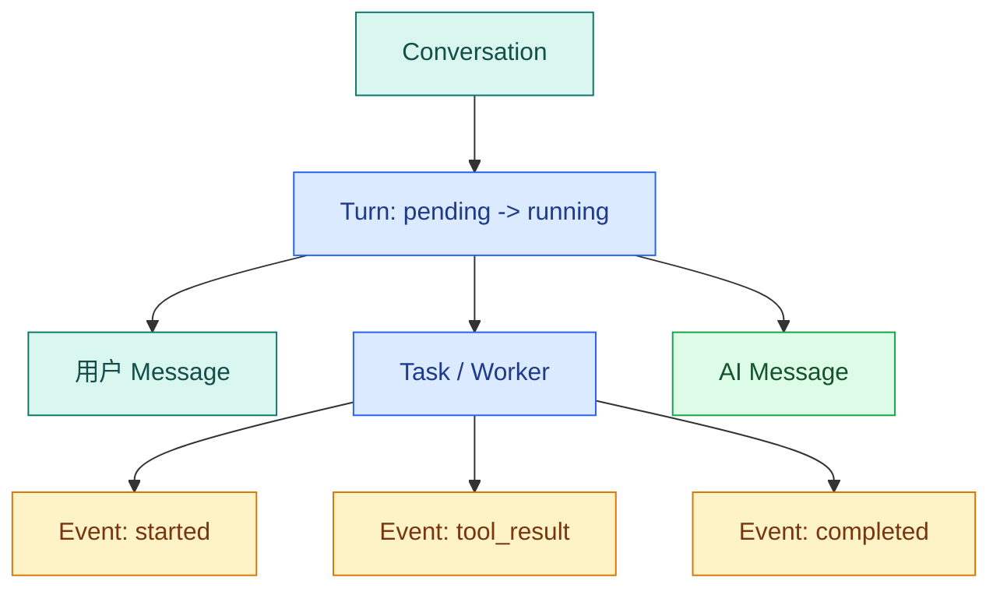

# Conversation、Turn、Message、Event、Task：Agent 的业务状态模型

只存一张 `chat_messages` 表，Demo 可以运行；一旦回答需要排队、取消、重放或引用，问题会立刻出现：用户消息属于哪次执行？模型流式事件怎样排序？Worker 重启后要查哪个状态？本篇不讲数据库框架，而是把业务对象的所有权和状态边界先设计清楚。

本文解决的是“业务 Runtime 怎样记住一轮 Agent 执行”，不是 LangGraph State 怎样在节点间传值。最终你会得到五个实体的关系、**Turn** 状态机、事件序号规则、幂等键作用域和一个可执行的聚合模型，这些对象也构成完整请求时序的业务骨架。

## 五个对象各自回答一个问题

| 对象 | 要回答的问题 | 谁拥有它 |
| --- | --- | --- |
| **Conversation** | 这些回合属于哪段对话？ | 用户/租户 |
| Turn | 这一轮执行到哪了？ | Runtime |
| **Message** | 用户和模型交换了什么？ | Conversation + Turn |
| **Event** | 状态变化按什么顺序发生？ | Turn |
| **Task** | 哪个后台执行者负责跑它？ | Worker 平面 |

Conversation 是容器，不是执行状态；Turn 是不可重复的执行单元；Message 是内容载体；Event 是追加历史；Task 是可租约、可重投的执行工作。

### Conversation：对话上下文的边界

Conversation 保存“这些回合属于同一段对话”以及它属于哪个用户、租户或知识空间。标题、创建时间、归档状态可以放在这里，但 `running` 不应放在 Conversation 上：同一对话可以有多个历史 Turn，甚至可能允许多个独立请求并行。

Conversation ID 还承担数据隔离。读取历史消息时，查询必须同时校验当前用户和知识范围；只拿一个可猜的 ID 直接查消息，会让后续上下文装配越权。

### Turn：一次请求的业务聚合根

Turn 从用户按下发送开始，到 `completed / failed / cancelled / expired` 之一结束。幂等键、问题、Deadline、知识版本、策略版本、ACL 快照、最终状态和错误码都围绕 Turn 组织。它是聚合根，意味着改变**终态**、追加终态事件、确认所有权时要从 Turn 的规则出发。

“重试一次模型调用”不是新 Turn；“用户重新提交同一业务操作”是否新 Turn，要看幂等键是否仍在有效作用域。不要用队列任务 ID 代替 Turn ID，因为一个 Turn 可能经历多次任务投递和 Worker 接管。

### Message：用户可见内容，不是执行日志

用户 Message 保存原问题，Assistant Message 保存最后允许展示的答案。工具入参、检索候选和内部验证错误不应全部伪装成 Message；它们属于 Event、Trace 或证据制品。失败 Turn 可以只有用户消息和一个错误终态，不一定有正式 Assistant Message。

流式 token 也不等于最终 Message。流式阶段可以通过 Event 向前端展示增量；验证失败时，Runtime 可能丢弃候选文本并写拒答。只有通过终态规则的内容才成为正式消息。

### Event：已经发生的事实

Event 是按 Turn 追加的事实，例如 `turn.created`、`branch.started`、`answer.delta`、`turn.completed`。它至少要有 `turn_id`、单调递增 `sequence`、类型、负载和发生时间。客户端用序号断线重放，工程师用事件还原过程。

Event 不直接承担当前状态查询。每次要判断是否完成都从头回放几百条事件，会增加复杂度；通常由 Turn 保存当前投影，Event 保存为何来到这里。两者在同一事务边界中更新，避免“状态完成但没有终态事件”。

### Task：一次可重投的执行尝试

Task 属于调度平面，记录队列、attempt、Worker owner、Lease、ACK 和结束原因。Broker 重投可能创建新的 attempt，但不能创建第二个 Turn。Worker 每次处理消息时先通过 Turn ID 查业务状态，再用 owner token 取得执行权；失去 Lease 后即使仍在运行，也不能写最终结果。



事件是追加日志，不能拿它替代当前状态查询；当前状态由 Turn 的状态字段决定，事件用于解释它怎样走到这里。

图中 Conversation 拥有多个 Turn；当前 Turn 关联一条用户 Message、零或一条正式 Assistant Message，以及多条 Event。Task 只负责把 Turn 交给 Worker 执行，Worker 产生的模型或工具过程先写 Event，只有验证成功才提交 Assistant Message 和完成终态。

## ID 怎样连接，又怎样防止串线

| ID | 谁生成 | 唯一范围 | 主要用途 |
| --- | --- | --- | --- |
| `conversation_id` | 服务端 | 全局或租户内 | 读取历史上下文 |
| `turn_id` | 服务端 | 全局 | 状态、事件、证据和恢复主键 |
| `message_id` | 服务端 | 全局 | 用户可见内容 |
| `task_id` | 调度器 | 队列系统 | 投递与 ACK |
| `thread_id` | Runtime | Checkpointer | LangGraph 历史定位 |
| `idempotency_key` | 客户端生成、服务端约束 | 用户 + 业务资源 | 重复提交返回同一 Turn |

这些 ID 可以有映射，但不要偷懒共用语义。常见做法是 `thread_id = turn_id`，便于定位快照；这不意味着 LangGraph Thread 就变成业务 Turn。删除业务 Turn 时还要按策略清理 Checkpoint，反过来删除快照也不能删除用户可见消息。

幂等键必须带作用域。同样的字符串由两个用户提交，不应命中同一 Turn；同一用户在两个知识空间提交，也可能需要区分。数据库唯一约束应覆盖作用域字段和非空幂等键，应用层的“先查再插”不能单独抵抗并发。

## Turn 的状态机

常见状态有 `pending`、`running`、`cancel_requested`、`completed`、`failed`、`cancelled` 和 `expired`。状态迁移要由服务端定义，模型返回的文字不能直接写入 `completed`。终态只能进入一次，迟到的 Worker 更新必须被拒绝并记录冲突。

| 当前 | 事件 | 下一状态 | 允许谁写 |
| --- | --- | --- | --- |
| pending | worker_claimed | running | 拥有租约的 Worker |
| running | cancel_requested | cancel_requested | 用户/服务端 |
| cancel_requested | stopped | cancelled | 当前 Worker |
| running | deadline_hit | expired | 监控/Worker |
| running | answer_validated | completed | 当前 Worker |
| running | unrecoverable_error | failed | 当前 Worker |

把 `cancel_requested` 单独列出来很重要：用户点击取消通常是请求标志，不等于后台已经停止。直到 Worker 确认停止，才能进入 `cancelled`。

如果 Turn 仍是 `pending`，还没有 Worker 持有执行权，取消接口可以直接把它变为 `cancelled`；如果已经 `running`，只能先进入 `cancel_requested`。`completed`、`failed`、`cancelled` 和 `expired` 都是终态，任何迟到的完成、取消或超时任务都只能读取终态并退出。

状态和事件不是一一对应的字符串复制。`cancel_requested` 是当前投影，`turn.cancel_requested` 是已经发生的事实；重复 HTTP 请求可以发现状态已经是 `cancel_requested` 并返回成功，但不应该再次追加完全相同的业务事件。终态事件还要满足“每个 Turn 最多一条”，否则 SSE 重放可能先看到 completed，随后又看到 cancelled。

## 状态转移实现

代码只实现确定性状态机，消息、事件和 Worker 的输入输出全部显式化。运行后会打印每次迁移，非法迁移会抛异常。


下面把“状态转移实现”落成最小实现。代码关注“Turn 状态机只允许表中定义的转移，并用终态锁阻止迟到 Worker 覆盖已完成结果”；输入从函数参数或上文定义的状态对象进入，关键分支负责校验或修改状态，返回值再交给后续调用。

```python
# Turn 状态机只允许表中定义的转移，并用终态锁阻止迟到 Worker 覆盖已完成结果。
from __future__ import annotations

from dataclasses import dataclass, field
from enum import StrEnum


class TurnStatus(StrEnum):
    PENDING = "pending"
    RUNNING = "running"
    CANCEL_REQUESTED = "cancel_requested"
    COMPLETED = "completed"
    FAILED = "failed"
    CANCELLED = "cancelled"
    EXPIRED = "expired"


@dataclass
class Turn:
    turn_id: str
    status: TurnStatus = TurnStatus.PENDING
    events: list[str] = field(default_factory=list)

    def transition(self, event: str) -> None:
        table = {
            (TurnStatus.PENDING, "worker_claimed"): TurnStatus.RUNNING,
            (TurnStatus.RUNNING, "cancel_requested"): TurnStatus.CANCEL_REQUESTED,
            (TurnStatus.CANCEL_REQUESTED, "stopped"): TurnStatus.CANCELLED,
            (TurnStatus.RUNNING, "answer_validated"): TurnStatus.COMPLETED,
            (TurnStatus.RUNNING, "unrecoverable_error"): TurnStatus.FAILED,
            (TurnStatus.RUNNING, "deadline_hit"): TurnStatus.EXPIRED,
        }
        key = (self.status, event)
        next_status = table.get(key)
        # 先检查当前状态是否允许继续推进，避免终态被重复任务或迟到结果覆盖。
        if next_status is None:
            raise ValueError(f"非法迁移：{self.status} + {event}")
        # 收到取消信号就提交取消状态并返回，后面的工具调用和结果写入都不能再发生。
        if self.status in {TurnStatus.COMPLETED, TurnStatus.FAILED, TurnStatus.CANCELLED, TurnStatus.EXPIRED}:
            raise ValueError("终态不可再次迁移")
        self.status = next_status
        self.events.append(f"{event}:{self.status}")


# 新 Turn 创建时固定当前 Release，后续发布不会改变正在运行的快照。
turn = Turn("turn-demo")
for event in ["worker_claimed", "answer_validated"]:
    turn.transition(event)
print(turn.status, turn.events)
```

`Turn.transition` 是唯一改变状态的函数，调用方只能提交事件，不能直接赋值。迁移表让每个允许路径可测试；事件列表记录迁移后的状态，便于重放。生产实现要把迁移放在数据库条件更新中，避免两个 Worker 同时读到 `running` 后都写终态。

这段内存代码还有两个有意保留的限制。第一，它没有并发保护；两个进程各自持有一份 `Turn` 对象时都可能成功。第二，`events` 只是字符串，不具备序号和结构化负载。所以下一步要把“状态条件更新”和“事件序号分配”放到同一个存储事务中。

## Event 序号为什么必须由服务端原子分配

前端通过 SSE 收到 `id: 17` 后断线，重连会带 `Last-Event-ID: 17`，服务端再查询 `sequence > 17`。如果两个 Worker 都用“先查最大值再加一”，它们可能同时得到 18，导致唯一键冲突或覆盖。

正确思路是让 Turn 保存 `next_event_sequence`，追加事件时在数据库中原子加一并取得旧值，再用这个值插入 Event。终态还需额外串行化：先检查是否已有终态事件，再追加唯一终态。下面用线程安全的内存对象表达同一语义，方便理解调用顺序；生产实现要用数据库行锁、原子 `UPDATE ... RETURNING` 或等价事务机制。

```python
# Event Store 在同一 Turn 内原子递增序号，SSE 与轮询据此判断缺口、重复和终态顺序。
from dataclasses import dataclass, field
from threading import Lock
# RuntimeEvent 保存可排序、可重放的事件状态，让断线恢复仍能重建相同执行轨迹。


@dataclass(frozen=True)
class RuntimeEvent:
    turn_id: str
    sequence: int
    event_type: str
    payload: dict[str, object]
# EventStream 保存可排序、可重放的事件状态，让断线恢复仍能重建相同执行轨迹。


@dataclass
class EventStream:
    turn_id: str
    next_sequence: int = 1
    events: list[RuntimeEvent] = field(default_factory=list)
    _lock: Lock = field(default_factory=Lock, repr=False)

    def append(self, event_type: str, payload: dict[str, object]) -> RuntimeEvent:
        with self._lock:
            sequence = self.next_sequence
            self.next_sequence += 1
            event = RuntimeEvent(self.turn_id, sequence, event_type, payload)
            self.events.append(event)
            return event

    def replay_after(self, sequence: int) -> list[RuntimeEvent]:
        return [event for event in self.events if event.sequence > sequence]
```

`append` 在同一把锁内读取并增加 `next_sequence`，然后创建不可变 Event，所以同一进程中的并发调用不会得到相同序号。`replay_after` 使用严格大于，客户端已经确认的序号不会重复返回。数据库版本还要用 `(turn_id, sequence)` 唯一约束兜底，并让事件插入与 Turn 状态更新处于同一事务。

Event payload 不要无限制保存模型原文、密钥或内部错误堆栈。事件面向重放和审计，应只放必要字段；大制品存对象存储或专用表，Event 保存稳定引用。

## Message、Event、Task 的边界

Message 保存可展示内容和角色；Event 保存阶段、序号、时间和引用 ID；Task 保存队列名、重试次数、租约、开始时间和结束原因。模型 token 流可以产生很多事件，但最终 AI Message 只在内容验证后写入，避免把未完成答案当成正式消息。

### 一次 Turn 可以有多次 Task attempt

假设 Worker A 领取 Task 后运行到检索阶段，网络断开导致 Broker 重新投递；Worker B 得到 attempt 2。两次 Task 都指向同一 `turn_id`。B 必须先取得新的 Lease 才能继续；A 即使恢复，也会因为 owner token 过期而失去写权限。

这时不能按 Task attempt 重复创建用户消息、证据或终态事件。稳定写入键可以由 `turn_id + artifact_type + artifact_key` 构成；例如同一 Turn 的正式 Assistant Message 只有一个逻辑位置，重试应更新候选或发现终态后退出。

Task 的 ACK 只说明队列消息处理完成，不说明业务回答成功。Worker 可能把 Turn 写成 `failed` 后正常 ACK；也可能业务已 `completed`，但在 ACK 前进程退出，Broker 又重投一次。重投 Worker看到终态后应安全退出并 ACK，不能再次生成答案。

## 用 pytest 固定状态不变量

下面的测试复用 `Turn` 和 `EventStream`。重点不是自然语言答案，而是终态不可逆、取消有中间态，以及断线重放不丢事件。


为了验证“用 pytest 固定状态不变量”，下面的测试把“测试覆盖非法转移、终态不可覆盖和事件单调性，防止模型文本直接驱动业务状态”变成可执行断言。每个用例自己构造输入，并用断言固定返回值或失败状态；某条测试失败时，可以从用例名直接定位到被破坏的契约。

```python
# 测试覆盖非法转移、终态不可覆盖和事件单调性，防止模型文本直接驱动业务状态。
import pytest


def test_completed_turn_cannot_transition_again() -> None:
    # 新 Turn 创建时固定当前 Release，后续发布不会改变正在运行的快照。
    turn = Turn("turn-completed")
    turn.transition("worker_claimed")
    turn.transition("answer_validated")

    with pytest.raises(ValueError):
        turn.transition("unrecoverable_error")


def test_running_cancel_requires_worker_confirmation() -> None:
    # 新 Turn 创建时固定当前 Release，后续发布不会改变正在运行的快照。
    turn = Turn("turn-cancel")
    turn.transition("worker_claimed")
    turn.transition("cancel_requested")

    assert turn.status is TurnStatus.CANCEL_REQUESTED
    turn.transition("stopped")
    assert turn.status is TurnStatus.CANCELLED


# 这个用例重复提交或恢复同一运行，确认 Checkpoint、幂等键或事件序号阻止重复副作用。
def test_event_replay_returns_only_unseen_sequence() -> None:
    stream = EventStream("turn-events")
    stream.append("turn.created", {})
    stream.append("turn.started", {})
    stream.append("turn.completed", {"message_id": "message-1"})

    replay = stream.replay_after(1)
    assert [event.sequence for event in replay] == [2, 3]
    assert replay[-1].event_type == "turn.completed"
```

第一个测试让已完成 Turn 再接收失败事件，必须抛错；第二个测试证明 running 取消不是直接 completed 或 cancelled；第三个测试模拟客户端已经看过序号 1，只重放 2 和 3。执行 `pytest -q` 预期得到 `3 passed`。数据库集成测试还要用两个并发连接争抢同一终态，断言只有一个条件更新成功。

## 把状态机制落到相似系统

测试重复 `answer_validated`、`cancel_requested` 之后迟到的完成事件、过期后 Worker 恢复三种情况。再为 Event 增加 `sequence`，让 SSE 断线能够按序号重放。进一步验证是将“引用”和“证据”作为独立实体，不把它们埋在 Message JSON 里。

完成设计时，用下面的产物自查：

- 一张实体关系图，能看出 Conversation、Turn、Message、Event、Task 的基数；
- 一张 Turn 迁移表，列出所有终态和允许写入者；
- 一条幂等唯一约束，能解释重复 HTTP 请求为何返回同一 Turn；
- 一条事件序号分配规则，能支撑 `Last-Event-ID` 重放；
- 一条 Lease 规则，能拒绝旧 Worker 的迟到写入。

## Conversation、Turn 和 Message 为什么不能合并

Conversation 是用户可继续对话的容器，Turn 是一次有明确输入和终态的执行，Message 是可展示内容。一个 Conversation 包含多个 Turn，一个 Turn 可以产生用户 Message、AI Message 和工具观察，但失败 Turn 也可能没有正式 AI Message。若三者共用一张“聊天记录”表，就很难表达取消、重试、版本快照和重复请求。

Event 是追加事实，Task 是异步执行载体。Event 的序号用于重放和审计，Task 的 ACK、attempt 和 lease 用于调度；Task 重试不应重复创建业务 Event，Event 也不应决定 Broker 是否确认消息。Runtime 通过稳定 ID 连接这些实体，却保持各自所有权。

## 数据库条件更新保护终态

内存迁移表在多 Worker 下不够。数据库更新应带当前状态和 owner token，例如“只有 status=running 且 owner_token=当前租约时，才写 completed”。更新行数为 0 代表状态已经变化或所有权丢失，Worker 必须停止，不能再读取后覆盖。终态写入和最终事件最好在同一事务中完成，避免状态完成却没有事件。

## 用状态表排查请求卡住

先查 Turn 当前状态，再查最近 Event、Task lease 和 Checkpoint。pending 无任务说明投递失败；running 且 lease 过期说明 Worker 停滞；completed 无 AI Message 说明终态事务边界错误；cancel_requested 长时间不变说明取消没有传播。把这四种症状做成 Runbook，比从模型日志开始搜索更有效。

## 常见问题

### Conversation 与 Turn 的关系是什么？

Conversation 是用户看到的长期对话容器，一般包含多条 Message 和多次 Turn；Turn 是一次用户提交到唯一终态的业务聚合根。同一个 Conversation 可以继续提问，但每个 Turn 有自己的幂等键、Deadline、版本快照和执行状态。把状态放在 Conversation 上，会让并发提问互相覆盖，也无法判断哪次取消对应哪个执行。

### Message 为什么不应该保存所有运行事件？

Message 面向用户可见内容与对话历史，Event 则记录 accepted、retrieving、validated、completed 等不可变事实。运行期间可能产生几十个事件和多个失败分支，不适合作为聊天消息展示。分开后 Message 可以安全裁剪进入上下文，Event 可以按 sequence 重放和审计；最终 AI Message 只有在验证与事务提交后才成为正式内容。

### 一轮 Turn 为什么会有多个 Task attempt？

队列是至少一次投递，Worker 可能在 ACK 前退出、Lease 过期或由恢复扫描器补投，因此同一个 Turn 会有多个执行尝试。Task 记录 attempt、队列、owner 和时间，Turn 仍只允许一个终态。副作用以 Turn 或业务幂等键去重，状态更新带 owner token 条件，防止旧 attempt 在恢复后覆盖新执行者。

### Event sequence 为什么不能由 Worker 自己加一？

多个 Worker、取消请求和恢复任务可能同时写事件，进程内计数会产生重复或倒序。序号需要在事实存储中按 Turn 原子分配，并与事件写入处于同一事务边界。客户端使用 `(turn_id, seq)` 去重和重放；若序号有洞可以允许，但已提交序号不能重用或改变含义。

### 终态为什么要由数据库条件更新保护？

取消、超时、Worker 完成和恢复扫描可能竞态。更新语句以 `status IN 非终态`、owner token 和必要版本作为条件，只有一个写入者能把 Turn 推进到 completed、cancelled、expired 或 failed。影响行数为零表示状态已经被别人决定，当前执行者停止并读取事实。仅在 Python 枚举中禁止迁移，无法保护多个进程。
