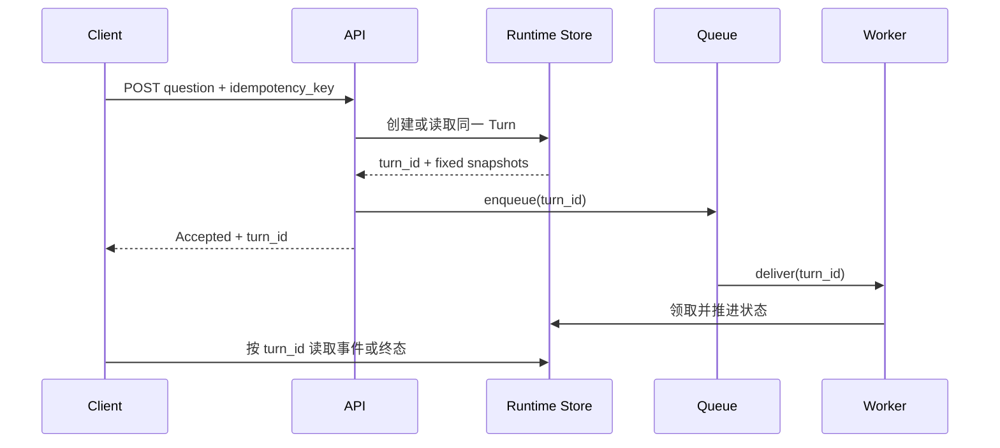
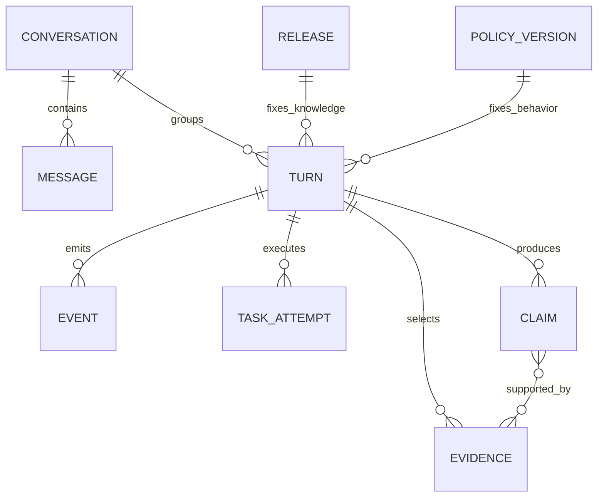

# Agent Runtime 的领域模型与状态归属

一次研究型回答可能运行几分钟。用户提交问题后关掉页面，Worker 继续检索；用户重新打开页面，要从上次事件位置恢复；随后又点击取消。若整个过程只依赖最初的 HTTP Request，连接断开后就没有稳定对象可以回答“任务是否还在运行、已经做了什么、该取消哪一次执行”。

**Agent Runtime** 是保存这段执行状态并约束状态变化的应用运行时。它创建一次可持久化的 Turn，固定身份、知识 Release、Policy、Deadline 和预算，再让 Worker 在这个快照上推进模型、检索与工具调用。客户端连接只是创建、读取和控制 Turn 的通道，不拥有执行生命周期。

Runtime 的领域模型需要把 Conversation、Turn、Message、Event、Task、Release 和 Policy 分开。它们有关联，但处理的是不同问题：会话怎样容纳多轮交流，一次目标何时结束，用户看到了什么，状态变化如何重放，哪个 Worker 正在执行，本次回答用了哪份知识，运行规则来自哪个版本。

::: info 先记住一个中心对象

**Turn** 表示用户一次目标从接收到终态的完整生命周期。幂等、取消、恢复、事件、Evidence、Claim、Release 和 Policy 最终都指向 Turn，而不是指向某条临时 HTTP 连接。

:::

## HTTP Request 为什么不能直接充当 Turn

HTTP Request 的生命周期从服务端收到连接开始，到返回响应或连接中断结束。它适合校验输入、鉴权和返回受理结果，却不适合保存分钟级任务状态。代理超时、浏览器刷新和网络切换都会终止连接，但这些事件不等于业务任务失败。

Turn 的生命周期由业务状态机决定。它可以在请求返回 `202 Accepted` 后继续运行，也可以在用户离线时完成。另一个请求凭 `turn_id` 读取事件和终态，取消接口也只提交控制信号。只要 Turn 持久化成功，任何一条客户端连接断开都不会产生第二次执行。

把二者混在一起会出现三个问题。服务端为了等完整答案长期占用连接；断线重试创建重复任务；异步 Worker 完成后找不到可以写入的稳定记录。更危险的情况是，接口超时被误当作任务失败，调用方再次提交，两个 Worker 对同一外部工具产生重复副作用。

正确入口先锁定幂等范围，查找已有 Turn，再固定 Release、Policy 和 ACL 快照。新 Turn 写入成功后，接口追加 `turn.queued` 事件并投递 `turn_id`。队列发送失败时，Turn 保留明确的失败或待恢复状态，不能删除后假装没有受理过。


## Conversation 保存多轮容器

Conversation 是一组有序交流的容器，通常属于一个用户和知识库。它保存会话标题、应用身份、当前消息序列、上下文摘要或 Nonce 等长期信息。关闭页面不会结束 Conversation，创建新 Turn 也不会覆盖前一轮结果。

Conversation 不拥有某一次执行的终态。同一会话可以先后产生多个 Turn，甚至在策略允许时存在并发 Turn。每个 Turn 固定自己的问题、版本和状态。Conversation 只通过消息或关联键知道发生过哪些轮次，不用一个 `status` 表示“整个会话正在运行”。

多轮上下文也从 Conversation 读取，但装配结果属于当前 Turn。Worker 创建模型输入时选择历史 Message、记忆和 Evidence，并记录装配版本。后续会话增加新消息，不会让已经运行的 Turn 自动获得新上下文；是否接受运行中追加消息由控制协议决定。

删除 Conversation 时要区分展示数据与审计数据。用户消息和答案按产品策略删除，正在运行的 Turn 先取消或转移所有权；安全审计可能保留脱敏状态变化和稳定 ID。级联删除不能绕过活动 Task 与 Evidence 的保留规则。
## Turn 固定一次目标和执行快照

Turn 在创建时保存 `turn_id`、知识库、用户、Conversation、问题、幂等键、请求模式、Deadline、ACL 快照、Release ID 和 PolicyVersion ID。`pending` 表示已经受理但尚未进入主循环，`running` 表示 Worker 已取得推进资格。完成、失败、取消和过期都是终态。

```text
pending
├── running
│   ├── completed
│   ├── failed
│   ├── cancel_requested -> cancelled
│   └── expired
├── cancelled
└── expired
```

状态图不是 UI 进度条。每条迁移都带写入条件，例如 `pending -> running` 只能由成功领取执行的 Worker 完成；`running -> completed` 要求答案、验证摘要和必要产物已经持久化；取消请求只把运行中状态改成 `cancel_requested`，Worker 在安全边界停止后才写 `cancelled`。

终态单调。Completed 不能回到 Running，Cancelled 也不能被迟到模型结果覆盖。更新语句把允许的旧状态放进条件，受影响行数为零说明状态已经变化。Worker 此时重新读取当前事实，不凭内存里的旧状态强行提交。

Turn 还拥有 Evidence、Claim 与验证结果的关联。检索候选、最终证据、Claim 支持和 Citation 都指向同一个 `turn_id`，离线 Eval 才能还原模型看到了什么。把这些材料只放在 Trace 字符串里，后续无法按对象版本和权限做结构化检查。

### Release 与 Policy 为什么在开始时固定

Release 决定本次检索可见的知识版本，Policy 决定模式路由、Prompt、工具、预算和质量门禁。创建 Turn 后即使知识库激活了新 Release、灰度策略完成晋升，正在执行的 Turn 仍沿用原 ID。恢复、重试和 Eval 才能读取同一组事实与规则。

固定版本不等于把完整配置复制进每条记录。Turn 保存不可变版本 ID，执行上下文通过该 ID 读取配置。旧版本退休后仍要在保留期内可读；已经被物理删除或无法解析时，恢复应失败关闭，不能悄悄切到“当前版本”。
## 实体关系怎样落进持久层

Conversation 与 Turn 是一对多关系，Turn 再关联用户 Message、助手 Message、Event、Evidence 和 Claim。Task 不必和业务表共享主键，它只保存 `turn_id` 与 Attempt；Release 和 PolicyVersion 被多个 Turn 引用，因此删除规则通常使用 Restrict 或保留墓碑版本，不能级联删除历史执行。



Turn 表保存经常参与条件更新的字段：Status、Deadline、更新时间、下一个 Event Sequence、Cancel Requested At 和 Completed At。问题、ACL 快照、Search Plan 与验证摘要可以放结构化列或 JSON，但必须有 Schema 版本。需要按错误类型、Release 或 Policy 查询的字段应独立成列，不能全塞进一份无法索引的 Trace。

Event 表用 `(turn_id, sequence)` 唯一约束维持顺序。Sequence 是单个 Turn 内的游标，不需要做全局自增。Payload 保存交付所需的最小数据，完整 Evidence 与 Claim 通过对象 ID 查询。把整份检索正文复制到每个进度 Event，会增加存储、泄露范围和重放带宽。

Evidence 使用稳定 `evidence_key` 表示运行时身份，再保存 Knowledge Object、Source Version、Document、Chunk、Trust Level、Freshness 与是否进入最终答案。Claim 单独保存文本、支持状态和置信度，中间关系表连接 Evidence。答案修改时，Runtime 在同一 Turn 下更新产物修订，不把旧 Citation 悄悄指向新文档。

消息顺序和事件顺序是两套序列。Message Sequence 表示对话阅读顺序，Event Sequence 表示执行发生顺序。一次助手答案可能经历多个 Delta 与 Replace Event，最终只形成一个可见 Message；用户同时追加消息时，会话顺序变化，却不重排已经写入的执行 Event。

### 创建 Turn 的事务边界

创建过程先在 `(knowledge_base_id, user_id, idempotency_key)` 范围加事务锁，再查询已存在记录。没有记录时读取活动 Release，按稳定分桶选择 Policy，生成绝对 Deadline 并插入 Turn。数据库唯一约束处理两个事务同时穿过查询的最后一道竞态，冲突方重新读取已有 Turn。

Release、Policy 与 ACL 必须在插入前验证属于同一知识库。客户端可以提交希望恢复的版本 ID，但程序只接受仍可读取的 Active 或 Retired Release，以及真实存在的 PolicyVersion。用户不能通过请求字段引用另一个租户的版本。

Turn 和初始 Event 最好在同一数据库事务中提交。队列投递通常跨越数据库事务，可以使用 Outbox 或持久任务记录衔接：事务提交后由投递器发送，重复发送依靠 `turn_id` 幂等。先发队列后写 Turn 会让 Worker 读不到执行上下文，先写 Turn 后直接发队列则要处理进程在两步之间退出。
## Message 记录交流，Event 记录状态变化

Message 是用户或助手看到的交流内容，包含角色、正文、顺序和可见状态。用户问题形成 User Message，最终答案形成 Assistant Message。流式输出可以更新同一助手消息的修订，不能每个 Token 插入一条独立 Message。

Event 描述 Turn 生命周期中的事实，例如已排队、开始检索、Evidence 就绪、候选答案生成、验证替换、完成或失败。它面向重放和观测，Payload 可以包含进度、稳定对象 ID 与错误类型，不等于用户可见聊天记录。

同一句“正在检索”可以作为进度 Event 发送，却不该成为永久 Message；最终答案是一条 Message，也会伴随 `turn.completed` Event。分开后，客户端可以选择展示哪些事件，审计系统则读取完整状态变化。把两者合并会让重连时重复聊天内容，或为了界面简洁而丢失运行证据。

Event 在每个 Turn 内使用严格递增 Sequence。追加事件先原子增加 `next_event_sequence`，再写入对应序号；批量事件一次预留连续区间。客户端携带最后游标重连，只读取更大的序号。终态 Event 需要幂等保护，同一 Turn 最多保存一个 Completed、Failed、Cancelled 或 Expired 终态事件。

Event 的存在不意味着完整事件溯源。权威状态仍在 Turn 表，事件用于交付与解释。恢复时先读取 Turn 状态，再用 Event 补充进度；若两者冲突，系统停止并修复写入事务，而不是通过最后一条事件猜状态。
## Task 表示一次异步执行尝试

Task 是队列或工作流引擎对 Turn 的一次执行尝试，包含任务 ID、`turn_id`、Attempt、领取时间、Worker、Lease 和投递状态。同一个 Turn 可能因为 Worker 退出而有多个 Task Attempt，但只能产生一条逻辑结果。

Worker 不拥有 Turn。它取得有限 Lease 后读取执行上下文，按状态条件推进；Lease 过期或状态已终止时停止提交。队列的 ACK 只说明消息处理到某个阶段，不能替代业务终态。Task Success 也不能直接覆盖 Turn Completed，必须先保存答案、Evidence、Claim、验证结果和终态事件。

重复投递是正常输入。两个 Worker 同时收到同一 `turn_id` 时，只有一个能把 Pending 改为 Running 或取得有效执行权。另一个读取现状后结束。工具副作用还需要动作级幂等键，因为 Worker 可能在外部调用成功、写回 Checkpoint 前退出。

Task 的错误分类保留发生位置。队列不可用、Worker 启动失败和 Lease 丢失属于执行基础设施；模型超时、检索失败和验证拒答属于 Turn 内依赖；用户取消与 Deadline 是控制终止。把它们都写成 `failed` 字符串，会让恢复器无法判断能否重试。
## 身份与租户范围贯穿所有对象

Turn 的用户和知识库来自认证上下文，不从问题文本或模型输出提取。读取 Turn、Event、Message 和反馈前都校验所有权；Worker 使用服务身份执行，却必须携带创建时固定的 ACL Snapshot。服务身份拥有数据库连接，不代表它可以扩大业务 Scope。

Conversation 不能跨租户挂接 Turn，Release 与 Policy 也必须属于同一知识库。缓存键、队列 Payload、Checkpoint 和 Trace 都带 Tenant 或 Knowledge Base 维度。若缓存只用 `turn_id`，还要保证 ID 全局不可猜且命中后重新鉴权；更稳妥的做法是在查询条件中同时限制租户和用户。

Event Payload 面向客户端时要再次过滤。内部事件可以保存工具错误和受控对象 ID，普通用户只接收安全进度与自己的结果。取消失败不应泄露“该 Turn 存在但属于别人”，外部可以统一返回 Not Found，审计层保存精确拒绝原因。

恢复扫描器是高权限后台组件，更要遵守快照。它批量领取失联 Turn 后，逐条读取原用户、Scope、Release 和 Policy，不能用扫描器身份重建全局检索。某个 ACL 对象已经撤销时，恢复策略根据快照与当前安全规则决定拒答或终止，不能为了复现旧答案绕过撤权。
## 各实体的职责与唯一所有者

领域对象的边界可以用“谁允许写状态”检查。API 拥有请求校验与创建命令，不拥有 Turn 的执行结果；Runtime Repository 负责状态条件、版本快照、事件序号和持久化不变量；Worker 编排模型与工具，但只能通过 Runtime 接口提交候选迁移；交付层读取事件，不改写核心状态。

| 对象 | 主要职责 | 状态所有者 | 不应该承担的职责 |
| --- | --- | --- | --- |
| Conversation | 保存多轮容器与有序关系 | 会话服务 | 表示某次任务终态 |
| Turn | 保存一次目标、快照和终态 | Agent Runtime | 代表网络连接 |
| Message | 保存用户可见交流 | 消息服务 | 充当状态事件或 Task |
| Event | 保存可重放的状态变化 | Event Store | 直接修改业务终态 |
| Task | 表示一次异步尝试与 Lease | Worker/Queue Adapter | 覆盖逻辑 Turn 结果 |
| Release | 固定知识事实版本 | 知识发布服务 | 随 Turn 临时改写 |
| Policy | 固定运行规则版本 | 策略发布服务 | 从用户 Prompt 读取权限 |

跨所有者写入使用命令与版本条件。取消 API 提交“请求取消 Turn”，不会直接杀死未知 Worker；Worker 提交“以状态修订 N 完成 Turn”，不会更新 Conversation 的其他轮次；Policy 发布服务只改变新 Turn 的分配，不能替换运行中快照。
## 断线、重连和取消怎样穿过这些对象

用户提交研究问题，API 创建 Conversation 中的 User Message，再以幂等键创建 Turn。Turn 固定 Release 7、Policy 3 和 ACL 哈希，Event 1 记录排队。HTTP Request 返回 `turn_id` 后结束，Worker Task 1 随后把状态从 Pending 改为 Running，Event 2 记录开始。

检索完成后，Worker 保存 Candidate 与 Evidence，Event 3 写入可公开的阶段进度。用户此时关闭页面，没有任何领域状态变化。几分钟后重新连接，客户端携带游标 1，服务返回 Event 2 和 3；不会创建新 Turn，也不会重新检索。

用户点击取消。取消请求校验 Turn 所有权，把 Running 改为 Cancel Requested，并追加 Event 4。Worker 在下一次模型或工具边界读取取消信号，停止创建新动作，清理可安全释放的资源，再写 Cancelled 和唯一终态 Event 5。

模型响应若在取消后到达，只能作为迟到调用证据保存，`complete()` 的状态条件不再匹配，答案不会交付。外部工具已经确认执行的结果不能假装撤销，Runtime 把它记录为部分副作用，并按工具契约补偿或转人工处理。

若取消发生在 Pending，系统可以直接写 Cancelled，因为还没有 Worker 执行。取消请求本身超时，客户端重新读取 Turn 决定结果；它不能连续发送新问题来代替取消。整个过程里 HTTP Request 有三条，逻辑 Turn 只有一条。
## 终态与恢复需要哪些证据

Completed 要求最终答案、验证摘要和关联产物已经写入。Failed 保存稳定错误码、可控错误信息和发生阶段；Cancelled 保存请求时间、确认时间与未完成动作；Expired 表示绝对 Deadline 到达，后台扫描器可以对仍非终态的 Turn 执行条件更新。

恢复器扫描 Running 或 Cancel Requested 中长时间未更新、且 Deadline 尚未到达的 Turn，通过 `FOR UPDATE SKIP LOCKED` 分批领取。它读取上次 Checkpoint、当前状态、Release、Policy、ACL 与剩余预算，再决定重新投递、取消确认或失败。更新扫描时间可以防止多个恢复器反复领取同一批记录。

恢复不等于从开头重跑。已经持久化的纯计算步骤可以复用，幂等工具可以用动作指纹查询结果，结果未知的非幂等工具停在人工确认。模型调用通常可以重新发起，但消耗同一份剩余 Deadline 和调用预算，并保留前一次超时证据。

数据库提交结果未知时，先查 Turn 和 Event，不直接重试写入。终态已存在就返回原结果；状态仍允许迁移才使用同一命令；出现答案已写但缺少终态 Event，则由修复任务补齐事件，不能再生成一次答案。
## 从状态不一致定位责任层

入口返回 422 且没有 Turn，先查鉴权、Schema、幂等键和版本可用性；Turn 已经 Pending 却迟迟没有 Started Event，查 Outbox、队列路由和 Worker 准入；状态 Running 但更新时间停止，查 Task Attempt、Lease、当前阶段与依赖调用。三个现象不能用同一个“模型超时”解释。

Event 有缺口时，比较 Turn 的 `next_event_sequence`、事件唯一约束和写入事务。如果 Sequence 已增加却没有对应 Event，说明事务边界或手工写入破坏了不变量；客户端重连本身不会制造缺口。相同终态 Event 出现两条，则检查终态锁与幂等追加。

答案存在却没有 Message，责任在完成后的交付投影；Message 已完成但 Turn 仍 Running，则交付层越权写了可见内容。Evidence 在 Trace 里出现、结构化表没有记录，检查产物持久化事务；Citation 指向不存在的 Evidence，则 Claim 关系写入顺序或回滚处理有问题。

取消后仍有工具调用，先对照 Cancel Requested At 与动作创建时间。动作在信号之前创建、之后返回，属于在途调用；动作在信号之后创建，说明 Worker 没在决策边界检查取消。前者关注工具可取消性和补偿，后者修 Runtime 控制流。

恢复后使用了新 Release，直接比较 Turn 的 Release ID、Worker 加载参数和 Checkpoint。Turn 记录已变说明有组件越权更新快照；Turn 未变而查询用了活动版本，说明依赖适配器忽略了显式版本。日志必须保留两者，不能只写“恢复答案不同”。
## 最小示例怎样验证状态归属

共享示例保留一个内存 Turn Store。相同幂等键创建时返回同一 Turn；Turn 自己执行合法状态迁移并生成递增事件；取消确认后，迟到完成无法覆盖终态。

<<< ../../examples/ai-agent/runtime.py

运行测试：

```bash
PYTHONPATH=examples/ai-agent \
  python3 -m unittest examples/ai-agent/tests/test_runtime.py
```

测试覆盖重复创建、Running 到 Cancel Requested 再到 Cancelled、迟到完成、Deadline 终止和按游标重放。它证明内存状态机的控制逻辑，不证明数据库事务、队列投递、跨进程 Lease 或 SSE 连接已经可用于生产。

内存测试也没有覆盖外部工具的真实幂等能力。工具返回成功后进程退出、供应商超时但实际完成、数据库提交结果未知，都要在隔离环境注入故障并检查持久证据，不能从五条单元测试推断整条生产链路可靠。

生产测试还要并发提交同一幂等键，确认唯一约束只产生一个 Turn；注入 Worker 在外部调用后退出，确认恢复不会重复副作用；让取消与完成同时发生，确认只出现一个终态；切换 Release 和 Policy 后恢复旧 Turn，确认仍读取旧快照。

性质测试可以随机排列取消、完成、过期和重复投递，持续验证终态最多一个、Event Sequence 单调、权限范围不扩大、Release 与 Policy 不变化。测试失败时保存操作序列，它比一条随机种子更容易还原竞态。

集成测试连接隔离数据库和真实队列协议，检查事务锁、唯一约束、消息序列化、Worker 丢失与重连。真实模型不是状态机测试的前提，Fake Adapter 更容易固定调用边界；上线前再用小预算请求验证供应商超时和取消行为。
## 领域模型的取舍与运行代价

持久 Turn 带来恢复和审计，也增加每次请求的数据库写入。进度 Event 过细会让高 Token 流式输出产生大量行，过粗又无法显示阶段和定位卡点。常见取舍是正文 Delta 在短窗口内合并批写，阶段、控制和终态 Event 单独持久化。

Evidence 与 Claim 全量保存有利于 Eval，代价是存储和权限治理。生产系统可以让正文进入受控短期存储，长期只保留对象版本、哈希和验证摘要。保留策略按审计、回放和用户删除要求制定，不能为了降低成本把失败 Run 的唯一证据先删掉。

状态表与事件表双写提高查询效率，也要求事务不变量。只用事件重建状态更纯粹，但每次读取和迁移成本更高；只存当前状态则无法重放交付过程。本文采用权威 Turn 加可重放 Event 的折中，任何写路径都要同步维护两者。

队列把 API 与 Worker 解耦，同时引入至少一次投递、积压和延迟。任务量很小、执行时间稳定时，进程内后台任务可能足够；需要跨进程恢复、容量隔离和发布时，持久队列才值得。即使用工作流引擎，Turn 仍是面向产品和审计的领域对象，Workflow ID 只是执行适配层身份。

容量规划从写入率和并发状态开始。每个 Turn 会产生多少 Event、Evidence 与 Claim，平均运行时间多长，Pending 和 Running 各自允许积压多少，恢复扫描每批领取多少，都要有上限。指标接近阈值时执行限流或降级，不能等数据库存储耗尽后再让模型少回答一点。

Schema 演进也有代价。新 Worker 写入的 Search Plan、Validation Summary 或 Event Payload，旧版本是否能读取，需要版本字段与兼容测试。无法双向兼容时采用候选表或双写迁移，先让读路径兼容，再切写路径；直接覆盖 JSON 结构会让运行中的旧 Turn 无法恢复。
## 用领域不变量审查设计

只看表名容易把领域模型评成一张实体清单，审查时应拿具体竞态验证不变量。两次相同请求同时到达，只能得到一个逻辑 Turn；两个 Worker 同时领取，只能有一个取得推进权；取消与完成同时提交，只能落下一个终态；客户端从任意 Event Cursor 重连，都能按原顺序补齐后续事件。

版本不变量同样明确。Turn 创建后，Release、Policy 和 ACL Snapshot 不随活动指针变化；恢复任务、Eval 和反馈都能反查当时版本；另一个租户即使知道 `turn_id`，也读不到状态、事件和产物。被撤回的知识不得通过恢复或缓存重新进入答案。

产物不变量检查“答案为什么成立”。Completed Turn 必须能找到最终 Message、Validation Summary、采用的 Evidence 和 Claim 关系；拒答则保存答案契约与证据缺口。Event 只引用存在的产物，Citation 不指向候选但未采用的 Evidence。产物事务失败时，状态不能提前完成。

运行时不变量关注资源。Deadline 到达后不再创建模型或工具调用，取消确认后迟到结果不改变状态，重复 Task 不产生第二次副作用，Lease 过期的 Worker 不能提交新修订。恢复继续使用剩余预算，不把重试当作一份新任务。

最后检查删除和演进。Conversation 删除不会留下失去所有者的活动 Turn，Retention Job 不清理仍被审计引用的版本，新旧 Worker 能读迁移窗口内的记录。任何一条无法通过确定性测试时，应先修状态和事务边界，再考虑更换 Agent 框架。
## 什么时候需要独立 Runtime

一次模型调用可以在普通请求时限内完成，没有异步工具、恢复、重放或运行中控制时，应用服务直接调用模型更简单。为几十毫秒的固定转换引入 Turn、Task、Lease 和事件表，只会增加写放大与运维成本。

任务跨越客户端连接、包含多步模型或工具、需要取消、恢复、审计和反馈时，独立 Runtime 才开始有价值。队列解决跨进程调度，Workflow Engine 解决长流程的持久化重放，二者都不能替代领域模型。没有清晰的 Turn 和版本快照，换成更复杂的基础设施仍会重复执行和状态串线。

领域模型先于框架选择。先确定一次目标是什么、状态由谁写、哪些版本必须固定、终态需要哪些证据，再决定使用数据库任务表、Celery、LangGraph Checkpoint 或 Temporal。后续文章会分别展开请求生命周期、幂等、持久化循环、取消恢复、Worker 与 SSE；它们共享这里的对象边界。
## 对象边界决定并发测试的写法

Conversation 负责长期归属，Turn 负责一次目标，Task 负责可重试工作，Event 负责事实时间线，Message 负责用户可见内容。测试应分别验证它们的所有者与状态迁移，不用一张“大状态表”代替领域边界。

删除、归档和版本升级都要沿引用关系执行。活动 Turn 不能被静默删除，过期 Evidence 不能继续支撑新答案，未知事件必须进入兼容错误而不是被忽略。
