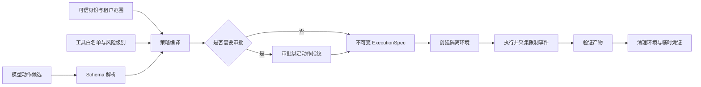
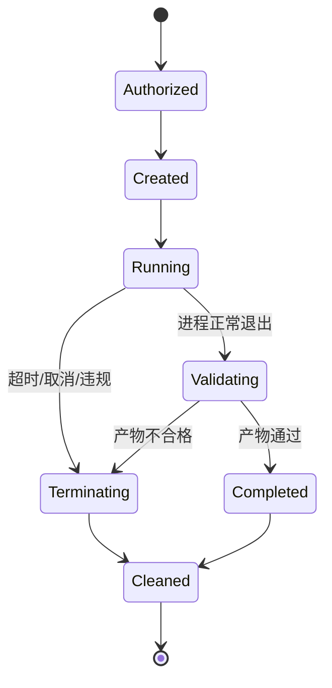

# 安全执行怎样限制文件、网络与进程

代码 Agent 收到一个正常任务：读取上传的 CSV，运行分析脚本，把报告写进输出目录。模型生成的脚本却可能读取宿主机凭证、访问云元数据地址、创建不会退出的子进程，或者把几 GB 内容写到标准输出。脚本没有攻击意图也可能因为路径、循环或依赖错误产生同样后果。

工具白名单只能决定“是否允许调用代码执行器”，无法约束执行器内部的每一次文件和网络访问。安全执行需要第二层边界：运行代码只看见明确挂载的目录，只能访问允许的网络目标，拿到短期凭证，并受 CPU、内存、时间、进程和输出预算限制。模型负责提出动作，策略组件编译能力，沙箱负责在操作系统或运行时层执行这些限制。

::: info 沙箱限制能力，不判断代码是否正确

一段程序可以在沙箱中安全退出，计算结果仍然错误；也可以逻辑正确，却因为申请了未授权路径而被拒绝。结果质量由测试和验证负责，沙箱只控制它能接触什么、消耗多少资源，以及出错后怎样停止。

:::

## 容器、虚拟机与沙箱不是同一个概念

**沙箱**是一组隔离目标，不特指某一种产品。它要限制 Guest 代码对宿主文件、网络、进程、环境变量、设备和资源的访问。容器、微型虚拟机、WebAssembly 运行时、操作系统用户与强制访问控制都能承担其中一部分。

容器共享宿主内核，命名空间和 cgroup 可以隔离进程、网络、挂载与资源。配置正确时适合运行现成 Linux 程序，启动与工具生态也比较成熟。容器镜像、挂载、Capabilities、Socket 和内核攻击面仍要单独审查。“放进 Docker”不等于已经完成安全隔离。

虚拟机提供独立 Guest 内核，边界通常更强，代价是镜像、启动、内存和运维更重。微型虚拟机减少了传统虚拟机设备模型与启动开销，仍需要镜像供应链、网络和回收系统。高价值、多租户、执行任意二进制的任务更适合考虑这一层。

WebAssembly System Interface（WASI）以能力方式向 WebAssembly 模块提供文件、时钟、随机数和网络等宿主接口。Guest 默认不会自动继承整个宿主环境，宿主明确预开放目录或注入接口后才能访问。它适合已编译成兼容模块的任务，不会直接运行任意 Linux 二进制，也不能把所有 Python 包无条件搬进去。

操作系统低权限用户、只读文件系统、Seccomp、AppArmor 或 SELinux 可以继续收窄容器与进程。生产系统通常组合多层，而不是选中一个名字就结束设计。选择依据包括 Guest 语言、依赖兼容性、启动延迟、隔离强度、网络需求和团队是否能维护对应运行时。

| 方案 | 适合的 Guest | 主要边界 | 需要额外处理的部分 |
| --- | --- | --- | --- |
| WASI 运行时 | 可编译为 WASM/WASI 的程序 | 能力接口、线性内存、显式预开放资源 | 语言运行时与依赖兼容、宿主函数安全 |
| Linux 容器 | 现成命令、Python 与系统依赖 | 命名空间、cgroup、挂载和网络 | 内核共享、镜像、Capabilities 与 Socket |
| 微型虚拟机 | 不可信二进制和复杂依赖 | 独立 Guest 内核 | 启动、镜像、网络、调度和回收成本 |
| 受限本地进程 | 低风险内部工具 | 用户权限与进程资源 | 隔离较弱，不适合任意不可信代码 |
## 先把执行请求编译成能力清单

模型不应该直接提交一条 Shell 字符串。运行时先把意图解析成结构化请求，再结合可信身份、策略版本和审批生成不可变的执行规格。规格中没有声明的能力，Guest 默认拿不到。

```text
ExecutionSpec
├── sandbox_id
├── artifact_digest
├── argv
├── read_mounts
├── write_mounts
├── network_rules
├── environment_refs
├── stdin_ref
├── cpu / memory / process / output limits
├── deadline
├── approval_fingerprint
└── policy_version
```

`artifact_digest` 固定实际运行的代码或镜像，`argv` 是已经解析的参数数组，不交给隐式 Shell 再解释。读写挂载分开，输入目录默认只读，输出写入任务专属目录。网络规则列出协议、主机、端口和必要的 DNS 行为。环境变量只引用凭证对象，执行前短期注入，日志不保存明文。

执行规格由策略组件创建。模型可以提议文件名、查询或处理方式，不能提供宿主绝对路径、租户 ID、云凭证和资源上限。调用方也不能在执行开始后偷偷修改规格，否则审批与审计都失去意义。需要变更参数时，创建新修订并重新授权。



执行器只接收通过策略编译的规格。把授权逻辑散落在每个工具适配器里，容易出现一条新代码路径忘记检查 Scope。集中编译能力后，WASI、容器或虚拟机后端都消费同一组约束，后端再负责把约束翻译成真实运行时配置。
## 文件系统隔离要在解析后判断路径

只检查字符串是否以 `/workspace` 开头挡不住路径穿越。`/workspace/input/../../etc/passwd` 在字符串层看似进入工作区，规范化后已经越界。执行器要拒绝相对逃逸，使用规范化后的绝对路径，并在打开文件时确认对象仍位于允许根目录。

符号链接会绕过一次性的路径检查。工作区内的 `input/current` 可以指向宿主敏感文件，检查原路径时仍在允许目录。策略需要解析符号链接后的目标，限制链接深度，并防止检查完成到打开文件之间目标被替换。支持的平台可以使用以目录句柄为起点的安全打开方式，避免重新从全局路径查找。

输入挂载默认只读。Guest 需要输出时，给它独立的 `/workspace/output`，不要把整个项目根目录可写挂载。写入采用配额和文件数量上限，最终产物先留在隔离区，由宿主检查类型、大小、路径与内容后再发布。一个进程成功退出，不代表它生成的压缩包或 HTML 可以直接交付。

临时目录也属于文件能力。很多库会自动写缓存、字节码、模型文件或崩溃转储，未配置时可能落到共享 `/tmp`。每个 Sandbox 使用私有临时目录，退出后按 Sandbox ID 清理。清理器必须幂等，仍被活动执行引用的目录不能提前删除。

只读不等于无风险。Guest 读取大量文件可以造成信息聚合与输出泄露，读取设备文件可能访问宿主能力。挂载清单应精确到任务需要的目录或文件，不暴露 Docker Socket、SSH 目录、宿主根目录、进程文件系统和云凭证目录。
## 网络默认关闭，再为任务开放目的地

多数本地代码分析和文档处理不需要网络。默认关闭出口，能同时减少数据外传、依赖下载、内网扫描和云元数据访问。任务确实需要远程 API 时，策略按主机、端口和协议开放，不能让模型填一个任意 URL 后直接联网。

主机白名单还要考虑 DNS。只检查 URL 文本，攻击者可以让域名解析到回环、链路本地或内网地址；第一次解析通过后，连接时也可能换成另一个地址。网络代理可以统一解析并校验目标 IP，每次重定向重新检查。云元数据网段、回环和私网默认拒绝。

通过宿主代理访问外网，Guest 不需要拥有原始网络设备。代理可以添加认证、速率限制、请求体上限和审计，并对响应做内容扫描。代理凭证按目标服务与任务发放，不能给通用云账号密钥。任务结束或取消后立即撤销临时凭证。

网络响应仍是不可信数据。允许访问官方文档站点，只说明目标在白名单，不代表页面里的指令可以改变工具能力。响应回到上下文时保留 URL、最终地址、内容哈希和信任标签，继续经过提示注入与敏感信息门禁。

完全断网也有代价。运行时不能临时下载缺失依赖，因此镜像或 WASM 产物要在构建阶段准备并锁定。构建网络与执行网络分开，依赖包经过来源、哈希和漏洞检查后进入不可变制品。生产执行时才发现缺包，不应临时放开互联网补救。
## 环境变量、标准输入输出与凭证都要限量

宿主进程的完整环境不能直接继承给 Guest，其中可能包含数据库 DSN、云密钥、监控 Token 和内部地址。执行规格只列允许变量，值从凭证服务按任务读取。可以用文件描述符、内存挂载或短期 Token 传递，重点是最小范围、短有效期和任务结束后撤销。

命令行参数会出现在进程列表与审计记录，不适合放密钥。标准输入可以传数据，但要设大小上限并避免把秘密回显到标准输出。需要认证的网络请求优先通过宿主代理代加凭证，Guest 只知道业务请求，不直接接触长期密钥。

标准输出和错误输出必须限长。一个死循环不断打印，可能先耗尽日志存储，再拖垮事件流和浏览器。执行器按字节计数，超限后截断、记录 `output_limit_exceeded`，必要时终止进程。日志保存首尾片段、内容哈希和截断标记，不把无限正文塞进数据库。

输出内容也可能带秘密、终端控制序列或提示注入。展示前转义，进入下一轮模型前按工具数据处理。密钥扫描命中后，产物进入隔离状态，不在普通日志中回显匹配值。错误堆栈只保留排障需要的帧，宿主路径和环境变量做脱敏。
## CPU、内存、时间和进程需要不同停止机制

一个 `timeout=30` 只限制墙上时间，不能替代其他资源边界。程序可以在三秒内分配完内存，也可以创建大量子进程后让父进程提前退出。安全执行至少分别控制 CPU 或指令预算、内存、墙上时间、进程数、打开文件数、磁盘和输出。

WASM 运行时可以用 Fuel 或等价的指令计量限制 Guest 执行量。每类指令消耗预算，耗尽后产生 Trap。Fuel 适合确定性的计算上限，不等同于真实 CPU 时间；宿主函数中的网络等待或阻塞代码还需要 Deadline 与取消。某些运行时也支持基于 Epoch 的中断，宿主推进 Epoch 后让超过截止条件的 Store 停止。

内存限制要覆盖 Guest 线性内存和宿主侧缓冲。只限制 WASM 页数，宿主函数读取一个巨大响应仍可能耗尽进程内存。容器和虚拟机还要配置 cgroup 或虚拟机资源，运行时内部再限制单任务分配。达到上限后返回稳定的资源错误，不自动扩大额度重试。

子进程属于一棵进程树。取消或超时后要终止整棵树，等待宽限期，再强制回收，并检查是否还有孤儿进程。仅向父 PID 发送信号，脚本启动的后台进程可能继续占用端口和凭证。隔离环境退出是最终清理边界。

资源重试消耗同一份总预算。内存不足后换更大配额属于新策略决定，不能让模型在错误文本中请求提升。可重试的瞬时宿主故障与代码自身的无限循环要分开，后者使用相同输入重跑只会再次耗尽资源。
## 用 Python 接入 Wasmtime 前先分清宿主和 Guest

[Wasmtime 的 Python 绑定](https://docs.wasmtime.dev/lang-python.html)安装在宿主 Python 环境中，用来加载和运行 WebAssembly 模块。

官方文档说明 Python 绑定发布为 `wasmtime` 包，安装地址、API 参考和版本说明分别以 [Python API 文档](https://docs.wasmtime.dev/lang-python.html)与 [PyPI 项目页](https://pypi.org/project/wasmtime/)为准。新建虚拟环境后可以执行：
<figure class="doc-shot">
  
  <figcaption>Wasmtime 官方 Python API 文档。页面明确指出 Python 绑定发布为 `wasmtime` 包，截图用于定位官方入口，不替代版本核对。</figcaption>
</figure>

```bash
python3 -m venv .venv
source .venv/bin/activate
python -m pip install --upgrade pip
python -m pip install "wasmtime>=36,<37"
python -c "import wasmtime; print(wasmtime.__version__)"
```

最后一条确认宿主进程实际导入的版本；版本输出与锁文件不一致时，先检查 `python -m pip show wasmtime` 和当前虚拟环境。它不代表沙箱策略已经正确，也不会自动下载一个可执行任意 Python 源码的 Guest。WASI 示例与中断机制应以当前 Wasmtime 文档对应的 API 为准，生产依赖要固定版本并执行升级回归。

运行一个 WASM 模块时，宿主创建 Engine、Store 和 Linker，配置 WASI 上下文，把允许的目录、参数、环境与标准流显式连接给 Guest，再实例化模块并调用导出函数。目录没有预开放，Guest 就不应看到；宿主函数没有 Link，Guest 也不能凭空访问它。

```text
Agent Runtime
    │ 生成 ExecutionSpec
    ▼
Wasmtime Host
    ├── Engine / Store：执行与资源边界
    ├── WASI Context：参数、环境、标准流
    ├── Preopened resources：允许目录和能力
    └── Host functions：经过审查的宿主接口
             │
             ▼
        WASM Guest Module
```

如果目标是执行 Python，宿主 `pip install wasmtime` 仍然不够。还需要一个与目标 WASI 版本匹配的 Python Guest 运行时，以及已经包含或可访问依赖的制品。很多依赖包含原生扩展、动态链接或系统调用，未必能在 WASI 环境工作。团队应在构建阶段生成 Guest 制品，记录来源、编译参数、目标、哈希和兼容性测试，不能在生产任务里临时下载一个解释器。

Python Guest 体积、初始化时间和表或内存上限会影响运行。重复任务可以复用经过清理的编译制品或预热池，不能跨用户复用可变内存、环境和文件挂载。会话持久化需要保存业务状态或产物引用，不应直接冻结包含凭证的运行时内存。

WASI 不适合所有 Python Agent 工具。依赖浏览器、GPU、系统包或大量 C 扩展时，受限容器或虚拟机可能更实际。先根据依赖与风险选隔离后端，再统一消费 ExecutionSpec，比为了使用某个技术强行改写工具更稳。
## 宿主函数决定 WASI 边界能否成立

WebAssembly 模块默认能力有限，但宿主可以 Link 任意函数给它。一个名为 `read_document` 的宿主函数如果接受任意绝对路径并用宿主权限读取，Guest 就通过这条函数绕过了预开放目录。审查 WASI 沙箱时，既要看运行时配置，也要逐个检查自定义宿主函数的输入、身份来源、文件与网络能力。

宿主函数接收的字符串、句柄和长度都来自 Guest，需要做与外部 API 相同的校验。文件 ID 先在当前租户和任务范围内解析，再由宿主读取；网络请求只接受已登记目标；返回内容受大小限制。不能把数据库连接、对象存储客户端或通用 Shell 包成一个方便的宿主函数交给模型代码。

阻塞调用会影响取消。Guest 的 Fuel 已经耗尽，正在宿主函数里等待的同步网络请求却未必立即返回。宿主函数要使用可取消的 I/O、传播绝对 Deadline，并在运行时不支持异步中断时放到可回收的独立进程。超时只在外层返回错误，后台线程仍持有凭证和文件句柄，隔离并没有完成。

句柄生命周期也要绑定 Sandbox。Guest 获得一个文件或网络句柄后，策略变更、任务取消和实例回收都应使它失效。句柄表记录所有者、能力、创建时间和资源引用，关闭操作可以重复执行。未关闭句柄会妨碍临时目录删除，也可能让下一个任务接触上一轮资源。

WASM 模块和宿主绑定属于供应链。构建阶段固定源码、编译器、目标接口、依赖和哈希，部署时验证制品摘要。编译缓存键包含模块哈希、运行时版本、目标与安全配置，不能只按文件名复用。运行时升级后重新执行逃逸、资源和兼容性测试，旧的预编译产物不能假设继续有效。
## 预热池不能跨任务保留可变状态

频繁创建隔离环境会增加延迟，平台常用预热池准备 Engine、镜像或空闲虚拟机。可以复用只读编译产物和经过验证的基础镜像，不能直接复用上一轮的线性内存、环境变量、临时文件、Cookie、DNS 缓存和打开的连接。

每次领取预热实例时，调度器绑定新的 Sandbox ID、租户、策略版本和能力清单。执行结束后先撤销凭证、终止进程树、关闭句柄、清空可写层和网络规则，再做健康检查。任一步失败，实例进入隔离队列，不回到可用池。为了维持池容量而忽略清理错误，会把偶发残留变成跨租户泄露。

清理证明需要可观察字段：活动进程数归零、挂载只剩基础只读层、临时凭证已撤销、网络代理没有活动会话、可写层已销毁。一个 `cleanup()` 返回成功不足以说明这些后置条件成立。回收测试可以在第一轮写入唯一标记，第二轮使用不同身份启动，确认文件、环境、内存和网络状态都无法读到该标记。

队列调度也不能让不同风险任务共享同一类 Worker。允许外网的浏览器任务、完全断网的数据处理和具有生产写权限的运维工具应使用不同执行池与凭证边界。池标签来自策略编译，模型不能指定“换到权限更高的 Worker”。
## 审批必须绑定准确动作

人工确认不能只显示“允许写文件吗”。审核人需要看到工具、目标路径、参数摘要、网络目的地、预计资源和影响范围。系统把这些字段规范化后计算动作指纹，批准记录绑定指纹、身份、策略版本、有效期和次数。

模型在审批后把输出路径从 `/workspace/output/report.md` 改成 `/workspace/input/source.csv`，新请求的指纹已经变化，旧批准不能复用。脚本制品哈希、命令参数或网络白名单变化也一样。审批的是一个具体动作，不是给本轮模型永久解锁某个工具。

批准与执行之间还要重新检查权限和 Deadline。用户可能离开租户，文件版本可能更新，临时凭证也可能过期。审批只能证明审核人在某个时间接受了那份动作，不会让后续环境永久合法。

高风险动作可以采用预览与提交两阶段。第一阶段在只读环境生成变更集，展示新增、修改、删除与外部请求；第二阶段审核准确差异，再用相同制品和输入执行。若预览与提交无法保证一致，就不能把预览批准当成真实执行授权。
## 一个最小能力模拟器怎样验证控制逻辑

共享示例没有启动真实进程，也没有访问真实网络。它用虚拟文件系统和网络 Fixture 验证策略编译后的行为：路径解析后检查根目录，符号链接目标重新授权，网络只允许 HTTPS 白名单，高风险写入绑定审批指纹，并累计动作与输出预算。

<<< ../../examples/ai-agent/safe_execution.py

这个示例刻意不调用 `subprocess`。在同一个普通 Python 进程里拦截几个函数，无法阻止任意代码直接使用 `os`、Socket 或原生扩展。它是策略层测试替身，适合把授权合同讲清楚；生产后端必须把同样约束落实到 WASI、容器、虚拟机或操作系统机制。

运行示例不需要第三方依赖：

```bash
python3 examples/ai-agent/safe_execution.py
```

输出包含读取到的输入和一条带动作指纹前缀的事件。事件证明虚拟操作走过策略入口，不证明宿主文件系统已经隔离。

对应单元测试覆盖允许的读写、父目录穿越、符号链接逃逸、网络白名单、审批后参数变化、动作预算与输出预算：

```bash
PYTHONPATH=examples/ai-agent \
  python3 -m unittest examples/ai-agent/tests/test_safe_execution.py
```

真实沙箱测试还要从 Guest 内发起攻击，不能只测宿主配置对象。测试程序尝试读取未挂载路径、沿符号链接逃逸、访问回环和云元数据、创建子进程、无限循环、持续分配内存、制造大输出并在取消后继续运行。每个用例同时检查返回错误、实际副作用、进程残留、临时凭证撤销和目录清理。
## 从执行到清理的完整状态变化

以 CSV 报告任务为例，入口先固定上传文件哈希、分析器制品哈希、用户范围和策略版本。策略允许读取一个输入文件、写任务输出目录，网络关闭，最大运行三十秒，输出日志限定在给定字节数。写报告属于可回滚的受限动作，可以按策略自动批准或进入人工确认。

创建 Sandbox 后，系统记录 `sandbox.created`，注入只读输入和临时目录。进程启动产生 PID 或运行时实例 ID。标准输出按块读取并计数，Deadline、取消信号和资源事件由宿主监控。程序成功退出后，产物扫描器检查只生成了允许类型和大小的文件，再将报告复制到受控对象存储。

若脚本尝试读取 `/etc/passwd`，文件能力层返回拒绝，进程是否继续取决于策略。高风险任务可以立即终止，低风险分析可以把错误作为工具观察交给模型，但不能为完成任务自动扩大挂载。错误事件保存请求路径摘要、允许根、策略版本与进程状态，不保存文件内容。

若进程超时，宿主先标记 `termination_requested`，停止接收新动作，终止进程树并等待清理。产物保持隔离，除非策略明确允许部分结果并且验证通过，否则不发布。清理撤销凭证、删除临时挂载和网络规则，最终记录 `sandbox.cleaned`。客户端断开不会跳过这些步骤。



状态迁移必须单调。Sandbox 已进入终止流程后，迟到的成功输出不能把它改回完成；旧 Worker 也不能在 Lease 丢失后继续发布产物。每个副作用绑定 Sandbox ID、Attempt 和动作指纹，重试创建新 Attempt，共用原始幂等身份并重新检查是否已经发布结果。
## 失败证据要覆盖策略、运行时和宿主

沙箱故障不能统一写成“执行失败”。路径拒绝说明策略或程序请求不匹配，运行时 Trap 可能是 Fuel、内存或 Guest 错误，宿主 OOM 则表明外层资源边界失效。责任层不同，恢复动作也不同。

| 现象 | 需要的证据 | 处理方向 |
| --- | --- | --- |
| 路径穿越或符号链接逃逸 | 原路径摘要、解析目标、允许根、策略版本 | 拒绝，不用放宽路径重试 |
| 网络目标被拒绝 | 原始主机、解析 IP、重定向链、白名单版本 | 检查任务是否真的需要网络 |
| Fuel 或动作预算耗尽 | 已消耗预算、最后进度、重复动作签名 | 终止循环，保留进度证据 |
| Guest 内存超限 | Guest 内存、宿主缓冲、最后分配阶段 | 修复程序或重新评估固定配额 |
| Deadline 到达 | 绝对截止时间、当前进程树、终止结果 | 取消并清理，不重置总预算 |
| 宿主 Worker 退出 | Sandbox ID、Lease、外部实例状态 | Watchdog 接管并回收 |
| 产物验证失败 | 文件清单、类型、大小、哈希和风险码 | 隔离产物，不标记业务完成 |
| 清理未完成 | 残留进程、挂载、凭证和网络规则 | 阻止环境复用并告警 |

监控要区分“安全拒绝”和“系统错误”。大量 `path_denied` 可能来自模型反复生成错误路径，也可能说明文档没有告诉它可用工作区；宿主创建失败、清理失败和凭证撤销失败属于平台故障。把两者都算进工具失败率，会看不出安全边界是否正常工作。

审计记录不应包含完整源码、输入文件和密钥。保存制品哈希、挂载引用、动作指纹、资源配置、事件序号、退出类型和产物哈希，原文留在各自受控存储。需要复现时按权限重新组装环境。
## 隔离强度与兼容性之间怎样取舍

更强的隔离通常增加启动、镜像、内存和维护代价，也限制库兼容性。更轻的进程隔离接入快，却把更多风险留给宿主。取舍从任务能力和数据影响出发，不用“所有 Agent 都上虚拟机”或“容器已经够了”代替分析。

只读解析已知格式、代码由团队维护、没有网络和秘密时，WASI 或受限容器可以用较小能力完成。允许安装依赖、运行编译器或浏览器时，需要更完整的 Linux 环境，网络出口和镜像供应链也会成为主要边界。执行用户上传的任意二进制、处理高价值数据或跨租户共享宿主时，应优先考虑独立内核和更严格调度。

审批不会弥补隔离不足。审核人很难从一段脚本预见所有系统调用，批准也不能授权未知副作用。沙箱负责限制最坏影响，审批负责确认业务意图，两者覆盖不同问题。

上线评审至少要拿出四类证据：Guest 中的逃逸和耗尽测试、宿主资源与清理测试、审批参数变更测试、真实产物的发布门禁。只有一张“沙箱架构图”或一个进程成功退出，都不足以证明安全执行已经成立。
## 执行规格是授权与沙箱的交汇处

运行器接收的应是不可变 `ExecutionSpec`，其中列出镜像或制品摘要、挂载、网络目的地、环境变量引用、资源上限、Deadline 和审批指纹。模型只能提出候选参数，不能直接选择宿主路径、凭证或配额。

验收同时覆盖路径穿越、符号链接、私网访问、进程耗尽、输出超限和取消清理。Fake Runner 只能验证规格编译，真实内核隔离仍需在独立环境做逃逸与资源测试。
