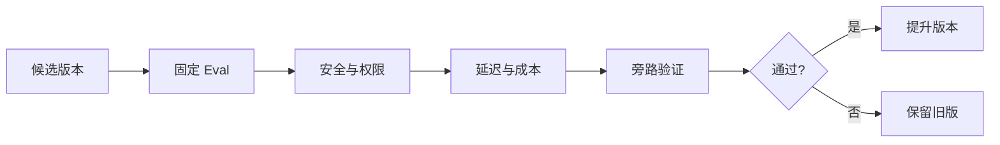

# 权限、提示注入、Eval、Trace、成本和可靠性

Agent 在开发环境回答对了三个问题，不代表可以发布。模型、Prompt、知识版本、检索参数和工具任一变化，都可能影响事实、权限、延迟和费用。

本章把六个看似分散的主题放进一条发布链：安全边界决定什么绝不能越过；Eval 比较版本质量；Trace 解释一次运行；预算和 Deadline 控制资源；门禁决定候选能否上线。

## 先固定一次运行的版本身份

一次 Agent 结果至少与这些版本有关：

```text
runtime_version
prompt_version
model_provider + model_id
tool_contract_version
knowledge_version
retrieval_strategy_version
evaluation_suite_version
```

不记录版本，线上出现“昨天能答、今天不能答”时无法复现。回合创建时钉住本轮知识与策略版本，中途发布新知识不改变正在运行的回答来源。

## 权限要贯穿检索、缓存、工具和引用


用户指定一个资料名只是请求范围，服务端要与其实际权限求交集。指定范围无结果时返回空，不能回退到全局知识库。

缓存命中也不能跳过权限。权限撤销需要缓存失效或读取时二次检查。Trace 记录范围摘要和过滤数量，不记录完整敏感清单。

## 提示注入是数据与指令混淆

外部网页、文档和工具结果都可能含“忽略之前指令”。防护不能只靠一句系统 Prompt：

- 把系统规则、用户输入和外部内容放在明确通道；
- 工具采用最小权限，默认只读；
- 模型提出动作，执行器校验；
- 敏感操作不由外部内容触发；
- 输出做权限、引用和隐私检查；
- Eval 加入直接和间接注入样本。

如果 Agent 根本没有导出和写入工具，文档里的恶意指令无法获得那些能力。能力最小化比让模型“更听话”可靠。

## Eval 使用同一个 Runtime

离线评测若绕过真实 Runtime，可能测不到权限、检索和工具错误。正确做法是固定模型或测试替身、知识版本和策略版本，通过与线上相同入口执行样本，只替换外层适配器。

评测维度包括：

| 维度 | 示例指标 |
| --- | --- |
| 检索 | Hit@K、Recall@K、MRR |
| 事实 | Claim 支持率、关键事实准确性 |
| 引用 | 引用存在、位置和支持关系 |
| 范围 | 指定范围遵守率 |
| 权限 | 不可见证据出现次数应为零 |
| 安全 | 注入成功率、敏感输出 |
| 运行 | 成功终态、步骤数、取消和超时 |
| 成本 | 输入输出 Token、工具次数、模型费用 |

门禁阈值来自当前稳定版本和业务风险，不在文章中编造通用百分比。候选版本先比较回归差异，再由负责人决定提升。

## Trace 需要关联哪些阶段

一条 Trace 从 HTTP 请求开始，包含：

- 认证和准入；
- 理解节点；
- 每个检索通道与候选数；
- 重排和证据预算；
- 模型调用、Token 和结束原因；
- 工具调用与错误语义；
- 首事件、首 Token 和终态；
- Claim 与引用验证摘要。

高基数原文不进入 Metric 标签。问题文本、证据正文和 Prompt 需要脱敏、采样或不记录。Trace ID、回合 ID 和稳定版本 ID 用于关联，而不是把用户内容当标签。

## Deadline 是整轮预算，不是每步独立超时

如果 HTTP 超时 30 秒，三个工具各自设置 30 秒，再加两次模型调用，整轮可能远超用户等待时间。创建回合时保存绝对 Deadline，每个节点计算剩余时间。

```text
remaining = deadline - now
node_timeout = min(node_default, remaining - reserve_for_finalize)
```

为最终事件和状态提交预留时间。剩余时间不足时停止新研究，使用已有证据生成受限回答，或返回超时终态。

取消也向下传播：客户端取消、用户主动取消或任务过期后，Worker 在节点边界检查数据库与缓存标志，HTTP 和模型调用使用取消信号。

## 成本治理从预算而不是账单开始

成本可拆成：模型输入、模型输出、Embedding、重排、外部工具、存储和计算资源。运行前设置：

- 最大模型调用次数；
- 最大工具步骤；
- 上下文与输出 Token；
- 并行分支上限；
- 证据数量；
- 每用户或租户并发槽；
- 高成本模型使用条件。

模型路由按任务难度与能力声明选择。降级到小模型前要确认它支持结构化输出、工具调用和目标上下文，不能只按价格替换。

## 一份候选发布门禁



发布报告记录差异，不只记录平均分。一个严重越权样本足以阻断，即使总体回答分数更高。观察期内按版本比较终态、延迟、质量反馈和费用；回滚同时恢复 Runtime、Prompt、模型路由和知识策略的兼容组合。

## 设计一次变更评测

假设要更换重排模型。写下：

1. 固定知识和查询集；
2. 保存旧版候选列表与重排结果；
3. 新版使用相同召回候选；
4. 比较相关证据名次和最终 Claim；
5. 单独检查权限与注入样本；
6. 记录重排耗时与成本；
7. 设定可回滚的候选版本；
8. 不同时修改 Prompt 和 Embedding，避免无法归因。

## 治理检查表

- 一次结果能追溯所有关键版本；
- 权限从检索到引用始终生效；
- 外部内容无法扩大工具能力；
- Eval 经过同一 Runtime；
- Trace 能从请求关联到终态；
- 日志和指标不泄露敏感原文；
- Deadline 与取消传播到下游；
- 成本限制在调用前生效；
- 候选失败时旧版本继续服务。

最后一章会把前十五章串成一份完整蓝图，并明确哪些是当前匿名实践中可验证的行为，哪些只是可选演进。

## 参考资料

- [OpenTelemetry Traces](https://opentelemetry.io/docs/concepts/signals/traces/)
- [NIST AI Risk Management Framework](https://www.nist.gov/itl/ai-risk-management-framework)
- [OWASP Top 10 for LLM Applications](https://genai.owasp.org/llm-top-10/)
- [LangSmith Evaluation Concepts](https://docs.smith.langchain.com/evaluation)

