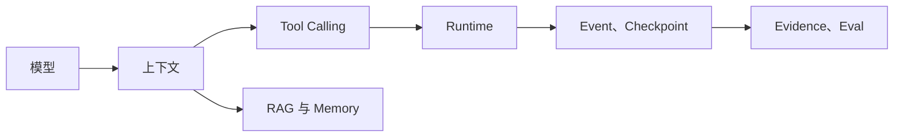

# Agent 术语与相邻概念

按模型、上下文、工具、检索、运行时、安全和评测解释术语，并标出容易混淆的边界。

**Glossary**、**Agent**、**RAG** 分别指向同一条执行链上的不同对象：待解释术语、所在文章、读者已知概念和需要比较的相邻术语进入系统，term_id、system_layer、input、state_owner、decision_owner、output、boundary 和 canonical_article 保存处理中间状态，最终得到不含循环定义的术语解释、相邻概念差异、适用边界和主文章入口。

术语表位于课程知识的检索入口与决策参考层，主要机制是术语表按模型、上下文、知识、工具、控制运行时、安全和质量分层，每个词用输入、状态所有者、决策者和输出定位，再链接到唯一的主文章。

同一个词多套定义、用框架名解释概念、跨层直接比较、缩写没有展开、边界只写口号和术语表重复主文章会让链路在不同位置停止，错误记录必须保留发生阶段、当时的状态和终止原因。
::: info 贯穿示例

术语表场景：读者同时遇到 Agent、Workflow、Tool Calling、MCP、Skill、Memory 和 RAG，需要先确定每个词处在哪一层。术语表需要的身份、权限、版本和业务事实由应用提供，模型与外部内容只产生候选。

:::

## 模型、应用与运行时的基本层次

同一个词多套定义会破坏 term_id 与不含循环定义的术语解释之间的对应关系，排查时先保留原始输入摘要和发生阶段，再判断是否允许重试。

用框架名解释概念影响 system_layer 或下游解释，不能和同一个词多套定义共用“重新调用一次模型”的处理方式。
## Message、Prompt、Token 与上下文

Glossary 的术语页只负责定义和链接，完整机制与验证仍放在对应主文章。因此 term_id 与 system_layer 要有唯一写入方，其他组件只能通过版本化命令申请修改。

课程主线与 术语表解决的问题相邻，但控制权不同，比较时要看谁选择比较相邻概念、谁保存 term_id、谁确认不含循环定义的术语解释。

架构决策记录可以参与同一请求，却不能替代 术语表；组合后仍要单独检查所在文章的可信来源和同一个词多套定义的终止规则。

术语表使用的身份、范围和版本来自可信运行时，待解释术语可以表达意图，但不能提升权限或改写活动 Release。

用框架名解释概念发生时，错误回到 system_layer 的所有者处理，上游缺输入、当前组件违反不变量和下游不可用分别形成不同终态。

术语表的确定性边界位于 term_id 写入之前。模型在 Glossary 中只提交候选值，程序仍要从认证、版本和策略快照补入可信字段。

术语表内部可以使用更细的临时对象，跨边界只暴露稳定协议。替换课程主线时，调用方不需要理解内部缓存和 SDK 响应。
## Tool Calling、Tool、MCP 与 Skill

术语表的输入合同至少列出待解释术语、所在文章和读者已知概念，每项都注明来源、是否必需、允许的缺省值，以及缺失后是在入口拒绝还是进入降级路径。

术语表本身也需要版本边界：`term_id` 标识一个定义，`system_layer` 说明它属于模型、应用还是运行时，输入示例保存它与相邻概念的关系。定义、层级和示例分开后，版本更新才不会悄悄改变整条课程的含义。

并发分支按稳定身份合并 input，完成顺序只反映耗时，不能决定结果属于哪个请求，更不能让迟到的旧状态覆盖新修订。

输出合同同时描述不含循环定义的术语解释和相邻概念差异，并为拒绝、取消、部分完成和未知状态提供固定形状，调用方据此分支，无需解析错误文案猜测结果。

system_layer 参与乐观并发检查；处理开始后若版本变化，旧候选只保留作审计，不能继续写入 term_id。

待解释术语里若包含模型填写的同名字段，应用会丢弃它，再从认证、配置或活动版本中补入可信值，因为结构校验通过不等于授权或业务校验通过。

定义、输入、状态所有者、决策者、输出和适用限制组成 术语表的最小追踪材料，日志只保存稳定 ID、版本和错误类，完整 Prompt、文档正文与凭证不进入指标标签。

撤回或删除所在文章时，相关缓存、候选和未完成任务按版本失效；稳定 ID 可以保留审计关系，已撤回内容不能继续进入不含循环定义的术语解释。

契约还需要描述新鲜度。system_layer 对应的数据发生变化后，旧缓存、旧候选和未完成任务怎样失效，应由版本或时间规则直接判断，不能依赖模型注意到矛盾。

删除和撤回也属于数据生命周期。术语表引用的原始对象被移除时，稳定 ID 可以保留审计关系，正文与派生结果则按策略失效，避免继续向用户展示过期内容。

::: warning 术语表的可信边界

不含循环定义的术语解释通过结构校验后仍是候选。术语表使用的身份、权限、知识版本与业务事实由应用从可信服务读取，核对完成后才能执行或交付。

:::
## 工作流、Agent Loop 与 Harness

术语表的回读应从一个混淆问题开始：先按层级定位词语，再指出状态所有者和决策者，最后链接到唯一主文章。把“工具调用”和“工具执行”故意互换，检查应能指出责任边界，而不是只给出相似词列表。

定位问题层次接收待解释术语并建立 term_id，入口校验未通过就地结束，后续模型、检索器或工具调用次数保持为零。

比较相邻概念读取 system_layer 并执行主题逻辑，参数由应用组装，外部返回先保存为相邻概念差异，尚未获得修改领域状态的资格。

选择主文章检查结构、范围、版本和主题不变量；不含循环定义的术语解释缺少来源、落在旧版本或越过权限时，term_id 停在 rejected 或 failed。

用反例复核先保存不含循环定义的术语解释与终止原因，再产生事件或通知，交付失败可以重放，核心状态写入失败则不能对外宣称完成。

比较相邻概念出现部分结果时，由任务合同决定保留、补偿还是整体丢弃；不含循环定义的术语解释若可重建就重新生成，外部副作用则查询回执或执行补偿。

实现可以使用函数、Graph、Middleware 或 Workflow，term_id 的所有权和同一个词多套定义的停止规则不会随框架改变。

部分成功需要在步骤边界处理。比较相邻概念已经产生一部分不含循环定义的术语解释时，程序按任务合同决定保留、补偿或整体丢弃，并记录未完成项，不能默认为全部成功。

比较相邻概念和选择主文章都要写明逆向动作或不可逆原因，不含循环定义的术语解释若可重建就删除后重算，已发送的外部命令只能查询回执或补偿。
## RAG、记忆、Wiki 与知识图谱

沿“术语表场景：读者同时遇到 Agent、Workflow、Tool Calling、MCP、Skill、Memory 和 RAG，需要先确定每个词处在哪一层”推演 术语表：入口创建 request_id，读取可信身份，把待解释术语和当前版本写入初始状态。

定位问题层次生成 term_id 与输入摘要；若所在文章缺失，请求返回 rejected，并指出缺少哪项材料，不继续消耗模型或外部服务配额。

比较相邻概念按“术语表按模型、上下文、知识、工具、控制运行时、安全和质量分层，每个词用输入、状态所有者、决策者和输出定位，再链接到唯一的主文章”推进，每次依赖调用保存 call_id、参数摘要、开始时间与状态版本，以便判断超时前是否已经产生结果。

候选结果对应不含循环定义的术语解释、相邻概念差异、适用边界和主文章入口，选择主文章逐项检查权限、版本与领域约束，问题列表为空才允许形成下一状态。

用反例复核写入终态；客户端断开只影响交付通道，重新连接时读取已经保存的 term_id 或事件游标，不重跑核心逻辑。

故障注入选择跨层直接比较，程序保留原候选和错误位置，只重做失败边界，不能从入口复制整个任务并产生第二份状态。

推演结束后用 request_id 关联 term_id、不含循环定义的术语解释与终止原因，测试据此排除并发请求串线，并确认失败路径没有遗留未关闭资源。

术语表在输入拒绝时不调用依赖，正常路径按 5 个阶段推进，有限修复只重做失败边界。调用次数是控制流断言，不是性能宣传。

术语表的最终记录用 request_id 关联 term_id、不含循环定义的术语解释和失败问题，测试据此证明结果来自本次执行，没有混入并发请求。
## Claim、Evidence、Citation 与验证

术语表正常完成时，term_id、system_layer 和不含循环定义的术语解释指向同一次执行，重复读取返回同一终态，未完成分支已经取消或有明确所有者。

定义、输入、状态所有者、决策者、输出和适用限制用于还原 术语表的处理过程，可以按阶段和版本聚合；敏感正文留在受控存储中，不复制到日志与指标。

相邻概念差异可能是合法的空结果，但必须带范围、版本和原因；任务明确要求找到材料时，同一个空结果进入拒答而非成功。

依赖返回成功状态只证明传输完成。术语表还要检查不含循环定义的术语解释是否满足业务范围、质量阈值和当前版本，明确拒绝也可能是正确终态。

term_id 的状态迁移必须单调：完成不能退回运行中，取消不能被迟到结果覆盖，失败重试也不能绕过入口已经固定的权限。

术语表的成功证据最终要同时回答输入是什么、执行了哪些步骤、交付了什么以及为什么停止；任一项缺失都应留在未确认状态。

术语表把业务验收与服务健康分开。依赖返回 200 只说明传输成功，不含循环定义的术语解释仍要满足当前范围和质量要求；明确拒答也可能是正确终态。

术语表的观测指标按阶段和版本聚合。评估 Glossary 时，把错误、空结果、拒绝、恢复和资源消耗分开统计，避免一个成功率掩盖不同故障。
## Turn、Task、Event 与 Checkpoint

术语误用通常表现为层级错位：把 RAG 当成模型能力、把 Tool Call 当成已执行动作、把 Agent 当成无限自主程序。排查时先回到定义和相邻概念，再检查文章是否把责任交给了错误组件，不能用更多同义词掩盖边界混淆。

遇到同一个词多套定义时，先记录发生阶段、错误类别和责任对象。术语表保留输入摘要和状态版本，由对应组件决定重试、降级或终止。

遇到用框架名解释概念时，先记录发生阶段、错误类别和责任对象。术语表保留输入摘要和状态版本，由对应组件决定重试、降级或终止。

遇到跨层直接比较时，先记录发生阶段、错误类别和责任对象。术语表保留输入摘要和状态版本，由对应组件决定重试、降级或终止。

遇到缩写没有展开时，先记录发生阶段、错误类别和责任对象。术语表保留输入摘要和状态版本，由对应组件决定重试、降级或终止。

遇到边界只写口号时，先记录发生阶段、错误类别和责任对象。术语表保留输入摘要和状态版本，由对应组件决定重试、降级或终止。

术语表处理术语表重复主文章时需要稳定身份和结果回执，再次收到同一请求先读取旧结果；外部结果未知就停在 unknown，不能猜测失败后重新执行。

术语表将终态、可重试性和资源清理结果写入记录；后台扫描器根据 term_id 判断任务是在运行、等待恢复还是已失败。

术语表执行前固定 Deadline、动作上限、重复签名、无进展阈值、预算和取消信号；任一条件触发，比较相邻概念停止创建新工作。

术语表把重试时间和次数计入总预算。Glossary 每次重试先扣减剩余额度，达到上限就保留原始错误。

术语表的清理动作设计成幂等操作；仍被活动任务或 Lease 引用的资源拒绝删除。
## Router、Planner、Reflection 与 Eval

隐藏术语名称后用输入、状态、决策者和输出反向识别概念，并用 Agent 与 Chatbot、Tool 与 MCP、Memory 与 RAG 等成对反例核对；测试显式给出待解释术语、初始 term_id、预期不含循环定义的术语解释和终止原因，不能只断言返回值非空。

术语表的单元测试用 Fake Adapter 固定不含循环定义的术语解释与错误，断言参数、调用顺序、状态修订和清理动作，这些结果只证明本地控制逻辑。

契约测试围绕待解释术语、term_id 和相邻概念差异构造合法与非法样本，Schema 解析成功后继续检查权限、版本与领域不变量。

故障测试注入同一个词多套定义和用框架名解释概念，记录比较相邻概念是否被调用、term_id 是否改变、资源是否释放，以及同一身份重试会不会重复执行。

术语表的集成测试连接真实协议与隔离存储，检查序列化、约束、并发和超时；需要在线服务时另行记录服务版本、时间、配置与凭证条件。

术语表的回归报告要保留失败类型分布。在 Glossary 的回归中，拒绝、超时、权限错误和空结果必须保持各自类型，状态变化本身就是行为契约。

术语表的性质测试随机改变 term_id 顺序、重复提交、完成顺序或状态版本，断言权限不扩大、终态不倒退、同一身份不产生两次副作用。
## 用状态所有者结束术语争论

碰到两个相近词，先问谁创建对象、谁能修改、对象何时失效，以及下游依据它做什么。Message 是通信记录，Memory 是跨 Turn 保存的受控状态；Evidence 支撑 Claim，Citation 只是答案中的定位关系。对象职责不同，名称再接近也不能合并。

术语表需要链接主文章和反例，不复制另一篇完整解释。概念升级时保留别名与废弃说明，让旧文可读；新代码和新文章只使用当前名称。
