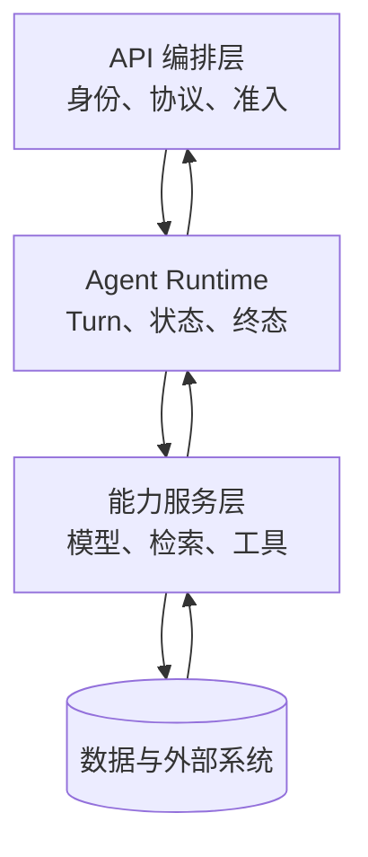

# 生产 Agent 的三层架构与调用边界

拆开 API 编排、Agent Runtime 和能力服务，明确状态、数据与失败各归谁处理。**Architecture**、**Agent**、**Layering** 分别指向同一条执行链上的不同对象：业务 SLO、风险等级、流量、模型能力、数据规模、成本预算和发布策略进入系统，请求上下文、Turn 状态、能力调用、Deadline、版本快照、结果和跨层错误保存处理中间状态，最终得到可定位、可降级、可回滚的请求结果，以及容量、质量和成本证据。

生产 Agent 的三层架构把接口、控制运行时和能力服务拆开，接口层负责协议、身份和请求形状，Runtime 层负责 Turn、控制流和终态，能力层负责模型、检索与工具；数据库和对象存储由各自的领域所有者访问。这样拆分的目的不是增加目录，而是让每次跨层调用都有清楚的输入、输出和失败责任。

::: info 贯穿示例

三层架构场景：知识助手流量升高，同时向量服务变慢和模型限流，系统需要保住已有会话并给出可解释降级。三层架构需要的身份、权限、版本和业务事实由应用提供，模型与外部内容只产生候选。

:::

## 一次请求怎样穿过三层边界

Controller 直接拼检索 SQL 会破坏请求上下文与可定位之间的对应关系，排查时先保留原始输入摘要和发生阶段，再判断是否允许重试。
## 三层架构分别负责什么

Architecture 的入口负责协议和身份，Runtime 负责控制状态，能力服务负责模型、检索或工具适配。因此请求上下文与 Turn 状态要有唯一写入方，其他组件只能通过版本化命令申请修改。

MVC 与三层架构解决的问题相邻，但控制权不同，比较时要看谁选择调用能力服务、谁保存请求上下文、谁确认可定位。

分层架构可以参与同一请求，却不能替代三层架构；组合后仍要单独检查风险等级的可信来源和 Controller 直接拼检索 SQL 的终止规则。

三层架构使用的身份、范围和版本来自可信运行时，业务 SLO 可以表达意图，但不能提升权限或改写活动 Release。

模型适配器修改 Turn 发生时，错误回到 Turn 状态的所有者处理，上游缺输入、当前组件违反不变量和下游不可用分别形成不同终态。

三层架构的确定性边界位于请求上下文写入之前。模型在 Architecture 中只提交候选值，程序仍要从认证、版本和策略快照补入可信字段。

三层架构内部可以使用更细的临时对象，跨边界只暴露稳定协议。替换 MVC 时，调用方不需要理解内部缓存和 SDK 响应。
## 组件职责、状态和数据归属

三层架构的输入合同至少列出业务 SLO、风险等级和流量，每项都注明来源、是否必需、允许的缺省值，以及缺失后是在入口拒绝还是进入降级路径。

三层架构要分别保存请求上下文、Turn 状态和能力调用记录。上下文表达输入，Turn 决定生命周期与终态，能力调用保存外部回执；如果把三者塞进 Runtime 的一段文本，API、Worker 和工具服务就会争抢同一份状态。

并发分支按稳定身份合并能力调用，完成顺序只反映耗时，不能决定结果属于哪个请求，更不能让迟到的旧状态覆盖新修订。

Architecture 的对外结果要分别表达可交付内容、缺口、取消和未知状态，调用方不必解析错误文案。

Turn 状态参与乐观并发检查；处理开始后若版本变化，旧候选只保留作审计，不能继续写入请求上下文。

跨层 Trace、阶段耗时、错误类型、质量信号、资源用量和发布版本组成三层架构的最小追踪材料，日志只保存稳定 ID、版本和错误类，完整 Prompt、文档正文与凭证不进入指标标签。

契约还需要描述新鲜度。Turn 状态对应的数据发生变化后，旧缓存、旧候选和未完成任务怎样失效，应由版本或时间规则直接判断，不能依赖模型注意到矛盾。

删除和撤回也属于数据生命周期。三层架构引用的原始对象被移除时，稳定 ID 可以保留审计关系，正文与派生结果则按策略失效，避免继续向用户展示过期内容。

::: warning 三层架构的可信边界

可定位通过结构校验后仍是候选。三层架构使用的身份、权限、知识版本与业务事实由应用从可信服务读取，核对完成后才能执行或交付。

:::
## 调用链、Deadline 与失败传播

三层架构的价值不在于把代码分成三个目录，而在于明确错误由谁解释。模型层只能报告生成失败或返回候选，Runtime 层负责状态、预算、权限和终态，业务系统负责账号、订单、知识版本等权威事实。模型超时可以由 Runtime 重试，业务权限拒绝不能通过换模型消除，业务数据库不可用也不能被写成“模型没有找到答案”。

回放时先记录请求进入哪一层、上一层交给它的版本和它产生的输出。若模型返回合法结构但 Runtime 发现 Scope 不匹配，责任在契约校验；若 Runtime 已提交终态而 SSE 丢失，责任在交付层；若三层都完成但事实过期，责任在业务数据版本。这样的证据链比一个统一的 `500` 更能指导修复。

三层架构的推演从一次请求开始：接口层校验身份和请求形状，Runtime 创建 Turn 并推进控制流，能力层返回模型、检索或工具回执。故意让能力层超时，检查 Runtime 是否保存中间状态并选择降级，接口层不能直接改写终态。

入口准入接收业务 SLO 并建立请求上下文，入口校验未通过就地结束，后续模型、检索器或工具调用次数保持为零。

调用能力服务读取 Turn 状态并执行主题逻辑，参数由应用组装，外部返回先保存为可降级，尚未获得修改领域状态的资格。

汇总观测检查结构、范围、版本和主题不变量；可定位缺少来源、落在旧版本或越过权限时，请求上下文停在 rejected 或 failed。

实现可以使用函数、Graph、Middleware 或 Workflow，请求上下文的所有权和 Controller 直接拼检索 SQL 的停止规则不会随框架改变。

部分成功需要在步骤边界处理。
## 沿一次过载请求推演

沿“三层架构场景：知识助手流量升高，同时向量服务变慢和模型限流，系统需要保住已有会话并给出可解释降级”推演三层架构：入口创建 request_id，读取可信身份，把业务 SLO 和当前版本写入初始状态。

入口准入生成请求上下文与输入摘要；若风险等级缺失，请求返回 rejected，并指出缺少哪项材料，不继续消耗模型或外部服务配额。

调用能力服务按“接口层负责协议、身份和请求形状，Runtime 层负责 Turn、控制流和终态，能力层负责模型、检索与工具；数据库和对象存储由其领域所有者访问”推进，每次依赖调用保存 call_id、参数摘要、开始时间与状态版本，以便判断超时前是否已经产生结果。

降级或交付写入终态；客户端断开只影响交付通道，重新连接时读取已经保存的请求上下文或事件游标，不重跑核心逻辑。

故障注入选择能力服务自行决定权限，程序保留原候选和错误位置，只重做失败边界，不能从入口复制整个任务并产生第二份状态。

推演结束后用 request_id 关联请求上下文、可定位与终止原因，测试据此排除并发请求串线，并确认失败路径没有遗留未关闭资源。

三层架构在输入拒绝时不调用依赖，正常路径按 5 个阶段推进，有限修复只重做失败边界。调用次数是控制流断言，不是性能宣传。

三层架构的最终记录用 request_id 关联请求上下文、可定位和失败问题，测试据此证明结果来自本次执行，没有混入并发请求。
## 正常服务的观测证据

三层架构正常完成时，请求上下文、Turn 状态和可定位指向同一次执行，重复读取返回同一终态，未完成分支已经取消或有明确所有者。

跨层 Trace、阶段耗时、错误类型、质量信号、资源用量和发布版本用于还原三层架构的处理过程，可以按阶段和版本聚合；敏感正文留在受控存储中，不复制到日志与指标。

依赖返回成功状态只证明传输完成。三层架构还要检查可定位是否满足业务范围、质量阈值和当前版本，明确拒绝也可能是正确终态。

请求上下文的状态迁移必须单调：完成不能退回运行中，取消不能被迟到结果覆盖，失败重试也不能绕过入口已经固定的权限。

三层架构的成功证据最终要同时回答输入是什么、执行了哪些步骤、交付了什么以及为什么停止；任一项缺失都应留在未确认状态。

三层架构把业务验收与服务健康分开。依赖对 Architecture 返回 200 只说明传输完成，内容仍要满足当前范围和质量条件。

三层架构的观测指标按阶段和版本聚合。评估 Architecture 时，把错误、空结果、拒绝、恢复和资源消耗分开统计，避免一个成功率掩盖不同故障。
## 降级、隔离与恢复

三层架构的失败传播应沿所有权移动：API 参数错误在入口结束，Runtime 状态冲突拒绝写入，能力服务超时由调用层决定降级，交付通道断开则读取已保存终态。跨层重试前必须确认原层没有产生副作用。

遇到 Controller 直接拼检索 SQL 时，先记录发生阶段、错误类别和责任对象。三层架构保留输入摘要和状态版本，由对应组件决定重试、降级或终止。

遇到模型适配器修改 Turn 时，先记录发生阶段、错误类别和责任对象。三层架构保留输入摘要和状态版本，由对应组件决定重试、降级或终止。

能力服务自行决定权限触及三层架构的安全边界，重试不会使它自动合法；执行路径保存拒绝规则和输入来源，清除未授权候选，并以稳定错误结束当前动作。

遇到跨层共享事务时，先记录发生阶段、错误类别和责任对象。三层架构保留输入摘要和状态版本，由对应组件决定重试、降级或终止。

遇到所有错误变成 500 时，先记录发生阶段、错误类别和责任对象。三层架构保留输入摘要和状态版本，由对应组件决定重试、降级或终止。

三层架构将终态、可重试性和资源清理结果写入记录；后台扫描器根据请求上下文判断任务是在运行、等待恢复还是已失败。

三层架构执行前固定 Deadline、动作上限、重复签名、无进展阈值、预算和取消信号；任一条件触发，调用能力服务停止创建新工作。

三层架构把重试时间和次数计入总预算。Architecture 每次重试先扣减剩余额度，达到上限就保留原始错误。

三层架构的清理动作设计成幂等操作；仍被活动任务或 Lease 引用的资源拒绝删除。
## 故障演练和发布验证

沿正常、过载、依赖失败和回滚四条路径演练，核对状态所有者、传播边界与可观测字段；测试显式给出业务 SLO、初始请求上下文、预期可定位和终止原因，不能只断言返回值非空。

三层架构的单元测试用 Fake Adapter 固定可定位与错误，断言参数、调用顺序、状态修订和清理动作，这些结果只证明本地控制逻辑。

契约测试围绕业务 SLO、请求上下文和可降级构造合法与非法样本，Schema 解析成功后继续检查权限、版本与领域不变量。

故障测试注入 Controller 直接拼检索 SQL 和模型适配器修改 Turn，记录调用能力服务是否被调用、请求上下文是否改变、资源是否释放，以及同一身份重试会不会重复执行。

三层架构的集成测试连接真实协议与隔离存储，检查序列化、约束、并发和超时；需要在线服务时另行记录服务版本、时间、配置与凭证条件。

三层架构的回归报告要保留失败类型分布。在 Architecture 的回归中，拒绝、超时、权限错误和空结果必须保持各自类型，状态变化本身就是行为契约。

三层架构的性质测试随机改变请求上下文顺序、重复提交、完成顺序或状态版本，断言权限不扩大、终态不倒退、同一身份不产生两次副作用。
## 跨层错误必须回到所有者

接口层拒绝形状和身份错误，Runtime 处理 Turn、预算和终态，能力层返回模型、检索或工具观察。能力调用返回 200 只说明传输完成，Runtime 还要核对范围、版本与业务结果；接口层也不能绕过 Runtime 直接写完成状态。

测试沿同一个 request_id 注入认证失败、检索超时、工具拒绝和事件断线，断言每个错误停在负责组件，且外层没有把它改写成成功。三层拆分的价值就在这里。
