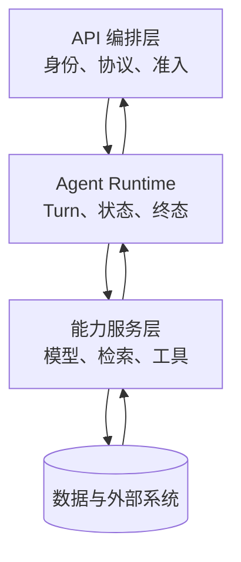

# 生产 Agent 的三层架构与调用边界

拆开 API 编排、Agent Runtime 和能力服务，明确状态、数据与失败各归谁处理。**Architecture**、**Agent**、**Layering** 分别指向同一条执行链上的不同对象：业务 SLO、风险等级、流量、模型能力、数据规模、成本预算和发布策略进入系统，请求上下文、Turn 状态、能力调用、Deadline、版本快照、结果和跨层错误保存处理中间状态，最终得到可定位、可降级、可回滚的请求结果，以及容量、质量和成本证据。

生产 Agent 的三层架构把接口、控制运行时和能力服务拆开，接口层负责协议、身份和请求形状，Runtime 层负责 Turn、控制流和终态，能力层负责模型、检索与工具；数据库和对象存储由各自的领域所有者访问。这样拆分的目的不是增加目录，而是让每次跨层调用都有清楚的输入、输出和失败责任。

::: info 贯穿示例

三层架构场景：知识助手流量升高，同时向量服务变慢和模型限流，系统需要保住已有会话并给出可解释降级。三层架构需要的身份、权限、版本和业务事实由应用提供，模型与外部内容只产生候选。

:::

## 一次请求怎样穿过三层边界

Controller 直接拼检索 SQL 会破坏请求上下文与可定位之间的对应关系，排查时先保留原始输入摘要和发生阶段，再判断是否允许重试。

## 三层架构分别负责什么

Architecture 的入口负责协议和身份，Runtime 负责控制状态，能力服务负责模型、检索或工具适配。因此请求上下文与 Turn 状态要有唯一写入方，其他组件只能通过版本化命令申请修改。

MVC 与三层架构解决的问题相邻，但控制权不同，比较时要看谁选择调用能力服务、谁保存请求上下文、谁确认可定位。

分层架构可以参与同一请求，却不能替代三层架构；组合后仍要单独检查风险等级的可信来源和 Controller 直接拼检索 SQL 的终止规则。

三层架构使用的身份、范围和版本来自可信运行时，业务 SLO 可以表达意图，但不能提升权限或改写活动 Release。

模型适配器修改 Turn 发生时，错误回到 Turn 状态的所有者处理，上游缺输入、当前组件违反不变量和下游不可用分别形成不同终态。

三层架构的确定性边界位于请求上下文写入之前。模型在 Architecture 中只提交候选值，程序仍要从认证、版本和策略快照补入可信字段。

三层架构内部可以使用更细的临时对象，跨边界只暴露稳定协议。替换 MVC 时，调用方不需要理解内部缓存和 SDK 响应。

## 组件职责、状态和数据归属

三层架构的输入合同至少列出业务 SLO、风险等级和流量，每项都注明来源、是否必需、允许的缺省值，以及缺失后是在入口拒绝还是进入降级路径。

三层架构要分别保存请求上下文、Turn 状态和能力调用记录。上下文表达输入，Turn 决定生命周期与终态，能力调用保存外部回执；如果把三者塞进 Runtime 的一段文本，API、Worker 和工具服务就会争抢同一份状态。

并发分支按稳定身份合并能力调用，完成顺序只反映耗时，不能决定结果属于哪个请求，更不能让迟到的旧状态覆盖新修订。

Architecture 的对外结果要分别表达可交付内容、缺口、取消和未知状态，调用方不必解析错误文案。

Turn 状态参与乐观并发检查；处理开始后若版本变化，旧候选只保留作审计，不能继续写入请求上下文。

跨层 Trace、阶段耗时、错误类型、质量信号、资源用量和发布版本组成三层架构的最小追踪材料，日志只保存稳定 ID、版本和错误类，完整 Prompt、文档正文与凭证不进入指标标签。

契约还需要描述新鲜度。Turn 状态对应的数据发生变化后，旧缓存、旧候选和未完成任务怎样失效，应由版本或时间规则直接判断，不能依赖模型注意到矛盾。

删除和撤回也属于数据生命周期。三层架构引用的原始对象被移除时，稳定 ID 可以保留审计关系，正文与派生结果则按策略失效，避免继续向用户展示过期内容。

::: warning 三层架构的可信边界

可定位通过结构校验后仍是候选。三层架构使用的身份、权限、知识版本与业务事实由应用从可信服务读取，核对完成后才能执行或交付。

:::

## 调用链、Deadline 与失败传播

三层架构的推演从一次请求开始：接口层校验身份和请求形状，Runtime 创建 Turn 并推进控制流，能力层返回模型、检索或工具回执。故意让能力层超时，检查 Runtime 是否保存中间状态并选择降级，接口层不能直接改写终态。

入口准入接收业务 SLO 并建立请求上下文，入口校验未通过就地结束，后续模型、检索器或工具调用次数保持为零。

调用能力服务读取 Turn 状态并执行主题逻辑，参数由应用组装，外部返回先保存为可降级，尚未获得修改领域状态的资格。

汇总观测检查结构、范围、版本和主题不变量；可定位缺少来源、落在旧版本或越过权限时，请求上下文停在 rejected 或 failed。

实现可以使用函数、Graph、Middleware 或 Workflow，请求上下文的所有权和 Controller 直接拼检索 SQL 的停止规则不会随框架改变。

部分成功需要在步骤边界处理。

## 沿一次过载请求推演

沿“三层架构场景：知识助手流量升高，同时向量服务变慢和模型限流，系统需要保住已有会话并给出可解释降级”推演三层架构：入口创建 request_id，读取可信身份，把业务 SLO 和当前版本写入初始状态。

入口准入生成请求上下文与输入摘要；若风险等级缺失，请求返回 rejected，并指出缺少哪项材料，不继续消耗模型或外部服务配额。

调用能力服务按“接口层负责协议、身份和请求形状，Runtime 层负责 Turn、控制流和终态，能力层负责模型、检索与工具；数据库和对象存储由其领域所有者访问”推进，每次依赖调用保存 call_id、参数摘要、开始时间与状态版本，以便判断超时前是否已经产生结果。

降级或交付写入终态；客户端断开只影响交付通道，重新连接时读取已经保存的请求上下文或事件游标，不重跑核心逻辑。

故障注入选择能力服务自行决定权限，程序保留原候选和错误位置，只重做失败边界，不能从入口复制整个任务并产生第二份状态。

推演结束后用 request_id 关联请求上下文、可定位与终止原因，测试据此排除并发请求串线，并确认失败路径没有遗留未关闭资源。

三层架构在输入拒绝时不调用依赖，正常路径按 5 个阶段推进，有限修复只重做失败边界。调用次数是控制流断言，不是性能宣传。

三层架构的最终记录用 request_id 关联请求上下文、可定位和失败问题，测试据此证明结果来自本次执行，没有混入并发请求。

## 正常服务的观测证据

三层架构正常完成时，请求上下文、Turn 状态和可定位指向同一次执行，重复读取返回同一终态，未完成分支已经取消或有明确所有者。

跨层 Trace、阶段耗时、错误类型、质量信号、资源用量和发布版本用于还原三层架构的处理过程，可以按阶段和版本聚合；敏感正文留在受控存储中，不复制到日志与指标。

依赖返回成功状态只证明传输完成。三层架构还要检查可定位是否满足业务范围、质量阈值和当前版本，明确拒绝也可能是正确终态。

请求上下文的状态迁移必须单调：完成不能退回运行中，取消不能被迟到结果覆盖，失败重试也不能绕过入口已经固定的权限。

三层架构的成功证据最终要同时回答输入是什么、执行了哪些步骤、交付了什么以及为什么停止；任一项缺失都应留在未确认状态。

三层架构把业务验收与服务健康分开。依赖对 Architecture 返回 200 只说明传输完成，内容仍要满足当前范围和质量条件。

三层架构的观测指标按阶段和版本聚合。评估 Architecture 时，把错误、空结果、拒绝、恢复和资源消耗分开统计，避免一个成功率掩盖不同故障。

## 降级、隔离与恢复

三层架构的失败传播应沿所有权移动：API 参数错误在入口结束，Runtime 状态冲突拒绝写入，能力服务超时由调用层决定降级，交付通道断开则读取已保存终态。跨层重试前必须确认原层没有产生副作用。

遇到 Controller 直接拼检索 SQL 时，先记录发生阶段、错误类别和责任对象。三层架构保留输入摘要和状态版本，由对应组件决定重试、降级或终止。

遇到模型适配器修改 Turn 时，先记录发生阶段、错误类别和责任对象。三层架构保留输入摘要和状态版本，由对应组件决定重试、降级或终止。

能力服务自行决定权限触及三层架构的安全边界，重试不会使它自动合法；执行路径保存拒绝规则和输入来源，清除未授权候选，并以稳定错误结束当前动作。

遇到跨层共享事务时，先记录发生阶段、错误类别和责任对象。三层架构保留输入摘要和状态版本，由对应组件决定重试、降级或终止。

遇到所有错误变成 500 时，先记录发生阶段、错误类别和责任对象。三层架构保留输入摘要和状态版本，由对应组件决定重试、降级或终止。

三层架构将终态、可重试性和资源清理结果写入记录；后台扫描器根据请求上下文判断任务是在运行、等待恢复还是已失败。

三层架构执行前固定 Deadline、动作上限、重复签名、无进展阈值、预算和取消信号；任一条件触发，调用能力服务停止创建新工作。

三层架构把重试时间和次数计入总预算。Architecture 每次重试先扣减剩余额度，达到上限就保留原始错误。

三层架构的清理动作设计成幂等操作；仍被活动任务或 Lease 引用的资源拒绝删除。

## 故障演练和发布验证

沿正常、过载、依赖失败和回滚四条路径演练，核对状态所有者、传播边界与可观测字段；测试显式给出业务 SLO、初始请求上下文、预期可定位和终止原因，不能只断言返回值非空。

三层架构的单元测试用 Fake Adapter 固定可定位与错误，断言参数、调用顺序、状态修订和清理动作，这些结果只证明本地控制逻辑。

契约测试围绕业务 SLO、请求上下文和可降级构造合法与非法样本，Schema 解析成功后继续检查权限、版本与领域不变量。

故障测试注入 Controller 直接拼检索 SQL 和模型适配器修改 Turn，记录调用能力服务是否被调用、请求上下文是否改变、资源是否释放，以及同一身份重试会不会重复执行。

三层架构的集成测试连接真实协议与隔离存储，检查序列化、约束、并发和超时；需要在线服务时另行记录服务版本、时间、配置与凭证条件。

三层架构的回归报告要保留失败类型分布。在 Architecture 的回归中，拒绝、超时、权限错误和空结果必须保持各自类型，状态变化本身就是行为契约。

三层架构的性质测试随机改变请求上下文顺序、重复提交、完成顺序或状态版本，断言权限不扩大、终态不倒退、同一身份不产生两次副作用。

Architecture 的离线评测关注质量变化，运行时测试关注控制和恢复，两类证据都齐全才可交付。三层架构只有两类证据都存在，才能同时回答“结果是否合格”和“系统是否安全完成”。

## 容量、成本与版本治理

三层架构要把入口请求、Runtime 状态和能力适配器的协议版本一起记录。只升级某一层时保留转换边界，旧请求仍能被运行时读取，适配器字段变化也不会泄露到 API。

三层架构的容量主要受到达率、并发、队列、模型配额、数据库连接和成本预算影响，并发可能缩短单次等待，也会占用连接、配额、内存和下游吞吐，必须沿入口准入、运行时编排、调用能力服务、汇总观测、降级或交付逐层核算。

三层架构的候选版本在固定样本上比较正确性、错误类型、延迟和资源消耗，Controller 直接拼检索 SQL 等安全红线回归时直接停止发布，不能用平均质量抵消。

Controller 直接拼检索 SQL 的降级路径在发布前写好，可以减少非关键增强、返回已经确认的可定位，或明确暂时无法确认，缺失事实不能交给模型补写。

排查跨层失败时，先用 `request_id` 串起 API 入参、Runtime 状态、适配器回执、阶段耗时和发布版本，再判断责任属于入口校验、状态持久化还是外部依赖。SLO 只能帮助排序，不能替代层内证据。

三层架构的数据按证据用途分级保留，聚合字段可以留得更久，业务 SLO 和大体积可定位设置短期限、访问控制与删除通道。

三层架构先在单进程实现请求上下文、超时、错误和测试，只有恢复与容量证据提出要求时，再增加队列、Lease、分布式缓存或工作流引擎。

三层架构的监控阈值要对应可执行动作。

回滚要覆盖代码之外的状态。三层架构若改变 Schema、缓存键或持久化记录，旧版本是否还能读取新写入数据必须提前验证；无法双向兼容时采用候选版本隔离。

## 架构复杂度的适用边界

采用三层架构前先画出业务 SLO 到可定位的最小控制图；固定函数已经能完成任务时，新增模型决策和跨进程请求上下文只会扩大测试与运维范围。

MVC 主要组织界面、业务和数据访问，三层 Agent 架构还要明确谁保存一次执行的状态、谁提出候选动作、谁执行权限和版本检查。模型和适配器不能越过 Runtime 直接改业务状态。

分层架构可以与三层架构组合，但外部知识仍需授权，工具调用仍需校验，模型产生的可定位仍停留在候选状态。

三层架构适合价值足够、Controller 直接拼检索 SQL 可观察且预算可接受的任务，高风险、不可逆的决定需要确定性规则或人工批准。

执行期间修改 Turn 状态可以检验并发设计，旧动作若仍能覆盖请求上下文，说明版本或 Lease 有缺口，增加 Prompt 规则无法修复这类竞态。

三层架构增加了请求上下文、依赖调用、恢复责任和故障面，设计记录既要说明获得的能力，也要列出新增的退出、降级与回滚路径。

## 用一次跨层故障检查边界

设请求已经通过 API，Runtime 创建了一个 Turn，Worker 领取任务后调用检索服务。检索服务返回了候选，但在写入 Evidence 前数据库连接断开。此时 API 层不应该再次创建 Turn，Worker 也不能把候选直接发给模型。Runtime 将当前步骤标记为 `evidence_pending`，保存候选的稳定 ID、Release 和错误类型，随后根据剩余 Deadline 选择重试数据库或安全停止。三层之间的交接点都有可观察状态，排障人员可以回答“请求是否创建成功”“哪个层拥有重试权”“候选是否获得交付资格”。

这个例子也说明三层不是按代码目录硬切。一个函数可以同时包含编排和适配逻辑，但对外契约仍然要区分它们。适配器只返回供应商响应和归一化错误，Runtime 才把错误映射为业务终态；API 只把终态转换为 HTTP 或事件。这样替换供应商不会改变权限和恢复规则，调整交付方式也不会触发模型重试。

复核时逐层检查四件事。第一，调用前是否已经有可信身份、版本和 Deadline。第二，调用失败后是否保存了原始错误而不是只保留一段文案。第三，重试是否使用同一个幂等键并受剩余预算限制。第四，终态是否能被状态接口和事件接口同时读取。只要有一项无法回答，说明职责仍然混在一起，应先补状态字段和测试，再增加框架或中间件。

## 三层边界的故障自测

用“一次 API 请求经过 Runtime 调用检索并交付回答”做自测时，入口先记录输入摘要、身份和执行版本。入口、运行时、能力适配器各自的状态和错误由唯一组件写入，其他组件只能提交带修订号的候选。在“一次 API 请求经过 Runtime 调用检索并交付回答”里，读者可以从任务 ID 找到它经过的节点，不必靠最终文案猜过程。

针对“一次 API 请求经过 Runtime 调用检索并交付回答”，正常路径从准入开始，先检查范围和资源，再创建一次调用。调用结果带稳定 ID、来源和终止原因，数据库断开、模型超时或 SSE 断开分别记录。针对“入口、运行时、能力适配器各自的状态和错误”，输出进入下一节点前还要确认版本和权限，空结果也要说明范围。

在“一次 API 请求经过 Runtime 调用检索并交付回答”的故障测试中，依赖调用前和结果已经产生但状态尚未提交时各切断一次。前者应没有外部调用，后者要留下可重放的未知状态。恢复使用同一幂等键，先查询外部回执，再决定补偿。

“一次 API 请求经过 Runtime 调用检索并交付回答”的验证命令检查输入、状态变化、调用顺序、输出摘要、失败证据和资源清理。终态和重试权只能由运行时决定。

“一次 API 请求经过 Runtime 调用检索并交付回答”的取舍需要写在结果里：扩大缓存、并行或自动修复可能缩短等待，也会增加状态、成本和失败组合；保持较小能力面则更容易做权限隔离和人工接管。

回放“一次 API 请求经过 Runtime 调用检索并交付回答”时改变输入顺序、重复提交、缩短 Deadline 或撤回权限，确认状态单调、范围不扩大、资源按时释放。指标用于定位变化，不替代事实核验。

## 一次 API 请求经过 Runtime 调用检索并交付回答的边界案例

在“一次 API 请求经过 Runtime 调用检索并交付回答”中，入口收到的资料可能不完整，程序先保存缺口和当前版本，不能让模型用常识填入 入口、运行时、能力适配器各自的状态和错误。“一次 API 请求经过 Runtime 调用检索并交付回答”的输入后来补齐时，新的执行沿同一个任务 ID 继续；已经结束的失败记录不被覆盖。

数据库断开要检查状态是否已写入，模型超时要确认供应商是否可能已生成结果，SSE 断开要查询 Runtime 终态。入口未接受、依赖调用失败、业务结果为空、终态尚未确认分别由对应层处理，客户端断开不能直接宣告任务失败。

“一次 API 请求经过 Runtime 调用检索并交付回答”的“一次 API 请求经过 Runtime 调用检索并交付回答”的正常输出先经过范围、版本和权限检查，再进入交付或下一个节点。终态和重试权只能由运行时决定。“一次 API 请求经过 Runtime 调用检索并交付回答”的输出只满足结构而没有可验证来源时，状态保持为候选，前端应显示缺口而不是成功标记。

用重复提交、并发完成、取消和进程退出四个样本回归。回归“一次 API 请求经过 Runtime 调用检索并交付回答”时，回归“一次 API 请求经过 Runtime 调用检索并交付回答”时，检查同一幂等键是否只产生一个有效终态，迟到事件是否被拒绝，临时资源是否释放，重新连接是否能读到同一份事件。

“一次 API 请求经过 Runtime 调用检索并交付回答”“一次 API 请求经过 Runtime 调用检索并交付回答”这组检查的结果应带命令、解释器或服务版本、输入摘要和退出码。“一次 API 请求经过 Runtime 调用检索并交付回答”“一次 API 请求经过 Runtime 调用检索并交付回答”没有运行证据时，只能写“待验证”；离线替身通过也不能推导真实模型、网络服务或生产权限已经通过。

agent-three-layer-architecture的修改要优先改变责任边界和可观察证据，不能靠增加一个关键词特判来让样本通过。

在“一次 API 请求经过 Runtime 调用检索并交付回答”的收尾检查中，把数据库断开、模型超时或 SSE 断开放在已经产生结果和还没有提交状态之间，记录调用是否发生、回执是否可查、当前版本是否变化。终态和重试权只能由运行时决定。在“一次 API 请求经过 Runtime 调用检索并交付回答”中，如果操作者只能看到一条失败文案，说明事件摘要仍不够，先补日志和状态字段，再讨论换模型或增加重试。
