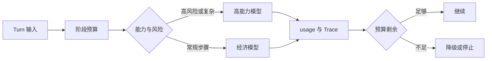

# Token 预算与分层模型路由

按任务阶段分配输入输出预算，再根据能力、时限、风险和降级状态选择模型。**Token Budget**、**Model Routing**、**Cost** 分别指向同一条执行链上的不同对象：业务 SLO、风险等级、流量、模型能力、数据规模、成本预算和发布策略进入系统，budget envelope、phase allocation、model candidates、capability、latency、cost、fallback 和 actual usage 保存处理中间状态，最终得到可定位、可降级、可回滚的请求结果，以及容量、质量和成本证据。

预算与路由位于模型调用与 Runtime 之间。它先按阶段分配上下文、输出、工具和重试预算，再根据任务能力、风险、Deadline 和降级状态选择模型，路由决策随 Trace 保存。预算是同一个 Turn 的账本，不是每个并行分支都可以重新领取的额度。

::: info 贯穿示例

预算与路由场景：知识助手流量升高，同时向量服务变慢和模型限流，系统需要保住已有会话并给出可解释降级。预算与路由需要的身份、权限、版本和业务事实由应用提供，模型与外部内容只产生候选。

:::

## 预算怎样穿过调用链

只按价格路由会破坏 budget envelope 与可定位之间的对应关系，排查时先保留原始输入摘要和发生阶段，再判断是否允许重试。

预算在并行分支重复计算影响 phase allocation 或下游解释，不能和只按价格路由共用“重新调用一次模型”的处理方式。

## 预算和模型路由分别负责什么

Token Budget 的入口负责协议和身份，Runtime 负责控制状态，能力服务负责模型、检索或工具适配。因此 budget envelope 与 phase allocation 要有唯一写入方，其他组件只能通过版本化命令申请修改。

Router 与 预算与路由解决的问题相邻，但控制权不同，比较时要看谁选择调用能力服务、谁保存 budget envelope、谁确认可定位。

容量规划可以参与同一请求，却不能替代 预算与路由；组合后仍要单独检查风险等级的可信来源和只按价格路由的终止规则。

预算与路由使用的身份、范围和版本来自可信运行时，业务 SLO 可以表达意图，但不能提升权限或改写活动 Release。

预算在并行分支重复计算发生时，错误回到 phase allocation 的所有者处理，上游缺输入、当前组件违反不变量和下游不可用分别形成不同终态。

预算与路由的确定性边界位于 budget envelope 写入之前。模型在 Token Budget 中只提交候选值，程序仍要从认证、版本和策略快照补入可信字段。

预算与路由内部可以使用更细的临时对象，跨边界只暴露稳定协议。替换 Router 时，调用方不需要理解内部缓存和 SDK 响应。

## 组件职责、状态和数据归属

预算与路由的输入合同至少列出业务 SLO、风险等级和流量，每项都注明来源、是否必需、允许的缺省值，以及缺失后是在入口拒绝还是进入降级路径。

预算路由要分开记录总预算、阶段分配和候选模型。总预算决定任务能否继续，阶段分配约束检索、工具和生成各自的额度，候选模型只说明可选能力；三者分开，降级时才能知道是额度耗尽还是模型不可用。

并发分支按稳定身份合并 model candidates，完成顺序只反映耗时，不能决定结果属于哪个请求，更不能让迟到的旧状态覆盖新修订。

Token Budget 的对外结果要分别表达可交付内容、缺口、取消和未知状态，调用方不必解析错误文案。

phase allocation 参与乐观并发检查；处理开始后若版本变化，旧候选只保留作审计，不能继续写入 budget envelope。

跨层 Trace、阶段耗时、错误类型、质量信号、资源用量和发布版本组成 预算与路由的最小追踪材料，日志只保存稳定 ID、版本和错误类，完整 Prompt、文档正文与凭证不进入指标标签。

契约还需要描述新鲜度。phase allocation 对应的数据发生变化后，旧缓存、旧候选和未完成任务怎样失效，应由版本或时间规则直接判断，不能依赖模型注意到矛盾。

删除和撤回也属于数据生命周期。预算与路由引用的原始对象被移除时，稳定 ID 可以保留审计关系，正文与派生结果则按策略失效，避免继续向用户展示过期内容。

::: warning 预算与路由的可信边界

可定位通过结构校验后仍是候选。预算与路由使用的身份、权限、知识版本与业务事实由应用从可信服务读取，核对完成后才能执行或交付。

:::

## 调用链、Deadline 与失败传播

预算路由的演示要故意耗尽工具阶段额度，再观察 Runtime 是否停止新增调用、保存剩余预算并切换到允许的降级模型。Trace 同时记录选择原因和实际消耗，不能用最终回答长度代替预算证据。

入口准入接收业务 SLO 并建立 budget envelope，入口校验未通过就地结束，后续模型、检索器或工具调用次数保持为零。

调用能力服务读取 phase allocation 并执行主题逻辑，参数由应用组装，外部返回先保存为可降级，尚未获得修改领域状态的资格。

汇总观测检查结构、范围、版本和主题不变量；可定位缺少来源、落在旧版本或越过权限时，budget envelope 停在 rejected 或 failed。

实现可以使用函数、Graph、Middleware 或 Workflow，budget envelope 的所有权和只按价格路由的停止规则不会随框架改变。

部分成功需要在步骤边界处理。

## 沿一次过载请求推演

沿“预算与路由场景：知识助手流量升高，同时向量服务变慢和模型限流，系统需要保住已有会话并给出可解释降级”推演 预算与路由：入口创建 request_id，读取可信身份，把业务 SLO 和当前版本写入初始状态。

入口准入生成 budget envelope 与输入摘要；若风险等级缺失，请求返回 rejected，并指出缺少哪项材料，不继续消耗模型或外部服务配额。

调用能力服务按“先按阶段分配上下文、输出、工具和重试预算，再根据任务能力、风险、Deadline 和降级状态选择模型；路由决策随 Trace 保存”推进，每次依赖调用保存 call_id、参数摘要、开始时间与状态版本，以便判断超时前是否已经产生结果。

降级或交付写入终态；客户端断开只影响交付通道，重新连接时读取已经保存的 budget envelope 或事件游标，不重跑核心逻辑。

故障注入选择最强模型处理所有步骤，程序保留原候选和错误位置，只重做失败边界，不能从入口复制整个任务并产生第二份状态。

推演结束后用 request_id 关联 budget envelope、可定位与终止原因，测试据此排除并发请求串线，并确认失败路径没有遗留未关闭资源。

预算与路由在输入拒绝时不调用依赖，正常路径按 5 个阶段推进，有限修复只重做失败边界。调用次数是控制流断言，不是性能宣传。

预算与路由的最终记录用 request_id 关联 budget envelope、可定位和失败问题，测试据此证明结果来自本次执行，没有混入并发请求。

## 正常服务的观测证据

预算与路由正常完成时，budget envelope、phase allocation 和可定位指向同一次执行，重复读取返回同一终态，未完成分支已经取消或有明确所有者。

跨层 Trace、阶段耗时、错误类型、质量信号、资源用量和发布版本用于还原 预算与路由的处理过程，可以按阶段和版本聚合；敏感正文留在受控存储中，不复制到日志与指标。

依赖返回成功状态只证明传输完成。预算与路由还要检查可定位是否满足业务范围、质量阈值和当前版本，明确拒绝也可能是正确终态。

budget envelope 的状态迁移必须单调：完成不能退回运行中，取消不能被迟到结果覆盖，失败重试也不能绕过入口已经固定的权限。

预算与路由的成功证据最终要同时回答输入是什么、执行了哪些步骤、交付了什么以及为什么停止；任一项缺失都应留在未确认状态。

预算与路由把业务验收与服务健康分开。依赖对 Token Budget 返回 200 只说明传输完成，内容仍要满足当前范围和质量条件。

预算与路由的观测指标按阶段和版本聚合。评估 Token Budget 时，把错误、空结果、拒绝、恢复和资源消耗分开统计，避免一个成功率掩盖不同故障。

## 降级、隔离与恢复

预算问题要沿消耗记录定位：输入过长属于装配问题，某阶段超额属于调度问题，模型拒绝属于依赖问题，结果未通过验证则不能因为剩余额度存在而交付。重试必须从同一份剩余预算扣除，不能把耗尽额度重新发给下一个模型。

遇到只按价格路由时，先记录发生阶段、错误类别和责任对象。预算与路由保留输入摘要和状态版本，由对应组件决定重试、降级或终止。

预算与路由处理预算在并行分支重复计算时需要稳定身份和结果回执，再次收到同一请求先读取旧结果；外部结果未知就停在 unknown，不能猜测失败后重新执行。

遇到最强模型处理所有步骤时，先记录发生阶段、错误类别和责任对象。预算与路由保留输入摘要和状态版本，由对应组件决定重试、降级或终止。

预算与路由把降级模型不支持 Schema 和 usage 到达后无法归因归到数据质量错误，保留原始对象与解析警告；只有可定位、可有限修复的问题才重跑当前阶段，关键内容缺失时关闭发布。

预算与路由将终态、可重试性和资源清理结果写入记录；后台扫描器根据 budget envelope 判断任务是在运行、等待恢复还是已失败。

预算与路由执行前固定 Deadline、动作上限、重复签名、无进展阈值、预算和取消信号；任一条件触发，调用能力服务停止创建新工作。

预算与路由把重试时间和次数计入总预算。Token Budget 每次重试先扣减剩余额度，达到上限就保留原始错误。

预算与路由的清理动作设计成幂等操作；仍被活动任务或 Lease 引用的资源拒绝删除。

## 故障演练和发布验证

沿正常、过载、依赖失败和回滚四条路径演练，核对状态所有者、传播边界与可观测字段；测试显式给出业务 SLO、初始 budget envelope、预期可定位和终止原因，不能只断言返回值非空。

预算与路由的单元测试用 Fake Adapter 固定可定位与错误，断言参数、调用顺序、状态修订和清理动作，这些结果只证明本地控制逻辑。

契约测试围绕业务 SLO、budget envelope 和可降级构造合法与非法样本，Schema 解析成功后继续检查权限、版本与领域不变量。

故障测试注入只按价格路由和预算在并行分支重复计算，记录调用能力服务是否被调用、budget envelope 是否改变、资源是否释放，以及同一身份重试会不会重复执行。

预算与路由的集成测试连接真实协议与隔离存储，检查序列化、约束、并发和超时；需要在线服务时另行记录服务版本、时间、配置与凭证条件。

预算与路由的回归报告要保留失败类型分布。在 Token Budget 的回归中，拒绝、超时、权限错误和空结果必须保持各自类型，状态变化本身就是行为契约。

预算与路由的性质测试随机改变 budget envelope 顺序、重复提交、完成顺序或状态版本，断言权限不扩大、终态不倒退、同一身份不产生两次副作用。

Token Budget 的离线评测关注质量变化，运行时测试关注控制和恢复，两类证据都齐全才可交付。预算与路由只有两类证据都存在，才能同时回答“结果是否合格”和“系统是否安全完成”。

## 容量、成本与版本治理

预算账本要保存模型版本、输入输出 Token、工具成本、节点配额和路由原因。字段升级时保留旧账本的计费口径，不能用新 Token 估算方式重算历史请求。

预算与路由的容量主要受到达率、并发、队列、模型配额、数据库连接和成本预算影响，并发可能缩短单次等待，也会占用连接、配额、内存和下游吞吐，必须沿入口准入、运行时编排、调用能力服务、汇总观测、降级或交付逐层核算。

预算与路由的候选版本在固定样本上比较正确性、错误类型、延迟和资源消耗，只按价格路由等安全红线回归时直接停止发布，不能用平均质量抵消。

只按价格路由的降级路径在发布前写好，可以减少非关键增强、返回已经确认的可定位，或明确暂时无法确认，缺失事实不能交给模型补写。

预算超限时，用 `request_id` 找各节点预算、实际 usage、剩余 Deadline、路由原因和重试次数，再决定裁剪上下文、切换模型还是停止。延迟告警不能覆盖已经发生的费用。

预算与路由的数据按证据用途分级保留，聚合字段可以留得更久，业务 SLO 和大体积可定位设置短期限、访问控制与删除通道。

预算与路由先在单进程实现 budget envelope、超时、错误和测试，只有恢复与容量证据提出要求时，再增加队列、Lease、分布式缓存或工作流引擎。

预算与路由的监控阈值要对应可执行动作。

回滚要覆盖代码之外的状态。预算与路由若改变 Schema、缓存键或持久化记录，旧版本是否还能读取新写入数据必须提前验证；无法双向兼容时采用候选版本隔离。

## 架构复杂度的适用边界

采用 预算与路由前先画出业务 SLO 到可定位的最小控制图；固定函数已经能完成任务时，新增模型决策和跨进程 budget envelope 只会扩大测试与运维范围。

Router 选择能力路径，预算层决定这条路径是否还有额度。路由理由、预算扣减和供应商回执由程序保存，模型可以给出候选模型，却不能修改配额或把未知费用记成零。

容量规划可以与 预算与路由组合，但外部知识仍需授权，工具调用仍需校验，模型产生的可定位仍停留在候选状态。

预算与路由适合价值足够、只按价格路由可观察且预算可接受的任务，高风险、不可逆的决定需要确定性规则或人工批准。

执行期间修改 phase allocation 可以检验并发设计，旧动作若仍能覆盖 budget envelope，说明版本或 Lease 有缺口，增加 Prompt 规则无法修复这类竞态。

模型路由会增加预算账本、依赖调用和降级责任。设计记录要写清停止、升级与回滚条件。

先用一份预算账本、几类明确错误和确定性测试验证路由，再考虑缓存或并发。

只按价格路由会忽略能力、风险和重试成本，候选模型必须先满足任务契约。

路由决策至少要保留任务类型、剩余输入输出预算、风险级别、模型能力要求和实际选择。一次请求先用便宜模型做查询改写，遇到冲突再升级并不等于无限重试；升级后的预算从同一份 Turn 账本扣减，若已经接近 Deadline，应返回保守结果或明确拒答。只按单价选择模型，会把失败重试和验证成本隐藏起来。

## 用一份账本推演模型升级

假设一个问答 Turn 的总预算是输入 6000 Token、输出 1200 Token、两次模型调用和 15 秒 Deadline。第一次调用负责查询理解，实际消耗输入 1100、输出 180，账本同时记录请求次数和估算费用。检索返回两组互相冲突的证据，Runtime 决定升级到具备更强工具调用能力的模型。升级前先扣除最小输入上下文和验证预留，如果剩余输出预算不足 300，继续升级只会得到被截断的答案，系统应保存冲突证据并拒答，而不是让模型把缺口补成结论。

预算项必须和责任绑定。Token 预算由 Runtime 维护，模型适配器只报告供应商 usage；费用估算由路由层计算，不能让模型自行修改；Deadline 由 Turn 创建时固定，重试和子 Agent 共用剩余时间。缓存命中可以减少模型调用，但命中结果仍要经过当前 Policy 与 ACL 检查，节省 Token 不等于跳过授权。

路由规则应先筛能力，再比较成本。需要结构化输出的任务排除不支持 Schema 的模型，需要视觉输入的任务排除纯文本适配器，需要高风险工具的任务还要检查审计和人工审批能力。候选模型都不可用时，稳定返回 `model_unavailable` 或排队状态；不能根据名称猜测兼容性，也不能在每层 SDK 中各自重试。

测试用 Fake Gateway 返回固定 usage、限流和超时。断言一次升级不会超过调用次数、所有分支都扣同一份账本、预算不足会停止新动作、失败事件包含实际模型和剩余预算。在线验证另行记录供应商版本与配置，不能把本地 Fake 的 Token 数写成真实效果。

预算账本还要支持审计。每次扣减记录阶段、调用 ID、输入输出数量和计算规则，取消或失败也不能抹掉已消耗额度。月度统计从账本聚合，不从供应商账单反推单个 Turn。

账本还应保留预算版本，规则调整后旧 Turn 仍按原规则解释。

当 usage 晚到或供应商没有返回完整计量时，账本先记录估算值和置信状态，后续对账再写实际值。估算与实际不能覆盖成一个字段，否则成本异常无法回到具体调用。

## 预算路由的耗尽自测

用“一个问题需要检索、工具调用和最终综合”做自测时，入口先记录输入摘要、身份和执行版本。总预算、节点配额、实际 usage、路由原因和剩余时间由唯一组件写入，其他组件只能提交带修订号的候选。在“一个问题需要检索、工具调用和最终综合”里，读者可以从任务 ID 找到它经过的节点，不必靠最终文案猜过程。

针对“一个问题需要检索、工具调用和最终综合”，正常路径从准入开始，先检查范围和资源，再创建一次调用。调用结果带稳定 ID、来源和终止原因，重试耗尽、供应商未知费用或 Deadline 到期分别记录。针对“总预算、节点配额、实际 usage、路由原因和剩余时间”，输出进入下一节点前还要确认版本和权限，空结果也要说明范围。

在“一个问题需要检索、工具调用和最终综合”的故障测试中，依赖调用前和结果已经产生但状态尚未提交时各切断一次。前者应没有外部调用，后者要留下可重放的未知状态。恢复使用同一幂等键，先查询外部回执，再决定补偿。

“一个问题需要检索、工具调用和最终综合”的验证命令检查输入、状态变化、调用顺序、输出摘要、失败证据和资源清理。优先缩小范围，不静默扩大预算。

“一个问题需要检索、工具调用和最终综合”的取舍需要写在结果里：扩大缓存、并行或自动修复可能缩短等待，也会增加状态、成本和失败组合；保持较小能力面则更容易做权限隔离和人工接管。

回放“一个问题需要检索、工具调用和最终综合”时改变输入顺序、重复提交、缩短 Deadline 或撤回权限，确认状态单调、范围不扩大、资源按时释放。指标用于定位变化，不替代事实核验。

## 一个问题需要检索、工具调用和最终综合的边界案例

在“一个问题需要检索、工具调用和最终综合”中，入口收到的资料可能不完整，程序先保存缺口和当前版本，不能让模型用常识填入 总预算、节点配额、实际 usage、路由原因和剩余时间。“一个问题需要检索、工具调用和最终综合”的输入后来补齐时，新的执行沿同一个任务 ID 继续；已经结束的失败记录不被覆盖。

重试耗尽要保留每次扣减，供应商费用未知要进入待结算状态，Deadline 到期要记录最后一个已确认的节点。没有发起、调用报错、调用成功但返回空、费用和结果都未确认分别处理，不能把超预算重试伪装成降级成功。

“一个问题需要检索、工具调用和最终综合”的“一个问题需要检索、工具调用和最终综合”的正常输出先经过范围、版本和权限检查，再进入交付或下一个节点。优先缩小范围，不静默扩大预算。“一个问题需要检索、工具调用和最终综合”的输出只满足结构而没有可验证来源时，状态保持为候选，前端应显示缺口而不是成功标记。

用重复提交、并发完成、取消和进程退出四个样本回归。回归“一个问题需要检索、工具调用和最终综合”时，回归“一个问题需要检索、工具调用和最终综合”时，检查同一幂等键是否只产生一个有效终态，迟到事件是否被拒绝，临时资源是否释放，重新连接是否能读到同一份事件。

“一个问题需要检索、工具调用和最终综合”“一个问题需要检索、工具调用和最终综合”这组检查的结果应带命令、解释器或服务版本、输入摘要和退出码。“一个问题需要检索、工具调用和最终综合”“一个问题需要检索、工具调用和最终综合”没有运行证据时，只能写“待验证”；离线替身通过也不能推导真实模型、网络服务或生产权限已经通过。

agent-token-budget-model-routing的修改要优先改变责任边界和可观察证据，不能靠增加一个关键词特判来让样本通过。
