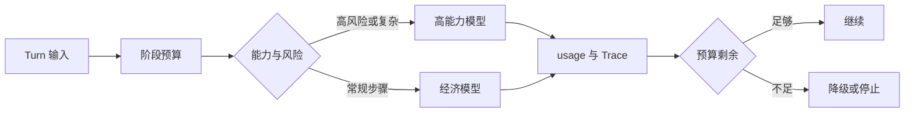

# Token 预算与分层模型路由

按任务阶段分配输入输出预算，再根据能力、时限、风险和降级状态选择模型。

**Token Budget**、**Model Routing**、**Cost** 分别指向同一条执行链上的不同对象：业务 SLO、风险等级、流量、模型能力、数据规模、成本预算和发布策略进入系统，budget envelope、phase allocation、model candidates、capability、latency、cost、

fallback 和 actual usage 保存处理中间状态，最终得到可定位、可降级、可回滚的请求结果，以及容量、质量和成本证据。
预算与路由位于模型调用与 Runtime 之间。它先按阶段分配上下文、输出、工具和重试预算，再根据任务能力、风险、Deadline 和降级状态选择模型，路由决策随 Trace 保存。预算是同一个 Turn 的账本，不是每个并行分支都可以重新领取的额度。

::: info 贯穿示例

预算与路由场景：知识助手流量升高，同时向量服务变慢和模型限流，系统需要保住已有会话并给出可解释降级。预算与路由需要的身份、权限、版本和业务事实由应用提供，模型与外部内容只产生候选。

:::

## 预算怎样穿过调用链

只按价格路由会破坏 budget envelope 与可定位之间的对应关系，排查时先保留原始输入摘要和发生阶段，再判断是否允许重试。

预算在并行分支重复计算影响 phase allocation 或下游解释，不能和只按价格路由共用“重新调用一次模型”的处理方式。
## 预算和模型路由分别负责什么

Token Budget 的入口负责协议和身份，Runtime 负责控制状态，能力服务负责模型、检索或工具适配。因此 budget envelope 与 phase allocation 要有唯一写入方，其他组件只能通过版本化命令申请修改。

Router 与 预算与路由解决的问题相邻，但控制权不同，比较时要看谁选择调用能力服务、谁保存 budget envelope、谁确认可定位。

容量规划可以参与同一请求，却不能替代 预算与路由；组合后仍要单独检查风险等级的可信来源和只按价格路由的终止规则。

预算与路由使用的身份、范围和版本来自可信运行时，业务 SLO 可以表达意图，但不能提升权限或改写活动 Release。

预算在并行分支重复计算发生时，错误回到 phase allocation 的所有者处理，上游缺输入、当前组件违反不变量和下游不可用分别形成不同终态。

预算与路由的确定性边界位于 budget envelope 写入之前。模型在 Token Budget 中只提交候选值，程序仍要从认证、版本和策略快照补入可信字段。

预算与路由内部可以使用更细的临时对象，跨边界只暴露稳定协议。替换 Router 时，调用方不需要理解内部缓存和 SDK 响应。
## 组件职责、状态和数据归属

预算与路由的输入合同至少列出业务 SLO、风险等级和流量，每项都注明来源、是否必需、允许的缺省值，以及缺失后是在入口拒绝还是进入降级路径。

预算路由要分开记录总预算、阶段分配和候选模型。总预算决定任务能否继续，阶段分配约束检索、工具和生成各自的额度，候选模型只说明可选能力；三者分开，降级时才能知道是额度耗尽还是模型不可用。

并发分支按稳定身份合并 model candidates，完成顺序只反映耗时，不能决定结果属于哪个请求，更不能让迟到的旧状态覆盖新修订。

Token Budget 的对外结果要分别表达可交付内容、缺口、取消和未知状态，调用方不必解析错误文案。

phase allocation 参与乐观并发检查；处理开始后若版本变化，旧候选只保留作审计，不能继续写入 budget envelope。

跨层 Trace、阶段耗时、错误类型、质量信号、资源用量和发布版本组成 预算与路由的最小追踪材料，日志只保存稳定 ID、版本和错误类，完整 Prompt、文档正文与凭证不进入指标标签。

契约还需要描述新鲜度。phase allocation 对应的数据发生变化后，旧缓存、旧候选和未完成任务怎样失效，应由版本或时间规则直接判断，不能依赖模型注意到矛盾。

删除和撤回也属于数据生命周期。预算与路由引用的原始对象被移除时，稳定 ID 可以保留审计关系，正文与派生结果则按策略失效，避免继续向用户展示过期内容。

::: warning 预算与路由的可信边界

可定位通过结构校验后仍是候选。预算与路由使用的身份、权限、知识版本与业务事实由应用从可信服务读取，核对完成后才能执行或交付。

:::
## 调用链、Deadline 与失败传播

预算路由的演示要故意耗尽工具阶段额度，再观察 Runtime 是否停止新增调用、保存剩余预算并切换到允许的降级模型。Trace 同时记录选择原因和实际消耗，不能用最终回答长度代替预算证据。

入口准入接收业务 SLO 并建立 budget envelope，入口校验未通过就地结束，后续模型、检索器或工具调用次数保持为零。

调用能力服务读取 phase allocation 并执行主题逻辑，参数由应用组装，外部返回先保存为可降级，尚未获得修改领域状态的资格。

汇总观测检查结构、范围、版本和主题不变量；可定位缺少来源、落在旧版本或越过权限时，budget envelope 停在 rejected 或 failed。

实现可以使用函数、Graph、Middleware 或 Workflow，budget envelope 的所有权和只按价格路由的停止规则不会随框架改变。

部分成功需要在步骤边界处理。
## 沿一次过载请求推演

沿“预算与路由场景：知识助手流量升高，同时向量服务变慢和模型限流，系统需要保住已有会话并给出可解释降级”推演 预算与路由：入口创建 request_id，读取可信身份，把业务 SLO 和当前版本写入初始状态。

入口准入生成 budget envelope 与输入摘要；若风险等级缺失，请求返回 rejected，并指出缺少哪项材料，不继续消耗模型或外部服务配额。

调用能力服务按“先按阶段分配上下文、输出、工具和重试预算，再根据任务能力、风险、Deadline 和降级状态选择模型；路由决策随 Trace 保存”推进，每次依赖调用保存 call_id、参数摘要、开始时间与状态版本，以便判断超时前是否已经产生结果。

降级或交付写入终态；客户端断开只影响交付通道，重新连接时读取已经保存的 budget envelope 或事件游标，不重跑核心逻辑。

故障注入选择最强模型处理所有步骤，程序保留原候选和错误位置，只重做失败边界，不能从入口复制整个任务并产生第二份状态。

推演结束后用 request_id 关联 budget envelope、可定位与终止原因，测试据此排除并发请求串线，并确认失败路径没有遗留未关闭资源。

预算与路由在输入拒绝时不调用依赖，正常路径按 5 个阶段推进，有限修复只重做失败边界。调用次数是控制流断言，不是性能宣传。

预算与路由的最终记录用 request_id 关联 budget envelope、可定位和失败问题，测试据此证明结果来自本次执行，没有混入并发请求。
## 正常服务的观测证据

预算与路由正常完成时，budget envelope、phase allocation 和可定位指向同一次执行，重复读取返回同一终态，未完成分支已经取消或有明确所有者。

跨层 Trace、阶段耗时、错误类型、质量信号、资源用量和发布版本用于还原 预算与路由的处理过程，可以按阶段和版本聚合；敏感正文留在受控存储中，不复制到日志与指标。

依赖返回成功状态只证明传输完成。预算与路由还要检查可定位是否满足业务范围、质量阈值和当前版本，明确拒绝也可能是正确终态。

budget envelope 的状态迁移必须单调：完成不能退回运行中，取消不能被迟到结果覆盖，失败重试也不能绕过入口已经固定的权限。

预算与路由的成功证据最终要同时回答输入是什么、执行了哪些步骤、交付了什么以及为什么停止；任一项缺失都应留在未确认状态。

预算与路由把业务验收与服务健康分开。依赖对 Token Budget 返回 200 只说明传输完成，内容仍要满足当前范围和质量条件。

预算与路由的观测指标按阶段和版本聚合。评估 Token Budget 时，把错误、空结果、拒绝、恢复和资源消耗分开统计，避免一个成功率掩盖不同故障。
## 降级、隔离与恢复

预算问题要沿消耗记录定位：输入过长属于装配问题，某阶段超额属于调度问题，模型拒绝属于依赖问题，结果未通过验证则不能因为剩余额度存在而交付。重试必须从同一份剩余预算扣除，不能把耗尽额度重新发给下一个模型。

遇到只按价格路由时，先记录发生阶段、错误类别和责任对象。预算与路由保留输入摘要和状态版本，由对应组件决定重试、降级或终止。

预算与路由处理预算在并行分支重复计算时需要稳定身份和结果回执，再次收到同一请求先读取旧结果；外部结果未知就停在 unknown，不能猜测失败后重新执行。

遇到最强模型处理所有步骤时，先记录发生阶段、错误类别和责任对象。预算与路由保留输入摘要和状态版本，由对应组件决定重试、降级或终止。

预算与路由把降级模型不支持 Schema 和 usage 到达后无法归因归到数据质量错误，保留原始对象与解析警告；只有可定位、可有限修复的问题才重跑当前阶段，关键内容缺失时关闭发布。

预算与路由将终态、可重试性和资源清理结果写入记录；后台扫描器根据 budget envelope 判断任务是在运行、等待恢复还是已失败。

预算与路由执行前固定 Deadline、动作上限、重复签名、无进展阈值、预算和取消信号；任一条件触发，调用能力服务停止创建新工作。

预算与路由把重试时间和次数计入总预算。Token Budget 每次重试先扣减剩余额度，达到上限就保留原始错误。

预算与路由的清理动作设计成幂等操作；仍被活动任务或 Lease 引用的资源拒绝删除。
## 故障演练和发布验证

沿正常、过载、依赖失败和回滚四条路径演练，核对状态所有者、传播边界与可观测字段；测试显式给出业务 SLO、初始 budget envelope、预期可定位和终止原因，不能只断言返回值非空。

预算与路由的单元测试用 Fake Adapter 固定可定位与错误，断言参数、调用顺序、状态修订和清理动作，这些结果只证明本地控制逻辑。

契约测试围绕业务 SLO、budget envelope 和可降级构造合法与非法样本，Schema 解析成功后继续检查权限、版本与领域不变量。

故障测试注入只按价格路由和预算在并行分支重复计算，记录调用能力服务是否被调用、budget envelope 是否改变、资源是否释放，以及同一身份重试会不会重复执行。

预算与路由的集成测试连接真实协议与隔离存储，检查序列化、约束、并发和超时；需要在线服务时另行记录服务版本、时间、配置与凭证条件。

预算与路由的回归报告要保留失败类型分布。在 Token Budget 的回归中，拒绝、超时、权限错误和空结果必须保持各自类型，状态变化本身就是行为契约。

预算与路由的性质测试随机改变 budget envelope 顺序、重复提交、完成顺序或状态版本，断言权限不扩大、终态不倒退、同一身份不产生两次副作用。
## 预算耗尽要产生可解释终态

预算账本以实际 usage、已预留调用和剩余 Deadline 更新。节点申请额度时说明用途，路由器在允许模型集合中选择满足上下文与能力要求的最低成本候选。模型降级后若上下文、工具或结构化输出能力不满足，节点应缩小任务或停止，不能静默换模型继续。

验收用相同 Turn 重放正常、usage 晚到、并发预留和 Deadline 缩短。最终记录要解释额度花在哪、为什么换模型、哪些 Claim 因预算没有生成。
