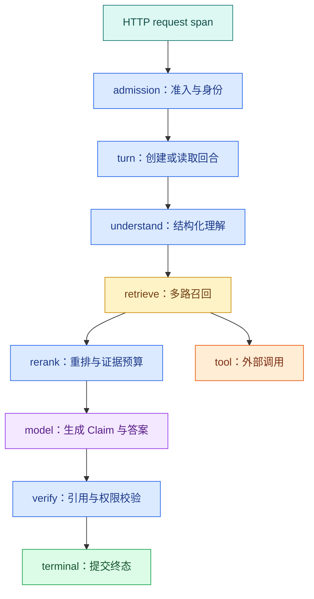

# Agent Trace：日志、指标与一次运行怎样关联

用户说“这个回答等了二十秒”，普通访问日志只告诉你接口最终返回 200。时间耗在排队、检索、重排、模型首 Token、工具重试还是引用验证，仍然不知道。

可观测性要让工程师从一次用户请求追到每个阶段，同时能从整体指标发现趋势。Trace 解释一条运行路径，Metric 观察大量运行的变化，Log 保存离散事件和诊断细节；三者通过稳定 ID 关联，而不是把整段用户问题塞进标签。

## 先定义四个不同的身份

长时间 Agent 往往不等于一个 HTTP 连接：

- `request_id` 标识一次网络请求，断线重连会产生新的请求；
- `conversation_id` 标识会话，可包含多个问题；
- `turn_id` 标识用户的一次目标和最终终态；
- `task_id` 标识后台执行，可因重试或恢复产生新尝试。

Trace 通常从请求或任务开始，但业务查询与取消应围绕 `turn_id`。如果只保存 request ID，客户端断线后就无法把重连查询与原运行关联起来。

## 一条 Agent Trace 应该长什么样



根 Span 记录入口和最终状态。理解、检索、重排、模型、验证各自成为子 Span；工具调用可以挂在选择它的节点下。异步 Worker 不能简单继承同一个进程上下文时，需要把 Trace Context 与业务 ID 一起放进任务消息，再在消费者端建立链接或子 Span。

## Span、Metric、Log 分别回答什么

| 信号 | 主要问题 | 示例 |
| --- | --- | --- |
| Trace | 这一次为什么慢或错 | 哪个模型调用等待 8 秒 |
| Metric | 系统整体是否恶化 | P95 TTFT、超时率、队列年龄 |
| Log | 某个状态发生了什么 | 工具参数校验失败类型 |

不要把三者做成三份互不相干的数据。Metric 告警指出某版本超时率上升，工程师从 Exemplars 或时间窗口找到 Trace，再通过 `turn_id` 查对应结构化日志。

## 每个 Span 记录哪些字段

通用字段包括组件、操作、开始结束、状态、错误类型、版本和关联 ID。不同阶段还需要自己的低敏感摘要：

| 阶段 | 推荐属性 | 不宜记录 |
| --- | --- | --- |
| 理解 | intent、是否澄清、模型版本 | 完整用户问题 |
| 检索 | 通道、候选数、过滤数、知识版本 | 片段正文 |
| 工具 | 工具名、契约版本、终态、返回条数 | Token、Cookie、完整参数 |
| 模型 | provider、model、Token、结束原因 | 完整 Prompt 与响应 |
| 验证 | Claim 数、无证据数、修复次数 | 敏感 Claim 原文 |

对问题和证据做哈希不等于绝对匿名：低熵值仍可能被猜出。诊断确实需要原文时，应使用受控采样、独立加密存储、严格权限与保留期限，而不是 Metric 标签。

## 为什么高基数标签会拖垮指标系统

`model_id`、`status` 和受控的 `error_type` 值有限，适合 Metric 标签。`user_id`、`turn_id`、URL、问题文本和任意工具错误每次都可能不同，属于高基数数据。

高基数会创建大量时间序列，增加内存、存储和查询成本。业务 ID 放进 Trace 或日志字段，需要聚合的维度才放 Metric 标签。租户级指标也要评估数量和隐私，不能默认把每个租户变成标签。

## AI 服务需要观察哪几类指标

### 可用性

按终态统计 completed、insufficient、denied、cancelled、failed 和 deadline_exceeded。HTTP 200 不代表业务完成，SSE 连接成功也不代表最终回答可用。

### 延迟

区分排队时间、首事件、首 Token（TTFT）、总时长、检索、模型和工具耗时。总耗时增加时，分阶段指标能缩小范围。

### 质量

线上无法获得每次人工答案，但可以观察无证据率、引用验证失败、有限修复、用户明确反馈和抽样 Eval。质量指标需要版本与任务类型上下文，不能把一个点赞数当真值。

### 成本与资源

记录输入/输出 Token、模型与工具调用次数、Embedding 批量、队列年龄、Worker 并发和 GPU 指标。费用是业务换算，Token 与调用次数是更稳定的工程事实。

## 慢请求怎样沿 Trace 排查

假设总耗时 20 秒：

1. 根 Span 显示排队 1 秒、执行 19 秒；
2. 检索 400 毫秒，重排 300 毫秒；
3. 第一次模型调用 3 秒；
4. 一个工具调用 10 秒后超时；
5. Runtime 又使用完整 10 秒重试；
6. 最终验证在 Deadline 后才发现超时。

根因不是“模型慢”，而是工具重试重置了预算。Trace 提供单次证据，Metric 再回答这种模式是否普遍。修复后应该看到工具次数、超时 Span 和总时长同时变化。

## 错误分类比错误字符串重要

数据库和 SDK 错误字符串会随版本变化，也可能含敏感参数。适配器应映射为稳定错误枚举，例如：

```text
invalid_arguments
permission_denied
deadline_exceeded
cancelled
dependency_unavailable
contract_violation
insufficient_evidence
verification_failed
```

Span 状态用于表示技术调用是否成功，业务终态另用字段表示。检索成功返回空数组时，Span 可以是 OK，回合终态可能是 `insufficient`；把它记为数据库错误会造成错误告警。

## 异步任务和重试怎样保持关联

API 创建 Turn 后把任务交给 Worker。任务消息应携带标准 Trace Context、`turn_id`、`task_id`、尝试次数和绝对 Deadline。Worker 领取后创建执行 Span，记录队列等待时间与任务所有权。

重试是新的尝试 Span，不覆盖原 Span；恢复任务可以与原 Trace 建立 Link。这样既能看到一条逻辑 Turn 的完整历史，也不会假装两个不同进程共享连续调用栈。

失去 Lease、取消或 Deadline 到达后，Worker 要停止继续写事件。Trace 记录停止原因，但业务状态仍由数据库的条件更新保证单一终态。

## 告警怎样避免只有噪声

一个可行动告警要包含窗口、指标、阈值来源、影响范围和排查入口。例如“某模型版本的 deadline_exceeded 比稳定基线上升，并且工具超时占主要比例”，比“接口有错误”更可操作。

AI SLO 通常至少覆盖可用性、延迟、质量和成本。质量信号比 HTTP 状态更慢、更不完整，可以通过离线 Eval、在线验证失败和用户反馈组合，而不是承诺一个无法实时测量的绝对正确率。

## 带到工作的观测字典

```text
业务身份：conversation_id / turn_id / task_id 怎样关联
根 Span：从哪里开始，到哪个终态结束
节点 Span：理解 / 检索 / 工具 / 模型 / 验证
版本属性：Runtime / Prompt / 模型 / 知识 / 检索策略
稳定错误枚举：
可用性指标与业务终态：
TTFT、TPOT、队列、总时长的定义：
质量代理指标与离线 Eval 关联：
Token、工具调用和资源成本字段：
禁止进入标签或普通日志的内容：
采样、保留和访问控制：
告警触发后如何找到代表 Trace：
```

下一篇会把 Trace 中看到的时间和调用次数变成请求预算，继续处理 Deadline、模型路由、有限重试、取消和降级。
