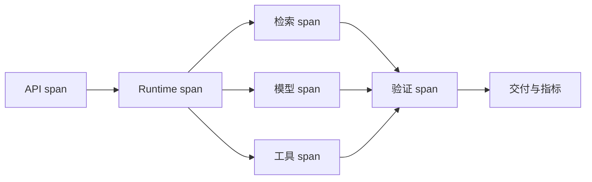

# Trace 怎样串起模型、检索、工具与验证

设计跨节点 Trace、Metric 和 Log，区分延迟、错误、质量、成本和资源问题。**Trace**、**Observability**、**Metrics** 分别指向同一条执行链上的不同对象：业务 SLO、风险等级、流量、模型能力、数据规模、成本预算和发布策略进入系统，trace_id、span_id、parent、phase、release、policy、latency、tokens、candidate count、error 和 quality signal 保存处理中间状态，最终得到可定位、可降级、可回滚的请求结果，以及容量、质量和成本证据。

Trace 不是一条把所有日志串在一起的字符串。它把 API、规划、检索、模型、工具、验证和交付连接成一棵有父子关系的 Span 树，每段记录输入摘要、版本、耗时、状态和错误类；指标按阶段聚合，日志保留定位所需的细节。这样才能回答“慢在检索还是模型”“失败发生在调用前还是回执后”。

::: info 贯穿示例

Trace 串起模型、检索、工具与验证场景：知识助手流量升高，同时向量服务变慢和模型限流，系统需要保住已有会话并给出可解释降级。Trace 串起模型、检索、工具与验证需要的身份、权限、版本和业务事实由应用提供，模型与外部内容只产生候选。

:::

## Trace 怎样沿调用链传播

只记录总耗时会破坏 trace_id 与可定位之间的对应关系，排查时先保留原始输入摘要和发生阶段，再判断是否允许重试。

日志含私有 Prompt 影响 span_id 或下游解释，不能和只记录总耗时共用“重新调用一次模型”的处理方式。

## Trace、Metric 与 Log 的职责边界

Trace 的入口负责协议和身份，Runtime 负责控制状态，能力服务负责模型、检索或工具适配。因此 trace_id 与 span_id 要有唯一写入方，其他组件只能通过版本化命令申请修改。

Log 与 Trace 串起模型、检索、工具与验证解决的问题相邻，但控制权不同，比较时要看谁选择调用能力服务、谁保存 trace_id、谁确认可定位。

Metric 可以参与同一请求，却不能替代 Trace 串起模型、检索、工具与验证；组合后仍要单独检查风险等级的可信来源和只记录总耗时的终止规则。

Trace 串起模型、检索、工具与验证使用的身份、范围和版本来自可信运行时，业务 SLO 可以表达意图，但不能提升权限或改写活动 Release。

日志含私有 Prompt 发生时，错误回到 span_id 的所有者处理，上游缺输入、当前组件违反不变量和下游不可用分别形成不同终态。

Trace 串起模型、检索、工具与验证的确定性边界位于 trace_id 写入之前。模型在 Trace 中只提交候选值，程序仍要从认证、版本和策略快照补入可信字段。

Trace 串起模型、检索、工具与验证内部可以使用更细的临时对象，跨边界只暴露稳定协议。替换 Log 时，调用方不需要理解内部缓存和 SDK 响应。

## 组件职责、状态和数据归属

Trace 串起模型、检索、工具与验证的输入合同至少列出业务 SLO、风险等级和流量，每项都注明来源、是否必需、允许的缺省值，以及缺失后是在入口拒绝还是进入降级路径。

Trace 设计要把 `trace_id`、`span_id`、父子关系和版本标签分开。Trace 负责一次请求的边界，Span 负责一个阶段的耗时与错误，父子关系还原调用顺序；把它们写成一条日志，查询、工具和验证就无法分层比较。

并发分支按稳定身份合并 parent，完成顺序只反映耗时，不能决定结果属于哪个请求，更不能让迟到的旧状态覆盖新修订。

Trace 的对外结果要分别表达可交付内容、缺口、取消和未知状态，调用方不必解析错误文案。

span_id 参与乐观并发检查；处理开始后若版本变化，旧候选只保留作审计，不能继续写入 trace_id。

跨层 Trace、阶段耗时、错误类型、质量信号、资源用量和发布版本组成 Trace 串起模型、检索、工具与验证的最小追踪材料，日志只保存稳定 ID、版本和错误类，完整 Prompt、文档正文与凭证不进入指标标签。

契约还需要描述新鲜度。span_id 对应的数据发生变化后，旧缓存、旧候选和未完成任务怎样失效，应由版本或时间规则直接判断，不能依赖模型注意到矛盾。

删除和撤回也属于数据生命周期。Trace 串起模型、检索、工具与验证引用的原始对象被移除时，稳定 ID 可以保留审计关系，正文与派生结果则按策略失效，避免继续向用户展示过期内容。

::: warning Trace 串起模型、检索、工具与验证的可信边界

可定位通过结构校验后仍是候选。Trace 串起模型、检索、工具与验证使用的身份、权限、知识版本与业务事实由应用从可信服务读取，核对完成后才能执行或交付。

:::

## 调用链、Deadline 与失败传播

Trace 串起模型、检索、工具与验证时，至少回放一次从入口到交付的调用树：每个 Span 带版本、耗时、状态和错误类，聚合指标与单次日志通过同一 ID 关联。缺少某个子 Span 时，报告应明确断点，而不是用总耗时推测内部发生了什么。

入口准入接收业务 SLO 并建立 trace_id，入口校验未通过就地结束，后续模型、检索器或工具调用次数保持为零。

调用能力服务读取 span_id 并执行主题逻辑，参数由应用组装，外部返回先保存为可降级，尚未获得修改领域状态的资格。

汇总观测检查结构、范围、版本和主题不变量；可定位缺少来源、落在旧版本或越过权限时，trace_id 停在 rejected 或 failed。

实现可以使用函数、Graph、Middleware 或 Workflow，trace_id 的所有权和只记录总耗时的停止规则不会随框架改变。

部分成功需要在步骤边界处理。

## 沿一次过载请求推演

沿“Trace 串起模型、检索、工具与验证场景：知识助手流量升高，同时向量服务变慢和模型限流，系统需要保住已有会话并给出可解释降级”推演 Trace 串起模型、检索、工具与验证：入口创建 request_id，读取可信身份，把业务 SLO 和当前版本写入初始状态。

入口准入生成 trace_id 与输入摘要；若风险等级缺失，请求返回 rejected，并指出缺少哪项材料，不继续消耗模型或外部服务配额。

调用能力服务按“一个 Trace 串联 API、规划、检索、模型、工具、验证和交付，每段 Span 记录输入摘要、版本、耗时、状态和错误类；指标按层聚合，日志保留定位细节”推进，每次依赖调用保存 call_id、参数摘要、开始时间与状态版本，以便判断超时前是否已经产生结果。

降级或交付写入终态；客户端断开只影响交付通道，重新连接时读取已经保存的 trace_id 或事件游标，不重跑核心逻辑。

故障注入选择异步任务丢 Trace，程序保留原候选和错误位置，只重做失败边界，不能从入口复制整个任务并产生第二份状态。

推演结束后用 request_id 关联 trace_id、可定位与终止原因，测试据此排除并发请求串线，并确认失败路径没有遗留未关闭资源。

Trace 串起模型、检索、工具与验证在输入拒绝时不调用依赖，正常路径按 5 个阶段推进，有限修复只重做失败边界。调用次数是控制流断言，不是性能宣传。

Trace 串起模型、检索、工具与验证的最终记录用 request_id 关联 trace_id、可定位和失败问题，测试据此证明结果来自本次执行，没有混入并发请求。

## 正常服务的观测证据

Trace 串起模型、检索、工具与验证正常完成时，trace_id、span_id 和可定位指向同一次执行，重复读取返回同一终态，未完成分支已经取消或有明确所有者。

跨层 Trace、阶段耗时、错误类型、质量信号、资源用量和发布版本用于还原 Trace 串起模型、检索、工具与验证的处理过程，可以按阶段和版本聚合；敏感正文留在受控存储中，不复制到日志与指标。

依赖返回成功状态只证明传输完成。Trace 串起模型、检索、工具与验证还要检查可定位是否满足业务范围、质量阈值和当前版本，明确拒绝也可能是正确终态。

trace_id 的状态迁移必须单调：完成不能退回运行中，取消不能被迟到结果覆盖，失败重试也不能绕过入口已经固定的权限。

Trace 串起模型、检索、工具与验证的成功证据最终要同时回答输入是什么、执行了哪些步骤、交付了什么以及为什么停止；任一项缺失都应留在未确认状态。

Trace 串起模型、检索、工具与验证把业务验收与服务健康分开。依赖对 Trace 返回 200 只说明传输完成，内容仍要满足当前范围和质量条件。

Trace 串起模型、检索、工具与验证的观测指标按阶段和版本聚合。评估 Trace 时，把错误、空结果、拒绝、恢复和资源消耗分开统计，避免一个成功率掩盖不同故障。

## 降级、隔离与恢复

Trace 的故障分析要把模型延迟、检索空结果、工具拒绝和答案验证失败分开统计。前两类可能需要降级，工具拒绝需要检查权限，验证失败则阻断交付；统一重试只会放大成本并丢失责任层。

遇到只记录总耗时时，先记录发生阶段、错误类别和责任对象。Trace 串起模型、检索、工具与验证保留输入摘要和状态版本，由对应组件决定重试、降级或终止。

遇到日志含私有 Prompt 时，先记录发生阶段、错误类别和责任对象。Trace 串起模型、检索、工具与验证保留输入摘要和状态版本，由对应组件决定重试、降级或终止。

遇到异步任务丢 Trace 时，先记录发生阶段、错误类别和责任对象。Trace 串起模型、检索、工具与验证保留输入摘要和状态版本，由对应组件决定重试、降级或终止。

Trace 串起模型、检索、工具与验证发现重试覆盖首次错误后重新读取权威状态，旧候选可以保留作审计，却不能覆盖新版本；前后状态无法兼容时，当前尝试以 conflict 结束。

遇到平均值掩盖长尾时，先记录发生阶段、错误类别和责任对象。Trace 串起模型、检索、工具与验证保留输入摘要和状态版本，由对应组件决定重试、降级或终止。

Trace 串起模型、检索、工具与验证发现指标无法关联版本后重新读取权威状态，旧候选可以保留作审计，却不能覆盖新版本；前后状态无法兼容时，当前尝试以 conflict 结束。

Trace 串起模型、检索、工具与验证将终态、可重试性和资源清理结果写入记录；后台扫描器根据 trace_id 判断任务是在运行、等待恢复还是已失败。

Trace 串起模型、检索、工具与验证执行前固定 Deadline、动作上限、重复签名、无进展阈值、预算和取消信号；任一条件触发，调用能力服务停止创建新工作。

Trace 串起模型、检索、工具与验证把重试时间和次数计入总预算。Trace 每次重试先扣减剩余额度，达到上限就保留原始错误。

Trace 串起模型、检索、工具与验证的清理动作设计成幂等操作；仍被活动任务或 Lease 引用的资源拒绝删除。

## 故障演练和发布验证

沿正常、过载、依赖失败和回滚四条路径演练，核对状态所有者、传播边界与可观测字段；测试显式给出业务 SLO、初始 trace_id、预期可定位和终止原因，不能只断言返回值非空。

Trace 串起模型、检索、工具与验证的单元测试用 Fake Adapter 固定可定位与错误，断言参数、调用顺序、状态修订和清理动作，这些结果只证明本地控制逻辑。

契约测试围绕业务 SLO、trace_id 和可降级构造合法与非法样本，Schema 解析成功后继续检查权限、版本与领域不变量。

故障测试注入只记录总耗时和日志含私有 Prompt，记录调用能力服务是否被调用、trace_id 是否改变、资源是否释放，以及同一身份重试会不会重复执行。

Trace 串起模型、检索、工具与验证的集成测试连接真实协议与隔离存储，检查序列化、约束、并发和超时；需要在线服务时另行记录服务版本、时间、配置与凭证条件。

Trace 串起模型、检索、工具与验证的回归报告要保留失败类型分布。在 Trace 的回归中，拒绝、超时、权限错误和空结果必须保持各自类型，状态变化本身就是行为契约。

Trace 串起模型、检索、工具与验证的性质测试随机改变 trace_id 顺序、重复提交、完成顺序或状态版本，断言权限不扩大、终态不倒退、同一身份不产生两次副作用。

Trace 的离线评测关注质量变化，运行时测试关注控制和恢复，两类证据都齐全才可交付。Trace 串起模型、检索、工具与验证只有两类证据都存在，才能同时回答“结果是否合格”和“系统是否安全完成”。

## 容量、成本与版本治理

Trace 记录要固定 `trace_id`、事件 Schema、采样策略和脱敏规则的版本。升级字段时保留旧事件的解析器，避免新面板把历史缺失字段当成零值，造成错误的成功率。

Trace 串起模型、检索、工具与验证的容量主要受到达率、并发、队列、模型配额、数据库连接和成本预算影响，并发可能缩短单次等待，也会占用连接、配额、内存和下游吞吐，必须沿入口准入、运行时编排、调用能力服务、汇总观测、降级或交付逐层核算。

Trace 串起模型、检索、工具与验证的候选版本在固定样本上比较正确性、错误类型、延迟和资源消耗，只记录总耗时等安全红线回归时直接停止发布，不能用平均质量抵消。

只记录总耗时的降级路径在发布前写好，可以减少非关键增强、返回已经确认的可定位，或明确暂时无法确认，缺失事实不能交给模型补写。

排查一次回答错误时，先用 `request_id` 找到模型输入摘要、检索候选、工具调用、验证事件和发布版本，再沿父子 Span 判断在哪一层产生了不一致。耗时、费用和质量信号分别指向资源、依赖和内容问题。

Trace 串起模型、检索、工具与验证的数据按证据用途分级保留，聚合字段可以留得更久，业务 SLO 和大体积可定位设置短期限、访问控制与删除通道。

Trace 串起模型、检索、工具与验证先在单进程实现 trace_id、超时、错误和测试，只有恢复与容量证据提出要求时，再增加队列、Lease、分布式缓存或工作流引擎。

Trace 串起模型、检索、工具与验证的监控阈值要对应可执行动作。

回滚要覆盖代码之外的状态。Trace 串起模型、检索、工具与验证若改变 Schema、缓存键或持久化记录，旧版本是否还能读取新写入数据必须提前验证；无法双向兼容时采用候选版本隔离。

## 架构复杂度的适用边界

采用 Trace 串起模型、检索、工具与验证前先画出业务 SLO 到可定位的最小控制图；固定函数已经能完成任务时，新增模型决策和跨进程 trace_id 只会扩大测试与运维范围。

Log 适合记录单个组件的事实，Trace 负责把这些事实按一次请求的因果关系串起来。Trace 不替任何组件判断业务正确性，验证服务仍要确认回答是否被证据支撑。

Metric 可以与 Trace 串起模型、检索、工具与验证组合，但外部知识仍需授权，工具调用仍需校验，模型产生的可定位仍停留在候选状态。

Trace 串起模型、检索、工具与验证适合价值足够、只记录总耗时可观察且预算可接受的任务，高风险、不可逆的决定需要确定性规则或人工批准。

执行期间修改 span_id 可以检验并发设计，旧动作若仍能覆盖 trace_id，说明版本或 Lease 有缺口，增加 Prompt 规则无法修复这类竞态。

Trace 串起模型、检索、工具与验证增加了 trace_id、依赖调用、恢复责任和故障面，设计记录既要说明获得的能力，也要列出新增的退出、降级与回滚路径。

## 用字段把责任定位到一个阶段

一次请求的 Trace 不应是一条很长的字符串。入口 Span 保存租户、用户、Turn 和版本的稳定摘要，检索 Span 保存查询规范化结果、候选数量、过滤数量和 Release，模型 Span 保存路由、输入输出 Token、供应商请求 ID 和终止原因，工具 Span 保存 Action ID、参数摘要、是否有副作用以及回执，验证 Span 保存 Claim 数量、Evidence 覆盖和拒答规则。每个字段都要有来源和敏感等级，不能把完整 Prompt 或文档正文塞进指标标签。

当用户说“回答很慢”时，先按 Trace 的时间线定位，而不是先换模型。若入口等待超过预算，责任在准入或数据库；若检索候选很快但 Rerank 占满 Deadline，责任在检索链；若模型首字节正常、验证阶段反复修复，责任可能是证据覆盖不足；若所有 Span 已完成而浏览器没有事件，责任在交付层。相同的总耗时可以对应完全不同的修复，只有父子关系和阶段状态能把它们区分开。

异步边界必须显式传递上下文。队列消息至少携带 `turn_id`、`trace_id`、`parent_span_id`、版本快照和幂等键，Worker 领取后创建新的执行 Span，并保留父 Span 关系。任务重试不能生成新的根 Trace，人工补偿也要以新的 Span 标注原因。这样既能看到一次请求的完整链路，又不会把重试、补偿和原始执行混成一个成功样本。

Trace 的验证包括结构和隐私两部分。结构测试断言每个终态都有结束 Span、错误阶段和版本，重放同一游标不会重复写入；隐私测试扫描日志和指标，确认用户问题、凭证、文档正文只出现在受控存储。发布前注入模型限流、检索空结果、工具未知和通知丢失四类故障，检查 Trace 是否仍能解释“发生了什么、谁负责、下一步能否安全继续”。

故障单引用 Trace 时只复制稳定 ID、阶段和版本，敏感输入通过受控链接查看。这样支持跨团队协作，又不会把完整上下文扩散到聊天记录。

## Trace 的完整性自测

用“一次请求经过模型、检索、工具和验证节点”做自测时，入口先记录输入摘要、身份和执行版本。Trace ID、Span、事件序号、版本和错误类由唯一组件写入，其他组件只能提交带修订号的候选。在“一次请求经过模型、检索、工具和验证节点”里，读者可以从任务 ID 找到它经过的节点，不必靠最终文案猜过程。

针对“一次请求经过模型、检索、工具和验证节点”，正常路径从准入开始，先检查范围和资源，再创建一次调用。调用结果带稳定 ID、来源和终止原因，异步分支丢失、采样漏掉拒绝或正文泄露分别记录。针对“Trace ID、Span、事件序号、版本和错误类”，输出进入下一节点前还要确认版本和权限，空结果也要说明范围。

在“一次请求经过模型、检索、工具和验证节点”的故障测试中，依赖调用前和结果已经产生但状态尚未提交时各切断一次。前者应没有外部调用，后者要留下可重放的未知状态。恢复使用同一幂等键，先查询外部回执，再决定补偿。

“一次请求经过模型、检索、工具和验证节点”的验证命令检查输入、状态变化、调用顺序、输出摘要、失败证据和资源清理。保留能定位责任的摘要，不保存不必要正文。

“一次请求经过模型、检索、工具和验证节点”的取舍需要写在结果里：扩大缓存、并行或自动修复可能缩短等待，也会增加状态、成本和失败组合；保持较小能力面则更容易做权限隔离和人工接管。

回放“一次请求经过模型、检索、工具和验证节点”时改变输入顺序、重复提交、缩短 Deadline 或撤回权限，确认状态单调、范围不扩大、资源按时释放。指标用于定位变化，不替代事实核验。

## 一次请求经过模型、检索、工具和验证节点的边界案例

在“一次请求经过模型、检索、工具和验证节点”中，入口收到的资料可能不完整，程序先保存缺口和当前版本，不能让模型用常识填入 Trace ID、Span、事件序号、版本和错误类。“一次请求经过模型、检索、工具和验证节点”的输入后来补齐时，新的执行沿同一个任务 ID 继续；已经结束的失败记录不被覆盖。

异步分支丢失时检查父 Span 的结束原因和子事件游标，采样漏掉拒绝时核对采样规则是否允许安全事件丢弃，正文泄露则按数据分级立即撤回并保留哈希。未创建 Span、依赖报错、没有业务结果、状态尚未收敛必须分开统计。

“一次请求经过模型、检索、工具和验证节点”的正常输出先经过范围、版本和权限检查，再进入交付或下一个节点。保留能定位责任的摘要，不保存不必要正文。“一次请求经过模型、检索、工具和验证节点”的输出只满足结构而没有可验证来源时，状态保持为候选，前端应显示缺口而不是成功标记。

用重复提交、并发完成、取消和进程退出四个样本回归。回归“一次请求经过模型、检索、工具和验证节点”时，检查同一幂等键是否只产生一个有效终态，迟到事件是否被拒绝，临时资源是否释放，重新连接是否能读到同一份事件。

“一次请求经过模型、检索、工具和验证节点”这组检查的结果应带命令、解释器或服务版本、输入摘要和退出码。“一次请求经过模型、检索、工具和验证节点”没有运行证据时，只能写“待验证”；离线替身通过也不能推导真实模型、网络服务或生产权限已经通过。

agent-trace-observability的修改要优先改变责任边界和可观察证据，不能靠增加一个关键词特判来让样本通过。
