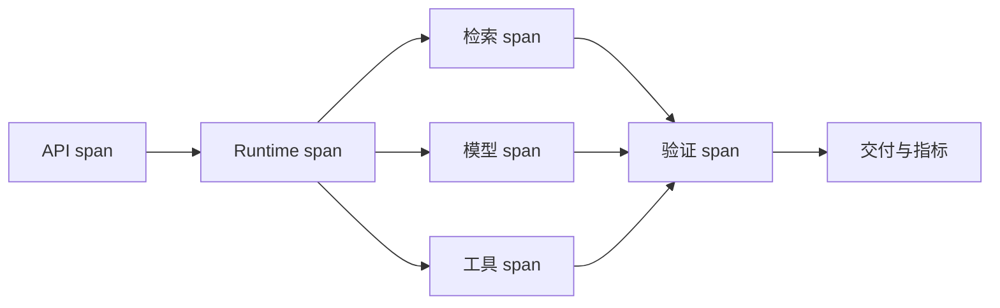

# Trace 怎样串起模型、检索、工具与验证

设计跨节点 Trace、Metric 和 Log，区分延迟、错误、质量、成本和资源问题。

**Trace**、**Observability**、**Metrics** 分别指向同一条执行链上的不同对象：业务 SLO、风险等级、流量、模型能力、数据规模、成本预算和发布策略进入系统，trace_id、span_id、parent、phase、release、policy、latency、tokens、candidate count、

error 和 quality signal 保存处理中间状态，最终得到可定位、可降级、可回滚的请求结果，以及容量、质量和成本证据。
Trace 不是一条把所有日志串在一起的字符串。它把 API、规划、检索、模型、工具、验证和交付连接成一棵有父子关系的 Span 树，每段记录输入摘要、版本、耗时、状态和错误类；指标按阶段聚合，日志保留定位所需的细节。这样才能回答“慢在检索还是模型”“失败发生在调用前还是回执后”。

::: info 贯穿示例

Trace 场景：知识助手流量升高，同时向量服务变慢和模型限流，系统需要保住已有会话并给出可解释降级。Trace 需要的身份、权限、版本和业务事实由应用提供，模型与外部内容只产生候选。

:::

## Trace 怎样沿调用链传播

只记录总耗时会破坏 trace_id 与可定位之间的对应关系，排查时先保留原始输入摘要和发生阶段，再判断是否允许重试。

日志含私有 Prompt 影响 span_id 或下游解释，不能和只记录总耗时共用“重新调用一次模型”的处理方式。
## Trace、Metric 与 Log 的职责边界

Trace 的入口负责协议和身份，Runtime 负责控制状态，能力服务负责模型、检索或工具适配。因此 trace_id 与 span_id 要有唯一写入方，其他组件只能通过版本化命令申请修改。

Log 与 Trace 解决的问题相邻，但控制权不同，比较时要看谁选择调用能力服务、谁保存 trace_id、谁确认可定位。

Metric 可以参与同一请求，却不能替代 Trace；组合后仍要单独检查风险等级的可信来源和只记录总耗时的终止规则。

Trace 使用的身份、范围和版本来自可信运行时，业务 SLO 可以表达意图，但不能提升权限或改写活动 Release。

日志含私有 Prompt 发生时，错误回到 span_id 的所有者处理，上游缺输入、当前组件违反不变量和下游不可用分别形成不同终态。

Trace 的确定性边界位于 trace_id 写入之前。模型在 Trace 中只提交候选值，程序仍要从认证、版本和策略快照补入可信字段。

Trace 内部可以使用更细的临时对象，跨边界只暴露稳定协议。替换 Log 时，调用方不需要理解内部缓存和 SDK 响应。
## 组件职责、状态和数据归属

Trace 的输入合同至少列出业务 SLO、风险等级和流量，每项都注明来源、是否必需、允许的缺省值，以及缺失后是在入口拒绝还是进入降级路径。

Trace 设计要把 `trace_id`、`span_id`、父子关系和版本标签分开。Trace 负责一次请求的边界，Span 负责一个阶段的耗时与错误，父子关系还原调用顺序；把它们写成一条日志，查询、工具和验证就无法分层比较。

并发分支按稳定身份合并 parent，完成顺序只反映耗时，不能决定结果属于哪个请求，更不能让迟到的旧状态覆盖新修订。

Trace 的对外结果要分别表达可交付内容、缺口、取消和未知状态，调用方不必解析错误文案。

span_id 参与乐观并发检查；处理开始后若版本变化，旧候选只保留作审计，不能继续写入 trace_id。

跨层 Trace、阶段耗时、错误类型、质量信号、资源用量和发布版本组成 Trace 的最小追踪材料，日志只保存稳定 ID、版本和错误类，完整 Prompt、文档正文与凭证不进入指标标签。

契约还需要描述新鲜度。span_id 对应的数据发生变化后，旧缓存、旧候选和未完成任务怎样失效，应由版本或时间规则直接判断，不能依赖模型注意到矛盾。

删除和撤回也属于数据生命周期。Trace 引用的原始对象被移除时，稳定 ID 可以保留审计关系，正文与派生结果则按策略失效，避免继续向用户展示过期内容。

::: warning Trace 的可信边界

可定位通过结构校验后仍是候选。Trace 使用的身份、权限、知识版本与业务事实由应用从可信服务读取，核对完成后才能执行或交付。

:::
## 调用链、Deadline 与失败传播

Trace 时，至少回放一次从入口到交付的调用树：每个 Span 带版本、耗时、状态和错误类，聚合指标与单次日志通过同一 ID 关联。缺少某个子 Span 时，报告应明确断点，而不是用总耗时推测内部发生了什么。

入口准入接收业务 SLO 并建立 trace_id，入口校验未通过就地结束，后续模型、检索器或工具调用次数保持为零。

调用能力服务读取 span_id 并执行主题逻辑，参数由应用组装，外部返回先保存为可降级，尚未获得修改领域状态的资格。

汇总观测检查结构、范围、版本和主题不变量；可定位缺少来源、落在旧版本或越过权限时，trace_id 停在 rejected 或 failed。

实现可以使用函数、Graph、Middleware 或 Workflow，trace_id 的所有权和只记录总耗时的停止规则不会随框架改变。

部分成功需要在步骤边界处理。
## 沿一次过载请求推演

沿“Trace 场景：知识助手流量升高，同时向量服务变慢和模型限流，系统需要保住已有会话并给出可解释降级”推演 Trace：入口创建 request_id，读取可信身份，把业务 SLO 和当前版本写入初始状态。

入口准入生成 trace_id 与输入摘要；若风险等级缺失，请求返回 rejected，并指出缺少哪项材料，不继续消耗模型或外部服务配额。

调用能力服务按“一个 Trace 串联 API、规划、检索、模型、工具、验证和交付，每段 Span 记录输入摘要、版本、耗时、状态和错误类；指标按层聚合，日志保留定位细节”推进，每次依赖调用保存 call_id、参数摘要、开始时间与状态版本，以便判断超时前是否已经产生结果。

降级或交付写入终态；客户端断开只影响交付通道，重新连接时读取已经保存的 trace_id 或事件游标，不重跑核心逻辑。

故障注入选择异步任务丢 Trace，程序保留原候选和错误位置，只重做失败边界，不能从入口复制整个任务并产生第二份状态。

推演结束后用 request_id 关联 trace_id、可定位与终止原因，测试据此排除并发请求串线，并确认失败路径没有遗留未关闭资源。

Trace 在输入拒绝时不调用依赖，正常路径按 5 个阶段推进，有限修复只重做失败边界。调用次数是控制流断言，不是性能宣传。

Trace 的最终记录用 request_id 关联 trace_id、可定位和失败问题，测试据此证明结果来自本次执行，没有混入并发请求。
## 正常服务的观测证据

Trace 正常完成时，trace_id、span_id 和可定位指向同一次执行，重复读取返回同一终态，未完成分支已经取消或有明确所有者。

跨层 Trace、阶段耗时、错误类型、质量信号、资源用量和发布版本用于还原 Trace 的处理过程，可以按阶段和版本聚合；敏感正文留在受控存储中，不复制到日志与指标。

依赖返回成功状态只证明传输完成。Trace 还要检查可定位是否满足业务范围、质量阈值和当前版本，明确拒绝也可能是正确终态。

trace_id 的状态迁移必须单调：完成不能退回运行中，取消不能被迟到结果覆盖，失败重试也不能绕过入口已经固定的权限。

Trace 的成功证据最终要同时回答输入是什么、执行了哪些步骤、交付了什么以及为什么停止；任一项缺失都应留在未确认状态。

Trace 把业务验收与服务健康分开。依赖对 Trace 返回 200 只说明传输完成，内容仍要满足当前范围和质量条件。

Trace 的观测指标按阶段和版本聚合。评估 Trace 时，把错误、空结果、拒绝、恢复和资源消耗分开统计，避免一个成功率掩盖不同故障。
## 降级、隔离与恢复

Trace 的故障分析要把模型延迟、检索空结果、工具拒绝和答案验证失败分开统计。前两类可能需要降级，工具拒绝需要检查权限，验证失败则阻断交付；统一重试只会放大成本并丢失责任层。

遇到只记录总耗时时，先记录发生阶段、错误类别和责任对象。Trace 保留输入摘要和状态版本，由对应组件决定重试、降级或终止。

遇到日志含私有 Prompt 时，先记录发生阶段、错误类别和责任对象。Trace 保留输入摘要和状态版本，由对应组件决定重试、降级或终止。

遇到异步任务丢 Trace 时，先记录发生阶段、错误类别和责任对象。Trace 保留输入摘要和状态版本，由对应组件决定重试、降级或终止。

Trace 发现重试覆盖首次错误后重新读取权威状态，旧候选可以保留作审计，却不能覆盖新版本；前后状态无法兼容时，当前尝试以 conflict 结束。

遇到平均值掩盖长尾时，先记录发生阶段、错误类别和责任对象。Trace 保留输入摘要和状态版本，由对应组件决定重试、降级或终止。

Trace 发现指标无法关联版本后重新读取权威状态，旧候选可以保留作审计，却不能覆盖新版本；前后状态无法兼容时，当前尝试以 conflict 结束。

Trace 将终态、可重试性和资源清理结果写入记录；后台扫描器根据 trace_id 判断任务是在运行、等待恢复还是已失败。

Trace 执行前固定 Deadline、动作上限、重复签名、无进展阈值、预算和取消信号；任一条件触发，调用能力服务停止创建新工作。

Trace 把重试时间和次数计入总预算。Trace 每次重试先扣减剩余额度，达到上限就保留原始错误。

Trace 的清理动作设计成幂等操作；仍被活动任务或 Lease 引用的资源拒绝删除。
## 故障演练和发布验证

沿正常、过载、依赖失败和回滚四条路径演练，核对状态所有者、传播边界与可观测字段；测试显式给出业务 SLO、初始 trace_id、预期可定位和终止原因，不能只断言返回值非空。

Trace 的单元测试用 Fake Adapter 固定可定位与错误，断言参数、调用顺序、状态修订和清理动作，这些结果只证明本地控制逻辑。

契约测试围绕业务 SLO、trace_id 和可降级构造合法与非法样本，Schema 解析成功后继续检查权限、版本与领域不变量。

故障测试注入只记录总耗时和日志含私有 Prompt，记录调用能力服务是否被调用、trace_id 是否改变、资源是否释放，以及同一身份重试会不会重复执行。

Trace 的集成测试连接真实协议与隔离存储，检查序列化、约束、并发和超时；需要在线服务时另行记录服务版本、时间、配置与凭证条件。

Trace 的回归报告要保留失败类型分布。在 Trace 的回归中，拒绝、超时、权限错误和空结果必须保持各自类型，状态变化本身就是行为契约。

Trace 的性质测试随机改变 trace_id 顺序、重复提交、完成顺序或状态版本，断言权限不扩大、终态不倒退、同一身份不产生两次副作用。
## Trace 的目标是缩小责任范围

Trace 串起请求、模型、检索、工具和验证，Span 属性只保存稳定 ID、版本、耗时、Token 与错误类。正文、凭证和完整工具结果留在受控对象中，通过权限检查后按引用读取，避免观测系统成为新的数据副本。

故障演练要证明能从一个失败 Turn 定位到具体 Span 和原始回执，也要证明没有 Trace 权限的人看不到业务正文。能画出漂亮瀑布图却无法区分权限拒绝与空结果，观测合同仍不合格。
