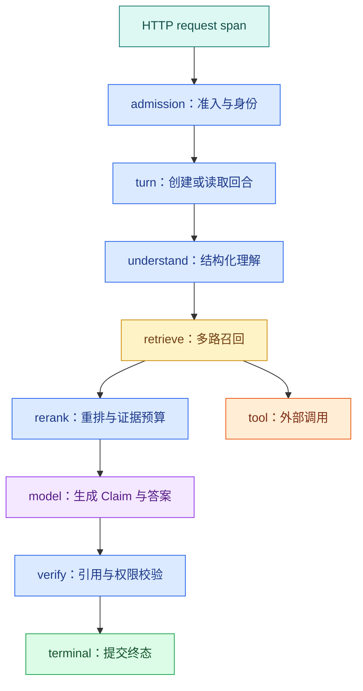

# Agent Trace：日志、指标与一次运行怎样关联

用户说“这个回答等了二十秒”，普通访问日志只告诉你接口最终返回 200。时间耗在排队、检索、重排、模型首 Token、工具重试还是引用验证，仍然不知道。

可观测性要让工程师从一次用户请求追到每个阶段，同时能从整体指标发现趋势。Trace 解释一条运行路径，**Metric** 观察大量运行的变化，Log 保存离散事件和诊断细节；三者通过稳定 ID 关联，而不是把整段用户问题塞进标签。

## 先定义四个不同的身份

长时间 Agent 往往不等于一个 HTTP 连接：

- `request_id` 标识一次网络请求，断线重连会产生新的请求；
- `conversation_id` 标识会话，可包含多个问题；
- `turn_id` 标识用户的一次目标和最终终态；
- `task_id` 标识后台执行，可因重试或恢复产生新尝试。

**Trace** 通常从请求或任务开始，但业务查询与取消应围绕 `turn_id`。如果只保存 request ID，客户端断线后就无法把重连查询与原运行关联起来。

## 一条 Agent Trace 应该长什么样



根 **Span** 记录入口和最终状态。理解、检索、重排、模型、验证各自成为子 Span；工具调用可以挂在选择它的节点下。异步 Worker 不能简单继承同一个进程上下文时，需要把 Trace Context 与业务 ID 一起放进任务消息，再在消费者端建立链接或子 Span。

## Span、Metric、Log 分别回答什么

| 信号 | 主要问题 | 示例 |
| --- | --- | --- |
| Trace | 这一次为什么慢或错 | 哪个模型调用等待 8 秒 |
| Metric | 系统整体是否恶化 | P95 TTFT、超时率、队列年龄 |
| **Log** | 某个状态发生了什么 | 工具参数校验失败类型 |

不要把三者做成三份互不相干的数据。Metric 告警指出某版本超时率上升，工程师从 Exemplars 或时间窗口找到 Trace，再通过 `turn_id` 查对应结构化日志。

## 每个 Span 记录哪些字段

通用字段包括组件、操作、开始结束、状态、错误类型、版本和关联 ID。不同阶段还需要自己的低敏感摘要：

| 阶段 | 推荐属性 | 不宜记录 |
| --- | --- | --- |
| 理解 | intent、是否澄清、模型版本 | 完整用户问题 |
| 检索 | 通道、候选数、过滤数、知识版本 | 片段正文 |
| 工具 | 工具名、契约版本、终态、返回条数 | Token、Cookie、完整参数 |
| 模型 | provider、model、Token、结束原因 | 完整 Prompt 与响应 |
| 验证 | Claim 数、无证据数、修复次数 | 敏感 Claim 原文 |

对问题和证据做哈希不等于绝对匿名：低熵值仍可能被猜出。诊断确实需要原文时，应使用受控采样、独立加密存储、严格权限与保留期限，而不是 Metric 标签。

## 为什么高基数标签会拖垮指标系统

`model_id`、`status` 和受控的 `error_type` 值有限，适合 Metric 标签。`user_id`、`turn_id`、URL、问题文本和任意工具错误每次都可能不同，属于**高基数**数据。

高基数会创建大量时间序列，增加内存、存储和查询成本。业务 ID 放进 Trace 或日志字段，需要聚合的维度才放 Metric 标签。租户级指标也要评估数量和隐私，不能默认把每个租户变成标签。

## 为检索阶段建立 OpenTelemetry Span

下面的最小操作需要安装 `opentelemetry-api` 与 `opentelemetry-sdk`。输入是一条已经脱敏的检索命令和 Retriever，输出是一个 `agent.retrieve` Span；Span 只记录通道、候选数、Release 和稳定错误类型，不记录问题或正文。

```bash
# 安装 API、SDK 与控制台导出器，示例会把 Span 层级和属性打印到本地终端。
uv add opentelemetry-api opentelemetry-sdk
```

这条命令把 OpenTelemetry API 与 SDK 加入当前项目。API 提供业务埋点接口，SDK 负责采样、处理和导出；生产环境通常再安装 OTLP Exporter，把 Span 发给 Collector。安装完成后再运行下方脚本，结束实验时用项目依赖管理命令移除不需要的包。

```python
# 父 Span 表示 Turn 阶段，检索子 Span 记录通道、候选数、终态和异常类型，不记录正文。
from __future__ import annotations

from dataclasses import dataclass
from typing import Protocol

from opentelemetry import trace
from opentelemetry.sdk.trace import TracerProvider
from opentelemetry.sdk.trace.export import ConsoleSpanExporter, SimpleSpanProcessor
from opentelemetry.trace import Status, StatusCode


provider = TracerProvider()
provider.add_span_processor(SimpleSpanProcessor(ConsoleSpanExporter()))
trace.set_tracer_provider(provider)
tracer = trace.get_tracer("knowledge-agent")


@dataclass(frozen=True)
class SearchCommand:
    channel: str
    release_id: str
    limit: int


class Retriever(Protocol):
    # 查询函数只接收业务查询参数；可信 Scope、版本和上限由调用侧一并传入。
    def search(self, command: SearchCommand) -> list[str]: ...


def traced_search(retriever: Retriever, command: SearchCommand) -> list[str]:
    with tracer.start_as_current_span("agent.retrieve") as span:
        span.set_attribute("agent.retrieval.channel", command.channel)
        span.set_attribute("agent.knowledge.release", command.release_id)
        span.set_attribute("agent.retrieval.limit", command.limit)
        # 从这里进入可能失败的外部边界，下面只转换已经明确分类的异常。
        try:
            result_ids = retriever.search(command)
        # 超时表示依赖没有在预算内返回；保留超时语义，不能伪装成空结果。
        except TimeoutError as error:
            span.record_exception(error)
            span.set_attribute("agent.error.type", "deadline_exceeded")
            span.set_status(Status(StatusCode.ERROR, "retrieval timeout"))
            raise
        span.set_attribute("agent.retrieval.candidate_count", len(result_ids))
        span.set_status(Status(StatusCode.OK))
        return result_ids
```

初始化部分在示例中使用 `ConsoleSpanExporter`，运行会把 Span JSON 输出到终端，便于观察；生产服务只初始化一次 Provider，并通过 Collector 导出，不能在每个请求里重建。`SearchCommand` 不含原始 query，是为了展示安全属性最小集，真实 Retriever 仍会在受控参数中收到查询。

`traced_search` 以检索阶段为 Span 边界。正常路径记录候选数量并返回 ID；超时路径记录异常、稳定错误枚举和 ERROR 状态后原样抛出。调用方仍负责把异常转换成 Agent 终态，Tracing 不能吞错误或改变业务状态。

`turn_id` 和 `task_id` 可作为 Span 属性用于单次定位，但它们属于高基数，不进入 Metric label。若隐私策略不允许直接记录，可使用受控关联表或短期标识。问题正文、Evidence 文本、访问令牌和任意工具返回不出现在 Span。

### 怎样验证埋点不是“写了但没用”

准备一个返回两个 ID 的 Fake Retriever 和一个抛 `TimeoutError` 的 Fake。运行正常分支时，Console 输出应包含 `agent.retrieval.candidate_count=2` 和 OK；失败分支应包含 `agent.error.type=deadline_exceeded` 和异常事件，同时调用仍会向上抛出超时。

自动测试可以使用 OpenTelemetry SDK 的内存 Span Exporter 收集结束 Span，断言属性与状态；集成环境则从 Collector 查询 Trace。测试重点不是整段 JSON 快照，而是名称、稳定属性、父子关系、错误状态和敏感字段不存在。

### 异步边界怎样传递上下文

HTTP 到同进程协程通常由 OpenTelemetry Context 自动传播；进入 Celery 或其他 Broker 时，要把标准 W3C Trace Context 注入消息 header。Worker 提取后创建新的消费/执行 Span，同时把 `turn_id` 作为业务关联。

重试 attempt 应是不同 Span；跨很久的恢复可以用 Span Link 指向原执行，而不是维持一个数小时不结束的 Span。消息 header 是传输元数据，不要把完整 Prompt 放进去。

## AI 服务需要观察哪几类指标

### 可用性

按终态统计 completed、insufficient、denied、cancelled、failed 和 deadline_exceeded。HTTP 200 不代表业务完成，SSE 连接成功也不代表最终回答可用。

### 延迟

区分排队时间、首事件、首 Token（TTFT）、总时长、检索、模型和工具耗时。总耗时增加时，分阶段指标能缩小范围。

### 质量

线上无法获得每次人工答案，但可以观察无证据率、引用验证失败、有限修复、用户明确反馈和抽样 Eval。质量指标需要版本与任务类型上下文，不能把一个点赞数当真值。

### 成本与资源

记录输入/输出 Token、模型与工具调用次数、Embedding 批量、队列年龄、Worker 并发和 GPU 指标。费用是业务换算，Token 与调用次数是更稳定的工程事实。

## 慢请求怎样沿 Trace 排查

假设总耗时 20 秒：

1. 根 Span 显示排队 1 秒、执行 19 秒；
2. 检索 400 毫秒，重排 300 毫秒；
3. 第一次模型调用 3 秒；
4. 一个工具调用 10 秒后超时；
5. Runtime 又使用完整 10 秒重试；
6. 最终验证在 Deadline 后才发现超时。

根因不是“模型慢”，而是工具重试重置了预算。Trace 提供单次证据，Metric 再回答这种模式是否普遍。修复后应该看到工具次数、超时 Span 和总时长同时变化。

## 错误分类比错误字符串重要

数据库和 SDK 错误字符串会随版本变化，也可能含敏感参数。适配器应映射为稳定错误枚举，例如：

```text
invalid_arguments
permission_denied
deadline_exceeded
cancelled
dependency_unavailable
contract_violation
insufficient_evidence
verification_failed
```

Span 状态用于表示技术调用是否成功，业务终态另用字段表示。检索成功返回空数组时，Span 可以是 OK，回合终态可能是 `insufficient`；把它记为数据库错误会造成错误告警。

## 异步任务和重试怎样保持关联

API 创建 Turn 后把任务交给 Worker。任务消息应携带标准 Trace Context、`turn_id`、`task_id`、尝试次数和绝对 Deadline。Worker 领取后创建执行 Span，记录队列等待时间与任务所有权。

重试是新的尝试 Span，不覆盖原 Span；恢复任务可以与原 Trace 建立 Link。这样既能看到一条逻辑 Turn 的完整历史，也不会假装两个不同进程共享连续调用栈。

失去 Lease、取消或 Deadline 到达后，Worker 要停止继续写事件。Trace 记录停止原因，但业务状态仍由数据库的条件更新保证单一终态。

## 告警怎样避免只有噪声

一个可行动告警要包含窗口、指标、阈值来源、影响范围和排查入口。例如“某模型版本的 deadline_exceeded 比稳定基线上升，并且工具超时占主要比例”，比“接口有错误”更可操作。

AI SLO 通常至少覆盖可用性、延迟、质量和成本。质量信号比 HTTP 状态更慢、更不完整，可以通过离线 Eval、在线验证失败和用户反馈组合，而不是承诺一个无法实时测量的绝对正确率。

## 带到工作的观测字典

```text
业务身份：conversation_id / turn_id / task_id 怎样关联
根 Span：从哪里开始，到哪个终态结束
节点 Span：理解 / 检索 / 工具 / 模型 / 验证
版本属性：Runtime / Prompt / 模型 / 知识 / 检索策略
稳定错误枚举：
可用性指标与业务终态：
TTFT、TPOT、队列、总时长的定义：
质量代理指标与离线 Eval 关联：
Token、工具调用和资源成本字段：
禁止进入标签或普通日志的内容：
采样、保留和访问控制：
告警触发后如何找到代表 Trace：
```

Trace 中的时间、调用次数和终态可以继续形成请求预算、容量判断和可靠性门禁，但业务状态仍由数据库与 Runtime 决定，观测系统不承担状态真相。

## 常见问题

### Log、Metric 和 Trace 各自解决什么问题？

Log 记录离散事件和错误细节，适合查看某次失败原因；Metric 聚合有限维度的计数、比例和分位数，适合告警与趋势；Trace 用父子 Span 还原一次 Turn 跨 API、队列、检索、工具和模型的时序。三者通过 turnId、traceId 和稳定错误码关联，而不是互相替代。只有日志很难看全链延迟，只有指标无法定位单请求，只有 Trace 又不适合保存全部业务细节。

### Conversation ID、Turn ID、Task ID 和 Trace ID 为什么不能只用一个？

Conversation 表示长期对话，Turn 表示一次业务问答，Task 表示某个异步执行或 attempt，Trace 表示一次可观测调用树。一个 Turn 可能因恢复拥有多个 Task 或 Trace Link，一个 Conversation 包含多个 Turn。混用会让重试覆盖原轨迹、事件重放串到其他回合。日志中保存关联关系，数据库对象使用业务 ID，观测后端使用 Trace Context，各自生命周期清晰才能正确排障。

### 为什么不能把 query、userId 和文档标题都作为 Metric 标签？

这些字段取值数量巨大，会制造高基数时间序列，显著增加 Prometheus 等系统的内存与查询成本，还可能泄露隐私。Metric 标签应使用有限枚举，如模型版本、通道、终态和错误类型；用户与查询通过脱敏日志或 Trace 属性在受控采样中查看。需要按租户分析时也应使用有限分组或离线聚合，不能把每个业务 ID 直接变成标签。

### 异步队列如何保持同一条 Trace？

API 派发任务时把标准 Trace Context 与 turn/task ID 写入消息；Worker 提取后创建消费与执行 Span，并记录队列等待和 owner attempt。重试是新的尝试 Span，恢复可用 Link 关联原 Trace，而不是伪造一个跨进程连续调用栈。消息上下文要校验并限制大小，业务最终状态仍由数据库条件更新保证。若 Trace 断了，也不能影响任务正确性，只会降低可观察性。

### Agent 的“质量”怎样进入观测系统？

实时可观察的代理信号包括无证据终态、引用验证失败、补搜次数、用户反馈和安全阻断；更可靠的质量来自离线 Eval。将 Eval runId 与线上版本、Trace 样本关联，按查询类型观察退化。不要承诺一个无法实时测量的绝对正确率，也不要把模型自信当质量。质量 SLO 常比可用性信号更慢，应结合抽样人工复核和发布门禁。

### Trace 里应该记录完整 Prompt 和模型输出吗？

默认不应该。完整内容可能含隐私、密钥、系统规则和受限文档，也会造成巨大存储。记录模型、提示版本、输入输出 Token、结果 hash、终态、Evidence ID 和错误枚举通常足以定位；需要内容排障时使用受控采样、脱敏、加密和短保留期，并限制访问。Trace 的目标是解释执行链和版本，不是建立第二份对话数据库。

### 一个慢请求应该按什么顺序排查？

从根 Span 看总时长，再拆队列等待、准入、检索各通道、Rerank、模型 TTFT/TPOT、验证和事件发送。检查是否因 Deadline 重试、连接池等待、慢消费者或降级导致；对比同版本正常 Trace 与分位数，而不是只看一条日志。若业务终态已完成但用户晚看到，问题在事件与代理；若队列时间占主导，优先查容量，而不是更换模型。
