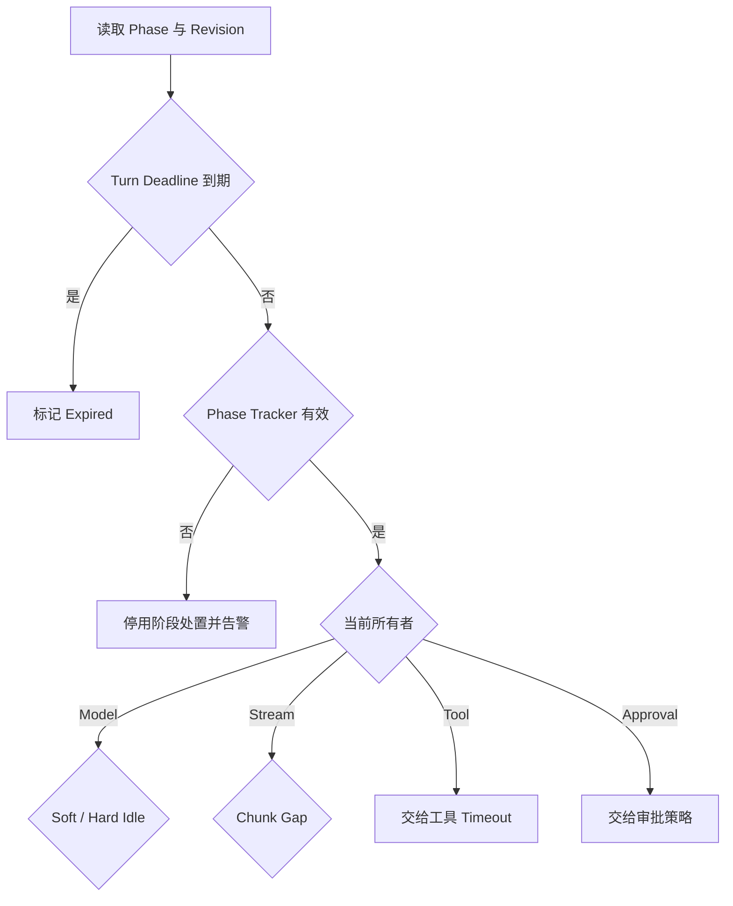

# Watchdog 怎样识别阶段超时

“Agent 已经 90 秒没有输出”不是一个足够精确的故障描述。它可能正在等待模型首个 Token，可能在执行一个仍有心跳的长工具，也可能停在人工审批页面。三个场景看起来都很安静，负责限制等待的组件却完全不同。

**Watchdog** 观察运行中的进展，在符合条件时告警、探测或停止任务。它不能只拿“现在减去最后活动时间”与一个常量比较。要判断沉默是否异常，Watchdog 必须知道当前阶段、等待对象、该对象最后一次有效进展，以及这段等待由谁负责。

::: info Watchdog 不替代 Deadline

- **Deadline** 限制整条 Turn 的总时长，到点后无条件停止新工作。
- **Watchdog** 识别某个阶段在 Deadline 之前已经失去进展。
- **工具 Timeout**、**审批超时**和**流间隙超时**由各自所有者执行。

:::

本篇用两个对照场景说明问题。图像工具渲染八分钟但持续上报进度，属于慢而正常；模型流输出半句话后连接沉默，既没有新字节，也没有结束事件，属于需要传输层处置的空闲。给它们共用一个总计时器，阈值无论设短还是设长，都会误杀一类任务。

## 阶段超时会表现出哪些现象

Watchdog 故障通常不是“计时器没有触发”这么单一。用户、运维和代码会看到不同现象，先把它们放在同一条时间线上，才知道该查哪一层。

**运行很慢但最终成功**时，先看这段等待是否在配置范围内，以及是否持续产生阶段 Progress。合法长工具不该因为没有模型 Token 被告警；若每次都接近工具上限，问题可能是容量或工具实现，不是 Watchdog。

**任务突然被取消**时，检查终态原因是 User Cancel、Turn Deadline、Model Hard Idle、Stream Gap 还是 Tool Timeout。只看通用 `CancelledError` 无法判断误杀。误杀常伴随 Phase 错误、Tracker Restore 遗漏或两个计时器同时拥有一段等待。

**界面一直转圈却没有终态**时，查看 Worker Lease 是否有效、Event Sequence 是否继续、Provider Request 是否仍存在，以及 Watchdog Decision 是否被写出。没有终态可能是取消信号没有传播，也可能是终态提交失败，不能直接再启动一份 Run。

**Soft 告警持续刷屏**时，检查去重键是否包含 Phase Revision，Revision 是否在每次轮询被错误增加。正确行为是同一阶段实例报告一次，新模型 Attempt 才生成新的告警。

**模型已经卡住但没有告警**时，检查 Phase 是否错误标成 Compaction 或 Tool，流适配器是否把心跳当作有效 Chunk，以及 Tracker 是否因结构违规被停用。阈值调小无法修复错误所有权。

**工具仍在进展却被模型 Watchdog 杀掉**时，核对最后一次 Phase 迁移、Tool Call ID 和模型时钟。工具 Heartbeat 应由 Tool Policy 消费，不应更新或触发 Model Idle。

**恢复任务反复排队**时，检查扫描器是否忽略活动执行 Lease，任务 Deadline 是否已过，以及 Task ID 是否稳定。重复恢复常来自“看到 updated_at 旧就直接投递”，而不是细粒度 Watchdog 判断。

这些现象先帮助确定责任层：用户界面负责展示状态，Runtime 负责 Phase 和终态，模型 Transport 负责 Chunk Gap，工具适配器负责工具进展，Recovery Scanner 负责失联所有权。每一层都有独立证据，不靠一个“最后活跃时间”包办。

## Watchdog 先建立阶段模型

Runtime 显式记录 Turn Phase，不能从最近一条日志或最后触碰的计时器反推状态。Phase 是控制状态的一部分，每次迁移带单调递增的 `phase_revision`、进入时间和所有者。

一条知识 Agent 执行可以有这些阶段：

| Phase | 当前在等什么 | Watchdog 所有者 | 是否计模型空闲 |
| --- | --- | --- | --- |
| `init` | 本地状态装配 | Runtime | 否 |
| `awaiting_model` | 模型首包或完整响应 | Model Watchdog | 是 |
| `retrying_model` | 退避与重试策略 | Retry Policy | 否 |
| `compacting` | 本地上下文压缩 | Context Manager | 否 |
| `awaiting_approval` | 人工决策 | Approval Policy | 否 |
| `executing_tool` | 工具结果或心跳 | Tool Adapter | 否 |
| `streaming_model` | 下一个数据块 | Model Transport | 使用流间隙时钟 |
| `force_stop` | 最终停止摘要的模型响应 | Model Watchdog | 是 |
| `done` | 无等待 | Runtime | 否 |

同一时间只能有一个阶段所有者。模型 Watchdog 不应该因为工具安静而取消工具；工具适配器也不能用自己的心跳延长模型流间隙。若一段等待没有所有者，增加一个全局计时器只是掩盖职责缺口；若有两个所有者，两边会用不同原因同时取消。

Phase 名称还不够。Run 第一次进入 `awaiting_model`，发生重试后离开，再次进入同名阶段，这两个实例要有不同 Revision。Soft Idle 每个阶段实例只报告一次，新的模型尝试可以重新报告。只按 Phase 字符串去重，会让后续卡住的调用没有告警。

## Activity、Progress 与 Heartbeat 不是同一信号

**Activity** 表示有事件发生，例如日志、网络心跳或状态刷新。**Progress** 表示任务更接近可交付结果，例如获得新 Token、完成一个 Chunk 或推进状态修订。**Heartbeat** 只证明某个执行者仍能回应。

一个死循环可以持续写日志，Activity 很高却没有 Progress；工具可以长时间计算，只有 Heartbeat 和百分比；模型 Provider 可能发送注释心跳，但没有新 Token。Watchdog 需要按阶段定义“什么算进展”，不能让任何活动都重置所有时钟。

常见字段可以拆为：

```text
phase_started_at
phase_revision
last_activity_at
last_progress_at
last_stream_chunk_at
last_tool_heartbeat_at
state_revision
deadline_at
```

字段由对应所有者更新。模型 Transport 更新 Stream Chunk，工具适配器更新 Tool Heartbeat，状态提交更新 State Revision。普通日志不能修改 Progress 时间，否则打印循环会让卡死任务永久存活。

持久层的 `updated_at` 适合粗粒度恢复扫描，不足以判断阶段空闲。Lease 续约、事件写入和状态读取都可能刷新它，却没有业务进展。进程内 Watchdog 使用细分时钟；跨进程扫描先找长时间未更新的候选，再检查活动 Lease、Phase 和具体证据。

## Soft Idle 负责可见性

Soft Idle 表示一个受监控阶段已经超出正常等待，但还没有达到强制停止条件。它写 `watchdog.soft_idle` Event，包含 Turn ID、Phase、Phase Revision、空闲时长、当前 Provider 或 Tool Call ID，以及剩余 Deadline。

Soft Idle 不取消任务。它可以驱动 UI 显示“模型响应较慢”、触发一次低成本探测、提高 Trace 采样率或通知运维。阈值按阶段、模型、区域和模式配置，不能从某个示例数值直接复制到全部 Provider。

同一阶段实例只报告一次，避免每个扫描周期刷屏。阶段迁移或新 Revision 后重新允许报告。告警记录实际观测值，而不是只写 “Agent slow”；运维需要知道哪个等待对象、已经空闲多久、总 Deadline 还剩多少。

Soft Idle 也不能变相成为自动重试。模型可能仍在处理，立即发起第二个请求会加倍成本并产生两个并发响应。探测优先查询连接、Task、Lease 或 Provider Request 状态，只有协议明确证明原请求失败，Retry Policy 才判断是否重试。

## Hard Idle 负责停止策略

Hard Idle 表示特定阶段的空闲已经越过系统容忍上限。Watchdog 使用类型化原因触发取消，例如 `model_hard_idle`，并给终态提交和清理保留时间。用户主动取消与 Watchdog 取消都可能关闭同一个 Context，终态原因必须区分。

阈值应小于外层 Deadline，并预留取消传播、关闭流、保存部分输出和写终态的时间。Hard Idle 等于总 Deadline 时，Runtime 没有时间清理；设置得过短则误杀正常长尾。

Hard Idle 只对声明由 Model Watchdog 所有的阶段生效。`executing_tool` 即使超过模型阈值，也返回 Delegate，由工具自己的 Timeout、Heartbeat 和 Cancel 协议决定。`awaiting_approval` 由审批策略限制，可能允许数小时或跨进程恢复；模型计时器没有资格取消。



停止后保存 Phase、空闲证据、部分输出和 Cleanup Result。只返回通用 `cancelled` 会让 UI 无法解释，也让恢复器不知道应重试 Provider、等待人工，还是尊重用户取消。

## 流间隙需要传输层时钟

模型阶段 Watchdog 知道 Run 在等待模型，却未必能看见 SSE 或 Chunked Response 内部。连接可能已经收到若干 Token，随后不再产生字节，也没有关闭。传输适配器更接近 Socket，应维护 `last_stream_chunk_at`。

每个有效数据块更新流间隙时钟。达到预警阈值时记录 Stream Gap，达到上限时关闭响应体并返回类型化错误。普通日志、Provider 心跳和其他工具事件不能重置这个时钟；只有协议认定为有效的模型数据块或结束事件才算。

流间隙和整段响应 Timeout 互相补充：

- 首包 Timeout 限制连接建立后多久看到第一个有效事件。
- Chunk Gap 限制两个有效数据块之间的沉默。
- Total Response Timeout 限制整个流的最长持续时间。
- Turn Deadline 对所有阶段提供最终上限。

流超时后保留已接收文本，但标记为 Partial 和 Unvalidated。若一个 Token 都没有，结果明确记录 Empty Partial。是否交付由质量策略决定，不能把半段回答包装成 Completed。自动切到非流式重试也要谨慎，原 Provider 可能再次卡住，成本和延迟会重复。

传输取消后仍可能有迟到 Chunk。适配器用 Attempt ID 和 Turn Status 过滤，旧流不能写进新 Attempt 或覆盖终态。关闭连接失败进入 Cleanup Error，主要停止原因仍是 Stream Gap。

## 嵌套调用临时借用阶段所有权

`compacting` 通常是本地阶段，不计模型空闲。但上下文压缩内部可能调用模型生成摘要。这段远端等待需要模型 Watchdog 保护，完成后又要回到 Compaction 所有者。

阶段跟踪器提供 `enter_transient("awaiting_model")`，返回恢复 Token。进入时保存外层 Phase 和 Revision，退出时幂等恢复。业务代码不用手工暂停和重启多个计时器，阶段所有权本身决定启用哪只 Watchdog。

嵌套规则需要明确：一个临时阶段未结束时，不允许再进入新的顶层 Phase；恢复 Token 只能对应当前嵌套实例；重复 Restore 是 No-op；使用错误 Token 会让 Tracker 失效。测试与开发环境可以直接抛错，生产环境记录结构性告警并停止阶段处置。

为什么 Tracker 失效时不直接取消？因为坏状态已经无法证明 Run 在等待模型，还是正在执行合法工具。继续根据它杀任务，可能中断昂贵或有副作用的工作。停用 Watchdog 会放过一次真实卡死，代价是故障持续到 Turn Deadline；另一种代价是错误取消。系统选择哪边必须显式记录。

::: warning 不可信阶段不能驱动自信处置

Tracker 失效后，Turn Deadline、用户取消和工具自身限制仍然有效。被停用的只是依赖错误 Phase 的阶段 Watchdog，告警应带 Tracker Revision 和违规类型。

:::

## Watchdog 先探测再接管

跨进程恢复扫描看到 Turn 很久未更新时，不能立即投递第二个 Worker。原 Worker 可能仍有有效执行 Lease，只是阶段事件写入变慢。扫描器先原子领取候选，再查询 Execution Lease 与 Worker Probe。

有效 Lease 表示当前所有者仍有提交资格。Watchdog 可以通知它自检，不能并行启动新所有者。Lease 已失效时，恢复器使用新的 Owner Token 领取，旧 Worker 的 Fencing Token 随即失效。新 Worker 读取 Checkpoint 和原 Deadline，通过恢复门禁后继续。

Probe 自身有短 Timeout 和并发上限。探测器卡住不能阻塞整个扫描批次，失败只形成 Unknown，不立即证明 Worker 已死。连续多次 Probe 失败、Lease 过期且状态无更新，才满足接管条件。

数据库候选扫描用 Status、Deadline 和更新时间缩小范围，通过行锁与 `SKIP LOCKED` 让多个扫描器分工。读取候选后再次检查 Deadline，过期任务进入 Expired，不进入恢复队列。任务 ID 稳定，重复扫描不会创建两个逻辑执行。

进程内 Stage Watchdog 与跨进程 Recovery Scanner 是两层机制。前者拥有细粒度 Phase 时钟，可以取消卡住的模型流；后者在进程可能已经消失时，根据持久状态和 Lease 重新建立所有权。把两者合并成一个 `updated_at` 查询，会失去阶段语义。

## 探测动作按风险逐级升级

Soft Idle 之后可以执行多种 Probe，但顺序应从只读、低成本开始。第一层读取本地阶段快照和 Task 状态；第二层检查连接、Provider Request 或工具 Job；第三层才发送取消或取得新执行权。探测不能产生业务副作用。

本地 Probe 返回 Phase、Revision、当前 Awaitable、子任务数量、最后 Progress 和取消状态。它不遍历或序列化完整 Prompt，避免诊断本身阻塞事件循环。响应带 Owner Token，扫描器确认它仍对应当前 Lease。

远端 Probe 优先查询已有 Request ID。Provider 或工具返回 Running 时，Watchdog 比较它自己的更新时间和阶段策略；返回 Completed 时，原 Worker 可能卡在消费结果，Runtime 可以唤醒或对账；返回 Not Found 说明请求未建立或记录过期，Retry Policy 再决定下一步。

Probe Unknown 不能直接等价于 Dead。网络分区时，扫描器可能访问不到 Worker，Worker 却仍能访问数据库和工具。接管前必须等待 Lease 失效并使用 Fencing Token。否则分区恢复后会有两个写者。

Hard Action 分为关闭传输、请求取消、终止子进程和接管 Turn。每种动作只对自己的所有者生效。Stream Gap 关闭响应体，不终止正在执行的其他工具；Tool Timeout 取消对应 Job，不删除整个 Conversation；Turn Deadline 才阻止所有新工作。

处置结果也要回写。命令已发送、对方已确认、资源已释放和终态已提交是四个不同状态。扫描器不能因为 Cancel API 返回 202 就认为任务已经结束，下一轮仍要读取权威 Turn Status 和 Lease。

为避免告警风暴，Probe 按 Provider、Worker 和租户设置并发限制。上游大面积故障时，采样少量详细探测，其余任务使用相同故障归因和既定降级策略。没有容量限制的 Watchdog 会在故障时把依赖再压一遍。

Watchdog 自己也会失败。阶段快照读取超时、Probe 服务不可用或指标存储延迟时，Decision 标记为 `watchdog_unknown`，保留原 Turn 所有者，不自动升级成 Hard Cancel。连续 Unknown 触发独立基础设施告警，仍由 Turn Deadline 提供最终上限。

扫描批次记录开始游标、候选数量、每个 Probe 的结果和未处理剩余量。进程在批次中途退出后可以重新扫描，候选领取使用幂等身份。不能在读取失败时把整批任务统一标成 Stalled，这会把观测系统故障转化为业务中断。

Probe 返回的数据也需要新鲜度。响应带采样时间、Phase Revision 和 Owner Token；采样晚于当前状态或 Token 已更换时只作历史证据。处置命令再次读取权威 Revision，避免根据几秒前的正常快照取消已经完成的 Turn。

若 Watchdog 的时钟来源异常，单次负空闲或突然跳大的空闲都不直接触发取消。进程内持续时间用单调时钟，持久扫描使用 UTC 并监控时钟偏移。时钟健康恢复前，系统可以继续 Deadline 的数据库判断，但关闭依赖本地异常时钟的阶段动作。

## 用阶段感知示例观察处置

下面的示例实现阶段 Watchdog 和最小 Phase Tracker。它使用数值时间，不调用真实模型或工具，只验证所有权、Soft/Hard、流间隙、嵌套阶段与 Tracker 失效。

<<< ../../examples/ai-agent/watchdog.py

`StageWatchdog.evaluate()` 先检查 Turn Deadline，再检查 Tracker 是否有效。`streaming_model` 使用最后数据块时间，`awaiting_model` 与 `force_stop` 使用模型空闲时钟，其他阶段返回 Delegate。

Soft Alert 按 `(turn_id, phase_revision)` 去重，Hard Idle 不受去重影响。即使 Soft 已报告，阶段继续沉默到 Hard 阈值仍会取消。新 Revision 可以再产生一条 Soft，表示新的模型尝试也出现长尾。

`PhaseTracker` 在本地压缩期间临时进入模型等待，恢复后回到原 Phase。重叠临时阶段会把 Tracker 标为 Invalid，Watchdog 随后返回 `watchdog_disabled`，而不是根据错误阶段杀任务。

示例保留了旧的 `watchdog_decision()` 外观，只为共享测试兼容。正式文章和新增测试使用 Stage Watchdog；重复动作与状态无变化属于下一篇“卡循环检测”，不能用时间空闲替代。

## 沿两条时间线定位责任层

第一条时间线中，Tool `render:1` 进入 Executing Tool。八分钟里每十秒更新 Tool Heartbeat，Progress 从 30% 到 80%。模型 Watchdog 每次读取 Phase 都返回 Delegate。工具自己的十分钟 Timeout 和 Turn Deadline 负责停止条件，因此它不会被模型 Hard Idle 误杀。

第二条时间线中，Attempt `model:2` 进入 Streaming Model。T0 收到首个 Chunk，T4 收到第二个，之后连接没有数据。普通 Worker Heartbeat 仍在续约，Turn `updated_at` 也可能因为日志刷新而变化。Stream Watchdog 只看 `last_stream_chunk_at=T4`，到达 Gap 上限后关闭响应体，保留两个 Chunk 为 Partial，并写 `model_stream_gap`。

| 证据 | 长工具 | 卡住的模型流 |
| --- | --- | --- |
| Phase | Executing Tool | Streaming Model |
| 阶段所有者 | Tool Adapter | Model Transport |
| 有效进展 | Tool Progress 与 Heartbeat | Model Chunk |
| Worker Lease | 有效 | 有效 |
| 处置 | 继续，受工具 Timeout 限制 | Stream Cancel |
| 输出 | 工具完成后进入下一阶段 | Partial，等待质量策略 |

如果只看 Worker Lease，两条都像“活着”；只看墙上时间，两条都像“太慢”；只看普通 Activity，两条都持续有事件。Phase 与所有者把相同表象拆成不同责任层。

## 诊断从阶段时间线开始

出现误杀或漏杀时，先固定 Turn ID、Attempt ID、Phase Revision、Deadline、最后 Activity、最后 Progress、最后 Chunk、Tool Heartbeat、Lease Owner 与 Watchdog Decision。不要先调大阈值，阈值可能只是在遮住错误所有权。

**合法长工具被取消**时，检查 Phase 是否错误停在 Awaiting Model，临时阶段 Restore 是否遗漏，以及工具事件是否错误更新模型时钟。修复 Phase 迁移，再用同一工具时长回归。

**模型流卡住却不取消**时，检查 Transport 是否把日志或心跳当成 Chunk，Chunk Gap 是否启用，迟到事件是否使用了错误 Attempt ID。抓取时间线比只看最终 Timeout 更有效。

**嵌套摘要调用不可见**时，检查 Compaction 内模型调用是否进入 Transient Phase，以及异常路径是否 Restore。正常情况下本地压缩不计模型空闲，只有远端阻塞区间借用模型所有权。

**父阶段看起来不动，子调用有进展**时，确认进展属于哪个所有者。父 `updated_at` 不必被每个子 Chunk 刷新，Watchdog 应读取子 Attempt 的专用进度。若父子状态无法关联，补稳定 Call ID 与 Phase Revision，不能用刷新父时间戳敷衍。

**Tracker Invalid** 时查看首个结构违规，而不是后续所有告警。常见原因是重叠 Enter、异常路径漏 Restore、旧 Token 恢复新阶段和并发任务共享可变 Tracker。修复后在严格模式跑故障注入。

## 用证据矩阵排除相邻故障

同一个“没有输出”可能来自模型空闲、流阻塞、工具卡住、事件交付失败或 Worker 失联。诊断时把证据按所有者排成矩阵，缺失数据标 Unknown，不用猜测补齐。

| 证据 | 模型空闲 | 流间隙 | 工具卡住 | 交付故障 | Worker 失联 |
| --- | --- | --- | --- | --- | --- |
| Phase | Awaiting Model | Streaming Model | Executing Tool | Done 或 Delivering | 任意持久 Phase |
| Worker Lease | 有效 | 有效 | 通常有效 | 有效或已释放 | 过期或无法续约 |
| Provider Request | Running 或未知 | 已建流 | 无关 | 已完成 | 需探测 |
| 最后有效进展 | 无模型结果 | 无 Chunk | 无 Tool Progress | 答案已完成 | 无持久更新 |
| 责任计时器 | Model Idle | Stream Gap | Tool Policy | Delivery Retry | Recovery Scanner |

先找第一处不符合正常基线的证据。例如 Phase 是 Streaming Model，Chunk 时间持续更新，但 UI 没有内容，说明 Watchdog 正常，问题更可能在 Event 持久化或交付；Phase 是 Executing Tool，Tool Job 已完成但 Worker 没有消费，问题在结果回传，而不是增加工具 Timeout。

修复后做反事实测试。对误杀问题，保持原运行时长和工具进展，只修 Phase 所有权，任务应不再被 Model Watchdog 取消；把 Tool Heartbeat 去掉后，Tool Policy 仍应按自己的阈值停止。这样能证明修复的是责任边界，不是简单放宽全部时长。

对漏杀问题，先构造持续 Chunk 的正常流，再构造首个 Chunk 后沉默的故障流。前者超过 Phase Soft 时长仍继续，后者在 Stream Gap 到达时停止。若两者都停止，计时器看的是 Phase Start；若两者都继续，心跳或日志可能错误重置 Chunk 时间。

对 Tracker 失真，严格模式应在首个非法迁移处失败。生产模式不执行阶段取消，但 Turn Deadline 仍能结束任务，并产生 `phase_tracker_invalid` 告警。修复后 Invalid 指标归零，不能只观察任务最终是否成功。

对跨进程失联，用屏障暂停 Worker 的 Lease 续约但保留数据库连接。扫描器在 Lease 有效期内不能接管，过期后新 Owner 取得 Fencing Token，旧 Worker 恢复时提交失败。这个测试证明所有权，而不是只证明定时任务运行过。

证据矩阵还要保留配置版本。相同空闲时长在不同 Model Policy 下可能一个只是 Soft，另一个已经 Hard。排障报告引用 Turn 实际固定的配置，不用当前控制台默认值重算历史决定。

## 测试验证处置而不等待真实时间

新增测试使用确定性数值时间，覆盖七条行为：Soft 每个 Revision 只报告一次；Hard 只取消模型所有者；Stream Gap 只看最后 Chunk；无效 Tracker 停用阶段处置；嵌套模型调用恢复外层 Phase；重叠临时阶段使 Tracker 失效；Turn Deadline 优先于阶段判断。

运行命令如下：

```bash
PYTHONDONTWRITEBYTECODE=1 PYTHONPATH=examples/ai-agent \
  python3 -m unittest examples/ai-agent/tests/test_watchdog.py
```

适配器测试用假流先发送两个 Chunk，再保持连接不结束，断言 Stream Gap 关闭响应、保留 Partial、写类型化原因并释放连接。另一个假流持续发送 Chunk，运行时间超过 Soft 阈值也不应被 Stream Watchdog 取消。

工具测试使用持续 Heartbeat 的长任务和无 Heartbeat 的卡任务，断言两者由 Tool Policy 处置，不触发 Model Hard Idle。审批测试把等待拉长，模型计时器保持关闭，审批到期由 Approval Policy 形成自己的事件。

恢复扫描测试同时制造活动 Lease、过期 Lease、Deadline 到期和 Probe Unknown。只有过期 Lease、未到 Deadline 且通过门禁的 Turn 进入恢复队列。并发扫描器不能重复领取，旧 Worker 的过期 Token 不能提交。

Tracker 性质测试随机生成 Enter、Transient、Restore 和异常退出序列。合法序列最终回到初始所有者，非法序列进入 Invalid，任何 Invalid 状态都不会产生阶段取消命令。严格模式在测试中抛错，生产模式留下结构告警。

## 阈值、容量和发布需要一起评估

Soft、Hard 与 Stream Gap 使用分层配置：全局默认、Provider、模型、工具类别和运行模式。Hard 小于 Turn Deadline，并留清理余量；Soft 小于 Hard。配置变更带版本，Turn 记录实际使用的 Policy，排障不能只看当前默认值。

阈值依据分位延迟、网络特性和用户承诺调整。平均值不足以覆盖长尾，也不能把一次事故的最大时长直接设成默认。先用 Shadow Watchdog 只记录 Decision，不执行取消，比较误报和漏报，再逐步开启 Hard Action。

Shadow 阶段需要人工或离线标签。抽取被判定 Hard 的 Trace，确认 Provider 是否随后成功、是否仍有有效 Progress，以及继续等待会不会超过用户 Deadline；同时抽取实际卡死却未判定的样本。只统计触发次数无法知道准确性。

阈值变化评估完成率、误杀率、卡死占用时间、额外成本和清理成功率。把 Hard 设得更长可能提高完成率，也会延长死连接占用；设得更短会降低资源占用，却可能截断长尾。取舍按模式和 Provider 分层，不追求一个全局最佳数字。

新配置先进入 Canary。Canary 只覆盖有限 Worker 或租户，终态原因与旧配置对比；异常时回滚配置版本，不修改正在运行 Turn 已经固定的策略。安全紧急上限可以立即收紧，但必须产生策略事件。

阈值不是唯一调节手段。Provider 长尾可能通过路由、连接池、请求大小或 Prompt 压缩解决；工具进展缺失应补 Heartbeat；Tracker Invalid 应修迁移协议。用增大 Timeout 代替根因修复，会把故障变成更晚发生。

Watchdog 本身要有容量上限。大规模逐 Turn 高频轮询会压垮数据库，进程内使用定时器或分桶扫描，跨进程使用带索引的候选查询和有限批次。Soft Event 做聚合与去重，避免 Provider 故障时产生告警风暴。

发布新 Phase 或新嵌套调用时，必须登记等待所有者、Progress 信号、Soft/Hard 策略和测试。未登记阶段默认 Delegate 并告警，不能默认按模型空闲取消。旧 Worker 与新 Worker 并存时，Phase Schema 版本随 Checkpoint 保存。

观测指标包括各阶段驻留时长、Soft 次数、Hard 原因、Stream Gap、Tracker Invalid、Probe 结果、接管次数和误杀回滚。Trace 关联 Phase Revision、Call ID 与 Owner Token，正文和凭证不进入标签。

修复验收不能只看告警消失。合法长工具在持续进展时不被模型计时器取消，静默模型流能在传输层上限内停止，所有终止都带 Phase、Owner 和类型化原因，失联接管后只有一个 Worker 具有提交资格。四项同时满足，才说明识别、处置与所有权都恢复正常。

设计评审时，选取“长工具有进展”和“模型流有 Heartbeat 但没有 Chunk”两条轨迹。只要系统能指出各自 Phase、等待所有者、有效 Progress、处置时钟、部分输出和恢复动作，Watchdog 才具备可解释的判断依据。

## Watchdog 先确认等待的所有者
阶段超时前要知道进度由模型、工具、队列还是客户端心跳产生。模型流没有新 Token 不等于工具失联，工具返回分页游标也不等于任务无进展。Soft 信号用于告警，Hard Deadline 才能改变终态。

Watchdog 记录 Phase、Call ID、Owner 和处置原因，接管后旧 Worker 通过 fencing 失去提交权。测试要覆盖长工具有有效进度和传输层静默两条相反轨迹。
