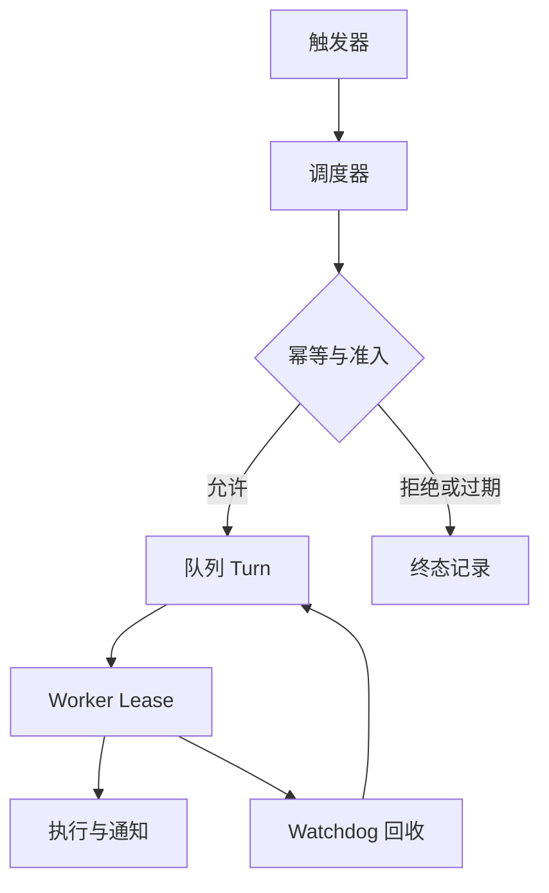

# 后台 Agent 的调度、预算与孤儿回收

为后台任务定义身份、触发器、时区、幂等、预算、暂停、过期、通知和清理。**Background Agent**、**Scheduling**、**Worker** 分别指向同一条执行链上的不同对象：业务 SLO、风险等级、流量、模型能力、数据规模、成本预算和发布策略进入系统，schedule_id、trigger_at、timezone、dedupe key、owner、budget、lease、pause、expiry 和 notification 保存处理中间状态，最终得到可定位、可降级、可回滚的请求结果，以及容量、质量和成本证据。

后台任务把触发器转换成带身份、时区、幂等键、预算和过期时间的 Turn，再交给受准入控制的 Worker 执行。调度器不拥有业务副作用，通知也不能代替任务回执。夏令时重复触发、用户失效后任务继续、积压任务过期仍运行，都要在状态与回收规则中处理。

::: info 贯穿示例

后台任务场景：知识助手流量升高，同时向量服务变慢和模型限流，系统需要保住已有会话并给出可解释降级。后台任务需要的身份、权限、版本和业务事实由应用提供，模型与外部内容只产生候选。

:::

## 后台任务怎样从触发器进入 Worker

夏令时重复触发会破坏 schedule_id 与可定位之间的对应关系，排查时先保留原始输入摘要和发生阶段，再判断是否允许重试。

离职用户任务继续影响 trigger_at 或下游解释，不能和夏令时重复触发共用“重新调用一次模型”的处理方式。

## 调度、执行与回收分别负责什么

Background Agent 的入口负责协议和身份，Runtime 负责控制状态，能力服务负责模型、检索或工具适配。因此 schedule_id 与 trigger_at 要有唯一写入方，其他组件只能通过版本化命令申请修改。

Cron 与后台任务解决的问题相邻，但控制权不同，比较时要看谁选择调用能力服务、谁保存 schedule_id、谁确认可定位。

任务队列可以参与同一请求，却不能替代后台任务；组合后仍要单独检查风险等级的可信来源和夏令时重复触发的终止规则。

后台任务使用的身份、范围和版本来自可信运行时，业务 SLO 可以表达意图，但不能提升权限或改写活动 Release。

离职用户任务继续发生时，错误回到 trigger_at 的所有者处理，上游缺输入、当前组件违反不变量和下游不可用分别形成不同终态。

后台任务的确定性边界位于 schedule_id 写入之前。模型在 Background Agent 中只提交候选值，程序仍要从认证、版本和策略快照补入可信字段。

后台任务内部可以使用更细的临时对象，跨边界只暴露稳定协议。替换 Cron 时，调用方不需要理解内部缓存和 SDK 响应。

## 组件职责、状态和数据归属

后台任务的输入合同至少列出业务 SLO、风险等级和流量，每项都注明来源、是否必需、允许的缺省值，以及缺失后是在入口拒绝还是进入降级路径。

后台调度要把 `schedule_id`、绝对触发时间和时区来源分开保存。调度身份负责幂等，转换后的时间负责排队，原始时区负责解释用户意图；只有保留三者，夏令时变化和重复触发才有办法回放。

并发分支按稳定身份合并 timezone，完成顺序只反映耗时，不能决定结果属于哪个请求，更不能让迟到的旧状态覆盖新修订。

Background Agent 的对外结果要分别表达可交付内容、缺口、取消和未知状态，调用方不必解析错误文案。

trigger_at 参与乐观并发检查；处理开始后若版本变化，旧候选只保留作审计，不能继续写入 schedule_id。

跨层 Trace、阶段耗时、错误类型、质量信号、资源用量和发布版本组成后台任务的最小追踪材料，日志只保存稳定 ID、版本和错误类，完整 Prompt、文档正文与凭证不进入指标标签。

契约还需要描述新鲜度。trigger_at 对应的数据发生变化后，旧缓存、旧候选和未完成任务怎样失效，应由版本或时间规则直接判断，不能依赖模型注意到矛盾。

删除和撤回也属于数据生命周期。后台任务引用的原始对象被移除时，稳定 ID 可以保留审计关系，正文与派生结果则按策略失效，避免继续向用户展示过期内容。

::: warning 后台任务的可信边界

可定位通过结构校验后仍是候选。后台任务使用的身份、权限、知识版本与业务事实由应用从可信服务读取，核对完成后才能执行或交付。

:::

## 调用链、Deadline 与失败传播

后台调度的演示应把用户时区的触发器转换为带 `schedule_id`、绝对时间、预算和过期时间的 Turn，再由 Worker 按准入和 Policy 领取。重复投递时只允许同一实例继续，取消后不得再创建新的动作。

入口准入接收业务 SLO 并建立 schedule_id，入口校验未通过就地结束，后续模型、检索器或工具调用次数保持为零。

调用能力服务读取 trigger_at 并执行主题逻辑，参数由应用组装，外部返回先保存为可降级，尚未获得修改领域状态的资格。

汇总观测检查结构、范围、版本和主题不变量；可定位缺少来源、落在旧版本或越过权限时，schedule_id 停在 rejected 或 failed。

实现可以使用函数、Graph、Middleware 或 Workflow，schedule_id 的所有权和夏令时重复触发的停止规则不会随框架改变。

部分成功需要在步骤边界处理。

## 沿一次过载请求推演

沿“后台任务场景：知识助手流量升高，同时向量服务变慢和模型限流，系统需要保住已有会话并给出可解释降级”推演后台任务：入口创建 request_id，读取可信身份，把业务 SLO 和当前版本写入初始状态。

入口准入生成 schedule_id 与输入摘要；若风险等级缺失，请求返回 rejected，并指出缺少哪项材料，不继续消耗模型或外部服务配额。

调用能力服务按“调度器把触发器转换为带身份、时区、幂等键、预算和过期时间的 Turn；后台 Worker 仍遵守准入、Policy、取消和通知规则”推进，每次依赖调用保存 call_id、参数摘要、开始时间与状态版本，以便判断超时前是否已经产生结果。

降级或交付写入终态；客户端断开只影响交付通道，重新连接时读取已经保存的 schedule_id 或事件游标，不重跑核心逻辑。

故障注入选择积压任务过期仍运行，程序保留原候选和错误位置，只重做失败边界，不能从入口复制整个任务并产生第二份状态。

推演结束后用 request_id 关联 schedule_id、可定位与终止原因，测试据此排除并发请求串线，并确认失败路径没有遗留未关闭资源。

后台任务在输入拒绝时不调用依赖，正常路径按 5 个阶段推进，有限修复只重做失败边界。调用次数是控制流断言，不是性能宣传。

后台任务的最终记录用 request_id 关联 schedule_id、可定位和失败问题，测试据此证明结果来自本次执行，没有混入并发请求。

## 正常服务的观测证据

后台任务正常完成时，schedule_id、trigger_at 和可定位指向同一次执行，重复读取返回同一终态，未完成分支已经取消或有明确所有者。

跨层 Trace、阶段耗时、错误类型、质量信号、资源用量和发布版本用于还原后台任务的处理过程，可以按阶段和版本聚合；敏感正文留在受控存储中，不复制到日志与指标。

依赖返回成功状态只证明传输完成。后台任务还要检查可定位是否满足业务范围、质量阈值和当前版本，明确拒绝也可能是正确终态。

schedule_id 的状态迁移必须单调：完成不能退回运行中，取消不能被迟到结果覆盖，失败重试也不能绕过入口已经固定的权限。

后台任务的成功证据最终要同时回答输入是什么、执行了哪些步骤、交付了什么以及为什么停止；任一项缺失都应留在未确认状态。

后台任务把业务验收与服务健康分开。依赖对 Background Agent 返回 200 只说明传输完成，内容仍要满足当前范围和质量条件。

后台任务的观测指标按阶段和版本聚合。评估 Background Agent 时，把错误、空结果、拒绝、恢复和资源消耗分开统计，避免一个成功率掩盖不同故障。

## 降级、隔离与恢复

后台任务的故障处理要区分错过触发、排队失败、Worker 失联和业务拒绝。错过触发由补投策略决定，Worker 失联交给 Lease 回收，业务拒绝应保留终态；它们不能共用“再执行一次”的处理。

后台任务处理夏令时重复触发时需要稳定身份和结果回执，再次收到同一请求先读取旧结果；外部结果未知就停在 unknown，不能猜测失败后重新执行。

遇到离职用户任务继续时，先记录发生阶段、错误类别和责任对象。后台任务保留输入摘要和状态版本，由对应组件决定重试、降级或终止。

后台任务遇到积压任务过期仍运行时，要同时记录开始时间、剩余时限和最后一次进展，随后停止新增工作，只允许释放资源、保存可恢复状态或返回已经确认的局部结果。

后台任务处理通知失败重做副作用时需要稳定身份和结果回执，再次收到同一请求先读取旧结果；外部结果未知就停在 unknown，不能猜测失败后重新执行。

遇到孤儿任务无人回收时，先记录发生阶段、错误类别和责任对象。后台任务保留输入摘要和状态版本，由对应组件决定重试、降级或终止。

后台任务将终态、可重试性和资源清理结果写入记录；后台扫描器根据 schedule_id 判断任务是在运行、等待恢复还是已失败。

后台任务执行前固定 Deadline、动作上限、重复签名、无进展阈值、预算和取消信号；任一条件触发，调用能力服务停止创建新工作。

后台任务把重试时间和次数计入总预算。Background Agent 每次重试先扣减剩余额度，达到上限就保留原始错误。

后台任务的清理动作设计成幂等操作；仍被活动任务或 Lease 引用的资源拒绝删除。

## 故障演练和发布验证

沿正常、过载、依赖失败和回滚四条路径演练，核对状态所有者、传播边界与可观测字段；测试显式给出业务 SLO、初始 schedule_id、预期可定位和终止原因，不能只断言返回值非空。

后台任务的单元测试用 Fake Adapter 固定可定位与错误，断言参数、调用顺序、状态修订和清理动作，这些结果只证明本地控制逻辑。

契约测试围绕业务 SLO、schedule_id 和可降级构造合法与非法样本，Schema 解析成功后继续检查权限、版本与领域不变量。

故障测试注入夏令时重复触发和离职用户任务继续，记录调用能力服务是否被调用、schedule_id 是否改变、资源是否释放，以及同一身份重试会不会重复执行。

后台任务的集成测试连接真实协议与隔离存储，检查序列化、约束、并发和超时；需要在线服务时另行记录服务版本、时间、配置与凭证条件。

后台任务的回归报告要保留失败类型分布。在 Background Agent 的回归中，拒绝、超时、权限错误和空结果必须保持各自类型，状态变化本身就是行为契约。

后台任务的性质测试随机改变 schedule_id 顺序、重复提交、完成顺序或状态版本，断言权限不扩大、终态不倒退、同一身份不产生两次副作用。

## 调度可靠性来自实例身份和 Lease

Schedule 只描述何时创建任务，Run Instance 才是一次执行。实例使用 **schedule_id + planned_at** 形成幂等身份，Worker 领取有期限 Lease，续租失败后停止创建新副作用。接替者先读事件和外部回执，再决定继续。

跨时区测试覆盖夏令时、错过触发、队列重复投递和通知失败。业务结果与通知分开提交，通知重试不能重新执行主体任务。
