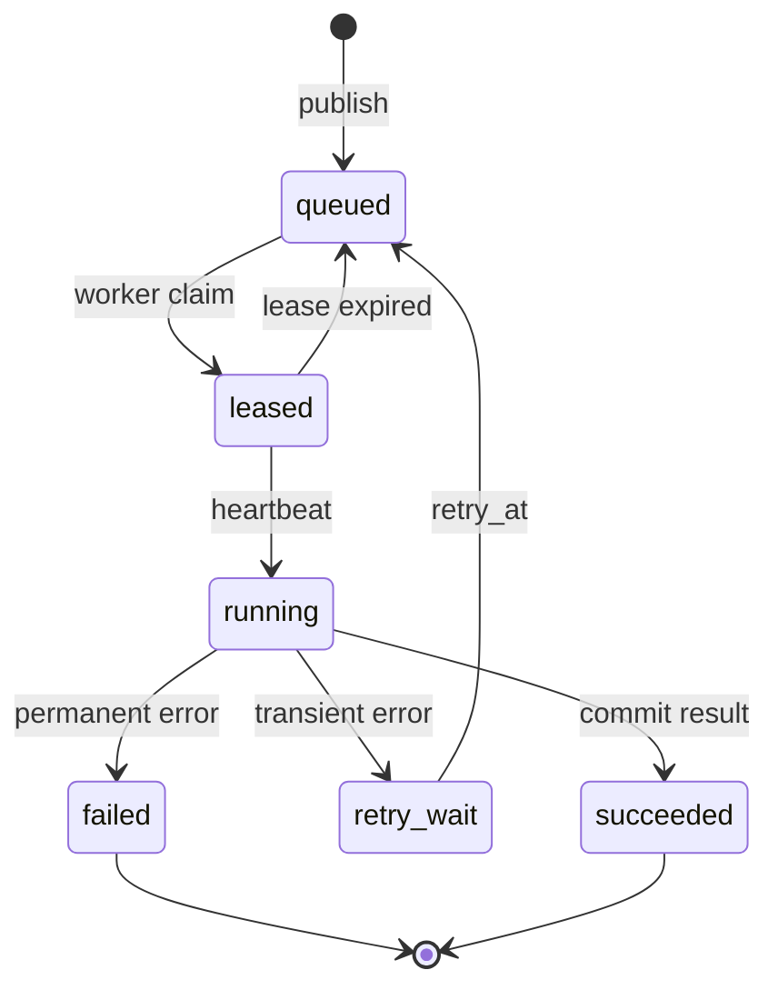

# Celery Worker、ACK、任务所有权与 Lease

## Worker、ACK 与 Lease 分别是什么

Celery Worker 是消费并执行队列任务的进程，ACK 是 Worker 告诉 Broker“这条消息已处理”的确认，Lease 则是一份带期限的任务所有权。它们位于 Broker 投递和业务状态写入之间，用于在至少一次投递下判断谁可以继续执行、何时确认消息，以及崩溃后谁能接管。

把任务放进 **Celery** 不会自动得到“只执行一次”。消息可能在 Worker 处理前、处理过程中或处理完成后丢失连接；Broker 不知道业务是否已经写库，Worker 也可能在发送 ACK 前崩溃。为了不丢任务，系统通常接受“至少一次投递”，于是同一个任务可能执行两遍。

企业级做法不是幻想 exactly-once，而是把消息确认、任务所有权和业务幂等组合起来：消息只在任务状态可恢复后确认，**Worker** 通过 Lease 表明自己暂时拥有任务，副作用使用唯一键去重。

## 从投递到终态



`queued` 表示 Broker 或任务表中可领取；`leased` 表示某个 Worker 在租约有效期内拥有处理权；`running` 要通过心跳延长租约；只有业务结果提交成功后才进入 `succeeded`。Worker 崩溃不会主动把状态改回 queued，恢复扫描器通过 `lease_until < now` 重新入队。旧 Worker 恢复后仍可能发送迟到的写入，所以更新必须带 `owner_token` 条件。

## ACK 的两个时机

早 ACK 在 Worker 开始处理时确认消息，吞吐较好，但此时进程崩溃会丢任务。晚 ACK 在业务成功或确定失败后确认，能够让 Broker 重新投递，但失败重启可能导致**重复执行**。Celery 的 `acks_late` 只能改善确认时机，不能替代业务幂等；数据库写入、发送邮件、写向量都要自己去重。

重试也分两类：Broker 重新投递是传输层行为，Celery `retry` 是应用层决定再次执行。两者都要带 attempt、最大次数和下一次时间。把不可恢复的参数错误放进无限重试，会造成死循环和队列堵塞。

把时间线拆开后，**ACK** 的边界会更清楚。任务执行至少经过“收到消息、取得所有权、提交业务结果、写入终态、确认消息”五个动作，其中任意两个动作之间都可能宕机：

| 宕机位置 | Broker 看到什么 | 业务存储可能是什么状态 | 恢复动作 |
| --- | --- | --- | --- |
| 取得所有权前 | 未 ACK | 没有副作用 | 重新投递即可 |
| 取得所有权后、业务提交前 | 未 ACK | **Lease** 尚未过期 | 等待租约超时后接管 |
| 业务提交后、终态前 | 未 ACK | 副作用已存在 | 用幂等键读取已有结果，再补终态 |
| 终态后、ACK 前 | 未 ACK | 已成功 | 重投后直接返回已存结果 |
| ACK 后 | 已确认 | 已成功 | 不再依赖 Broker 恢复 |

这张表也解释了为什么“业务提交后再 ACK”仍不等于 exactly-once：数据库提交和 Broker ACK 不在同一个原子事务里，中间窗口永远存在。工程目标应改成“消息可以重复，业务结果只能有一个有效版本”。

## Lease 不只是一个过期时间

Lease 是带期限的临时所有权。`owner_token` 标识当前持有者，`lease_until` 表示所有权何时失效，心跳负责续期。Worker 领取任务后不能只在内存中记住“这是我的任务”，因为另一个进程看不到这份状态；所有权必须存进所有参与者都能读取的数据库。

续租也要使用条件更新：只有 `owner_token` 仍匹配且任务仍处于运行态，才能把 `lease_until` 往后推。受暂停、网络分区或长时间垃圾回收影响的旧 Worker 可能在租约过期后恢复，此时它持有的进程内状态已经失效。数据库条件中的 `owner_token` 就是最小的 fencing token，用来挡住迟到写入。

租约时长不能拍脑袋设置。太短会让正常长任务频繁丢失所有权，太长会拖慢故障接管。通常根据心跳间隔和可接受恢复时间选择，例如每 10 秒心跳、连续 3 次未收到才允许接管；无论具体值是多少，都要测试暂停超过租约、数据库短暂不可用和心跳线程存活但业务线程卡死三种情况。

## 模型资源槽也遵守所有权语义

Worker 拿到 Turn Lease，只说明它有权推进业务状态，并不表示任何模型都能立即调用。模型网关还要预留资源槽：全局槽保护进程和连接池，租户槽避免单个租户占满容量，模型槽表达某种模型的并发上限，供应商配额则约束 RPM/TPM。

资源槽有自己的小状态机：`requested → reserved → consumed/released`。预留成功后，正常完成、异常、超时和取消都要走同一个释放出口。模型调用实际开始后记录 consumed；如果 Worker 在调用前失去 Turn Lease，槽位直接释放，不能继续把结果写回旧所有者。

```python
from collections.abc import AsyncIterator
from contextlib import asynccontextmanager

@asynccontextmanager
async def hold_model_slot(pool: "SlotPool", key: str) -> AsyncIterator["Reservation"]:
    # acquire 原子增加占用并返回 fencing token；容量不足时明确排队或拒绝。
    reservation = await pool.acquire(key)
    try:
        # 只有同时持有 Turn Lease 和模型槽时，调用方才能开始外部模型请求。
        yield reservation
    finally:
        # 正常、异常、取消和超时都会释放，避免槽位永久泄漏。
        await pool.release(reservation)
```

调用顺序是取得 Turn Lease，按硬能力选择模型，再进入 `hold_model_slot`。`Reservation` 至少包含资源键、owner 和 fencing token；`release` 必须幂等，因为取消处理和 Worker 清理可能同时到达。片段省略了分布式存储，实际实现要用条件更新或原子脚本保证 `acquire/release`，并让扫描器回收过期 Reservation。

观测至少记录当前槽位、等待时长、拒绝原因、Lease 丢失数和过期回收数。槽位持续不归零通常是异常路径没有释放；槽位正常但队列仍增长，则继续查供应商 TPM、Worker 数或单 Turn 耗时，而不是盲目提高并发。

## 租约和幂等结果

下面的内存实现模拟 Worker 领取任务、租约过期和结果提交。真实项目可把字典替换成带条件更新的 PostgreSQL 表。

下面把“租约和幂等结果”落成最小实现。代码关注“Worker 领取任务时获得带 fencing token 的 Lease，只有当前所有者能续租和提交幂等终态”；输入从函数参数或上文定义的状态对象进入，关键分支负责校验或修改状态，返回值再交给后续调用。

```python
# Worker 领取任务时获得带 fencing token 的 Lease，只有当前所有者能续租和提交幂等终态。
from __future__ import annotations

from dataclasses import dataclass, replace

@dataclass(frozen=True)
class Job:
    job_id: str
    status: str
    owner_token: str | None
    lease_until: int
    result: str | None = None

class JobStore:
    def __init__(self) -> None:
        self.jobs: dict[str, Job] = {}

    def enqueue(self, job_id: str) -> None:
        self.jobs.setdefault(job_id, Job(job_id, "queued", None, 0))

    def claim(self, job_id: str, owner_token: str, now: int, lease_seconds: int) -> Job:
        job = self.jobs[job_id]
        # 先检查当前状态是否允许继续推进，避免终态被重复任务或迟到结果覆盖。
        if job.status == "succeeded":
            return job
        # 先检查当前状态是否允许继续推进，避免终态被重复任务或迟到结果覆盖。
        if job.status == "leased" and job.lease_until > now:
            raise RuntimeError("job_owned_by_another_worker")
        claimed = replace(job, status="leased", owner_token=owner_token, lease_until=now + lease_seconds)
        self.jobs[job_id] = claimed
        return claimed

    def complete(self, job_id: str, owner_token: str, result: str) -> Job:
        job = self.jobs[job_id]
        # 先检查当前状态是否允许继续推进，避免终态被重复任务或迟到结果覆盖。
        if job.status == "succeeded":
            if job.owner_token == owner_token:
                return job
            raise RuntimeError("stale_worker_cannot_complete")
        if job.owner_token != owner_token:
            raise RuntimeError("stale_worker_cannot_complete")
        completed = replace(job, status="succeeded", result=result, lease_until=0)
        self.jobs[job_id] = completed
        return completed

if __name__ == "__main__":
    store = JobStore()
    store.enqueue("import-1")
    store.claim("import-1", "worker-a", now=10, lease_seconds=5)
    store.claim("import-1", "worker-b", now=20, lease_seconds=5)
    print(store.complete("import-1", "worker-b", "written"))
    print(store.complete("import-1", "worker-a", "late-write"))
```

`enqueue` 用 `setdefault` 保证重复发布不会覆盖已有状态。`claim` 只允许租约为空或已过期的任务被接管；同一租约内的另一个 Worker 会得到明确错误。`complete` 先检查成功记录的所有者：同一个所有者重复提交会返回已保存结果，旧所有者即使在任务成功后恢复也会被拒绝。任务尚未成功时，同样只有当前 `owner_token` 可以写入终态。

示例第二次 `claim` 会取得新所有权，第一次 Worker 的 `complete` 触发 `stale_worker_cannot_complete`。生产代码要把这两个检查合成数据库条件更新，例如 `WHERE job_id = ? AND owner_token = ?`，并把业务结果和状态写入同一事务。

## Celery 配置如何落到这个模型

`acks_late=True` 让任务完成后再 ACK，`task_reject_on_worker_lost=True` 允许 Broker 在 Worker 丢失时重新投递；这两个选项会增加重复执行概率，因此任务函数必须幂等。长任务还需要心跳或外部 Lease，不能依赖一次 ACK 代表“任务仍在运行”。

`worker_prefetch_multiplier` 决定一个 Worker 可以提前拿多少尚未执行的消息。长耗时任务若预取太多，消息会堆在某个 Worker 私有缓冲区，其他空闲 Worker 拿不到；此时队列看似不长，用户却一直等待。长任务常从较小的预取值开始，再根据任务耗时分布和 Broker 指标调整，而不是照搬短任务配置。

Celery 的 soft time limit 会在任务进程中触发可捕获异常，hard time limit 可能直接终止进程。它们是 Worker 自我保护，不是完整 Deadline：外部 HTTP 调用、数据库语句和模型调用仍要接收剩余时间并设置自己的超时。若 hard limit 先杀掉进程，清理逻辑可能没有机会运行，Lease 与幂等结果就成为最后的恢复防线。

### 一个 Celery 任务入口应该有多薄

下面是配置与任务入口片段，依赖 Celery 5.x 和已经实现的 `JobStore` Repository。它不能独立运行，因为 `repository`、`runtime` 与错误类型是应用适配器；代码目标是展示消息参数如何收敛到 Job ID，以及 ACK、重试和 Lease 由谁负责。

```python
# Celery 入口只解析任务 ID、领取所有权并调用共享 Runtime；业务状态不保存在消息体或 Worker 内存。
from celery import Celery

app = Celery("knowledge_worker")
app.conf.update(
    task_acks_late=True,
    task_reject_on_worker_lost=True,
    worker_prefetch_multiplier=1,
    task_track_started=True,
)

# 入口函数按固定顺序编排各步骤，具体校验和副作用仍由各自函数负责。
@app.task(bind=True, max_retries=3)
def execute_turn(self, turn_id: str) -> str:
    owner_token = f"{self.request.id}:{self.request.retries}"
    job = repository.claim(
        turn_id=turn_id,
        owner_token=owner_token,
        lease_seconds=30,
    )
    # 先检查当前状态是否允许继续推进，避免终态被重复任务或迟到结果覆盖。
    if job.status == "succeeded":
        return job.result_id

    # 从这里进入可能失败的外部边界，下面只转换已经明确分类的异常。
    try:
        result_id = runtime.run(
            turn_id=turn_id,
            owner_token=owner_token,
            deadline_at=job.deadline_at,
        )
        repository.complete(turn_id, owner_token, result_id)
        return result_id
    except TransientDependencyError as error:
        delay = min(2 ** self.request.retries, 30)
        repository.schedule_retry(turn_id, owner_token, error.code, delay)
        raise self.retry(exc=error, countdown=delay)
    except PermanentTaskError as error:
        repository.fail(turn_id, owner_token, error.code)
        raise
```

`app.conf` 选择晚 ACK、Worker 丢失重投和较小预取；这些设置增加了重复消息的可能，所以后面仍使用业务所有权。任务消息只携带 `turn_id`，避免把大段上下文和权限快照复制进 Broker。`owner_token` 由 Celery 请求 ID 与 retry attempt 组成，每次重试都取得新所有权。

`repository.claim` 是第一个业务动作；已成功任务直接返回已存结果。`runtime.run` 使用数据库里的 Deadline 和快照，而不是信任消息参数。暂时错误先把业务状态改为 `retry_wait`，再调用 `self.retry`；永久错误写终态并重新抛出，让 Celery 记录失败。无论哪条路径，Repository 的更新都带 owner token 条件，迟到 attempt 写不进去。

`repository.schedule_retry` 与 `self.retry` 分属数据库和 Broker，仍有双写窗口。扫描器应能根据 `retry_wait + retry_at` 补派，而幂等消息 ID 或 Job 状态阻止重复派发产生第二份业务结果。不要把完整提示词、Evidence 或凭证放进 Celery 参数和失败日志。

## 用测试证明迟到 Worker 写不进去

下面的 `pytest` 用例复用上面的 `JobStore`。输入是同一个任务的两个所有者；要观察的结果是新所有者成功、旧所有者得到稳定错误码，并且最终结果没有被覆盖。

```python
# 测试让旧 Worker 租约过期后迟到提交，断言 fencing token 会拒绝它覆盖新所有者结果。
import pytest

# 这个用例把时间推进到截止边界，确认超时保持独立错误语义并释放资源。
def test_expired_owner_cannot_overwrite_result() -> None:
    store = JobStore()
    store.enqueue("import-1")
    store.claim("import-1", "worker-a", now=10, lease_seconds=5)
    store.claim("import-1", "worker-b", now=20, lease_seconds=5)

    # 新所有者先用最新 fencing token 提交结果，随后再模拟旧 Worker 的迟到写入。
    completed = store.complete("import-1", "worker-b", "written")

    with pytest.raises(RuntimeError, match="stale_worker_cannot_complete"):
        store.complete("import-1", "worker-a", "late-write")
    assert completed.result == "written"
    assert store.jobs["import-1"].result == "written"
```

测试按真实故障顺序推进：A 先取得 5 秒租约，时间来到 20 后 B 接管，B 提交结果，最后模拟 A 恢复并迟到写入。`pytest.raises` 验证拒绝原因，两个 `assert` 分别验证函数返回值和持久状态。这个内存实现仍省略了并发事务；迁移到 PostgreSQL 后，应再写两个连接同时 `claim` 的集成测试，断言条件更新只有一行成功。

排障时先看消息是否重复、任务 attempt、Worker 日志中的 owner token、数据库状态和副作用唯一键。然后按时间对齐 Broker 投递记录、任务状态变更和业务提交记录。不要只根据“Celery 显示成功”判断业务成功，因为 ACK 和数据库提交可能处在不同系统。

## 用故障时序检验 ACK、所有权和 Lease

1. 画出 queued、leased、running、retry、succeeded、failed 的状态转换。
2. 记录 `attempt`、`owner_token`、`lease_until` 和 `last_heartbeat`。
3. 所有副作用使用业务幂等键，并测试重复投递。
4. 旧 Worker 完成任务时必须被条件更新拦截。
5. 明确参数错误、供应商超时和数据库暂时不可用分别如何处理。


**Celery 的 ACK 表示业务任务已经成功了吗？**

不一定。ACK 只表示 Broker 可以怎样处理这条消息，业务成功由数据库终态和副作用记录决定。早 ACK 在执行前确认，Worker 崩溃可能丢任务；晚 ACK 在执行后确认，崩溃会导致重投，因此业务必须幂等。即使 Celery UI 显示 SUCCESS，数据库提交也可能失败或结果写到了错误版本。排障要对齐消息投递、owner Lease、业务状态和结果唯一键，不能只看 Broker 状态。

**为什么任务消息里只放 ID，不直接放完整业务数据？**

完整数据会在队列中变旧、泄露敏感内容，并让重试使用与数据库不同的状态。薄消息只携带 task/turn ID、attempt 和必要 Trace Context，Worker 领取所有权后从事实库读取固定快照。这样权限撤回、取消和版本都可重新检查，消息也更容易兼容。需要不可变输入时保存版本 ID 或对象指针，而不是复制无法治理的正文。消息大小和序列化失败面也会更小。

**Lease 与 Celery 的消息可见性超时有什么区别？**

Broker 可见性或 ACK 机制决定消息何时重投，业务 Lease 决定哪个 Worker 当前有权推进任务状态和提交结果。两者可能不同步：消息已重投时旧 Worker 仍在运行，只有 fencing token 能阻止双写；业务 Lease 过期也不一定自动让 Broker 立刻投递。系统需要同时配置并观察，不能把 Broker 超时当业务所有权。恢复器按数据库 Lease 接管，ACK 再按执行结果处理。

**Worker 失去 Lease 后还能完成当前模型调用吗？**

底层调用可能无法瞬间停止，但 Worker 在心跳失败、节点边界和提交前都要检查 owner token，传播取消并停止新副作用。迟到响应只能记录诊断，不能写答案或终态。外部写操作需要幂等键和最终状态查询，因为调用可能已经到达对方。测试让 A 失去 Lease、B 接管并完成，再让 A 迟到，确认所有条件更新拒绝旧 token，这是比“尝试停止线程”更可靠的边界。

**哪些 Celery 错误应该重试，哪些不应该？**

暂时数据库不可用、明确限流或网络瞬断，在 Deadline、最大 attempt 和幂等条件满足时可退避重试；参数错误、文件损坏、权限拒绝和契约不兼容属于永久失败。模型或依赖返回未知状态时先查最终结果，不能盲目重做写操作。重试继续使用同一业务任务与预算，记录错误枚举和 next_retry_at，避免多个 Worker 同时形成重试风暴。

**Worker 安全停机时怎样避免正在执行的任务丢失？**

先停止领取新消息，再给当前任务一个受 Deadline 限制的排空窗口，持续续租并完成安全 Checkpoint；超时后传播取消，让未完成任务保持 recoverable，由新 Worker 在 Lease 过期后接管。不能先杀进程再依赖猜测恢复，也不能无限等待阻塞发布。停机演练要检查 ACK、Lease、Checkpoint、幂等副作用和队列年龄，确认旧容器退出后没有两个 owner 同时推进。
