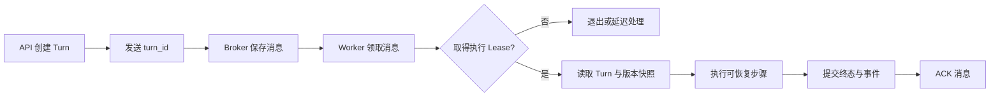
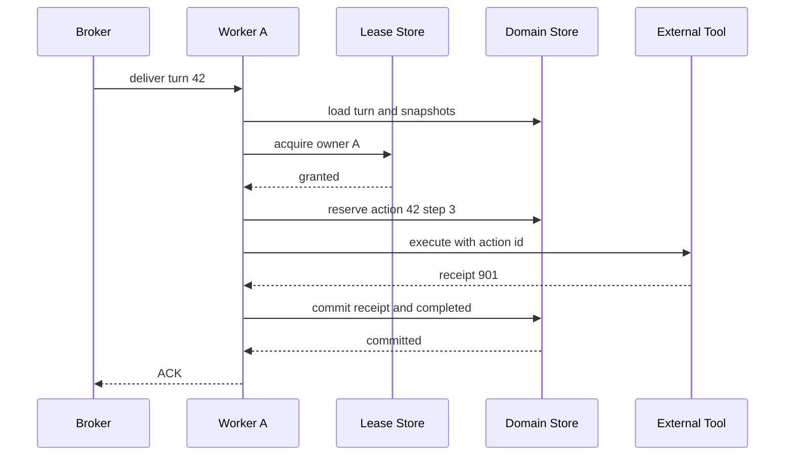

# Celery Worker 的 ACK、Lease 与重复投递

一个知识问答 Turn 已经写入数据库，API 随后把 `turn_id` 发送到 Celery。Worker 领取任务，完成检索和模型调用，又创建了一张外部工单。就在终态提交前，Worker 进程被终止。Broker 没收到 ACK，稍后把同一消息交给另一个 Worker。

第二个 Worker 不能假设第一次什么都没做。模型可能调用过，工单也可能已经创建，只是数据库里还没有 Completed。长任务要把“消息有没有确认”“谁有权推进 Turn”“业务动作是否已经生效”分开处理。

::: info 三个问题由三个机制回答

- **ACK** 回答 Broker 中这条消息是否还需要交付。
- **执行 Lease** 回答当前哪个 Worker 可以推进这个 Turn。
- **幂等记录**回答某个业务动作是否已经执行或是否仍然未知。

:::

Celery 提供任务交付、路由、重试和 Worker 生命周期，业务数据库仍保存 Turn、Checkpoint、终态和事件。队列不是业务状态机，Celery Task ID 也不能替代 Turn ID。

## Celery 只负责把执行机会交给 Worker

API 接受请求后，先完成认证、权限快照、幂等创建和准入，再发送一个体积很小的任务消息。消息通常只包含 `turn_id`，Worker 根据它从权威存储读取问题、模式、Deadline、知识版本和当前状态。把完整 Prompt、文档正文或访问凭证塞进 Broker，会增加泄露面，也会让重试继续使用无法撤回的旧数据。

Celery 在这条链路上有三个职责：把任务放进指定队列，把消息交给可用 Worker，并按确认或重试结果决定后续投递。它不知道回答是否有证据，不知道用户是否仍有权限，也不知道某次工具调用能否重复。业务 Runtime 必须在 Worker 里再次执行这些确定性检查。



图中 ACK 在终态之后，这是晚确认（Late Acknowledgement）的基本顺序。消息交付和业务提交之间没有一个跨 Broker、数据库与外部服务的全局事务，系统只能接受重复投递，再靠稳定身份和幂等协议把重复吸收掉。

## ACK 表示消息处理结束，不表示业务成功

Worker 收到消息后立即 ACK，叫早确认。优点是消息不会因执行时间过长而重复，代价是 Worker 在业务完成前崩溃时，Broker 已经删除消息，任务不会自动回来。短小、可丢失或上层另有可靠恢复扫描的任务可以采用早确认；需要可靠完成的长任务通常更适合晚确认。

Celery 的 `task_acks_late` 让确认发生在任务执行之后。官方文档同时说明，子进程被信号终止或异常退出时，即使开启晚确认，Worker 仍可能确认消息。若希望 Worker 丢失后拒绝并重新排队，还要评估 `task_reject_on_worker_lost`。这项配置可能造成消息循环，只有任务可重入、失败可观察时才启用。

完成与失败都可能 ACK。输入非法、权限拒绝、Deadline 过期等确定性错误，Worker 把领域状态写成 Rejected、Failed 或 Expired 后确认消息，避免无意义重投。可重试依赖错误则通过 `retry()` 发布后续尝试，原始交付结束。不要根据“是否 ACK”推断业务成功，状态接口必须查询 Turn。

消息还可能在业务已经完成后、ACK 发出前丢失连接。它再次投递时，Worker 读到终态，直接确认消息，不再运行模型和工具。这个快速路径是正常处理，不是异常补丁。

| 崩溃位置 | Broker 观察 | 领域存储 | 再次投递时的动作 |
| --- | --- | --- | --- |
| 领取后、执行前 | 未 ACK | Pending 或 Running | 重新取得 Lease 后执行 |
| 副作用后、终态前 | 未 ACK | 动作可能已生效 | 查询 Action ID，再补提交或进入 Unknown |
| 终态后、ACK 前 | 未 ACK | 已是终态 | 读取终态并 ACK |
| ACK 后 | 已完成 | 应是终态 | Broker 不再自动投递 |

最后一行要求代码顺序固定为“先提交终态，再 ACK”。若自定义 Consumer 在数据库提交前手动确认，就重新引入了早确认丢任务的问题。

### Broker 重投与 Celery Retry 不是同一件事

Broker 重投通常发生在原消息没有得到有效确认，例如 Visibility Timeout 到期、消费者连接丢失或 Worker 丢失后拒绝消息。新 Worker 看到的是同一项未完成交付，业务层必须假设上一次执行停在任意位置。

Celery Retry 是任务代码主动做出的决定。Worker 已经捕获一个可恢复错误，调用 `task.retry()`，Celery 使用原 Task ID 发送一条带倒计时的新消息，并用 Retry 控制异常结束当前尝试。任务代码知道失败发生在哪一层，所以可以保存错误、Checkpoint 和下次允许时间。Broker 重投没有这份业务判断，它只知道消息未确认。

两条路径可能叠加。Worker 调用 Retry 后，在新消息发布与当前消息结束之间丢失连接，Broker 还可能重新交付旧消息；或者 Retry 消息到期时，恢复扫描也投递了一条恢复任务。Execution Lease 和 Turn 终态快速路径仍要存在，不能因“已经用了 Celery Retry”就假设只有一条后续消息。

重试计数也分两层。`task.request.retries` 表示 Celery 主动 Retry 的次数，不一定包含 Broker 的重复 Delivery。领域状态应另存 Attempt 或 Execution Generation，用于限制总执行量和解释每次接管。告警只看 Celery Retry 次数，会漏掉不断被 Broker 重投但从未进入 `task.retry()` 的任务。

::: tip 判断一次后续执行来自哪里

日志同时记录 Celery Task ID、Delivery 标识、领域 Attempt 与恢复原因。Task ID 相同且领域没有主动 Retry 事件，优先检查 Broker 重投；出现 Retry 事件和 Countdown 时，再沿可恢复错误排查。

:::

## 五种身份不能混成一个 Task ID

长任务至少会出现五种身份，它们的生命周期不同：

| 身份 | 表示什么 | 重试时是否保持 |
| --- | --- | --- |
| `turn_id` | 一次用户意图及其领域状态 | 保持 |
| `celery_task_id` | 一条 Celery 任务及重试标识 | Celery `retry()` 通常沿用 |
| `delivery_attempt` | Broker 的一次实际交付 | 每次变化 |
| `owner_token` | 当前执行 Lease 的所有者 | 每次取得 Lease 都变化 |
| `action_id` | 一项可产生副作用的业务动作 | 相同逻辑动作保持 |

客户端重试创建 Turn 时使用 Idempotency Key，避免生成第二个 `turn_id`。Celery 重投时仍携带原 `turn_id`，Worker 生成新的 Owner Token 竞争执行权。调用外部工具前，Runtime 从 Turn、计划步骤和动作序号生成稳定 Action ID；第二次执行同一步时先查询回执。

Celery Task ID 适合关联 Broker 日志，却不能做业务幂等键。管理员重新投递、恢复扫描或迁移队列时可能创建新 Task ID，原 Turn 仍然是同一业务对象。反过来，同一个 Celery Task 发生 Retry，也不代表可以复用已过期的 Owner Token。

## Result Backend 不保存 Agent 的权威状态

Celery Result Backend 能记录 Pending、Started、Success、Failure 等任务结果，适合查看任务函数是否返回和调试 Worker。它的状态围绕 Celery Task，缺少 Turn 的权限快照、事件序号、动作回执与版本约束。恢复扫描创建新 Task ID 后，单个 Result 也无法描述整个业务生命周期。

任务函数返回 Success，只说明 Python 调用正常结束。它可能返回“已有其他 Owner”或“Turn 已终态”的快速结果，不能据此把页面显示成回答完成。相反，任务被标记 Failure 时，Runtime 也可能已经把 Turn 安全写成 Cancelled 或 Expired。对外状态接口读取领域数据库，Result Backend 用于队列运维和关联诊断。

把最终答案直接放进 Result Backend 还有数据治理问题。答案可能包含用户可见证据和权限范围，Result Backend 的保留周期、访问控制与删除路径未必符合业务要求。Worker 在领域存储中提交答案或受控对象引用，Celery 返回值只保留 `turn_id`、终态和必要诊断。

两边需要对账，但不能互相覆盖。Celery Success 而 Turn 长时间非终态，说明任务返回路径或数据库事务有缺口；Celery Failure 而 Turn 已 Completed，可能是 ACK 前或返回序列化阶段失败。自动修复先根据 Turn 的单调状态判断，再处理过期的 Result，不能用后到的队列状态把 Completed 改回 Running。

Result Backend 可以与 Broker 使用同一个 Redis 服务，但应使用不同命名空间或数据库，并分别设置容量和过期策略。同一连接地址不代表两类数据属于同一事实层。

## 安装与最小配置

Celery 官方安装入口是 [Installation](https://docs.celeryq.dev/en/stable/getting-started/introduction.html#installation)，Redis 作为 Broker 时安装 `redis` 额外依赖。下面用隔离虚拟环境固定 Celery 5.x 约束，避免未来主版本升级改变配置语义：

<figure class="doc-shot">
  
  <figcaption>Celery 官方安装章节。按 Broker 和平台选择依赖，截图不替代版本和部署环境核对。</figcaption>
</figure>

```bash
python3 -m venv .venv
source .venv/bin/activate
python -m pip install --upgrade pip
python -m pip install "celery[redis]>=5.5,<6"
python -m celery --version
```

使用 `uv` 的项目可以执行：

```bash
uv add "celery[redis]>=5.5,<6"
uv run celery --version
```

一组适合长任务起步的配置如下。它不是复制后就能获得可靠性的开关集合，每个字段都对应后文的一项业务约束。

```python
from celery import Celery

app = Celery(
    "knowledge_runtime",
    broker="redis://localhost:6379/0",
    backend="redis://localhost:6379/1",
)

app.conf.update(
    task_serializer="json",
    result_serializer="json",
    accept_content=["json"],
    task_acks_late=True,
    task_reject_on_worker_lost=True,
    worker_cancel_long_running_tasks_on_connection_loss=True,
    worker_prefetch_multiplier=1,
    broker_transport_options={"visibility_timeout": 1200},
    task_track_started=True,
    task_routes={"agent.execute_turn": {"queue": "agent-online"}},
)
```

`accept_content=["json"]` 限制消息序列化格式，任务参数也应只放普通数据。`worker_prefetch_multiplier=1` 减少单个 Worker 预留多个长任务造成的分配不均，但它不等于全局并发限制。全局、用户和资源池容量仍由准入 Lease 管理。

启动命令显式指定应用和队列：

```bash
celery -A app.worker:app worker \
  --loglevel=INFO \
  --queues=agent-online \
  --concurrency=2
```

生产并发数要按模型连接、内存和下游容量测量，示例中的 `2` 只是演示参数。Worker 启动成功也只证明消费者连上 Broker，至少还要发送一个无副作用探针，核对任务路由、状态提交和 ACK。

### 预取、并发与路由一起影响等待时间

Worker 并发为 `C`、预取倍数为 `M` 时，消费者通常会预留约 `C × M` 条消息。长任务的耗时差异很大，较高预取会让一台 Worker 先拿走多条消息，其中一些尚未开始，却不能及时分给空闲节点。把倍数设为 1 可以减轻这种分配不均，不会取消每个并发槽位的预留。

并发也不是越高越好。Agent Task 大量时间在等待模型和网络，看起来适合提高并发，但每个 Turn 还保留上下文、数据库会话、流式事件和工具资源。下游模型只有十个并发名额时，启动几十个 Worker 只会让更多任务在进程内部等待，并增加 Lease 续租与超时竞态。

在线队列关注短等待，文档入库可能运行更久，评测则允许批量吞吐。三者共用一个队列时，预取为 1 也挡不住先到的大批入库任务。任务路由把它们送往独立队列，Worker 组分别扩缩容；容量控制再限制它们对共享模型、Redis 和数据库的总占用。

自动扩容依赖可解释指标。Broker 队列长度只能说明等待消息数量，看不到每条任务的资源类别和剩余 Deadline。扩容决策还要参考最老消息年龄、活动 Lease、模型限流和数据库池使用率。若耗尽的是供应商配额，增加 Worker 会扩大失败和 Retry 流量。

公平性问题也不能只靠队列顺序解决。一个租户连续提交大量研究任务时，入口的用户或租户准入先限制活动数；队列可以按租户轮转或分优先级。Celery 负责执行调度，业务层仍决定谁有资格进入哪条队列。

## Worker 按固定顺序推进一个 Turn

任务函数接收 `turn_id` 后，先读取领域状态。Completed、Failed、Cancelled、Expired 等终态直接返回；Pending 或可恢复状态才尝试取得执行 Lease。已有活动 Owner 时，这条消息是重复交付或并发恢复，当前 Worker 不得推进状态。

取得 Lease 后，Worker 读取创建时固定的知识 Release、Policy、模型配置、权限快照和绝对 Deadline。读取“当前默认版本”会让一次 Retry 在中途换知识或策略。用户权限已被撤销时，运行时按安全策略终止，不因为消息较早创建就继续访问。

执行循环与续租协程并行。续租失败后，业务协程停止派发新模型与工具调用；在途调用的结果不再写入 Turn。执行 Lease 只能阻止并发推进，不能撤销已经离开进程的外部请求，所以每项副作用还要检查 Action ID。

领域终态、最终事件和 Checkpoint 在数据库事务中提交。事务成功后，任务函数返回，Celery 才 ACK。`finally` 释放当前 Owner 的执行 Lease 和容量 Lease；释放操作幂等，错误 Owner 不能删掉接管者的 Lease。释放失败不应覆盖原业务异常，TTL 与后台对账负责最后回收。



如果 Worker 在收到 `receipt 901` 后崩溃，第二次交付读取动作记录。记录为 Succeeded 时直接使用回执；记录仍是 Started 且下游支持查询，就按 Action ID 查询；无法确认时进入 Unknown 或人工核对，不能把“没有本地结果”当成“外部没有执行”。

## Visibility Timeout、Time Limit 与 Deadline 各管一层

Redis Broker 的 Visibility Timeout 决定已被预留但尚未确认的消息，多久后重新变为可交付。它不是 Worker 执行超时，也不是用户 Deadline。设置短于正常长任务时间，消息会在第一个 Worker 仍运行时重新投递；执行 Lease 可以挡住双跑，但 Broker 会产生无效交付和日志噪声。

Visibility Timeout 也不能无限拉长。Worker 丢失后，Broker 自动重投要等到它过期，恢复变慢。若系统另有领域恢复扫描，可以先确认 Execution Lease 已失效，再用稳定恢复 Task ID 主动投递，不必把所有恢复希望放在 Broker 计时器上。

Celery 的 Soft Time Limit 给任务一个可捕获的中断机会，代码可以保存 Checkpoint、写超时事件并清理资源；Hard Time Limit 会终止执行进程，清理逻辑未必运行。两者是 Worker 保护措施。业务 Deadline 从用户请求创建时就开始流逝，排队、Retry 和恢复都消耗同一份时间。

配置需要满足基本顺序：正常任务应在 Soft Time Limit 前主动完成或停止，Hard Time Limit 给清理留出短窗口，Visibility Timeout 不应比硬终止窗口更短。具体秒数来自任务耗时和恢复目标，不能把某个示例值当成通用答案。

连接丢失时取消长任务，只能停止当前 Worker 中的执行。数据库里的 Turn 仍要由取消、失败或恢复流程形成明确状态；Broker 重连后也可能再次投递。进程生命周期信号和领域状态转换是两回事。

## Retry 只重做可恢复的失败边界

Celery Retry 适合短暂网络错误、供应商限流或准入资源暂不可用。认证失败、Schema 错误、权限拒绝、内容安全拒绝和 Deadline 过期没有重试意义，应提交确定性终态并结束消息。

重试策略保留原始错误类、发生阶段和尝试次数。指数退避减少持续冲击，下次执行前仍要检查 Deadline；倒计时已经超过剩余时间时直接 Expired。最大次数不能只看 Celery 配置，领域状态还要限制总模型调用、工具动作和费用预算。

准入暂不可用与业务依赖失败可以采用不同次数。前者尚未开始昂贵执行，允许在 Deadline 内更长等待；后者可能已经消耗资源或产生部分结果，重试范围应更窄。把所有异常放进 `autoretry_for=(Exception,)` 会重复权限错误、代码 Bug 和未知副作用。

调用 `task.retry()` 时会抛出 Celery 的 Retry 控制异常，外层宽泛 `except Exception` 不能把它改写成业务失败。任务装饰器、捕获顺序和终态函数需要一起测试。

::: warning 重试不修复非幂等副作用

重试只提供下一次执行机会。若外部系统已经创建工单，却不支持幂等键或按 Action ID 查询，第二次调用仍可能创建重复工单。此时先设计补偿或人工核对，再开启自动重试。

:::

## 停机、连接丢失与取消需要不同处理

计划发布时，Worker 应先停止领取新消息，再等待当前任务完成或到达安全 Checkpoint。直接终止全部子进程会把每个运行任务都变成恢复候选，还可能留下正在执行的外部请求。优雅停机的等待时间必须小于部署平台的最终 Kill 窗口，否则配置了 Warm Shutdown，平台仍会在它清理完之前发送强制终止。

长任务无法在发布窗口内完成时，Runtime 可以请求暂停：停止创建新动作，保存 Checkpoint，写入可恢复状态，释放 Execution Lease，然后让任务结束并 ACK。恢复任务由新版本读取兼容性信息后继续。这里的 ACK 表示旧 Worker 已安全移交，不表示 Turn 已完成。

Broker 连接丢失又是另一种情况。Worker 可能仍在执行，但已经无法确认消息，Broker 稍后也可能把它交给别人。开启连接丢失时取消长任务，可以缩短双跑窗口，但取消 Python Task 不一定停止线程、子进程或已发出的 HTTP 请求。执行 Lease 续租、Action ID 和迟到结果拒绝仍要工作。

用户取消属于领域命令。API 先验证 Turn 所有权，再把 `cancel_requested` 写入数据库，并可通过 Redis 信号缩短 Worker 的发现时间。Worker 在模型调用、工具调用、Retry 和 Checkpoint 边界检查取消状态，形成 Cancelled 终态后再 ACK。只调用 Celery Revoke 会让队列停止某个 Task ID，却不能保证恢复消息、重复 Delivery 或另一个 Task ID 不再执行同一 Turn。

强制 Terminate 更不能作为普通取消接口。它可能在数据库事务、文件写入或第三方调用中间杀死进程，清理代码没有运行机会。只有确认任务失控、风险高于中断副作用时才由运维使用，随后必须进入恢复或人工核对流程。

四种信号留下不同事件：部署排空记录 `turn.checkpointed` 与版本，连接丢失记录 Worker Lost，用户取消记录请求者与 Cancelled，硬终止记录操作来源和当时的 Action。它们最后都可能触发重新投递，却不能统一写成“任务异常”，否则无法判断该恢复、补偿还是结束。

## 恢复扫描处理领域状态与队列状态不一致

队列显示没有活动任务，不等于 Running Turn 已经结束；消息可能丢失、被错误确认，Worker 也可能在提交状态前退出。后台恢复器定期查询超过进展阈值的非终态 Turn，并与 Execution Lease 对照。

有效 Lease 表示某个 Worker 仍拥有执行权，恢复器记录 Active，不重复投递。Lease 已过期时，恢复器用稳定的恢复 Task ID 把同一 `turn_id` 送回在线队列，并写入 `turn.recovery_queued` 事件。多个扫描器同时运行时，数据库 Claim 或唯一恢复身份阻止重复调度。

超过业务 Deadline 的 Turn 不再恢复，先写 Expired，释放容量并发送终态事件。处于 Running 但仍有活动 Lease、长期没有 Progress 的 Turn 交给 Watchdog 判断，不能仅凭数据库时间直接启动第二个 Worker。

恢复器不可用会延长中断时间，却不应改变已有 Turn 的所有权。它访问 Lease Store 失败时按高风险路径失败关闭，不能把“查询不到”解释成“没有 Owner”。恢复投递失败则保留已 Claim 的记录和错误，下一轮按幂等规则重试。

Broker 指标和领域指标需要对账：队列无积压但 Stalled Turn 增长，可能有提前 ACK 或恢复器故障；队列积压很高而 Running 很少，可能是 Worker、路由或准入异常；Running 很高且 Execution Lease 很少，说明所有权维护或清理存在缺口。

## 用本地示例观察两次交付

下面的示例不启动 Celery 和 Redis，它把 Broker Delivery、领域 Turn、Execution Owner 与 Action Ledger 分开，专门验证重复投递时的控制逻辑。Fake Action 不能证明真实 Broker 或外部服务可靠。

<<< ../../examples/ai-agent/celery_delivery.py

第一次处理可以在 Action 成功后、终态提交前模拟崩溃。Delivery 保持未确认，Action Ledger 记录 Succeeded。再次交付时，新 Owner 查询同一 Action ID，不重复增加副作用计数，然后补写 Completed 并 ACK。

另一条路径在终态提交后、ACK 前崩溃。再次交付读取 Completed，直接 ACK，模型和 Action 都不会执行。确定性错误写 Failed 后也会 ACK；执行 Lease Busy 时不碰领域状态，等待原 Owner 或后续恢复。

运行测试：

```bash
PYTHONDONTWRITEBYTECODE=1 PYTHONPATH=examples/ai-agent \
  python3 -m unittest examples/ai-agent/tests/test_celery_delivery.py
```

## 沿一次 Worker 丢失定位责任层

故障现象是页面长时间停在 Running，Broker 日志显示同一个 `turn_id` 被交付两次。排查不需要先读完整 Prompt，可以沿四层证据收缩范围：

| 责任层 | 先看什么 | 能确认什么 |
| --- | --- | --- |
| Broker | Task ID、Delivery、ACK、Retry | 消息是否重投，何时重投 |
| Worker | 进程退出、Time Limit、Owner Token | 哪个执行者何时失联 |
| Runtime | Turn Revision、Lease、Checkpoint、Deadline | 谁有权推进，能否恢复 |
| 业务动作 | Action ID、下游回执、Outbox | 副作用是否已经发生 |

第一条 Delivery 在 T1 被 Worker A 领取，A 取得 Owner Token。T2 产生 Action 7，并收到外部回执；T3 进程因硬限制退出，终态没有提交，消息也未 ACK。Visibility Timeout 或恢复扫描在 T4 触发第二次交付。

Worker B 只有在 A 的 Execution Lease 过期后才能接管。它读到 Action 7 的 Succeeded 回执，补交 Completed。若 B 看不到动作记录，问题在业务动作持久化；若 A 的 Lease 仍有效却由 B 开始执行，问题在所有权门禁；若数据库已经 Completed 仍再次调用工具，问题在终态快速路径；若消息没有重投且 Turn 一直 Running，检查 ACK 配置与恢复扫描。

这类证据链比一段“Worker 可能异常”的日志有用。每层记录稳定 ID、时间、状态和错误类，不把用户正文或凭证放进指标标签。Trace 通过 `turn_id` 关联 Broker、Worker 与业务动作，Delivery Attempt 只用于区分实际交付。

## 测试必须主动制造崩溃缝隙

普通单元测试只跑成功路径，无法证明至少一次投递安全。需要在几个提交边界插入故障：领取后、Lease 后、动作预留后、外部成功后、Checkpoint 后、终态提交后和 ACK 前。每个位置都重新投递同一 Turn，断言领域终态单调、Action 只生效一次、旧 Owner 无法写入。

配置测试直接断言 `task_acks_late`、`task_reject_on_worker_lost`、连接丢失取消、预取倍数和 Visibility Timeout，防止部署配置在重构时悄悄退回默认值。路由测试确认在线 Agent 不会进入文档导入队列，避免长解析任务占住交互 Worker。

集成测试连接隔离 Broker 和数据库，启动 Worker 后终止子进程，确认消息重新交付。随后在终态提交前后分别 Kill，检查数据库事件、Action Ledger 和 ACK 结果。只 Mock `task.retry()` 不能证明 Broker 的真实重投行为。

并发测试让两条相同消息同时到达不同 Worker，只有一个取得 Execution Lease。第二个不得调用模型、检索和工具。Lease 过期接管后，旧 Worker 的迟到 Checkpoint 与终态提交由 Owner Token、Generation 和 Revision 拒绝。

取消测试覆盖 Pending 和 Running。Pending 可以直接形成 Cancelled 并释放容量；Running 写入取消请求，Worker 在安全点停止。消息随后重投时读取 Cancelled 并 ACK，不能因重投把状态改回 Running。

## 队列拆分、发布与运行手册

在线回答、文档导入、知识投影和离线评测的耗时与优先级不同，放进独立队列可以分别配置 Worker 并发、预取和扩缩容。队列拆分只隔离交付，数据库连接、模型配额和 Redis 仍可能共享，需要资源级准入。

发布新版本时，旧 Worker 可能继续执行旧代码。Turn 固定输入 Schema、Runtime Version、Knowledge Release 和 Policy Version，恢复 Worker 先判断自己能否读取。无法兼容时排空旧队列或使用版本化路由，不能让两个版本轮流推进同一 Turn。

队列消息本身也要版本化。只传 `turn_id` 时，新增领域字段由 Worker 从数据库读取，消息协议变化较少；若必须加入优先级或分片信息，保留 `message_version`，新 Worker 接受旧版本并补安全缺省值，旧 Worker 遇到不认识的必需版本则拒绝到隔离队列。忽略未知的安全字段可能让任务绕过新门禁，反复 Retry 又会形成循环，因此版本错误要保留原消息、停止自动重试并发出部署告警。

滚动发布测试先让旧 Worker 领取旧消息，再启动新 Worker 处理重投，随后反向验证新消息不会被旧进程误执行。测试还要覆盖消息已在 Broker 中等待时的升级，不能只验证两个版本各自新建的任务。

监控至少区分 Received、Started、Succeeded、Failed、Retried、Worker Lost、Lease Busy、Lease Lost、Recovery Queued 和 Domain Terminal。Celery 的 Succeeded 与业务 Completed 要分别统计：任务函数返回成功但终态提交缺失，应由对账告警发现。

运行手册从一个 `turn_id` 开始，依次查看领域状态与 Deadline、Execution Owner、Celery Task 和 Delivery、最后 Checkpoint 和 Action 回执。手动重投前先确认没有活动 Owner；手动删除消息前先确认 Turn 已终态或另有恢复路径。清空队列、无条件删 Lease 和直接把 Running 改成 Completed 都会丢失证据。

Celery 适合由应用状态机承担业务恢复、任务步骤相对清晰的异步执行。跨天等待、人工信号、大量定时器和复杂补偿越来越多时，持久化工作流引擎更容易表达历史与恢复；即便迁移，Turn、Action ID、权限快照和幂等边界仍然保留。下一篇先处理结果交付：SSE 如何用事件序号完成断线重放，而不把浏览器连接绑在 Worker 生命周期上。

## ACK 只说明消息处理，不说明业务完成
Celery 的 ACK、重试和可见性超时属于消息层语义。业务状态仍由 Turn、Task 和 Action 账本确认，Worker 在外部副作用后崩溃时必须依靠幂等键与回执判断是否重做。

晚 ACK、Worker 丢失、Lease 过期和版本不兼容都要进入独立错误类。旧消息不能被无限重试，协议版本错误应保留原消息并转人工或隔离队列。
