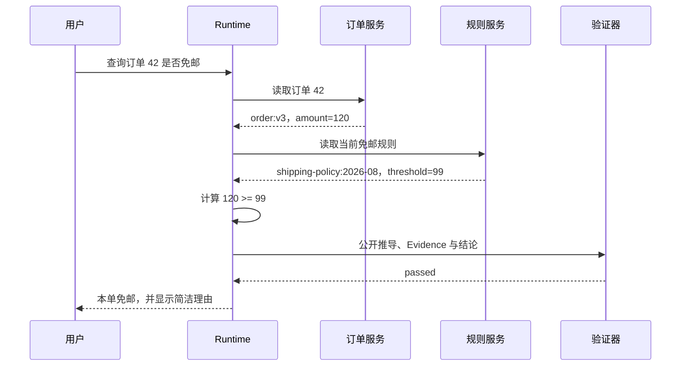

# 推理过程的使用边界与审计记录

订单金额是 120 元，当前免邮门槛是 99 元。系统回答“本单免邮”，这个结论很容易核对。若模型同时输出一大段解释，却把门槛写成 89 元，解释越完整，错误反而越像真的。

多步推理最容易出现这种错位：文字展示了连续步骤，事实前提却没有来源；模型说自己“置信度很高”，运行时也没有可验证证据；日志保存了整段模型输出，却回答不了当时查了哪个版本的规则。**理由写得顺，不等于结论正确，更不等于系统可审计。**

工程上需要区分四种东西：模型内部使用的推理计算、面向读者生成的解释、程序实际执行的动作轨迹，以及交付给审计或客服的决策摘要。它们可能谈论同一件事，但来源、用途和可信度不同。

::: info 四种产物各自负责什么

- **内部推理**：模型生成答案时使用的内部计算，不作为应用可依赖的业务接口。
- **公开解释**：给读者看的推导或理由，是模型输出的一部分，仍需验证。
- **运行时 Trace**：工具调用、参数摘要、Evidence、状态迁移和停止原因，由程序记录。
- **决策摘要**：根据已验证事实说明“采用了什么规则、得出什么结论”，不复述私有推理。

:::

这四者混在一起时，团队通常会把“模型写了很多步骤”误当成可解释性，把“日志里有 Prompt”误当成审计，把“推理 Token 增加”误当成答案一定更可靠。拆开之后，每项都有自己的验证方法。

## Chain of Thought 到底指什么

Chain of Thought 常译为思维链。早期提示工程里，它通常指让模型输出一串中间推导，再给最终答案。[Chain-of-Thought Prompting Elicits Reasoning in Large Language Models](https://arxiv.org/abs/2201.11903) 讨论了少样本推导示例对多步任务的影响；后续的 [Large Language Models are Zero-Shot Reasoners](https://arxiv.org/abs/2205.11916) 研究了用简短指令触发逐步回答。

这些方法产生的是**可见文本步骤**。它们能把计算、假设和结论摊开，便于人或程序逐项检查，但不能证明这段文字完整、忠实地复现了模型内部计算。模型可能先得到答案，再生成一段看起来合理的解释；也可能在解释里引入新错误。

现代推理模型还会使用不可见的 reasoning tokens。以 OpenAI Responses API 的[推理模型说明](https://developers.openai.com/api/docs/guides/reasoning#how-reasoning-works)为例，推理 Token 在最终输出前或工具调用之间参与模型计算，计入上下文和输出用量，但原始内容不会作为普通文本返回。应用可以看到用量字段，不能把 Token 数还原成推理正文。

因此，“让模型逐步回答”和“模型在内部进行推理”不是同一个接口。前者是可控制、可验证的输出格式；后者是模型能力的一部分。对推理模型反复要求“把每一步内部思考全部写出来”，既没有稳定接口保证，也可能让提示词变得冗长，干扰原本的任务约束。

## 内部推理、公开解释与 Trace 的边界

### 内部推理不是业务状态

模型内部推理可以影响下一段文本或下一次工具调用，但应用不应把它当作数据库里的事实状态。订单 ID、用户权限、活动规则版本和工具回执必须由程序保存，不能指望模型在内部记住。

当请求中断时，恢复逻辑需要知道哪个工具已经执行、哪个结果已经提交。内部推理无法提供这样的幂等凭据。即使供应商允许把 opaque reasoning item 传回后续调用，它仍是模型上下文的一部分，不是替代 Turn、事件或 Checkpoint 的持久层。

内部推理也不适合进入普通日志。Prompt、文档片段和模型中间内容可能包含用户数据、访问令牌或不可信指令。把整段内容写进日志标签会扩大暴露范围，也会让监控系统承担不必要的敏感数据。

### 公开解释是一份待验证的输出

读者需要知道“为什么免邮”，可以展示简洁推导：订单金额 120 元，当前规则门槛 99 元，120 大于等于 99，因此本单免邮。这段说明有三个可核对对象：输入金额、规则版本和比较结果。

公开解释可以比内部计算短，也可以按受众调整。客服页面可能只显示规则和结论；开发者排障页还会显示 Evidence ID、工具调用和版本。两者都不需要声称“这是模型完整的思考过程”。

公开解释仍可能错。金额来自旧订单、门槛引用旧 Release、比较符号写反，都能生成语法完美的文本。验证器应检查每个前提的来源、派生步骤的依赖和结论是否真的由前一步得到。

### Trace 记录程序实际做过什么

Trace 的承重点是可观察事件。免邮判断可以记录：入口收到请求摘要；`load_order` 返回订单版本与金额；`load_shipping_policy` 返回规则版本与门槛；确定性比较器产生布尔结果；回答生成器引用两个 Evidence；运行时以 `completed` 停止。

这些事件能回答故障发生在哪一层。订单工具超时，问题在依赖调用；规则版本错误，问题在配置或检索；模型把正确比较结果写反，问题在生成与验证。只保存一段“我检查了订单和规则，所以免邮”，无法定位责任层。

Trace 也不必保存所有正文。参数摘要、内容哈希、稳定 ID、版本、耗时、状态和错误类通常足够；需要复核原文时，通过 Evidence ID 回受控存储读取。

### 决策摘要面向解释和审计

决策摘要介于用户答案与底层 Trace 之间。它陈述采用了哪些经过验证的输入和规则，以及最终动作为什么被允许或拒绝。例如：“订单版本 `v3` 的金额达到规则版本 `shipping-2026-08` 的免邮门槛，系统返回免邮。”

这类摘要由可验证事实组装，不需要披露模型私有推理。高风险场景还应写明责任主体、策略版本和审批回执。摘要本身不是 Evidence，它只是把 Evidence 与决策关系讲清楚。

## 可公开推导怎样设计成可检查结构

自由文本步骤很难稳定解析。“然后”“所以”“显然”可能只是语言连接，不表示真实依赖。更可靠的结构为每一步分配 ID、类型、前置步骤和 Evidence 引用。

```json
[
  {
    "step_id": "s1",
    "kind": "given",
    "statement": "订单金额为 120 元",
    "premise_ids": [],
    "evidence_ids": ["order:v3"]
  },
  {
    "step_id": "s2",
    "kind": "given",
    "statement": "免邮门槛为 99 元",
    "premise_ids": [],
    "evidence_ids": ["shipping-policy:2026-08"]
  },
  {
    "step_id": "s3",
    "kind": "calculation",
    "statement": "120 大于等于 99",
    "premise_ids": ["s1", "s2"],
    "evidence_ids": []
  },
  {
    "step_id": "s4",
    "kind": "conclusion",
    "statement": "本单免邮",
    "premise_ids": ["s3"],
    "evidence_ids": []
  }
]
```

`given` 表示外部输入或已确认事实，必须绑定 Evidence；`calculation` 表示由前置步骤确定性推导；`conclusion` 是交付结果。程序可以检查 ID 是否唯一、前置步骤是否已经出现、Evidence 是否存在、最后是否有结论。涉及金额、权限和日期的运算还可以由领域代码重新计算。

这套结构不要求模型暴露内部推理。模型只需提供一份面向验证器的候选推导，验证器可以拒绝它。若某一步依赖后面的步骤，说明出现前向引用或循环；若 `given` 没有 Evidence，它只是未经证实的前提。

步骤数量不是质量指标。简单比较只需两条已知和一个结论，强制写十步会制造重复；复杂调试也不该把每句描述都升级为步骤。一个步骤是否应该存在，取决于它能否改变结论、接受独立验证，或帮助定位失败。

## 怎样让模型输出可验证的解释

提示词应描述任务目标、可用材料和输出合同，不要求模型复述私有思考。免邮判断可以要求：“依据给定订单与规则生成公开解释。每个外部事实必须引用 Evidence ID，派生步骤列出前置步骤，最后单独返回结论。不得增加材料中没有的金额或规则。”

这条提示把重点放在可验证产物上。模型是否在内部采用线性推理、并行比较或其他机制，不影响调用方。应用只接收步骤数组与最终答案，再执行自己的验证。

Zero-shot CoT 用一句逐步提示引导模型给出中间过程，接入成本低，但格式和粒度容易漂移。Few-shot CoT 提供一个或多个完整示例，模型更容易遵守领域表达；示例里的错误、过时规则和冗余步骤也会被模仿。生产模板应给结构示例，不要把真实订单、用户数据或内部策略放进 Prompt。

领域模板需要围绕可验证对象设计。数学任务列已知量、公式、计算和结果，每一步可以重新计算；代码排障列现象、候选原因、验证命令、实际输出与结论，不能在没有命令结果时直接宣布根因；知识问答列 Claim、Evidence 与适用版本，语言上的因果连接词不能代替来源。

结构化输出比解析自由文本稳定。可以用 JSON Schema 约束 `step_id`、`kind`、`premise_ids`、`evidence_ids` 和 `statement`，把 `final_answer` 放在独立字段。Schema 只保证字段形状，Evidence 是否存在、依赖是否成环、计算是否正确，仍由应用检查。

若只能接收文本，不要假定模型永远使用“步骤 1”或箭头。正则可以服务一次性 Demo，生产链路最好在协议层要求结构化返回。模型输出无法解析时，应产生 `invalid_reasoning_format`，保留原始响应的受控引用，并在额度内做一次格式修复；不能把最后一段随便当成最终答案。

最终答案与步骤需要做一致性检查。步骤推导“120 大于等于 99”，答案却写“不免邮”，结构完整仍要拒绝。简单领域可以由确定性代码从步骤重算结论；开放问题至少检查最终 Claim 是否出现在受支持步骤中，以及它是否绑定当前 Evidence。

格式修复只改结构。修复器可以把自由文本映射到步骤数组，不能趁机改金额、Evidence ID 或业务结论。修复前后对外部事实集合做比较，出现新事实就回到验证，而不是把“现在能解析”当成正确。

低置信度也应转成具体问题。模型自报不确定，系统可以检查缺的是事实、规则还是计算；验证器认为解释不连贯，则指出哪一步缺前提。只有一个低分而没有问题位置时，重新生成很可能只是换一种说法。

公开解释的长度由用户任务决定。简单事实直接返回结论和来源，多步推导保留必要中间状态；调试任务可以展示已执行命令和结果。统一要求固定五步或十步，会让简单问题充满空话，也会截断真正复杂的问题。

输出合同还应声明未知状态。材料不足时返回 `insufficient_evidence` 和缺失 Evidence 类型，不生成一段猜测；格式暂时无法修复时返回最后一个可验证答案与协议错误；验证发现高风险冲突时停止并交给对应策略或人工流程。

## 一次免邮判断产生哪些可观察结果

输入是“订单 42 是否免邮”。入口从认证上下文取得当前用户，只允许订单服务读取该用户可见订单。调用链如下：



模型可以负责把结果写成自然语言，也可以生成候选公开步骤。权限、金额和比较运算由应用控制。最终输出包含“本单免邮”和一段简洁说明，Trace 则关联请求 ID、两个工具动作、两个 Evidence、验证结果与停止原因。

若订单服务返回 404，运行时不能让模型猜一个金额；若规则服务超时，结果也不能默认使用模型记忆里的门槛。两条失败路径分别保留 `order_not_found` 和 `policy_unavailable`，公开解释只说明当前无法判断。

另一条故障路径是模型生成的推导引用 `shipping-policy:old`。当前 Evidence 集合中没有这个 ID，验证器返回 `unknown_evidence`，结论不交付。重新生成只能使用当前两个 Evidence，不得扩大订单范围或查询其他用户数据。

这次推演里，公开步骤解释结论，Trace 证明系统做过什么，Evidence 证明输入来自哪里。三者关系清楚后，不需要保存所谓“完整思维链”才能审计。

## OpenAI Responses API 暴露了哪些推理信息

OpenAI 当前的[推理模型文档](https://developers.openai.com/api/docs/guides/reasoning)将 reasoning tokens 与可见输出分开。响应的 `usage.output_tokens_details.reasoning_tokens` 可以显示本次使用了多少推理 Token，但这些 Token 的原始文本不会通过 API 返回。推理 Token 仍占用上下文并计入输出用量。

部分模型支持 opt-in 的 [reasoning summary](https://developers.openai.com/api/docs/guides/reasoning#reasoning-summaries)。请求中可以设置 `reasoning.summary`，响应的 reasoning item 可能包含摘要。支持值和可用性依模型而异，应查看对应模型文档。摘要是模型生成的说明，不是原始推理 Token，也不应作为事实证据。

```python
response = client.responses.create(
    model=selected_model,
    input="判断这笔订单是否免邮，并给出简洁理由。",
    reasoning={"effort": "low", "summary": "auto"},
)
```

这里的 `selected_model` 需要替换为当前账号可用、且文档明确支持相应参数的模型。文章不固定某个模型名，避免把随版本变化的能力写成永久事实。生产代码还要处理模型不支持摘要、摘要数组为空和响应不完整。

`max_output_tokens` 同时限制推理和可见输出。官方文档说明，达到限制时响应可能是 `incomplete`，甚至在可见文本生成前就已经耗尽额度。调用方要检查 `status` 与 `incomplete_details.reason`，不能只看 `output_text` 为空就当成模型没有回答。

使用工具的多步 Responses 调用还涉及 reasoning item 的上下文延续。官方文档建议把上一响应相关的 reasoning item、函数调用和函数结果完整传回，或使用 `previous_response_id`。这保证模型上下文连续，但仍不等于应用完成了审计。工具回执、权限与领域状态要进入自己的持久层。

### 模型上下文连续性不等于业务恢复

一次工具调用跨越两个模型请求时，模型需要看到前一轮产生的 reasoning item、函数调用和函数结果，否则它可能不知道某个动作已经完成。这里维持的是**模型输入的连续性**：后一个请求获得前一个请求里与推理有关的上下文，能够继续生成下一步。

业务恢复处理的是另一组问题。进程在工具执行后崩溃，系统必须判断这次调用有没有产生外部副作用、结果是否已经写入、重试会不会重复扣款或重复发信。reasoning item 不包含受信任的提交回执，也不能代替幂等键、任务状态和 Checkpoint。即使模型上下文仍可取回，运行时也要从自己的持久层恢复 Turn，读取最后一个已确认事件，再决定继续、补偿还是停止。

可以用一次“创建退款申请”看出区别：

1. 模型提出 `create_refund(order_id=42)`，运行时生成动作 ID `action-7`。
2. 退款服务返回业务回执 `refund-108`，运行时先保存回执，再把工具结果交回模型。
3. 模型根据工具结果生成用户答案。如果这一步前进程退出，新进程从 `action-7` 与 `refund-108` 恢复，不能再次调用退款服务。

后续模型请求可以通过前一响应继续上下文，也可以由应用重新组装必要输入。无论采用哪种方式，退款是否已经创建都由业务回执证明。模型说“退款已经完成”只是一段候选文本，缺少 `refund-108` 时不能交付。

这一区分还影响数据保留。为了恢复业务任务，应用通常要保存动作 ID、状态迁移、回执引用和策略版本；为了继续模型调用，只需按供应商接口要求保留或引用相关响应项。两类数据的访问角色、保留期限与删除条件可以不同，不能因为它们都属于一次请求就塞进同一条日志。

### 审计记录保留哪些内容

审计记录要让排障人员复原“程序做了什么”，同时控制用户正文和模型内容的暴露。适合长期关联的字段包括请求 ID、Turn ID、动作类型、参数摘要、Evidence ID、策略版本、状态迁移、错误类和停止原因。工具结果很大时保存内容哈希与受控对象引用，需要复核的人再经过权限检查读取原文。

原始 Prompt、完整检索片段、reasoning summary 和工具响应不适合直接进入指标标签。标签会被高频复制和聚合，既可能泄露内容，也会制造无法控制的高基数。需要短期调试这些正文时，应放在有访问控制的存储中，记录用途、访问者和删除时间；关闭调试后按策略清理，而不是让正文一直留在普通日志平台。

删除还要区分“移除正文”和“保留事件证明”。用户要求删除会话内容后，可以清除原始消息与检索正文，同时按合规和故障追踪需要保留不可逆摘要、事件类型、时间和删除回执。摘要只能用于一致性检查，不能被描述成匿名化后的原文，也不能拿来重新推断用户输入。

如果审计人员只能看到一段 reasoning summary，他无法确认工具是否执行；如果日志只剩工具名称而没有版本和回执，又无法判断执行结果是否适用于当前请求。可用的审计链应从稳定 ID 找到事件、Evidence 与策略裁决，并且每次读取敏感正文都留下新的访问记录。

::: warning Summary 只是一份面向使用者的摘要

Reasoning summary 可以帮助观察模型大致怎样处理任务，不能用来证明模型调用了某个工具、读取了某个版本，或满足了业务规则。验证这些事实仍要看 Trace、Evidence 和程序状态。

:::

## 用 Python 验证公开步骤和审计记录

下面的示例把 `PublicStep` 与 `DecisionRecord` 分开。前者是面向读者和验证器的候选推导；后者由运行时构造，只保存输入摘要、动作名、Evidence 版本、决策摘要、最终答案和停止原因。数据结构里没有原始思维链字段。

<<< ../../examples/ai-agent/reasoning_boundary.py

`validate_public_steps` 按顺序读取步骤。一个步骤只能引用已经出现的前置步骤，避免前向引用和简单循环；`given` 必须有 Evidence；派生步骤必须声明前提；最后一步必须是结论。它不评价自然语言里的复杂逻辑是否成立，因此生产系统还要给金额、日期、权限等领域运算增加确定性验证。

`build_decision_record` 对用户输入保存 SHA-256 摘要，不复制原始正文。摘要可用于关联同一输入和检查内容是否变化，但不能还原用户问题。动作和 Evidence 仍使用稳定 ID，便于从受控存储复核。

运行共享示例：

```bash
PYTHONPATH=examples/ai-agent \
python3 -m unittest discover -s examples/ai-agent/tests -p 'test_*.py'
```

当前执行得到 `Ran 50 tests` 和 `OK`。本篇新增四项：有效推导链通过；未知 Evidence 被拒；前向或循环前提被拒；审计记录只保存输入摘要和公开决策信息。它们没有调用真实模型，因此不能证明任何供应商的内部推理行为。

## 置信度为什么不能证明推理正确

模型自报“置信度 0.9”只是一段生成内容，除非经过专门校准，否则不能解释为九成正确率。按步骤数量、逻辑连接词和结论标记计算分数也很脆弱：一段循环论证可以包含很多“因为”和“所以”，格式得分很高，结论仍然错误。

更可靠的质量信号来自任务外部。数学计算重新执行；代码运行测试；事实 Claim 绑定 Evidence；工具动作核对回执；权限检查读取策略裁决。语义评估可以补充“解释是否完整”“有没有回应问题”，但不能替代这些确定性证据。

如果确实需要置信度，应明确它属于哪一层。检索分数描述候选相关性，分类概率描述模型对标签的分布，评估器评分描述某套标准下的判断。三者不能混成一个 `confidence`，也不能跨版本直接比较。

低分时的动作也不能一律“让模型再想一遍”。前提缺 Evidence 应重新检索或拒答；计算错误应重算；说明不清楚才适合改写。Reflection 文章讨论的有限修复正是把这些问题分类后再决定动作。

## CoT、Planning、ReAct、Reflection 与 ToT 的关系

这些模式都可能出现“步骤”，但控制对象不同。

| 模式 | 主要处理对象 | 是否调用外部工具 | 关键状态 | 失败时返回哪里 |
| --- | --- | --- | --- | --- |
| CoT 公开推导 | 一个候选解的中间论断 | 不一定 | 步骤、前提、结论 | 验证或重新生成 |
| Planning | 任务怎样拆成可执行分支 | 计划本身不执行 | SearchPlan、依赖、预算 | 编译器或 Coverage |
| ReAct | 动作与观察交替推进 | 是 | ToolCall、Observation、步数 | 运行时循环 |
| Reflection | 候选结果有哪些问题 | 视修复策略而定 | Issue、修复次数、候选版本 | 通过、拒绝或保留原结果 |
| Tree of Thoughts | 多条候选推导怎样搜索 | 不一定 | 分支、评分、剪枝、回溯 | 最佳候选或搜索上限 |

CoT 可以出现在 ReAct 的某次模型决策中，但 ReAct 的审计主体仍是工具动作和 Observation。Planning 可以让模型解释为什么拆成三条分支，真正可执行的是编译后的 SearchPlan。Reflection 可以检查公开推导是否缺前提，修复候选仍要重新验证。

ToT 会显式保留多条候选路径并进行比较或回溯，适合解空间确实存在分支的任务。CoT 只需要一条连续推导时成本更低。为了显得“推理高级”而给简单任务建立搜索树，只会增加状态、Token 与停止条件。

## 常见失败怎样定位

**解释很完整，前提却是假的**，先看 `given` 步骤的 Evidence。没有来源就删除该前提；来源版本错误就重新取当前版本。继续润色后续逻辑没有用。

**最终答案正确，中间步骤错误**，不能因为碰巧答对就通过。公开解释会误导读者，也可能在相似输入上产生错误。验证器应指出具体步骤，保留最终答案作为候选，重新生成或由确定性过程替换推导。

**步骤解析失败**，通常说明输出合同不稳定。生产接口优先使用结构化输出，不要用正则猜“Step”“因此”或箭头。解析失败是协议错误，不等于推理没有发生。

**推理消耗很多，却没有可见答案**，检查响应状态、`incomplete_details` 和推理 Token 用量。输出额度可能在内部推理阶段耗尽。修复方向是调整任务、上下文和输出预算，并用评测确认效果，不是循环追加“请给最终答案”。

**日志可以看到用户全文和模型中间内容**，说明可观测性越过了数据边界。改为保存摘要、稳定 ID、动作和错误类，正文放回受控存储；日志导出、保留时间和访问角色也要单独限制。

**Reasoning summary 与实际工具调用不一致**，以工具 Trace 为准。摘要是生成文本，可能压缩、遗漏或表述不精确；真实调用由运行时事件和回执证明。

## 哪些任务适合展示公开推导

公开推导适合需要多步计算、规则组合、条件判断和可验证解释的任务。每一步都有输入或前置关系，读者能检查哪里出错。教学场景也可以展示经过整理的解法，但应把它称为“解题步骤”或“解释”，不声称复现模型私有思维。

事实查询通常不需要长推导。读者更需要答案、来源和版本；创意写作没有固定推导链，强制分步会压缩表达空间；低延迟对话要权衡额外 Token 和首字等待时间。权限、审批和外部副作用的决策必须展示策略依据与回执，不能只给模型理由。

### 是否应该要求模型输出全部思考过程

不应该把“全部内部思考”作为稳定产品合同。可以要求简洁解释、关键假设、计算步骤、引用和验证结果，这些都是面向读者的输出，也更容易审查。

### Reasoning summary 能否直接写进审计日志

可以在符合隐私策略时作为调试材料保存引用或受控内容，但不能替代 Trace。摘要没有证明工具真的执行，也没有证明前提来自当前 Evidence。审计记录仍以运行时事件、版本和回执为准。

### 用户要求解释原因时应该返回什么

返回经过验证的公开理由：采用了哪些输入、规则怎样适用、结论是什么，以及还有哪些不确定项。没有证据支持的原因不要补写。需要保护安全规则或敏感配置时，只说明可公开的裁决依据。

### 怎样测试推理边界没有被破坏

至少准备四类反例：解释流畅但引用不存在；最终答案正确但中间步骤错误；模型摘要与工具 Trace 不一致；输出额度耗尽且没有可见文本。测试应断言系统依据 Evidence 和运行时状态裁决，而不是依据解释长度或模型自报置信度。
