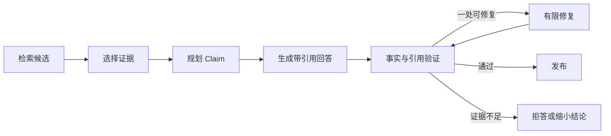

# Claim、Evidence、引用生成与答案验证

一段回答末尾列出三个链接，仍不足以证明每句话都有来源。模型可能引用了相关页面，却把页面没有写的结论补了进去。

证据驱动回答把内容拆成 Claim。Claim 是需要外部事实支持的最小结论；**Evidence** 是用户有权查看、能回到原文位置的证据对象。两者在生成前后都建立映射。

## 哪些句子是 Claim

“请按下面步骤操作”是组织语言，不一定需要外部证据。“远程申请需要直属负责人审批”是可验证事实，需要证据。

可以分四类：

| 类型 | 例子 | 处理 |
| --- | --- | --- |
| 事实 **Claim** | 申请需要负责人审批 | 必须绑定证据 |
| 数值 Claim | 审批有效期为 30 天 | 严格核对原文数字与单位 |
| 建议 | 建议提前准备设备信息 | 标明是建议，不能伪装制度 |
| 过程语言 | 下面分三步说明 | 无需外部引用 |

把整段当作一个 Claim 太粗。一个句子同时包含条件、期限和审批人时，可以拆成多个原子 Claim，分别验证。

## Evidence 对象需要什么

```text
evidenceId：稳定证据标识
sourceVersion：来源版本
titlePath：标题路径
location：页码或段落位置
quote：支持 Claim 的最小原文
visibleScope：本轮权限范围摘要
contentHash：防止引用内容被静默替换
```

Evidence 不是把任意 URL 贴上去。它要能证明“这段原文在这个版本和位置存在”，并在展示时继续检查用户权限。

### Evidence、Reference 和 Citation 不要混成一个字符串

这三个词在产品界面里可能都显示成“引用”，在系统里却承担不同职责：

| 对象 | 输入 | 保存的事实 | 输出给谁 |
| --- | --- | --- | --- |
| Evidence | 检索后通过 ACL/Release 检查的原文片段 | 原文、来源、版本、位置、Scope | 规划器、生成器、验证器 |
| **Reference** | 一个 Claim 与一条 Evidence 的绑定 | 支持关系、引用范围、绑定状态 | 验证器、审计和 Eval |
| **Citation** | 已验证 Reference 的展示形式 | 脚注编号、链接、页码或标题 | 最终用户 |

Evidence 可以被多个 Claim 复用；一个 Claim 也可能需要多条 Evidence 共同支持。Reference 是多对多关系的记录，不能只把 `[E1]` 拼在答案末尾。Citation 则是渲染层产物，改变脚注样式不应修改证据事实。

### Claim 为什么要原子化

“申请由直属负责人审批，通常一天完成，权限永久有效”包含审批人、时长、有效期三个可独立真假的结论。若把它作为一个 Claim，某条 Evidence 只支持前半句时，系统很难判断是保留还是删除。

原子 Claim 的输入是候选答案句子和语法/模型拆分结果，输出至少包含 `claim_id`、规范文本、类型和在答案中的字符范围。拆分不能改变否定、数字和条件。过度拆分也有代价：“只有在生产环境中”与“需要审批”分开后，条件可能丢失；所以原子化的标准是“可以用同一组 Evidence 独立判真，同时保留必要条件”。

### 支持关系不是简单的布尔值

Reference 可以保存 `full`、`partial`、`contradicted`、`unverified` 等状态：

- `full`：Evidence 完整支持 Claim 的主语、条件、数值和结论；
- `partial`：只支持一部分，Claim 必须收窄后才能保留；
- `contradicted`：原文明确给出相反结论，不能继续用补引用修复；
- `unverified`：尚未进行语义判断，不能渲染为最终 Citation。

确定性程序先检查证据是否存在、可见和同版本，再让 NLI/验证模型或人工判断语义支持。顺序反过来会把无权原文先交给模型。

## 建立 Claim、Evidence 与 Reference 契约

下面的代码只使用标准库。输入是两个 Claim、两条已通过检索门禁的 Evidence 和候选绑定；输出是可发布 Citation 或稳定错误。目标是看清 ID、版本、Scope 和原文引用如何一起校验，而不是让模型直接生成脚注。

```python
# Claim 保存待证明陈述，Evidence 保存可见原文事实，Reference 只负责把答案定位回来源。
from __future__ import annotations

from dataclasses import dataclass
from enum import StrEnum


class Support(StrEnum):
    FULL = "full"
    PARTIAL = "partial"
    CONTRADICTED = "contradicted"
    UNVERIFIED = "unverified"
# Claim 表示一个可单独核查的事实单元，后续必须为它找到证据或明确拒绝。


@dataclass(frozen=True)
class Claim:
    claim_id: str
    text: str
    answer_start: int
    answer_end: int
# Evidence 保存可追溯来源、稳定标识和可见范围，供 Claim 绑定与引用校验。


@dataclass(frozen=True)
class Evidence:
    evidence_id: str
    quote: str
    source_locator: str
    release_id: str
    scope_id: str
    content_hash: str
# Reference 保存可追溯来源、稳定标识和可见范围，供 Claim 绑定与引用校验。


@dataclass(frozen=True)
class Reference:
    claim_id: str
    evidence_id: str
    support: Support
# Citation 保存可追溯来源、稳定标识和可见范围，供 Claim 绑定与引用校验。


@dataclass(frozen=True)
class Citation:
    claim_id: str
    evidence_id: str
    label: str
    source_locator: str


# 构造函数把已验证字段组装成下游对象，不在这里引入新的权限或业务决策。
def build_citations(
    *,
    claims: dict[str, Claim],
    evidence: dict[str, Evidence],
    references: tuple[Reference, ...],
    expected_release: str,
    visible_scopes: set[str],
) -> tuple[Citation, ...]:
    citations: list[Citation] = []
    covered_claims: set[str] = set()

    for reference in references:
        claim = claims.get(reference.claim_id)
        item = evidence.get(reference.evidence_id)
        if claim is None or item is None:
            raise ValueError("reference points to an unknown object")
        if item.release_id != expected_release:
            raise ValueError(f"{item.evidence_id}: release mismatch")
        # 在数据进入下游前应用可信权限范围，用户文本和模型参数都不能扩大可见集合。
        if item.scope_id not in visible_scopes:
            raise PermissionError(f"{item.evidence_id}: scope denied")
        if reference.support is not Support.FULL:
            raise ValueError(f"{claim.claim_id}: claim is not fully supported")
        # 去掉首尾空白后仍为空，说明没有可处理输入；在模型或检索调用前直接拒绝。
        if not item.quote.strip() or not item.source_locator:
            raise ValueError(f"{item.evidence_id}: evidence is not locatable")

        covered_claims.add(claim.claim_id)
        citations.append(
            Citation(
                claim_id=claim.claim_id,
                evidence_id=item.evidence_id,
                label=f"[{len(citations) + 1}]",
                source_locator=item.source_locator,
            )
        )

    missing = set(claims) - covered_claims
    if missing:
        raise ValueError(f"claims without full evidence: {sorted(missing)}")
    return tuple(citations)
```

`Claim` 保存答案范围，让前端能把脚注放到对应结论后；`Evidence` 保存原文、定位、Release、Scope 和内容哈希；`Reference` 只表达绑定和支持状态；`Citation` 是通过全部门禁后的展示对象。

`build_citations` 先解析双方 ID，再检查 Release、权限、支持程度和原文定位。任何检查失败都会在生成展示 Citation 前停止。循环结束后还要检查每个 Claim 是否至少有一条完整支持，避免“引用表合法但某个事实没有引用”。`content_hash` 在这个内存示例中没有回查存储；生产实现要重新读取来源摘要或版本记录比对。

调用方必须把 `expected_release` 和 `visible_scopes` 从 Turn 快照注入，不能采用模型返回值。函数不做语义蕴含判断，`Support.FULL` 应来自前一阶段验证器；这条边界让权限与语义职责可以分别测试。

## 用测试审核正常、部分支持和越权引用

下面的测试直接复用引用构建实现，输入包含一个事实 Claim 和一条公开 Evidence。目标是检查正常 Citation 的定位，以及部分支持和越权不会被渲染。

```python
# 测试分别构造完整支持、只支持半句和来源越权，断言审核器给出不同终态。
import pytest

from citations import Claim, Evidence, Reference, Support, build_citations


CLAIMS = {"c1": Claim("c1", "申请由负责人审批", 0, 9)}
# EVIDENCE 按稳定顺序保存可追溯数据，避免重试或并发导致覆盖。
EVIDENCE = {
    "e1": Evidence("e1", "提交后由直属负责人审批", "page:3", "r8", "public", "hash-1")
}


# 这个用例核对证据与引用关系，防止无来源 Claim 被当成已经验证的答案。
def test_full_support_becomes_a_citation() -> None:
    result = build_citations(
        claims=CLAIMS,
        evidence=EVIDENCE,
        references=(Reference("c1", "e1", Support.FULL),),
        expected_release="r8",
        visible_scopes={"public"},
    )
    assert result[0].label == "[1]"
    assert result[0].source_locator == "page:3"


def test_partial_support_cannot_be_published() -> None:
    with pytest.raises(ValueError, match="not fully supported"):
        build_citations(
            claims=CLAIMS,
            evidence=EVIDENCE,
            references=(Reference("c1", "e1", Support.PARTIAL),),
            expected_release="r8",
            visible_scopes={"public"},
        )


# 这个用例固定权限边界：越权字段不能进入结果，也不能触达受保护的数据访问。
def test_invisible_evidence_is_rejected() -> None:
    with pytest.raises(PermissionError, match="scope denied"):
        build_citations(
            claims=CLAIMS,
            evidence=EVIDENCE,
            references=(Reference("c1", "e1", Support.FULL),),
            expected_release="r8",
            visible_scopes={"team-a"},
        )
```

执行 `python -m pytest -q`，预期三条通过。第一条输出可定位脚注；第二条证明部分支持需要先收窄 Claim；第三条证明语义正确也不能绕过 Scope。真实集成测试还要覆盖来源内容哈希变化、一个 Claim 多证据、多个 Claim 复用证据和引用位置失效。

## 从证据到答案的完整链



先选证据再规划 Claim，可以约束模型只提出能被当前资料支持的结论。开放式写作也可以先生成候选 Claim，再逐项检索，但最终仍要完成绑定。

## 五类验证分别看什么

### 事实支持

Evidence 的原文是否蕴含 Claim。不能只检查关键词重叠。例如原文写“管理员可以审批”，Claim 写“只有管理员可以审批”，多出了排他性。

### 引用位置

引用 ID、版本、标题路径和位置是否存在，quote 是否与存储内容一致。文档升级后旧引用不能悄悄指向新内容。

### 权限

引用与生成回答时使用的证据都在当前用户范围。即使检索层已过滤，发布前再做防御性检查。

### 隐私与安全

回答是否暴露敏感字段，是否把提示注入文字当作指令，是否包含不允许的跨用户信息。

### 输出契约

要求表格、JSON 或引用标记时，结构必须合法。格式正确不等于事实正确，两类检查都需要。

## 有限修复怎样避免无限循环

假设三个 Claim 中只有一个缺引用，可以把失败 Claim、允许证据和错误原因交给修复步骤，最多修复一次。修复只能删除、收窄或重新表述失败 Claim，不能访问更大范围。

若修复后仍失败，返回部分可靠答案并明确缺口，或整体拒答。无限“让模型再想想”会增加费用且可能产生更多变化。

## 手工审核一份回答

候选回答：

```text
远程访问申请需要直属负责人审批，审批通常在一个工作日内完成，
通过后权限永久有效。[E1]
```

E1 原文只写“提交后由直属负责人审批”。审核结果：

- “直属负责人审批”被 E1 支持；
- “一个工作日内完成”没有证据；
- “永久有效”没有证据；
- 一个引用放在整句末尾，容易让读者误以为三项都有来源。

合格修复是删除后两项，只保留“提交后由直属负责人审批 [E1]”。如果系统有其他证据，再分别引用。

## Claim 验证不是只靠另一个模型

验证可以组合：

- 确定性检查负责引用存在、版本、权限、数字格式和输出结构；
- NLI 或模型评审负责语义支持判断；
- 规则负责敏感字段和禁止内容；
- 人工抽查处理高风险或新分布样本。

使用模型做评审会引入新的概率误差，所以要用人工标注集测它的准确性，记录评审模型版本，并避免让生成模型自说自话地判定自己正确。

## 建立验证测试集

准备成对样本：

- 完全支持；
- 部分支持；
- 关键词相同但结论相反；
- 多了数字、期限或排他词；
- 引用版本过期；
- 引用不可见；
- Evidence 含提示注入；
- 没有证据但回答使用常识补齐。

发布门禁同时看误放和误拒。只追求“全部拒绝”会损害可用性，只追求“回答更多”会增加无依据结论。

## 带到工作的审核表

```text
Claim ID：
Claim 类型：事实 / 数值 / 建议
绑定 Evidence：
原文位置：
支持判断：完整 / 部分 / 不支持
权限检查：
隐私与注入检查：
处理：保留 / 收窄 / 删除 / 重新检索
```

审核时先填 Claim 和绑定证据，再根据原文判断支持程度；权限或注入检查不通过时，即使语义一致也不能保留。输出的处理结论会直接决定回答是保留、收窄、删除还是重新检索。到了系统治理层，还要让权限、注入防护、Eval、Trace、成本和 Deadline 共享同一条版本链，否则单次回答通过验证，也无法证明长期运行质量稳定。

## 证据验证的适用范围

这套 Claim 检查适合需要向读者展示依据的知识问答、报告和检索增强回答。它不能证明来源本身真实，也不能替代高风险领域的人工审批；来源权限、版本和更新时间仍要由数据系统记录。若问题只是闲聊或纯创作，强行拆 Claim 只会增加延迟和格式负担。

## 常见问题

### Claim、Evidence、Reference 和 Citation 分别是什么？

Claim 是答案中需要被证明的原子陈述；Evidence 是当前 Scope 与 Release 下可见、带原文位置的事实对象；Reference 是来源文档、页码或片段的稳定定位；Citation 是最终文本中把某个 Claim 指向 Reference 的展示关系。把四者压成一个引用字符串后，系统无法判断哪句话由哪段原文支持，也无法在权限撤回或版本变化时重新验证。

### 为什么一个长句要拆成多个 Claim？

“服务由 A 团队负责并且只能周二发布”包含所有权与时间限制两个可独立真假的事实，可能来自不同来源。若作为一个 Claim，只找到团队证据时，验证器很容易把整句判为支持。原子化后，每个 Claim 有稳定 ID、类型和必要证据槽，支持状态可以分别是完整、部分或冲突。拆分不是按标点机械切句，而是按能独立验证和引用的最小陈述划分。

### 关键词相同，为什么 Evidence 仍可能不支持 Claim？

**支持关系**取决于语义、范围、时间和否定条件，不是词重合。Claim 说“所有环境都支持”，原文说“仅测试环境支持”，关键词高度一致但结论相反；原文版本过期或只覆盖一个条件，也只能部分支持。确定性验证器先检查引用存在、Scope、Release 与原文位置，语义验证再比较主语、关系、数值、限定词和否定。高相似度不能替代逐 Claim 审核。

### 一份 Evidence 可以支持多个 Claim 吗？

可以，只要原文确实分别支持，并为每条绑定记录具体范围。一个段落可能同时说明负责人和操作步骤；验证器仍要逐 Claim 判断，不能因为第一条通过就自动放行其他条。反过来，一个 Claim 也可能需要多份 Evidence，例如跨文档比较或多跳关系。关系表应保存 Claim ID、Evidence ID、支持等级和验证版本，引用展示再聚合，而不是复制同一段文本。

### 引用存在且位置正确，是否就能发布答案？

不够。Reference 可定位只证明对象存在，还要检查 Evidence 对当前用户可见、属于固定 Release、未被撤回、正文没有敏感信息，并且语义真正支持 Claim。还要检测不同 Evidence 是否冲突。高风险领域可能需要人工审批或来源真实性验证。Citation 是可解释性入口，不是正确性的装饰；一个链接能打开，不代表链接内容证明了答案。

### 无证据时模型凭常识回答可以吗？

取决于产品边界。只读知识 Agent 若承诺答案来自指定资料，无证据时应说明未找到或请求澄清，不能用模型预训练知识补齐后伪装成库内事实。若产品允许通用知识，必须把它标成不同来源和置信边界，不能生成资料引用。Eval 要包含无资料与越权样本，检查错误成功终态。是否允许常识回答是明确策略，不应由模型临场决定。
