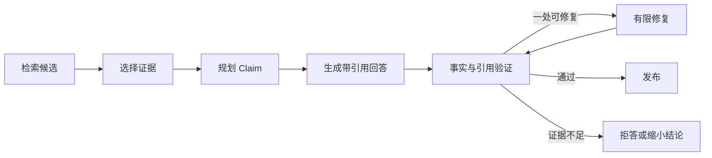

# Claim、Evidence、引用生成与答案验证

一段回答末尾列出三个链接，并不能证明每句话都有来源。模型可能引用了相关页面，却把页面没有写的结论补了进去。

证据驱动回答把内容拆成 Claim。Claim 是需要外部事实支持的最小结论；Evidence 是用户有权查看、能回到原文位置的证据对象。两者在生成前后都建立映射。

## 哪些句子是 Claim

“请按下面步骤操作”是组织语言，不一定需要外部证据。“远程申请需要直属负责人审批”是可验证事实，需要证据。

可以分四类：

| 类型 | 例子 | 处理 |
| --- | --- | --- |
| 事实 Claim | 申请需要负责人审批 | 必须绑定证据 |
| 数值 Claim | 审批有效期为 30 天 | 严格核对原文数字与单位 |
| 建议 | 建议提前准备设备信息 | 标明是建议，不能伪装制度 |
| 过程语言 | 下面分三步说明 | 无需外部引用 |

把整段当作一个 Claim 太粗。一个句子同时包含条件、期限和审批人时，可以拆成多个原子 Claim，分别验证。

## Evidence 对象需要什么

```text
evidenceId：稳定证据标识
sourceVersion：来源版本
titlePath：标题路径
location：页码或段落位置
quote：支持 Claim 的最小原文
visibleScope：本轮权限范围摘要
contentHash：防止引用内容被静默替换
```

Evidence 不是把任意 URL 贴上去。它要能证明“这段原文在这个版本和位置存在”，并在展示时继续检查用户权限。

## 从证据到答案的完整链



先选证据再规划 Claim，可以约束模型只提出能被当前资料支持的结论。开放式写作也可以先生成候选 Claim，再逐项检索，但最终仍要完成绑定。

## 五类验证分别看什么

### 事实支持

Evidence 的原文是否蕴含 Claim。不能只检查关键词重叠。例如原文写“管理员可以审批”，Claim 写“只有管理员可以审批”，多出了排他性。

### 引用位置

引用 ID、版本、标题路径和位置是否存在，quote 是否与存储内容一致。文档升级后旧引用不能悄悄指向新内容。

### 权限

引用与生成回答时使用的证据都在当前用户范围。即使检索层已过滤，发布前再做防御性检查。

### 隐私与安全

回答是否暴露敏感字段，是否把提示注入文字当作指令，是否包含不允许的跨用户信息。

### 输出契约

要求表格、JSON 或引用标记时，结构必须合法。格式正确不等于事实正确，两类检查都需要。

## 有限修复怎样避免无限循环

假设三个 Claim 中只有一个缺引用，可以把失败 Claim、允许证据和错误原因交给修复步骤，最多修复一次。修复只能删除、收窄或重新表述失败 Claim，不能访问更大范围。

若修复后仍失败，返回部分可靠答案并明确缺口，或整体拒答。无限“让模型再想想”会增加费用且可能产生更多变化。

## 手工审核一份回答

候选回答：

```text
远程访问申请需要直属负责人审批，审批通常在一个工作日内完成，
通过后权限永久有效。[E1]
```

E1 原文只写“提交后由直属负责人审批”。审核结果：

- “直属负责人审批”被 E1 支持；
- “一个工作日内完成”没有证据；
- “永久有效”没有证据；
- 一个引用放在整句末尾，容易让读者误以为三项都有来源。

合格修复是删除后两项，只保留“提交后由直属负责人审批 [E1]”。如果系统有其他证据，再分别引用。

## Claim 验证不是只靠另一个模型

验证可以组合：

- 确定性检查负责引用存在、版本、权限、数字格式和输出结构；
- NLI 或模型评审负责语义支持判断；
- 规则负责敏感字段和禁止内容；
- 人工抽查处理高风险或新分布样本。

使用模型做评审会引入新的概率误差，所以要用人工标注集测它的准确性，记录评审模型版本，并避免让生成模型自说自话地判定自己正确。

## 建立验证测试集

准备成对样本：

- 完全支持；
- 部分支持；
- 关键词相同但结论相反；
- 多了数字、期限或排他词；
- 引用版本过期；
- 引用不可见；
- Evidence 含提示注入；
- 没有证据但回答使用常识补齐。

发布门禁同时看误放和误拒。只追求“全部拒绝”会损害可用性，只追求“回答更多”会增加无依据结论。

## 带到工作的审核表

```text
Claim ID：
Claim 类型：事实 / 数值 / 建议
绑定 Evidence：
原文位置：
支持判断：完整 / 部分 / 不支持
权限检查：
隐私与注入检查：
处理：保留 / 收窄 / 删除 / 重新检索
```

审核时先填 Claim 和绑定证据，再根据原文判断支持程度；权限或注入检查不通过时，即使语义一致也不能保留。输出的处理结论会直接决定回答是保留、收窄、删除还是重新检索。下一章把单次回答提升到系统治理：权限、注入、Eval、Trace、成本和 Deadline 要在同一版本链中协作。

## 证据验证的适用范围

这套 Claim 检查适合需要向读者展示依据的知识问答、报告和检索增强回答。它不能证明来源本身真实，也不能替代高风险领域的人工审批；来源权限、版本和更新时间仍要由数据系统记录。若问题只是闲聊或纯创作，强行拆 Claim 只会增加延迟和格式负担。
