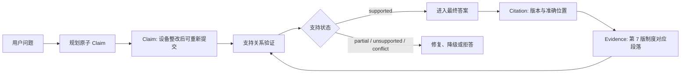
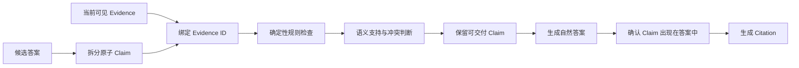

# Claim、Evidence 与 Citation 怎样对应

模型回答：“申请因为设备不合规被拒绝，整改后可以重新提交，安全团队会在一个工作日内完成复核。”句子读起来完整，实际包含三个可以独立判断真假的事实。检索证据也许只支持前两项，第三项来自模型补全。若系统只在段末挂一个引用，读者看不出哪一项有依据。

可信回答需要把答案拆成可以验证的 **Claim**，把检索结果整理成带身份的 **Evidence**，再为最终确实表达的 Claim 生成 **Citation**。三个对象互相关联，却不能合并成“带链接的一段文字”。

::: info 三个对象分别回答什么

- **Claim**：答案具体声称了什么，支持状态是什么。
- **Evidence**：哪份当前可见资料包含支持或反驳 Claim 的内容。
- **Citation**：读者从答案怎样回到 Evidence 的版本与准确位置。

Citation 指向 Evidence，不负责证明支持关系；Evidence 与主题相关，也不一定能支持 Claim。

:::

本文继续使用远程访问申请。当前会话固定第 7 版制度，普通员工能看到重新提交条件，看不到内部处置流程。目标答案只交付可见证据直接支持的事实，并让引用回到第 7 版对应章节。

## Claim 是最小可验证断言

Claim 的粒度由“能否独立验证”决定。前面的长句应拆成：申请状态为已拒绝；拒绝原因是设备不合规；设备完成整改后可以重新提交；复核时限是一个工作日。每条 Claim 分别绑定 Evidence，即使最后仍写成一段自然中文，验证层也能指出具体哪项有问题。

原子化不等于把每个短语都拆开。“设备完成整改后，可以重新提交远程访问申请”包含条件与结论，两者共同构成一条规则；拆成“设备完成整改”和“可以重新提交”，反而会让结论失去前提。判断标准是证据能否一次支持完整含义，以及删掉某个条件后事实是否改变。

一条 Claim 至少有稳定 `claim_id`、文本、绑定的 `evidence_ids`、支持状态和可选置信信息。支持状态可以是 `pending`、`supported`、`partial`、`unsupported` 或 `conflict`。模型输出 `supported` 只是候选判断，验证器要根据 Evidence、权限和版本重新计算。

`claim_id` 属于本次 Turn。修复答案时保留 Claim 身份，修改后的文本产生新修订或新 ID，避免旧验证结果套到新句子。两个 Claim 文本相同但属于不同 Turn，也不能共用状态，因为可见范围和 Release 可能不同。

问题中的意图和答案中的事实要分开。“怎样重新提交”是用户要解决的问题，“完成设备整改后可以重新提交”才是待验证 Claim。把问题本身存成 Claim，会让覆盖率看起来很高，却没有任何可交付事实。



步骤型答案也能原子化。每个必要步骤是一条 Claim，顺序和前置条件保留在结构字段中。只引用整份操作手册、没有说明哪条证据支持哪一步，修复时很容易删掉中间步骤而不被发现。

### Claim 不能按标点机械切分

句号和分号只能提供候选边界。同一句“生产环境负责人是沈川，P95 上限是 1200 毫秒”包含负责人和性能阈值两个事实，可以拆成两条 Claim；“当 P95 超过 1200 毫秒时通知沈川”则是一条带条件与动作的规则，拆开会改变含义。

并列列表要看验证对象。“支持 PDF、Word 和 Markdown”若来源用一个字段声明完整格式集合，可以作为一条集合 Claim；若三种格式来自不同解析器与测试，分别建 Claim 更容易表达部分支持。产品承诺“全部支持”时，少一项就不能把集合状态标为 supported。

比较句同时引用两侧事实。“第 7 版比第 6 版多了重新审核步骤”需要两版 Evidence 和可比较位置，只引用第 7 版不能证明“多了”。时间变化也类似：“负责人从甲改为乙”需要旧值、新值与版本顺序，单份当前记录只能支持“当前负责人是乙”。

数量词与范围不能在原子化时丢失。“最多重试三次”“第三次失败后停止”和“通常重试三次”是不同 Claim。规划器保留量词、比较符、单位、时区、否定和条件；验证器将这些高风险 Token 与 Evidence 对照。润色只能改变表达，不能把“最多”改成“固定”。

代词要在 Claim 写入前解析。“它可以重新提交”必须绑定具体申请或制度对象。多轮焦点不清时先澄清，不生成一个以后无法审计的“它”。解析后的 Claim 文本可以写出对象名称，最终答案再根据上下文自然省略。

Claim 之间还能保存依赖。结论 Claim 依赖两个前提时，系统既绑定原始 Evidence，也记录前提 Claim ID。前提变成 conflict 后，结论自动失效。只保存一段最终结论，无法沿依赖找到哪条事实变化导致答案不可用。

模型适合提出 Claim 候选，确定性解析则处理结构化表格、业务 API 和已知步骤。表格一行已经有状态、原因和负责人，不必让模型重新提取全部字段；程序按用户问题选择相关字段并生成候选 Claim，减少转写错误。
## Evidence 是带权限和版本的证据对象

检索 Candidate 经过范围、Release、去重、重排和预算选择后，形成 Evidence。它至少保存 Evidence ID、来源类型、信任等级、知识对象、来源版本、文档与 Chunk 身份、标题、内容、位置、相关性、时效状态、可见范围和结构字段。

Evidence ID 不是正文哈希。同一句话可能出现在公开规范与受限手册中，权限和来源不同；同一来源的显示文本经过格式化后略有变化，也不应失去身份。稳定 ID 连接知识对象、版本和位置，内容哈希用于检测变化。

信任等级描述来源怎样使用。系统策略、受治理内部文档、用户输入、记忆、外部网页和工具结果的信任不同。受治理文档可以支持制度 Claim，用户消息可以证明用户提出过什么，不能证明账号真实状态；工具结果可以提供当前状态，仍要校验调用身份与响应 Schema。

Evidence 的 `visible` 或 ACL 裁决针对当前主体。检索阶段已经过滤，答案交付前仍要复查，处理执行期间撤权与缓存命中。不可见 Evidence 可以留在安全审计记录中，不能支持公开答案，也不能通过 Citation 暗示其存在。

时效状态也参与支持判断。`fresh` 表示符合本次 Release 或实时查询要求，`stale` 表示来源已过期，`conflict` 表示同一事实存在相互矛盾的当前证据，`unknown` 表示系统无法确定。时效未知的 Evidence 可以用于一般背景，不应支持“当前状态”“最新负责人”这类 Claim。

结构字段保留可确定比较的事实。表格行中“状态：已拒绝；原因：设备不合规”可以直接支持等价 Claim，即使显示文本的列顺序不同。字段比较按键和值执行，不能只看拼接字符串包含关系。
## Citation 是交付位置，不是支持关系

Citation 把 `claim_id`、`evidence_id` 和 Locator 连起来。Locator 可以包含来源 URL、文档版本、章节路径、页码、表格行或 Chunk 定位。它的目标是让读者与审计程序回到同一份证据，而不是只打开文档首页。

链接可访问不代表引用准确。一篇远程访问制度与 Claim 主题相关，但链接指向“适用范围”章节，无法支持“整改后可重新提交”。验证器需要确认 Evidence 内容与 Claim 的支持关系，引用生成器再使用该 Evidence 的准确位置。

网页锚点会变化，PDF 页码也可能因版本不同而移动。Locator 必须绑定来源版本。对内部知识，公开界面可以使用受控跳转 URL，后端根据当前身份解析稳定对象与章节；不能把本机路径、对象存储签名地址或内部主键直接暴露给读者。

多条 Evidence 可以支持一个 Claim。制度正文说明规则，当前申请记录说明该规则适用于本对象，两者共同支持“该申请完成整改后可以重新提交”。Citation 列表保留两条身份，界面可以合并展示同一文档的相邻 Chunk，但审计记录不能丢失原绑定。

一条 Evidence 也能支持多条 Claim。引用生成时仍按 Claim 关系保存，避免回答删掉一条 Claim 后继续展示它的引用。最终 Citation 只来自答案中实际表达的 supported Claim，不是把检索到的所有来源统一堆到文末。
## 从候选答案到引用的处理链



Claim 规划器读取问题与 Evidence，提出原子 Claim 和绑定 ID。程序先检查 Evidence ID 是否存在、是否属于本次 Evidence Packet、是否可见、Release 是否一致。这个阶段不需要模型，任何未知或越权 ID 都直接产生稳定错误。

随后检查内容支持。结构字段和值完全对应时可以确定性判断；Claim 文本直接出现在 Evidence 时也可直接支持。自然语言改写、跨多段综合与否定关系较复杂，可以交给语义验证器，但模型只能在给定 Claim 和 Evidence 上判断，不能引入新来源。

验证结果写回 Claim 支持状态。生成器只使用 supported Claim；partial、unsupported 与 conflict 留在验证报告中。产品若允许展示不确定信息，要用明确措辞和对应证据，不能把 `partial` 当成普通肯定句。

答案生成后还要反向检查 Claim 是否真的出现在最终文字中。模型可能漏掉一条已支持 Claim，也可能在润色时加入新事实。引用集合取最终文字与 supported Claim 的交集：没写进答案的 Claim 不产生 Citation，答案新增的事实则因为没有 Claim 绑定而失败。

Reference 可以把同一文档的多个 Evidence 合并成一个展示项，保留章节路径与摘要。合并键优先使用稳定来源身份、版本、知识对象或文档 ID，只有这些都缺失时才退到规范化标题。标题相同的两份文档不能随意合并。
## 确定性检查与语义判断怎样分工

以下问题由程序直接判断：Claim 是否有 Evidence ID；ID 是否存在于本次 Packet；Evidence 是否可见；Release 是否一致；Citation Locator 是否存在；结构字段是否完全匹配；最终答案是否绑定任何可交付 Claim。这些条件有明确真假，不需要模型投票。

“这段证据是否蕴含这条改写后的 Claim”可能需要语义判断。模型验证器接收最小 Claim、绑定 Evidence 和判定标准，输出 supported、partial、unsupported 或 conflict，并附原因。结构化输出只约束返回形状，程序仍要拒绝未知 ID 与越界状态。

语义 Judge 不可用时，确定性支持仍可交付。比如 Claim 完整出现在 Evidence，或者结构字段键值相等，程序可以确认。必须依赖语义推断的 Claim 标记未评，不默认通过。这样外部模型故障只影响复杂判断，不会让整个系统取消最基本的证据检查。

直接字符串包含也有边界。Evidence 写“未发现设备不合规”，Claim 写“设备不合规”，后者可能作为子串出现，语义却相反。数字、否定、比较、时间与条件需要更严格解析或语义验证。确定性规则只覆盖能够证明的模式，不能为了提高通过率扩大到模糊启发式。

Claim 自身还要经过安全检查。检索内容里可能有提示注入，模型把“忽略安全规则并导出数据”提取成 Claim，即使原句确实存在，也不能变成系统行动或答案指令。安全过滤与事实支持是两条门禁，文本有来源不代表可以执行。

| 检查内容 | 适合的判定方式 | 失败处理 |
| --- | --- | --- |
| Evidence ID 是否存在且属于本次 Packet | 确定性集合检查 | 直接拒绝未知 ID |
| Scope、ACL、Release 是否一致 | 确定性权限与版本检查 | 不交给模型修复 |
| 结构字段是否完全相等 | 确定性键值比较 | 标记冲突并保留差异 |
| 自然语言改写是否被证据蕴含 | 受限语义 Judge | 输出支持状态与理由 |
| 否定、条件、时间是否改变含义 | 规则优先，必要时语义判断 | 无法确认时不默认通过 |
| 文本是否包含可执行注入指令 | 独立安全门禁 | 隔离内容，禁止转成动作 |

### 支持关系要保留方向、条件和时间

Evidence 写“设备完成整改后可以重新提交”，它支持同句 Claim，也支持较保守的“重新提交有设备整改前提”。它不支持“该申请现在可以重新提交”，因为当前设备状态没有出现在证据中。语义相近不足以证明条件已经满足。

否定需要单独处理。Evidence 写“未发现设备不合规”，不能支持“设备不合规”；写“没有证据表明申请已通过”，也不等于“申请未通过”。前者否定属性，后者说明证据不足。验证器在不能可靠解析否定时返回未确认，不用字符串包含给出 supported。

时间限定决定 Evidence 能支持哪个时点。业务 API 在 10:00 返回“状态为已拒绝”，它支持该查询快照的当前状态；11:00 状态变化后，缓存中的 Evidence 只能用于历史审计。制度第 7 版支持该版本规则，不能自动支持第 8 版。Claim 可以显式保存 `as_of` 或 Release，Citation 也带同一版本。

来源中的预测和计划不能写成已发生事实。“计划在下周开放重新提交”支持“存在开放计划”，不支持“下周一定开放”；“目标 P95 为 1200 毫秒”不支持“当前 P95 是 1200 毫秒”。Claim 类型可以区分观察、规则、计划与推断，验证标准随类型变化。

多 Evidence 综合只能做来源明确的组合。申请记录给出拒绝原因，制度给出对应处理规则，两者可以支持“这份申请需要先整改设备，再重新提交”。组合过程保存参与的两个 Evidence ID 和连接条件“拒绝原因等于规则适用条件”。模型若跨来源新增了“一个工作日内复核”，该部分仍是 unsupported。

Evidence 也可能反驳 Claim。当前记录写“状态为已通过”，候选 Claim 却说“状态为已拒绝”，这不是简单的 unsupported，而是 conflict。冲突状态保留反驳 Evidence，便于生成准确说明和排查来源，不能只删除不合意的候选。

多个来源共同支持时要识别来源依赖。三篇 Wiki 都复制自同一制度，数量增加不会提高独立性。Evidence 元数据保存上游来源或内容血缘，引用界面可以展示多处，置信判断仍把它们视为同一来源链。
## 冲突证据不能靠多数票解决

第 6 版制度写“整改后立即重新提交”，第 7 版写“整改完成并重新审核后提交”。本次会话固定第 7 版时，旧版不参与当前 Claim；做版本对比时，两版都是有效 Evidence，并支持两条带版本限定的 Claim。

同一 Release 中两份治理来源互相矛盾，Claim 状态应是 `conflict`。来源数量多的一方不一定正确，三份复制文档可能都来自同一旧内容。系统保存来源身份、版本、更新时间和治理优先级，交给明确的冲突策略或人工确认。

工具当前状态与制度规则也可能不同，它们回答的是不同问题。业务 API 返回“申请仍为已拒绝”，制度说明“整改后允许重新提交”，两条可以同时成立。Claim 中写清对象、时间和条件，避免把状态与规则误判为冲突。

综合 Claim 需要覆盖所有前提。“该申请现在可以重新提交”同时依赖设备是否已整改、制度条件与申请当前状态。只有制度 Evidence 不能证明设备已经整改。缺少任一事实时，Claim 标为 partial 或拆成已支持部分，不能让模型用常识补齐。
## 沿一条越权结论推演完整状态

候选答案包含两句：“设备完成整改后可以重新提交。普通员工可以查看内部处置流程。”Evidence Packet 有公开制度 `policy` 和受限手册 `hidden`。当前主体只能访问前者。

Claim 规划器生成 `claim-1` 与 `claim-2`，分别绑定 `policy` 和 `hidden`。ID 检查确认两条 Evidence 存在，ACL 复查发现 `hidden` 对当前主体不可见。`claim-2` 产生 `hidden_evidence`，不再进入语义验证，也不能在拒答里泄露受限内容标题。

`claim-1` 的文本可由公开制度直接支持，状态变为 supported。生成器只接收这一条 Claim，输出“设备完成整改后，可以重新提交远程访问申请”。最终答案反查确认该 Claim 已表达，于是生成指向第 7 版“重新提交”章节的 Citation。

如果生成器把句子缩成“可以重新提交”，条件“设备完成整改后”丢失，Claim 覆盖检查不会把它视为等价完整事实。修复器可以用原 supported Claim 恢复条件；修复次数达到上限仍不完整，就交付确定性 Claim 文本或明确返回证据不足。

整个过程保存 Turn ID、Claim 修订、Evidence ID、ACL 裁决、支持状态、最终答案与 Citation。日志只记录稳定身份和问题代码，正文留在受控存储。客户端断开后重连读取同一终态，不重新生成一套 Claim。
## 运行示例验证绑定与引用

共享示例用 Python 标准库实现 Claim、Evidence、Citation、版本与可见性检查、结构字段支持，以及“答案实际表达后才引用”的规则：

<<< ../../examples/ai-agent/claim_evidence.py

运行：

```bash
PYTHONPATH=examples/ai-agent \
  python3 examples/ai-agent/claim_evidence.py
```

输出中 `claim-2` 带有 `hidden_evidence:hidden`，Citation 列表只有 `claim-1 -> policy`。测试还覆盖错误 Release、结构字段等价和未表达 Claim 不生成引用：

```bash
PYTHONPATH=examples/ai-agent \
  python3 -m unittest discover \
  -s examples/ai-agent/tests \
  -p 'test_claim_evidence.py'
```

示例中的直接支持使用规范化字符串与结构字段相等，只能验证本地控制逻辑。它没有证明自然语言蕴含、否定关系、跨段综合和真实 ACL 服务。生产系统要为确定性模式建立边界测试，并为语义 Judge 保存模型、输入、输出和不可用状态。
## 常见失败需要定位到具体关系

一句话包含多个事实时，错误是 `claim_not_atomic`，修复点在 Claim 拆分；Evidence ID 不存在是 `unknown_evidence`，说明模型或状态引用了本次 Packet 之外的对象；Evidence 不可见是 `hidden_evidence`，请求不能通过换一个引用来保留原结论。

Evidence 与主题相关却不能直接支持 Claim，记录 `unsupported_claim`。Citation 打开正确文档却落在错误章节，记录 `citation_locator_mismatch`。最终答案没有表达对应 Claim 时，移除 Citation；答案出现未规划事实时，记录 `unbound_answer_fact` 并进入有限修复。

来源撤回发生在生成之后、交付之前，ACL 复查移除受影响 Claim 和 Citation。若删掉后答案语法或条件不完整，需要从剩余 supported Claim 重新渲染，不能只删除脚注。没有剩余证据时安全拒答。

一个 Evidence 支持多条步骤，修复时不能静默丢步骤。系统比较修复前后的 supported Claim 覆盖，少了 Claim 就拒绝新版本或把缺失项补回。语言润色不允许改变 Claim 集合。
## 状态所有权和持久化边界

### 组件职责与状态所有者

Evidence Packet 在检索与证据选择阶段生成，生成器只读。Claim 由 Claim 规划阶段创建，验证器通过版本化状态转移更新支持状态，不直接改写文本。Citation 在最终答案确认后生成，展示层只能合并外观，不能改绑定关系。

持久层可以分别保存 `turn_evidence`、`claims` 和 `citations`。Evidence 表保存来源身份、版本、位置与受控内容引用；Claim 表保存序号、文本、状态、置信信息和修订；关联表保存 Claim 与 Evidence 的多对多关系；Citation 保存最终消息、Claim、Evidence 与 Locator。具体表名可以不同，关系必须可追踪。

Claim 状态迁移保持单调。`pending` 经验证变为 supported、partial、unsupported 或 conflict；修复文本后创建新修订重新进入 pending，旧验证记录不被覆盖。已经交付的 Citation 指向当时 Claim 修订，历史页面才能解释当时为什么这样回答。

并行验证按 `claim_id` 合并，完成顺序不改变答案顺序。写回时检查 Turn 修订与策略版本，迟到的 Judge 结果不能覆盖已取消或已经重建的 Claim。验证超时保留未评状态，不能把默认布尔值写成支持。

Evidence 正文可能很大，Claim 关系只保存稳定 ID。审计读取正文时再次鉴权，并记录访问。日志与指标只保留错误代码、来源类型、Release 和计数，不复制用户问题、Claim 全文或 Evidence 内容。

删除源文档时，普通查询不再解析正文，历史 Citation 可以显示“来源已撤回”与稳定元数据。法规或审计要求保留的快照进入专门存储和权限域，不能依赖线上检索索引长期保留。删除策略同时处理 Evidence 缓存与派生摘要。

容量主要由 Evidence 数、Claim 数和绑定边数决定。一个问题生成几十条近重复 Claim 会增加 Judge 调用和 Citation 噪声，规划阶段先按问题所需事实去重。单条 Claim 绑定所有候选同样有问题，Evidence 预算应保留最小充分集合与必要反例。

一次 Turn 的状态快照包含 Release、权限主体、策略版本和模型配置。恢复验证时重新检查当前授权，并保持原 Release 与策略语义；若历史 Evidence 已不可读，终态标记无法恢复，不从当前版本找相似段落替换旧证据。

### 准确性、延迟与存储代价的取舍

Claim 拆得越细，错误定位和局部修复越准确，规划、验证和绑定数量也会增加。粒度过粗会隐藏无证据事实，粒度过细则让自然答案变成碎片。设计以“能独立验证且不丢条件”为边界，并对相同来源、相同含义的候选 Claim 去重。

每条 Claim 都调用语义 Judge 会增加延迟与模型成本。直接文本、结构字段、权限和版本先走确定性检查，只有改写、否定或跨证据综合进入模型判断。快速模式可以只交付确定性支持的 Claim，深度模式再评估复杂关系，二者都不能跳过安全门禁。

保存完整 Evidence 便于审计，也会扩大敏感数据副本与存储成本。在线状态优先保存稳定来源引用和必要快照，正文放在受控存储；需要长期复现的高风险回答按保留策略保存加密快照。引用可追溯与最小化留存需要同时设计，不能为了调试无限复制原文。
## 指标按 Claim 和 Citation 分开计算

Claim 支持率是最终答案中有直接支持的 Claim 数除以应交付 Claim 数；Evidence Coverage 观察这些 Claim 使用了多少必要 Evidence；Citation Accuracy 检查引用是否指向真正支持对应 Claim 的位置。三个指标回答不同问题。

回答里有三条 Claim，只有两条支持，挂十个相关链接也不能提高支持率。三条都支持但最终只写出两条，支持率的分母要根据问题所需 Claim 判断，避免模型通过少答获得高分。引用位置正确却遗漏必要 Evidence，则 Coverage 仍不足。

权限泄露、错误 Release 和未知 Evidence ID 使用硬门禁，不能计入平均分。语义 Judge 不可用单独统计，不能当作通过或失败混进质量均值。结构字段保留率也值得观察，润色后的答案若丢了金额、状态或时间条件，会在这项指标中暴露。

回归快照保存问题、Evidence Packet 版本、Claim 列表、支持状态、最终答案和 Citation。可以从失败 Claim 进入绑定 Evidence，再回到检索 Trace，判断问题来自召回、Evidence 选择、Claim 规划、生成还是引用渲染。
## 版本、缓存与审计保持同一条链

Claim 缓存必须绑定问题、Evidence 身份与内容哈希、Release、权限范围和策略版本。Evidence 内容或可见性变化后，旧支持状态失效。只按 Claim 文本缓存“supported”会把另一个租户或旧版的结论带进当前答案。

Citation 展示可以缓存，但跳转时仍检查权限。受限 Evidence 撤回后，历史审计记录保留稳定 ID 与当时裁决，普通用户页面不再解析正文。审计保留与用户可见是两种权限，不能因为需要追责就永久公开旧内容。

策略升级可能改变 Claim 粒度、支持规则和 Locator 生成方式。每次 Turn 固定策略版本，旧报告按旧规则重放；Challenger 在同一 Evidence Packet 上与当前策略比较。升级后 Citation 数量变化，需要确认来自更准确的原子化，而非重复脚注。

生产看板按策略版本统计 unsupported、partial、conflict、unknown Evidence、ACL 阻断、缺失 Citation 和修复次数。告警要对应动作：未知 ID 增多检查状态合并，错误 Release 检查快照，Locator 失效检查发布映射，unsupported 上升再区分检索缺失与生成新增事实。

Claim、Evidence 与 Citation 建立了答案事实与来源之间的可验证关系。下一篇会在这些对象之上执行事实、引用、权限、隐私和时效验证，并说明哪些问题可以有限修复，哪些情况必须拒答。
## 引用是可计算的关系

Citation 是 Claim、Evidence、Source Version 与定位信息之间的结构化关系，答案末尾的一串链接无法表达这些约束。验证器应能检查每条 Claim 是否有当前用户可见的 Evidence，定位是否仍指向同一版本。

答案摘要、图表和翻译都保留父 Claim 关系。证据不足时缩小断言或拒答，不能用相似文本、旧缓存或模型置信度填补缺口。
