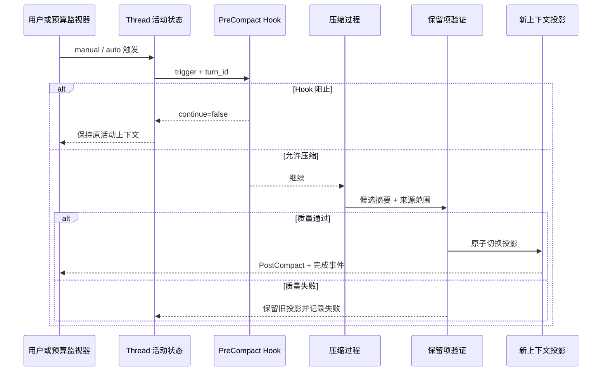

# Codex 的手动与自动上下文压缩：从机制到 Agent 设计启示

## 上下文压缩是什么

Codex 上下文压缩是一种把较早对话换成较短表示的运行机制，用于为后续模型调用腾出窗口空间。它位于会话历史和下一次活动上下文之间，可以由 `/compact` 手动触发，也可以在长对话达到阈值后自动触发。

一次长时间开发任务里，用户先提出需求，又补充“不要提交”“不能改保留文件”，Agent 随后读取几十个文件、运行多轮测试，还留下三个未完成项。继续对话时，所有消息和工具输出不可能无限进入模型窗口。若简单删除最早消息，最先丢掉的往往正是目标和限制；若把全部历史重新摘要，又可能把失败证据和精确文件名改写错。

本文只讨论当前官方 Manual 能确认的外部行为：可配置自动阈值及统计范围；压缩前后有 Hook；App Server 通过事件报告压缩生命周期。官方没有公开内部摘要模型、Prompt 或保留算法，本文不会把推测写成事实。

映射到[上下文装配器](/docs/ai-agent/context-assembly-budget)的 `ContextSnapshot` 时，压缩只替换一组 history Block，并为新摘要保存 `source_ids`、`source_hash` 和 `policy_version`。Scope、Release、当前问题、系统规则和原始 Transcript 不因压缩而改变。这个限制让压缩失败可以回退到旧投影，而不是破坏本轮可信边界。

## Transcript、活动上下文与压缩摘要

压缩不是把聊天数据库删短。至少要区分三个对象：

1. **Transcript** 是原始用户消息、助手消息、工具调用和工具结果的事实记录。它用于审计、重建和问题定位。
2. **活动上下文** 是下一次模型调用实际能看到的消息投影。它受上下文窗口约束。
3. **压缩摘要** 是从一段原始历史生成的较短表示，随后可以代替早期消息进入活动上下文。

若用摘要覆盖 Transcript，摘要一旦漏掉“禁止推送”就无法回查；若 Transcript 保留、摘要只是带版本的投影，系统可以重新压缩、比较候选策略或立即回滚。这个边界是自建 Agent 最值得借鉴的部分。

压缩也不同于普通截断。截断只按位置或长度丢弃；压缩会把多条信息重新表达成更短内容。它可能保留跨消息关系，也可能引入摘要漂移。因此压缩比滑动窗口更有表达力，同时需要更严格的质量校验。

## Codex 当前公开的两种触发方式

### 手动 `/compact`

当对话已跨越多个阶段，用户或开发者可以输入 `/compact`。当前 Manual 描述的结果是：Codex 总结此前聊天，用精简表示替换较早的可见 Turn，从而释放上下文空间并保留关键细节。

手动触发适合这些时机：

- 一个明确阶段已结束，例如“调查完成，开始实施”；
- 工具输出很多，但结论已经稳定；
- 用户刚修正目标，希望先归并有效约束再继续；
- 开发者观察到模型开始重复读取或忘记早期决定。

手动触发不代表摘要一定正确。压缩后仍要检查目标、限制、当前工作区状态和未完成事项。如果任务依赖精确原文，例如法律条款或迁移 SQL，摘要只能保留引用，不能代替源文件。

### 自动压缩

Codex 也会在长对话中自动压缩。`model_auto_compact_token_limit` 可以设置触发自动历史压缩的 Token 阈值；未设置时使用模型默认行为。它解决的是运行连续性：系统在请求真正超过窗口之前腾出空间，不要求用户持续盯着 Token 数。

自动触发需要比手动触发更谨慎，因为它可能发生在用户没有显式要求的时候。自建 Agent 至少要记录触发原因、源消息范围、压缩策略版本和压缩后的校验结果，否则一次质量下降很难定位是模型回答问题还是历史投影问题。

## `total` 与 `body_after_prefix` 的统计范围

`model_auto_compact_token_limit_scope` 有两个公开取值：

- `total`：按完整活动上下文统计，是当前文档说明的默认范围。
- `body_after_prefix`：只统计携带的压缩窗口前缀之后继续增长的主体。

可以把活动上下文想成“相对稳定前缀 + 持续增长主体”。前缀可能包含上一轮压缩留下的内容，主体是压缩后新增的对话和工具结果。`total` 关注整体离阈值还有多远；`body_after_prefix` 关注上次压缩之后又增长了多少。两者不是两种摘要算法，只是自动触发阈值的计数范围。

下面的 TOML 只用于展示字段关系。运行环境是 Codex 配置文件；三个数值必须根据当前模型和任务验证，不能当成通用推荐值。

```toml
# 活动模型可使用的上下文窗口。
model_context_window = 128000

# 达到该 Token 阈值时触发自动压缩；未设置时使用模型默认值。
model_auto_compact_token_limit = 64000

# total 统计完整活动上下文；另一个可选值是 body_after_prefix。
model_auto_compact_token_limit_scope = "total"
```

读取这段配置时，先用 `model_context_window` 定义总上限，再用 `model_auto_compact_token_limit` 决定何时提前处理，最后用 scope 决定统计哪一部分。阈值不能机械设为窗口上限，因为模型输出、工具返回和协议包装还需要空间。若字段拼写错误、scope 不受支持或自定义阈值明显超过窗口，应该在启动或配置校验阶段暴露问题。

## 从触发到完成：压缩是一条生命周期



图中手动和自动触发进入同一条状态迁移。`PreCompact` 发生在压缩前，能够停止继续；压缩过程产生候选投影；自建 Agent 再验证目标、约束和未完成项；只有通过后才原子切换。失败分支不先删除旧上下文，而是继续保留旧投影并记录原因。Codex Manual 能证明 Hook 和触发类型，候选校验与原子切换是本文给自建 Agent 的设计方案，不应误写为 Codex 未公开的内部实现。

## `PreCompact` 和 `PostCompact` 能观察什么

当前 Codex Hook 文档说明：

- `PreCompact` 在压缩前运行；
- `PostCompact` 在压缩后运行；
- 两者的 matcher 都作用于 `trigger`，值为 `manual` 或 `auto`；
- 输入还包含当前 `turn_id`；
- 普通 stdout 文本会被忽略，Hook 应按文档规定的 JSON 输出；
- 匹配的 `PreCompact` 返回 `continue: false` 时，Codex 在压缩前停止；`PostCompact` 返回相同信号时，在压缩后停止继续。

Hook 适合做审计、策略门禁或补充确定性上下文。例如自动触发时记录一次指标，或在压缩前确认当前任务清单已持久化。Hook 不适合把完整敏感 Transcript 复制到外部脚本，也不能依赖一行普通 stdout 自动成为模型上下文。

下面是一个只展示配置形状的片段，不是可独立运行脚本。`command` 需要替换为你自己的可执行审计程序；该程序必须从 stdin 读取 Hook JSON，并从 stdout 返回合法 JSON。

```toml
# PreCompact 在压缩前记录原始状态，PostCompact 在压缩后校验摘要是否保留硬约束。
[[hooks.PreCompact]]
matcher = "auto"
# 命令路径必须换成本机绝对路径；脚本失败时应保留非零退出码。
command = ["python3", "/absolute/path/to/audit_compaction.py"]

[[hooks.PostCompact]]
# matcher 限定触发方式，避免手动压缩和自动压缩混用同一审计策略。
matcher = "manual|auto"
command = ["python3", "/absolute/path/to/check_compaction.py"]
```

第一个 Hook 只匹配自动压缩，适合记录“预算触发”；第二个同时匹配手动和自动压缩，适合做统一审计。路径必须使用真实绝对路径或配置支持的可解析路径。Hook 脚本发生异常时要留下结构化错误；不要在脚本里输出 Transcript 或凭证。

## App Server 的异步生命周期事件

Codex App Server 暴露 `thread/compact/start` 来手动触发线程压缩。请求会立即返回 `{}`，这只表示“触发请求已接受”，不表示压缩已经完成。进度通过同一 `threadId` 上的标准 `turn/*` 和 `item/*` 通知发送，其中包含 `contextCompaction` item 的 `item/started` 与 `item/completed` 生命周期。

```jsonc
// 第一条是触发命令，id=25 用于关联紧接着的接收确认。
{ "method": "thread/compact/start", "id": 25, "params": { "threadId": "thr_b" } }
// 空 result 只确认命令已接收；最终完成要继续等待 contextCompaction 事件。
{ "id": 25, "result": {} }
```

客户端处理顺序应是：发送命令，收到 `{}` 后继续监听事件，看到匹配 `threadId` 的 `contextCompaction` 完成项才更新 UI。若客户端把空对象当完成信号，界面可能提前显示“已压缩”，下一次请求却仍处在压缩过程中。旧的 `thread/compacted` 通知已被文档标记为弃用，客户端应使用 `contextCompaction` item。

这也是异步 Agent Runtime 的通用原则：命令 ACK、执行进度和最终完成是三个不同事实。HTTP 200 或 JSON-RPC 空结果只能证明接收，不能证明状态迁移完成。

## 一份面向执行的摘要必须保留什么

普通对话摘要追求“读起来像概述”，执行摘要追求“下一位执行者不会做错”。至少应覆盖：

| 信息类别 | 示例 | 为什么不能丢 | 压缩方式 |
| --- | --- | --- | --- |
| 最终目标 | 完成 7 篇上下文文章并验证 | 决定何时算完成 | 一条精确目标 |
| 硬约束 | 不提交、不覆盖保留文章 | 决定授权边界 | 原意保留，避免弱化措辞 |
| 已完成与证据 | 22 篇已通过门禁 | 避免重复工作 | 结果 + 测试标识 |
| 失败尝试 | 某策略丢失旧通道 | 避免循环犯错 | 方法 + 错误 + 修正结论 |
| 当前状态 | 工作区有未提交差异 | 决定后续命令 | 状态摘要 + 可回查位置 |
| 未完成事项 | 上下文、RAG、可信运行 | 保持任务连续 | 有序清单 |
| 精确引用 | 配置名、文件或事件 ID | 摘要不能安全改写 | 保留原文或引用指针 |

“写得更短”不是唯一目标。压缩后若失去一条禁止操作，即使 Token 减少 90% 也不合格。反过来，把全部终端输出复制进摘要虽忠实，却没有释放上下文。压缩质量要同时评估保留、无来源新增和压缩比。

## 建立可审计压缩记录

下面不模拟 Codex 的内部压缩算法，而是实现自建 Agent 的外部状态契约，不依赖第三方包。输入是源消息范围、源哈希和候选摘要；目标是在激活候选前验证任务目标、硬约束和未完成项都存在。

```python
# 压缩记录保存原历史指针、目标、硬约束、证据和未完成事项，摘要作为新候选而非覆盖原文。
from __future__ import annotations

from dataclasses import dataclass
from enum import StrEnum

class Trigger(StrEnum):
    MANUAL = "manual"
    AUTO = "auto"

@dataclass(frozen=True)
class CompactionCandidate:
    thread_id: str
    trigger: Trigger
    source_from: int
    source_to: int
    source_hash: str
    summary: str
    retained_constraints: tuple[str, ...]
    pending_items: tuple[str, ...]
    policy_version: str

@dataclass(frozen=True)
class ValidationResult:
    accepted: bool
    missing: tuple[str, ...]

# 校验函数在数据进入下一阶段前执行，失败时返回稳定错误或直接阻断。
def validate_candidate(
    candidate: CompactionCandidate,
    required_constraints: set[str],
) -> ValidationResult:
    missing: list[str] = []
    # 摘要必须对应一个正向、闭合的原消息区间，否则无法追溯它替代了哪段上下文。
    if candidate.source_from > candidate.source_to:
        missing.append("invalid_source_range")
    # source_hash 绑定压缩前原文，审计时可以判断候选摘要是否仍对应当前历史。
    if not candidate.source_hash.startswith("sha256:"):
        missing.append("source_hash")
    # 去掉首尾空白后仍为空，说明没有可处理输入；在模型或检索调用前直接拒绝。
    if not candidate.summary.strip():
        missing.append("summary")
    if not candidate.pending_items:
        missing.append("pending_items")

    # 硬约束按集合做差；每一个缺失项都单独返回，便于拒绝候选后定向重写摘要。
    retained = set(candidate.retained_constraints)
    for constraint in sorted(required_constraints - retained):
        missing.append(f"constraint:{constraint}")
    return ValidationResult(not missing, tuple(missing))

candidate = CompactionCandidate(
    thread_id="thread-demo",
    trigger=Trigger.AUTO,
    source_from=1,
    source_to=42,
    source_hash="sha256:demo-source",
    summary="目标：完成上下文文章；已完成：前两组；当前：继续上下文组。",
    retained_constraints=("no_commit", "preserve_locked_articles"),
    pending_items=("运行 Python 测试", "更新正文审查哈希"),
    policy_version="compact-v2",
)

result = validate_candidate(candidate, {"no_commit", "preserve_locked_articles"})
print(result)
```

代码中的 `CompactionCandidate` 是待激活投影，不是原始历史。`source_from`、`source_to` 和 `source_hash` 把摘要绑定到明确源范围；`policy_version` 允许后来比较策略。`validate_candidate` 先检查来源、摘要和待办，再做集合差，逐条确认硬约束仍被保留。它只返回验证结果，不删除消息，也不切换活动投影。

正常输入会得到：

```text
ValidationResult(accepted=True, missing=())
```

如果删掉 `no_commit`，结果会包含 `constraint:no_commit`。Runtime 此时应记录候选失败并继续使用旧投影；若旧投影已经接近硬窗口上限，可以暂停当前 Turn，要求重新压缩或减少输入，不能拿不合格摘要继续执行。

## 测试要证明“失败不丢状态”

将上面的代码下面直接执行这段实现。下面的 pytest 关注两件事：缺失硬约束会阻断，候选校验不会修改原始消息。输入是不可变消息元组和一个缺字段候选，预期是失败结果与原消息保持相等。

```python
# 测试让摘要缺失硬约束或解析失败，确认系统继续使用原上下文且保留失败审计。
from dataclasses import replace

from compaction import candidate, validate_candidate

# 这个用例删除硬约束或检查原记录，确认压缩验证失败不会覆盖原始上下文。
def test_missing_constraint_blocks_candidate() -> None:
    broken = replace(candidate, retained_constraints=("preserve_locked_articles",))
    result = validate_candidate(broken, {"no_commit", "preserve_locked_articles"})
    assert result.accepted is False
    assert "constraint:no_commit" in result.missing

# 这个用例删除硬约束或检查原记录，确认压缩验证失败不会覆盖原始上下文。
def test_validation_does_not_overwrite_transcript() -> None:
    transcript = ("user: do not commit", "assistant: understood")
    before = tuple(transcript)
    validate_candidate(candidate, {"no_commit"})
    assert transcript == before
```

第一条通过 `dataclasses.replace` 只改候选摘要字段，验证器必须指出精确缺失项。第二条保存原始 Transcript 副本，运行验证后断言未变化。真实系统还应做事务测试：只有候选验证通过，才更新 Thread 的 `active_compaction_id`；写入失败时，旧 ID 保持不变。

## 怎样观察压缩是否真的有帮助

一次压缩 Trace 至少记录：

- `thread_id`、`turn_id` 与 `trigger`；
- 压缩前后活动上下文 Token；
- 源消息范围、源哈希和策略版本；
- 必须保留的约束与缺失项；
- 候选是否激活、失败原因和旧投影 ID；
- 后续一到数轮是否出现目标丢失、重复工作或错误工具调用。

Token 减少只是资源指标，不能单独证明质量。可把固定长对话分别交给未压缩基线和候选压缩策略，再问“当前目标是什么、哪些操作被禁止、还有什么没做”，比较字段覆盖与无来源新增。涉及隐私或权限的缺失是硬失败，不能靠平均分掩盖。

## 不适合压缩的场景

以下内容更适合保留原文或引用，而不是让模型自由摘要：

- 凭证和密钥本来就不该进入上下文，不能靠压缩脱敏；
- 法律条款、SQL 迁移、哈希、版本号等精确文本应保留引用；
- 尚未闭合的工具调用要保持 ToolCall/ToolResult 协议配对；
- 仅有几轮短对话时，压缩带来的额外延迟和摘要风险可能不值得；
- 任务目标频繁变化时，应先确认当前目标，再生成新摘要。

## 用检查表比较压缩前后的事实保留

触发前确认：当前 Token 统计可信、Transcript 已持久化、未完成工具调用已处理、硬约束有结构化清单。生成候选后确认：目标、限制、完成证据、失败原因、未完成项和精确引用都能回查。激活时使用版本或事务原子切换。激活后观察后续回答，并保留一键回退旧投影的能力。

进一步验证是把本文验证器接到上下文装配器前：当历史分区超过软预算时生成候选；候选合格才替换历史块；候选不合格则返回 `compaction_validation_failed`。这样可以看清压缩不是“删几条旧消息”，而是一次有来源、有候选、有门禁、有激活和有回滚的状态迁移。


**Codex 的 `/compact` 与自动压缩有什么区别？**

`/compact` 是用户在长对话中主动触发，自动压缩则由活动上下文达到配置或模型默认阈值触发。二者都属于历史压缩，但触发来源不同，可在 `PreCompact`、`PostCompact` 和指标中看到 manual 或 auto。手动适合阶段切换前整理，自动用于连续运行；任何一种都不意味着摘要绝对正确，关键目标和约束仍应在压缩后核对。

**`model_auto_compact_token_limit_scope` 的两个值改变摘要算法吗？**

不改变。`total` 统计完整活动上下文，`body_after_prefix` 只统计携带压缩窗口前缀之后继续增长的主体；它们决定何时达到自动阈值，不公开也不选择内部摘要算法。配置时还要给输出和新工具结果留余量，阈值不能等于窗口上限。字段未设置时使用模型默认行为，因此文章中的示例数值不能当作通用推荐。

**压缩后原始聊天记录会被删除吗？**

应区分持久化 Transcript 与下一次模型看到的活动上下文。公开行为说明压缩为早期内容建立更短表示来释放窗口，不应据此推断原始 rollout 或产品存储一定被删除。自建 Agent 更应该保留受控原始事实和源范围哈希，让摘要只是可替换投影；隐私删除则走独立数据生命周期，不能把压缩当作删除机制。

**PreCompact 与 PostCompact Hook 可以用来做什么？**

PreCompact 在压缩前运行，可按 manual/auto trigger 做审计或在不满足策略时阻止继续；**PostCompact** 在压缩后运行，适合记录指标、检查外部持久化状态或触发后续流程。Hook 输入和输出要遵守公开 JSON 契约，stdout 普通文本不会自动成为上下文。脚本也不应复制完整敏感 Transcript 到外部系统，否则压缩观察反而扩大数据面。

**App Server 返回 `{}` 是否表示压缩已经完成？**

不是。`thread/compact/start` 立即返回空结果只表示命令已接受，实际进度通过同一 thread 的 `contextCompaction` item 生命周期发送，客户端应等待 `item/completed`。这与异步 Agent 的 accepted 和 completed 区别相同。若 UI 收到空对象就更新为“已压缩”，下一请求可能与尚在进行的状态迁移竞态；排查时应按 thread ID 对照 started、completed 和后续模型请求，而不是只查看请求响应码。

**怎样判断一次压缩质量合格？**

除了压缩前后 Token，还要检查当前目标、硬约束、已完成证据、失败尝试、未完成事项和精确引用是否保留，并检测摘要是否新增源历史不存在的结论。用固定长对话对候选策略做问答与字段对照；权限、禁止操作和事务状态缺失属于硬失败，不能被平均覆盖率抵消。候选不合格时保留旧投影或暂停请求，而不是先覆盖再尝试修复。
