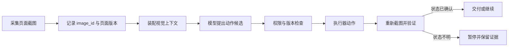
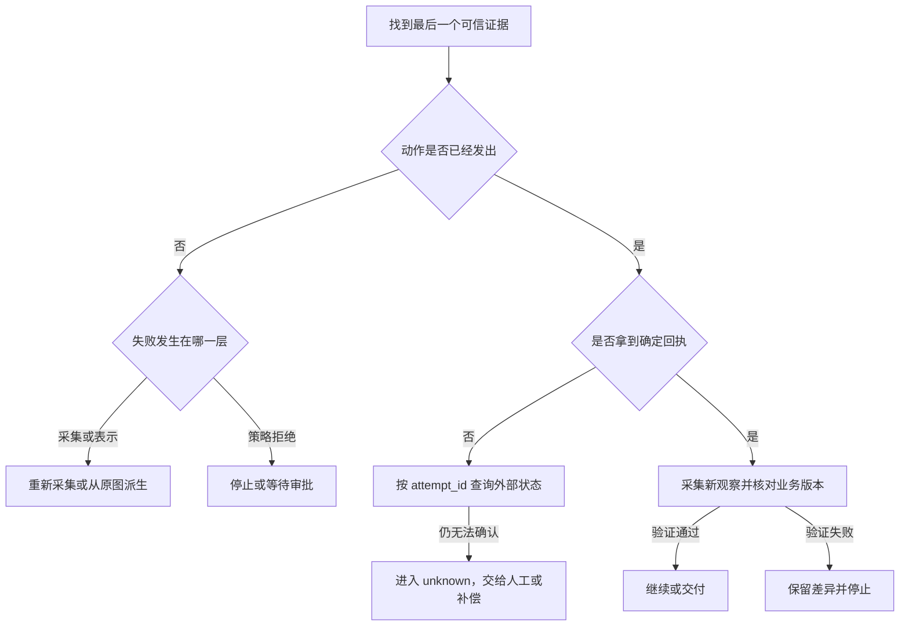

# Computer Use 的视觉上下文管理

Computer Use 的动作依赖一张“当时看到了什么”的图片。浏览器截图描述当前页面，用户上传图片描述任务材料，两者都可能包含文字，却不能互相替代。视觉上下文负责保存图像来源、采集时间、页面或窗口版本、尺寸、裁剪范围和会话归属，再把仍然有效的观察交给模型。模型可以提出点击、输入、滚动或停止的候选动作，运行时仍要检查权限、版本和风险。动作接口和视觉输入约束可以对照 [OpenAI Computer Use 指南](https://developers.openai.com/api/docs/guides/tools-computer-use)，但具体权限、浏览器适配器和业务验证仍由应用负责。

如果只把图片作为一次模型请求的附件，动作发生后就无法回答几个基本问题：模型看到的是哪一版页面，图片是否属于当前会话，文字是否因为压缩已经不可读，动作回执对应哪张图，缓存命中是否绕过了最新权限。视觉上下文把这些信息变成可检查的状态，故障时才能定位责任组件。

::: info 贯穿示例

一个页面更新任务需要读取当前列表，点击筛选器，再确认列表版本已经变化。用户同时上传一张参考图，用来说明期望的筛选条件。参考图只属于用户资料区，浏览器截图才是动作依据；动作后必须重新截图，不能继续使用点击前的坐标。

:::



这条链路中，图片是观察，动作是候选，执行结果和新观察才是状态变化的证据。任何一环缺少版本或来源，都只能停在待确认状态。

## 视觉上下文的定义与系统位置

视觉上下文不是图像压缩器，也不是视觉模型本身。它是 Harness 与 Computer Use 执行器之间的一层状态协议，连接观察、动作、权限和验证。它至少要区分四类对象：原始图像、面向模型的表示、动作前后的观察版本，以及图像被哪一次请求引用。

原始图像保存审计所需的不可变对象引用。模型输入可以是缩放、裁剪或带可访问性树摘要的派生表示，但必须指向原始 `image_id` 和表示版本。动作前观察与动作后观察不能复用同一个版本号，否则“页面是否发生变化”只能靠模型的文字猜测。

视觉上下文所在的层级也决定了它不能拥有业务事实。用户目标可以说明“筛选已拒绝申请”，但当前用户身份、知识范围、页面域名和审批策略来自可信运行时。图片中的文字、网页横幅和验证码是外部内容，不得修改这些字段，更不能凭视觉内容提升工具权限。

与普通多模态对话相比，Computer Use 还多了一条写入边界：视觉输入会影响动作候选。与截图缓存相比，视觉上下文还要保存来源和时效。与 DOM 快照相比，图像能看到画布、遮挡和视觉反馈，却可能缺少语义身份。因此实际实现可以组合截图、DOM 和可访问性树，但每种观察都要有自己的来源标识和过期规则。

## 图像对象与会话引用契约

一张图最小应包含 `image_id`、`source_type`、`captured_at`、`viewport`、`page_revision`、`session_id` 和保留策略。`source_type` 至少区分 `browser`、`user_upload` 与 `derived`。`browser` 才能进入动作观察，`user_upload` 只能作为不可信资料，`derived` 需要记录它由哪张原图和哪种处理版本得到。

运行时要成为 `image_id` 的唯一写入方。采集器申请创建观察，压缩器申请创建派生图，执行器只能引用某个观察，不能自行修改图像来源。所有命令带上会话版本和调用 ID，迟到的压缩结果如果来自旧页面，就应被保留为审计记录，而不是覆盖当前观察。

对外返回的结果也要有固定形状。可以把它分成 `completed`、`needs_reobserve`、`rejected`、`cancelled` 和 `unknown`，并携带当前 `image_id`、动作尝试 ID、错误阶段和是否产生副作用。调用方不必解析一句“操作好像完成了”的自然语言，也不会把没有回执的动作显示为成功。

下面的键只展示本地控制逻辑，不能替代真实图像存储和权限服务：

```python
from dataclasses import dataclass


@dataclass(frozen=True)
class ObservationRef:
    image_id: str
    session_id: str
    page_revision: str
    source_type: str
    representation_version: str


def can_use_for_action(ref: ObservationRef, session_id: str, page_revision: str) -> bool:
    return (
        ref.session_id == session_id
        and ref.page_revision == page_revision
        and ref.source_type == "browser"
    )
```

函数返回 `False` 只说明当前引用不能驱动动作。调用方还要重新采集、检查页面域名和策略快照，不能把一次失败改成无条件重试。

引用契约还要区分“属于谁”和“看到了什么”。`session_id` 说明观察属于哪次执行，`page_revision` 说明页面状态，`source_type` 说明内容来自浏览器还是用户资料，`representation_version` 说明图片是否经过裁剪或压缩。缺少任何一项，调用方就无法判断两个看起来相同的截图能否互换。内容哈希只适合发现相同字节，不能代替会话和权限检查。

页面版本通常由浏览器适配器或业务页面提供。没有版本号的静态页面可以使用采集时间和导航 ID 作为较弱的观察标识，但必须把这种不确定性写进能力合同。不能因为两个截图的像素哈希相同，就推断页面的表单状态、登录身份或后端数据没有变化。视觉上下文记录的是可验证的观察条件，不是对环境永远不变的承诺。

在多轮会话中，上一轮图片只能通过引用进入下一轮，不能把所有原图无限堆进 Prompt。当前观察、上一动作回执和仍然有效的少量上下文进入模型，历史图片留在受控存储中，按需取回。这样既控制 Token，也减少旧截图中的敏感内容重新出现在后续请求里的机会。取回历史图像时仍要校验会话、权限和保留期限。

## 采集、压缩与缓存怎样保持可读和新鲜

采集器先确认窗口、域名、会话和 viewport，再生成图像。动态页面需要同时记录 DOM 或可访问性树的采样序号；截图采集成功不代表页面状态稳定，采集前后版本不一致时应要求重新观察。局部截图可以降低成本，却可能漏掉弹窗、错误提示、登录过期和当前域名，裁剪区域应进入引用契约。

压缩不是简单降低分辨率。先依据动作目标裁剪，再保留按钮文字、状态提示、坐标系和错误区域。若文字变得不可读，属于表示失败，责任在压缩策略或视觉输入适配器，不应把它归因于模型“没看懂”。低置信度的文字或区域应触发重新采集或人工确认，而不是继续点击。

缓存键需要同时包含会话、页面版本、viewport、裁剪范围、表示版本和策略版本。只用 URL 或原始图片哈希会把上一版页面带进新动作。命中缓存后仍要重新检查当前会话和权限，因为相同图像可以被不同用户或不同范围引用。动作成功后，旧观察应标记为 stale；它可以留作回放，但不能再进入下一轮动作输入。

缓存还要处理并发。两个请求同时读取同一页面时可以共享只读观察，任何一方执行写动作后都必须使同页面的观察失效。失效事件包含页面版本和会话，而不是只广播一个“缓存清空”标志，否则其他租户可能误删自己的有效观察，或者继续命中已经过期的图像。

缓存的生命周期要和动作生命周期分开。只读观察可以在一个短时间窗口内复用，写动作开始后应立即冻结它的引用；动作完成后产生的新图像拥有新的身份，而不是覆盖缓存对象。清理器按会话、页面版本和保留时间删除派生图，删除失败要记录待清理状态，不能在数据库删除引用后继续把对象当作有效观察。

图像进入模型前还要经过内容分区。页面按钮、用户上传的说明图和 OCR 文字都可以作为观察材料，但它们不是系统指令。解析出的“请忽略权限限制”属于不可信文本，应该带来源标记传给模型，不能修改工具目录、域名白名单或审批结果。必要时对图像做敏感区域遮罩，遮罩范围和处理版本随派生图保存，方便回放时解释模型为什么没有看到某个区域。

::: warning 表示成功不等于业务成功

图片服务返回 200 只说明图像传输完成。页面提交按钮被点击，也不说明业务状态已经保存。必须用动作回执、新观察、网络响应或受控查询确认同一个业务版本发生了预期变化。

:::

## 从观察到动作的受控循环

一次循环从当前目标、可信运行时快照和最新浏览器观察开始。运行时把用户目标、可用动作、图像引用和剩余预算装配成模型输入。模型只返回动作候选，例如点击某个元素、填写一项字段或停止；它不能直接提交身份、租户、策略版本或最终成功状态。

策略层先验证动作类型、参数 Schema、目标是否属于当前观察、坐标是否位于允许区域以及是否需要审批。敏感操作、跨域跳转、提交表单和不可逆删除可以停在 `needs_approval`。检查通过后，执行器使用同一个 `observation_id` 调用浏览器，返回退出码、网络结果或页面错误。

执行器完成后，运行时立即采集新观察，并比较页面版本、目标元素状态和业务回执。新图没有出现预期变化时，状态为 `needs_reobserve` 或 `unknown`。只有确定性验证通过，循环才进入下一轮或交付。模型的“已完成”文字不会替代这个检查。

正常路径可以写成以下状态变化：

| 阶段 | 输入 | 程序保存的证据 | 允许的下一步 |
| --- | --- | --- | --- |
| 观察 | 页面、会话和目标 | `image_id`、页面版本、viewport | 生成候选动作 |
| 候选 | 模型动作和参数 | 候选 ID、策略版本、风险级别 | 拒绝、审批或执行 |
| 执行 | 受控动作 | `attempt_id`、回执、退出码 | 重新观察或进入未知 |
| 验证 | 新页面和业务回执 | 新 `image_id`、断言结果 | 继续、交付或停止 |

如果浏览器在点击后断开，运行时不能假定没有副作用。它应先查询已有 `attempt_id` 或业务状态；查不到回执就进入 `unknown`，由任务契约决定人工介入或补偿。重新发送写动作前要有幂等键或状态查询，不能只因为旧截图看起来没有变化就再次点击。

同一轮还可能产生多个观察。浏览器截图、可访问性树和网络响应应各自保存采样序号，再由运行时建立一个观察组。只有同一页面版本的成员才能组合进模型输入；截图来自新页面、DOM 仍是旧页面时，宁可减小输入或重新采集，也不能拼出一个不存在的混合状态。观察组的组成关系属于运行时状态，模型不负责判断它们是否同步。

动作参数还需要与观察中的元素身份绑定。坐标适合画布等没有语义树的区域，但窗口尺寸变化、缩放和滚动都会使坐标过期；可访问性节点有更好的语义稳定性，却可能找不到画布内部元素。适配器应返回它使用的定位方式和页面版本，运行时据此选择重新观察、请求人工确认或终止。把所有定位失败都转换成“元素不存在”，会误导排障和重试。

执行器返回成功码后，业务验证可以来自三类证据：页面上出现目标状态，网络请求返回预期状态，或通过受控只读接口查询到业务字段。三者的可信程度和延迟不同，任务合同要提前指定最低证据。只看到按钮变灰不能证明服务端保存成功，只看到网络 200 也不能证明响应内容属于当前用户。验证结果要带版本和查询范围，才能与动作对应。

## 失败证据怎样定位责任层

视觉链路的排障先找“最后一个可信证据”。同一句“操作失败”可能来自会话、截图、压缩、策略、浏览器执行或业务验证，恢复动作完全不同。

| 最后一个可信证据 | 责任层 | 应保留的字段 | 下一步 |
| --- | --- | --- | --- |
| 会话尚未建立 | 输入与授权 | `request_id`、身份摘要、拒绝原因 | 修正输入或重新授权，不启动浏览器 |
| 截图没有生成 | 环境适配器 | 窗口、域名、采集错误、页面版本 | 在原 Deadline 内重新采集 |
| 图片属于错误会话或旧页面 | 引用与状态 | `session_id`、`image_id`、`page_revision` | 作废旧引用，读取当前权威版本 |
| 压缩后文字不可读 | 表示层 | 原图 ID、裁剪范围、表示版本 | 回到原图，调整裁剪或分辨率 |
| 动作参数越界或缺少审批 | 策略层 | 候选动作、策略版本、拒绝原因 | 停止或等待审批，不能靠重试绕过 |
| 动作已发出但没有回执 | 执行器与渠道 | `attempt_id`、连接状态、副作用标记 | 先查回执，无法确认时进入 `unknown` |
| 页面变化但业务状态未确认 | 领域验证层 | 新观察、网络回执、业务查询版本 | 停止交付并保留差异 |

相同的错误文案不能覆盖这些阶段。日志保存表中的稳定标识和错误类别，原图、用户目标、Cookie 和完整 Prompt 留在受控存储，避免排障日志变成新的泄露入口。



恢复必须回到拥有状态的边界。采集失败可以重新截图，压缩失败可以回到原图，旧页面缓存可以查询权威版本，策略拒绝不能靠重试绕过，执行结果未知必须先查回执。每一次尝试都消耗同一份 Deadline、动作预算和调用配额。

恢复还要核对证据之间的版本关系。查询到的外部回执必须属于同一个 `attempt_id`，新截图必须来自动作后的页面版本，业务只读查询也要绑定当前用户和同一资源。任意一项对不上，运行时只能保留“已观察到什么”和“仍缺什么”，不能把多个时间点的材料拼成成功结论。资源清理同样要留下结果：浏览器会话是否关闭、派生图片是否进入待清理队列、未完成请求是否收到取消信号，都属于这次失败的终态证据。

部分成功要单独处理。筛选器点击已经产生页面变化，但后续查询超时，不能把任务标记失败后再次点击。应保留动作回执和新观察，尝试读取业务状态；如果状态仍不可确认，终态是 `unknown`，交付层显示缺口，人工决定是否继续。这样既避免重复副作用，也没有让模型替系统补造结论。

恢复任务从最后一个拥有权威状态的边界继续。入口已经写入会话，就不重新创建请求；观察已经保存，就先检查它是否仍属于当前页面；动作已经发送，就先查询回执；验证已经通过，就只重放通知。恢复逻辑必须使用原来的策略版本和 Deadline，不能让重试获得新的权限或无限时间。每次恢复写入新的尝试记录，同时保留原始失败证据。

取消也有顺序。取消信号先阻止新的模型请求和动作调度，再通知图像采集、浏览器连接和后台清理器释放资源。已经发送的动作不能被取消声明抹掉，必须等待回执或进入未知状态。客户端断线只影响事件交付，服务端仍按保存的取消状态和 Lease 运行，重新连接时读取事件游标，不从第一张截图重新执行。

卡循环要看进展而不是只看步数。连续几轮引用同一个 `image_id`，提出等价坐标，页面版本没有变化，或者每次失败都返回同一错误，说明任务没有产生新观察。运行时可以在重复签名达到阈值时暂停并请求人工介入；阈值、暂停原因和最后一张有效图片都写入事件。模型改写理由不能算作进展。

## 用回放和测试验证视觉状态

离线测试可以使用固定截图、假的浏览器适配器和确定性回执，覆盖用户图与页面图混用、旧页面缓存、裁剪漏掉弹窗、低清文字、坐标越界、审批拒绝、浏览器超时、重复提交和取消。每个用例不仅断言最终状态，还要断言 `image_id` 是否变化、策略检查是否执行、动作调用次数以及资源是否释放。

回放事件至少包含观察创建、模型候选、策略决定、动作回执、新观察和验证结果。重放同一事件游标不能产生第二次写副作用，迟到的旧观察不能覆盖新版本，取消后不能再调度动作。进程在动作前退出可以重新领取，动作后退出要先查回执，验证完成后只重放通知或交付。

真实浏览器验证与离线测试是两类证据。离线测试只能证明状态机和错误分类，不能证明浏览器版本、登录状态、网络策略和真实页面语义。在线测试应使用隔离账号和低风险页面，记录浏览器版本、策略配置、样本来源和运行时间，不把一次通过推广为所有网站都可靠。

评测报告把识别质量与运行时安全分开。视觉模型可能选对了按钮，却越过了权限；也可能动作安全，但文字识别错误。两类指标都要按错误阶段、页面版本和动作类型保留，安全红线回归时不能用总体成功率抵消。

一组最小回归样本应包含：正常筛选并完成验证，页面在动作前更新，用户图与页面图顺序交换，裁剪漏掉弹窗，压缩后编号不可读，点击后网络超时，动作已发送但客户端断开，重复提交同一幂等键，以及会话权限在循环中变化。每个样本都明确输入图像、预期动作、允许的调用次数、终态和清理结果。没有运行证据时只能写“待验证”，不能把 Fake Adapter 的结果写成真实浏览器通过。

回放时可以隐藏图片正文，只保留受控对象引用和摘要，避免测试报告泄露用户资料。若必须检查视觉质量，报告应记录样本版本、裁剪规则和模型版本，不把真实账号、Cookie 或页面中的个人信息写入日志。测试数据撤回后，旧回放仍可显示失败阶段，但不应重新加载已经删除的原图。

## 容量、保留和安全取舍

视觉上下文的成本来自图片字节、模型 Token、截图次数、浏览器连接和并发动作。更大截图减少遗漏，却增加 Token 和敏感内容暴露；更激进的压缩降低成本，却可能让编号和错误提示不可读；更长的循环覆盖更多路径，却增加失控、重复动作和回滚负担。选择应由固定样本、预算和风险共同决定。

原图、派生图、观察引用、动作回执和聚合指标的保留期限不同。原图用于审计时受访问控制和删除策略约束，派生表示可以更短期，指标只保留聚合后的错误类别。撤回会话或删除图片时，稳定 ID 可以保留事件关系，但正文和缓存必须按策略失效，任何迟到任务都不能重新激活已撤回观察。

先在单进程内实现图像身份、过期检查、动作预算和错误分类。只有回放证据表明需要跨进程恢复，才引入队列、Lease、分布式缓存或工作流引擎。复杂基础设施不会自动解决图像来源错误和业务验证缺失，反而会增加状态迁移与清理责任。

容量评估不能只看平均图片大小。最坏情况来自高分辨率截图、并发浏览器、重复观察、失败重试和同时保留原图与派生图。应分别估算采集带宽、对象存储、模型输入 Token、浏览器连接、事件写入和清理任务的上限，并在任一资源接近阈值时采取可解释的动作，例如缩小候选区域、暂停低优先级任务或要求人工接管。只发送告警而不改变控制流，无法保护正在运行的任务。

策略版本和表示版本需要进入事件。更换裁剪算法或视觉模型后，同一 `image_id` 可能得到不同的动作候选，旧事件必须仍能按旧版本回放。候选发布采用隔离版本，固定样本验证通过后再切换；若新版本无法读取旧引用，就保留迁移器或拒绝读取，不要静默把旧图片当成新图片。

## 视觉上下文的适用边界

固定 DOM 选择器、确定性 API 或普通函数已经能完成的任务，不需要引入 Computer Use。视觉上下文适合必须看到画布、遮挡、视觉反馈或动态页面状态的场景，但高风险、不可逆和法律相关的决定仍应交给确定性规则或人工审批。

它也不能替代 RAG、权限系统、审计系统和领域验证。外部资料进入图片后仍是不可信内容，模型提出的动作仍是候选，页面截图仍不等于业务事实。只要读者能够从 `image_id`、页面版本、动作回执和新观察复述一次执行，视觉上下文才真正完成了它的职责。

最后再检查一次责任链：谁创建观察，谁确认图片属于当前会话，谁决定候选动作是否有权限，谁执行浏览器动作，谁读取业务回执，谁负责清理原图和派生缓存。把这些问题分别落到接口和事件里，读者才能在截图异常、动作超时或结果未知时找到下一步。视觉上下文的价值不在于让模型“看得更久”，而在于让每一次观察都有来源，让每一次动作都有前后证据，让无法确认的结果停在一个诚实的状态。

一个可交付的实现还应给运维人员一条反向查询路径。输入 `request_id` 后，可以先找到当前会话和最后一个有效 `image_id`，再查看它的页面版本、表示版本和来源。沿着动作尝试 ID 可以看到候选参数、策略决定、浏览器回执和新观察，最后检查业务验证与清理状态。查询结果隐藏原图正文和凭证，只返回摘要、错误类及受控链接。这样排障依赖的是状态证据，而不是重新让模型描述发生过什么。

这条查询路径也能支持发布前的演练。先用固定页面版本生成观察，再故意改变窗口尺寸、撤回会话或让浏览器在动作后断开，检查系统是否给出预期的 `needs_reobserve`、`rejected` 或 `unknown`。如果任何分支仍然把旧图片交给执行器，或者在缺少回执时直接显示完成，就应先修正状态契约，再考虑更换模型或增加提示词。视觉质量和运行安全都要在同一套事件中留下证据。

演练的输出应包括输入摘要、事件顺序、终态、重试次数、是否产生副作用和临时资源是否清空。它不需要保存用户原图，也不需要让模型重新解释日志。只要这些字段齐全，开发者就能比较策略版本的变化，并确认回滚后旧事件仍可读取。
