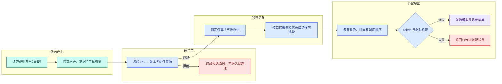

# 上下文由什么组成：按预算装配消息、证据和工具结果

## 上下文装配是什么

用户问知识 Agent：“测试环境的发布窗口和回滚负责人是谁？”系统找到了两份制度、一段旧对话和一次工具查询结果。最直接的写法是把这些文本全部拼进 Prompt，但只要继续聊十几轮，模型就可能遇到三类问题：请求超过**上下文**窗口、真正有用的证据被闲聊挤掉、无权或不可信内容混入控制指令。

[Agent 图和 Runtime 测试](/docs/ai-agent/agent-graph-runtime-testing) 已经保存 State 快照，模型节点读取的内容进一步收敛为 `ContextSnapshot`。窗口预算决定各类输入的容量，Block 记录来源与信任级别，确定性装配器输出最终上下文、丢弃原因、剩余输出空间和失败层级。

## 上下文装配的输入与输出

假设模型窗口上限为 1,000 Token，回答最多使用 180 Token，SDK 消息包装和估算误差预留 70 Token。模型输入真正能用的预算只有：

```text
1000 - 180 - 70 = 750 Token
```

这 750 Token 仍然不能全给检索证据。System 规则、当前问题和必要工具 Schema 是固定开销；近期历史、摘要、证据和**工具结果**才是可选择内容。一次合理的装配结果可能是：

| 分区 | 候选 Token | 实际选中 | 处理结果 |
| --- | ---: | ---: | --- |
| System 与安全规则 | 120 | 120 | 必需，不允许静默删除 |
| 当前问题 | 35 | 35 | 必需，保留原始意图 |
| 当前场景工具 Schema | 90 | 90 | 必需，限定模型可提出的动作 |
| 最近两轮消息 | 170 | 170 | 成组保留 user/assistant 消息 |
| 检索证据 | 420 | 250 | 覆盖“时间”和“负责人”两个目标 |
| 工具结果 | 160 | 80 | 只放结构化摘要与原始结果 ID |
| 合计 | 995 | 745 | 仍有 5 Token 输入余量 |

这里的关键不在示例数字，而在计算顺序：先从总窗口扣掉输出和协议余量，再验证必需块，最后才在剩余预算里选择可选块。若顺序反过来，低价值证据可能先占满窗口，程序只能在最后删 System 或减少输出上限，两种行为都会改变调用契约。

## 上下文、历史与记忆的区别

初学者最容易把三个词混在一起：

- **原始历史**是数据库或事件日志中保存的 Message、ToolCall 和 ToolResult。它是事实记录，不必全部进入本次模型调用。
- **记忆**是系统从历史中保留或抽取的可复用状态，例如当前会话摘要、用户授权的长期偏好。记忆仍只是候选输入。
- **上下文**是某一次模型调用最终可见的有序内容。它还包括 System 规则、当前问题、工具 Schema、检索证据和输出格式说明。

因此，“数据库里有这条消息”不等于“模型这次能看到它”，“模型看过它”也不等于“系统可以永久记住它”。上下文装配器负责把候选数据投影成一次调用输入，但不能改写原始历史。

## Token 预算约束的对象

上下文窗口通常约束一次调用中模型可处理的 Token 总量。概念上可以写成：

```text
输入 Token + 允许生成的输出 Token <= 模型上下文窗口
```

真实 SDK 还可能加入角色标记、工具定义、结构化输出 Schema 等包装内容。因此工程上使用更保守的公式：

```text
输入预算 = 窗口上限 - 最大输出 - 协议预留 - 估算安全余量
可选预算 = 输入预算 - 必需上下文
```

四个量分别解决不同问题：

1. `窗口上限` 来自实际模型配置，不能凭模型系列名称猜测。
2. `最大输出` 是本次任务允许模型生成的上限。长报告需要比分类任务留更多空间。
3. `协议预留` 覆盖消息角色、Tool Schema 和输出 Schema 等固定开销。
4. `安全余量` 覆盖估算误差和运行中新增的工具消息，它不是用来掩盖错误配置的无限缓冲。

字符数不能可靠替代 Token。中文、英文、代码和 JSON 的切分方式不同；模型或 tokenizer 版本变化后，相同字符串的 Token 数也可能变化。生产实现应调用目标模型对应的 tokenizer，并在 Trace 中记录 `model_id`、`tokenizer_revision` 和各分区实际用量。本文代码把 Token 数作为输入，是为了把选择机制讲清楚，不冒充真实 tokenizer。

## 一个上下文块需要哪些字段

只保存 `text` 无法完成工程判断。装配器至少需要知道内容来自哪里、是否可信、是否必须保留、属于哪个协议组，以及为何被选中。

| 字段 | 回答的问题 | 不能替代什么 |
| --- | --- | --- |
| `block_id` | 如何在日志和测试中定位这段内容 | 不能替代原始数据 ID |
| `kind` | 它是规则、消息、证据还是工具结果 | 不能直接决定可信度 |
| `source_id` | 能否回查原消息、文档或工具调用 | 不能说明当前版本有效 |
| `tokens` | 它占多少输入预算 | 不能用字符数随意估算 |
| `priority` | 通过硬门禁后先选择谁 | 不能越过 ACL 和版本检查 |
| `required` | 放不下时是否应整体失败 | 不能滥用于所有内容 |
| `trust` | 它是控制指令还是不可信数据 | 标签本身不能阻止副作用 |
| `group_id` | 哪些块必须一起保留 | 不能拆散 ToolCall/ToolResult |
| `order` | 发给模型时处于什么位置 | 不能拿相关性排序替代 |

`priority` 只在已经通过**权限**、版本和信任检查的候选之间生效。一段旧 Release 的制度即使相关性为 0.99，也不能因为高分进入当前上下文；一段无权证据更不应该进入候选池。权限是硬门禁，优先级是预算不足时的软选择，两者必须分层。

## 上下文装配的有序管线



这张图包含四个阶段。候选产生阶段只负责读取，不作选择；硬门禁先删除无权、过期或来源不明的内容；预算选择先锁定不可缺少的块，再处理可选块；协议输出恢复正确顺序并做最终检查。正常路径最终得到模型输入和一份选择清单，失败路径保留明确错误，不把“越权”“超预算”和“程序配对错误”混成一个异常。

为什么选择顺序和发送顺序要分开？检索证据可以按覆盖度选中，但消息发送必须遵守协议：System 在前，用户和助手消息按时间排列，ToolResult 跟在产生它的 ToolCall 之后。不分开时，相关性最高的工具文本可能被放到 System 前面，既破坏 SDK 协议，也扩大不可信内容影响。

## 硬预算与软预算怎样配合

硬预算保证请求绝不超过模型上限；软预算控制各分区的常见占比。例如输入预算是 29,000 Token，可以先给各区设置软上限：

| 分区 | 软上限示例 | 超出后的动作 |
| --- | ---: | --- |
| System 与安全规则 | 2,000 | 阻断配置发布，不能运行时删除 |
| 当前问题与附件说明 | 3,000 | 要求拆分附件或明确问题 |
| 最近消息与摘要 | 7,000 | 滑动窗口、抽取、滚动摘要 |
| 工具 Schema | 3,000 | 只暴露本次可能使用的工具 |
| 证据与工具结果 | 14,000 | 按 Claim 覆盖、来源和分数选择 |

软上限不是死配额。当前问题没有历史时，历史区剩余预算可以让给证据；工具调用任务可以增加 Schema 区。但这种借用必须受总硬预算控制，并记录在 Trace 中。不要把表里的比例复制到所有 Agent：代码生成、结构化提取、长文问答和实时客服的输入输出结构不同。

## Top-K 与 Token 预算的区别

问题“发布窗口是什么，谁负责回滚”包含两个证据目标：`window` 和 `owner`。若向量检索 Top-5 都在重复说明发布时间，模型仍然无法回答负责人。装配器应先覆盖目标，再用剩余预算补高分内容。

可以把每条证据看成带 `covers` 集合的候选：

| 证据 | covers | 相关性 | Token |
| --- | --- | ---: | ---: |
| A | `window` | 0.92 | 80 |
| B | `window` | 0.90 | 75 |
| C | `owner` | 0.78 | 90 |

纯分数排序可能先选 A、B；覆盖式选择会先选 A、C。前者平均相关性更高，后者才能完成问题。覆盖目标通常来自上一阶段的结构化理解或 SearchPlan，属于确定性集合，不应该让装配器临时猜测。

成组约束也会改变选择单位。ToolCall 和对应 ToolResult 必须一起保留；子切片依赖父标题时，标题和正文应作为一组计算。若组内总 Token 放不下，就整组跳过，不能只留下“调用了工具”却丢失结果。

## 实现可解释装配器

下面的最小实现不调用模型，也不依赖第三方包。输入是一组已经通过 ACL 和版本检查的块，以及一个输入预算；目标是得到选中块、剩余预算和每个被丢弃块的原因。你应该观察：必需块先被保留、同组块一起选择、优先级相同时结果稳定。

```python
# 装配器按信任级别、优先级和 Token 成本选择片段，并为每个保留或丢弃决定记录原因。
from __future__ import annotations

from dataclasses import dataclass

@dataclass(frozen=True)
class ContextBlock:
    # Block 使用稳定 ID 和 kind 保存结构单元，正文不再是无法定位的一整段字符串。
    block_id: str
    kind: str
    source_id: str
    text: str
    tokens: int
    priority: int
    order: int
    required: bool = False
    group_id: str | None = None
    # covers 记录这段证据支持哪些结构化目标；空集合表示普通上下文块。
    covers: frozenset[str] = frozenset()

@dataclass(frozen=True)
class ContextSnapshot:
    # Snapshot 固定本轮的可信边界；压缩、缓存和记忆只能改变 blocks 的投影。
    turn_id: str
    scope_hash: str
    release_id: str
    policy_version: str
    selected: tuple[ContextBlock, ...]
    dropped: tuple[tuple[str, str], ...]
    used_tokens: int
    remaining_tokens: int
    # 未覆盖目标交给上游继续检索、缩短证据或安全拒答。
    uncovered_targets: frozenset[str] = frozenset()

def _groups(blocks: list[ContextBlock]) -> list[tuple[ContextBlock, ...]]:
    grouped: dict[str, list[ContextBlock]] = {}
    # 按文档原始顺序处理 Block，片段内顺序与来源定位不会被打乱。
    for block in blocks:
        key = block.group_id or f"single:{block.block_id}"
        grouped.setdefault(key, []).append(block)
    return [tuple(items) for items in grouped.values()]

# 构造函数把已验证字段组装成下游对象，不在这里引入新的权限或业务决策。
def assemble(
    blocks: list[ContextBlock],
    input_budget: int,
    *,
    target_covers: frozenset[str] = frozenset(),
    turn_id: str = "turn-demo",
    scope_hash: str = "scope-public",
    release_id: str = "release-1",
    policy_version: str = "policy-1",
) -> ContextSnapshot:
    if input_budget <= 0:
        raise ValueError("input budget must be positive")
    if any(block.tokens <= 0 for block in blocks):
        raise ValueError("block tokens must be positive")

    groups = _groups(blocks)
    required_groups = [group for group in groups if any(b.required for b in group)]
    optional_groups = [group for group in groups if not any(b.required for b in group)]

    required_tokens = sum(b.tokens for group in required_groups for b in group)
    if required_tokens > input_budget:
        raise ValueError("required context exceeds input budget")

    selected_groups = list(required_groups)
    remaining = input_budget - required_tokens
    dropped: list[tuple[str, str]] = []

    optional_groups.sort(
        key=lambda group: (
            -len(set().union(*(b.covers for b in group)) & target_covers),
            -max(b.priority for b in group),
            min(b.block_id for b in group),
        )
    )
    covered_targets = set().union(*(block.covers for group in selected_groups for block in group))
    coverage_considered: set[str] = set()
    # 第一轮优先补齐尚未覆盖的目标，避免高分重复证据占满预算。
    for group in optional_groups:
        group_tokens = sum(block.tokens for block in group)
        group_covers = set().union(*(block.covers for block in group))
        group_key = min(block.block_id for block in group)
        if not group_covers & (target_covers - covered_targets):
            continue
        coverage_considered.add(group_key)
        if group_tokens <= remaining:
            selected_groups.append(group)
            remaining -= group_tokens
            covered_targets.update(group_covers)
        else:
            dropped.extend((block.block_id, "group_does_not_fit") for block in group)

    # 第二轮才用剩余预算补充普通上下文；不改变第一轮已经形成的覆盖结果。
    for group in optional_groups:
        if group in selected_groups:
            continue
        group_key = min(block.block_id for block in group)
        if group_key in coverage_considered:
            continue
        group_tokens = sum(block.tokens for block in group)
        if group_tokens <= remaining:
            selected_groups.append(group)
            remaining -= group_tokens
        else:
            dropped.extend((block.block_id, "group_does_not_fit") for block in group)

    selected = tuple(
        sorted(
            (block for group in selected_groups for block in group),
            key=lambda block: (block.order, block.block_id),
        )
    )
    used = sum(block.tokens for block in selected)
    return ContextSnapshot(
        turn_id=turn_id,
        scope_hash=scope_hash,
        release_id=release_id,
        policy_version=policy_version,
        selected=selected,
        dropped=tuple(dropped),
        used_tokens=used,
        remaining_tokens=remaining,
        uncovered_targets=frozenset(target_covers - covered_targets),
    )

blocks = [
    ContextBlock("system", "system", "policy:v3", "只根据可见证据回答", 80, 100, 0, True),
    ContextBlock("question", "user", "message:9", "发布窗口和负责人是谁", 20, 100, 10, True),
    ContextBlock("call", "tool_call", "call:7", "search_notes", 20, 70, 20, group_id="tool:7"),
    ContextBlock("result", "tool_result", "result:7", "负责人证据", 110, 70, 21, group_id="tool:7", covers=frozenset({"owner"})),
    ContextBlock("old-chat", "history", "message:2", "更早的闲聊", 120, 10, 5),
]

# 执行当前算法或装配函数，下面用确定性字段核对结果而不是比较自然语言。
result = assemble(blocks, input_budget=250, target_covers=frozenset({"owner"}))
print([block.block_id for block in result.selected])
print(result.dropped, result.remaining_tokens, result.uncovered_targets)
```

代码按以下顺序执行：

1. `ContextBlock` 保存预算选择和最终排序需要的字段。`source_id` 用于回查事实，`group_id` 表示协议上不可拆散的块。
2. `ContextSnapshot` 是从这一篇开始持续复用的模型输入快照。`turn_id` 关联执行，`scope_hash` 和 `release_id` 固定可见范围，`policy_version` 固定装配规则；后面的压缩、Prompt Cache、工具结果和记忆都不能绕过这些可信字段。
3. `_groups` 把普通块变成单元素组，把相同 `group_id` 的 ToolCall 与 ToolResult 合成一组。
4. `assemble` 先校验预算和 Token 计数，再锁定包含 `required=True` 的组。只要必需块超限就抛错，不返回一个缺少规则的“尽力结果”。
5. 可选组按最高优先级降序和稳定 ID 升序排列。整个组放得下才选择，否则每个成员都记录 `group_does_not_fit`。
6. 最后按 `order` 恢复模型协议顺序，而不是保持预算选择顺序。

示例预算为 250。System 和问题共占 100，工具组共占 130，因此它们全部选中；旧闲聊需要 120，但只剩 20，于是被丢弃。`owner` 已由工具结果覆盖，预期输出类似：

```text
['system', 'question', 'call', 'result']
(("old-chat", "group_does_not_fit"),) 20 frozenset()
```

这段实现仍不调用 tokenizer，也不在装配器内执行 ACL；二者要在候选进入前完成。目标覆盖已经作为 `covers` 和 `target_covers` 进入选择阶段，未覆盖目标会返回给上游决定继续检索、缩短证据或拒答。滑动窗口和摘要改变 history Block，工具压缩改变 tool_result Block，记忆读取增加经过授权的 memory Block，Prompt Cache 根据最终顺序划分稳定前缀和动态后缀。它们都返回新的 `ContextSnapshot`，并保留同一个 Turn、Scope、Release 与 Policy。

## 用 pytest 固定成功和失败语义

把上面的类和函数放进 `context_assembler.py`。下面测试使用 pytest，输入分别是超预算必需块、可拆散风险、顺序打乱和目标覆盖；目标是证明装配器不会静默削弱规则，也不会让重复高分证据挤掉另一个必需目标。

```python
# 测试证明硬规则与当前问题始终保留，证据不足和总预算超限会进入不同失败状态。
import pytest

from context_assembler import ContextBlock, assemble

# 这个用例核对上下文装配或压缩结果，关键约束不能在摘要后消失。
def test_required_context_cannot_be_dropped() -> None:
    blocks = [
        ContextBlock("system", "system", "policy:v3", "规则", 120, 100, 0, True)
    ]
    with pytest.raises(ValueError, match="required context exceeds"):
        assemble(blocks, input_budget=100)

def test_tool_pair_is_selected_or_dropped_together() -> None:
    blocks = [
        ContextBlock("call", "tool_call", "call:1", "search", 20, 50, 1, group_id="g1"),
        ContextBlock("result", "tool_result", "result:1", "rows", 90, 50, 2, group_id="g1"),
    ]
    # 执行当前算法或装配函数，下面用确定性字段核对结果而不是比较自然语言。
    result = assemble(blocks, input_budget=100)
    assert result.selected == ()
    assert {item[0] for item in result.dropped} == {"call", "result"}

# 这个用例改变完成顺序或调用方式，确认结果仍遵守同一份确定性契约。
def test_priority_tie_uses_stable_id_then_restores_order() -> None:
    blocks = [
        ContextBlock("b", "history", "m:2", "第二条", 10, 50, 1),
        ContextBlock("a", "history", "m:1", "第一条", 10, 50, 2),
    ]
    result = assemble(blocks, input_budget=10)
    assert [block.block_id for block in result.selected] == ["a"]

def test_target_coverage_beats_repeated_high_score() -> None:
    blocks = [
        ContextBlock("window-a", "evidence", "e:a", "窗口", 40, 90, 1, covers=frozenset({"window"})),
        ContextBlock("window-b", "evidence", "e:b", "窗口补充", 40, 80, 2, covers=frozenset({"window"})),
        ContextBlock("owner", "evidence", "e:c", "负责人", 40, 20, 3, covers=frozenset({"owner"})),
    ]
    result = assemble(blocks, input_budget=80, target_covers=frozenset({"window", "owner"}))
    assert [block.block_id for block in result.selected] == ["window-a", "owner"]
    assert result.uncovered_targets == frozenset()
```

第一条测试把 System 设为 120 Token、预算设为 100，必须看到明确异常。第二条预算只能放 100 Token，而工具组共 110，断言两个成员一起被丢弃。第三条故意把 `b` 放在前面，相同优先级仍按稳定 ID 选择 `a`；选中后再按 `order` 输出。测试没有声称覆盖 ACL，因为当前示例没有权限字段。

运行方式：

```bash
# pytest 同时检查总 Token、消息顺序和选择日志；退出码为 0 才表示预算边界稳定。
python3 -m pytest -q
```

预期三条测试通过。若第二条只留下 `call` 或 `result`，说明组约束实现错误；若第三条在交换输入顺序后变化，说明装配结果无法稳定回归。
命令只读取测试模块并执行断言，不会连接模型或数据库。若环境中没有 pytest，应先在隔离虚拟环境安装测试依赖；不要把“pytest 命令不存在”和装配算法失败混成同一个结论。测试通过也只覆盖本文数据模型，接入真实 SDK 后仍要补 Tokenizer、ACL 和消息协议集成测试。

## 装配失败不能只有一个“超长”错误

调用方至少要区分以下终态：

| 错误码 | 含义 | 用户动作 | 工程动作 |
| --- | --- | --- | --- |
| `required_context_too_large` | 规则或必要 Schema 自身超限 | 通常无法由用户修复 | 阻断配置发布并告警 |
| `user_input_too_large` | 当前问题或附件说明过长 | 拆分问题或附件 | 返回允许长度和关联 ID |
| `optional_context_trimmed` | 可选历史或证据被裁剪 | 无需报错 | Trace 记录被裁剪清单 |
| `protocol_group_broken` | ToolCall/Result 或消息配对损坏 | 重试无意义 | 作为程序缺陷处理 |
| `scope_denied` | 候选数据不属于当前用户范围 | 不应透露内容存在 | 安全审计，不进入预算统计 |

`optional_context_trimmed` 是正常结果，不应伪装成 500；`scope_denied` 是安全事件，不应伪装成“放不下”。分类错误让前端、告警和重试策略各自做正确动作。

## 工作中怎样验证装配器

上线前准备一张固定样本表，每条样本包含模型窗口、输出预留、候选块、权限范围、期望选择和期望错误。至少覆盖：

- 必需规则刚好等于预算，以及多 1 Token 的边界；
- ToolCall 与 ToolResult 成组保留和成组丢弃；
- 同优先级候选在不同输入顺序下结果一致；
- 两个 Claim 目标都被证据覆盖，而不是 Top-K 重复；
- 无权和过期证据在预算计算前已经移除；
- Tokenizer 或模型版本变化后，旧预算样本会触发重新评估；
- 裁剪原因、来源 ID、实际 Token 和剩余 Token 都能从 Trace 复查。

一次调用建议记录 `model_id`、`tokenizer_revision`、`window_limit`、`reserved_output`、各分区用量、选中 `block_id`、丢弃原因和最终消息哈希。不要把敏感正文完整复制到日志；用 ID、长度和脱敏摘要建立可追溯性。

## 把策略接入实际 Runtime

在 `ContextBlock` 中增加 `covers: frozenset[str]`。输入目标为 `{"window", "owner"}` 时，先为每个未覆盖目标选一组证据，再用剩余预算按优先级填充。为下面三种情况写测试：

1. 高分证据都覆盖 `window`，较低分证据覆盖 `owner`，结果仍包含两类。
2. `owner` 没有任何可见证据，装配结果显式返回 `uncovered_targets={"owner"}`。
3. 覆盖两个目标的组放不下时，不拆组，并让 Runtime 选择“缩短证据、继续检索或安全拒答”。

完成后，你得到的不是“会截断字符串”的函数，而是一次模型调用的输入控制面：它清楚区分事实与投影、权限与优先级、选择与排序、正常裁剪与真正失败。


**上下文预算为什么不能只用“窗口减当前字数”计算？**

模型按 Token 而非字符计量，输入与输出共享窗口，消息角色、工具 Schema 和协议包装也会占用空间。装配前要先预留输出，再用目标 tokenizer 计算各区段；调用后记录实际 usage 校正估算。字符数可以做早期粗筛，不能作为最终门禁，否则中文、代码和不同模型切换时都会出现偏差。

**System 规则是否应该永远排在最高优先级？**

安全与任务硬约束通常属于必需块，但“System”这个角色本身不等于所有内容都永久保留。工具说明、过期示例和与当前任务无关的系统扩展也应按能力裁剪。装配器要按来源、职责和是否可重建标记必需性；必需块自身超出预算时应明确失败或拆任务，不能静默删除一半规则继续调用。

**为什么选择上下文和排列上下文要分两步？**

选择阶段决定哪些块进入预算，依据优先级、Scope、Release、Claim 覆盖和 Token；排列阶段再按消息角色、时间、ToolCall 配对和证据位置生成合法模型输入。若边选边按输入顺序追加，列表顺序会影响结果，同优先级候选也难以复现。分开后可以保存选中与丢弃原因，并用稳定 tie-breaker 重放。

**证据相关性高就一定应该进入上下文吗？**

不一定。候选还要满足当前用户权限、固定 Release、来源多样性、Claim 覆盖和内容安全；多个高度相似片段可能浪费预算，却没有补充新事实。证据预算应优先覆盖不同子问题和直接来源，再考虑分数。进入上下文后仍保留 **Evidence** ID 与原文位置，生成与验证才能区分“语义相近”和“确实支持”。

**必需上下文本身超过预算时怎么办？**

这属于不可通过普通裁剪解决的硬失败。先检查是否重复注入规则、是否暴露了不需要的工具 Schema，再考虑把任务拆成多次调用或选用符合需求的窗口。不要截断 System、当前问题或未闭合工具组，也不要把错误伪装成模型拒答。Trace 应记录 required_tokens、window、output_reserve 和失败块，方便定位是谁让基线输入失控。

**怎样验证装配器在输入顺序变化时仍然稳定？**

准备相同 block 集合，以不同顺序多次传入，断言选中的稳定 ID、最终**消息顺序**和丢弃原因一致；同优先级使用稳定 ID 或明确业务键决胜。再覆盖 Scope 过滤、工具配对、必需块超限和证据重复。若结果随列表顺序变化，线上并行检索完成时间就可能改变模型输入，评测也无法复现。
