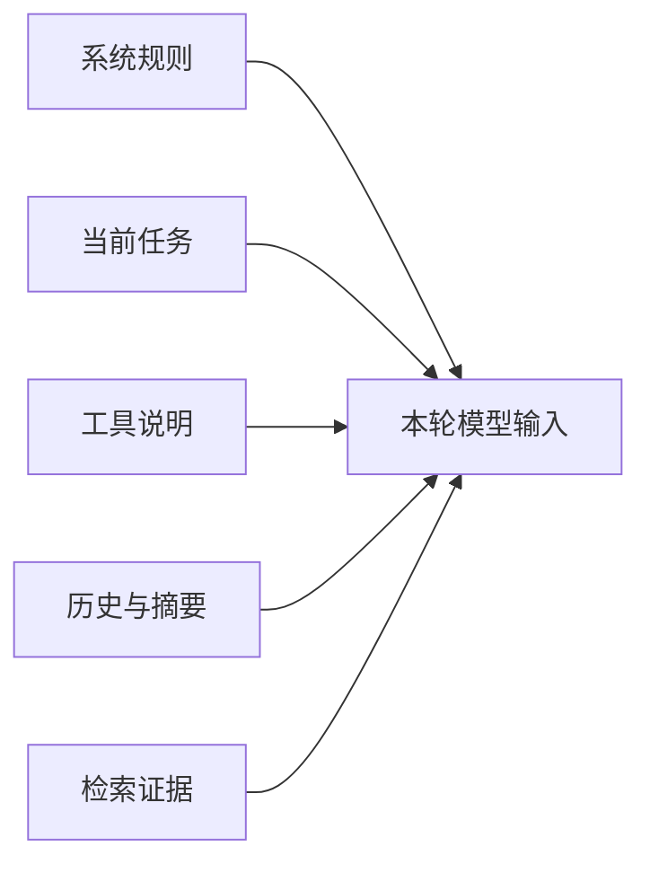

# 上下文工程与压缩

用户已经聊了二十轮，最后说“按刚才确认的格式生成结果”。如果把全部历史、所有工具说明和十段检索证据原样发送，输入可能超限；如果只保留最后一句，模型又不知道“刚才的格式”是什么。

上下文工程就是决定本次模型应该看到什么、按什么顺序、占多少预算。压缩是其中一种手段，不等于简单删掉最早消息。

## 上下文里通常有哪些信息

不同信息的重要性与风险不同。系统规则决定边界，当前任务定义目标，证据支持事实，历史处理指代，工具说明只在可能使用时需要出现。

## 第一步：先建立 Token 预算

模型上下文窗口要减去输出预留和安全余量，剩余输入再分给策略、证据、历史、摘要和记忆。知识问答通常优先证据；闲聊可以给近期历史更多空间。

预算是上限，不是必须填满。无关上下文会增加成本，也可能让模型关注过期指令和相似但错误的证据。

## 第二步：按需要选择内容

工具数量很多时，可以先根据任务选择候选工具，不把所有 Schema 每轮都发送。检索证据按相关性、权限、来源多样性和 Token 成本选择。

历史从最近轮次向前保留，早期信息用结构化摘要承接。用户后来的纠正要覆盖旧决定，摘要要明确区分用户事实、模型回答和未确认假设。

## 第三步：理解压缩会丢信息

滚动摘要适合保存目标、实体、数字、条件和未完成事项，不适合替代原始审计记录。摘要模型也会出错，因此原消息仍需独立保存。

确定性裁剪作为失败降级，可以保证不超预算，但无法保证语义完整。依赖被裁掉的内容时，系统应向用户澄清。

## 正常结果和失败结果

正常编译保留当前问题、最新纠正和授权证据，早期历史缩成带来源角色的摘要，输入在预算内。

失败编译为了省 Token 只保留最后一句，导致指代丢失；另一种失败是把所有历史都塞入，让旧要求与新要求同时存在。

## 怎样验证上下文策略

准备短对话、长对话、多轮纠正、指代、工具多选和证据超量样本。检查输入不超预算、关键事实保留、旧决定被正确覆盖、权限外内容从未进入上下文。

Agent 实践第 12 篇展示了近期消息、滚动摘要和确定性降级怎样组合。

## 做一次可观察的裁剪实验

准备一段模拟对话：用户先指定“使用 TypeScript”，随后讨论三个实现方案，最后选定方案 B，并在十轮后问“按刚才选的方案继续”。把上下文预算设得只能保留一半内容，然后分别尝试“只保留最近消息”和“近期消息 + 决策摘要”。

| 信息 | 建议处理 | 原因 |
| --- | --- | --- |
| 当前问题 | 原文保留 | 它决定本轮目标 |
| 已确认方案 B | 进入结构化决策摘要 | 后续指代依赖它 |
| TypeScript 偏好 | 保留相关偏好 | 会影响代码输出 |
| 三个方案的重复讨论 | 压缩为比较结论 | 原文占用大，细节可按需读取 |
| 旧工具返回全文 | 保存证据 ID，需要时重取 | 防止上下文被大结果挤满 |

然后用三个问题验收：模型能否识别“刚才选的方案”，能否继续使用 TypeScript，能否在被问到方案 A 的细节时承认当前摘要没有这部分。第三项很重要，压缩后的系统应表达信息缺口，而不是补写已经丢失的内容。

实际系统需要记录裁剪策略版本、裁剪前后 Token 估算以及被保留的信息类型。质量回归时固定同一组长对话，比较目标保持、指代解析和关键约束命中。只比较 Token 减少量，会鼓励把重要内容一起删掉。

## 参考资料

- [OpenAI：Conversation state](https://developers.openai.com/api/docs/guides/conversation-state)
- [LangGraph：Memory](https://docs.langchain.com/oss/python/langgraph/add-memory)
- [Anthropic：Contextual retrieval](https://www.anthropic.com/news/contextual-retrieval)
