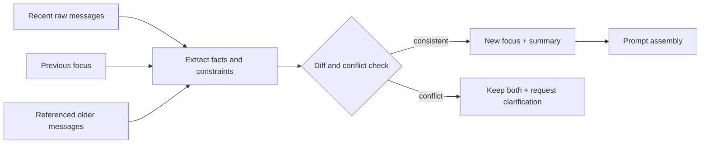

# 上下文工程与压缩

上下文工程不是把更多内容塞给模型，而是在有限窗口内保留影响当前决策的信息。窗口变大并不会消除注意力稀释、成本增长和冲突信息问题。

## 先建立信息层级

一次请求可以分为五层：

1. 不可覆盖的系统规则；
2. 当前用户身份、权限和任务范围；
3. 当前问题与结构化理解；
4. 与问题直接相关的历史、记忆和检索证据；
5. 工具说明、格式示例和低优先级背景。

发生预算冲突时，从低层开始裁剪。权限和安全规则不能因为窗口不足而被摘要掉。

## Token 预算

在调用前分配预算，而不是超限后盲目截断：

```text
总窗口 = 固定规则 + 当前输入 + 历史 + 证据 + 工具 + 输出预留
```

输出预留要在最开始扣除。检索结果按证据价值而非原始顺序选取；工具描述按候选集动态注入。

预算应使用目标模型的 tokenizer 或供应商计数，而不是字符数。调用前使用本地估算，响应后保存实际 usage 校准误差。不同语言、代码和 JSON 的字符/Token 比差异很大。

```ts
type ContextBudget = {
  window: number
  reservedOutput: number
  system: number
  currentTurn: number
  history: number
  evidence: number
  tools: number
  safetyMargin: number
}

function validateBudget(budget: ContextBudget): void {
  const used = budget.reservedOutput + budget.system + budget.currentTurn
    + budget.history + budget.evidence + budget.tools + budget.safetyMargin
  if (used > budget.window) throw new Error(`context budget exceeded by ${used - budget.window}`)
}
```

预算不是静态百分比。没有工具的摘要任务可以把更多空间给原文；工具密集 Agent 需要为 Schema 与结果预留；证据问答则优先保证引用片段和输出。安全裕量用于 tokenizer 估算误差与 SDK 包装消息，不能通过侵占输出预留解决超限。

## 四个动作：选择、压缩、引用、隔离

“压缩”并非唯一手段：

| 动作 | 适用场景 | 风险 |
| --- | --- | --- |
| 选择 | 大量候选中只取当前相关内容 | 召回遗漏 |
| 压缩 | 过程信息可概括但需保留语义 | 摘要漂移 |
| 引用 | 大内容保存在外部，仅携带稳定引用 | 调用时需重新读取 |
| 隔离 | 子任务只看到完成它所需上下文 | 丢失跨任务约束 |

工具列表先按权限和任务选择，而不是总结所有工具；大文档保留原文引用和命中片段，不需要把整篇摘要塞入每轮；SubAgent 获得最小任务包，结果返回证据摘要，避免复制全部会话。

## 上下文块需要来源和优先级

把上下文拼成一个大字符串，会丢失来源边界。推荐使用结构化块：

```ts
type ContextBlock = {
  id: string
  kind: 'policy' | 'current-input' | 'conversation' | 'memory' | 'evidence' | 'tool-result'
  sourceRef: string
  trust: 'trusted-policy' | 'user-controlled' | 'external-untrusted'
  priority: number
  tokens: number
  content: string
  expiresAt?: string
}
```

排序时先满足不可裁剪的策略和当前输入，再在同一层内按相关性、时效、信息增益和成本选择。`trust` 告诉 Prompt Builder 如何包裹内容，但不能单靠标签防提示注入；工具和权限仍由程序控制。

## 分层摘要

对话压缩可以保留三个产物：最近原文窗口、滚动摘要、结构化焦点。结构化焦点记录当前目标、已确认事实、未决问题和用户约束，摘要负责过程语义，最近原文保留表达细节。

摘要不是新事实来源。每条关键事实应保留来源消息或证据标识，后续发现冲突时能够回到原文复核。

滚动摘要不应“拿旧摘要再总结一次”无限传递。随着轮次增加，微小错误会变成确定事实。更稳妥的流程是：旧结构化焦点 + 最近原文 + 被引用的早期消息，生成新摘要；关键约束从来源重新抽取并做差异校验。

```ts
type ConversationFocus = {
  focusId: string
  goal: string
  confirmedFacts: Array<{ text: string; sourceMessageIds: string[] }>
  constraints: Array<{ text: string; sourceMessageIds: string[] }>
  openQuestions: string[]
  rejectedAssumptions: string[]
  lastMessageId: string
  summaryVersion: string
}
```

`rejectedAssumptions` 很重要。只保存“当前结论”会让已经排除的方案在长对话后再次出现。事实和约束必须有来源 ID；模型生成的推测只能放入假设区，不能提升为 confirmed fact。



## 压缩工具结果

大工具结果先在工具侧过滤，只返回模型所需字段。表格使用选中列和聚合，日志保留时间窗、异常片段和关联标识，文档保留命中段落及上下文邻域。

不要让模型先读取十万行日志再“自己总结”，这既昂贵也降低可靠性。

压缩尽量靠近数据所有者。SQL 工具执行列选择、聚合和行限制；日志工具按 traceId、时间窗与错误级别过滤；检索工具返回片段、父标题和来源；模型只处理已收敛的数据。若工具输出可能被后续精确引用，保存完整结果到受控存储并返回 digest 与引用。

表格不要随意转成自然语言。保留列定义、单位、过滤条件和样本数，避免“平均耗时 120”在摘要后丢失毫秒单位或统计窗口。

```json
{
  "queryRef": "query-result-42",
  "columns": [
    { "name": "status", "type": "string" },
    { "name": "p95_latency_ms", "type": "number" }
  ],
  "filters": { "window": "simulated-24h" },
  "rows": [
    ["succeeded", 180],
    ["failed", 420]
  ]
}
```

## 焦点切换

多轮对话最容易出现旧主题污染。每轮理解应判断：延续当前焦点、引用历史实体，还是创建新焦点。新主题只继承用户级稳定约束，不自动携带旧主题的临时证据和假设。

焦点图比单一滚动摘要更适合频繁切换的对话：每个 focus 保存自己的目标、实体和证据，当前消息可以引用一个或多个 focus。新问题“继续刚才的第二个方案”需要解析引用；“换个话题”则新建 focus。无法判断时询问，而不是靠最近文本猜测。

安全上下文不属于普通焦点，始终从服务端重新注入。用户说“接下来都用管理员权限”不能形成高优先级约束。

## Prompt 组装需要确定性顺序

模型调用前由 Prompt Builder 根据预算生成清单，并记录为什么选择/丢弃每个块：

```ts
function selectBlocks(blocks: ContextBlock[], available: number): ContextBlock[] {
  const required = blocks.filter((block) => block.kind === 'policy' || block.kind === 'current-input')
  const optional = blocks
    .filter((block) => !required.includes(block))
    .sort((a, b) => b.priority - a.priority || a.tokens - b.tokens)

  const selected = [...required]
  let used = required.reduce((sum, block) => sum + block.tokens, 0)
  for (const block of optional) {
    if (used + block.tokens > available) continue
    selected.push(block)
    used += block.tokens
  }
  return selected
}
```

真实系统还需要相关性、每类上限和多样性，不能只贪心 priority。但确定性 Builder 比让模型先“选择自己应该读什么”更容易测试和复现。组装结果记录块 ID、版本和 Token，不默认记录完整内容。

## 评估压缩质量

压缩算法至少测试：事实保留、指代恢复、约束遵守、主题切换、冲突处理和 Token 节省。不能只比较摘要看起来是否通顺。

建立带来源标注的长对话样本，故意包含早期硬约束、后续修改、两个同名实体、被否定假设、主题切换和工具噪声。对压缩前后的下游任务比较，而不只评摘要文本：

| 指标 | 计算方式 | 目标 |
| --- | --- | --- |
| 约束召回 | 保留的有效约束 / 全部有效约束 | 防止违背用户要求 |
| 过期事实率 | 已失效事实仍被保留的比例 | 防止旧结论污染 |
| 来源可追溯率 | 有来源 ID 的关键事实比例 | 支持复核 |
| 指代成功率 | 压缩后实体引用仍能解析 | 保持多轮连贯 |
| 下游任务差异 | 原上下文与压缩上下文结果差 | 衡量实际影响 |
| Token 压缩比 | 压缩后 / 压缩前 | 衡量成本收益 |

```ts
it('keeps the latest explicit constraint and its source', async () => {
  const conversation = fixtures.changedLanguagePreference()
  const compressed = await compressor.run(conversation)

  expect(compressed.constraints).toContainEqual({
    text: 'answer in Chinese',
    sourceMessageIds: ['message-18']
  })
  expect(compressed.constraints.some((item) => item.text === 'answer in English')).toBe(false)
})
```

还要注入摘要器超时、结构非法和 Token 估算偏差。压缩失败时，系统可以缩小最近窗口或请求澄清，但不能删除安全规则或输出预留来勉强调用。

## 常见误区

- 只保留最近 N 条消息，丢失早期硬约束；
- 反复摘要摘要，错误逐轮累积；
- 把检索证据和模型结论混成一段，无法追溯；
- 用字符数近似所有模型的 Token；
- 压缩后不记录算法与版本，线上问题无法复现。

## 参考资料

- [LangGraph Memory](https://docs.langchain.com/oss/python/concepts/memory)：短期线程状态、长期 Store 与上下文管理边界。
- [LangGraph Persistence](https://docs.langchain.com/oss/python/langgraph/persistence)：Checkpoint 中状态保存、恢复和历史快照的模型。
- [Lost in the Middle](https://arxiv.org/abs/2307.03172)：长上下文中相关信息位置对模型利用率的实验结果。
- [OWASP Prompt Injection Prevention Cheat Sheet](https://cheatsheetseries.owasp.org/cheatsheets/LLM_Prompt_Injection_Prevention_Cheat_Sheet.html)：外部上下文、检索片段和工具结果必须按不可信数据隔离。
