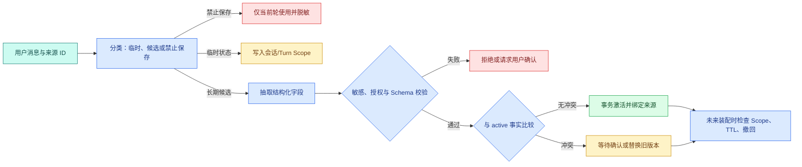

# 短期记忆、长期记忆与滚动摘要：Agent 怎样记住而不越权

用户在一次排障里说：“这次只看测试环境。以后回答先给结论，再给细节。我的临时访问码是 123456。”三句话都在当前对话出现，但它们的生命周期完全不同：测试环境只对当前任务有效；回答格式可以在用户确认后成为跨会话偏好；访问码既不该进入**长期记忆**，也不该被摘要复制。

若系统把所有历史都向量化成所谓“长期记忆”，下一次生产排障可能仍套用测试环境，甚至召回敏感值。可靠的 Memory 不是“让模型记得更多”，而是决定什么能保存、保存多久、谁能读取、**冲突**时怎样处理、用户撤回后如何保证不再出现。


## 先拆开四个经常被统称为 Memory 的对象

| 对象 | 典型内容 | 生命周期 | 事实来源 | 是否直接跨会话 |
| --- | --- | --- | --- | --- |
| Runtime 状态 | 当前节点、重试次数、工具调用 ID | 当前 Turn/Task | 确定性程序 | 否 |
| 短期上下文 | 最近消息、工具结果、当前证据 | 当前 Turn 或会话 | 原始消息与检索 | 否 |
| 会话**摘要** | 已确认目标、决定、未完成项 | 当前会话或 Thread | 一段消息范围的投影 | 通常否 |
| 长期记忆 | 用户授权偏好、稳定事实 | 跨会话，受 TTL/**撤回** | 明确来源与授权事件 | 是 |

Runtime 状态不是聊天记忆。Worker 的 Lease、当前图节点和重试计数用于恢复执行，不能作为用户偏好提供给模型。短期上下文是一次调用可见的投影，不等于持久化。会话摘要压缩历史，但仍属于特定 Thread。长期记忆才会在未来会话主动读取，因此门禁最严格。

把四者分开后，数据保留策略也更清楚：事件日志可以用于审计；模型上下文按预算短暂装配；摘要可由源消息重建；长期记忆必须支持查看、确认、更正、过期和删除。

## 一条消息怎样变成长期记忆

模型最多只能**提出候选**，不能直接把一句话变成 active 长期事实。完整流程包括：



分类阶段先判断信息用途。访问码进入“禁止保存”，只能在当前操作所需的最小范围使用并尽快清除；测试环境进入 Turn 或 Conversation Scope；回答偏好进入长期候选。候选经过结构化抽取和门禁后才比较冲突。激活时记忆与来源、授权事件一起事务写入。未来读取还要重新检查 Scope、TTL 和撤回，不能只看 `status=active`。

## 短期记忆解决的是当前执行连续性

**短期记忆**通常包含最近消息、当前问题的结构化理解、已选 Scope、检索证据 ID、工具观察和节点中间状态。它的输入来自当前 Conversation/Turn，处理方式是按预算装配或 Checkpoint 保存，输出供后续节点和模型调用使用。

短期记忆的重点是**一致快照**。同一个 Turn 开始时确定的用户范围、知识 Release 和策略版本，应贯穿检索、生成和验证。中途配置变化不应让答案前半段使用旧范围、后半段使用新范围。Turn 结束后，运行状态可以归档，但不应自动升级为跨会话事实。

Checkpoint 解决的是任务恢复：Worker 失效后知道从哪个节点继续。它不等于长期记忆。将整个 Checkpoint 注入下一次会话，既浪费 Token，也可能暴露内部错误和工具参数。

## 会话摘要是可重建投影，不是新的事实表

会话摘要用于保留长 Thread 中仍然相关的目标、约束、决定和未完成项。它应带：

- `source_from_message_id` 与 `source_to_message_id`；
- 源消息哈希；
- 摘要策略和模型版本；
- 结构化保留字段；
- 生成时间与当前版本；
- 候选、active、superseded 或 invalid 状态。

滚动摘要每次用旧摘要加新消息生成新版本，但不能把旧摘要当原始事实。定期从原消息重建候选，可以发现逐轮改写带来的漂移。摘要里出现一个未在源范围出现的负责人，应标记为无来源新增并拒绝激活。

当用户修正“负责人从甲改成乙”时，摘要应明确当前有效值与变更来源，不是把两句都拼进去。精确状态最好由结构化事实维护，摘要只解释讨论背景。

## 长期记忆必须回答六个治理问题

每条长期记忆至少能回答：

1. **谁的记忆**：用户、团队还是租户，不能只靠文本相似度判断。
2. **从哪里来**：原消息、确认事件或业务系统字段。
3. **为什么允许保存**：明确授权、产品设置或合法业务规则。
4. **何时失效**：TTL、业务版本或用户撤回。
5. **和什么冲突**：同一 `subject + predicate + scope` 下的 active 事实。
6. **怎样被读取**：当前身份、Scope、任务相关性和预算都通过后才进入上下文。

长期记忆不是完整聊天归档。聊天归档可以有自己的保留政策，但不能因为“已经存在数据库”就被语义召回到任何未来问题中。

## 状态机怎样处理候选、冲突、过期和撤回

| 状态 | 能否进入未来上下文 | 进入条件 | 离开条件 |
| --- | --- | --- | --- |
| `proposed` | 否 | 抽取到长期候选 | 门禁通过或拒绝 |
| `needs_confirmation` | 否 | 敏感、冲突或授权不明确 | 用户确认/拒绝 |
| `active` | 是，还需读取门禁 | 授权、Schema、来源通过 | 替换、过期、撤回 |
| `superseded` | 否 | 更高版本事实替换 | 保留审计，不恢复 |
| `expired` | 否 | TTL 或业务版本到期 | 重新确认产生新版本 |
| `revoked` | 否 | 用户撤回 | 重新授权产生新 ID |
| `rejected` | 否 | **隐私**或策略拒绝 | 不自动重试 |

撤回不能等同于删除一行。若只删 active 记录，旧消息还在，抽取器下一次可能再次生成同一候选。系统需要撤回事件或 tombstone，阻止相同来源和事实指纹静默复活。用户后来重新明确授权时，创建新记忆 ID 和新授权事件，而不是删除撤回历史。

## 冲突不是“让模型选更合理的一个”

冲突发生在同一主体、属性和作用域出现不兼容值。例如 `user-7 / answer_style / global` 同时有“简短”和“详细”。程序先判断是否属于同一事实键，再按业务规则处理：

- 用户明确说“以后改成详细”可以生成新候选，确认后旧值 superseded；
- 从历史摘要推断出的“详细”不能自动覆盖用户明确设置；
- 团队默认与用户个人偏好不一定冲突，应按 Scope 优先级装配；
- 无法判断是否修正时进入 `needs_confirmation`，不把两份 active 值同时给模型。

模型可以帮助判断语义是否近似，但最终状态迁移需要确定性规则和来源优先级。

## 实现最小记忆生命周期

下面的代码无第三方依赖。输入是一个长期记忆候选、当前时间和用户是否确认；目标是激活普通偏好、拒绝未确认敏感值，并在读取时过滤过期或撤回记忆。

```python
# 记忆候选先保存来源、用途、Scope 与过期时间，用户授权后才能进入可检索长期状态。
from __future__ import annotations

from dataclasses import dataclass, replace
from datetime import UTC, datetime
from enum import StrEnum


class MemoryStatus(StrEnum):
    PROPOSED = "proposed"
    NEEDS_CONFIRMATION = "needs_confirmation"
    ACTIVE = "active"
    SUPERSEDED = "superseded"
    EXPIRED = "expired"
    REVOKED = "revoked"
    REJECTED = "rejected"


@dataclass(frozen=True)
class Memory:
    memory_id: str
    user_id: str
    key: str
    value: str
    source_message_id: str
    scope: str
    sensitive: bool
    expires_at: datetime | None
    status: MemoryStatus = MemoryStatus.PROPOSED


def activate(memory: Memory, user_confirmed: bool) -> Memory:
    # 先检查当前状态是否允许继续推进，避免终态被重复任务或迟到结果覆盖。
    if memory.status is not MemoryStatus.PROPOSED:
        raise ValueError("only proposed memory can be activated")
    if not memory.source_message_id:
        return replace(memory, status=MemoryStatus.REJECTED)
    if memory.sensitive and not user_confirmed:
        return replace(memory, status=MemoryStatus.NEEDS_CONFIRMATION)
    return replace(memory, status=MemoryStatus.ACTIVE)


def readable(memory: Memory, user_id: str, scope: str, now: datetime) -> bool:
    # 在数据进入下游前应用可信权限范围，用户文本和模型参数都不能扩大可见集合。
    if memory.user_id != user_id or memory.scope != scope:
        return False
    # 先检查当前状态是否允许继续推进，避免终态被重复任务或迟到结果覆盖。
    if memory.status is not MemoryStatus.ACTIVE:
        return False
    if memory.expires_at is not None and memory.expires_at <= now:
        return False
    return True


preference = Memory(
    memory_id="memory-1",
    user_id="user-7",
    key="answer_style",
    value="先结论后细节",
    source_message_id="message-9",
    # 可信上下文由应用侧创建并注入，模型只能读取允许字段，不能自行构造权限和截止时间。
    scope="personal",
    sensitive=False,
    expires_at=None,
)

active = activate(preference, user_confirmed=True)
print(active.status)
print(readable(active, "user-7", "personal", datetime.now(UTC)))
```

代码按以下顺序执行：

1. `MemoryStatus` 明确候选到终态的状态，不用布尔值同时表达确认、过期和撤回。
2. `Memory` 保存事实键和值，也保存用户、来源、Scope、敏感标记和 TTL。不可变 dataclass 让每次状态变化产生新对象，便于审计。
3. `activate` 只接受 proposed。来源缺失直接 rejected；敏感且未确认进入 needs_confirmation；其余候选才 active。
4. `readable` 在每次装配时重新检查用户、Scope、状态和 TTL。它不修改过期状态，只决定当前能否读取；后台可以另行把到期记录转成 expired。
5. 示例偏好由用户确认，不敏感且无过期时间，因此激活并可读。

预期输出：

```text
active
True
```

代码没有实现冲突事务和撤回 tombstone，这是为了保持单一实践目标。生产写入时应在数据库事务中锁定相同事实键的 active 记录，创建新版本并把旧记录更新为 superseded；两个动作必须同时成功。

## 让临时环境和敏感值无法跨会话

测试输入包括三个候选：长期回答偏好、带短 TTL 的测试环境、敏感访问码。测试目标是证明环境过期后不可读，访问码未确认不能 active，撤回状态不能进入装配。

```python
# 过滤器拒绝凭证、临时路径和会话噪声，撤回或过期记忆不会进入未来上下文装配。
from dataclasses import replace
from datetime import UTC, datetime, timedelta

from memory_store import Memory, MemoryStatus, activate, readable


NOW = datetime(2026, 8, 11, tzinfo=UTC)


# 这个用例推进记忆的过期、确认或撤回状态，未来装配只能读取仍被授权的内容。
def test_temporary_environment_expires() -> None:
    environment = Memory(
        "m-env", "u", "environment", "test", "msg-1", "conversation", False,
        NOW + timedelta(minutes=30),
    )
    active = activate(environment, user_confirmed=True)
    assert readable(active, "u", "conversation", NOW) is True
    assert readable(active, "u", "conversation", NOW + timedelta(hours=1)) is False


# 这个用例推进记忆的过期、确认或撤回状态，未来装配只能读取仍被授权的内容。
def test_sensitive_value_requires_confirmation() -> None:
    secret = Memory("m-secret", "u", "access_code", "123456", "msg-2", "personal", True, None)
    candidate = activate(secret, user_confirmed=False)
    assert candidate.status is MemoryStatus.NEEDS_CONFIRMATION
    assert readable(candidate, "u", "personal", NOW) is False


# 这个用例核对上下文装配或压缩结果，关键约束不能在摘要后消失。
def test_revoked_memory_is_not_readable() -> None:
    preference = Memory("m-pref", "u", "style", "short", "msg-3", "personal", False, None)
    revoked = replace(activate(preference, True), status=MemoryStatus.REVOKED)
    assert readable(revoked, "u", "personal", NOW) is False
```

第一条在 TTL 前后调用同一个读取函数，验证临时事实不会跨时间传播。第二条显示“需要确认”与“已激活”是两个状态。第三条模拟撤回，读取门禁只接受 active。运行命令：

```bash
# pytest 运行敏感、过期、撤回和合法偏好样本，检查跨会话可见集合是否准确。
python3 -m pytest -q
```

示例把敏感值写在测试代码中只是为了展示状态；真实系统不应把访问码明文保存为候选，应该在分类阶段直接拒绝或使用专门秘密存储。门禁测试还应断言日志和模型视图都不包含原值。

## 未来上下文按什么顺序装配记忆

一次新 Turn 开始时，可以按以下顺序读取：

1. 当前用户明确输入，它代表最新意图，但仍不能扩大权限。
2. 当前 Conversation/Turn 的结构化状态与近期消息。
3. 当前会话的 active 摘要，先校验源范围和版本。
4. 与任务相关、仍 active、Scope 匹配且未过期的长期记忆。
5. RAG 证据和工具结果，它们支撑业务事实，不应被个人偏好覆盖。

若当前输入与长期偏好冲突，本轮明确输入优先，同时记录冲突候选；是否更新长期记忆取决于用户表达和确认流程。若长期记忆与业务证据冲突，例如记忆说旧负责人是甲而当前制度说乙，业务证据用于回答，记忆进入冲突或过期处理。

记忆只影响表达和已授权事实，不决定 ACL、租户、工具白名单和知识 Release。这些控制状态始终来自当前请求和服务端快照。

## 删除、撤回和“被遗忘”如何验证

用户撤回后至少要处理四处投影：active 长期记忆、搜索或向量索引、缓存、未来上下文装配。原始审计日志是否保留取决于合规政策，但不能再被普通检索召回。异步索引删除需要事件和重试，完成前装配层必须先用 revoked tombstone 过滤，不能等索引最终一致。

验证删除不能只查主表。应使用同一用户身份重新发起新会话，检查长期记忆 API、语义检索、缓存命中和最终模型上下文都没有该事实；同时确认其他用户或其他事实没有被误删。

## 工作中的记忆设计表

为每种候选信息填写：所属 Scope、允许保留多久、是否敏感、谁确认、来源是什么、冲突键是什么、撤回怎样传播、装配优先级和验证方式。下面是本篇案例的结果：

| 信息 | 存储层 | TTL | 授权 | 撤回/过期验证 |
| --- | --- | --- | --- | --- |
| 测试环境 | Turn/Conversation 状态 | 任务结束或短 TTL | 当前请求即可 | 新会话不可见 |
| 回答风格 | 长期记忆 | 用户设置有效期 | 用户明确确认 | 撤回后索引与缓存均不可见 |
| 临时访问码 | 不进入记忆 | 不适用 | 不允许长期保存 | 日志、摘要和模型视图均无明文 |
| 当前负责人 | 业务证据/版本状态 | 随知识 Release | 数据权限 | 新 Release 替换旧事实 |

进一步验证是增加“团队默认回答详细，用户偏好回答简短”。要求装配器不把两者当冲突删除，而是根据 `personal > team` 的 Scope 优先级选择；当用户撤回个人偏好后，团队默认重新生效。为激活、覆盖、过期、撤回和索引延迟各写一条测试。

完成后，你应能把 Memory 看成一组受治理的状态与投影，而不是一个向量库功能。真正的记忆能力是：该记的能在正确范围复用，不该记的从未进入长期存储，过期和撤回能可靠停止传播，任何 active 事实都有来源和授权证据。

## 常见问题

### 短期记忆、历史摘要和长期记忆有什么区别？

短期记忆通常属于当前 thread 或 Turn，保存近期消息与中间状态；历史摘要是为上下文预算生成的可重建投影；长期记忆跨会话保留用户明确偏好或稳定事实。三者生命周期、权限和失效方式不同。把所有内容放进一个向量集合，会让临时结论永久存在、摘要被当事实，也难以执行用户撤回。

### 为什么长期记忆需要 proposed、active、revoked 等状态？

模型抽取的候选可能错误、敏感或需要用户确认，不能产生后立刻参与回答。proposed 保存来源和待验证内容，active 才可读取，expired 到期失效，revoked 表示用户或策略撤回。状态转换由服务端和确认事件控制，索引只是投影；查询时同时过滤状态、Scope 和版本，避免被删除或撤回内容因索引延迟继续出现。

### 记忆的 provenance 应该保存什么？

至少保存源 Conversation/Turn/Message、提取时间、原文哈希、提取策略版本、Scope、确认者与有效期。读取时可以解释“为什么记住”，冲突时比较来源和新鲜度，撤回时定位所有投影。完整敏感原文不一定进入记忆表，可保存受控引用；只有一段无来源摘要的记忆既无法验证，也无法安全更新。

### 新记忆与旧记忆冲突时怎样处理？

先按主体、属性、Scope 和时间判断是否真冲突，再使用明确优先级，例如用户确认高于模型推断、个人设置高于团队默认、新生效版本高于旧版本。不能让向量分数决定事实覆盖。保留冲突关系和两条来源，无法确定时向用户澄清或暂不激活；更新后让旧记忆进入 superseded 而不是静默改写历史。

### 用户撤回记忆后，为什么还要处理缓存和索引？

数据库状态变 revoked 只是事实层完成，向量索引、搜索缓存和装配缓存可能仍持有旧投影。撤回流程要发出失效事件，查询端始终在事实层或过滤条件检查当前状态，后台再清理投影。测试撤回后立即查询，确保即使索引删除延迟也不会返回；否则“最终会删掉”仍会在窗口内泄露。

### 哪些信息不值得写入长期记忆？

一次性任务参数、临时错误、未经确认的敏感属性、凭证、权限和可从当前业务系统查询的动态状态通常不应长期保存。记忆用于减少重复说明，不是复制数据库。写入前问：它是否跨会话稳定、用户是否预期被保留、能否撤回、来源是否可验证、过期如何处理；任一答案不明确就保留在短期上下文或不存。
