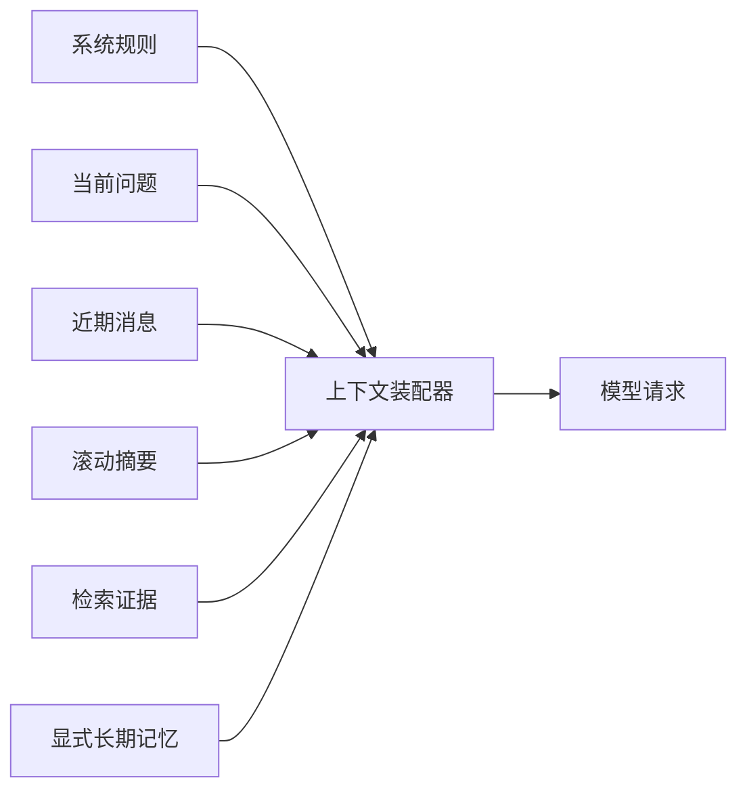

# 上下文压缩、短期记忆、摘要与长期记忆

用户先问“远程访问需要什么条件”，又问“那审批人是谁”。第二问没有重复主题，系统要从近期对话理解“那”指的是远程访问。再聊二十轮后，全部历史已经放不进上下文。

记忆不是把聊天记录永久保存。工程上要区分运行状态、近期消息、滚动摘要和用户明确保存的长期事实，并让它们共同服从 Token、隐私和删除边界。

## 四类信息解决不同问题

| 类型 | 典型内容 | 生命周期 | 用途 |
| --- | --- | --- | --- |
| 回合状态 | 当前意图、证据、工具结果 | 一次执行 | 驱动 Agent 图 |
| 近期消息 | 最近几轮原文 | 当前会话 | 解析指代和连续问题 |
| 滚动摘要 | 较早对话的决策与未完成事项 | 会话级 | 压缩历史 |
| 长期记忆 | 用户明确保存的偏好或事实 | 跨会话，可删除 | 个性化与持续任务 |

检索到的知识证据不属于用户记忆。它有自己的来源版本和权限。不要把资料片段写进长期用户记忆，绕过知识版本与删除规则。

## 先给上下文分配预算

以 32K 窗口为教学示例：

```text
系统与输出契约：2K
当前问题与固定身份摘要：1K
近期消息：5K
滚动摘要：3K
检索证据：13K
工具结果：2K
预留输出：4K
余量：2K
```

预算不是固定比例。资料问答需要更多证据，闲聊不需要检索，工具密集任务会占用更多结果空间。Runtime 在调用模型前实际计数，不能只按字符估算。



装配器是确定性组件。它根据优先级、预算和权限选择内容，并记录哪些信息被加入或裁剪。

## 近期消息保留原文，但要有窗口

近期消息最适合解决代词、追问和刚刚作出的选择。可以按 Token 或轮数保留末尾窗口，而不是固定“最近十条”，因为工具结果可能远大于普通消息。

一条消息还应标记类型：用户文字、助手回答、工具调用、工具结果。对理解指代而言，完整工具原文通常没必要保留；可保存结果摘要和证据 ID。

裁剪时保持消息配对。只留下“工具结果”却删掉对应调用，会让模型误解上下文。

## 滚动摘要保存决策，不保存所有措辞

当较早消息离开近期窗口时，把稳定信息合并进摘要：

```text
当前主题：远程访问申请
已确认：用户询问普通员工流程
已引用：制度版本 v3 的申请条件和审批表
未解决：审批人因部门不同需要澄清
用户偏好：本会话要求使用步骤列表
```

摘要要区分“用户说过”“系统证据确认”和“仍待确认”。若模型把猜测写成已确认事实，后续会不断放大错误。

摘要更新可以由模型提取候选，再由程序保留来源消息 ID、限制字段和长度。关键身份、权限和任务状态仍从数据库读取，不依赖摘要。

## 长期记忆必须显式、可查看、可删除

适合长期保存的例子是用户明确选择的语言、时区或输出偏好。以下信息不应自动保存：密码、密钥、健康数据、临时问题中的个人信息、模型推断的性格和受权限控制的知识内容。

写入流程至少包含：

1. 用户明确要求保存或应用有清晰可见的设置入口；
2. 检查信息类型是否允许；
3. 保存来源、时间和过期策略；
4. 提供查看、修改、删除和关闭功能；
5. 使用前检查当前任务是否相关。

长期记忆是产品和隐私能力，不只是向量数据库。删除请求要同时处理主存储、缓存和派生索引。

## 压缩的三个层次

### 去重

先删除重复系统说明、相同证据和重复工具结果。去重是确定性的，风险最低。

### 抽取

从长结果中抽取当前问题需要的字段，例如工具返回一百个字段，Agent 只需要名称、状态和来源。抽取规则应由工具契约定义。

### 摘要

当信息仍然过长，再生成摘要。摘要属于有损压缩，要保留来源 ID，让需要核对时可以回到原文。安全规则、权限和数字金额不要只保留模型摘要。

## 做一次裁剪练习

假设当前上下文超出 6K Token，内容包括：

- 两份重复的制度片段，各 2K；
- 八轮旧对话 5K；
- 最近两轮 2K；
- 一个工具完整 JSON 3K，其中有用字段只占 500；
- 当前问题、系统规则和输出预留不能减少。

处理顺序：删除重复证据节省 2K；工具结果按契约抽取节省 2.5K；旧对话生成 3.5K 的结构摘要节省 1.5K。总共正好减少 6K，并保留近期消息和事实来源。

检查摘要时问：当前指代还能解析吗；数字和版本是否有来源；未解决问题是否还在；敏感数据是否被写入长期记忆。

## 常见失败

| 现象 | 原因 | 先检查 |
| --- | --- | --- |
| Agent 忘记用户刚说的话 | 近期窗口按条数截断了大型工具消息 | 按 Token 和消息类型裁剪 |
| 多轮后事实逐渐变化 | 摘要把猜测写成事实 | 摘要 Schema 与来源映射 |
| 权限撤销后仍能回答 | 把知识片段存进用户记忆 | 记忆类型与读取时权限 |
| 上下文成本持续增加 | 没有预算和重复检测 | 装配 Trace 与实际 Token |
| 用户无法删除偏好 | 长期记忆只有写入没有控制面 | 查看、删除、索引同步 |

## 上下文装配检查表

- 每类内容有来源、优先级和 Token 上限；
- 近期消息窗口保持调用与结果关系；
- 摘要区分事实、用户陈述和未解决事项；
- 证据保留引用 ID 与知识版本；
- 长期记忆需要用户控制并可删除；
- 权限和状态每次从可信数据源读取；
- 实际输入组成和裁剪原因可观测，但日志不含敏感全文。

下一章把答案拆成 Claim，并逐项核对 Evidence。上下文中“有证据”不代表最终每句结论都被证据支持。

## 参考资料

- [LangGraph Memory Overview](https://docs.langchain.com/oss/python/langgraph/memory)
- [OpenAI Conversation State](https://platform.openai.com/docs/guides/conversation-state)
- [NIST Privacy Framework](https://www.nist.gov/privacy-framework)

