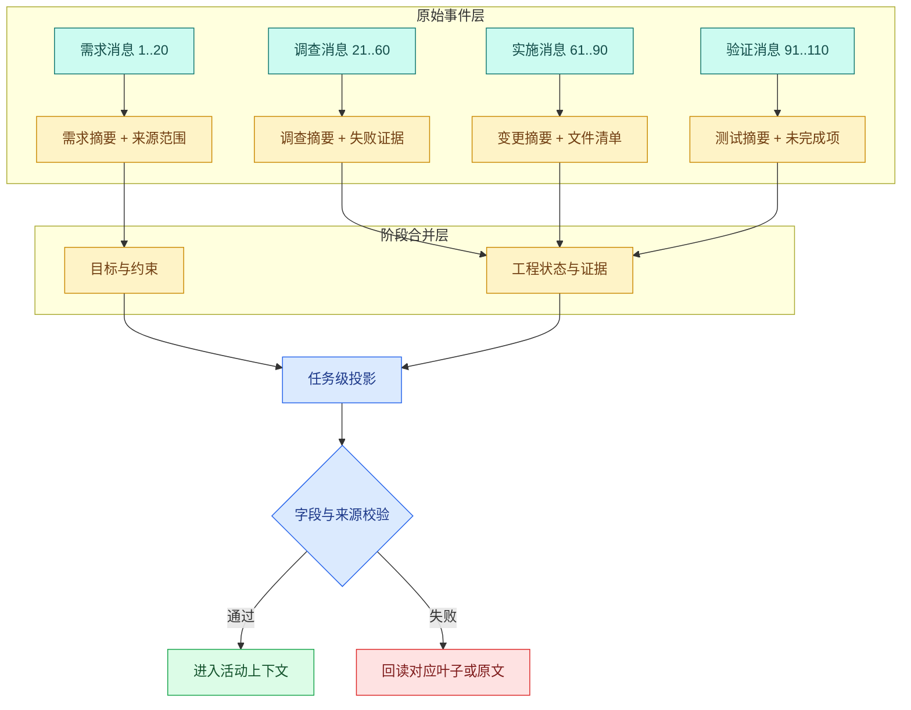

# 上下文压缩策略：滑动窗口、抽取、滚动摘要、分层摘要与语义选择

上下文压缩策略是一组在模型窗口有限时缩短历史输入、同时保留任务信息的方法。它位于历史记录和上下文装配器之间，用于决定哪些原文继续进入模型、哪些事实单独保存、哪些历史可以改写成摘要，或按当前问题临时回取。

一段发布讨论有 12 条消息：最早一条说“禁止推送生产”，中间确定“窗口是周三 20:00”，随后把负责人从甲改成乙，最后两条只是排查日志。下一轮用户问“现在最终决定是什么？”

只保留最近四条，可能忘掉禁止项；只做摘要，可能把甲和乙同时写进去；只按语义找“负责人”，又可能召回已经被推翻的旧消息。上下文压缩真正困难的地方不是“怎样变短”，而是不同信息有不同保留语义。

五种策略使用同一段会话作为输入。history Block 来自[上下文装配器](/docs/ai-agent/context-assembly-budget)，处理结果仍写回同一个 `ContextSnapshot`；`turn_id`、`scope_hash`、`release_id` 和 `policy_version` 不随摘要改写。每种策略都要明确输入、内部状态、处理方式、输出和信息损坏条件，组合后的管线再用测试检查关键字段。

## 测试对话与上下文保留目标

为了避免凭感觉评价摘要，我们先定义黄金字段：

| 字段 | 最终值 | 保留方式 | 原因 |
| --- | --- | --- | --- |
| `environment` | 测试环境 | 结构化抽取 | 决定操作范围 |
| `deploy_window` | 周三 20:00 | 结构化抽取 + 来源 | 精确值不能改写 |
| `rollback_owner` | 乙 | 支持覆盖/撤销的事实状态 | 旧值甲已失效 |
| `forbidden_action` | 禁止推送生产 | 硬约束原意保留 | 丢失会造成副作用 |
| `current_problem` | 检查连接超时 | 最近窗口 | 只对当前阶段重要 |

策略质量不等于自然语言摘要是否顺畅。只要 `forbidden_action` 丢失，就是硬失败；若负责人仍是甲，则是过期事实；若摘要凭空出现“周四”，则是无来源新增。先标注保留目标，才能选择策略和写 Eval。

## 策略一：滑动窗口保留最近交互

### 它解决什么问题

模型通常最需要当前问题附近的消息。**滑动窗口**按时间保留最近 N 条消息或最近 K Token，成本低、结果稳定，也不会重新表述原文。它适合短会话、局部问答和保留最近 ToolCall/ToolResult。

### 机制怎样工作

输入是按时间排序的消息序列和预算；内部状态通常只有当前窗口起点；处理过程从最新消息向前选择完整消息组，直到预算用完；输出是原文子序列。新增消息时，窗口右边加入新消息，左边移出最旧消息。

它不做理解，因此不会产生摘要幻觉，但会产生**位置偏差**：重要限制只要足够早，就会被无条件移出。窗口单位还不能粗暴使用“消息条数”，因为一条工具结果可能比十条对话更长；ToolCall 与 ToolResult 必须成组移动。

### 什么时候不适用

跨数十轮的任务、早期有长期约束、用户多次改口时，单独滑窗不够。增加窗口只能推迟丢失，不能解决固定上下文上限。

## 策略二：确定性抽取保留精确事实

### 它解决什么问题

环境、版本、负责人、时间、资源范围等字段需要精确值，不适合依赖一段自由摘要。抽取策略先定义 Schema，再从消息中产生候选字段，并按确定性规则完成覆盖、撤销和来源记录。

输入是原始消息和字段 Schema；内部状态是一组带 `value`、`source_message_id`、`version`、`status` 的事实；处理包括解析、校验和冲突解决；输出是可直接装配的事实表。模型可以负责提出候选，但字段类型、权限和状态转换应由程序验证。

### 抽取不是什么

抽取不是把每句话存成 Key-Value。只应提取后续任务真正需要的稳定信息。临时日志、未经确认的猜测和敏感数据不能因为正则匹配成功就进入长期状态。若用户说“先假设负责人是甲”，`confidence` 和 `status` 必须反映它不是最终决定。

### 什么时候不适用

开放讨论、设计理由和跨段因果关系很难预先定义字段。Schema 过宽会演变成另一份难维护的数据库；Schema 过窄又会漏掉新信息。因此抽取适合精确状态，不适合代替完整语义摘要。

## 策略三：滚动摘要增量合并历史

### 它解决什么问题

每次都重新总结全部历史，输入会随会话增长，成本没有真正受控。**滚动摘要**保存上一版摘要，只把新消息与旧摘要一起交给摘要器，得到下一版：

```text
summary_v(n+1) = summarize(summary_v(n), new_messages)
```

输入是旧摘要和一批增量消息；内部状态是摘要版本、覆盖的消息范围和源哈希；处理过程合并新事实、覆盖被修正事实、保留未完成项；输出是新的短摘要。它让每次压缩输入保持相对稳定，适合持续对话。

### 摘要漂移是怎样发生的

滚动摘要会反复改写旧摘要。一次把“禁止推送生产”弱化成“暂不推送”，下一次又可能省略“暂不”；错误会被后续版本当成事实继续传播。摘要版本越多，不代表越可靠。

控制漂移需要：保留源消息范围和哈希；硬约束使用结构化字段而非完全自由摘要；定期从原始历史重建候选；对新旧摘要做字段级差异；失败时保留旧版本。

### 什么时候不适用

需要逐字引用、强审计或用户频繁推翻决定时，滚动摘要不能单独作为事实来源。它适合提供叙事背景，不适合承担权限和精确参数。

## 策略四：分层摘要处理大型任务

### 它解决什么问题

一次任务可能包含“需求澄清、调查、实现、验证”四个阶段，每阶段又有几十条消息。把所有内容压成一段会失去层次；每次从头摘要又过于昂贵。**分层摘要**先对局部块生成叶子摘要，再合并成阶段摘要，最后生成任务级摘要。



叶子摘要保存精确来源范围；阶段摘要只合并同一阶段；任务级投影只保留跨阶段仍然有效的信息。验证失败时不必回读全部历史，只回到相关叶子或原文。这是分层结构相对单段摘要的主要价值。

### 内部状态和更新方式

每个摘要节点至少包含 `node_id`、`level`、`source_children`、`source_hash`、`summary` 和 `policy_version`。某个叶子范围变化时，只重建它和祖先节点，不必重算整棵树。这与构建系统的增量更新类似。

### 什么时候不适用

短会话没有必要建立摘要树。分层摘要还会增加版本、一致性和存储复杂度；若来源边界不稳定，父节点可能引用已经失效的子摘要。

## 策略五：语义选择按当前问题回取旧内容

### 它解决什么问题

有些早期内容平时不重要，但对当前问题突然相关。例如讨论很久后，用户重新问“最早为什么禁止推送生产”。**语义选择**把历史消息或摘要建立为可检索对象，根据当前问题召回相关片段。

输入是当前查询和历史候选；内部状态是可检索文本、Embedding、来源、时间、版本和权限；处理通常包含查询改写、向量或全文召回、范围过滤和重排；输出是与当前问题相关的少量旧片段。

### 相关不等于当前有效

旧负责人甲与查询“负责人是谁”高度相关，但已经被乙覆盖。语义选择必须和状态版本结合：先做 Scope 和有效状态过滤，再按相关性选择。它也不能只返回孤立句子，应该带相邻消息或标题路径，避免失去“这只是候选方案”的语境。

### 什么时候不适用

安全规则、当前用户问题和工具协议不能依赖语义召回“碰巧找到”。语义选择适合补充可选历史，不适合决定硬约束。检索索引延迟更新时，新消息也可能暂时搜不到，所以近期窗口仍然需要保留。

## 五种策略放在一张选择表里

| 策略 | 主要保留对象 | 是否改写原文 | 更新成本 | 典型风险 | 更适合 |
| --- | --- | --- | --- | --- | --- |
| 滑动窗口 | 最近消息 | 否 | 低 | 早期约束丢失 | 短期连续性 |
| **确定性抽取** | 精确字段与状态 | 候选可改写，值需校验 | 中 | Schema 漏项、误激活 | 环境、版本、责任人 |
| 滚动摘要 | 长期叙事与进度 | 是 | 中 | 摘要漂移 | 持续会话背景 |
| 分层摘要 | 大任务的阶段关系 | 是 | 中到高 | 多级误差、版本复杂 | 长任务与大量工具事件 |
| 语义选择 | 与当前问题相关的旧片段 | 否或只重排 | 检索成本 | 召回旧事实、越权 | 回取历史细节 |

企业 Agent 通常不是五选一，而是组合：硬约束和精确事实走抽取；最近消息走滑窗；中期背景走滚动或分层摘要；当前问题需要旧细节时走语义选择。最终仍由统一的预算装配器决定哪些内容进入模型输入。

## 做同场实验

下面代码不调用摘要模型，而用明确规则模拟五种策略的“数据形状”，也不依赖第三方包。输入是带 ID 的消息；目标是观察不同策略保留哪些消息或事实。关键词语义选择只是教学替身，不是生产级 Embedding 检索。

```python
# 五种策略处理同一段对话，并输出保留消息、结构化字段和明确丢失项用于横向比较。
from __future__ import annotations

from dataclasses import dataclass

@dataclass(frozen=True)
class Message:
    message_id: int
    text: str
# Fact 表示一个可单独核查的事实单元，后续必须为它找到证据或明确拒绝。

@dataclass(frozen=True)
class Fact:
    name: str
    value: str
    source_message_id: int

def sliding_window(messages: list[Message], size: int) -> list[Message]:
    if size < 1:
        raise ValueError("window size must be positive")
    # 只保留最近 size 条消息，旧消息中的约束会直接丢失，因此不能单独用于长期状态。
    return messages[-size:]

def extract_facts(messages: list[Message]) -> dict[str, Fact]:
    # 结构化事实保留来源消息 ID，同名事实由较新的消息覆盖。
    facts: dict[str, Fact] = {}
    for message in messages:
        if "环境=测试" in message.text:
            facts["environment"] = Fact("environment", "测试", message.message_id)
        if "窗口=周三20:00" in message.text:
            facts["deploy_window"] = Fact("deploy_window", "周三20:00", message.message_id)
        if "负责人=" in message.text:
            value = message.text.split("负责人=", 1)[1].split()[0]
            facts["rollback_owner"] = Fact("rollback_owner", value, message.message_id)
        if "禁止推送生产" in message.text:
            facts["forbidden_action"] = Fact(
                "forbidden_action", "禁止推送生产", message.message_id
            )
    return facts

def rolling_summary(previous: list[str], new_messages: list[Message]) -> list[str]:
    facts = extract_facts(new_messages)
    # 先移除会被新事实替换的旧负责人，再追加本轮抽取结果，避免摘要自相矛盾。
    unchanged = [line for line in previous if not line.startswith("rollback_owner=")]
    updates = [f"{name}={fact.value}" for name, fact in sorted(facts.items())]
    return unchanged + updates

def hierarchical_ranges(messages: list[Message], chunk_size: int) -> list[tuple[int, int]]:
    if chunk_size < 1:
        raise ValueError("chunk size must be positive")
    return [
        (chunk[0].message_id, chunk[-1].message_id)
        for start in range(0, len(messages), chunk_size)
        if (chunk := messages[start : start + chunk_size])
    ]

def semantic_select(messages: list[Message], query_terms: set[str]) -> list[Message]:
    # 语义选择只返回与当前问题相关的消息；硬约束仍需由独立策略强制保留。
    return [
        message
        for message in messages
        if any(term in message.text for term in query_terms)
    ]

# 按角色顺序装配 system 与 user 消息；消息顺序会直接改变模型看到的指令层级。
messages = [
    Message(1, "环境=测试，禁止推送生产"),
    Message(2, "窗口=周三20:00"),
    Message(3, "负责人=甲，等待确认"),
    Message(4, "负责人=乙，已确认"),
    Message(5, "开始检查连接超时"),
    Message(6, "连接池日志已采样"),
]

print("window", [item.message_id for item in sliding_window(messages, 2)])
print("facts", extract_facts(messages))
print("rolling", rolling_summary([], messages))
print("levels", hierarchical_ranges(messages, 2))
print("semantic", [item.message_id for item in semantic_select(messages, {"负责人"})])
```

执行顺序如下：

1. `sliding_window` 只取最后两条，因此保留当前连接问题，但丢掉环境、窗口和禁止项。
2. `extract_facts` 按消息顺序更新字典。同名字段后写覆盖前写，所以 `rollback_owner` 最终为乙，并保留来源消息 4。
3. `rolling_summary` 用新抽取事实更新旧列表。示例会覆盖旧负责人，但它仍只是结构化教学实现，没有生成叙事摘要。
4. `hierarchical_ranges` 把消息分成 `[1,2]`、`[3,4]`、`[5,6]` 三个来源范围。生产系统会为每个范围生成并校验叶子摘要。
5. `semantic_select` 通过字符集合交集选择消息，会同时返回甲和乙，正好说明语义相关性本身不会处理事实有效性。

运行后应观察到：窗口只返回 5、6；抽取事实的负责人是乙；语义选择却可能同时命中 3、4。这个差异解释了为什么“向量搜历史”不能替代状态机。

## 用测试固定策略边界

下面的测试直接复用前文实现，再运行下面的 pytest。输入仍是同一组消息，测试分别确认窗口确实会丢早期约束、抽取能处理覆盖、语义选择需要额外状态过滤。

```python
# 测试锁定目标、约束、当前决定和来源范围，任何策略遗漏硬字段都判为不合格。
from context_strategies import extract_facts, messages, semantic_select, sliding_window

# 这个用例核对证据与引用关系，防止无来源 Claim 被当成已经验证的答案。
def test_window_does_not_claim_to_keep_early_constraints() -> None:
    recent = sliding_window(messages, 2)
    assert all("禁止推送生产" not in item.text for item in recent)

# 这个用例检查资源所有权和释放路径，失败或取消后不能遗留永久占用。
def test_latest_confirmed_owner_overwrites_old_candidate() -> None:
    facts = extract_facts(messages)
    assert facts["rollback_owner"].value == "乙，已确认"
    assert facts["rollback_owner"].source_message_id == 4

def test_semantic_relevance_does_not_remove_stale_fact() -> None:
    selected = semantic_select(messages, {"负责人"})
    assert [item.message_id for item in selected] == [3, 4]
```

第二条测试会暴露当前示例解析器的一个边界：它按空格截断，而中文逗号前的值会得到“乙，已确认”。这不是测试写错，而是在提醒你把字段语法定义清楚。可以把消息改成 JSON 事件，或用受校验的结构化输出产生 `value="乙"`、`status="confirmed"`，再让测试期望精确值。不要用越来越复杂的字符串切割模拟生产自然语言理解。

运行命令为：

```bash
# pytest 对五种策略使用同一断言集，避免用不同标准为候选策略解释失败。
python3 -m pytest -q
```

若第一条失败，说明窗口大小或样本已变化；若第三条只返回一条，检查选择器是否暗中加入了有效性规则。策略测试要把职责分开，才能知道质量来自哪里。
该命令不会调用外部模型，运行结果只验证确定性教学函数。滚动摘要和语义检索接入真实模型后，还要锁定模型、Prompt、Embedding 和样本版本，并把超时、空输出与解析失败作为不同结果记录；不能用这三条单元测试代替端到端压缩 Eval。

## 一条可落地的组合管线

对长期知识 Agent，可以按以下顺序组合：

1. 原始 Message/Event 先持久化，任何压缩都不覆盖事实层。
2. 硬约束、用户范围、环境、版本和已确认责任人进入结构化状态。
3. 最近一到数轮按 Token 滑窗保留，维持自然对话和工具协议。
4. 较早阶段产生带来源范围的滚动或分层摘要。
5. 当前问题需要旧细节时，先按 Scope/状态过滤，再做语义选择。
6. 所有结果进入预算装配器，按信任级别、协议组和 Claim 覆盖选择。
7. 压缩候选通过覆盖、忠实、隐私和冲突 Eval 后才激活。

组合策略的停止条件也要明确：已覆盖本轮所需字段、剩余预算足够、继续检索的边际收益低于成本，或达到 Deadline。不能让 Agent 因“也许还有相关历史”无限召回。

## 为一次压缩决策留下可复查记录

先问信息是什么类型：最近交互、精确状态、长期背景、任务层次还是按需旧细节。再问它能否改写、是否需要来源、是否有撤销或过期、是否涉及权限。最后才选择策略。

练习是把测试对话增加两条：“负责人改回甲，但尚未确认”和“用户撤回禁止项”。要求系统同时输出 `value`、`status` 和来源 ID；未确认候选不能覆盖 active 值，撤回必须生成事件而不是直接删除历史。然后比较五种策略，看哪些能独立处理、哪些必须依赖状态机。

完成这组实验后，你应能解释：滑窗保最近、抽取保精确状态、滚动摘要保连续背景、分层摘要保大型任务结构、语义选择按需回取旧细节。它们解决的是不同损失模式，真正可靠的上下文系统靠组合与验证，而不是找到一个“最强摘要算法”。


**滑动窗口最适合保留什么，最容易丢什么？**

它按最近消息或 Token 保留原文，简单、无摘要幻觉，适合近期指代和当前操作细节。它最容易丢掉早期目标、长期约束和尚未解决的决定。使用时要按消息组裁剪并把硬约束放在独立必需块；若任务跨越多个阶段，仅靠最近 N 轮会让 Agent 看似流畅却忘记最初授权边界。

**抽取与摘要有什么本质区别？**

抽取从原文选择或规范化明确字段，如目标、文件路径、错误码和截止时间，强调可核对；摘要重新组织多条内容，能表达关系但可能漂移。精确约束和 ID 优先抽取并保存来源，讨论过程可摘要。两者可以组合：先抽取不可丢字段，再让模型对剩余历史生成叙述摘要，最后验证摘要没有与抽取事实冲突。

**滚动摘要为什么会越滚越偏？**

每轮用旧摘要加新消息生成新摘要，早期信息不断经过模型重写，轻微遗漏会被下一轮当成事实继续放大。应保留源范围、摘要版本和固定结构，定期从原始锚点重建，而不是无限摘要摘要；硬约束单独保留原文。评测要跨多轮检查目标、否定条件和未完成项，不只看一轮摘要是否通顺。

**分层摘要怎样控制不同时间尺度？**

可以把若干消息压成阶段摘要，再把多个阶段摘要合成项目级摘要；调用时按当前问题选择项目目标、相关阶段和最近原文。每层都记录来源范围与版本，更新下层后只重算受影响上层。它适合长任务，却增加索引、失效和冲突处理；短对话使用分层结构通常得不偿失。

**语义选择为什么不能只按向量相似度取历史？**

相似度容易找到措辞接近的旧消息，却可能漏掉不相似但必须遵守的权限、用户修正和未完成工具调用。候选先按 thread、Scope、时间和状态过滤，再用语义分数辅助选择；硬约束、当前任务和工具配对始终走确定性通道。最终还要限制重复与总 Token，并记录选中的源消息，防止历史检索变成不可审计的第二套 RAG。

**实际 Agent 通常怎样组合这些策略？**

常见组合是：System 与硬约束固定保留，最近消息使用滑动窗口，关键实体和决定做结构化抽取，中期过程使用滚动或分层摘要，只有当前问题需要旧细节时再语义检索原文。所有候选最后进入同一个预算装配器，按 Scope、来源和优先级选择。策略组合要用长对话 Eval 验证，不能只比较压缩比。
