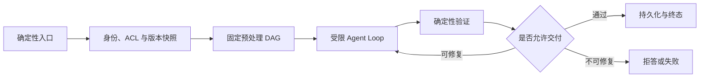
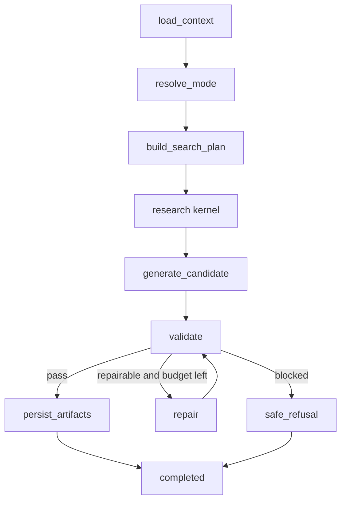

# 从 DAG 到 Agent Loop 的运行时选择

一条文档调研流水线最初只有上传、解析、检索、综合和校验五步。上线后遇到扫描 PDF，要先 OCR；网页只有付费提示，要换来源；两份证据互相矛盾，要追加检索。若把每种观察都画成新分支，图会不断增长。另一条夜间同步任务的步骤两年没变，却被放进 Agent Loop，每次都让模型重新决定“下一步做什么”。前者缺少运行时适应性，后者为固定路径付出了模型调用和不确定性。

选择依据不是节点多少，也不是任务听起来是否“智能”。可以在运行前确定的依赖、顺序和退出条件，适合普通代码、状态机或 DAG；下一步必须等到某个观察出现后才能决定，才需要 Agent Loop。生产系统常把两者组合：外层用确定性流程固定身份、版本、预算和交付，内层让模型在有限动作空间里处理无法预先枚举的观察。



## DAG 在执行前声明拓扑

有向无环图把工作拆成 Node，并用 Edge 表达依赖。节点输入、输出和成功条件在设计时确定；无依赖节点可以并行，汇合节点等待指定前置完成。拓扑本身就是可审计资产，运行前可以知道会经过哪些阶段、哪些分支可能并行、失败会阻断谁。

上传文档的准入、病毒扫描、对象存储和创建候选版本很适合固定图。扫描通过才保存，保存成功才解析，解析结果通过质量门禁才向量化。每个条件来自确定性字段，模型不需要每次重新发现顺序。

DAG 的优势不只是直观。成本可以按节点归集，权限审查可以在执行前看到动作集合，恢复器能从失败节点继续，测试也能覆盖每条边。两条分支写不同资源时，可以在设计阶段证明并行安全。

图并不要求使用工作流框架。几个顺序固定的函数加状态机已经足够时，普通代码更便宜。只有长时间运行、跨进程恢复、人工等待和复杂并行需要出现后，才值得引入图引擎或 Workflow Engine。

DAG 的边界在于它需要提前列出控制形状。可以用条件边表达有限分支，也可以用 Map 动态展开一批同构任务，但条件种类和汇合方式仍由开发者预先定义。若每次观察都产生全新动作序列，图会变成对运行时世界的穷举。

### 并行与汇合是图的重要价值

两个节点能否并行，不只看它们是不是“只读”。要检查共享配额、工作目录、缓存、顺序敏感输出和下游服务限制。DAG 在设计时声明依赖，运行器可以为无共享写入的分支分配并发，并在 Fan In 节点按稳定身份合并。

并行分支返回结果时，完成先后只影响等待时间，不决定数组位置和优先级。每个输出带 Branch ID，Reducer 按计划顺序或业务评分合并。失败策略说明 All Required、Minimum Success 或 Best Effort，不能让最后一个完成的分支覆盖前面结果。

Agent Loop 也能提出多个并行 Tool Call，但运行时需要逐次判断并发安全。动作参数在模型返回前未知，事前无法证明资源不冲突。复杂批处理若分支集合已知，先用 DAG 展开并行，通常比让模型逐轮决定更容易审计。

汇合点也是质量边界。多个检索通道完成后统一去重与 Rerank，多份文档解析后统一质量检查，多个 SubAgent 返回后统一覆盖度验证。把汇合逻辑交给模型，会把缺分支、重复结果和错误状态混进一段自然语言。
## Agent Loop 根据观察选择下一动作

Agent Loop 重复执行观察、提出动作、校验与执行、更新状态，直到满足停止条件。动作种类由 Tool Catalog 限制，具体顺序和次数在运行时形成。模型负责提出候选，Runtime 决定能否执行。

一个代码排障任务先读测试错误，再决定打开哪个文件；文件内容显示问题来自配置后，下一步改读部署清单。设计时可以列出 Read File、Search、Run Test 等动作，却无法提前画出确切顺序。循环用每轮一次决策换取这种适应性。

循环也失去一些 DAG 天然拥有的性质。运行前不知道最终调用哪些工具，成本和时长只有上限，失败位置要靠 Trace 解释，并行安全必须按实际动作判断。每轮模型输出还有概率性，不能用“上次这样走”证明本次路径相同。

因此循环必须受限。最大迭代数、Deadline、Token、工具权限、重复动作检测、无进展阈值和人工取消由程序维护。达到迭代上限表示 `iteration_limit`，不是 Completed；模型说“任务完成”也只是候选声明，后置条件仍由验证器检查。
## 判断标准是下一步是否依赖新观察

评审一个步骤时，先尝试不用运行任何依赖写出下一步。如果输入 Schema 校验失败就拒绝、权限通过才检索、Citation 不完整就阻止交付，这些条件都能由程序判断，留在确定性流程。

如果下一步取决于文件实际内容、搜索结果是否覆盖问题、工具返回的新实体或证据冲突，设计时只能列出动作类别，不能列出顺序和次数，这一段适合循环。判断的对象是一段控制流，不是整个产品。

有些分支看似动态，仍然可以确定。文件扩展名决定解析器、HTTP 状态决定是否重试、错误码决定降级，都不需要模型。把这类分支交给 Agent，只会增加延迟，并让相同错误得到不同处理。

相反，分支数量少也可能需要循环。用户让系统调查一个未知根因，第一条日志决定下一份证据，哪怕最多只有三轮，也无法在执行前固定拓扑。循环长度不是判断标准。

可以检查节点的来历。如果新节点总是在生产出现一种此前无法枚举的观察后才加入，说明某段图正在穷举开放状态；若新增节点只是明确的合规、转换或补偿步骤，图仍然合适。
## 用六个问题选择执行模型

控制流可知性是第一问，后面还要看成功判定、审计时点、并行证明、失败归属和模型调用代价。一个步骤依赖观察，但只有两个可枚举结果且能用错误码区分，条件边已经足够；路径固定却跨天等待人工审批，工作流图比同步函数更合适。

| 问题 | 偏向 DAG 或普通代码 | 偏向 Agent Loop |
| --- | --- | --- |
| 下一步何时可知 | 执行前 | 观察产生后 |
| 成功怎样判定 | 字段、状态或测试 | 需要先收集未知证据 |
| 动作是否要事前审计 | 必须看到完整形状 | 允许审计受限动作空间 |
| 并行安全 | 能提前证明 | 只能看到参数后判断 |
| 失败怎样定位 | 固定阶段 | 依赖动作 Trace 与状态变化 |
| 模型调用能否回本 | 固定步骤不需要 | 适应性价值高于额外成本 |

这张表不是打分器。一项安全要求可以直接决定外层必须确定性，即使内部适合循环。高风险工具需要审批和固定退出，不能用多数条件“投票”让模型获得执行权。

决策记录要写清模型解决了哪一种事前不可知。只写“提高灵活性”无法验收。比如“第一份日志中的服务名决定下一份检索对象”是具体依赖；“流程以后可能变化”更适合配置或版本化图。

固定任务使用循环还有隐性代价。每轮增加模型延迟、Token 与失败概率，路径变化让缓存和容量难估计，测试也从有限边扩展到行为分布。循环任务硬画成大图的代价是节点爆炸、改动耦合和未知状态频繁落入兜底。取舍要把两边成本都写出来。
## 混合运行时把确定性约束放在循环外

入口鉴权、Turn 幂等、准入、Release 与 Policy 快照、ACL 求交和绝对 Deadline 都在模型调用前完成。它们的输入来自可信服务，结果写入 Runtime State。循环只能读取这些值，不能通过 Tool Call 修改。

固定预处理可以并行读取会话历史、用户记忆、模型配置和基础检索信息，再按稳定 Key 合并。必要分支失败就终止，非关键增强可以降级。合并完成后才构造循环初始状态，避免模型反复请求相同基础信息。

自适应内核接收问题、允许动作、Evidence Budget 和剩余资源。每轮模型提出 Search、Read、Tool 或 Answer，程序检查 Schema、Scope、Policy 和幂等，再执行。Observation 连同来源和 Trust Level 写回状态。

循环退出后，确定性验证拆分 Claim、检查 Evidence、Citation、ACL、隐私、新鲜度和答案契约。可修问题在修复上限内返回循环，不可修问题进入拒答。最终 Artifact 持久化后，Runtime 才写 Completed。

这种结构允许外层拓扑稳定，内层路径变化。Agent Framework 可以替换，身份、版本、预算和终态契约保持不变；检索策略升级也不会让模型获得修改 ACL 的权力。
## 一个 StateGraph 怎样同时容纳两种控制

状态图可以包含固定 Node：加载上下文、路由模式、计划检索、执行研究、生成候选、验证、有限修复和持久化。Node 与 Edge 由代码声明，Reducer 负责合并 Evidence 和 Event，Checkpoint 记录边界。

动态部分放在少数 Node 内，或通过有限条件边回到研究与修复。Search Plan 可以根据当前 Evidence 产生多个 Branch，Research Round 受 Policy 限制；验证结果决定 Completed、Repair 或 Refusal。图没有为每个网页错误和文档内容画一条 Edge。



图中的 Research Kernel 可以自己执行一段有限循环，也可以由条件边多次回到 Research Node。前者让内部动作 Trace 更紧凑，后者能借助图 Checkpoint 保存每轮状态。选择取决于恢复粒度和可观测需求，不改变外层不变量。

内核封装成一个 Node 的代价是图层只看到整体耗时和结果，循环内部故障要进入子 Trace；好处是外层拓扑稳定，框架迁移简单。每轮成为 Graph Node 能获得细粒度 Checkpoint 和可视化，代价是状态写入增多，图版本更容易与 Loop 协议耦合。

折中做法是内核保持自己的迭代记录，在关键动作和副作用边界提交 Checkpoint，同时向外层只暴露 Kernel Started、Evidence Updated 和 Kernel Finished。运维能定位轮次，外层不需要为每种 Tool Call 生成 Edge。

Reducer 只合并适合累积的字段。Event ID、Evidence ID 可以去重追加，Turn Status、Release 和 Policy 不能靠“后写覆盖前写”合并。并行分支返回同一状态字段时，先定义冲突规则，否则完成顺序会决定结果。
## Loop 是每个 Turn 的执行对象

服务进程或 Daemon 可以运行几周，某个 Loop 不应因此存活几周。每个 Turn 根据固定快照创建新的执行状态，结束后释放模型客户端以外的临时对象。长驻的是服务、连接池和调度器，业务连续性来自持久化记录。

多轮 Conversation 通过 Message、Memory 和显式历史快照延续。新 Turn 装配历史时，划定消息修订和 Token Budget；上一 Turn 临时注入的循环告警、修复提示和工具 Observation 不会自动成为长期对话事实。

在 Loop 实例字段上保存“上次用户的缓存”会引发隔离和恢复问题。实例重建后数据丢失，实例复用又可能串用户。跨 Turn 需要保留的内容进入 Conversation 或 Memory Store，并带用户、知识库、来源、置信度和生命周期。

长任务恢复也不依赖原 Python 对象仍在内存。Checkpoint 保存 Graph State，Turn 保存 Release、Policy、ACL、Deadline 与 Artifact。新 Worker 用同一个 `turn_id` 重建 Runtime，从持久边界继续。
## 状态所有权决定内外层边界

Runtime 拥有 Turn Status、版本快照、Deadline、预算和取消信号；图引擎拥有 Node 调度与 Checkpoint；循环拥有本 Turn 的 Observation、动作历史和临时候选；工具服务拥有外部副作用结果。模型不拥有任何权威状态。

| 状态 | 所有者 | 模型能做什么 | 模型不能做什么 |
| --- | --- | --- | --- |
| ACL / Release / Policy | Runtime | 读取受控摘要 | 扩大或改版 |
| Search Plan | Planner + Runtime | 提出分支 | 越过 Scope 与预算 |
| Observation | Tool Adapter | 消费内容 | 把不可信内容升级为规则 |
| Turn Status | Runtime State Machine | 提出完成候选 | 直接写 Completed |
| Tool Side Effect | Tool Service | 提交参数候选 | 绕过审批与幂等 |
| Checkpoint | Graph Store | 无直接写权限 | 删除历史步骤 |

DAG Node 不应直接更新其他组件的数据表。它调用领域接口提交命令，领域服务验证状态和版本。循环里的工具也使用同一接口，不能因为来自 Agent 就走更宽松的通道。

边界检查集中在动作执行前。模型返回 `search admin-guide`，Runtime 用 Snapshot Scope 拒绝；返回 `answer`，Validator 检查是否有 Evidence；返回 `stop`，程序记录 Model Stopped，但不自动判定业务完成。
## 沿一次未知文档问题推演混合路径

用户问“远程访问失败后应该联系谁”，入口固定员工文档 Scope、Release 7、Policy 3 和三轮研究预算。固定预处理加载 Conversation 与工具目录，随后进入 Research Kernel。

第一轮模型选择搜索“远程访问失败”，检索返回一份排障指南，但只写了错误码，没有责任人。Observation 的 Coverage 不足，第二轮根据文档里的服务名称搜索值班说明。新 Evidence 给出联系渠道和适用时间。

第三步模型提出答案，程序抽取两个 Claim：错误码对应的处理团队、非工作时间的升级渠道。两个 Claim 都绑定 Scope 内 Evidence，Citation 与 Freshness 通过，图走向 Persist 与 Completed。模型没有决定 Release、权限或终态写入。

若第一轮结果已经覆盖两项事实，循环可以提前提出答案，不必执行固定三轮。若第二轮尝试搜索管理员手册，动作校验在工具调用前返回 `source_outside_scope`，根据 Policy 选择重新规划或拒答，不能让模型自行放宽。

如果连续三轮只得到同一文档，达到无进展阈值或迭代上限，Stop Reason 是 Evidence Insufficient。外层验证生成安全拒答并保留搜索 Trace。上限只阻止继续消耗，不把未完成任务包装成成功。
## 停止条件由程序判定

业务完成条件与资源停止条件分开。业务完成要求答案契约满足、必要 Claim 有 Evidence、工具副作用得到确认；资源条件包括 Deadline、最大迭代、Token、动作数和费用；安全条件包括取消、权限拒绝、注入、重复动作和无进展。

模型可以提出 `final_answer`，Runtime 仍运行验证。固定任务如“生成文件并通过测试”，完成条件检查文件存在、测试命令状态和目标路径；知识问答检查 Evidence 与 Citation；研究任务检查 Coverage 与 Missing Topics。

达到资源上限通常返回 Partial、Refused 或 Failed，具体由契约决定。已经确认的 Evidence 可以用于有限回答，但缺失部分要明确；高风险任务证据不足时直接拒答。不能让模型编一段“由于限制，结果大致如此”掩盖缺口。

循环检测关注动作签名和状态变化。相同搜索连续出现但 Evidence 没变化、工具每次成功却 Progress 不增加、错误与修复交替重复，都属于停止信号。单纯调用次数高不一定卡住，批量处理多个对象可能合法需要多轮。

取消优先于新动作。Runtime 在模型调用前、工具执行前和长 I/O 返回后检查信号；已启动的不可取消动作等待回执并记录，之后不再规划。外层图负责写 Cancelled 与终态 Event。
## Checkpoint 粒度要与副作用边界一致

DAG 天然有 Node 边界，循环则可能每轮产生多个动作。Checkpoint 太粗，崩溃后重做已完成工具；太细，每个 Token 或小状态都写数据库，吞吐和存储成本很高。

合适边界包括模型决策已持久化、工具结果已确认、Evidence 集合变更、验证决定和人工审批。副作用动作在执行前写 Action Pending，回执后写 Confirmed，再推进 Checkpoint。恢复时 Unknown 不自动重做。

外层 Node 与内层 Loop 使用同一个 Turn Version 和剩余预算。内层完成后提交结构化结果，外层才沿 Edge 前进；Loop 崩溃不会让图误以为 Node 成功。Node Retry 读取已有动作账本，避免重放内核中的工具。

Graph Schema 与 Loop State 都要版本化。新代码读取旧 Checkpoint 时做显式迁移，无法解释就失败关闭。把字段缺省为空可能让旧权限或预算丢失，属于不可接受的恢复方式。
## 失败传播保留发生层

固定预处理失败，例如 Policy 不存在或 ACL 无法解析，Turn 在进入循环前失败，模型调用数为零。Graph Node Error 带 Node、Attempt 和输入摘要；下游分支不启动。

循环决策无效时记录 Decision Schema Error，可在有限次数内重新请求；动作越权立即 Security Block；工具超时记录 Tool Dependency Error，并按工具幂等性决定重试。三类错误不能都变成“Agent 思考失败”。

验证失败分为可修与不可修。Citation 漏绑可以回到 Repair，Forbidden Evidence 或当前撤权直接拒答。Repair 仍消耗同一预算，失败问题保留在 Trace，不能覆盖成一份看似全新的答案。

Checkpoint 写入失败时，已经确认的外部动作进入 Unknown Commit 状态。Runtime 查询数据库与工具回执后再决定；图不能直接重跑 Node。事件交付失败不改变业务状态，客户端通过数据库重放补齐。
## 最小示例实现混合运行时

示例把问题与 Scope 校验放在外层确定性函数，将 Search 和 Answer 留给 Scripted Model。模型提出 Search 后，程序验证来源；没有 Evidence 时提出 Answer 会失败；达到迭代上限只记录停止原因。

<<< ../../examples/ai-agent/dag_loop_runtime.py

运行示例与测试：

```bash
python3 examples/ai-agent/dag_loop_runtime.py

PYTHONPATH=examples/ai-agent \
  python3 -m unittest examples/ai-agent/tests/test_dag_loop_runtime.py
```

五条测试覆盖入口拒绝不调用模型、空 Scope 在外壳停止、观察决定下一动作、模型不能扩大 Scope，以及迭代上限不等于完成。Scripted Model 只验证控制流，不能证明真实模型会选择正确 Query。

生产集成测试还要连接 Checkpoint Store、隔离数据库和工具 Fake Server，注入 Node 崩溃、重复投递、工具结果未知、取消和版本迁移。Eval Case 比较 Candidate、Evidence、Claim 和终态，不能只断言 Graph 返回非空字符串。
## 运行指标同时看拓扑和循环

DAG 指标按 Node 记录等待、执行、重试、失败和输出大小，循环指标按 Iteration、Action Type、Observation Change、Token 与 Stop Reason 聚合。二者共享 Turn、Release、Policy 和 Trace ID。

Node 7 Failed 是清楚的阶段告警，Loop Iteration 23 Failed 还要附带最后动作、状态变化和重复签名。日志不复制完整 Prompt 和 Evidence，稳定 ID 通过受控界面查询。

循环占比持续增加时，检查固定判断是否被错误放进模型；Graph Node 持续增加且都对应运行时意外时，检查是否应收缩为自适应内核。指标用于发现边界漂移，不自动把 Node 改成 Tool。

成本报告分开确定性计算、模型决策、工具 I/O 和持久化。把一个毫秒级 Schema Check 放进每轮模型调用，成本会随迭代累积；移回外层后，每个 Turn 只执行一次。
## 图与循环怎样版本演进

DAG 版本决定 Node、Edge、Reducer 和输入输出 Schema。运行中的 Turn 固定 Graph Version，新版本增加节点时，旧 Checkpoint 继续由兼容 Worker 读取，或经过显式迁移。直接让旧 Turn 跳进新拓扑，可能绕过本应执行的节点。

Loop Version 决定动作 Schema、Tool Catalog、Prompt、停止规则和状态字段。Policy 切换只影响新 Turn，恢复读取原版本；安全封禁可以减少动作集合。旧动作在新工具版本下语义变化时，未知结果进入人工确认，不做名称映射后重放。

混合运行时还要保存 Kernel Protocol Version。外层传入 Question、Scope、Budget 与 Snapshot，内核返回 Evidence、Candidate Answer、Stop Reason 和 Resource Usage。只要协议兼容，Graph 与 Agent Framework 可以独立升级。把内部 SDK 对象直接塞进 Graph State，会让两边版本绑死。

发布先重放固定路径与动态 Case。DAG Case 覆盖每条条件边、并行失败和汇合策略；Loop Case 固定 Scripted Observation，覆盖动作校验、停止条件和无进展；端到端 Case 检查 Evidence、Claim、终态与恢复。安全红线失败时不进入灰度。

回滚还要处理状态兼容性。新版本写过的 Checkpoint、Event Payload 与状态字段，旧 Worker 能否读取必须提前验证。不能双向兼容时采用版本隔离，让旧 Turn 完成后再清理旧 Worker。
## 容量按外层阶段和内层迭代拆开

固定图可以估算每个 Node 的并发与下游连接，循环要再乘以迭代分布。平均两轮无法覆盖长尾，容量规划同时看 P50、P95、最大轮次和 Stop Reason。最大值是保护上限，不是常态容量目标。

外层 Admission 先限制活动 Turn，内层再限制模型调用、检索分支和工具并发。一个 Turn 获得执行 Lease 不代表它能无限并行 Tool Call。共享模型与数据库各有资源 Semaphore，等待也消耗 Deadline。

队列可以按阶段隔离。轻量预处理、在线 Agent、长研究和补偿任务使用不同并发或队列，避免一个深度循环阻塞所有快速问答。跨队列传递稳定 Turn 与 Node ID，不复制可变 Graph State。

循环接近预算时先减少非必要分支或返回已确认部分，不能临时扩大 Deadline。DAG 下游必须知道 Partial Contract，不能把缺失分支当空数组继续生成完整结论。容量降级仍要通过同一验证出口。

监控按 Graph Version、Kernel Version 和 Policy 切片。某版本 Node Wait 上升、循环轮次增加或 Unknown Tool Result 变多时，可以定位是拓扑、决策还是依赖变化；只看总延迟会把三类问题混在一起。
## 两个反例帮助校准边界

夜间同步任务依次拉取、校验、转换、写入和核对数量，错误码与补偿都已知。放进 Agent Loop 后，模型可能跳过核对或调换顺序，调用成本每晚重复发生。这类任务用普通代码或可恢复 DAG，模型最多在异常报告中解释日志，不参与控制。

未知代码故障的路径由首条失败证据决定。把“打开配置、搜索调用、运行测试、查看依赖版本”的所有组合画成图，会形成大量条件边，仍覆盖不了新错误。外层固定仓库权限、命令白名单、预算和验证，内层循环选择只读搜索与测试，修改和发布经过审批。

还有一类容易误判的批量任务：对象数量运行时才知道，不表示必须 Agent。解析一个 Manifest 后对 N 个文件执行相同步骤，可以用动态 Map DAG；只有每个文件的内容又决定新的动作类型时，文件处理节点内部才需要自适应内核。

配置驱动分支也不自动需要模型。租户等级选择不同限额、地区选择不同数据源、文件类型选择解析器，都能由表和规则确定。可配置 DAG 仍是确定性控制，只是拓扑参数来自版本化配置。
## 什么时候保留图，什么时候缩小图

监管要求执行前声明动作、阶段必须可审计、并行资源可证明隔离、失败要快速归属到固定步骤时，保留图。ETL、发布审批、文档入库和策略晋升通常属于这类。

探索、排障、代码阅读和开放检索的下一步依赖 Observation，使用有限循环。它们仍需要 Tool Catalog、Scope、Deadline、Validator 和持久化，不等于把整套系统交给模型。

同一产品可以有多个内核。快速问答走固定检索加一次生成，深度研究进入 Research Loop，批量文档处理走 DAG，每个文档内部遇到未知格式时进入受限解析 Agent。Router 的结果也受 Policy 和成本约束。

设计时先画最小确定性控制图，再圈出无法提前决定的区域。圈外每个模型调用都应解释它买到了哪种适应性；圈内每个确定性检查都应考虑移到外层。最终目标不是更纯粹的 DAG 或 Loop，而是让不确定性只出现在确实需要它的位置。
## DAG 固定依赖，Loop 处理未知分支

DAG 适合在开始时已知的依赖、并行和汇合，Agent Loop 适合根据观察选择下一步。生产流程常把 DAG 放在外层，把每个节点内部限制成短 Loop，并让节点输出结构化状态供下游判断。

DAG 节点的重试与 Loop 的内部动作要分开计费和恢复。一个节点失败时，编排器依据节点契约决定重跑、跳过或终止，不能把整张图无条件重放。
