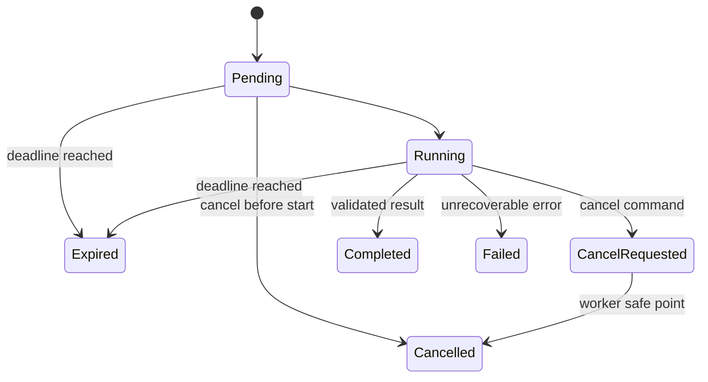

# 取消、Deadline、Checkpoint 与恢复

一个 Agent Turn 获得 180 秒执行时间。预处理用了 20 秒，检索重试两次又用了 80 秒，模型调用仍设置 180 秒 Timeout，Rerank 也重新设置 180 秒。每一层都没有超时，整条请求却可能运行十几分钟。用户点击取消后，系统只关闭 SSE 连接，后台工具仍继续消耗资源。

问题来自四个概念被混在一起：**Deadline** 限制整条 Turn 最晚何时结束，**Timeout** 限制一次等待最多持续多久，**取消** 表示外部要求停止，**Checkpoint** 保存崩溃后从哪里继续。它们会在同一执行链上协作，但不能互相替代。

::: info 四个概念各自负责什么

- **Deadline**：一个绝对时间点，恢复和重试都不能把它推后。
- **Timeout**：单个模型、工具或锁等待的局部上限，必须受剩余 Deadline 约束。
- **取消**：持久化控制状态，在安全点阻止新动作并结束运行。
- **Checkpoint**：一致阶段的状态快照，只说明恢复位置，不授予更多时间或权限。

:::

本文仍用知识问答 Turn 推演。它需要预处理、检索、生成和验证，用户可能在运行中取消，Worker 也可能在检索后崩溃。我们关心每次状态变化的所有者、停止条件和可观察证据，不把所有停止都包装成同一个“请求失败”。

## Deadline 是整条 Turn 的绝对终点

创建 Turn 时，Runtime 根据策略计算 `deadline_at = created_at + allowed_duration`，并把它持久化。Worker、恢复器和 Watchdog 都读取同一个绝对时间。调用链中传递的是 Deadline 或剩余时长，不是每层重新获得一份完整 Timeout。

绝对时间解决了预算重置问题。队列等待、准入、重试、退避、恢复和人工控制处理都消耗同一段时间。Worker 领取任务时如果 Deadline 已过，直接把非终态 Turn 变为 Expired，不再调用模型或工具。

剩余时间按 `max(0, deadline_at - now)` 计算。跨进程持久化使用带时区的 UTC 时间戳；单进程测量持续时间可使用单调时钟，避免系统时间校准让耗时倒退。两者不能混算：数据库需要可比较的绝对时间，进程内 Trace 需要不受时钟回拨影响的 Duration。

客户端可以请求较短时限，服务端 Policy 决定最大值和最小值。用户不能通过 Payload 把 Deadline 延长到绕过资源策略。创建后通常只允许收紧，例如管理员紧急缩短剩余时间；普通恢复、重试和重新投递都沿用原值。

### 阶段预算来自剩余时间

每次调用依赖前，Runtime 计算阶段预算：

```text
stage_budget = min(stage_limit, remaining_deadline - cleanup_reserve)
```

`stage_limit` 防止某个工具独占全部时间，`cleanup_reserve` 给终态提交、事件和资源释放留出空间。预算小于等于零时不启动新调用。若模型适配器还需要建立连接、重试和解析响应，这些动作共同使用阶段预算，不在内部各自重置。

不同阶段可以配置不同上限。身份和 Scope 校验应很快，检索可以容忍数秒，研究模式的模型调用可以更长。配置表达服务承诺，不代表一定把时间用完；依赖提前返回，剩余时间自然留给下一阶段。

并行分支共享 Turn Deadline。每个分支可以有局部 Timeout，汇合节点在整体预算耗尽时取消未完成分支，用已经确认的结果判断降级或失败。不能因为开了五个并发分支，就让每个分支都独立拥有一份完整 Turn 预算。

## Timeout 只描述一次等待

Timeout 回答“这次操作等多久”，Deadline 回答“整个任务最晚何时结束”。数据库连接、HTTP 请求、模型流、分布式锁和队列 Poll 都需要 Timeout，但有效值永远不超过当前阶段预算。

一次等待超时后，Runtime 还要判断剩余 Deadline 和动作性质。幂等读取可以在预算内有限重试；外部副作用结果未知时不能立即重试；确定不会恢复的配置错误直接失败。Timeout 本身不说明可重试性。

常见错误是在适配器内部写死 `timeout=180`。上层只剩 5 秒时，这个调用仍可能占用连接到 Deadline 之外。适配器接口应接收 `timeout_seconds` 或 Deadline Context，所有网络库和子任务都从中派生上限。依赖不支持取消时，还要把迟到结果隔离，不能让它在 Turn 终态后提交。

Timeout 也需要分类。连接超时表示尚未建立连接，读取超时可能发生在请求已被服务器处理之后，模型流空闲超时表示一段时间没有事件，整段响应超时则限制总持续时间。副作用工具必须保留发生阶段和外部请求 ID，避免把读取响应失败误判成动作没有发生。

## Deadline 要跨服务传播而不是逐层重建

API、Dispatcher、Broker、Worker、模型网关和工具服务可能位于不同进程。入口只保存 Deadline，却没有向下游传播，底层仍会使用默认长 Timeout。每个跨服务请求应携带绝对 Deadline 或经过限幅的剩余毫秒数；接收方取本地策略上限与传入值的较小者。

HTTP Header 可以传 `deadline-at` 或 `timeout-ms`，消息队列 Payload 保存 UTC Deadline，数据库查询设置 Statement Timeout。字段名和单位写入协议，避免一端按秒、另一端按毫秒。外部供应商不理解 Deadline 时，由适配器把剩余时间转换成 SDK Timeout，并在返回后再次检查权威状态。

跨机器时钟可能有偏差。内部服务优先传绝对时间，同时监控 NTP 偏移；安全余量覆盖网络延迟和小幅偏差。收到已经过期或异常遥远的 Deadline 时失败关闭，不按本机默认值重新开始。对第三方请求只传局部 Timeout，不泄露内部创建时间和业务标识。

队列等待是预算的一部分。任务在 Broker 中滞留到只剩几秒，Worker 不应仍启动昂贵模型。Dispatcher 可以按 Deadline 排序或提前拒绝，Worker 领取后再次判断。Broker 的 Visibility Timeout 是消息重新投递机制，不是业务 Deadline；把两者设成同一个值会让长任务重复投递，也不能保证用户时限。

数据库连接池等待、分布式锁和准入 Lease 同样消耗时间。取得资源后剩余预算可能已经变化，所以每个关键边界都重新计算，不复用入口时的数值。这里的重新计算只更新剩余量，始终使用同一个绝对终点。

下游返回错误时应带稳定类型和剩余预算摘要。上游据此决定是否还有重试空间，不接受下游建议一个超出总时限的 Retry-After。Trace 把传入、实际设置和返回时剩余时间串起来，才能定位某一层忽略预算的问题。

## 取消是持久状态而不是连接事件

用户点击停止后，API 先验证 Turn 所有权和知识库权限，再做条件状态转换。Pending Turn 没有活动 Worker，可以直接进入 Cancelled，写终态事件并释放准入；Running Turn 进入 CancelRequested，记录请求时间和命令身份，然后通知 Worker。

`cancel_requested` 必须持久化。只向进程内 Task 发 `cancel()` 或只写 Redis 标记，进程退出后信号会丢失；只写数据库又会让每个 Token 都查询一次，延迟和负载较高。常见做法是数据库保存权威状态，缓存或 Pub/Sub 提供低延迟通知。快速通道不可用时，Worker 回退数据库。

客户端断线不等于取消。SSE、WebSocket 或移动网络断开只影响交付，Turn 可以继续并保存事件，客户端重连后按 Sequence 重放。只有带身份和幂等命令的 Cancel API 才改变执行状态。把 Socket Close 映射成取消，会让代理、页面切换和网络抖动终止正常任务。

### Worker 在安全点观察取消

取消无法把任意代码瞬间变成安全终态。Runtime 在这些位置检查：

1. 领取任务后、装配上下文前。
2. 每个 Graph Node 或 Agent Loop 迭代开始时。
3. 模型和工具调用之前。
4. 长流式循环与分页循环内部。
5. 并行分支汇合和写外部副作用之前。
6. 最终答案提交和交付之前。

安全点应位于新副作用之前。取消发生在一个不可中断调用内部时，适配器尽量调用供应商 Cancel；无法中断则等待或后台查询，结果回来后先重新检查 Turn Status。CancelRequested 或 Expired 状态下，迟到结果只进审计，不能写成 Completed。

Python `asyncio.CancelledError` 属于控制流，清理代码捕获后要重新抛出或转换为明确终态，不能被宽泛的 `except Exception` 吞掉并包装成普通失败。线程池、同步 SDK 和子进程还需要各自的停止协议，取消协程并不会自动终止底层工作。

### 不响应取消的依赖需要隔离

异步 HTTP 客户端通常可以取消等待，但远端服务可能已经收到请求。取消本地 Task 只释放等待者，不代表服务器停止。适配器要记录 Request ID，供应商支持 Cancel API 时发取消命令；不支持时保留后台状态查询，迟到结果按 Turn 终态决定是否丢弃、审计或补偿。

同步 SDK 放在线程池后，取消 Future 通常不能终止正在运行的线程。低风险读取可以让线程自然结束，但要限制线程池容量并隔离迟到结果。可能无限阻塞或消耗大量资源的调用放入可终止子进程、独立 Worker 或外部 Job，使用进程级 Deadline 和资源限制。

子进程先发送温和终止信号，给它保存临时结果和关闭文件的宽限期，随后才强制结束。命令执行工具需要进程组隔离，否则只杀父进程，子进程仍会继续写文件。容器或沙箱任务还要清理网络、挂载和临时凭证，不能把 Runtime 的 Cancelled 当成资源已经释放。

模型流需要同时检查事件空闲时间、总响应 Deadline 和取消信号。服务持续发送心跳却没有有效 Token 时，空闲 Timeout 可能永远不触发；因此还要限制总时长和最大无进展窗口。收到取消后停止向客户端转发，关闭上游连接，并把已经产生但未验证的草稿标记为不可交付。

并行任务使用结构化并发。父阶段取消时，向所有子任务传播，再等待有限宽限期并收集异常。不能只取消 `gather()` 的等待者而遗留后台 Task。每个子任务的清理错误单独记录，父 Turn 的主要终态由权威状态机决定。

## Deadline 到期与主动取消不是同一终态

两者都会停止新动作，来源和用户语义不同。主动取消形成 Cancelled，说明有授权调用者要求停止；Deadline 到期形成 Expired，说明系统时间预算耗尽。依赖不可用或代码异常形成 Failed。三者分别记录原因和阶段。

终态状态机可以表示为：



Completed、Cancelled、Expired 与 Failed 只能选一个。完成与取消并发时用条件更新或 Turn 级锁裁决；终态 Event 也保证唯一。先成功的状态是权威事实，另一方重新读取并停止。客户端看到 `cancel_requested=true` 只代表命令已持久化，看到 Cancelled 才表示 Worker 已确认结束。

Deadline Watchdog 可以扫描 `deadline_at <= now` 的非终态 Turn，使用行锁领取并标记 Expired。活动 Worker 同时到达 Timeout 时会竞争同一终态，数据库约束避免重复事件。Watchdog 不直接杀进程，它改变权威状态并发布停止信号。

## Checkpoint 只写在一致阶段

Checkpoint 保存已经完成且可以作为恢复起点的状态。模型响应只收到一半、并行检索只完成部分、数据库事务尚未提交或工具副作用结果未知时，不能把快照标成完整阶段。

阶段提交顺序通常是：验证输出结构，持久化阶段产物，写 Checkpoint Revision，再发布阶段事件。若事件通过 Outbox 发布，数据库事务同时保存产物、Checkpoint 和 Outbox。恢复器只读取已提交 Revision，临时文件和未完成流不作为权威状态。

大对象不必复制进 Checkpoint。Evidence、模型原始响应和文件写受控存储，快照保存稳定 ID、哈希和版本。恢复时校验引用仍存在、Scope 仍允许、Schema 仍兼容。Checkpoint 能反序列化不表示可以继续执行。

副作用前保存 Pending Action 和稳定 Action ID，副作用后保存 Receipt。进程可能在两次保存之间退出，此时状态是 Unknown，不是 Failed。恢复先查询外部结果或用同一幂等键重复提交；无法确认就转人工。Checkpoint 不能证明外部邮件、支付或发布是否已经完成。

### 部分结果需要单独的交付语义

Deadline 到期时，系统可能已有若干可信 Evidence 和一段未完成草稿。是否交付部分结果由产品协议和质量门禁决定，不能把任何非空文本都当成功。可交付结果至少标明覆盖缺口、未完成阶段、引用状态和停止原因；安全验证未完成时通常拒绝交付草稿。

流式 Delta 是过程事件，不是最终承诺。客户端已经看到的文字可以在结束时标记 Interrupted 或 Replaced，最终 Event 明确 `expired`、`cancelled` 或 `partial_completed`。只关闭连接会让用户误以为最后一段就是完整答案。

部分完成若是正式业务状态，应在状态机里单独定义，而不是把 Completed 加一个字符串备注。它有自己的质量条件、可重试规则和反馈口径。后续继续研究使用新的 Turn 或明确 Resume Command，不能悄悄把同一终态改回 Running。

检索阶段的部分候选可以保存为 Checkpoint，恢复后继续补齐；模型流的半段 Token 通常不能直接作为下一次模型响应继续，恢复时重建输入并重新生成该阶段。不同产物的可恢复粒度不同，Checkpoint 设计要按组件能力决定。

用户主动取消时默认不交付新草稿，因为用户已经表达停止；已经成功送达并确认的中间答案保留。Deadline 到期可以根据策略返回带缺口的证据摘要。两种停止都不能伪造引用或把未验证结论降级成“仅供参考”后继续展示。

## 恢复继续使用原 Deadline

Worker 崩溃后，恢复器读取 Turn 和 Checkpoint。它先检查终态、取消、Deadline、恢复窗口、版本和当前权限，再取得执行 Lease。通过门禁后从待执行节点继续，`deadline_at` 保持创建时的值。

假设 Turn 在 10:00:00 创建，Deadline 为 10:03:00，Worker 在 10:01:40 崩溃，10:02:20 被重新领取。恢复只剩 40 秒，不能因为“这是新 Worker”重新获得 180 秒。如果剩余时间不足以完成最小安全阶段，就直接 Expire 或转人工，不启动注定来不及的模型调用。

取消状态同样跨恢复。Turn 已是 CancelRequested 或 Cancelled，检查点仍在也不能复活。恢复器负责完成取消清理或返回终态，不继续业务节点。安全撤权、工具封禁和已删除资源也能阻止旧快照继续。

恢复事件记录原 Checkpoint Revision、剩余 Deadline、执行所有者和继续节点。这样排障可以区分“恢复后时间不足”“版本不兼容”和“原节点再次失败”，而不是统一显示 Worker Error。

## 重试、恢复和重新提交的预算不同

重试发生在同一 Attempt 内，针对一次可重试依赖失败；恢复由新 Worker 接管同一 Turn；客户端重新提交可能只是传输重放，也可能是新的用户意图。三者都不能用创建新随机 ID 的方式逃避原约束。

依赖重试消耗阶段预算和 Turn Deadline，使用稳定 Call ID 或 Action ID。退避时间也计入预算。剩余时间不足以完成下一次最小调用时停止，不为了达到固定次数继续。

恢复增加 Attempt ID 和恢复次数，Turn ID、版本快照和 Deadline 不变。恢复次数在危险调用前落盘，避免每次调用期间崩溃都不计数。达到上限后 Failed 或 ManualReview。

客户端超时重发使用原幂等键，服务端返回已有 Turn。用户主动“重新生成”使用新键和新 Turn，可以获得新 Deadline，但它是新的业务执行，不能覆盖旧 Turn 的审计、外部回执和终态。

## 清理失败不能覆盖主要终态

无论 Completed、Cancelled、Expired 还是 Failed，Runtime 都要释放 Lease、准入名额、数据库连接、临时文件和子任务。清理动作设计为幂等，同一资源重复释放返回已释放；带所有者 Token 的 Lease 只能由当前持有者释放，旧 Worker 不能删掉新 Lease。

清理发生异常时，保留主要终态和 Stop Reason，把错误写入 `cleanup_errors`、告警和补偿队列。例如答案已经验证并提交，释放一个临时目录失败，Turn 仍是 Completed；把它改成 Failed 会诱导上层重新执行业务逻辑。相反，终态提交本身失败时不能报告 Completed，需要由恢复器对账。

资源按依赖顺序清理。先停止创建新任务，再取消子任务，等待可控宽限期，关闭流和连接，释放 Lease，最后发布终态可见事件。清理也受独立短 Timeout 约束，但应保留必要的后台补偿任务，不能为了快速退出丢掉外部副作用对账。

敏感临时文件按策略删除，删除失败进入安全告警。Checkpoint 的保留期与任务状态分开配置，Cancelled 不表示所有审计数据立即物理删除；隐私请求则通过专门的数据生命周期流程处理。

## 发布与关机也要走可恢复流程

Worker 发布时直接终止进程，会把正常部署制造成批量崩溃。优雅关机先停止领取新 Turn，把实例从准入和路由中摘除，再通知活动执行进入 Drain。短阶段可以在宽限期内完成并提交，长阶段在一致边界写 Checkpoint 后释放执行权。

Drain Deadline 与业务 Deadline 取较早者。不能因为服务正在发布就延长用户时限，也不能让关机无限等待一个不响应的工具。超过宽限期后，Runtime 记录最后状态并按工具协议终止或转移；有未知副作用的任务进入对账，不由新 Worker 盲目重跑。

新版本启动后，恢复器检查 Checkpoint Schema、Graph Version、Policy、权限和原 Deadline。旧版本状态不兼容时，保持旧 Worker 排空、执行确定性迁移，或带事件放弃。启动失败不能循环读取同一坏 Checkpoint，把整个 Worker 持续拉垮。

滚动发布期间可能同时存在新旧 Worker。执行 Lease 带 Owner Token 与 Generation，续约和提交都验证所有者。旧实例暂停后又恢复运行时，它的 Fencing Token 已过期，不能写入新所有者推进后的状态。

关机测试用可控屏障把 Worker 停在模型前、工具后和终态提交前，验证每个位置留下的 Checkpoint、Action Receipt 和 Status。测试还要确认进程退出后连接池关闭、子进程消失、准入名额释放，并且新 Worker 只从安全阶段继续。

容量不足导致频繁关机超时，与单个工具不响应是不同问题。指标记录 Drain 中 Turn 数、成功排空、保存检查点、强制终止、未知副作用和恢复延迟。发布系统看到风险超过阈值时暂停继续滚动，而不是同时关闭更多 Worker。

## 用确定性时钟验证控制逻辑

下面的示例用手动时钟和内存存储展示核心状态。它没有真实网络、并发数据库和供应商取消接口，只验证绝对 Deadline、阶段预算、取消安全点、检查点和清理终态。

<<< ../../examples/ai-agent/deadline_control.py

`create()` 只计算一次 `deadline_at`。`stage_budget()` 取阶段上限与剩余时间的较小值，并预留清理时间。阶段执行超过预算时直接 Expired，不写成功 Checkpoint；恢复读取原 Deadline，当前时间已越界就停止。

Pending 取消直接形成 Cancelled，Running 取消先形成 CancelRequested。下一阶段调用 `_ensure_active()` 时持久化 Cancelled，再阻止工作。示例的 `cleanup()` 即使失败也不改变 Completed，只追加清理错误。

内存示例省略了状态修订。生产数据库的保存条件包含 `turn_id`、预期 Status 和 Revision，防止迟到 Worker 覆盖终态。时间相关测试使用注入时钟，不能真的 `sleep()` 几分钟，否则测试慢且容易抖动。

## 沿一次超时和取消推演状态

Turn 在 T0 创建，允许总时长 30 秒，预留 2 秒清理。预处理耗时 4 秒并保存 Checkpoint，检索阶段配置上限 15 秒。开始检索时剩余 26 秒，有效预算是 15 秒。

第一次检索在 8 秒后连接失败。剩余总时间约 18 秒，退避 2 秒后第二次调用的有效预算变成 14 秒，即 `min(15, 16 - 2)`。它不能重新拿到完整 15 秒加清理时间。若预计请求最少需要 20 秒，Runtime 直接停止重试。

用户在第二次检索进行中点击取消。API 把 Running 更新为 CancelRequested 并发布快速信号。HTTP 适配器支持取消时终止请求；不支持时，结果返回后 Worker 在写 Evidence 前重新检查状态，发现取消，不提交检索结果。Worker 写 Cancelled、最后安全 Checkpoint 和终态 Event，然后释放资源。

如果进程恰好在 CancelRequested 后退出，恢复器读取权威状态，不从预处理 Checkpoint 继续检索，而是完成取消清理。若没有取消，但恢复时已经超过 T0 加 30 秒，则写 Expired。两条路径都不会获得新 Deadline。

| 场景 | 权威终态 | 能否继续业务节点 | 主要证据 |
| --- | --- | --- | --- |
| 用户在 Pending 取消 | Cancelled | 否 | Cancel Command 与终态事件 |
| Running 收到取消 | CancelRequested 后 Cancelled | 到下一安全点停止 | 取消时间、最后阶段、清理结果 |
| Deadline 到期 | Expired | 否 | 绝对时间、剩余预算、超时阶段 |
| Worker 崩溃且仍有时间 | Running，由恢复器接管 | 通过门禁后可以 | Checkpoint、Attempt、Lease |
| 副作用结果未知 | ManualReview 或 Failed Unknown | 不自动重试 | Action ID 与外部查询结果 |

## 测试要覆盖时间、竞态和迟到结果

示例测试验证阶段预算不会超过剩余 Deadline、超时阶段不写成功 Checkpoint、恢复不重置 Deadline、Pending 取消不启动工作、Running 取消在安全点停止，以及清理错误不覆盖 Completed。

运行命令如下：

```bash
PYTHONDONTWRITEBYTECODE=1 PYTHONPATH=examples/ai-agent \
  python3 -m unittest examples/ai-agent/tests/test_deadline_control.py
```

数据库集成测试还要并发触发完成、取消和 Expire，断言只有一个终态与一个终态 Event。Watchdog 扫描使用 `FOR UPDATE SKIP LOCKED` 或等价机制，多实例不能重复领取。恢复测试先在节点后中断，再用同一 Turn ID 继续，断言已完成节点调用次数没有增加。

适配器测试注入连接超时、读取超时、空闲超时和迟到成功。每种错误保留不同类型与 Call ID。取消后迟到的模型 Delta、检索结果和工具 Receipt 不能写入可交付答案；外部副作用 Receipt 可以保存审计，供补偿判断。

时间测试包含边界值：Deadline 正好等于当前时间、清理预留大于剩余时间、时区缺失、时钟回拨和超长用户请求。持久层统一 UTC，API 输出带时区，进程内 Duration 使用单调时钟。不要通过放宽断言掩盖时钟问题。

## 生产观测要保留停止原因

指标按 Completed、Cancelled、Expired 与 Failed 分开统计，附带受控阶段、模式和版本。观察剩余 Deadline 分布、阶段 Timeout、取消确认延迟、Checkpoint 写入延迟、恢复时剩余预算、迟到结果数和清理失败数。

Trace 记录 Turn ID、Attempt ID、Deadline、阶段开始时间、传入适配器的 Timeout、取消检查点和 Stop Reason。完整 Prompt、Evidence 与凭证不进入指标标签。日志能回答“为什么停”，而不只显示堆栈。

告警也按所有者路由。大量 Expired 可能来自容量不足或预算配置；取消确认变慢说明 Worker 安全点太稀或工具不可中断；Checkpoint 写入失败属于恢复能力下降；Cleanup Error 需要资源所有者处理。把它们合并成错误率会掩盖实际故障层。

持久化和恢复有成本。短任务、重算便宜且无副作用时，可以只保存 Turn 与事件；长研究、昂贵检索和跨进程任务才启用细粒度 Checkpoint。无论是否持久化，绝对 Deadline 和持久取消状态都应保留，因为它们约束的是资源与控制权，不是恢复优化。

设计评审时，选择一个工具在 Deadline 前一秒返回的场景：结果是否还有时间验证和提交，取消是否能在提交前赢得竞态，Checkpoint 是否只记录一致状态，清理失败会不会覆盖原终态，恢复是否错误延长时间。每个答案都能落到字段、条件更新和测试，四个概念才具有独立且可验证的职责。
