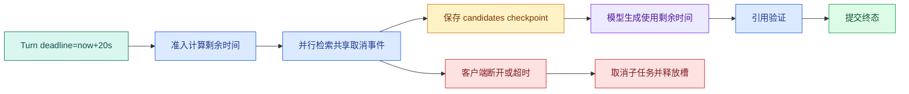

# Deadline、取消、Checkpoint 与停滞恢复：长任务怎样可控地结束

一个知识 Agent 可能要做查询改写、三路检索、Rerank、生成和引用验证。用户在第一个结果返回前关闭页面，或者供应商在生成阶段卡住，系统不能继续无限占用 Worker。`timeout` 只描述某一段代码等了多久；`Deadline` 是整个 Turn 的终止时刻；`cancel` 是主动停止信号；`Checkpoint` 则保存可以安全**恢复**的状态边界。

把四个概念分开，才能回答“现在应该停止什么、保留什么、下次从哪里继续”。

## 一条 Deadline 如何穿过多层调用



上层先生成绝对截止时刻，子函数只能使用 `deadline - monotonic()` 计算自己的预算。每个等待点都要检查剩余时间；**Deadline** 已到就不要再启动新的外部调用。客户端断开通过取消事件传递给并行任务，finally 块负责释放连接、信号量和临时文件。

这里要补一个重要边界：**SSE/HTTP 断线不必自动等于业务取消。** 移动网络切换可能让客户端几秒后重连，若一断线就取消，重放机制失去意义。更稳妥的策略是把 `transport_disconnected` 记为连接事件，Turn 继续到 Deadline；只有用户显式调用取消接口、产品策略规定无人订阅即停止，或服务端预算不足时，才设置业务取消标记。

业务**取消**要有授权和幂等语义。重复取消同一 Turn 返回当前终态；普通用户只能取消自己的 Turn；已经 succeeded/failed/expired 的 Turn 不被改写成 cancelled。取消 API 写持久化 `cancel_requested_at` 与事件，Worker 在节点边界和长循环中检查，不能只依赖进程内 `asyncio.Event`。

## Checkpoint 保存什么

**Checkpoint** 不是随便把 Python 对象 pickle 下来。它应保存可序列化、可验证、可重放的领域状态，例如已完成节点、输入摘要、知识版本、候选 ID、attempt 和事件序号；不要保存数据库连接、打开的文件句柄或供应商 SDK 对象。副作用前后要定义边界：写入向量后再保存 checkpoint，恢复时根据幂等键跳过已完成写入。

**停滞恢复**器定期扫描 `running` 且 `heartbeat_at` 过期的任务，检查租约，再把任务标记为 `recoverable`。恢复不能从任意中间变量继续，必须从最近一个完整提交的 Checkpoint 开始。

## 共享取消和安全快照

下面把“共享取消和安全快照”落成最小实现。代码关注“所有节点读取同一个绝对 Deadline 与取消信号；Checkpoint 只在安全边界提交可恢复状态”；输入从函数参数或上文定义的状态对象进入，关键分支负责校验或修改状态，返回值再交给后续调用。

```python
# 所有节点读取同一个绝对 Deadline 与取消信号；Checkpoint 只在安全边界提交可恢复状态。
from __future__ import annotations

import asyncio
from dataclasses import dataclass, asdict
import json
import time


@dataclass(frozen=True)
class Checkpoint:
    step: str
    values: tuple[str, ...]
    release_id: int


async def fetch(name: str, delay: float, cancelled: asyncio.Event) -> str:
    await asyncio.sleep(delay)
    # 收到取消信号就提交取消状态并返回，后面的工具调用和结果写入都不能再发生。
    if cancelled.is_set():
        raise asyncio.CancelledError
    return f"{name}-result"


# 入口函数按固定顺序编排各步骤，具体校验和副作用仍由各自函数负责。
async def run_turn(deadline_seconds: float) -> Checkpoint:
    deadline = time.monotonic() + deadline_seconds
    cancelled = asyncio.Event()
    # 从这里进入可能失败的外部边界，下面只转换已经明确分类的异常。
    try:
        remaining = deadline - time.monotonic()
        if remaining <= 0:
            # 这一错误会由上层映射为超时或拒绝终态，不会继续执行后续副作用。
            raise TimeoutError("turn_deadline_exceeded")
        async with asyncio.timeout(remaining):
            async with asyncio.TaskGroup() as group:
                first = group.create_task(fetch("keyword", 0.01, cancelled))
                second = group.create_task(fetch("vector", 0.02, cancelled))
            snapshot = Checkpoint("retrieval_done", (first.result(), second.result()), release_id=4)
            print(json.dumps(asdict(snapshot), ensure_ascii=False))
            return snapshot
    except (TimeoutError, asyncio.CancelledError):
        cancelled.set()
        raise


if __name__ == "__main__":
    asyncio.run(run_turn(0.2))
```

`run_turn` 只创建一个绝对 Deadline；`TaskGroup` 中的两个检索任务共享父任务的取消语义，任何一个任务抛出未处理异常时，兄弟任务会被取消。两个任务都结束后才创建 `retrieval_done` Checkpoint，因此快照不会记录半个检索结果。`asdict` 只序列化字符串、整数和元组，生产环境可以写入数据库并带上 schema 版本。

如果把 `run_turn(0.2)` 改成 `run_turn(0.01)`，超时会在任务完成前抛出，调用方应把 Turn 标记为 `expired` 并释放资源。真实服务还需要在模型 SDK 调用中传递供应商支持的取消信号；只取消本地协程而不取消 HTTP 请求，仍会产生后台费用。

## 用 pytest 验证正常、过期、取消和快照边界

下面的测试直接复用前文实现。下面的异步测试需要 `pytest-asyncio`。输入只改变 Deadline 或父任务取消时机，输出检查 Checkpoint 是否存在以及取消异常是否原样传播。

```python
# 测试分别推进正常、过期和取消路径，并确认恢复点不会包含未确认的副作用。
import asyncio

import pytest

from deadline_runtime import run_turn


# 这个用例走正常路径，并同时核对返回状态和关键业务字段。
@pytest.mark.asyncio
async def test_success_returns_a_complete_checkpoint() -> None:
    checkpoint = await run_turn(0.2)
    assert checkpoint.step == "retrieval_done"
    assert checkpoint.values == ("keyword-result", "vector-result")


# 这个用例把时间推进到截止边界，确认超时保持独立错误语义并释放资源。
@pytest.mark.asyncio
async def test_expired_turn_has_no_partial_checkpoint() -> None:
    with pytest.raises(TimeoutError):
        await run_turn(0.001)


# 这个用例主动取消运行，确认取消信号不会被重试或普通异常处理吞掉。
@pytest.mark.asyncio
async def test_parent_cancellation_is_not_converted_to_failure() -> None:
    task = asyncio.create_task(run_turn(1.0))
    await asyncio.sleep(0)
    task.cancel()
    with pytest.raises(asyncio.CancelledError):
        await task
```

执行 `python -m pytest -q`。正常路径只在两个检索都完成后返回 Checkpoint；短 Deadline 在快照创建前抛出；显式取消保持 `CancelledError`，上层才能写 `cancelled` 而不是普通 `failed`。真实状态集成测试还要断言超时写 `expired`、取消写 `cancelled`、Worker 停滞只写 `recoverable`，三者不会互相覆盖。

Checkpoint 写入测试还应注入“副作用提交后、快照提交前”崩溃：恢复器读取副作用幂等键，发现结果已存在后补写 Checkpoint，而不是再次调用外部系统。这是恢复正确性最关键的窗口。

## 取消不是删除

取消后的 Turn 仍要留下**终态**和原因，便于事件重放和用户查询。可取消步骤应在安全点检查持久化状态与本地事件；不可中断的数据库事务则要等待事务结束，再通过幂等状态阻止后续步骤。恢复器不能把用户主动取消的任务重新排队，只有租约过期且状态为 `running` 的任务才可恢复。

## 排障和练习

先看四个时间：入队时间、开始时间、最近心跳和 Deadline。再看最后一个 Checkpoint 的 step、release_id、事件序号和副作用幂等键。练习是让向量检索故意延迟，观察超时、取消、槽位释放和 Checkpoint 是否完整；然后模拟 Worker 在写入后崩溃，验证恢复不会重复写入。

## Deadline 和局部 Timeout 的关系

Deadline 是绝对时刻，局部 Timeout 是某一次等待允许使用的时长。进入每个节点前先计算 `remaining = deadline - now`，再把较小的节点上限与 remaining 传给 SDK。重试不能重新获得完整 timeout；第一次已经消耗 8 秒、总 Deadline 只剩 2 秒时，第二次最多只能使用 2 秒。

## Checkpoint 的提交边界

安全 Checkpoint 应位于纯计算完成或幂等副作用提交之后。保存“准备写向量”无法证明向量已经写入；恢复时仍需用幂等键查询目标系统。Checkpoint 至少记录 graph version、node、release_id、input hash、completed side effects 和 event sequence，结构变更时通过 schema version 做迁移或拒绝恢复。

## 停滞恢复不是无条件重跑

恢复器扫描租约过期的 running Turn，先用条件更新取得新 owner token，再读取最后 Checkpoint。用户已取消、终态已提交或 Deadline 已过的任务不能恢复。旧 Worker 醒来后如果 owner token 不匹配，所有写入都应失败，这能防止两个执行者同时推进状态。

排障演练要覆盖三种停止：客户端主动取消、总 Deadline 到期、Worker 无心跳。它们分别产生 cancelled、expired 和 recoverable/stalled 事件，不能共用一个 `failed`，否则自动恢复会把用户取消的任务重新执行。

## 常见问题

### Deadline 与 Timeout 为什么必须区分？

Deadline 是整轮请求不能超过的绝对时刻，跨队列、检索、模型、工具和重试共享；Timeout 是某一次局部等待的最长时长。节点开始前计算剩余时间，再取局部上限与 remaining 的较小值。若每次重试都获得新的 10 秒 Timeout，总请求会无限延长。绝对 Deadline 还能在 Worker 重启后继续生效，不依赖某个进程的计时器。

### 用户关闭浏览器是否等于取消 Agent 任务？

不一定。网络断开可能只是暂时失联，任务是否取消取决于产品语义。若用户显式发送取消，服务端把 Turn 标为 cancelling/cancelled 并传播信号；单纯 SSE 断线通常保留后台执行，让用户重连重放。无论哪种，HTTP 协程停止都不能自动代表数据库和 Worker 已终止。前端、API 与 Runtime 应有明确取消接口和可查询终态，避免误杀或浪费资源。

### Checkpoint 应该在副作用前还是后写？

纯计算可在完成后直接快照；外部副作用需要幂等边界。只在前面写“准备执行”无法证明是否已发生，只在后面写又存在“副作用完成、Checkpoint 未提交”的崩溃窗口。常用做法是先记录操作 ID/意图，执行带幂等键的副作用，再原子保存结果指针与 Checkpoint。恢复时先查询目标系统最终状态，已完成则补写快照，未知则按契约处理，不能直接重做。

### 取消为什么不能捕获后当普通异常返回？

`CancelledError` 是控制信号，吞掉后上层会把任务标为 failed 或继续执行后续节点，甚至覆盖 cancelled 终态。代码只在需要清理资源时捕获取消，并在 `finally` 释放槽、连接和 Lease，随后重新抛出。业务错误再映射为稳定 error code。测试应取消正在持槽和正在等待的任务，确认信号传播、资源释放、事件终态和迟到结果阻断都成立。

### 停滞扫描发现 Worker 无心跳后可以立即重跑吗？

先检查 Turn 仍为 running、未取消、未过 Deadline 且 Lease 确实过期，再用条件更新取得新 owner token。随后读取最后安全 Checkpoint 和副作用状态，决定继续、补提交或失败。旧 Worker 醒来后必须因 fencing token 被拒。无条件重跑会重复模型调用或外部写入，也可能复活用户已取消任务。恢复本身也产生 attempt 与审计事件，便于区分原执行和接管。

### Checkpoint Schema 升级后旧任务怎样恢复？

Checkpoint 保存 graph/runtime version 与 schema version。兼容变更可以通过显式迁移函数转换，迁移结果校验后再执行；破坏性变化或缺少必要字段时应拒绝自动恢复，保留旧 Runtime 完成任务或进入人工处理。不能用默认值猜安全字段，例如 Scope、Release 和已完成副作用。发布前用旧版本快照回放候选代码，验证状态迁移、终态和幂等边界。
