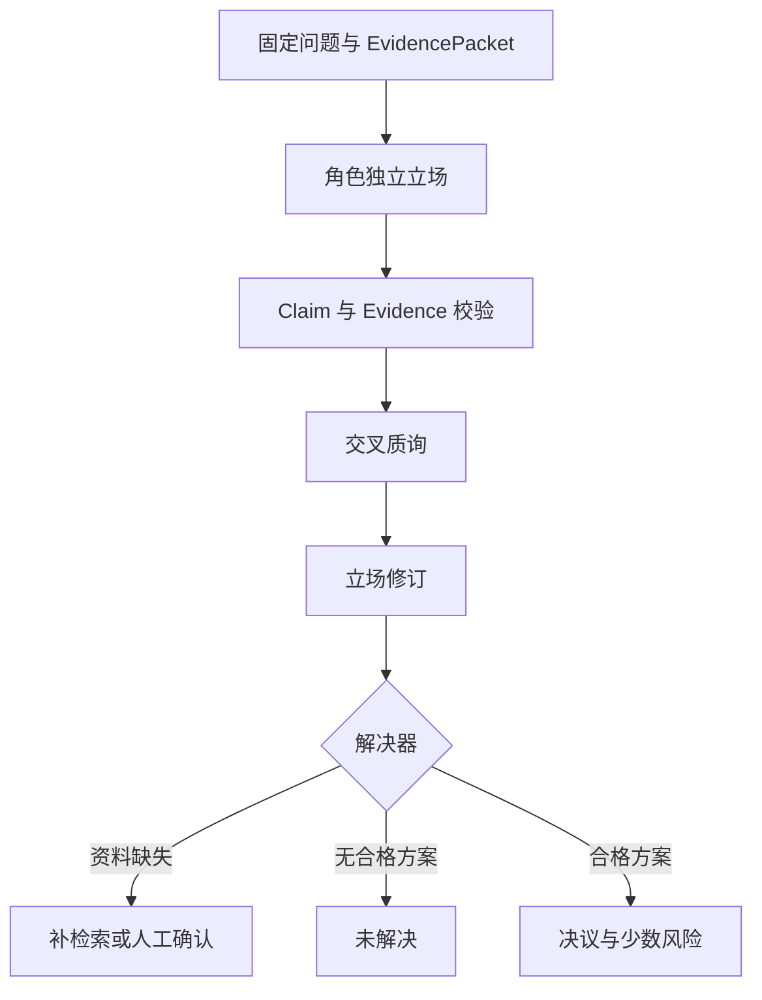

# Debate 模式：如何用证据处理分歧

一个执行器已经支持写操作审批，也能把动作限制在隔离测试范围，但最近一次演练没有留下回滚结果。团队需要决定是否让 Agent 自动执行发布。

安全视角会强调不可逆后果，运行视角关心故障恢复，交付视角关心等待成本。分歧并不来自谁说话更有气势，而是同一组事实支持了不同风险判断。

**Debate（辩论模式）** 让多个受约束角色先独立提出立场，再围绕 Evidence 交叉质询，最后由独立解决器保留共识、分歧与少数风险。模型生成候选论证，事实验证、权限和业务策略仍由程序裁决。

## 先判断分歧属于哪一种

把所有不确定问题都交给 Debate，会把可验证事实变成观点投票。

| 分歧类型 | 例子 | 更合适的处理 |
| --- | --- | --- |
| 事实不清 | 最近一次回滚演练是否通过 | 查询记录、补充 Evidence |
| 规则裁决 | 当前用户能否执行发布 | 权限与策略引擎 |
| 方案权衡 | 全自动、人工或有限试运行 | Debate 可比较风险与收益 |
| 价值取舍 | 效率与审慎如何平衡 | Debate 可保留多方影响 |
| 确定计算 | 配额是否超过上限 | 程序计算 |

发布案例在进入辩论前，先确认三条事实：审批钩子存在、执行范围可隔离、回滚演练证据缺失。角色不能自行改写这些前提，投票也无法把缺失记录变成已有证据。

若关键事实尚未取得，解决器返回 `insufficient_evidence`，任务回到检索或人工确认。继续增加辩论轮次不会产生权威事实。
## 角色应代表检查职责

“乐观派、悲观派、中立派”容易生成戏剧化观点，却不一定覆盖实际决策维度。生产角色应对应可检查职责：

```text
Safety Reviewer
  检查权限、不可逆影响、敏感数据和审批

Reliability Reviewer
  检查回滚、幂等、超时、观测和故障恢复

Delivery Reviewer
  检查交付时限、人工等待、范围和收益
```

每个角色获得同一份 EvidencePacket、同一策略版本和同一 Scope。差异来自评审准则，不来自给不同角色隐藏或伪造背景。

角色合同还要列出允许结论、必须覆盖的 Evidence 和输出 Schema。Safety Reviewer 可以提出 `manual` 或 `limited_pilot`，没有权限直接修改发布策略。

角色数量由互补检查维度决定。三个职责充分时，不需要增加五个相似角色。重复角色会增加成本，还可能制造“票数多的一方更可信”的错觉。
## 第一阶段为什么要独立作答

角色先并行读取同一问题与 Evidence，各自产生初始 Position：

```text
DebatePosition {
  position_id
  role
  proposed_decision
  claim
  evidence_ids
  assumptions
  open_risks
}
```

独立阶段避免后一个角色直接模仿第一个回答。并行执行时，每个结果绑定 `position_id`，完成顺序不能改变角色身份。

Position 中每条事实 Claim 必须引用 Evidence ID。没有引用的价值判断可以明确标为 Assumption 或 Preference，不能混入事实列表。Evidence 的活动版本、ACL 和新鲜度在进入辩论前已经固定，角色输出后仍要回查。

如果三个角色都引用同一条不存在的 Evidence，重复次数不会使它有效。评估器先剔除未知、失效和越界引用，再让合格立场进入下一阶段。
## 交叉质询要指向前提

第二阶段让每个角色选择对方的具体 Position，提出可验证质询：

```text
Challenge {
  challenge_id
  from_position_id
  target_position_id
  target_claim_id
  issue_type
  requested_evidence
}
```

有效质询类似：“你的自动发布立场依赖可用回滚，但 EvidencePacket 中只有审批钩子，没有最近演练结果。”它指出目标 Claim 和缺失材料。

“你的观点不够谨慎”属于风格评价，无法进入裁决。质询如果引入新事实，也要带来源并经过当前 Scope 验证。

被质询角色可以维持、缩小或撤回立场。回应记录 `answered_position_ids` 和修订后的 Evidence 绑定。所有角色看到的内容继续按 Token 预算裁剪，保留当前立场、未解决质询和证据摘要，不需要累积整场逐字对话。
## 事实裁决不能使用多数票

多数票适合表达偏好，无法证明事实。三个角色都说“回滚应该没问题”，回滚记录仍然缺失。一个少数角色提供当前有效的失败证据，也不能因票少被忽略。

解决器先对每个 Position 做确定性评估：

1. 所有 Evidence ID 是否存在且活动。
2. 是否属于当前用户和资源 Scope。
3. 是否覆盖决策要求的必需事实。
4. 是否回应了关键反对意见。
5. 提议的动作是否符合策略允许集合。

只有合格立场才参与方案比较。事实覆盖相同时，可以按风险策略、成本函数或人工偏好选择。选择规则必须在辩论前确定，不能让主持模型临时发明权重。
## 共识、决议和未解决状态要分开

多个角色同意同一方案可以形成共识，仍需通过策略门禁。角色长期不同意也不代表系统必须无限辩论。

一次解决结果可以表示为：

```text
DebateResolution {
  status: resolved | insufficient_evidence | unresolved
  decision
  selected_position_id
  stop_reason
  assessments
  minority_concerns
}
```

`resolved` 表示存在覆盖必需 Evidence、通过约束的立场。`insufficient_evidence` 表示决策所需事实本身缺失。`unresolved` 表示材料存在，但没有立场满足合同或方案差距仍需人工裁决。

“达到最大轮次”只是停止原因，不自动产生决议。主持模型可以生成可读摘要，结构化 Resolution 由程序根据评估结果构造。
## 少数意见为什么必须保留

最终选择有限试运行时，Reliability Reviewer 提出的“缺少回滚演练”仍是上线条件。若综合器只输出获胜立场，这个风险会从结果中消失。

少数意见应满足两个条件：使用有效 Evidence，且与已选方案存在实质差异。它可以作为前置条件、监控项、回滚触发器或人工复核项进入决策摘要。

无来源的反对意见不因“尊重少数”获得事实地位。系统可以保留为待验证假设，但要与已确认风险区分。

少数意见也有生命周期。新的回滚演练通过后，旧风险引用的 Evidence 版本失效，Resolution 需要重新计算，不能永久复制一句历史担忧。
## 一个完整的证据裁决流程



每一轮都受最大角色数、最大轮次、Token 和 Deadline 约束。检测到所有 Position 与上一轮签名相同，可以提前停止，避免重复改写相同观点。

高风险动作在 Debate 结束后仍进入审批。Resolution 只能建议 `limited_pilot`，不能替代具名审批人、动作参数哈希和当前资源版本。
## 可运行示例怎样避免投票造事实

仓库示例按 Evidence 有效性、必需覆盖和已回应立场数排序，并保留不同决策的少数意见：

<<< ../../examples/ai-agent/evidence_debate.py

示例能验证未知 Evidence、失效 Evidence、必需资料缺失和覆盖不足时不会得到伪决议。它没有调用真实辩论模型，也没有实现自然语言 Claim 抽取、ACL 查询或业务审批。

示例中的排序规则适合教学，不是所有决策的通用效用函数。生产系统要根据领域定义硬约束与偏好权重，并用历史决策和人工标注评测。Fake Position 通过只证明解决器控制逻辑正确。
## Debate 与其他模式怎样选择

| 模式 | 主要问题 | 典型控制 |
| --- | --- | --- |
| Reflection | 当前答案有哪些局部可修问题 | 问题码、一次修复、重验 |
| ToT | 多条候选路径应扩展哪一条 | Frontier、评分、剪枝、预算 |
| Debate | 同一事实下的方案权衡怎样受质询 | 角色合同、Evidence、解决器 |
| Ensemble | 多个独立预测怎样聚合 | 投票、加权或校准 |

有客观答案时先使用工具和验证器。有多个解法但目标函数明确时，ToT 更直接。有价值取舍或风险权衡时，Debate 才能通过角色职责补足视角。

一个 Agent 也可以依次扮演多个评审角色，成本较低，但各轮更容易受前文锚定。多个隔离调用能提高独立性，却带来并发和上下文成本。是否使用真正多 Agent 由评测决定，模式本身不要求拟人化进程。
## 成本和上下文怎样控制

角色数为 `n`、轮数为 `r` 时，至少会产生 `n × (r + 1)` 次立场调用，另有验证与综合。每轮把完整历史发给所有角色，输入 Token 还会持续增长。

可以保留结构化最新立场、未解决 Challenge 和 Evidence 摘要，较早轮次存入外部工作区。摘要必须保存 Claim ID、Evidence ID 和撤回状态，不能只写“各方基本同意”。

简单问题在 Router 阶段排除 Debate。执行中达到 Deadline 后停止新增轮次，用当前合格状态生成 Resolution；没有合格立场就返回未解决，不调用更多模型碰运气。

指标按角色和阶段记录调用数、Token、延迟、无效 Evidence、质询解决率和最终状态。总体“共识率”不能代表质量，高共识也可能来自角色同质化。
## 回归测试要让多数方出错

| 场景 | 关键断言 |
| --- | --- |
| 多数角色引用未知 Evidence | 不能形成事实决议 |
| 少数角色指出活动失败证据 | 风险被保留 |
| 必需回滚记录缺失 | 返回 `insufficient_evidence` |
| 角色越过 Scope 引用资料 | 该 Position 不合格 |
| 三个角色观点同质 | 不把重复表达算新增覆盖 |
| 质询只攻击措辞 | 不影响事实评分 |
| 达到最大轮次仍无合格方案 | 返回 `unresolved` |
| 新 Evidence 使旧风险失效 | 重新计算 Resolution |
| 最终建议含高风险动作 | 仍需外部审批 |
| 并发结果乱序 | Position 身份和角色不串线 |

人工评测要检查角色是否真正覆盖互补维度、质询是否指向前提、综合是否保留关键异议。自动测试则负责 Evidence、Scope、状态和停止条件不变量。

Debate 提升的是论证覆盖与反方压力，不会把意见转化为事实。所有角色共享同一证据边界，解决器拒绝无来源立场，少数风险留在决策记录，权限继续由运行时管理。满足这些条件后，多视角才会给决策增加信息，而不只是增加对话长度。
