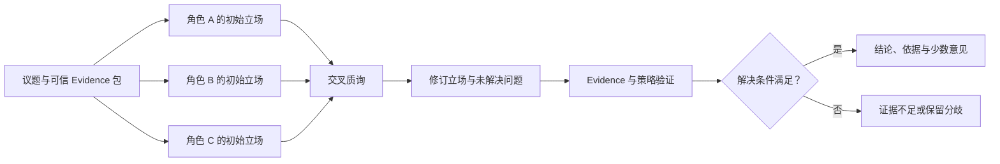

# Debate 模式：如何用证据处理分歧

一个执行器已经有写操作审批钩子，也能把动作限制在测试范围，但最近一次演练没有留下回滚结果。现在要决定是否让 Agent 自动执行发布任务。

只让一个模型回答，它可能选择“自动化效率更高”，也可能强调“没有回滚就不能上线”。两种方向都有可讨论的理由，真正需要处理的是不同职责怎样检查同一组事实：安全评审关心不可逆后果，运行评审关心恢复，交付评审关心等待成本。结论不能由哪段话更有气势决定。

::: info Debate 模式处理什么

**Debate** 让多个受约束角色围绕同一问题提出立场、引用 Evidence、质询对方，再由独立的解决阶段保留共识与分歧。事实由证据验证，权限由策略裁决，模型只产生候选论证。

:::

Debate 的重点不是模拟一场热闹对话。角色需要贡献不同的检查维度，质询必须指向可验证前提，最终结果要能解释采用了哪些证据、拒绝了哪些无来源主张，以及哪些少数意见仍需保留。

## 哪类分歧值得进入 Debate

争议可以分成事实不清、价值取舍和方案权衡。事实不清时，先检索或运行工具，不需要让角色投票决定事实；价值取舍没有唯一正确答案，Debate 可以整理受益方、受损方和约束；方案权衡有共同目标，却对成本、风险和交付顺序判断不同，也适合用角色质询暴露遗漏条件。

自动执行发布属于方案权衡。几方都承认系统存在审批钩子、回滚记录缺失、测试范围可控，分歧落在这些事实应当支持“全面自动”“全部人工”还是“有限试运行”。只要 Evidence 包稳定，角色就能围绕影响和风险展开，而不是各自编一套背景。

以下任务通常不需要 Debate：有确定公式的计算题、接口是否返回成功、某个版本是否活动、权限是否允许动作、错误日志已经指向唯一根因。它们应该由代码、工具或单路径验证回答。给客观事实安排赞成派和反对派，会把可验证问题改造成观点表演。

Debate 还要求不同视角确实有信息价值。三个角色只是换成“乐观”“谨慎”“中立”，却共享同一 Prompt、同一 Evidence 和同一评估偏好，很可能生成语气不同、论点相似的三段文字。按职责拆角色更具体：安全角色检查越权和不可逆动作，运行角色检查超时、恢复和回滚，交付角色检查依赖、等待与验收。

## 立场、论点、证据和质询分别是什么

Debate 需要结构化对象，不应把整轮对话只存成一串消息。

**立场**说明角色建议什么动作，例如全面自动、保留人工、有限试运行。它可以在质询后修订，但每个版本要有独立 ID。

**论点**解释为什么支持该立场。一个论点包含 Claim、Evidence 引用、适用条件和不确定项。语气强弱不属于事实字段。

**质询**指出另一论点缺少什么、引用是否过期，或结论有没有越过 Evidence。有效质询应落到某个 `position_id`、Claim 或 Evidence，不能只说“我不同意”。

**解决结果**记录采用的建议、证据覆盖、尚存分歧和停止原因。它由主持器或确定性解决器生成，不等同于某个角色的最后发言。

可以用下面的关系理解这些对象：



议题还要固定可信范围、活动 Release、策略版本、角色定义、最大轮次、总 Token 和 Deadline。用户正文里出现同名字段，只作为待讨论内容，不能覆盖运行时快照。

## 第一阶段先产生独立立场

初始立场应该独立生成。若第二个角色先看到第一个角色的结论，它很容易围绕已有答案做轻微调整，视角多样性从第一轮就消失。控制器把相同议题、相同 Evidence 包和各自角色合同并行发送，每个结果绑定角色 ID 与响应版本。

角色合同描述检查职责，不预设结论。安全评审不能被要求“必须反对自动化”，否则输出只是执行剧本；它应该检查写操作权限、审批、不可逆动作和证据缺口。若材料证明风险已被控制，安全角色可以支持有限或全面自动。

每个角色的输出可以采用同一结构：

```json
{
  "position_id": "security-v1",
  "proposal": "manual",
  "claims": [
    {
      "text": "回滚能力尚未经过本轮证据确认",
      "evidence_ids": ["rollback-gap"]
    }
  ],
  "unknowns": ["回滚脚本能否恢复完整状态"],
  "questions_for_others": ["有限范围是否仍会触发不可逆外部动作"]
}
```

Schema 只能保证结构可解析。`rollback-gap` 是否存在、当前用户能否读取、内容是否属于活动版本，仍由程序验证。Claim 引用未知 Evidence 时，立场可以保留作审计，但不能进入最终事实依据。

初始阶段还要检测角色重复。若两个立场的建议、Evidence 集合、未知项和检查维度都相同，继续让它们互相回复只会增加 Token。控制器可以合并重复视角，或重新生成一个覆盖尚未出现职责的角色。

## 第二阶段用质询检查前提

交叉质询不是把所有历史消息再次发送给每个角色。控制器先整理结构化论点，只把与当前角色有关的对立 Claim、Evidence 引用和未解决问题交给它。这样可以控制上下文，也能知道每次回应针对什么。

自动化支持者引用“系统已有审批钩子”，安全角色可以追问审批是否覆盖所有写动作、批准是否绑定动作参数、审批后参数变化会不会继续执行。这些问题能够转成策略检查或测试。

人工执行支持者引用“缺少回滚记录”，运行角色可以提出有限方案：保留审批，只在测试范围试运行，并把补齐回滚演练设为扩大范围的前置条件。这个回应没有否认风险，而是改变动作范围，使风险与 Evidence 对应。

每轮之后，角色可以维持、修订或撤回立场。修订版要列出新增 Evidence、回答了哪些质询、还有哪些问题未解决。覆盖旧文本会丢失论证变化，也无法判断角色是真正吸收反证，还是只换了措辞。

质询轮次要有限。可以在以下任一条件触发时停止：必需 Evidence 已覆盖且解决器能裁决；所有角色连续一轮没有新增证据、问题或建议变化；总轮次、Token 或 Deadline 到达上限；外部依赖失败，当前材料不足以继续。

“大家都表示同意”不是可靠的共识检测。模型可能为了配合对话生成“我认同前面的观点”，却没有改变 Claim 或建议。共识应该比较结构化建议、已支持事实和未解决问题，不能搜索 `agree`、`consensus` 之类词语。

## 第三阶段按证据解决分歧

解决阶段先验证事实，再比较建议。每个 Claim 的 Evidence 必须存在、可见、活动且支持当前表述；权限、范围和不可逆动作由策略程序检查。无来源的主张不能因为多个角色重复而变真。

示例里有四个候选：两个角色支持全面自动，却分别引用不存在的性能基准和调研；安全角色支持人工执行，引用回滚缺口；运行角色建议有限试运行，同时引用审批钩子、回滚缺口与测试范围，并回应了自动化和人工两种方向。

全面自动有两票，但两份论点都缺乏有效 Evidence。有限试运行只有一票，却覆盖当前决策要求检查的三项事实。解决器应选择有限试运行，并把“缺少回滚证据，暂时只允许人工执行”保留为少数风险意见，供审批人与后续演练查看。

::: warning 多数票只能表达偏好

投票适合处理主观偏好或多个均已合格方案的选择。事实真假、权限允许、版本活动和测试是否通过，必须由 Evidence 与程序验证。三个模型一致引用了不存在的来源，仍然是三个错误候选。

:::

解决器可以按顺序处理：先淘汰未知或失效 Evidence；检查必需事实的覆盖；核对是否回答高优先级质询；最后才比较成本、风险和偏好。各维度不能随意加权抵消。越权动作即使其他得分很高，也不能进入成功。

主持人模型可以负责把已验证结果写成自然语言，但不应自行改变裁决。输入要包含合格立场、无效原因、少数意见和策略结论，输出后再次检查关键事实是否保留、有没有新增未引用数字。

无法解决也是正式结果。Evidence 包缺少回滚状态时，可以返回 `insufficient_evidence` 并列出缺失项；多份合格立场覆盖相同事实，却代表无法由技术系统决定的价值选择时，返回 `unresolved`，交给明确的责任人。强制模型写一个唯一答案会隐藏真正的决策边界。

## 一次发布自动化讨论怎样推进

输入议题是“是否允许 Agent 自动执行发布”。运行时固定测试范围、策略版本和三个 Evidence：

- `approval-hook`，写操作会进入审批钩子。
- `rollback-gap`，最近一次演练没有回滚结果。
- `test-scope`，执行器可以限定在测试范围。

第一轮中，效率评审与交付评审都支持全面自动，但引用了 Evidence 包中不存在的材料；安全评审建议全部人工，依据是回滚缺口；运行评审建议有限试运行，保留审批并限制范围。

交叉质询时，安全评审指出有限试运行仍要说明外部副作用；运行评审回答动作只在测试范围执行，扩大范围前必须补回滚验证。全面自动的两个角色没有补出可核验来源，相关 Claim 继续处于 `unsupported`。

解决器依次执行：

1. 验证每个 Evidence ID，两个全面自动立场因未知来源失去裁决资格。
2. 计算必需 Evidence 覆盖，人工立场只覆盖回滚缺口，有限试运行覆盖三项。
3. 检查有限立场回应了自动与人工方向的质询。
4. 选择 `limited_pilot`，保存人工立场中的回滚风险。

对外结论可以写成：“当前保留写操作审批，只允许在测试范围试运行。扩大范围前需要完成回滚演练并保存结果。”Trace 记录四个立场、未知 Evidence、覆盖率、质询关系、选择结果和停止原因。

如果 `rollback-gap` 没有进入 Evidence 包，解决器不会把其他两项拼成结论，而是返回 `missing_required_evidence:rollback-gap`。这时继续辩论没有新材料，只会重复已有观点，正确动作是补证据或停止。

## 用 Python 验证证据裁决

共享示例没有调用真实模型，只实现解决阶段的确定性边界。`assess_position` 区分有效、未知和非活动 Evidence，计算必需事实覆盖；`resolve_debate` 先检查 Evidence 包是否完整，再按覆盖与回应关系选择候选，多数票不参与事实裁决。

<<< ../../examples/ai-agent/evidence_debate.py

运行示例测试：

```bash
PYTHONPATH=examples/ai-agent \
python3 -m unittest discover -s examples/ai-agent/tests -p 'test_*.py'
```

当前执行得到 `Ran 55 tests` 和 `OK`。Debate 新增两项断言：两个无来源的自动化立场不能压过一个完整引用 Evidence 的有限方案；必需的回滚证据缺失时，解决器返回 `insufficient_evidence`，不会生成决定。

这段 Demo 只证明本地裁决函数。真实 Debate 还需要模型适配器、并行初始轮、质询路由、上下文预算、状态持久化和取消。角色输出要做契约测试，Evidence 验证要接入当前权限与 Release，策略动作仍由独立授权层完成。

## 角色设计比角色数量更重要

角色可以按利益相关方、专业职责、约束维度或方法论拆分。生产工程问题更适合专业职责，因为每个角色能对应检查器和责任边界。纯粹的“乐观派”“悲观派”容易把辩论变成语气差异。

一个角色合同应回答：它检查哪些输入，可以使用哪些工具，必须引用哪些证据，能提出什么类型建议，不能决定什么。安全评审可以阻断越权动作，却不能替用户决定业务偏好；成本评审可以估算资源，却不能放宽隐私策略。

角色之间还要有最小重叠。完全没有重叠时，它们只是在各写一份报告，无法互相质询；重叠太多又会得到相同答案。可以让每个角色拥有一个主要职责，同时都检查 Evidence 可用性和议题目标。

使用多个模型供应商有时能增加差异，但不能自动消除共同错误。它们可能都依赖同一份错误文档，或共享相似训练偏好。真正重要的是证据独立性、角色合同与解决器，模型多样性只是候选生成的一部分。

同一模型扮演多个角色时，初始轮需要隔离上下文，避免后一个角色复读前一个角色。质询轮再有选择地共享结构化论点。随机参数可以增加表达差异，不能替代职责差异。

## 上下文与 Token 怎样控制

若每轮把所有角色的完整历史复制给每个人，上下文会随角色数和轮次快速增长。第二轮还会包含第一轮全文、相互回复和主持人摘要，很多内容只是重复立场。

运行时应维护论点存储，而不是聊天转录。每条 Claim 保存来源、当前状态、被谁质询、是否已回答。给角色组装上下文时，只选择议题、可信 Evidence、它自己的当前立场、需要回应的对立 Claim 和剩余预算。

历史摘要只能压缩表达，不能改变证据关系。摘要要保留 `position_id`、Evidence ID、未解决问题和立场修订；没有这些坐标，后续角色无法知道自己回应的是哪一版论点。

角色并行调用共享绝对 Deadline。某个角色超时后，控制器根据议题合同决定用剩余角色继续，还是返回部分完成。超时角色不能在解决完成后写回旧立场。总预算接近上限时，减少后续质询对象或直接进入解决阶段，比让所有角色得到新的完整轮次更可控。

## 常见失败怎样留下证据

**角色给出相同论点**，比较建议、Evidence 集合和未知项，而不是文本相似度一项。若结构重复，合并角色或重新设计职责。

**辩论轮次增加，分歧没有变化**，检查新增 Evidence、修订 Claim 和已回答问题是否都为空。连续一轮无进展就应停止，不能等模型自己说达成共识。

**多数角色引用同一个错误来源**，在解决阶段验证 Evidence 与版本。来源错误属于事实层问题，增加反方角色或再投一次票没有用。

**主持人产出折中话术**，却没有明确建议，说明解决合同只要求“综合观点”。输出应包含状态、采用建议、依据、少数意见和缺失项，不能用“各方都有道理”代替裁决。

**少数意见在结果中消失**，解决器应保留所有合格但未选立场中的风险 Claim，尤其是不可逆动作、安全与合规问题。保留不表示采纳，而是让责任人知道结论没有覆盖什么。

**模型把外部文档里的指令当成辩论规则**，说明 Evidence 与指令没有分层。不可信内容只能作为数据，角色定义、轮次和工具权限来自运行时。

**投票分数很接近**，不要继续增加轮次直到出现明显赢家。先判断各方案是否都已满足事实和策略门槛；若剩下的是业务偏好，交给有权负责的人选择。

**辩论结果被写入长期记忆后影响新议题**，检查持久化内容。一次解决结果属于特定 Evidence、Release 和时间，不应被保存成永久事实。可以保存决策记录与来源，后续使用前重新验证活动版本。

## 共识、投票和裁决不是同一件事

共识表示合格立场在建议或事实解释上趋于一致。它可以提前结束讨论，但仍要经过 Evidence 与策略验证。所有角色都同意执行越权动作，运行时依然拒绝。

投票把多个偏好聚合成选择。适合候选都已通过约束、差异来自主观目标的场景，例如在两个同样合格的文案版本中选择一个。投票权重若来自模型自报置信度，仍需先证明分数经过校准。

裁决根据预先声明的规则判断哪些候选合格、哪些事实缺失、最终动作由谁批准。自动发布示例采用 Evidence 覆盖和回应质询作为候选排序，再由既有审批策略控制写操作。裁决可以返回未解决，不承担制造共识的任务。

人类审批也不能只看到最终摘要。审批界面至少展示动作范围、支持 Evidence、未解决问题、少数风险意见和参数指纹。审批后参数改变，原批准失效；这属于动作合同，不由主持人文字决定。

## Debate 与相邻模式怎样选择

| 模式 | 候选之间的关系 | 主要目的 | 典型终态 |
| --- | --- | --- | --- |
| Reflection | 同一个答案的原版与修订版 | 修复已定位问题 | 通过、阻断或修复上限 |
| Tree of Thoughts | 同一问题的不同搜索路径 | 找到可验证路径 | 最佳终态或预算耗尽 |
| Debate | 不同职责或立场的论点 | 检查分歧与盲点 | 裁决、证据不足或保留分歧 |
| Ensemble | 相互独立的多个预测 | 降低单次随机性 | 投票或加权结果 |
| 多 Agent 编排 | 有依赖的多个子任务 | 分工完成复杂目标 | 合并结果或部分完成 |

Reflection 适合答案已经存在、问题可以被验证器指出的场景。Debate 不应为了增加角色数，把一次有限修复改造成多人讨论。

ToT 搜索解空间，低分路径可以剪掉。Debate 中的少数意见可能代表真实风险，不能仅因人数少或表达弱就删除。两者可以组合，例如各角色分别探索方案，但状态和预算会明显增加，只有评测证明单一模式不足时才值得。

Ensemble 通常不安排相互质询，多个预测可以并行后投票。Debate 的价值来自角色看到对立 Claim 后修订或补证据。若系统最后只数票，前面的对话大多没有进入决策。

多 Agent 编排强调任务依赖和结果合并。Debate 可以由多个 Agent 实现，也可以由同一个模型分角色运行；是否多进程、是否使用不同模型，不决定它是不是 Debate。

## 怎样评测 Debate 是否真的减少盲点

Debate 的离线评测不能只问最终答案是否更长、是否提到了更多角度。测试集需要同时包含三类样本：确实存在职责冲突的方案题，Evidence 不完整而必须停止的题，以及有确定答案、不该进入辩论的事实题。第三类可以发现路由器是否把简单问题也送进昂贵流程。

方案题要预先标注验收约束，而不是只提供一段参考答案。发布自动化样本可以要求：识别审批钩子，发现回滚证据缺失，保留测试范围限制，不允许无来源的性能结论进入裁决。模型用不同措辞，只要这些约束和证据关系正确，就能通过。

一组样本还应准备相互冲突的 Evidence：旧版本写着允许自动执行，当前版本要求审批；摘要说演练成功，原始回执却缺少回滚步骤。系统要优先采用活动版本和可定位回执，角色人数不能改变证据优先级。

可以从以下维度分别看结果：

- **事实支持率**，最终 Claim 中有多少能回到有效 Evidence。
- **约束覆盖率**，题目要求检查的权限、恢复和范围是否都被处理。
- **反证吸收率**，质询提出有效反例后，后续立场是否修订或明确回答。
- **少数风险保留率**，未被采用但有证据的高风险意见是否进入结果。
- **无效共识率**，角色一致却违反 Evidence 或策略的结果有多少被阻断。
- **正确停止率**，证据不足和价值冲突是否返回对应的非成功状态。
- **调用成本**，角色数、轮次、Token、延迟与超时分别是多少。

这些指标不能压成一个总分。无效共识属于安全问题，即使平均内容质量上升也不能抵消；少数风险保留下降，可能说明主持人越来越偏好简洁答案，而不是系统真的减少了分歧。

至少与单 Agent、单 Agent 加一次 Reflection、没有交叉质询的 Ensemble 做对照。所有方案使用相同 Evidence 与总 Token 上限。若 Debate 的改进只来自更大的调用预算，把同样预算给 Reflection 后也许能得到相近结果，不足以证明多角色是必要组件。

消融实验可以逐项拿掉角色隔离、质询轮、少数意见和确定性解决器。去掉质询后质量不变，说明角色只是在并行写报告；去掉少数意见后高风险样本开始漏警，说明该字段参与了交付；换成多数票后无来源结论进入成功，则证明 Evidence 裁决不能省。

在线观察不保存用户正文到指标标签，只按议题类型、版本和停止原因聚合。需要关注角色重复率、无进展轮次、证据不足、主持人新增事实、人工推翻结果和单位合格答案成本。人工经常因同一个缺口推翻结论时，应把缺口改成结构化验收，而不是继续增加角色。

回归集还要保存行为语义。一次明确的 `insufficient_evidence` 在新版本里变成流畅结论，属于严重回归；原本保留的安全少数意见被摘要删除，也不能因为最终建议没变就算通过。评测记录应能定位是角色生成、Evidence 验证、解决器还是文案生成阶段引入变化。

## 生产实现需要保存哪些状态

持久层至少保存议题版本、角色合同、每版立场、Claim、Evidence 引用、质询关系、轮次、预算、解决结果和停止原因。原始 Prompt 与大段 Evidence 放在受控存储，Trace 保存稳定引用与内容摘要，避免把敏感正文复制到指标标签。

状态迁移可以是 `collecting_positions`、`cross_examining`、`resolving`、`resolved`、`unresolved`、`cancelled`。解决完成后不允许迟到角色把议题退回质询中。角色调用重试使用稳定调用 ID，相同响应只接纳一次。

Evidence 被撤回或 Release 更新时，旧解决结果要标记过期。系统可以保留当时为何作出决定的审计记录，但不能继续把旧共识当作当前知识。缓存键包含议题版本、角色合同版本、Evidence 集合和解决器版本。

上线评测需要比较单 Agent 基线与 Debate：事实支持率、必需约束覆盖、未解决问题识别、少数风险保留、Token、延迟和超时。还要加入无证据多数、重复角色、恶意 Evidence、主持人新增事实和无法共识等反例。

若 Debate 只让答案更长，没有提高约束覆盖，也没有发现单 Agent 漏掉的问题，就应退回更简单的模式。复杂度要由可观察的质量变化支付，而不是由角色数量证明。
