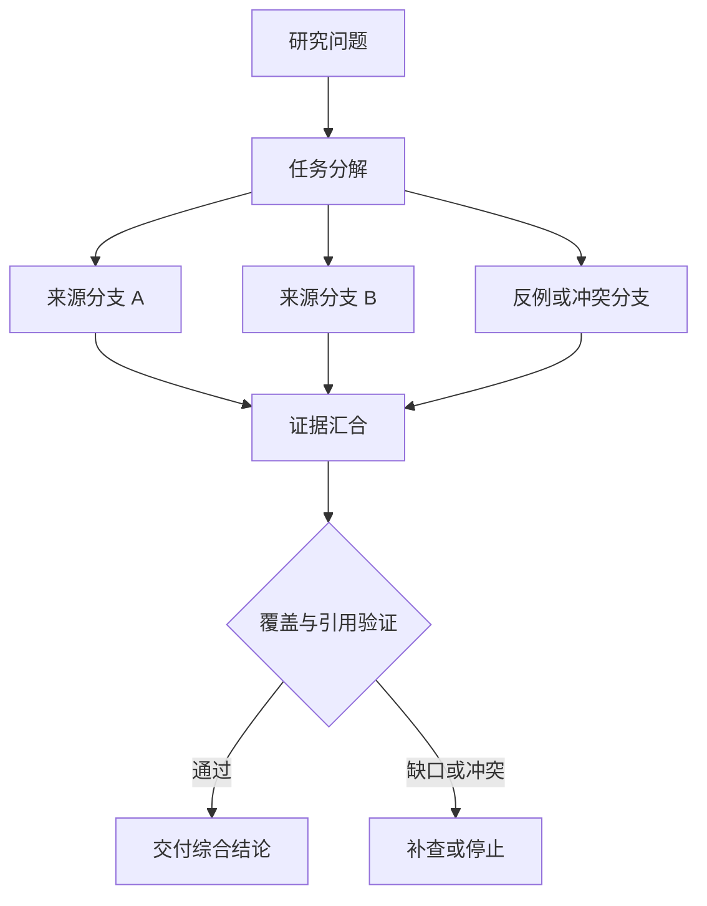

# Deep Research Agent 怎样组织多轮检索

普通搜索通常回答“有没有一份相关材料”。研究型 Agent 要回答的是“这个问题的必需维度是否都被覆盖，来源之间是否冲突，哪些结论仍然不能确认”。它不是把更多搜索结果塞进上下文，而是把研究任务拆成可验收的子问题，记录每一轮新增了什么证据，再决定继续、补搜或停止。

**Deep Research** 位于检索策略、证据管理与运行时控制的交界处。研究问题、`SearchPlan`、分支范围、知识版本、Evidence、覆盖缺口、冲突、预算和停止原因都由运行时保存；模型只提出子问题、查询和综合候选。权限、Release、Deadline、最大轮次和最终交付条件不能由网页内容或模型输出覆盖。

::: info 贯穿示例

研究任务是“核对一个协议能力是否同时满足规范、实现和回归测试”。规范分支、实现分支和测试分支可以并行，但每个分支都必须声明范围、`top_k`、允许的通道和截止时间。测试分支先返回并不代表研究完成，综合器还要检查规范和实现是否支持同一条 Claim。

:::

一次研究的主链路是“固定问题范围 → 生成 SearchPlan → 执行分支 → 审查来源 → 更新覆盖 → 决定下一轮”。状态记录的不只是查询字符串，还包括该查询覆盖的主题、使用的通道、返回的来源 ID 和新增 Evidence 数。这样才能判断第二轮到底补了缺口，还是只换了关键词重复命中同一批页面。

普通搜索、RAG 和 Deep Research 的区别不在于是否调用向量库。普通搜索通常只交付排序结果；RAG 重点是为一次回答准备可引用的候选；Deep Research 还要维护研究问题、覆盖矩阵、冲突和停止理由。三者可以组合，但必须由运行时分别验收它们的输出。

Deep Research Agent 组织多轮检索的架构图要标出组件职责、研究问题的唯一所有者、子任务契约经过的接口，以及查询不断改写却无新增证据怎样传播。Deep Research 的架构记录要写明新增状态、恢复路径和运维代价，组件名称本身不能用于故障定位。

## 一个执行单元为什么不够

在 Deep Research 流程中，入口先固定可信范围；缺少来源时直接结束当前路径，不能让模型补字段继续推进。

查询不断改写却无新增证据会破坏研究问题与带来源的子结果之间的对应关系，排查时先保留原始输入摘要和发生阶段，再判断是否允许重试。

来源互相转载影响子问题或下游解释，不能和查询不断改写却无新增证据共用“重新调用一次模型”的处理方式。

## Deep Research Agent 组织多轮检索的协作边界

在 Deep Research 中，运行时持有全局预算和依赖状态，局部执行单元只能修改合同允许的那部分。因此研究问题与子问题要有唯一写入方，其他组件只能通过版本化命令申请修改。

普通搜索与 Deep Research Agent 组织多轮检索解决的问题相邻，但控制权不同，比较时要看谁选择并行取证、谁保存研究问题、谁确认带来源的子结果。

RAG 可以参与同一请求，却不能替代 Deep Research Agent 组织多轮检索；组合后仍要单独检查子任务契约的可信来源和查询不断改写却无新增证据的终止规则。

Deep Research Agent 组织多轮检索使用的身份、范围和版本来自可信运行时，父目标可以表达意图，但不能提升权限或改写活动 Release。

来源互相转载发生时，错误回到子问题的所有者处理，上游缺输入、当前组件违反不变量和下游不可用分别形成不同终态。

Deep Research Agent 组织多轮检索的确定性边界位于研究问题写入之前。模型在 Deep Research 中只提交候选值，程序仍要从认证、版本和策略快照补入可信字段。

Deep Research Agent 组织多轮检索内部可以使用更细的临时对象，跨边界只暴露稳定协议。替换普通搜索时，调用方不需要理解内部缓存和 SDK 响应。

## 任务契约、依赖与工作区状态

Deep Research Agent 组织多轮检索的输入合同至少列出父目标、子任务契约和依赖图，每项都注明来源、是否必需、允许的缺省值，以及缺失后是在入口拒绝还是进入降级路径。

研究入口还要固定研究模式。`fast` 只执行一轮、使用较小的分支预算，适合用户已经给出明确来源的核对；`standard` 允许有限补搜，要求必需主题有基本覆盖；`deep` 才允许多轮分解、来源审查和冲突复核。模式不是模型的风格开关，而是运行时对 `max_research_rounds`、`evidence_budget`、`minimum_coverage` 和 Deadline 的组合配置。客户端可以请求模式，服务端仍要根据租户配额和风险策略裁剪上限。

`SearchPlan` 的每个分支至少保存 `branch_id`、主题 ID、查询或查询模板、检索通道、Scope、`top_k`、依赖和剩余预算。`branch_id` 必须唯一；两个分支即使查询文本相同，只要 Scope 或主题不同，也不能合并成一个结果。规划器可以建议并行，但 `_fanout_research` 一类的执行器负责在真正派发前检查当前 Release、权限和剩余时间。

Deep Research 要分开维护研究问题、子问题、查询和证据版本。研究问题决定最终覆盖标准，子问题决定分支，查询记录实际搜了什么；若把它们只存成计划文本，就无法判断某个结论是未搜索、搜索失败还是证据冲突。

并发分支按稳定身份合并查询，完成顺序只反映耗时，不能决定结果属于哪个请求，更不能让迟到的旧状态覆盖新修订。

Deep Research 对外结果要分别表达可交付内容、缺口、取消和未知状态，调用方不必解析错误文案。

子问题参与乐观并发检查；处理开始后若版本变化，旧候选只保留作审计，不能继续写入研究问题。

若 Deep Research 收到模型代填的身份、范围或版本，应用会丢弃这些值并从可信上下文重新装配。

子任务身份、来源、工作区版本、覆盖缺口、冲突和合并裁决组成 Deep Research Agent 组织多轮检索的最小追踪材料，日志只保存稳定 ID、版本和错误类，完整 Prompt、文档正文与凭证不进入指标标签。

撤回 Deep Research 的来源或任务时，相关候选按版本失效，稳定 ID 只保留审计关系。

契约还需要描述新鲜度。子问题对应的数据发生变化后，旧缓存、旧候选和未完成任务怎样失效，应由版本或时间规则直接判断，不能依赖模型注意到矛盾。

删除和撤回也属于数据生命周期。Deep Research Agent 组织多轮检索引用的原始对象被移除时，稳定 ID 可以保留审计关系，正文与派生结果则按策略失效，避免继续向用户展示过期内容。

::: warning Deep Research Agent 组织多轮检索的可信边界

带来源的子结果通过结构校验后仍是候选。Deep Research Agent 组织多轮检索使用的身份、权限、知识版本与业务事实由应用从可信服务读取，核对完成后才能执行或交付。

:::

## 分派、执行和汇合机制

Deep Research Agent 的执行轨迹应显示问题如何分解、哪些搜索并行、哪条来源被审查，以及补搜填补了哪个缺口。边际收益为零或 Deadline 到期时，运行时写入停止原因并保留已确认证据，不能只返回一段综合摘要。

每一轮可以按下面的顺序运行：先由确定性代码计算剩余时间和 Evidence 配额，再让模型从缺口清单提出候选分支；运行时删除越过 Scope、重复 `branch_id` 或超过 `top_k` 的提议；检索器并行返回候选；来源审查器过滤不可访问、过期、重复转载和正文与标题不一致的材料；覆盖评估器更新主题状态，最后由停止函数决定是否进入下一轮。模型不能跳过来源审查直接把网页摘要写进答案。

在多轮执行中，Evidence 预算要按“候选、审查、交付”分开记账。候选阶段可以收集较多稳定 ID，审查阶段只保留能回到原文的材料，交付阶段再按 Claim 选择少量证据。若把所有候选都传给模型，Token 预算会被低价值重复内容耗尽；若过早裁剪，又可能丢掉解决冲突所需的反证。每次裁剪应保存被舍弃的 ID 和原因，方便回归时解释覆盖变化。

拆分问题接收父目标并建立研究问题，入口校验未通过就地结束，后续模型、检索器或工具调用次数保持为零。

分派 Deep Research 的子任务时，身份、范围、配置版本和绝对 Deadline 一次冻结，后续只继承剩余时间。

并行取证读取子问题并执行主题逻辑，参数由应用组装，外部返回先保存为缺口清单，尚未获得修改领域状态的资格。

处理冲突检查结构、范围、版本和主题不变量；带来源的子结果缺少来源、落在旧版本或越过权限时，研究问题停在 rejected 或 failed。

汇合 Deep Research 结果时先保存来源和终止原因，再发送事件；核心状态未写入就不能宣称完成。

并行 Deep Research 分支只完成一部分时，程序按任务合同选择保留、补偿或整体丢弃，并列出未完成项。

实现可以使用函数、Graph、Middleware 或 Workflow，研究问题的所有权和查询不断改写却无新增证据的停止规则不会随框架改变。

部分成功需要在步骤边界处理。当 Deep Research 已经产生部分候选，先记录哪些可重建、哪些有外部副作用，再决定重试或补偿。

Deep Research 的并行和冲突处理都要记录逆向动作；可重建结果可以重算，已发送命令只能查回执或补偿。

## 用冲突来源推演一次研究

先给研究任务一个可执行的目标，而不是“尽可能多查资料”：在固定知识版本和用户范围内，判断某项协议能力是否同时被规范、实现和测试支持。必需主题为 `spec`、`implementation`、`test`，最小覆盖阈值设为 3，最大研究轮次设为 3，Evidence 预算设为 12。

沿“Deep Research Agent 组织多轮检索场景：研究任务需要同时核对协议规范、实现约束和测试证据，三个分支完成时间不同且可能给出冲突结论”推演 Deep Research Agent 组织多轮检索：入口创建 request_id，读取可信身份，把父目标和当前版本写入初始状态。

拆分问题生成研究问题与输入摘要；若子任务契约缺失，请求返回 rejected，并指出缺少哪项材料，不继续消耗模型或外部服务配额。

启动 Deep Research 分支前冻结 Scope、Release、Policy 和 Deadline，正文中的同名字段不能覆盖运行时快照。

第一轮生成三个唯一 `branch_id`。规范分支找到官方定义，实现分支找到源码中的能力开关，测试分支找到成功和失败断言。每次依赖调用保存 `call_id`、参数摘要、开始时间、Scope 和状态版本，以便判断超时前是否已经产生结果；来源审查再把这些返回转换成 `ResearchEvidence`，而不是直接把原始响应交给综合器。

Deep Research 的候选必须带来源、范围和版本，校验通过后才进入下一状态。

汇合结果写入终态；客户端断开只影响交付通道，重新连接时读取已经保存的研究问题或事件游标，不重跑核心逻辑。

假设第一轮的实现分支返回了旧 Release 的源码，来源审查把它标成 stale，覆盖报告因此缺少 `implementation`。第二轮只补这个缺口，并把活动 Release 作为分支范围；如果新分支仍返回旧版本，停止函数记录“来源不可用”，而不是继续改写查询直到看起来覆盖完成。这个故障注入只重做失败边界，不从入口复制整个研究状态。

推演结束后用 request_id 关联研究问题、带来源的子结果与终止原因，测试据此排除并发请求串线，并确认失败路径没有遗留未关闭资源。

Deep Research Agent 组织多轮检索在输入拒绝时不调用依赖，正常路径按 5 个阶段推进，有限修复只重做失败边界。调用次数是控制流断言，不是性能宣传。

Deep Research Agent 组织多轮检索的最终记录用 request_id 关联研究问题、带来源的子结果和失败问题，测试据此证明结果来自本次执行，没有混入并发请求。

## 正常汇合怎样证明覆盖

Deep Research Agent 组织多轮检索正常完成时，研究问题、子问题和带来源的子结果指向同一次执行，重复读取返回同一终态，未完成分支已经取消或有明确所有者。

子任务身份、来源、工作区版本、覆盖缺口、冲突和合并裁决用于还原 Deep Research Agent 组织多轮检索的处理过程，可以按阶段和版本聚合；敏感正文留在受控存储中，不复制到日志与指标。

Deep Research 可以返回空结果，但必须同时说明范围、版本和原因；要求命中材料时，空结果应进入拒答。

依赖返回成功状态只证明传输完成。Deep Research Agent 组织多轮检索还要检查带来源的子结果是否满足业务范围、质量阈值和当前版本，明确拒绝也可能是正确终态。

Deep Research 的分支按稳定身份合并，完成顺序只代表耗时，迟到结果不能覆盖新修订。

研究问题的状态迁移必须单调：完成不能退回运行中，取消不能被迟到结果覆盖，失败重试也不能绕过入口已经固定的权限。

Deep Research Agent 组织多轮检索的成功证据最终要同时回答输入是什么、执行了哪些步骤、交付了什么以及为什么停止；任一项缺失都应留在未确认状态。

Deep Research Agent 组织多轮检索把业务验收与服务健康分开。依赖对 Deep Research 返回 200 只说明传输完成，内容仍要满足当前范围和质量条件。

Deep Research Agent 组织多轮检索的观测指标按阶段和版本聚合。评估 Deep Research 时，把错误、空结果、拒绝、恢复和资源消耗分开统计，避免一个成功率掩盖不同故障。

## 重复研究、冲突与取消传播

研究循环的失败要落到具体回执：子问题没有来源时进入补搜，来源不可访问时记录依赖错误，来源互相矛盾时交给综合阶段，达到预算则正常停止。只有保留这些终态，研究结果才不会把“没有找到”写成“没有发生”。

遇到查询不断改写却无新增证据时，先记录发生阶段、错误类别和责任对象。Deep Research Agent 组织多轮检索保留输入摘要和状态版本，由对应组件决定重试、降级或终止。

遇到来源互相转载时，先记录发生阶段、错误类别和责任对象。Deep Research Agent 组织多轮检索保留输入摘要和状态版本，由对应组件决定重试、降级或终止。

时间范围混乱触及 Deep Research Agent 组织多轮检索的安全边界，重试不会使它自动合法；执行路径保存拒绝规则和输入来源，清除未授权候选，并以稳定错误结束当前动作。

遇到引用时，先记录发生阶段、错误类别和责任对象。Deep Research Agent 组织多轮检索保留输入摘要和状态版本，由对应组件决定重试、降级或终止。

遇到结论错位时，先记录发生阶段、错误类别和责任对象。Deep Research Agent 组织多轮检索保留输入摘要和状态版本，由对应组件决定重试、降级或终止。

遇到截止时间后仍继续时，先记录发生阶段、错误类别和责任对象。Deep Research Agent 组织多轮检索保留输入摘要和状态版本，由对应组件决定重试、降级或终止。

Deep Research Agent 组织多轮检索将终态、可重试性和资源清理结果写入记录；后台扫描器根据研究问题判断任务是在运行、等待恢复还是已失败。

Deep Research Agent 组织多轮检索执行前固定 Deadline、动作上限、重复签名、无进展阈值、预算和取消信号；任一条件触发，并行取证停止创建新工作。

Deep Research Agent 组织多轮检索把重试时间和次数计入总预算。Deep Research 每次重试先扣减剩余额度，达到上限就保留原始错误。

Deep Research Agent 组织多轮检索的清理动作设计成幂等操作；仍被活动任务或 Lease 引用的资源拒绝删除。

## 编排测试与来源核对

用可重复的依赖图模拟完成、超时与取消，核对每份结果的任务 ID、来源、预算和合并裁决；测试显式给出父目标、初始研究问题、预期带来源的子结果和终止原因，不能只断言返回值非空。

Deep Research Agent 组织多轮检索的单元测试用 Fake Adapter 固定带来源的子结果与错误，断言参数、调用顺序、状态修订和清理动作，这些结果只证明本地控制逻辑。

契约测试围绕父目标、研究问题和缺口清单构造合法与非法样本，Schema 解析成功后继续检查权限、版本与领域不变量。

故障测试注入查询不断改写却无新增证据和来源互相转载，记录并行取证是否被调用、研究问题是否改变、资源是否释放，以及同一身份重试会不会重复执行。

在 Deep Research 的外部调用前后终止进程，可以区分重新领取、查询回执和只重放交付三种恢复边界。

Deep Research Agent 组织多轮检索的集成测试连接真实协议与隔离存储，检查序列化、约束、并发和超时；需要在线服务时另行记录服务版本、时间、配置与凭证条件。

Deep Research Agent 组织多轮检索的回归报告要保留失败类型分布。在 Deep Research 的回归中，拒绝、超时、权限错误和空结果必须保持各自类型，状态变化本身就是行为契约。

Deep Research Agent 组织多轮检索的性质测试随机改变研究问题顺序、重复提交、完成顺序或状态版本，断言权限不扩大、终态不倒退、同一身份不产生两次副作用。

Deep Research 的离线评测关注质量变化，运行时测试关注控制和恢复，两类证据都齐全才可交付。Deep Research Agent 组织多轮检索只有两类证据都存在，才能同时回答“结果是否合格”和“系统是否安全完成”。

## 并发、预算和交付策略

Deep Research 要冻结研究问题、SearchPlan、Coverage 维度、来源版本和引用 Schema。查询策略升级后，旧研究仍按当时的计划回放，新的来源不能悄悄改变旧结论。

Deep Research Agent 组织多轮检索的容量主要受分支数量、来源抓取、共享工作区冲突、综合调用和截止时间影响，并发可能缩短单次等待，也会占用连接、配额、内存和下游吞吐，必须沿拆分问题、分派窄任务、并行取证、处理冲突、汇合结果逐层核算。

Deep Research Agent 组织多轮检索的候选版本在固定样本上比较正确性、错误类型、延迟和资源消耗，查询不断改写却无新增证据等安全红线回归时直接停止发布，不能用平均质量抵消。

查询不断改写却无新增证据的降级路径在发布前写好，可以减少非关键增强、返回已经确认的带来源的子结果，或明确暂时无法确认，缺失事实不能交给模型补写。

研究结果出现冲突时，用 `request_id` 找 SearchPlan、来源 ID、覆盖缺口、冲突 Claim 和合并裁决，再判断需要补搜、降低结论强度还是拒答。先看来源，再看摘要。

Deep Research Agent 组织多轮检索的数据按证据用途分级保留，聚合字段可以留得更久，父目标和大体积带来源的子结果设置短期限、访问控制与删除通道。

Deep Research Agent 组织多轮检索先在单进程实现研究问题、超时、错误和测试，只有恢复与容量证据提出要求时，再增加队列、Lease、分布式缓存或工作流引擎。

Deep Research Agent 组织多轮检索的监控阈值要对应可执行动作。Deep Research 的分支、依赖、上下文和预算接近上限时，应限流或缩小候选；告警本身不会停止正在运行的任务。

回滚要覆盖代码之外的状态。Deep Research Agent 组织多轮检索若改变 Schema、缓存键或持久化记录，旧版本是否还能读取新写入数据必须提前验证；无法双向兼容时采用候选版本隔离。

## 何时退回单 Agent

采用 Deep Research Agent 组织多轮检索前先画出父目标到带来源的子结果的最小控制图；固定函数已经能完成任务时，新增模型决策和跨进程研究问题只会扩大测试与运维范围。

普通搜索返回一次候选列表，Deep Research 还要维护问题分解、覆盖度和停止条件。控制器决定下一次查询，来源仓库保存原始证据，验证器确认子结果能否进入综合。

RAG 可以与 Deep Research Agent 组织多轮检索组合，但外部知识仍需授权，工具调用仍需校验，模型产生的带来源的子结果仍停留在候选状态。

Deep Research Agent 组织多轮检索适合价值足够、查询不断改写却无新增证据可观察且预算可接受的任务，高风险、不可逆的决定需要确定性规则或人工批准。

执行期间修改子问题可以检验并发设计，旧动作若仍能覆盖研究问题，说明版本或 Lease 有缺口，增加 Prompt 规则无法修复这类竞态。

Deep Research Agent 组织多轮检索增加了研究问题、依赖调用、恢复责任和故障面，设计记录既要说明获得的能力，也要列出新增的退出、降级与回滚路径。

## 研究证据的覆盖与停止自测

把“研究问题”做成可复现的研究样本，入口先登记问题边界、时间范围和允许的来源。SearchPlan、Coverage、Evidence 和 Claim必须能回到原始材料、版本和访问范围，不能由模型在摘要里自行补全。

正常路径先生成有限的 SearchPlan，再按维度取回候选。每条候选保存来源 ID、发布时间、检索通道和独立性判断，来源冲突或检索预算耗尽分别写入 Evidence 状态。综合时只有通过范围和新鲜度检查的证据才能支持 Claim。

遇到缺口时只做定向补搜，补搜没有带来新覆盖就停。“研究问题”的引用被撤回或版本互相冲突时，系统保留缺口与冲突，不用更长的摘要把不确定性藏起来。只交付可绑定引用的结论。

“研究问题”先用固定来源快照验证覆盖度、引用绑定、重复来源和停止原因，再把一个过期链接和一条相反材料插入样本。“研究问题”的输出应说明哪些 Claim 被保留，哪些被删除，以及研究在哪一轮停止。

研究结果还要记录预算和取消信号。“研究问题”收到取消后不再创建新的检索分支，已经返回的 Evidence 可以用于解释，但不能绕过最终权限复核。“研究问题”的离线测试只证明控制逻辑，开放网络的内容仍需在目标环境核对。

“研究问题”的回归报告比较覆盖增长、有效引用数、空结果和未确认状态，不把一次回答长度或模型偏好当成研究质量。

## 研究问题的边界案例

在“研究问题”中，入口收到的资料可能不完整，程序先保存缺口和当前版本，不能让模型用常识填入 SearchPlan、Coverage、Evidence 和 Claim。“研究问题”的输入后来补齐时，新的执行沿同一个任务 ID 继续；已经结束的失败记录不被覆盖。

来源冲突保留双方版本和支持的 Claim，检索预算耗尽保留已尝试查询与覆盖缺口。没有发起查询、查询失败、查询成功但没有新增证据、综合结果待验证分别输出，不能把搜索次数当成研究完成度。

“研究问题”的正常输出先经过范围、版本和权限检查，再进入交付或下一个节点。只交付可绑定引用的结论。“研究问题”的输出只满足结构而没有可验证来源时，状态保持为候选，前端应显示缺口而不是成功标记。

用重复提交、并发完成、取消和进程退出四个样本回归。回归“研究问题”时，检查同一幂等键是否只产生一个有效终态，迟到事件是否被拒绝，临时资源是否释放，重新连接是否能读到同一份事件。

“研究问题”这组检查的结果应带命令、解释器或服务版本、输入摘要和退出码。“研究问题”没有运行证据时，只能写“待验证”；离线替身通过也不能推导真实模型、网络服务或生产权限已经通过。

deep-research-agent的修改要优先改变责任边界和可观察证据，不能靠增加一个关键词特判来让样本通过。
