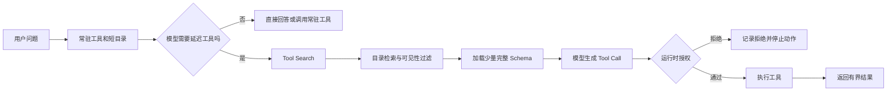
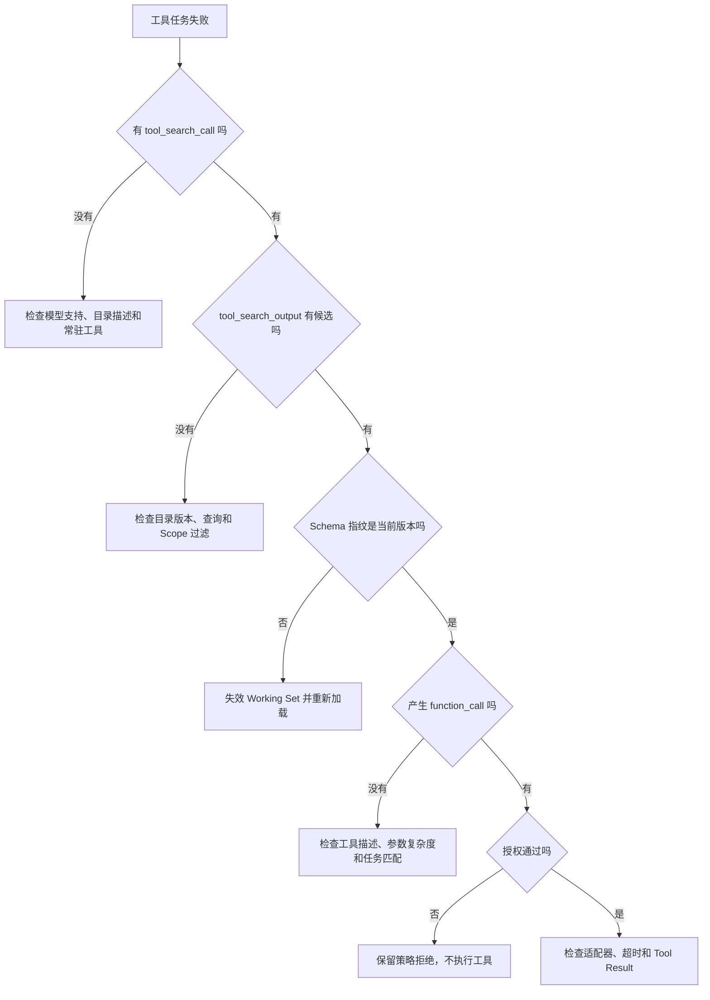

# 延迟工具加载与 Tool Search

一个 Agent 接入文件、工单、数据库、浏览器和部署系统以后，可用工具很快就会从几个增加到几十个。此时即使用户只问“列出这个客户未完成的订单”，模型调用也可能携带整套工具定义。每个工具的名称、描述、参数 Schema 和枚举值都占上下文，模型需要先读完这份目录，才能决定只调用其中一个函数。

把所有工具都发给模型，优点是路径短：模型看到 Schema 后可以直接生成调用。问题也很具体。重复传输的定义会挤占业务上下文，稳定前缀一旦频繁变化还会影响缓存；工具越相似，模型越容易在无关参数之间犹豫。延迟加载把这条路径拆成两步，先让模型发现一小组可能相关的工具，再把这些工具的完整 Schema 放进上下文。

::: info 先区分三个对象

- **工具目录**只回答“有哪些能力可能相关”，内容应短而稳定。
- **工具 Schema**回答“调用需要哪些参数、返回什么形状”，信息更完整，也更占上下文。
- **执行授权**回答“当前身份能不能在当前范围调用”，必须由运行时强制检查。

:::

这三个对象经常被混成一个 `tools` 数组，于是 Token 优化、能力发现和权限控制也被混在一起。后面的实现会一直保持三层分离：隐藏 Schema 是输入优化，不是安全控制；搜索命中表示工具可能有用，不表示动作已经获准。

## 工具定义为什么会挤占模型上下文

函数调用并没有绕开模型输入。模型要生成合法参数，必须先看到工具名称、用途和 JSON Schema。一个只有 `query` 字符串的查询函数很小；一个浏览器动作若包含定位方式、等待条件、重试、截图、网络策略和十几个枚举值，单个定义就可能比多个简单函数更长。因此，用“工具超过 30 个就延迟”这类数量阈值并不可靠。

预算应落在实际进入请求的序列化内容上。最准确的做法是用目标模型对应的 Tokenizer 计算完整工具数组；在本地规划阶段，也可以先把 Schema 序列化成稳定 JSON，再用保守估算筛出明显超限的目录。估算只能用于早期决策，发送前仍要把系统指令、历史消息、证据、已加载工具和输出预留放到同一个总预算里复算。

工具定义还有一笔不容易从请求大小看出的成本。大量相似工具会增加选择难度。模型可能把“列出订单”与“取消订单”放进同一候选集，也可能记住了函数名，却把另一个版本的参数形状带进调用。减少初始 Schema 的目标不只是少发字符，还要让当前可见的能力集合更贴近用户意图。

不过，不能把目录压到只剩 `tool_17` 这样的名字。模型在发现阶段看不到完整参数时，更依赖命名空间、工具名和短描述判断搜索方向。目录省下了 Schema，却删掉了区分能力的语义，搜索只会变成猜测。好的目录项能回答“这组能力处理哪类对象、执行的是读取还是修改”，详细字段继续留在延迟加载的定义中。

初始上下文至少保留一组必需工具。常见开场能力、错误恢复能力和目录搜索本身通常不能被延迟，否则模型为了找到第一件要做的事，必须先额外走一轮发现。是否常驻不能只看 Schema 大小，还要结合调用概率、额外往返落在交互链的哪个位置，以及没有该工具时模型是否仍能安全停止。

## 延迟加载怎样拆开目录、Schema 与执行

延迟加载后的请求不再只有“可见”与“不可见”两种状态。一个工具会经历目录可发现、Schema 已加载、调用已提出、授权已通过和执行已完成等阶段。每个阶段拥有不同证据，也由不同组件负责。

| 阶段 | 模型能看到什么 | 状态所有者 | 失败时留下什么 |
| --- | --- | --- | --- |
| 目录可发现 | 命名空间、名称和短描述 | Tool Registry | 目录版本、过滤原因 |
| Schema 已加载 | 参数、约束和调用说明 | Working Set | Schema 指纹、搜索输出 |
| 调用已提出 | 工具名和候选参数 | Model Adapter | Tool Call、参数原文 |
| 授权已通过 | 无需向模型暴露完整策略 | Policy Runtime | 身份、Scope、策略结论 |
| 执行已完成 | 有界 Tool Result | Tool Runtime | 回执、错误类别、耗时 |

**Tool Search**处理前两步之间的转换。模型先根据当前问题生成搜索意图，搜索器在工具目录中返回一组定义，这些定义随后才成为模型可调用能力。真正执行仍走普通 Tool Calling：模型提出函数名和参数，应用解析参数，补入可信身份与范围，再调用适配器。

发现可以由服务提供方托管，也可以由应用执行。两种方式只改变“谁查目录”，不改变后面的权限和运行时职责。应用如果需要按租户、项目、插件安装状态或内部 Registry 决定可见工具，就需要掌握发现结果；候选集合在请求开始时已经完全确定，则可以让 API 托管搜索，减少自己维护协议状态的工作。



图里的可见性过滤是提前收窄候选，执行前授权是最终安全门。即使搜索器已经按 `orders:read` 过滤了一次，工具运行时也必须重新检查，因为权限可能在发现后撤回，模型也可能直接生成一个没有被搜索结果加载的工具名。

## 常驻集合应按成本和开场路径选择

常驻集合过大，延迟加载省不下多少上下文；过小则把原本一步完成的任务拆成两轮，第一条回复尤其容易变慢。可以先把工具分成三类，再用请求日志校准，而不是凭名称写一份永久名单。

**第一类是启动必需能力。** 目录搜索、会话恢复、最常见的只读入口以及安全停止所需的能力通常常驻。它们并非天然重要，而是缺少它们会让大量请求先支付一次发现往返，或者让模型遇到错误后无路可退。

**第二类是任务相关但低频的能力。** 数据导出、复杂管理操作、特定格式转换和只在少数项目启用的插件适合延迟。它们的完整 Schema 可以很大，短目录仍能告诉模型何时搜索。

**第三类是当前身份根本无权使用的能力。** 这类工具不应为了“让模型知道系统有多强”而进入目录。客户端搜索可以在返回 Schema 之前按可信身份过滤；托管搜索则只声明当前请求允许搜索的候选。执行层仍保留权限检查，防止目录配置错误变成越权动作。

选择常驻工具时需要同时看四项数据：序列化后的 Token 成本、作为会话第一步的频率、一次额外模型往返的延迟，以及 Schema 在稳定缓存前缀中的复用程度。一个定义很长但几乎每次开场都用，而且能稳定留在缓存前缀中，常驻可能比每个会话都重新搜索更便宜。另一个定义不算大，却只服务极少数后台任务，延迟加载更合适。

目录规划还要有硬失败。若必需工具本身已经超过预留预算，程序应返回 `required_tools_exceed_budget`，要求调整工具边界、上下文配额或模型选择。静默把最后一个必需工具放进延迟集合，会把配置错误变成运行时偶发死路，排查时只看到模型“没有调用正确工具”。

## Hosted 与 Client-executed Tool Search 怎样选择

OpenAI 当前的官方文档把 Tool Search 分成托管搜索和客户端搜索。该能力只支持 `gpt-5.4` 及之后的模型；请求需要加入 `{"type": "tool_search"}`，希望延迟的函数或 MCP 定义设置 `defer_loading: true`。新发现的工具会追加到上下文尾部，避免改动前面的稳定缓存内容。具体字段和支持模型属于版本敏感事实，应以 [Tool Search 官方文档](https://developers.openai.com/api/docs/guides/tools-tool-search) 为准。

托管搜索适合候选清单在发请求时已经确定的情况。应用声明函数、Namespace 或 MCP Server，API 在这些定义中搜索。响应先出现 `tool_search_call` 和 `tool_search_output`，随后模型才可能产生普通 `function_call`。托管模式中的搜索由服务端执行，应用不用实现目录检索，也不能在搜索发生后临时查询自己的权限系统来决定返回什么。

客户端搜索适合工具集合依赖运行时状态的系统。第一轮模型输出带 `call_id` 的 `tool_search_call`，应用读取其中的结构化搜索参数，在内部 Registry 中检索并过滤，再把同一个 `call_id` 连同 `tool_search_output` 交回下一轮。这个模式多一次应用往返，却能把租户、项目、插件版本和策略决定放在自己控制的边界内。

Namespace 的价值不只是给函数加前缀。模型在请求开始时可以只看到 `orders` 及其短描述，内部的 `list_open_orders`、`get_order_detail` 和其他函数到搜索命中后才加载。官方建议优先使用 Namespace 或 MCP Server，并让每个 Namespace 保持较小且语义集中；当前文档给出的经验值是少于 10 个函数。这个数值是服务方的使用建议，不是协议限制，也不能替代真实负载测试。

单个延迟函数在开始时仍会暴露函数名和描述，主要省下参数 Schema。若系统有几十个函数，逐个声明为延迟工具仍会留下很长的名称列表。按用户意图组织 Namespace，才能同时缩短初始目录并保留可搜索语义。

## 一次订单查询怎样走完整条链路

用一个不产生副作用的问题推演这套机制。用户输入是“列出客户 `CUST-42` 的未完成订单”。认证层给出用户 `u-7`、Scope `orders:read` 和工具目录版本 `catalog-18`。常驻集合只有 `health_check` 与 `tool_search`，订单工具位于延迟目录。

请求开始时，模型看到 `orders` Namespace 的名称和描述，但看不到 `list_open_orders` 的参数 Schema。它不能安全猜参数，于是产生搜索目标“查找读取客户未完成订单的能力”。这份目标是候选，不携带可信 Scope；应用从认证上下文读取 `orders:read`，用 `catalog-18` 查询目录。

搜索返回 `list_open_orders`，同时排除需要 `orders:write` 的 `cancel_order`。返回状态记录搜索 `call_id`、目录版本、命中的工具名和 Schema 指纹。模型下一轮拿到完整定义，生成 `function_call`，参数只有 `customer_id=CUST-42`。应用解析后再次检查当前 Scope，并限制只读动作。

工具执行器调用订单适配器，得到两条开放订单。结果经过大小限制和字段白名单后，以对应 `call_id` 返回模型。最终回答列出订单编号和状态。成功证据不是一句自然语言，而是下面这条可回放链：

1. 输入记录包含问题、认证身份和 `catalog-18`。
2. `tool_search_call` 保存发现目标，`tool_search_output` 保存加载的工具与指纹。
3. `function_call` 保存模型提出的参数，授权记录保存应用实际采用的 Scope。
4. Tool Result 与原 `call_id` 对应，最终回答引用本轮可见结果。

失败路径可以在同一链路中复现。若用户只有 `orders:read`，却搜索“取消订单”，目录过滤返回空集合，并记录 `scope_filtered=orders:write`。即使模型随后直接提出 `cancel_order`，执行授权仍返回 `tool_scope_denied`，工具调用次数保持为零。此时正确输出是权限拒绝，不是把空搜索解释成“没有这个订单”。

另一个失败发生在目录版本变化。第一轮加载的 `list_open_orders` 只需要 `customer_id`，服务升级后新增必需字段 `region`。Working Set 若只按工具名复用旧 Schema，模型会继续发旧参数。按 Schema 指纹校验后，`catalog-19` 中的定义与缓存指纹不一致，运行时让旧条目失效并重新加载，错误被定位为工具定义变化，而不是模型随机漏字段。

## Working Set 为什么需要 Schema 指纹

发现过的工具通常会在后续轮次继续使用。每次都重新搜索同一个工具，会增加模型调用和目录查询；把完整 Schema 放入当前会话的 Working Set，可以让后续问题直接调用。Working Set 是运行时状态，不应靠模型“记住我刚才见过什么”来维护。

缓存键不能只有工具名。工具的参数、描述或严格校验规则发生变化时，名字可能保持不变。旧 Schema 与新执行器组合后，轻则参数被拒绝，重则同名字段语义已经变化却仍被接受。指纹应由稳定序列化后的定义计算，目录版本用于定位整批快照，二者一起决定条目是否仍可使用。

Schema 指纹不需要混入用户权限。定义内容与授权状态是两类变化：Schema 变化使 Working Set 的调用契约失效；权限变化使执行资格失效。把它们合成一个哈希，会让权限更新触发整套 Schema 重载，也容易让开发者误以为指纹匹配就代表可以执行。

OpenAI 的托管 Tool Search 会把新工具放在上下文尾部，以保持前面内容可缓存。自建运行时也应维持稳定顺序：系统规则、常驻工具和既有历史保持原字节，新发现的定义追加到明确位置。每轮重排工具、更新时间戳或改写描述，会让缓存前缀失效，延迟加载省下的 Token 可能被缓存抖动抵消。

Working Set 还要定义生命周期。会话结束、工具被卸载、目录版本撤回或权限范围缩小时，相关条目应失效。长任务从 Checkpoint 恢复时，不能只恢复工具名，必须恢复当时的目录版本与指纹，再和当前 Registry 核对。恢复后若定义已变化，先重新发现，不能把旧调用直接重放到新执行器。

## 发现结果为什么不能承担授权

隐藏一个危险工具的 Schema，只能降低模型主动选中它的概率。模型可能从历史消息、Skill 描述或错误提示里知道工具名，也可能直接猜中。只要运行时按名称分派而没有重新授权，延迟加载就成了很薄的遮挡层。

客户端搜索可以在发现阶段过滤未授权能力，这一步仍然有价值。模型不会反复考虑自己无法使用的工具，目录输出也不会泄露不必要的内部能力。它解决的是最小披露和候选质量，真正的安全判断仍在执行边界。

执行授权至少绑定身份、租户或项目范围、动作、资源和当前策略版本。模型只能提供业务参数，例如 `customer_id`；`scope_ids`、用户身份和活动策略由应用补入。若 Tool Call 自带同名权限字段，解析器应拒绝或忽略，不能让结构化输出绕过可信来源。

权限还可能在搜索与执行之间变化。管理员撤回 `orders:read` 后，旧 Working Set 中的 Schema 可以继续存在，但调用必须被拒绝。这样职责很清楚：Schema 仍然描述接口，Policy Runtime 决定当前能不能用。若产品不希望模型再看到该能力，可以同时清理 Working Set，那是信息披露策略的第二步，不是授权成立的条件。

搜索目录本身也属于攻击面。外部 MCP Server 返回的工具描述可能包含提示注入，不能让其覆盖系统规则。Registry 应限制描述长度、校验 Schema、记录来源和版本；来自不可信服务的定义进入单独 Namespace，加载前经过策略检查。工具描述是数据，不是新的开发者指令。

## 一个最小目录规划器怎样工作

共享示例把工具定义、目录规划、发现过滤、执行授权和会话 Working Set 放在一个小模块中。它没有连接真实模型，目的是让控制逻辑可以在本地重复验证。

<<< ../../examples/ai-agent/tool_catalog.py

`plan_catalog` 先放入 `required=True` 的工具，再按实际 Schema 成本填充剩余预算。必需工具超限会直接抛错，不会悄悄延迟。这个教学估算使用 JSON 长度除以四，只用于演示选择顺序，不能替代供应商 Tokenizer。

`search_deferred_tools` 接收应用提供的 `allowed_scopes`。示例中的读取账号只能发现 `list_open_orders`，不能发现 `cancel_order`。搜索函数做一次提前过滤，`authorize_execution` 仍在调用前执行相同边界，证明发现与执行是两层控制。

`WorkingSet` 以工具名定位条目，以完整 Schema 指纹判断是否仍是当前版本。测试先加载只含 `customer_id` 的定义，再构造多了 `limit` 字段的同名定义，旧条目会被判定失效。这里用内存字典模拟会话状态，没有跨进程恢复、并发版本检查和持久化能力。

示例搜索只是按词项匹配名称与描述，无法证明模型能稳定生成高质量搜索，也不能证明真实 API 的 Tool Search 行为。生产 Registry 可以使用倒排索引、标签或受控语义检索，但结果必须继续受权限、目录版本和候选上限约束。模型生成的搜索词不能扩大可见范围。

## Responses API 中的请求形状

托管模式的核心配置可以压缩成下面这段 `jsonc`。`orders` Namespace 在请求开始时可见，`list_open_orders` 的完整 Schema 延迟加载；`health_check` 没有设置 `defer_loading`，因此可以直接调用。

```jsonc
{
  "model": "gpt-5.6",
  "input": "列出客户 CUST-42 的未完成订单",
  "tools": [
    {
      "type": "namespace",
      "name": "orders",
      "description": "Read-only customer order lookup tools.",
      "tools": [
        {
          "type": "function",
          "name": "health_check",
          "description": "Check whether the order service is ready.",
          "parameters": {
            "type": "object",
            "properties": {},
            "additionalProperties": false
          }
        },
        {
          "type": "function",
          "name": "list_open_orders",
          "description": "List open orders for one customer ID.",
          "defer_loading": true,
          "parameters": {
            "type": "object",
            "properties": {
              "customer_id": { "type": "string" }
            },
            "required": ["customer_id"],
            "additionalProperties": false
          }
        }
      ]
    },
    { "type": "tool_search" }
  ],
  "parallel_tool_calls": false
}
```

若模型需要订单工具，输出中先出现服务端执行的 `tool_search_call`，再出现携带命中定义的 `tool_search_output`，之后才是 `function_call`。应用不能只读取最后一个输出项；它要按类型遍历 `response.output`，保存搜索和调用身份，并为普通函数调用执行现有的参数解析、授权和结果回传。

客户端模式把 `tool_search` 设置为 `execution: "client"`，同时为搜索参数定义 Schema。应用收到 `tool_search_call` 后查询自己的目录，再返回同一 `call_id` 的 `tool_search_output`。没有回传或 `call_id` 不匹配时，模型无法把加载结果与本次搜索关联。搜索输出中的工具定义必须来自可信 Registry，不能直接转发用户提供的任意 JSON Schema。

代码中的模型名、SDK 类型和响应字段会随版本演进。实现时应锁定 SDK 版本，并用契约测试保存实际响应类型；文章示例说明当前结构，不承诺所有模型或旧 SDK 都支持。真实在线验证还需要 API Key、支持 Tool Search 的模型和至少一个延迟工具，本地 Fake 只能验证应用分支。

## 从工具发现失败定位责任层

纯文本错误很容易把不同层的问题压成一句“工具不可用”。排查时应从最后一个成功状态向后看，先确定失败发生在发现前、加载时、授权时还是执行后。

| 可观察现象 | 先检查的证据 | 可能的责任层 |
| --- | --- | --- |
| 模型从未发出搜索 | 初始目录、Namespace 描述、支持模型 | 请求配置或能力描述 |
| 搜索成功但结果为空 | 搜索参数、目录版本、Scope 过滤数 | Registry 或可见性策略 |
| Schema 已加载却不调用 | Tool Search 输出、问题与描述匹配度 | 模型选择或工具描述 |
| 调用立刻被拒绝 | 身份、动作、资源、策略版本 | 执行授权 |
| 参数校验突然失败 | Working Set 指纹、服务端 Schema 版本 | 缓存失效或版本发布 |
| 首轮明显变慢 | 冷启动命中率、搜索往返、常驻集合 | 目录规划与延迟策略 |



搜索为空可能是正确结果。用户没有某项能力时，客户端目录过滤后返回空集合，属于安全边界；Registry 版本错误导致所有合法工具消失，才是故障。两者需要不同状态码和计数，不能都记为 `no_tools`。

参数失败也不能直接归因于模型。先比较模型看到的 Schema 指纹与执行器当前定义。如果指纹不同，重新调用模型只会继续根据旧契约生成参数。若指纹一致，再检查描述是否含糊、必填字段是否过多，以及 Tool Call 解析有没有丢字段。

延迟增加要按会话阶段观察。新会话第一次搜索付出一次额外往返，后续由 Working Set 复用；把整段会话平均后，首轮等待可能被掩盖。指标至少区分冷启动搜索、重复搜索、加载工具数、Schema Token、搜索耗时和执行耗时，不能只看总请求延迟。

## 容量、缓存与版本发布怎样取舍

延迟加载引入了新的状态和失败面。工具目录需要版本，搜索结果需要身份，Working Set 需要失效，客户端模式还要处理两轮响应。工具不多、Schema 很小、任务延迟敏感时，直接常驻更简单。为了省几百 Token 增加一套目录服务，维护成本可能高于收益。

工具规模增长后，目录也不能无限变长。按业务意图组织 Namespace，每次搜索设置候选上限；结果过多时返回更窄的分类信息，让模型修正查询，而不是一次加载几十份 Schema。目录检索超时应保留明确错误，不能回退为加载全部工具，否则高峰期会同时放大上下文和延迟。

发布新 Schema 时先生成候选目录版本，校验名称冲突、描述长度、参数合法性和权限元数据，再原子激活。活动会话继续使用旧快照还是强制刷新，应由兼容策略决定。删除字段或改变语义属于不兼容更新，旧 Working Set 必须失效；只增加可选字段也要更新指纹，但可以允许旧调用在过渡期继续通过。

缓存收益依赖字节稳定。常驻工具顺序、描述和序列化方式固定后，Prompt Cache 才能复用。把动态权限结果写进每个工具描述，会让前缀随用户变化；更好的方式是保持 Schema 稳定，在目录候选和执行授权中应用权限。需要向模型说明当前限制时，使用短而稳定的运行时上下文，不改写整套定义。

客户端搜索还要防止目录查询被滥用。模型可能重复发相同搜索，也可能用极宽目标请求全部能力。运行时按会话缓存同一目录版本下的搜索结果，限制搜索次数和返回体积；达到上限后给出可解释停止状态。缓存命中仍重新检查当前可见性，不能把另一个用户或旧权限下的候选直接复用。

## 怎样验证延迟加载没有省错成本

本地单元测试先验证确定性部分：必需工具在预算内始终常驻，超限会失败；只读 Scope 搜不到写工具；同名 Schema 改变后 Working Set 失效；执行授权拒绝时适配器调用次数为零。共享示例可用下面的命令执行：

```bash
PYTHONPATH=examples/ai-agent python3 -m unittest discover \
  -s examples/ai-agent/tests -p 'test_*.py'
```

契约测试使用录制或 Fake 响应覆盖 `tool_search_call -> tool_search_output -> function_call` 的类型分支，但不能据此声明真实 API 可用。在线测试使用支持该能力的模型，验证托管与客户端两种模式，并保存实际响应中的搜索执行位置、`call_id` 和加载工具集合。API Key、完整 Prompt 和工具返回正文不能进入公开测试日志。

性能测试准备三组真实目录分布：少量小 Schema、少量大 Schema 和大量混合 Schema。分别比较全量注入、部分常驻和延迟加载的输入 Token、缓存命中、首轮延迟、整段会话延迟与错误率。只证明 Token 下降还不够；若第一轮多一次搜索导致交互明显变慢，常驻集合需要调整。

回归测试固定一条完整轨迹。输入是订单读取问题，状态包含用户 Scope 和目录版本；模型先搜索，应用加载只读 Schema，再授权并执行；输出与 Tool Result 对应。失败变体撤回读取权限，断言搜索结果为空或执行被拒绝，工具没有副作用。版本变体更新 Schema，断言旧指纹失效并触发重新加载。

最后检查恢复路径。在搜索结果返回后终止进程，恢复时应从已保存的目录版本和搜索输出继续，不能重新搜索并得到另一组工具；若活动目录已切换，则明确重启发现步骤。函数执行后中断时先查询工具回执，延迟加载不是重复执行副作用的理由。

通过这些检查后，系统才能回答两个不同的问题：它是否减少了无关 Schema，以及它是否仍把正确工具交给了有权限的请求。前者属于上下文与缓存优化，后者依赖目录版本、授权和运行时证据。把两者分别验证，Tool Search 才不会从一个省 Token 的功能变成新的不可解释控制层。
