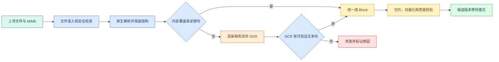

# PDF、Word、PPT、Excel、HTML 与 Markdown 怎样解析入库

RAG 的第一步不是调用 Embedding，而是回答一个更基础的问题：文件里的信息有没有被正确读出来？一份扫描 PDF 如果被普通文本解析器读成空字符串，后面再好的向量模型也检索不到；Excel 如果丢掉表头，单独的“5 秒”或“生产”就失去含义。

这篇把常见文件逐个拆开，最后统一成带来源位置和结构信息的 `Block`。读完你应该能判断：什么时候使用原生解析，什么时候触发 OCR，表格和幻灯片怎样保存上下文，以及解析失败时为什么要关闭导入版本而不是悄悄继续。

## 先看导入状态机



文件先经过扩展名、MIME、大小、压缩炸弹和恶意内容检查。原生解析得到 Block 后要计算覆盖率，例如页数、非空文本页、表格数量和图片页。只有缺失内容才进入 OCR；OCR 仍为空、置信度过低或页数超限时，状态进入失败，不发布半成品。

## 统一 Block 不是把所有内容压成字符串

切片和向量化需要文本，但回答和引用需要知道文本来自哪一页、哪一节、哪一行。可以先建立这样一个公开最小模型：

```ts
type Block = {
  id: string
  kind: 'paragraph' | 'heading' | 'list' | 'table' | 'code' | 'slide' | 'sheet'
  text: string
  source: {
    fileId: string
    page?: number
    slide?: number
    sheet?: string
    path: string[]
  }
  order: number
  parentId?: string
  metadata: Record<string, string | number | boolean>
}
```

解析器执行后，每识别出一个标题、段落、表格或代码单元，就输出一个 `Block`。`id` 是当前原文单元的稳定标识；`kind` 告诉后续切片器采用哪种处理规则；`text` 是用于搜索的规范化文字；`source` 保留文件和页面位置；`path` 保存标题层级或工作表上下文；`order` 保证同一文件内的先后关系；`parentId` 把表格行、幻灯片元素等子单元连回父级；`metadata` 保存解析器版本、语言和 OCR 标记等可筛选字段。

这个类型只是解析阶段的输出契约，不负责读取 PDF，也不直接生成向量。输入仍是解析器从文件中识别出的原始对象，后续切片器消费 `Block[]`。如果 `page`、`slide` 和 `sheet` 都为空，或者 `text` 有内容却无法回到原文，应该把它判为定位失败，而不是继续写入向量库。

这个模型没有把原始文件丢掉。生产系统还要保存原文件校验和、解析器版本、渲染页图像位置和原始坐标，以便用户点击引用时重新定位。

## PDF：先判定文本层是否存在

PDF 有两种完全不同的形态：

- 原生 PDF：页面里有字符对象，可以提取文字、字体和坐标；
- 扫描 PDF：页面本质是图片，文本提取可能为空或只有少量页眉。

不要根据扩展名直接选择 OCR。先对每页提取文字并统计字符数、空白页比例和异常编码。如果正文页都为空，才渲染缺失页交给 OCR。只对缺失页 OCR 可以节省成本，也减少 OCR 把原生数字识别错的机会。

表格 PDF 比普通段落更难：文字在二维坐标上排列，简单按字符顺序拼接会把列混在一起。解析器应先识别行列或表格区域，保存表头和单元格位置；如果无法可靠识别，要把表格标成低置信度，不能假装得到精确行列。

OCR 结果必须带页码、模型版本和置信度。低置信度的金额、版本号和权限值不能直接成为答案证据，可以要求人工复核或在回答中标记不确定。

## Word：段落样式和表格是语义

Word 文档的标题通常通过样式表示，而不是只靠字号。解析时要保留 Heading 1/2/3 的层级，把后续段落挂到当前标题路径。列表要保留顺序和编号语义，不能把“1.”、“2.” 删除成普通句子。

表格需要至少保存表头、行号和单元格文本。把整张表拼成一段长字符串会导致检索命中一行，却无法回答该值属于哪个字段。常见做法是为每行生成一份带表头的文本，例如：

```text
表：环境参数
环境=生产 | 灰度比例=10% | 负责人=张三
```

原始表格仍要保留为结构化字段，文本只是用于召回和生成。合并单元格、隐藏行、批注和修订记录需要在解析策略中明确是否纳入，不能默认当成正文。

## PPT：一页是一个版面上下文

幻灯片的阅读顺序不一定等于文件对象顺序。标题、正文框、图表、备注和图片需要分别解析，再按照版面坐标或占位符语义组合。每个 Block 至少记录 slide number 和标题路径。

一张图里只有“架构”两个字，正文却在图片中，这种页面需要 OCR 或图像理解。图片中的文字、图例和箭头关系不应被当成普通段落；如果只提取标题，检索会返回“架构”但无法解释图中组件。

演讲者备注是否导入取决于知识范围。备注可能是讲稿，不一定是面向读者的事实。导入时将 `notes` 标记为独立 kind，并在检索过滤中决定是否可见。

## Excel：表头、工作表和公式结果

Excel 至少要保留工作表名、表头行、行号和单元格坐标。单独向量化一行数字几乎没有意义，必须把表头上下文拼进 embedding text，同时保留结构化字段用于精确过滤。

公式有两个值：公式本身和上次计算结果。知识问答通常需要结果，但排障时可能需要公式。两者都保存，并记录文件最后计算时间。空单元格、合并单元格和隐藏列不能悄悄删除，因为它们可能改变表格语义。

一个稳定的表格 Block 可以长这样：

```text
sheet=容量规划
row=18
headers=环境 | 并发 | 延迟目标
values=预发 | 20 | 2s
cellRange=A18:C18
```

查询“预发并发是多少”时，精确通道可以按 `sheet`、`headers` 和 `values` 找到行；向量通道则处理用户说“测试环境同时处理多少请求”这类表达。两条通道返回同一个 row ID，引用才能落到稳定位置。

## HTML 与 Markdown：语法本身就是结构

HTML 解析要区分正文、导航、页脚、隐藏内容、脚本和结构化数据。不能把整个 `innerText` 当作正文，否则导航链接和 Cookie 提示会污染向量。需要保存最终 URL、Canonical、标题层级和抓取时间。

Markdown 的标题、列表、代码围栏、表格和链接都是可用结构。代码块通常需要独立 `kind=code`，保留语言标记；把代码和解释拼在同一向量片段里，会让“如何配置”问题召回解释段，却丢掉命令细节。

## OCR 的触发和关闭条件

OCR 是一个有成本和错误率的外部步骤，不能作为“解析失败就无限重试”的万能后备。建议为每份文件记录：

| 字段 | 作用 |
| --- | --- |
| `required_pages` | 哪些页缺少文本层 |
| `max_pages` | 单次最多允许 OCR 的页数 |
| `language` | 识别语言，影响字符结果 |
| `model_version` | 结果可复现和回滚 |
| `confidence` | 判断是否需要人工复核 |
| `render_hash` | 确认 OCR 输入图像没有变化 |
| `error` | 失败原因，不用空文本伪装成功 |

当 OCR 超过页数、服务超时或返回空结果时，导入状态应明确失败。系统可以保留旧的已发布版本，等待重试或人工处理；不应该激活“部分页面成功”的候选版本。

## 解析覆盖率怎样验证

用文件级和 Block 级两层检查：

```text
文件级：页数/幻灯片数/工作表数是否与解析记录一致
页面级：非空文本页、OCR 页、失败页数量是否匹配
结构级：标题路径、表格、代码和列表是否保留
定位级：每个 Block 能否回到页码、slide、sheet 或路径
内容级：抽样原文与 Block 文本，确认金额、版本号、否定词没有丢失
```

不要用“Block 数大于 0”作为成功条件。一个只提取出每页页码的扫描 PDF 也会有 Block，但没有可回答内容。覆盖率应记录缺口，并进入候选版本审核。

## 解析器选择表

| 文件 | 首选步骤 | 需要额外处理 | 最常见的静默错误 |
| --- | --- | --- | --- |
| 原生 PDF | 文本和坐标提取 | 表格区域识别 | 列顺序错乱 |
| 扫描 PDF | 渲染后 OCR | 置信度与人工复核 | 返回空页或数字错 |
| Word | 样式、段落、表格 | 修订、批注和合并单元格 | 标题层级丢失 |
| PPT | 占位符、坐标、备注 | 图片 OCR、图表语义 | 版面顺序错 |
| Excel | sheet、表头、行列 | 公式结果和隐藏列 | 数值失去字段上下文 |
| HTML | 正文 DOM、标题、链接 | 模板噪声、渲染差异 | 导航和隐藏文字污染 |
| Markdown | AST 和围栏 | 链接、表格、代码语言 | 代码与正文被拼平 |

选择解析器时先看目标问题。如果系统只回答原文段落，PDF 文本提取可能够用；如果要回答表格数值，二维结构和精确字段更重要；如果要审查图片里的流程图，必须纳入 OCR 或图像理解，并把结果标记为不同证据等级。

## 失败处理和版本发布

每次导入都生成候选版本。解析、OCR、切片、Embedding 和索引必须在候选版本内完成，所有质量门禁通过后再激活。激活前仍保留上一版本，避免用户在新文件解析失败时看到半套数据。

失败记录至少包含文件 ID、阶段、页码或 sheet、解析器版本、错误类型和重试建议。可重试的网络错误与不可重试的损坏文件不能共用一个“导入失败”字符串。

## 带到工作的解析检查表

```text
[ ] 文件扩展名、MIME、大小和安全准入已检查
[ ] PDF 已区分原生文本与扫描页
[ ] OCR 只处理缺失页，并有页数、语言和置信度限制
[ ] Word 标题、列表、表格和代码没有被抹平
[ ] PPT 保存 slide 与版面上下文，图片文字有单独证据等级
[ ] Excel 保存 sheet、表头、行号、坐标和公式结果
[ ] HTML 去掉模板噪声，Markdown 保留 AST 结构
[ ] 每个 Block 都有稳定 ID 和原文位置
[ ] 覆盖率、重复、空内容和定位检查在激活前执行
[ ] 任何失败都保留旧版本，不把部分结果发布成新版本
```

完成这篇后，你得到的是“文件到 Block”的判断方法。下一篇会继续回答切片边界：一个段落多长才适合检索，表格和代码怎样保留上下文，父子片段和稳定 ID 如何帮助引用、更新与去重。
