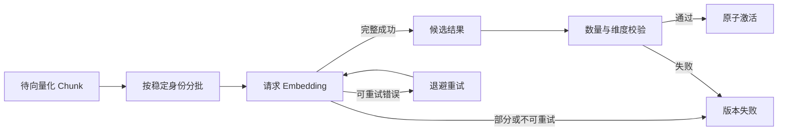

# Embedding 批处理、重试与幂等

一份文档切出 237 个 Chunk，逐条请求 Embedding 服务会产生 237 次网络往返；把全部文本塞进一次请求，又可能超过供应方的条数、Token 或请求体限制。批处理是在吞吐、失败范围和供应方约束之间做拆分，不是把数组切成几段就结束。

真正难处理的是失败。第三批超时，前两批已经拿到向量，该从头重算还是只重试失败批次？任务消息重复投递，两名 Worker 会不会同时激活同一个版本？服务返回九条向量，但请求有十条，能否按位置继续写？这些问题都要由程序的状态与幂等契约回答，不能交给模型判断。

本文继续使用远程访问制度 V3。它产生 23 个 Chunk，当前最小实现按每批 10 条顺序请求，形成 10、10、3 三批。候选版本只有在 23 条向量全部 ready、质量门禁和落盘核对通过后才会激活。

::: info 当前最小实现的边界

参考实现没有逐批持久化部分成功，也没有并发发送批次。向量先写在内存 Chunk 上，全部完成后才进入数据库事务。它能验证批次拆分、响应数量、维度和版本重放；跨进程断点续算、供应方批任务和逐项缓存属于需要额外状态的生产扩展。

:::



批次完成不等于版本可查询。只有所有 Chunk 的身份、向量维度和版本归属都通过校验，候选结果才进入激活事务；重试始终复用同一个版本身份。

## 批处理先固定输入身份

任务开始前先冻结文档版本、索引版本、Embedding 模型、维度和表示模板。Chunk 集合来自同一个候选版本，每条记录包含 Chunk ID、`embedding_text`、表示哈希和在 Source 内的顺序。批次只是这一集合的传输分组，不应改变 Chunk 身份。

批次 ID 可以由任务 ID、模型版本和批次序号组成；单项计算身份则应基于表示哈希与模型配置。只用“第 3 批”作为永久身份不够，因为调整批大小后，同一 Chunk 会落入别的批次。重试和缓存最终要认内容与模型，不只认数组位置。

发送给供应方前，适配器要计算每条输入和整批的限制。条数没有超限，文本 Token 总量仍可能超；单个 Chunk 超过模型输入上限，应在入库质量阶段失败，不能靠批处理把一条文本截断。动态批大小可以根据估算 Token 减小，但估算规则也要固定版本。

当前最小实现使用常量批大小 10：

```python
EMBEDDING_BATCH_SIZE = 10


async def embed_chunks(chunks, client, model, dimension):
    if not chunks:
        raise ValueError("at least one chunk is required")

    for start in range(0, len(chunks), EMBEDDING_BATCH_SIZE):
        batch = chunks[start : start + EMBEDDING_BATCH_SIZE]
        vectors = await client.embeddings(
            [chunk.embedding_text for chunk in batch],
            dimension,
            model=model,
        )
        if len(vectors) != len(batch):
            raise RuntimeError("embedding response count mismatch")

        for chunk, vector in zip(batch, vectors, strict=True):
            if len(vector) != dimension:
                raise RuntimeError(f"dimension mismatch for {chunk.id}")
            chunk.embedding = vector
            chunk.embedding_model = model.name
            chunk.embedding_dimension = dimension
            chunk.index_status = "ready"
```

代码按响应位置配对，因此响应数量必须完全一致。若供应方协议返回每项 ID，更好的做法是按 ID 建立映射，拒绝重复、未知和缺失项；不能在返回数量不符时截取前九条，因为某一项缺失会让后续向量错绑 Chunk。错绑数组长度仍然正确，数据库也发现不了语义身份已经错位。

## 顺序批次怎样完成一次正常执行

输入任务为 V3/I3，模型 M1，维度 1024，Chunk 数 23。服务先查询是否已有 V3；不存在才切块并执行质量门禁。随后读取活动 Embedding 配置，形成三批输入。

第一批发送 C0 到 C9。响应返回十个 1024 维数组，适配器逐项写入内存状态。第二批 C10 到 C19 同样完成，第三批 C20 到 C22 返回三条。模型名称写到每个 Chunk，索引状态从 pending 变为 ready。

三批全部成功后，Repository 检查所有 Chunk 都有 ready 状态和 1024 维向量，再开启数据库事务。事务写入文档版本、Source Version 与 Chunk，反查 Source、Chunk、向量和 Coverage 数量，最后切换活动版本。此时才对查询可见。

```text
23 chunks pending
  -> batch 0: 10 ready
  -> batch 1: 10 ready
  -> batch 2: 3 ready
  -> staging transaction: 23 vectors persisted
  -> validation: 23/23/23
  -> active version switched
```

输出 `vector_count=23` 只在事务完成后返回。日志可以记录批次数、模型与版本，不记录原始正文和完整向量。Trace 里批次耗时用于排障，不能据一次执行推导生产延迟指标。

验证正常路径时，Fake Client 记录收到的输入。23 条应产生三次调用，输入顺序与 Chunk 顺序一致，每个 Chunk 最终为 ready。Fake 返回固定数组只证明拆分和赋值，不证明真实模型的语义质量；在线验证还要使用正式凭证、隔离语料和目标查询集。

## 哪些错误可以重试

网络超时、连接重置、明确的限流响应和供应方暂时不可用，通常属于可重试依赖错误。重试要受最大次数、绝对 Deadline 和退避策略限制，并保留最后一次原始错误。每个子步骤重新获得完整超时，会让一个五分钟任务在多批重试后运行远超预算。

认证失败、模型不存在、维度配置不兼容和请求体非法，重试同样输入不会恢复。这些错误应直接失败，等待配置变更或人工处理。响应数量错误也不能盲目接受；是否重试要看供应方契约，重试后仍不一致则保存协议错误。

单条文本触发内容策略或长度限制时，整批重试只会重复失败。支持逐项错误的协议应返回单项身份和稳定错误类，任务可以隔离问题 Chunk；不支持逐项结果时，调试阶段可以二分批次定位，但不能把这种昂贵策略无限用于线上。

数据库写入冲突需要先判断幂等身份。相同版本已经完成，读取已有结果；版本正在 staging，不能再启动第二套 Embedding；版本 ID 属于另一个文档，属于身份冲突，必须拒绝。把所有唯一约束错误当作成功会掩盖错误复用。

取消也不是普通重试错误。任务收到取消后停止发送新批次，已经发出的请求等待协议允许的取消或自然结束，结果不再激活候选。若供应方按调用计费，取消无法收回已发生的费用，记录实际已提交批次比简单写“任务已取消”更准确。

## 最小实现为什么选择全有或全无

向量保存在内存里，意味着第三批失败后，前两批结果不会写入正式候选。调用方记录失败，旧活动版本继续服务；重新执行会从第一批开始。这种策略浪费了部分成功计算，但状态少，事务和恢复容易验证，适合先建立正确基线。

全有或全无不等于供应方调用也能回滚。前两批已经产生外部成本，只是数据库没有可见半成品。文章和监控应把“候选未激活”与“没有调用成本”分开。重试频繁时，才值得引入向量缓存或逐项暂存。

这一选择还避免了半成品索引。查询永远只看到旧的完整版本或新的完整版本，不会在 23 个 Chunk 中只搜到前 20 个。数据库事务核对 ready 向量数与 Chunk 数相等，任何差异都阻止激活。

代价是大文档的恢复效率。5000 个 Chunk 在最后一批失败，重新计算全部向量很昂贵；进程重启也会丢失内存结果。生产扩展可以把成功项写入候选暂存区或计算缓存，但要增加单项状态、租约、垃圾回收和版本隔离。

## 部分成功需要怎样的数据模型

支持断点续算时，每个向量计算至少有 `chunk_id`、`embedding_hash`、模型版本、状态、尝试次数、错误类和完成时间。状态可以是 pending、running、ready、retryable_failed 与 terminal_failed。批次状态由单项聚合，不反过来覆盖单项真相。

Worker 领取 pending 项时获得有期限租约。进程崩溃后，租约到期才允许其他 Worker 重领；仍持有有效租约的任务不能被重复执行。外部请求发出前保存 attempt，返回后用比较条件写 ready，过期 Worker 的迟到结果不能覆盖新模型或新候选。

成功向量按计算身份缓存时，键至少包含供应方、模型、维度、模板版本与 `embedding_hash`。命中结果仍要检查数组长度，并为当前 Chunk 创建独立来源关系。缓存不包含 ACL 也不意味着权限可以共享，向量计算可复用，Chunk 的可见性仍由当前版本保存。

部分成功任务只有在所有必需 Chunk ready 后才能进入发布门禁。一个 terminal_failed 项会使候选失败，不能把 `22/23` 四舍五入成完成；允许丢弃的内容必须在解析和质量策略中预先声明，不能在 Embedding 阶段临时跳过。

暂存数据需要垃圾回收。候选被新 Release 取代、任务取消或 Deadline 到期后，ready 向量可能没有机会激活。清理器按候选版本和引用计数删除，不能仅凭创建时间清掉仍在运行的长任务。清理失败不让候选变成活动版本，但要单独告警。

这种模型换来断点续算与横向扩展，也引入数据库写放大、租约竞态和更多终态。文档规模不大、失败少时，简单的内存全有或全无可能更合适。架构选择应依据实际调用量和失败证据，不因“生产级”三个字自动复杂化。

## 版本级幂等阻止重复任务污染索引

消息队列常采用至少一次投递，重复任务是正常情况。入库服务在切块和 Embedding 前查询 `(document_id, version_id)`。已存在版本则返回原有数量与激活状态，标记 `idempotent_replay=true`，不会再次调用 Embedding，也不会重新激活旧版本。

为什么不能重放时顺手激活？假设 V3 已完成，随后 V4 成为活动版本；V3 的旧消息晚到。如果读取 V3 后再次把它设为活动，就会让内容倒退。幂等重放返回“这个版本处理过”，不等于“它现在应该生效”。

版本 ID 还要绑定文档。调用者误把 V3 用到另一份文档，Repository 应报冲突，不能因为查到记录就返回成功。版本处于 staging 时，第二个任务也不应启动，而是报告已有构建进行中或由租约机制接管。

事务内再次检查版本十分必要。两个 Worker 几乎同时在事务外查不到 V3，随后都开始计算；写入时以文档级锁串行，再查一次已有版本，只有一个创建记录。虽然另一个 Worker 可能已经产生外部调用成本，至少不会写出两份候选或交叉切换活动指针。要消除重复调用，需要更早的任务租约。

内容哈希不能代替版本幂等键。相同内容可以属于两个正式 Release，来源、权限和时间不同；同一版本 ID 也不能在内容变化后继续复用。发布系统先定义不可变版本，哈希用于验证输入和计算复用，两者职责不同。

## 并发批次不能牺牲结果关联

批次彼此独立时，可以设置有限并发减少等待时间。并发上限同时受供应方配额、连接池、任务 Deadline、内存和数据库写入能力约束。直接为每批创建无限任务，会把限流错误和重试风暴放大。

每个并发分支保留批次序号和单项身份，结果汇合后按 Chunk 原顺序写回。不能按“谁先返回谁先追加”改变向量与 Chunk 的配对。Python 中可以让任务返回 `(batch_index, items)`，汇合时校验所有索引恰好出现一次。

一个分支失败后，其余正在执行的批次怎样处理要写进合同。全有或全无方案可以取消未开始分支，等待已发送调用结束，再丢弃内存结果；逐项暂存方案保留成功项，将可重试失败重新排队。两种方案不能混合成“看情况”，否则相同故障会得到不同状态。

限流重试要加入随机退避，并受全局准入控制。单个任务的十个批次各自重试三次，十个任务同时运行时可能瞬间产生大量请求。共享速率限制器按模型和租户分配额度，单任务仍保留自己的 Deadline。

并发没有改变发布条件。所有 Chunk ready、数量一致、质量门禁通过之后，才进入激活事务。某批先完成不代表对应 Chunk 可以提前被查询。

## 一次第三批超时的失败推演

V3 的前两批返回 20 个向量，第三批请求超时。适配器抛出 `TimeoutError`，服务捕获后记录截断错误；因为文档已有 V2 活动版本，文档整体仍保持可用，活动指针不变。V3 的 Chunk 没有写入正式候选事务。

Trace 记录 V3、I3、M1、完成批次 2、失败批次 1 和最后错误，不保存正文。调用方看到的是“V3 向量化失败”，不是“知识库无内容”。查询仍固定 V2，用户不会看到只有 20 条的新版本。

任务按策略重试。当前最小实现重新产生三批；引入计算缓存后，前 20 条可按表示哈希与模型命中，只请求最后三条。无论哪种实现，重试使用同一个不可变 V3，若此时 V4 已发布，V3 完成后也必须通过新鲜度检查，迟到任务不能覆盖 V4。

另一个旧消息再次投递 V3。若首次重试已经完成，服务在 Embedding 前返回幂等结果，断言 Client 调用次数为零、Repository 没有再次激活。若首次仍在 staging，重复任务被拒绝或等待租约，不并行写同一版本。

修复验证包含正常 23 条、第三批超时、响应只有两条、某个向量维度错误、相同版本重放、旧版本迟到和取消。每个测试断言调用次数、最终状态、活动版本和失败信息；只断言抛出异常，无法证明旧版本没有被破坏。

## 监控要区分调用、计算和发布

请求次数、输入条数、估算 Token、供应方错误和单批耗时描述外部调用；ready 项比例、缓存命中和重试次数描述计算进度；候选构建、门禁失败和激活结果描述发布。把它们压成一个“Embedding 成功率”，定位不了成本和数据问题。

同一批反复超时，可能是请求体过大、供应方不稳定或 Deadline 太短。错误按模型、批大小和输入量分组更有用。单条持续失败则需要定位 Chunk 类型和长度，不能在日志中打印敏感文本，可记录哈希、长度与 Source 身份。

告警也要看活动版本是否存在。首次入库失败会让文档不可检索，优先级高；更新失败但旧版本可用，用户影响较小，但候选长期落后仍需处理。两者共用一个异常类型，处置顺序不同。

成本对账按实际提交的文本计数，不能按最终激活向量数倒推。全有或全无方案失败时，激活数为零，供应方调用已经发生。缓存命中则相反，候选新增 23 个向量记录，不代表调用了 23 次外部服务。

## 响应关联错误比显式失败更危险

超时会让任务失败，错位响应却可能顺利通过所有形状检查。请求 `[C10, C11, C12]`，服务若返回 `[V11, V10, V12]`，数组数量与维度都正确，按位置赋值后 C10 和 C11 的语义被交换。候选照样能激活，后续检索命中的是错误来源。

供应方明确保证响应顺序与输入一致时，适配器可以按位置关联，并用契约测试锁定这一假设。协议若支持输入 ID，应给每项发送稳定请求 ID，返回后按 ID 映射；出现未知、重复、缺失 ID 立即失败。不能既不信顺序，又没有身份字段，只根据文本相似程度猜向量属于谁。

批量 API 可能异步完成，查询结果时只返回成功项和错误项。此时任务记录供应方批任务 ID、提交的单项 ID 集合和模型版本。轮询每次合并状态，但只有集合完全闭合才结束；“已完成 22 条”不能推导第 23 条失败，也不能把未返回项默认为零向量。

数据层可以增加一条一致性验证：ready 向量必须同时带当前 `embedding_hash`、模型和维度。它发现不了同批同模型下的纯位置交换，因此还需要端到端样本。准备两段含义明显相反、来源不同的文本，用正式协议向量化，检索各自查询并断言返回 Source，能暴露关联实现错误。

重试也可能制造错位。第一次批次部分返回后超时，第二次重新提交全部输入；若调用方把两次响应按到达顺序拼接，会得到重复或跨尝试混合。每个 attempt 独立验证，只有完整成功的一次可以提交；逐项暂存则用单项身份做条件更新，已经 ready 的项不会被另一个过期 attempt 覆盖。

压缩日志时不要删除关联证据。无需保存向量和正文，但应保留版本、批次、attempt、输入项哈希序列、返回项 ID 序列和错误类。出现来源错位时，可以确认是哪次请求破坏映射，不必从数据库里猜。

## 任务租约怎样处理重复 Worker 和迟到结果

版本级数据库锁保护最终写入，却挡不住两个 Worker 在锁外同时调用 Embedding。想减少重复成本，需要在任务开始前领取构建租约。租约绑定文档版本、索引版本和 Worker 身份，带到期时间与递增的 fencing token。

Worker A 领取 token 7，每处理一批续租。A 暂停后租约过期，Worker B 领取 token 8 并继续；A 恢复时即使拿到旧请求结果，写入条件也要求 token 仍为最新，因而被拒绝。只比较租约到期时间不够，机器时钟和续租竞态可能让旧 Worker 误以为自己仍有效，递增 token 让存储层裁决。

租约不能无限续。任务继承发布 Deadline，剩余时间不足以完成下一批时停止领取新工作，保存 retryable 或 canceled 状态。Watchdog 可以回收超时任务，但不得删除仍被最新 token 引用的暂存向量。

消息确认时机与租约有关。Worker 完成候选写入和状态提交后再 ACK；进程在外部调用后、提交前崩溃，消息会重投，新的 Worker 根据单项身份复用或重算。提前 ACK 会丢任务，提交状态前无限重试又可能产生重复调用。

若系统采用当前内存式全有或全无实现，租约仍能防止并发 Worker，但不能恢复进程内向量。B 会从第一批重新计算。这是明确边界，不应因为增加了租约就宣称支持断点续算。

迟到任务还要经过 Release 新鲜度检查。V3 的 token 仍有效，不代表 V3 比当前 V4 新；激活事务锁内读取最新 Source Release，发现 V3 已被取代就标为 stale。它的计算结果可以按清理策略回收，活动指针保持 V4。

## 批量化会同时放大容量和安全风险

批大小提高后，单次请求体、内存中的文本与向量、网络超时概率都会上升。容量计划不能只看每秒调用数，还要看每批 Token 分布、最大 Chunk、响应体大小、Worker 并发和候选事务的写入量。平均每条很短，仍可能有一个接近上限的代码或表格 Chunk 使整批失败。

动态组批可以按条数与 Token 双重上限装箱：加入下一条前预测总量，超限就关闭当前批；单条自己已超限则返回数据质量错误。预测值不是供应方最终计费结果，适配器仍要处理真实限制响应并记录差异。

内存也要有上限。1024 维浮点向量乘以大量 Chunk，再加原始文本和多个并发文档，可能让 Worker 被系统终止。流式持久化或逐批暂存能降低内存，却引入部分状态；简单实现则通过文档 Chunk 上限和并发准入保护进程。

批请求会把多段正文一起发送给外部模型服务。准入阶段已经识别秘密、PII 和不允许外发的 Source，Embedding 适配器还要按模型供应策略确认数据区域、日志保留和租户配置。把文本拆成向量不是脱敏，批量也不会降低泄漏后果。

不同安全范围的 Chunk 不宜为了填满批次随意混装。即使供应方允许，同一 Trace 和失败重放会关联多租户数据，排障与审计更难。调度器可以按租户、知识范围和模型配置分组，再在组内批量化；隔离优先于提高几个百分点的吞吐。

错误日志只记录长度、哈希、身份和稳定错误，不打印整批输入或响应向量。需要复现内容问题时，通过受授权的 Source Version 读取，审查完成后不复制到公共日志。供应方返回的错误正文也要截断和清理，避免它回显原始输入。

容量测试使用合成或脱敏语料，逐步增加批大小和并发，观察限流、超时、内存和数据库事务。压测结果绑定环境与配置，不能把一次本地运行数字写成通用性能结论。发布配置变化后，原来的安全并发值需要重新验证。

## 逐层测试能证明哪些事实

批次单元测试用 0、1、10、11 和 23 条输入检查边界。空列表应在调用供应方前拒绝；11 条产生 10 与 1 两批；响应数量不符和维度不符都不写 ready。输入顺序与返回映射是必测条件。

缺少任一断言都不算通过。

服务测试用 Fake Embedding 验证成功后进入 Repository，失败时记录错误且不激活；已有版本重放跳过 Embedding。Fake 向量只能证明控制流，不能写成正式模型“实测通过”。

数据库集成测试在隔离 Schema 中检查批量写入、ready 数量、事务回滚、活动指针和版本锁。故意让 Coverage 数比实际 Chunk 多一，事务应回滚，旧版本保持 active。测试结束清理隔离数据，不能连接生产库执行破坏性用例。

恢复测试还要在批次边界主动终止 Worker。第一批调用前退出，重投后应正常执行；第一批已返回但尚未保存时退出，允许重新计算但不能产生两份候选；全部向量写入后、活动指针切换前退出，事务回滚或重入检查必须给出唯一终态。三处故障注入分别覆盖重复调用、部分状态和发布一致性，比只模拟一个网络异常更接近实际恢复链路。

正式模型验证需要受控凭证和非敏感样本，检查请求契约、返回数量、维度与目标语料召回。它与代码单元测试分开运行，配额或网络不可用时明确标记未执行，不得伪造返回、usage、延迟或通过数。

批处理解决吞吐，幂等保护重复执行，原子激活保护读者看到完整版本。三者处在不同层。先把简单的全有或全无链路验证清楚，再根据真实失败和成本引入部分成功，恢复能力才不会以错误状态为代价。
