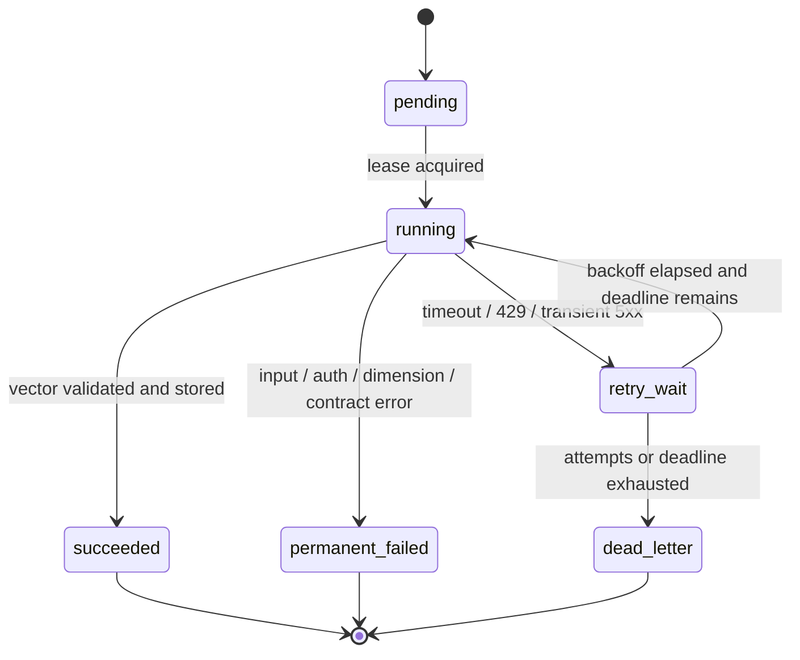

# Embedding 批处理、限流、部分失败与幂等写入

一份文档切成 2,000 个 Chunk 后，最直接的代码是把所有文本传给 Embedding API，再把返回数组按位置写进数据库。它至少有五个问题：请求总 Token 可能超限；某个 Chunk 自身过长；供应商按请求数和 Token 双重限流；响应可能在第 8 批后超时；重跑时可能覆盖或重复写前 7 批。

Embedding 写入不是一个 `for` 循环，而是一条可恢复的数据投影链。输入是带**稳定 ID** 和内容 hash 的 Chunk；中间状态是确定的批次计划、每个片段的 attempt 和供应商请求；输出是与模型 revision、维度和 Release 绑定的向量行。只有每个 required Chunk 都进入成功或明确豁免终态，候选 Release 才能通过。

模型与向量空间确定后，还要解决“怎样稳定地把很多 Chunk 送进模型并写回来”。这里聚焦 Token 装箱、限流、**部分失败**、幂等写入和 Release 对账。

## 为什么批次不能只按条数切

供应商常同时限制：

- 单条输入最大 Token；
- 单请求最多输入条数；
- 单请求总 Token 或总字节；
- 每分钟请求数 RPM；
- 每分钟 Token 数 TPM；
- 同时在途请求数；
- 账号、模型或区域配额。

`batch_size=100` 只满足条数，不知道 100 个 Chunk 各有多长。正确计划器先用**与目标 Embedding 模型匹配的 Tokenizer**计算每条 Token，再按“条数和总 Token 都不超限”装箱。

若单个 Chunk 已超过模型上限，错误属于数据/切片层。它应回到切片器拆分或进入永久失败，而不是不断**重试**同一输入。Token 估算器版本也要记录；更换 Tokenizer 后批次计划可能变化，但 Chunk 与向量幂等键不应仅依赖批次编号。

### 一个装箱例子

限制是每批最多 4 条、总计 8,000 Token。五条输入分别为 2,000、3,000、4,000、1,500、900 Token：

| 批次 | Chunk Token | 总 Token | 原因 |
| --- | --- | ---: | --- |
| 1 | 2,000 + 3,000 | 5,000 | 再放 4,000 会超总量 |
| 2 | 4,000 + 1,500 + 900 | 6,400 | 条数和 Token 都合法 |

计划保存有序 Chunk ID、每条 Token、总 Token 和模型 revision。若响应只返回两个向量，系统可以准确指出第二批缺一条，而不是把短响应按错误位置写回。

## 稳定 ID、内容 hash 和模型 revision 各负责什么

向量行的自然唯一性不是 `chunk_id` 一项。相同 Chunk 内容用新模型重算，应保留新旧两个投影；相同模型下内容改变，也不能沿用旧向量。

一个可解释的幂等键由以下字段组成：

```text
knowledge_release_id
chunk_id
chunk_content_hash
embedding_provider
embedding_model
embedding_revision
embedding_dimension
```

`chunk_id` 表示逻辑位置；`content_hash` 证明输入文本未变；model/revision/dimension 表示投影算法。Release ID 决定在线快照。批次 ID 不进入向量唯一键，因为同一 Chunk 在重排批次或恢复时仍应命中同一向量。

数据库可对这个组合建立唯一约束并执行 upsert。若重复结果与已有向量 hash 一致，视为幂等重放；若相同键返回不同向量，需要记录 nondeterminism 或供应商 revision 漂移，不能静默覆盖。

## 状态要落到片段，不只落到整批

批次是网络请求单位，Chunk 才是发布完整性单位。一批 32 条收到 31 个结果时，批次不能简单标成 succeeded。



每个 Chunk 保存 `attempt_count`、`last_error_code`、`provider_request_id`、`next_retry_at`、`started_at`、`finished_at` 和 Lease。批次保存请求级诊断，但最终状态由每个 Chunk 聚合。

`retry_wait` 表示错误可能暂时恢复；`permanent_failed` 表示相同输入重试没有意义；`dead_letter` 表示本来可重试但预算耗尽。三者决定不同的修复动作，不能都叫 failed。

## 错误分类决定是否重试

| 错误 | 示例 | 默认处理 |
| --- | --- | --- |
| 输入永久错误 | 单条超 Token、空内容、非法编码 | 回切片/修数据，不重试 |
| 契约永久错误 | 返回数量、维度或类型不符 | 隔离供应商响应，停止批次 |
| 认证/权限 | 密钥失效、模型无权使用 | 停止队列并告警，不循环 |
| 限流 | 429、配额暂时耗尽 | 尊重 Retry-After + 抖动 |
| 暂时依赖错误 | 连接断开、部分 5xx | 在绝对 Deadline 内有限重试 |
| Deadline/取消 | Turn/Release 任务已取消 | 传播取消，不重新排队 |

指数退避不能无限延长任务。每次重试都使用原任务的绝对 Deadline；如果下一次 `now + backoff` 已超过 Deadline，直接进入 dead letter 或 cancelled。Retry-After 是上游建议，也必须受本地 Deadline 约束。

## 并发上限与限流器解决不同问题

并发 Semaphore 限制同时在途请求，保护连接池和 Worker 内存；RPM/TPM 限流器控制时间窗口内的配额。只设并发 4 仍可能在一分钟快速发送数百个小请求；只设 RPM 又可能同时发出几十个大请求耗尽连接。

生产调度通常在 provider/model 维度共享配额，而不是每个 Worker 各自认为自己拥有完整额度。集中式令牌桶、队列分区或模型网关可以协调。本文的最小实现只处理批次与重试状态，不伪装成分布式配额系统。

## 实现 Token 装箱

下面的计划器接收已经计算好的 Token 数，输出有序批次。输入中的 `token_count` 应来自目标模型 Tokenizer；为了让示例无需下载模型，这里不实现 Tokenizer 本身。

下面把“先实现 Token 装箱”落成最小实现。代码关注“装箱器同时检查单片段和整批 Token 上限，按稳定顺序分批，避免重试时批次边界漂移”；输入从函数参数或上文定义的状态对象进入，关键分支负责校验或修改状态，返回值再交给后续调用。

```python
# 装箱器同时检查单片段和整批 Token 上限，按稳定顺序分批，避免重试时批次边界漂移。
from __future__ import annotations

from dataclasses import dataclass

@dataclass(frozen=True)
class ChunkInput:
    chunk_id: str
    content_hash: str
    text: str
    token_count: int

@dataclass(frozen=True)
class BatchPlan:
    chunk_ids: tuple[str, ...]
    total_tokens: int

def plan_batches(
    chunks: list[ChunkInput],
    *,
    max_items: int,
    max_tokens: int,
) -> list[BatchPlan]:
    if max_items < 1 or max_tokens < 1:
        raise ValueError("batch limits must be positive")

    # plans 保存已经完成的批次；current_ids 只表示尚未提交的当前批。
    plans: list[BatchPlan] = []
    current_ids: list[str] = []
    current_tokens = 0

    # 逐项保留正文之外的来源和稳定标识，后续引用才能回到原始位置。
    for chunk in chunks:
        if chunk.token_count < 1:
            raise ValueError(f"{chunk.chunk_id}: empty embedding input")
        if chunk.token_count > max_tokens:
            raise ValueError(f"{chunk.chunk_id}: input exceeds model token limit")

        # 同时检查条数和 Token 两个上限，任一达到边界都要结束当前批。
        would_overflow = (
            len(current_ids) == max_items
            or current_tokens + chunk.token_count > max_tokens
        )
        # 加入当前片段会超过条数或 Token 上限时，先封装已有批次再清空累积器。
        if current_ids and would_overflow:
            plans.append(BatchPlan(tuple(current_ids), current_tokens))
            current_ids = []
            current_tokens = 0

        current_ids.append(chunk.chunk_id)
        current_tokens += chunk.token_count

    if current_ids:
        plans.append(BatchPlan(tuple(current_ids), current_tokens))
    return plans
```

函数先拒绝非法批次配置。遍历 Chunk 时，单条空输入和超模型上限直接抛永久错误；`would_overflow` 同时检查条数与总 Token。当前批次已有内容且加入新条目会超限时，先封箱，再把当前 Chunk 加入新批次。最后补上尾批。

输入顺序决定批次顺序，便于响应位置对账。更高级的装箱算法可以减少空余 Token，但若重排输入，仍要保存 `chunk_ids` 映射，不能只依赖位置猜测。

## 实现可重放写入器

下一个示例把远程 Provider 抽象成协议，把存储抽象为以幂等键为索引的字典。故障注入 Provider 会让指定 Chunk 第一次超时，便于观察恢复。

下面把“实现可重放写入器”落成最小实现。代码关注“写入器按片段状态处理部分成功；幂等键命中时跳过已完成项，只重放可重试失败”；输入从函数参数或上文定义的状态对象进入，关键分支负责校验或修改状态，返回值再交给后续调用。

```python
# 写入器按片段状态处理部分成功；幂等键命中时跳过已完成项，只重放可重试失败。
from dataclasses import dataclass
from hashlib import sha256
from typing import Protocol

@dataclass(frozen=True)
class VectorRecord:
    idempotency_key: str
    chunk_id: str
    model_revision: str
    vector: tuple[float, ...]

class EmbeddingProvider(Protocol):
    def embed(self, texts: list[str]) -> list[tuple[float, ...]]: ...

class OneShotFailureProvider:
    def __init__(self, failing_text: str) -> None:
        self.failing_text = failing_text
        self.failed_once = False
        self.calls: list[tuple[str, ...]] = []

    def embed(self, texts: list[str]) -> list[tuple[float, ...]]:
        self.calls.append(tuple(texts))
        # 先检查当前状态是否允许继续推进，避免终态被重复任务或迟到结果覆盖。
        if self.failing_text in texts and not self.failed_once:
            self.failed_once = True
            # 这一错误会由上层映射为超时或拒绝终态，不会继续执行后续副作用。
            raise TimeoutError("temporary provider timeout")
        return [
            (float(len(text)), float(sum(text.encode("utf-8")) % 997))
            for text in texts
        ]

def vector_key(release_id: str, chunk: ChunkInput, model_revision: str) -> str:
    raw = "\x00".join(
        [release_id, chunk.chunk_id, chunk.content_hash, model_revision]
    )
    return sha256(raw.encode("utf-8")).hexdigest()

def write_batch(
    *,
    release_id: str,
    chunks: list[ChunkInput],
    model_revision: str,
    expected_dimension: int,
    provider: EmbeddingProvider,
    store: dict[str, VectorRecord],
) -> list[str]:
    pending = [
        chunk
        # 逐项保留正文之外的来源和稳定标识，后续引用才能回到原始位置。
        for chunk in chunks
        if vector_key(release_id, chunk, model_revision) not in store
    ]
    if not pending:
        return []

    vectors = provider.embed([chunk.text for chunk in pending])
    # 数量约束用于发现截断、重复或越界返回，失败时不能把不完整结果交给下一步。
    if len(vectors) != len(pending):
        raise RuntimeError("provider result count does not match input count")
    # 数量约束用于发现截断、重复或越界返回，失败时不能把不完整结果交给下一步。
    if any(len(vector) != expected_dimension for vector in vectors):
        raise RuntimeError("provider vector dimension mismatch")

    staged = [
        VectorRecord(
            vector_key(release_id, chunk, model_revision),
            chunk.chunk_id,
            model_revision,
            vector,
        )
        for chunk, vector in zip(pending, vectors, strict=True)
    ]
    for record in staged:
        store.setdefault(record.idempotency_key, record)
    return [record.chunk_id for record in staged]
```

`OneShotFailureProvider` 记录真实调用输入，并只让包含目标文本的第一次请求超时。`vector_key` 把 Release、Chunk、内容 hash 与模型 revision 组合后计算 SHA-256；改变模型或内容会得到新键。

`write_batch` 先过滤已成功键，因此恢复时不会再次请求它们。Provider 返回后先整体校验数量和维度，再构建 `staged`；只有全部响应合法才写入 store，避免前半段写成功、后半段发现维度错误。`setdefault` 模拟唯一约束下的幂等插入，真实数据库应在一个短事务里 upsert 当前批次。

超时没有在函数内部吞掉。任务层负责把当前 Chunk 标成 retry_wait、计算下一次时间并重调 `write_batch`。取消异常也应原样传播。

## 用故障注入验证部分恢复

下面的测试先写第一批，再让第二批超时。恢复时重新提交全部 Chunk，写入器会跳过第一批成功键，只调用缺失项。

为了验证“用故障注入验证部分恢复”，下面的测试把“故障注入让一个批次部分失败，再次运行时断言成功片段未重复请求，失败片段被单独恢复”变成可执行断言。每个用例自己构造输入，并用断言固定返回值或失败状态；某条测试失败时，可以从用例名直接定位到被破坏的契约。

```python
# 故障注入让一个批次部分失败，再次运行时断言成功片段未重复请求，失败片段被单独恢复。
def make_chunk(chunk_id: str, text: str, tokens: int) -> ChunkInput:
    digest = sha256(text.encode("utf-8")).hexdigest()
    return ChunkInput(chunk_id, digest, text, tokens)

# 这个用例把时间推进到截止边界，确认超时保持独立错误语义并释放资源。
def test_successful_vectors_are_not_recomputed_after_timeout() -> None:
    first = make_chunk("c-1", "访问申请", 20)
    second = make_chunk("c-2", "发布条件", 20)
    provider = OneShotFailureProvider("发布条件")
    store: dict[str, VectorRecord] = {}

    assert write_batch(
        release_id="release-8",
        chunks=[first],
        model_revision="embedding-v1",
        expected_dimension=2,
        provider=provider,
        store=store,
    ) == ["c-1"]

    # 从这里进入可能失败的外部边界，下面只转换已经明确分类的异常。
    try:
        write_batch(
            release_id="release-8",
            chunks=[second],
            model_revision="embedding-v1",
            expected_dimension=2,
            provider=provider,
            store=store,
        )
    # 超时表示依赖没有在预算内返回；保留超时语义，不能伪装成空结果。
    except TimeoutError:
        pass

    written = write_batch(
        release_id="release-8",
        chunks=[first, second],
        model_revision="embedding-v1",
        expected_dimension=2,
        provider=provider,
        store=store,
    )

    assert written == ["c-2"]
    assert len(store) == 2
    assert provider.calls == [("访问申请",), ("发布条件",), ("发布条件",)]

def test_model_revision_creates_a_new_projection() -> None:
    chunk = make_chunk("c-1", "访问申请", 20)
    provider = OneShotFailureProvider("never")
    store: dict[str, VectorRecord] = {}

    for revision in ("embedding-v1", "embedding-v2"):
        write_batch(
            release_id="release-8",
            chunks=[chunk],
            model_revision=revision,
            expected_dimension=2,
            provider=provider,
            store=store,
        )

    assert {row.model_revision for row in store.values()} == {
        "embedding-v1",
        "embedding-v2",
    }
```

第一条的 `provider.calls` 是关键证据：成功的“访问申请”只计算一次，失败的“发布条件”计算两次。第二条证明模型升级产生新投影，不覆盖 v1。运行 `python3 -m pytest -q` 应看到两条通过。测试输入通过故障 Provider 控制第一次调用抛出超时，第二次执行复用已写状态；若返回数量或维度异常，写入函数应在修改存储前失败，集成测试还要断言批次错误码和 Chunk 状态可查询。

## 远程批次返回时怎样对账

不要假定所有 API 都永远按输入顺序返回。若协议有显式 `index`，按 index 映射；若是异步 Batch API，保存供应商 item ID 与 Chunk ID 映射；若响应既无 index 又不保证顺序，就不能安全批量写回，应缩小调用或更换契约。

对账顺序是：请求 ID 匹配、结果数量、每项位置/ID、向量数值类型、维度、有限值检查、模型 revision、使用量字段。全部通过后再提交数据库事务。NaN/Infinity 也应拒绝，否则距离计算会产生异常结果。

## Release 怎样判断向量投影完整

发布验证器按 Release 和 model revision 统计：

```text
expected_chunk_count
succeeded_vector_count
retry_wait_count
permanent_failed_count
dead_letter_count
dimension_mismatch_count
duplicate_key_count
```

`expected == succeeded` 只是数量基础，还要抽样验证 content hash、模型 revision 与向量有限值。任何 running/retry_wait 表示任务未结束；permanent_failed/dead_letter 默认阻断 required RAG 投影。人工豁免必须记录理由和范围，不能由 Worker 自行忽略。

## 排查与迁移检查表

遇到“向量写了大半后卡住”时按以下顺序看：

1. 候选 Release、模型 revision 和 expected Chunk 数；
2. 单条与单批 Token 是否超限，批次计划是否稳定；
3. provider 请求 ID、返回数量、维度和错误分类；
4. RPM/TPM 与并发槽是否共享，是否存在重试风暴；
5. Chunk attempt、Lease、next retry 和绝对 Deadline；
6. 幂等唯一键是否包含内容 hash 与模型 revision；
7. 成功批次是否原子写入，失败恢复是否只取缺失键；
8. dead letter 是否有可执行修复动作；
9. Release 检查是否仍保持旧 active 可用。

排查结束时，应能把 Token 装箱、网络批次、片段状态、**幂等写入**和 Release 门禁分别说清楚，并能通过故障注入证明部分成功不会重复计算。

## 常见问题

### 为什么 Embedding 批次不能只按“每批 100 条”切？

模型限制通常同时包含单条 Token、整批 Token、条数、请求字节、RPM 和 TPM。100 个短标题可能很小，100 个长片段可能直接超限。装箱器应先估算每个 Chunk 的 Token，拒绝单条越界，再按稳定顺序把片段放入不超过总预算的批次。批次计划需要可重建，避免重试时边界变化。真实请求返回后还要核对输出数量与输入顺序，不能假设供应商永远完整返回。

### 并发上限和速率限制是不是一回事？

不是。并发上限控制同时占用多少连接、内存和模型请求，速率限制控制一个时间窗口内的请求数或 Token 数。并发很低仍可能因单批很大超过 TPM，并发很高也可能在限流器放行后瞬间耗尽本地连接。生产中通常先取得全局与供应商配额，再用共享并发槽执行；收到 429 时读取可用重试信息并退避，同时受绝对 Deadline 限制，不能让每个 Worker 自己无限重试。

### 为什么状态要落到每个 Chunk，而不是只记录批次成功或失败？

远端可能部分成功、超时前已处理一部分，或返回数量与输入不一致。只记录批次状态会迫使系统重算全部，既浪费成本又可能覆盖正确向量。Chunk 级状态保存稳定 ID、内容 hash、模型 revision、attempt、终态和错误码；成功项通过唯一键幂等写入，失败项单独重排批次。批次只是传输优化，片段才是可重放和发布对账的业务单位。

### 哪些 Embedding 错误可以重试？

短暂网络错误、明确的 429 或服务端暂时失败，在剩余 Deadline 足够时可以退避重试；空文本、单条超 Token、维度不符、模型不存在和权限拒绝通常属于永久错误，应进入可诊断终态。解析不出的响应先按供应商契约故障处理，不能假装空向量。错误分类要写入片段状态和 dead letter，并给出修复动作，否则 Worker 会把不可修复输入循环到任务耗尽。

### 幂等键为什么要包含内容 hash 和模型 revision？

同一 Chunk ID 的正文可能更新，同一模型 ID 也可能发布新 revision。只用 Chunk ID 会让新内容错误复用旧向量；只用内容 hash 又无法区分不同向量空间。唯一键通常包含 Release 或文档版本、稳定 Chunk ID、内容 hash、模型 ID/revision 和向量维度。重试相同输入命中同一投影，内容或模型变化则生成新版本。激活后按 Retriever 配置选择，不在原记录上无痕覆盖。

### Release 数量对账相等，就能证明向量正确吗？

只能证明基础完整性。还要抽样检查每个向量对应的 Chunk ID、内容 hash 和模型 revision，确认维度正确、数值有限、顺序没有错位，并运行固定查询集验证召回。`expected == succeeded` 但批量响应顺序错配时，数量仍完全相等，检索却会把查询指向错误正文。任何 retry_wait、dead letter 或维度异常都应阻断 required 投影，除非有明确记录的人工豁免范围。
